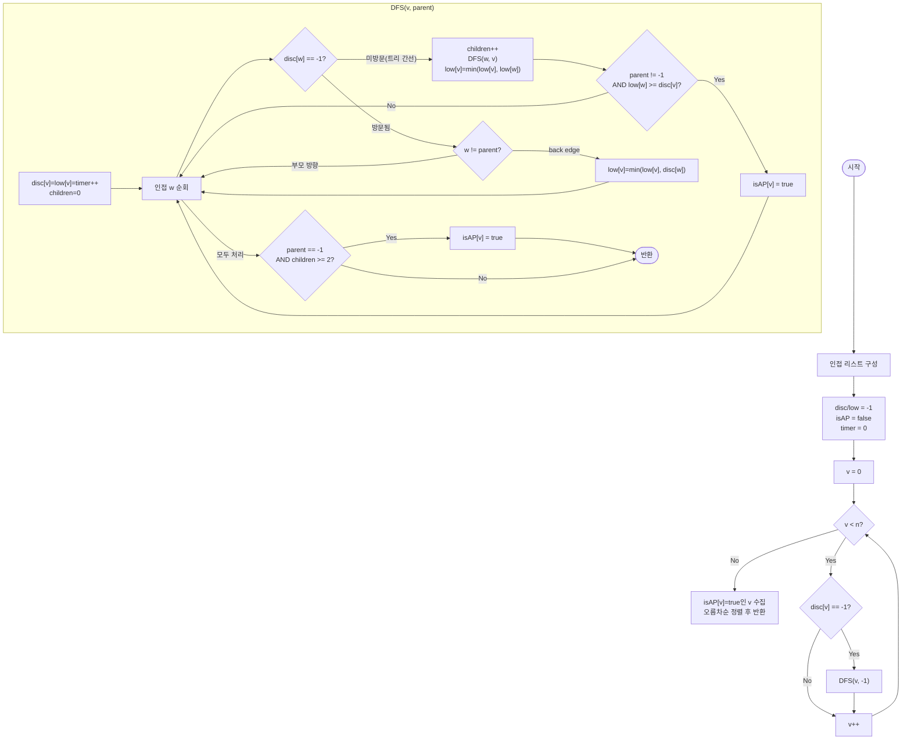

import { AlgorithmSimulation } from "#guide-sim";

# articulationPoints 해설

## 성능 목표 예측

| 제약 | 값 |
|------|----|
| 정점 수 $V$ | $1 \leq V \leq 10^5$ |
| 간선 수 $E$ | $0 \leq E \leq 10^5$ |
| 정점 번호 | $0 \ldots n-1$ |
| 그래프 종류 | 무향 |

**naive 접근의 비용**: 각 정점 $v$를 제거한 뒤 연결 성분 수가 바뀌는지 BFS/DFS로 확인한다.
정점 $V$개 × BFS 비용 $O(V + E)$ = $O(V(V + E))$.
$V = E = 10^5$이면 약 $10^{10}$ 연산 → 시간 초과.

**목표**: DFS 한 번으로 모든 단절점을 찾는다. 시간 $O(V + E)$, 공간 $O(V + E)$.

왜 이 복잡도면 충분한가? $V + E \leq 2 \times 10^5$이므로 단일 DFS는 수백만 연산 이내이다.

**공간 트레이드오프**: 인접 리스트(공간 $O(V + E)$)를 쓴다. 인접 행렬($O(V^2)$)은 $10^{10}$ 바이트로 불가하다.

---

## 목표 함수

```ts
function articulationPoints(n: number, edges: [number, number][]): number[]
```

| 파라미터 | 의미 | 제약 |
|----------|------|------|
| `n` | 정점 수 | $1 \leq n \leq 10^5$ |
| `edges` | 무향 간선 목록 `[u, v]` | $0 \leq E \leq 10^5$ |
| 반환 | 단절점 번호의 **오름차순** 배열 | — |

**엣지케이스**

1. **간선 없음** ($E = 0$): 고립 정점은 제거해도 연결 성분 수가 변하지 않는다. 단절점 없음 → `[]`.
2. **트리** ($E = V - 1$): 내부 정점(degree ≥ 2)은 모두 단절점 후보이다. 리프는 단절점이 아니다.
3. **완전 그래프** $K_n$ ($n \geq 2$): 정점 하나를 제거해도 나머지가 여전히 완전 연결. 단절점 없음 → `[]`.
4. **선형 경로** $0 - 1 - 2 - \cdots - k$: 양 끝 정점 제외 나머지 전부 단절점.

---

## 핵심 아이디어

**핵심 아이디어**: "그래프 전체를 매번 다시 뒤지는 대신, DFS 한 번으로 '서브트리가 얼마나 위로 올라갈 수 있는가'를 동시에 계산한다."

정점 하나를 제거했을 때 그래프가 끊어지는지 일일이 확인하면 $O(V(V+E))$로 너무 느리다. DFS로 각 정점에 발견 시각(`disc`)을 부여하고, 서브트리에서 back edge를 통해 도달 가능한 가장 오래된 조상의 시각(`low`)을 기록하면, 자식 서브트리가 부모를 거치지 않고 조상에 닿을 수 있는지 한 번에 판별할 수 있다. 이 두 값만으로 단절점 여부가 결정되므로 DFS 한 번($O(V+E)$)으로 모든 단절점을 찾는다.

**풀이 구조**
1. 인접 리스트를 구성하고 `disc`, `low`, `isAP` 배열을 초기화한다.
2. 미방문 정점을 출발점으로 DFS를 수행하며, 방문 시 `disc[v] = low[v] = timer++`로 기록한다.
3. 트리 간선으로 자식 `w`를 탐색한 후 `low[v] = min(low[v], low[w])`로 서브트리의 도달 범위를 전파한다.
4. back edge `(v, w)`를 만나면 `low[v] = min(low[v], disc[w])`로 갱신한다.
5. DFS 루트는 자식 수 ≥ 2, 나머지 정점은 `low[w] >= disc[v]`인 자식이 있으면 단절점으로 표시한다.
6. `isAP[v] == true`인 정점을 오름차순 정렬하여 반환한다.

**조건**: 무향 그래프. 단절점이 존재하려면 사이클이 없는 구간, 즉 서브트리가 조상으로 우회할 back edge가 없어야 한다.

**대표 예시**: 선형 경로 그래프 `0 — 1 — 2 — 3`
이 경우 정점 1과 2를 제거하면 그래프가 분리된다. `disc = [0,1,2,3]`, `low = [0,0,1,2]`이므로 `low[2] = 1 >= disc[1] = 1` → 정점 1이 단절점, `low[3] = 2 >= disc[2] = 2` → 정점 2도 단절점이다. 양 끝 정점(0, 3)은 리프이므로 단절점이 아니다.

**언제 쓰나**
"이 서버(정점)가 다운되면 네트워크가 분리되는가?" 류의 문제, 또는 그래프에서 핵심 허브 정점을 찾는 문제에서 사용한다. 무향 그래프에서 연결 취약점을 $O(V+E)$로 찾아야 할 때 적합하다.

---

### 원형 아이디어와 naive 접근

가장 단순한 방법은 다음과 같다.

```
for v in 0..n-1:
  G' = G에서 v를 제거한 그래프
  if connected_components(G') > connected_components(G):
    v는 단절점
```

각 반복에서 BFS/DFS $O(V + E)$가 실행되므로 전체 $O(V(V + E))$이다.
$V = 10^5$이면 $10^{10}$ → 시간 초과.

문제의 근원: 정점을 하나씩 제거할 때마다 그래프 전체를 다시 탐색한다. 탐색 과정에서 누적된 정보를 버리는 것이 낭비이다.

### 어떤 관찰이 돌파구가 되는가

- **관찰 1**: DFS 트리를 만들면 그래프의 간선이 "트리 간선(tree edge)"과 "역방향 간선(back edge)"으로 분류된다.
- **관찰 2**: 정점 $v$를 제거했을 때 자식 서브트리가 $v$의 조상에 도달할 수 있는지 여부만 따지면 된다. 도달 가능하면 $v$ 없이도 조상과 연결되므로 $v$는 단절점이 아니다.
- **관찰 3**: 각 정점의 서브트리가 "얼마나 위로 올라갈 수 있는가"는 DFS 과정에서 단 한 번의 통과로 모든 정점에 대해 동시에 계산할 수 있다.

### 관찰을 형식화: 상태/구조 정의

각 정점 $v$에 두 값을 정의한다.

$$\text{disc}(v) = \text{DFS 진행 중 } v \text{를 처음 방문한 타임스탬프 (0-indexed)}$$

$$\text{low}(v) = \min\!\left(\text{disc}(v),\;
  \min_{(v,\,w)\,\in\,\text{back edge}} \text{disc}(w),\;
  \min_{(v,\,c)\,\in\,\text{tree edge}} \text{low}(c)\right)$$

$\text{low}(v)$의 직관: "$v$의 서브트리에서 back edge를 통해 도달 가능한 가장 오래된(disc가 작은) 조상의 타임스탬프."
이 값이 작을수록 서브트리가 더 높은 조상까지 올라갈 수 있다.

왜 이 형태인가? 정점 하나 또는 간선 하나의 속성으로 단절점을 판별하려면, 그 정점의 서브트리 전체 정보를 하나의 스칼라로 요약해야 한다. $\text{low}$는 "올라갈 수 있는 최대 높이"를 정확히 요약하는 최소 정보이다. 집합 자체를 저장하면 $O(V^2)$ 공간이 필요해 불가하다.

### 점화식 또는 핵심 연산

DFS(v, parent)를 실행할 때 $\text{low}(v)$를 다음 순서로 갱신한다.

1. 초기화: $\text{disc}(v) \leftarrow \text{low}(v) \leftarrow \text{timer}$, $\text{timer}$++
2. 인접 정점 $w$에 대해:
   - $w$가 미방문(트리 간선): DFS$(w)$ 재귀 후 $\text{low}(v) \leftarrow \min(\text{low}(v),\, \text{low}(w))$
   - $w$가 방문됨이고 $w \neq \text{parent}$이면 (back edge): $\text{low}(v) \leftarrow \min(\text{low}(v),\, \text{disc}(w))$
   - $w = \text{parent}$이면 스킵 (부모로 돌아가는 간선은 back edge가 아님)

단절점 판정은 두 가지 경우로 나뉜다.

$$\text{isAP}(v) = \begin{cases}
\text{children}(v) \geq 2 & \text{if } v = \text{DFS root} \\
\exists\,c\,(\text{child of }v):\; \text{low}(c) \geq \text{disc}(v) & \text{otherwise}
\end{cases}$$

각 항의 의미:
- $\text{children}(v) \geq 2$: 루트를 제거하면 자식들의 서브트리가 서로 단절된다.
- $\text{low}(c) \geq \text{disc}(v)$: 자식 $c$의 서브트리가 $v$보다 위로 올라가지 못한다. 즉 $v$ 없이는 $c$의 서브트리가 $v$의 조상에 도달 불가.

### 정당성 — 왜 이것이 옳은가

귀납적으로 증명한다. DFS가 진행되면서 $\text{low}(v)$는 $v$의 서브트리에서 back edge를 통해 실제로 도달 가능한 가장 오래된 정점의 disc를 정확히 담는다.

$\text{low}(c) \geq \text{disc}(v)$일 때, $c$의 서브트리에서 $v$ 위의 조상으로 가는 back edge가 없다. 따라서 $v$를 제거하면 $c$와 $c$의 서브트리는 그래프의 나머지 부분으로부터 완전히 분리된다.

까다로운 케이스: $\text{low}(c) = \text{disc}(v)$일 때 — $c$의 서브트리에서 back edge가 정확히 $v$에 닿는다. $v$를 제거하면 이 back edge도 사라지므로 여전히 단절이다. 그래서 등호 포함($\geq$)이다.

루트 특수 처리의 이유: DFS 루트는 부모가 없어 $\text{low}(c) \geq \text{disc}(\text{root})$가 항상 성립할 수 있다. 대신 자식이 2개 이상인지를 세어 판별한다.

### 구현 디테일과 최적화

**공간 절감**: 재귀 대신 명시적 스택을 사용하면 콜 스택 오버플로우를 방지한다. $V = 10^5$에서 재귀 깊이가 $10^5$이 될 수 있다.

**다중 간선 처리 함정**: 부모 방향 간선을 "정점 번호"로 스킵하면 $(u, v)$ 간선이 두 개 이상 존재할 때 오류가 생긴다. 부모 방향을 간선 인덱스로 추적해야 한다. 단절점에서는 이 문제가 다리(bridge)보다 덜 심각하지만, 구현의 일관성을 위해 인덱스 추적이 권장된다.

**중복 단절점 등록 방지**: 하나의 정점 $v$에 여러 자식 $c_1, c_2, \ldots$에 대해 $\text{low}(c_i) \geq \text{disc}(v)$가 성립할 수 있다. `isAP` 불리언 배열을 사용하면 중복 추가를 막는다.

**루프 순서 함정**: DFS 재귀가 끝난 뒤에 $\text{low}(v)$를 갱신해야 한다. 재귀 호출 전에 갱신하면 자식의 $\text{low}$ 값이 아직 계산되지 않은 상태이다.

---

## 시뮬레이션

예시 무향 그래프 `n = 5`, `edges = [[0,1], [1,2], [2,0], [1,3], [3,4]]`에 대해 DFS로 `disc`(방문 시각)와 `low`(서브트리가 back edge로 닿는 가장 오래된 시각)를 계산하는 과정이다. 노드 위 표기는 `disc/low`(−는 미방문)이다. 빨간색은 현재 정점(active), 노란색은 DFS 스택(frontier), 회색은 완료(visited)이다. 삼각형 `0-1-2`는 사이클(back edge 보유), `1-3-4`는 꼬리다.

실제 반환값은 `[1, 3]` 이며(1을 제거하면 3,4가, 3을 제거하면 4가 분리됨), 시뮬레이션 마지막 프레임과 일치한다.

> 대화형 시뮬레이션은 MDX 런타임에서 표시됩니다.

export const nodes = [
  { id: 0, label: "0", x: 25, y: 25 },
  { id: 1, label: "1", x: 50, y: 50 },
  { id: 2, label: "2", x: 25, y: 78 },
  { id: 3, label: "3", x: 75, y: 38 },
  { id: 4, label: "4", x: 92, y: 70 },
];

export const edges = [
  { from: 0, to: 1, directed: false },
  { from: 1, to: 2, directed: false },
  { from: 2, to: 0, directed: false },
  { from: 1, to: 3, directed: false },
  { from: 3, to: 4, directed: false },
];

export const steps = [
  {
    title: "초기화",
    detail: "disc/low 모두 미설정. 0에서 DFS 시작.",
    nodes, edges,
    nodeStatus: {},
    nodeValue: { 0: "−", 1: "−", 2: "−", 3: "−", 4: "−" },
    entries: [
      { label: "disc", value: "[-, -, -, -, -]" },
      { label: "low", value: "[-, -, -, -, -]" },
      { label: "단절점", value: "[]" },
    ],
  },
  {
    title: "DFS(0)",
    detail: "disc[0]=low[0]=0. 스택에 0.",
    nodes, edges,
    nodeStatus: { 0: "active" },
    nodeValue: { 0: "0/0", 1: "−", 2: "−", 3: "−", 4: "−" },
    entries: [
      { label: "disc", value: "[0, -, -, -, -]" },
      { label: "low", value: "[0, -, -, -, -]" },
      { label: "단절점", value: "[]" },
    ],
  },
  {
    title: "DFS(1), DFS(2)",
    detail: "트리 간선 0→1→2 진입. disc[1]=1, disc[2]=2.",
    nodes, edges,
    nodeStatus: { 0: "frontier", 1: "frontier", 2: "active" },
    nodeValue: { 0: "0/0", 1: "1/1", 2: "2/2", 3: "−", 4: "−" },
    entries: [
      { label: "disc", value: "[0, 1, 2, -, -]" },
      { label: "low", value: "[0, 1, 2, -, -]" },
      { label: "단절점", value: "[]" },
    ],
  },
  {
    title: "back edge 2 → 0",
    detail: "2에서 방문된 0(부모 아님)으로 가는 back edge → low[2]=min(2, disc[0]=0)=0.",
    nodes, edges,
    nodeStatus: { 0: "frontier", 1: "frontier", 2: "active" },
    nodeValue: { 0: "0/0", 1: "1/1", 2: "2/0", 3: "−", 4: "−" },
    activeEdge: { from: 2, to: 0 },
    entries: [
      { label: "disc", value: "[0, 1, 2, -, -]" },
      { label: "low", value: "[0, 1, 0, -, -]" },
      { label: "단절점", value: "[]" },
    ],
  },
  {
    title: "2 반환 → low[1] 전파",
    detail: "low[1]=min(1, low[2]=0)=0. 자식 2: low[2]=0 < disc[1]=1 이므로 1은 (아직) 단절점 아님.",
    nodes, edges,
    nodeStatus: { 0: "frontier", 1: "active", 2: "visited" },
    nodeValue: { 0: "0/0", 1: "1/0", 2: "2/0", 3: "−", 4: "−" },
    entries: [
      { label: "disc", value: "[0, 1, 2, -, -]" },
      { label: "low", value: "[0, 0, 0, -, -]" },
      { label: "단절점", value: "[]" },
    ],
  },
  {
    title: "DFS(3), DFS(4)",
    detail: "트리 간선 1→3→4. disc[3]=3, disc[4]=4. 4는 back edge 없음 → low[4]=4.",
    nodes, edges,
    nodeStatus: { 0: "frontier", 1: "frontier", 2: "visited", 3: "frontier", 4: "active" },
    nodeValue: { 0: "0/0", 1: "1/0", 2: "2/0", 3: "3/3", 4: "4/4" },
    entries: [
      { label: "disc", value: "[0, 1, 2, 3, 4]" },
      { label: "low", value: "[0, 0, 0, 3, 4]" },
      { label: "단절점", value: "[]" },
    ],
  },
  {
    title: "반환: 단절점 판정",
    detail: "4 반환 → low[4]=4 ≥ disc[3]=3 → 3 단절점. 3 반환 → low[3]=3 ≥ disc[1]=1 → 1 단절점.",
    nodes, edges,
    nodeStatus: { 0: "visited", 1: "active", 2: "visited", 3: "active", 4: "visited" },
    nodeValue: { 0: "0/0", 1: "1/0", 2: "2/0", 3: "3/3", 4: "4/4" },
    entries: [
      { label: "disc", value: "[0, 1, 2, 3, 4]" },
      { label: "low", value: "[0, 0, 0, 3, 4]" },
      { label: "단절점", value: "[1, 3]" },
    ],
  },
  {
    title: "완료: [1, 3]",
    detail: "루트 0은 자식이 1개라 단절점 아님. 빨간 정점 1, 3이 단절점이다.",
    nodes, edges,
    nodeStatus: { 0: "visited", 1: "active", 2: "visited", 3: "active", 4: "visited" },
    nodeValue: { 0: "0/0", 1: "1/0", 2: "2/0", 3: "3/3", 4: "4/4" },
    entries: [
      { label: "disc", value: "[0, 1, 2, 3, 4]" },
      { label: "low", value: "[0, 0, 0, 3, 4]" },
      { label: "단절점", value: "[1, 3]" },
    ],
  },
];

<AlgorithmSimulation view={["graph", "keyValue"]} steps={steps} title="단절점 (DFS disc/low)" />

## 수도 코드와 Activity Diagram

### 의사코드

```
timer = 0
disc[0..n-1] = -1          -- -1: 미방문
low[0..n-1]  = -1
isAP[0..n-1] = false

function dfs(v, parent):
  disc[v] = low[v] = timer++    -- 불변식: disc[v]는 방문 순서; 이후 불변
  children = 0                  -- 불변식: children = DFS 트리상 v의 자식 수

  for w in adj[v]:
    if disc[w] == -1:            -- 트리 간선
      children++
      dfs(w, v)
      low[v] = min(low[v], low[w])  -- 자식 서브트리의 reach를 v로 전파

      if parent != -1 and low[w] >= disc[v]:
        isAP[v] = true           -- 불변식: low[w] >= disc[v] → v 없이 w는 조상 불가

    elif w != parent:            -- back edge (부모 방향 아님)
      low[v] = min(low[v], disc[w])  -- back edge로 올라갈 수 있는 최소 disc

  if parent == -1 and children >= 2:
    isAP[v] = true               -- 루트 판정

function articulationPoints(n, edges):
  인접 리스트 구성 (무향: 양방향)
  for v in 0..n-1:
    if disc[v] == -1: dfs(v, -1)
  result = [v for v in 0..n-1 if isAP[v]]
  result.sort()
  return result
```

**핵심 불변식:**
$\text{low}(v)$는 $v$의 서브트리에서 back edge로 도달 가능한 가장 작은 $\text{disc}$ 값이다. $\text{low}(c) \geq \text{disc}(v)$는 "$c$의 서브트리는 $v$보다 위로 올라갈 수 없음"을 의미한다.

### Activity Diagram


