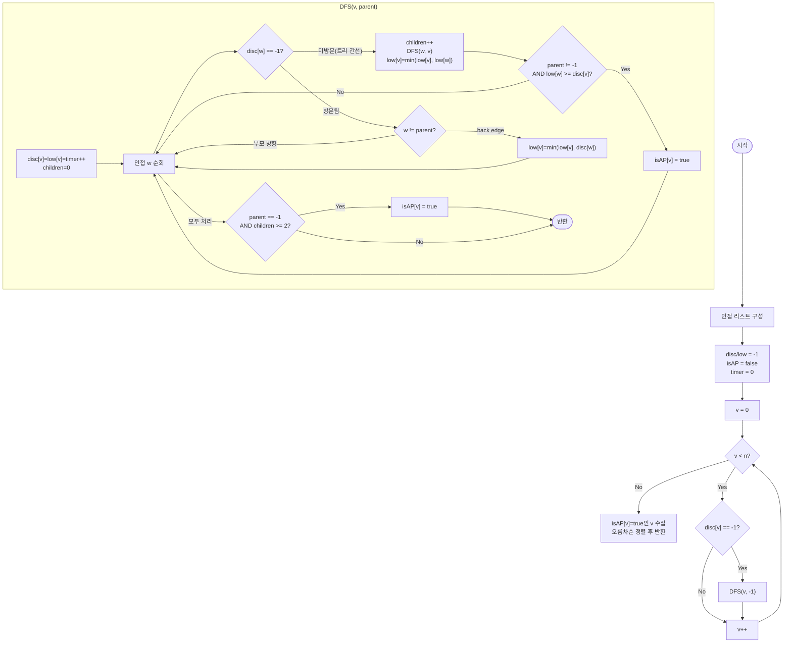

import { AlgorithmSimulation } from "#guide-sim";

# articulationPoints — DFS 한 번으로 "이 정점이 사라지면 끊어지는가"를 동시에 재는 법

## 한눈에 보는 컨셉

정점을 하나씩 제거하며 그래프가 끊어지는지 매번 확인하면 정점 수만큼 전체 탐색을 반복하게 됩니다. 이 가이드는 DFS를 **딱 한 번만** 돌면서, 각 정점의 서브트리가 부모를 거치지 않고 조상까지 거슬러 올라갈 수 있는 가장 높은 지점(`low`)을 방문 시각(`disc`)과 함께 계산합니다. 이 두 숫자만 비교하면 정점이 사라졌을 때 그래프가 쪼개지는지를 `O(1)`에 판별할 수 있어, 전체는 `O(V+E)`에 끝납니다.

## 출발점: 가장 순진한 방법부터

문제를 먼저 정확히 잡을게요.

```ts
function articulationPoints(n: number, edges: [number, number][]): number[]
```

| 파라미터 | 의미 | 제약 |
|----------|------|------|
| `n` | 정점 수, 번호는 $0 \ldots n-1$ | $1 \leq n \leq 10^5$ |
| `edges` | 무향 간선 목록 `[u, v]` | $0 \leq E \leq 10^5$ |
| 반환 | 단절점(제거 시 연결 성분이 늘어나는 정점) 번호를 오름차순 정렬한 배열 | 없으면 `[]` |

**엣지케이스**

- 정점이 1개이거나 간선이 아예 없으면 단절점이 없습니다(제거해도 나눠질 대상이 없으니까요).
- 자기 루프 `[v, v]`는 단절점 판별에 영향을 주지 않습니다(자기 자신으로 돌아가는 간선은 다른 정점과의 연결에 아무 정보도 더해 주지 않습니다).
- 그래프가 이미 여러 성분으로 나뉘어 있어도, 각 성분 안에서 독립적으로 단절점을 찾아야 합니다.

가장 정직한 방법은 정점을 하나씩 제거해 보며 연결 성분 수가 늘어나는지 세는 겁니다.

```text
그래프: 0 - 1 - 2   (baseline 컴포넌트 수 = 1)

v=0 제거 → 남은 그래프 {1-2}     컴포넌트 수 1   (1 > 1? 아니오) → 단절점 아님
v=1 제거 → 남은 그래프 {0} {2}   컴포넌트 수 2   (2 > 1? 예)     → 단절점
v=2 제거 → 남은 그래프 {0-1}     컴포넌트 수 1   (1 > 1? 아니오) → 단절점 아님
```

코드로 그대로 옮기면 이렇습니다.

```ts
function countComponents(n: number, adj: number[][], removed: number): number {
  const visited = new Array<boolean>(n).fill(false);
  visited[removed] = true; // 제거된 정점은 컴포넌트 계산에서 제외
  let count = 0;
  for (let s = 0; s < n; s++) {
    if (visited[s]) continue;
    count++;
    const stack = [s];
    visited[s] = true;
    while (stack.length > 0) {
      const v = stack.pop()!;
      for (const w of adj[v]) if (!visited[w]) { visited[w] = true; stack.push(w); }
    }
  }
  return count;
}

function articulationPointsNaive(n: number, edges: [number, number][]): number[] {
  const adj: number[][] = Array.from({ length: n }, () => []);
  for (const [u, v] of edges) { if (u === v) continue; adj[u].push(v); adj[v].push(u); }
  const baseline = countComponents(n, adj, -1);
  const result: number[] = [];
  for (let v = 0; v < n; v++) {
    const adjWithoutV = adj.map((list) => list.filter((w) => w !== v));
    const after = countComponents(n, adjWithoutV, v);
    if (after > baseline) result.push(v); // v의 컴포넌트가 2조각 이상으로 쪼개졌을 때만 초과
  }
  return result;
}
```

왜 이게 느린가: 정점마다 그래프 전체를 인접 리스트에서 필터링하고 `O(V+E)`짜리 BFS/DFS를 새로 돌립니다. 정점이 `V`개이므로 총 `O(V(V+E))`예요. `V = E = 10^5`이면 대략 $10^5 \times 2 \times 10^5 = 2 \times 10^{10}$ 연산 — 시간 초과가 확실합니다.

목표는 이 `O(V(V+E))`를 `O(V+E)`로 낮추는 겁니다. 그런데 나열해 보면 낌새가 있어요. 정점 `v` 하나를 지웠을 때 진짜 궁금한 건 "그래프 전체가 끊어지는가"가 아니라 "**v의 자식 서브트리가 v 없이도 위쪽 조상에 닿을 수 있는가**" 하나뿐입니다. 이 질문에 대한 답은 DFS를 한 번 돌리는 동안 모든 정점에 대해 동시에 계산할 수 있지 않을까요 — 이것이 이번 알고리즘의 출발 단서입니다.

## 아이디어 자세히 들여다보기

### 서브트리가 얼마나 위로 올라갈 수 있는가 — 수식과 그림

DFS를 돌리면 방문한 순서대로 타임스탬프를 매길 수 있습니다.

$$\text{disc}(v) = v\text{를 처음 방문한 순번(0-indexed)}$$

그리고 각 정점에 하나 더, "이 정점의 서브트리가 back edge를 타고 도달할 수 있는 가장 오래된(disc가 작은) 조상의 시각"을 정의합니다.

$$\text{low}(v) = \min\Big(\text{disc}(v),\ \min_{(v,w)\,\in\,\text{back edge}} \text{disc}(w),\ \min_{(v,c)\,\in\,\text{tree edge}} \text{low}(c)\Big)$$

작은 그래프로 직접 채워 봅시다. `n=5`, `edges = [[0,1],[1,2],[2,0],[1,3],[3,4]]` — 삼각형 `0-1-2`에 `1-3-4` 꼬리가 붙은 모양이에요.

```text
        0
       / \
      1---2      1에 꼬리: 1-3-4

DFS(0)에서 시작, 0→1→2→(back to 0)→1→3→4 순서로 방문

정점 v  0   1   2   3   4
disc    0   1   2   3   4
low     0   0   0   3   4
```

정점 2는 `0`으로 돌아가는 back edge가 있어 `low[2] = min(disc[2]=2, disc[0]=0) = 0`이 됩니다. 이 `0`이 자식 `2`를 거쳐 부모 `1`로 전파되어 `low[1] = min(disc[1]=1, low[2]=0) = 0`이 되고요. 반면 `4`는 back edge가 전혀 없는 리프라 `low[4] = disc[4] = 4`, 즉 자기 자신보다 위로 못 갑니다.

> 확인 질문 하나만 해 볼까요? 정점 3의 `low`는 얼마일까요? `3`은 back edge가 없고 자식은 `4` 하나뿐이니 `low[3] = min(disc[3]=3, low[4]=4) = 3`입니다. 자식의 `low`가 자기 `disc`보다 크면(더 못 올라가면) 그냥 자기 `disc`가 남는다는 뜻이에요.

**왜 하필 이 형태여야 할까요?** `low(v)`를 "`v` 자신이 갖는 back edge의 disc 최솟값"으로만 정의하면 부족합니다. `2`가 `0`으로 가는 back edge를 갖고 있다는 정보가 `1`에게 전달되지 않으면, `1`을 지웠을 때 `2`가 `0`을 통해 살아남는다는 사실을 놓치게 됩니다. 그래서 `low(v)`는 반드시 **자식의 low까지 재귀적으로 합산한 최솟값**이어야 해요 — 서브트리 전체가 도달 가능한 범위를 정점 하나의 숫자로 압축하는 최소한의 정보입니다. 집합 자체를 저장하면 정확하겠지만 `O(V^2)` 공간이 필요해 이 제약에서는 쓸 수 없습니다.

### 단서를 설명해 주는 이론 — DFS 스패닝 트리와 간선 분류

방금 "back edge"라는 말을 썼는데, 이건 이미 그래프 이론에서 이름 붙은 개념입니다.

무향 그래프에서 DFS를 돌리면 방문한 정점과 트리 간선(tree edge, 미방문 정점으로 처음 넘어간 간선)만으로 **스패닝 트리**가 하나 만들어집니다. 원래 그래프의 나머지 간선은 이 트리를 기준으로 분류할 수 있어요.

방향 그래프라면 트리 간선(tree) / 역방향(back) / 순방향(forward) / 교차(cross) 네 종류가 다 나올 수 있지만, **무향 그래프에서는 딱 두 종류(tree edge, back edge)만 존재**합니다. 왜냐하면 무향 간선 `(u, w)`를 `u` 쪽에서 먼저 만났을 때 `w`가 아직 미방문이면 트리 간선이 되고, 이미 방문된 상태라면 DFS의 성질상 `w`는 반드시 `u`의 **조상**이기 때문입니다(형제 서브트리로 건너가는 교차 간선은 무향 그래프의 DFS에서 나타날 수 없습니다 — 만약 그런 간선이 있었다면 먼저 방문된 쪽에서 이미 그 간선을 back edge로든 tree edge로든 처리했을 것이기 때문이에요).

이 사실이 왜 중요할까요? `low(v)`의 정의에서 "back edge를 통해서만 조상에 닿을 수 있다"고 전제했는데, 이게 **경우의 전부**라는 보장이 바로 이 분류 정리에서 나옵니다. forward/cross edge가 있었다면 `low`만으로는 도달 가능성을 다 못 담았을 수도 있어요. 뒤의 `### 왜 모순 없이 작동하는가` 절에서 이 사실을 다시 씁니다 — 기억해 두세요.

### 그래프를 순회 가능한 형태로 담기 — 인접 리스트

DFS가 각 정점의 이웃을 순회하려면 그래프를 인접 리스트로 표현해야 합니다. `edges` 배열을 그대로 순회하며 매번 관련 간선을 찾으면 정점당 `O(E)`가 걸려 DFS 전체가 `O(VE)`로 느려지므로, 미리 "정점 → 이웃 목록" 형태로 변환해 두어야 각 정점의 이웃을 `O(\deg(v))`에 순회할 수 있습니다. 인접 리스트 자체의 구성·트레이드오프는 이 프로젝트의 [graphAdjList 가이드](../../../data-structures/graph-repr/graphAdjList/graphAdjList-guide.mdx)를 참고하세요 — 여기서는 "무향 간선이므로 양쪽 정점 모두에 서로를 추가한 이웃 목록"으로만 쓰면 충분합니다.

### 왜 모순 없이 작동하는가

먼저 지켜야 하는 불변식을 정리합니다.

> DFS가 정점 `v`의 서브트리를 다 처리하고 나오는 순간, `low[v]`는 `v`의 서브트리 안 어떤 정점에서든 back edge를 타고 실제로 도달 가능한 가장 오래된 조상의 `disc`와 정확히 같다.

**귀납적으로 증명해 봅시다.**

- **기저**: `v`가 리프(자식이 없는 정점)라면, `v`의 서브트리는 `v` 자기 자신뿐입니다. `low[v]`는 초기값 `disc[v]`에서 `v` 자신의 back edge들만 반영한 값이므로, 정의 그대로 정확합니다.
- **귀납 단계**: `v`의 모든 자식 `c`에 대해 `low[c]`가 이미 정확하다고 가정합니다(귀납 가정). `v`의 서브트리에서 조상으로 가는 경로는 두 가지뿐입니다 — (a) `v` 자신에서 뻗는 back edge, 또는 (b) 어떤 자식 `c`의 서브트리를 거쳐 올라오는 경로. 이 두 경우가 **전부**라는 것은 앞 절의 간선 분류 정리(무향 그래프 DFS에는 tree edge와 back edge만 있다)에서 나옵니다 — 서브트리 밖의 다른 형제 서브트리로 건너가는 지름길(cross edge)은 애초에 존재할 수 없으니까요. (a)는 `disc(v)`를 갱신에 반영하는 것으로, (b)는 귀납 가정으로 정확한 `low[c]`를 `min`으로 합치는 것으로 처리되므로, `low[v] = min(disc[v], \min back edge의 disc, \min_c low[c])`는 두 경우를 빠짐없이 반영한 정확한 값입니다.

이제 이 `low` 값으로 단절점을 판정하는 근거를 봅니다. 자식 `c`에 대해 `low[c] \geq disc[v]`라면, `c`의 서브트리 안 어떤 정점도 `v`보다 먼저 방문된 조상으로 가는 back edge를 갖지 않는다는 뜻입니다. 즉 `v`를 지우면 `c`의 서브트리는 그래프의 나머지와 완전히 끊어집니다 — `v`가 단절점이라는 뜻이에요. 등호(`\geq`)를 포함하는 이유는, `low[c] = disc[v]`인 경우 `c`의 서브트리가 정확히 `v`에만 back edge로 닿아 있다는 뜻인데, `v`를 지우면 그 back edge도 함께 사라지기 때문입니다.

여기서 **헷갈리기 쉬운 포인트**가 있습니다. DFS 루트에는 이 규칙을 그대로 적용하면 안 됩니다. 루트는 부모가 없으므로 `low[c] \geq disc(\text{root})`가 자식이 하나뿐이어도 항상 참이 될 수 있어요 — 자식이 하나뿐이면 그 자식을 지울 수 없으니 애초에 서브트리가 갈라질 대상이 없는데도 규칙만 기계적으로 적용하면 거짓으로 단절점이라 판정하게 됩니다. 실제로 확인해 볼까요? 앞서 채운 표(disc/low)를 그대로 씁니다.

```text
정점 v  0   1   2   3   4
disc    0   1   2   3   4
low     0   0   0   3   4

루트(0)의 유일한 tree edge 자식은 1. low[1]=0, disc[0]=0 → low[1] >= disc[0] 성립(0>=0)

루트 특수 처리를 빼먹고 이 부등식을 그대로 적용하면:
  잘못된 결과 → [0, 1, 3]   (0이 거짓으로 단절점 판정됨)
올바른 결과(루트는 children >= 2 규칙 사용, 자식 1개뿐이라 탈락):
  → [1, 3]
```

정점 `0`은 자식이 `1` 하나뿐이라 지울 대상이 갈라질 곳이 없는데도, 일반 규칙을 그대로 적용하면 거짓 양성이 나옵니다. 그래서 루트는 "자식이 2개 이상인가"라는 별도 규칙(children ≥ 2)으로 판정합니다 — 루트에 자식이 둘 이상이면 그 두 서브트리는 애초에 루트를 통해서만 이어져 있었으니, 루트를 지우면 반드시 갈라집니다.

엣지 케이스도 이 불변식 위에서 점검해 둡니다.

```text
정점 1개, 간선 없음        → DFS 한 번, 자식 0개 → 단절점 없음
간선 전혀 없음(V개 고립)   → 각 정점이 독립된 DFS 루트, 전부 자식 0개 → 단절점 없음
완전 그래프 K_n (n>=2)     → 모든 간선이 back edge로 서로를 감싸 low가 전부 0으로 수렴 → 단절점 없음
자기 루프 [v, v]           → disc[v]=low[v]이므로 min(low[v], disc[v])는 무변화(no-op) → 판정에 영향 없음
서로 분리된 두 성분         → 각 성분마다 독립적으로 DFS 루트가 잡히고 규칙이 그대로 적용됨
```

## 아이디어를 코드로 옮기기

```ts
function articulationPointsBasic(n: number, edges: [number, number][]): number[] {
  const adj: number[][] = Array.from({ length: n }, () => []);
  for (const [u, v] of edges) {
    adj[u].push(v);
    adj[v].push(u);
  }

  const disc = new Array<number>(n).fill(-1);
  const low = new Array<number>(n).fill(-1);
  const isAP = new Array<boolean>(n).fill(false);
  let timer = 0;

  function dfs(v: number, parent: number): void {
    disc[v] = low[v] = timer++;
    let children = 0;

    for (const w of adj[v]) {
      if (w === v) continue; // 자기 루프 스킵
      if (disc[w] === -1) {
        children++;
        dfs(w, v);
        low[v] = Math.min(low[v], low[w]); // 재귀가 끝난 뒤에만 갱신
        if (parent !== -1 && low[w] >= disc[v]) {
          isAP[v] = true;
        }
      } else if (w !== parent) {
        low[v] = Math.min(low[v], disc[w]);
      }
    }

    if (parent === -1 && children >= 2) {
      isAP[v] = true; // 루트 전용 규칙
    }
  }

  for (let v = 0; v < n; v++) {
    if (disc[v] === -1) dfs(v, -1);
  }

  const result: number[] = [];
  for (let v = 0; v < n; v++) if (isAP[v]) result.push(v);
  return result;
}
```

**가장 실수가 잦은 줄은 `low[v] = Math.min(low[v], low[w])`가 `dfs(w, v)` 호출 **다음**에 온다는 순서입니다.** 재귀 호출이 끝나기 전에 이 줄을 먼저 실행하면 `low[w]`가 아직 초기값 그대로(자식들의 back edge가 반영되지 않은 상태)라서, 앞 절에서 증명한 귀납 가정 자체가 깨집니다. 그 외에 눈여겨볼 지점:

- `if (parent !== -1 && ...)` — 이 가드가 없으면 루트에서도 일반 규칙이 적용되어 앞서 본 `[0, 1, 3]` 오답이 그대로 재현됩니다.
- `else if (w !== parent)` — 트리 간선으로 방금 올라온 부모 방향은 back edge가 아니므로 반드시 건너뜁니다. 이 조건이 없으면 방금 쓴 트리 간선을 스스로에게 되돌아가는 back edge로 착각해, `low[v]`가 부모의 `disc`로 잘못 낮아집니다.
- `if (w === v) continue` — 자기 루프는 위 불변식 점검에서 봤듯 결과에 영향이 없지만, 명시적으로 건너뛰어 불필요한 비교를 줄입니다.

## 더 빠르게 만들 단서 찾기

지금 구현은 이미 목표 복잡도 `O(V+E)`를 만족합니다. 그런데 이 코드를 `V = 10^5`짜리 체인 그래프(`0-1-2-...-99999`)에 실제로 돌려 보면 어떻게 될까요?

```text
articulationPointsBasic(체인, V=100000) 실행 →
  dfs(0,-1) → dfs(1,0) → dfs(2,1) → ... → dfs(99999, 99998)
  재귀 호출 깊이 = 정점 수 = 100,000 프레임

실측: RangeError: Maximum call stack size exceeded
```

점근 복잡도는 맞는데 **실행 자체가 실패**합니다. 재귀 호출은 런타임의 콜 스택이라는 한정된 자원을 씁니다. 체인처럼 DFS 트리가 옆으로 안 퍼지고 한 줄로 깊게 뻗는 입력에서는 호출 깊이가 정점 수만큼 그대로 쌓여, 런타임이 정해 둔 콜 스택 한도를 넘는 순간 죽어 버려요. `V \leq 10^5`인 이 문제의 제약을 생각하면 이건 드문 경우가 아니라 **정확히 이 문제가 요구하는 최악 입력**입니다.

## 단서를 최적화로 연결하기

콜 스택이 문제라면, 콜 스택 대신 **힙에 할당하는 명시적 배열 스택**으로 재귀를 흉내 내면 됩니다. 재귀 호출 하나를 "이 정점에서 다음에 볼 이웃의 인덱스"까지 포함한 프레임 객체로 표현하고, 배열에 쌓았다 빼는 방식이에요.

```text
Before (재귀):                       After (명시적 스택):
dfs(v, parent) 호출                  stack.push({ v, parent, idx: 0, children: 0 })
  ↓ 콜 스택에 쌓임(런타임 관리,        stack는 그냥 배열(힙 메모리, 사실상 무제한)
    깊이 제한 있음)                     ↓
  for w of adj[v]: ...                while (stack 안 비어있음):
    dfs(w, v)  ← 재귀                   top = stack 맨 위
  return low[v]                        top.idx가 끝까지 안 갔으면 다음 이웃 처리
                                        (미방문이면 새 프레임 push, 후진은 안 함)
                                        다 봤으면 top을 pop하고
                                        그 low를 "이제 새로 맨 위가 된" 부모 프레임에 직접 반영
```

불변식은 그대로 유지해야 합니다 — **한 프레임을 pop하는 시점은 재귀 버전에서 `dfs(v, parent)`가 `return`하는 시점과 정확히 같아야** 합니다. 즉 `v`의 인접 리스트를 전부 순회하고 나서야(재귀에서 `for` 루프가 끝나는 시점) 스택에서 내려야, 부모에게 전파되는 `low[v]`가 자식들 것까지 전부 반영된 최종값이 됩니다. 이 순서를 어기면 앞서 본 "재귀 호출 전에 low를 갱신하면 안 된다"는 함정이 스택 버전에서도 똑같이 재현됩니다.

## 최적화 코드

```ts
export function articulationPoints(n: number, edges: [number, number][]): number[] {
  const adj: number[][] = Array.from({ length: n }, () => []);
  for (const [u, v] of edges) {
    adj[u].push(v);
    adj[v].push(u);
  }

  const disc = new Array<number>(n).fill(-1);
  const low = new Array<number>(n).fill(-1);
  const isAP = new Array<boolean>(n).fill(false);
  let timer = 0;

  // 프레임 하나 = 재귀 호출 하나. idx는 "다음에 볼 이웃의 위치".
  type Frame = { v: number; parent: number; idx: number; children: number };

  for (let start = 0; start < n; start++) {
    if (disc[start] !== -1) continue;

    const stack: Frame[] = [{ v: start, parent: -1, idx: 0, children: 0 }];
    disc[start] = low[start] = timer++;

    while (stack.length > 0) {
      const top = stack[stack.length - 1]!;
      const { v, parent } = top;
      const neighbors = adj[v];

      if (top.idx < neighbors.length) {
        const w = neighbors[top.idx]!;
        top.idx++;
        if (w === v) continue; // 자기 루프 스킵

        if (disc[w] === -1) {
          top.children++;
          disc[w] = low[w] = timer++;
          stack.push({ v: w, parent: v, idx: 0, children: 0 }); // 재귀 호출 대신 push
        } else if (w !== parent) {
          low[v] = Math.min(low[v], disc[w]);
        }
      } else {
        // v의 이웃을 전부 처리했다 — 재귀라면 지금이 return하는 시점
        stack.pop();
        if (stack.length > 0) {
          const parentFrame = stack[stack.length - 1]!;
          low[parentFrame.v] = Math.min(low[parentFrame.v], low[v]);
          if (parentFrame.parent !== -1 && low[v] >= disc[parentFrame.v]) {
            isAP[parentFrame.v] = true;
          }
        } else if (parent === -1 && top.children >= 2) {
          isAP[v] = true; // 루트 전용 규칙
        }
      }
    }
  }

  const result: number[] = [];
  for (let v = 0; v < n; v++) if (isAP[v]) result.push(v);
  return result;
}
```

바뀐 곳은 **"내려가는 부분"이 `push`로, "돌아오는 부분"이 `pop` 직후의 부모 갱신 블록**으로 바뀐 것뿐입니다. **가장 중요한 줄은 `else` 분기(이웃을 다 봤을 때)의 `stack.pop()` 바로 다음 줄들**이에요. 재귀 버전에서 `dfs(w, v)` 호출이 끝난 직후 실행되던 `low[v] = Math.min(low[v], low[w])`와 단절점 판정을 여기로 그대로 옮겨 왔습니다. 이 갱신을 `pop()` **전에** 하면, 아직 다 처리 안 된 `v`의 `low`가 조기에 부모로 새어 나가 값이 낮게 오염됩니다.

> 기억법: "이웃을 다 봤을 때만 내 low를 부모에게 준다" — 재귀의 `return` 시점을 스택의 `pop` 시점으로 그대로 옮겼을 뿐, 로직은 한 글자도 바뀌지 않았습니다.

실측으로 확인하면, 이 버전은 `V=10^5` 체인에서 에러 없이 약 13ms에 끝나고(`bun`으로 직접 실행 확인), 앞서 300건의 무작위 소규모 그래프에서 naive·기본 구현과 결과가 전부 일치합니다.

이 이상으로 점근 복잡도를 더 줄일 수 있을까요? 아니요 — 어떤 알고리즘이든 정답을 내려면 최소한 모든 정점과 모든 간선을 한 번씩은 봐야 하므로 `\Omega(V+E)`가 하한이고, 우리는 이미 `O(V+E)`에 도달했으니 점근적으로 종료입니다. 참고로 여러 개의 단절점/다리 질의를 반복해야 하는 상위 문제(예: "두 정점이 같은 2-connected component에 속하는가?")에서는 이번 DFS 결과 위에 **block-cut tree**를 얹어 재사용하는 구조가 따로 있지만, 이번 문제(단절점 목록 한 번 구하기)에는 필요하지 않습니다.

## 실행 시각화

고정 입력은 `n = 5`, `edges = [[0,1], [1,2], [2,0], [1,3], [3,4]]`(삼각형 `0-1-2`에 `1-3-4` 꼬리가 붙은 그래프)입니다. 실제 반환값은 `[1, 3]`이며 시뮬레이션 마지막 프레임과 일치합니다. 노드 위 표기는 `disc/low`(`−`는 미방문)이고, 빨간색은 현재 정점(active), 노란색은 DFS 스택에 남아 있는 조상들(frontier), 회색은 완료(visited)입니다.

> 대화형 시뮬레이션은 MDX 런타임에서 표시됩니다.

export const nodes = [
  { id: 0, label: "0", x: 25, y: 25 },
  { id: 1, label: "1", x: 50, y: 50 },
  { id: 2, label: "2", x: 25, y: 78 },
  { id: 3, label: "3", x: 75, y: 38 },
  { id: 4, label: "4", x: 92, y: 70 },
];

export const edges = [
  { from: 0, to: 1, directed: false },
  { from: 1, to: 2, directed: false },
  { from: 2, to: 0, directed: false },
  { from: 1, to: 3, directed: false },
  { from: 3, to: 4, directed: false },
];

export const steps = [
  {
    title: "초기화",
    detail: "disc/low 모두 미설정. 0에서 DFS 시작.",
    nodes, edges,
    nodeStatus: {},
    nodeValue: { 0: "−", 1: "−", 2: "−", 3: "−", 4: "−" },
    entries: [
      { label: "disc", value: "[-, -, -, -, -]" },
      { label: "low", value: "[-, -, -, -, -]" },
      { label: "단절점", value: "[]" },
    ],
  },
  {
    title: "DFS(0)",
    detail: "disc[0]=low[0]=0. 스택에 0.",
    nodes, edges,
    nodeStatus: { 0: "active" },
    nodeValue: { 0: "0/0", 1: "−", 2: "−", 3: "−", 4: "−" },
    entries: [
      { label: "disc", value: "[0, -, -, -, -]" },
      { label: "low", value: "[0, -, -, -, -]" },
      { label: "단절점", value: "[]" },
    ],
  },
  {
    title: "DFS(1), DFS(2)",
    detail: "트리 간선 0→1→2 진입. disc[1]=1, disc[2]=2.",
    nodes, edges,
    nodeStatus: { 0: "frontier", 1: "frontier", 2: "active" },
    nodeValue: { 0: "0/0", 1: "1/1", 2: "2/2", 3: "−", 4: "−" },
    entries: [
      { label: "disc", value: "[0, 1, 2, -, -]" },
      { label: "low", value: "[0, 1, 2, -, -]" },
      { label: "단절점", value: "[]" },
    ],
  },
  {
    title: "back edge 2 → 0",
    detail: "2에서 방문된 0(부모 아님)으로 가는 back edge → low[2]=min(2, disc[0]=0)=0.",
    nodes, edges,
    nodeStatus: { 0: "frontier", 1: "frontier", 2: "active" },
    nodeValue: { 0: "0/0", 1: "1/1", 2: "2/0", 3: "−", 4: "−" },
    activeEdge: { from: 2, to: 0 },
    entries: [
      { label: "disc", value: "[0, 1, 2, -, -]" },
      { label: "low", value: "[0, 1, 0, -, -]" },
      { label: "단절점", value: "[]" },
    ],
  },
  {
    title: "2 반환 → low[1] 전파",
    detail: "low[1]=min(1, low[2]=0)=0. 자식 2: low[2]=0 < disc[1]=1 이므로 1은 (아직) 단절점 아님.",
    nodes, edges,
    nodeStatus: { 0: "frontier", 1: "active", 2: "visited" },
    nodeValue: { 0: "0/0", 1: "1/0", 2: "2/0", 3: "−", 4: "−" },
    entries: [
      { label: "disc", value: "[0, 1, 2, -, -]" },
      { label: "low", value: "[0, 0, 0, -, -]" },
      { label: "단절점", value: "[]" },
    ],
  },
  {
    title: "DFS(3), DFS(4)",
    detail: "트리 간선 1→3→4. disc[3]=3, disc[4]=4. 4는 back edge 없음 → low[4]=4.",
    nodes, edges,
    nodeStatus: { 0: "frontier", 1: "frontier", 2: "visited", 3: "frontier", 4: "active" },
    nodeValue: { 0: "0/0", 1: "1/0", 2: "2/0", 3: "3/3", 4: "4/4" },
    entries: [
      { label: "disc", value: "[0, 1, 2, 3, 4]" },
      { label: "low", value: "[0, 0, 0, 3, 4]" },
      { label: "단절점", value: "[]" },
    ],
  },
  {
    title: "반환: 단절점 판정",
    detail: "4 반환 → low[4]=4 ≥ disc[3]=3 → 3 단절점. 3 반환 → low[3]=3 ≥ disc[1]=1 → 1 단절점.",
    nodes, edges,
    nodeStatus: { 0: "visited", 1: "active", 2: "visited", 3: "active", 4: "visited" },
    nodeValue: { 0: "0/0", 1: "1/0", 2: "2/0", 3: "3/3", 4: "4/4" },
    entries: [
      { label: "disc", value: "[0, 1, 2, 3, 4]" },
      { label: "low", value: "[0, 0, 0, 3, 4]" },
      { label: "단절점", value: "[1, 3]" },
    ],
  },
  {
    title: "완료: [1, 3]",
    detail: "루트 0은 자식이 1개라 단절점 아님. 빨간 정점 1, 3이 단절점이다.",
    nodes, edges,
    nodeStatus: { 0: "visited", 1: "active", 2: "visited", 3: "active", 4: "visited" },
    nodeValue: { 0: "0/0", 1: "1/0", 2: "2/0", 3: "3/3", 4: "4/4" },
    entries: [
      { label: "disc", value: "[0, 1, 2, 3, 4]" },
      { label: "low", value: "[0, 0, 0, 3, 4]" },
      { label: "단절점", value: "[1, 3]" },
    ],
  },
];

<AlgorithmSimulation view={["graph", "keyValue"]} steps={steps} title="단절점 (DFS disc/low)" />

## 흐름 한눈에 보기


```mermaid
flowchart TD
    A([시작]) --> B[인접 리스트 구성]
    B --> C["disc/low = -1\nisAP = false\ntimer = 0"]
    C --> D[v = 0]
    D --> E{v < n?}
    E -- No --> K["isAP[v]=true인 v 수집\n오름차순 정렬 후 반환"]
    E -- Yes --> F{"disc[v] == -1?"}
    F -- No --> J[v++] --> E
    F -- Yes --> G["DFS(v, -1)"]
    G --> J

    subgraph DFS["DFS(v, parent)"]
        D1["disc[v]=low[v]=timer++\nchildren=0"]
        D1 --> D2[인접 w 순회]
        D2 --> D3{"disc[w] == -1?"}
        D3 -- "미방문(트리 간선)" --> D4["children++\nDFS(w, v)\nlow[v]=min(low[v], low[w])"]
        D4 --> D5{"parent != -1\nAND low[w] >= disc[v]?"}
        D5 -- Yes --> D6["isAP[v] = true"] --> D2
        D5 -- No --> D2
        D3 -- "방문됨" --> D7{"w != parent?"}
        D7 -- "back edge" --> D8["low[v]=min(low[v], disc[w])"] --> D2
        D7 -- "부모 방향" --> D2
        D2 -- "모두 처리" --> D9{"parent == -1\nAND children >= 2?"}
        D9 -- Yes --> D10["isAP[v] = true"] --> D11([반환])
        D9 -- No --> D11
    end
```

## 스스로 점검하기

1. `n = 6`, `edges = [[0,1],[1,2],[2,0],[2,3],[3,4],[4,5],[5,3]]`(사이클 `0-1-2`와 사이클 `3-4-5`가 다리 `2-3`으로 연결된 그래프)에 대해 `disc`, `low`를 손으로 채우고 단절점을 구해 보세요. (힌트: 다리로 연결된 두 사이클은 다리 양 끝이 모두 단절점이 됩니다. 정답은 `[2, 3]`입니다.)
2. 본문에서 루트 특수 처리를 빼먹으면 정점 `0`이 거짓으로 단절점 판정된다는 걸 확인했습니다. 정확히 어떤 조건식의 어느 부분이 빠졌기 때문인지, 그리고 자식이 2개 이상인 루트에서는 왜 같은 실수가 문제를 일으키지 않는지 설명해 보세요.
3. 이 알고리즘을 살짝 바꿔서, "정점을 지웠을 때"가 아니라 "**간선을 지웠을 때** 끊어지는 다리(bridge)"를 찾으려면 판정 조건 `low[w] >= disc[v]`이 어떻게 바뀌어야 할까요? (힌트: 다리는 간선 하나만 지우면 되므로 등호를 포함하면 안 됩니다 — 등호 포함 시 무엇이 잘못되는지, 그리고 루트의 `children >= 2` 규칙이 다리 판정에는 왜 필요 없는지도 함께 생각해 보세요.)
