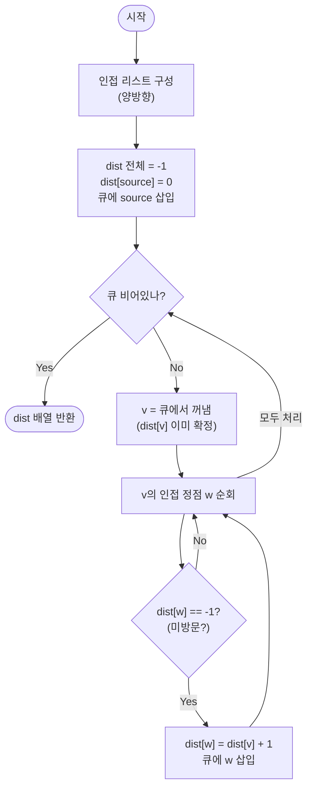

import { AlgorithmSimulation } from "#guide-sim";

# bfsShortestPath 해설

## 성능 목표 예측

| 제약 | 값 |
|------|----|
| 정점 수 $V$ | $1 \leq V \leq 10^5$ |
| 간선 수 $E$ | $0 \leq E \leq 10^5$ |
| 정점 번호 | $0 \ldots n-1$ |
| 그래프 종류 | 무향, 무가중치 |

**naive 접근의 비용**: 출발점 $s$에서 목적지 $v$까지 가는 모든 경로를 열거한 뒤 최소 간선 수를 고른다.
경로 수는 지수적으로 증가하므로 $O(V!)$ → 완전히 비현실적.

조금 나은 방법: 각 목적지마다 별도의 DFS로 경로를 찾는다.
DFS는 최단 경로를 보장하지 않으므로 모든 경로를 탐색해야 한다 → 여전히 지수 시간.

**목표**: 단 한 번의 탐색으로 출발점에서 모든 정점까지의 최단 거리를 동시에 구한다.
시간 $O(V + E)$, 공간 $O(V + E)$. $V + E \leq 2 \times 10^5$이므로 충분히 빠르다.

**공간 트레이드오프**: 인접 리스트 $O(V + E)$ + $\text{dist}$ 배열 $O(V)$ + 큐 $O(V)$.
인접 행렬은 $O(V^2) = 10^{10}$ 바이트로 불가하다.

---

## 목표 함수

```ts
function bfsShortestPath(n: number, edges: [number, number][], source: number): number[]
```

| 파라미터 | 의미 | 제약 |
|----------|------|------|
| `n` | 정점 수 | $1 \leq n \leq 10^5$ |
| `edges` | 무향 간선 목록 `[u, v]` | $0 \leq E \leq 10^5$ |
| `source` | 출발 정점 $s$ | $0 \leq s < n$ |
| 반환 | 길이 $n$ 배열, `dist[i]` = $s \to i$ 최소 간선 수 | 도달 불가 시 $-1$ |

**엣지케이스**

1. **자기 자신**: `dist[source] = 0`. 출발점까지 거리는 0이다.
2. **도달 불가 정점**: 연결되지 않은 정점은 탐색 중 갱신되지 않으므로 초기값 $-1$을 그대로 반환한다.
3. **간선 없음**: $s$만 거리 0, 나머지 모두 $-1$.
4. **최대 입력** ($V = E = 10^5$): 큐에 최대 $V$개 정점이 들어가고 간선은 각 방향으로 한 번씩 처리된다.

---

## 핵심 아이디어

**핵심 아이디어**: "거리가 짧은 정점부터 차례로 처리하면, 처음 도달한 순간의 거리가 곧 최단 거리다."

무가중치 그래프에서 간선 하나를 건널 때마다 거리가 정확히 1 증가한다. FIFO 큐를 쓰면 거리 0, 1, 2, … 순서로 정점이 처리되므로, 어떤 정점을 처음 방문한 시점의 거리가 이미 최단 거리임이 보장된다. 한 번 방문한 정점은 재방문할 필요가 없어 각 정점·간선을 정확히 한 번만 처리하고 $O(V+E)$로 출발점에서 모든 정점까지의 최단 거리를 구한다.

**풀이 구조**
1. 인접 리스트를 양방향으로 구성한다.
2. `dist` 배열을 $-1$로 초기화하고, 출발점의 `dist[source] = 0`으로 설정한 뒤 큐에 삽입한다.
3. 큐에서 정점 `v`를 꺼내고, `v`의 미방문 이웃 `w`에 대해 `dist[w] = dist[v] + 1`로 설정하고 큐에 삽입한다.
4. 큐가 빌 때까지 반복한다.
5. `dist` 배열을 그대로 반환한다(`-1`은 도달 불가).

**조건**: 무향 또는 유향, 무가중치 그래프. 가중치가 모두 동일(1)해야 BFS의 단조성 보장이 성립한다.

**대표 예시**: SNS에서 A와 B 사이의 최소 친구 연결 단계 찾기
A를 출발점으로 BFS를 돌리면, 친구(거리 1) → 친구의 친구(거리 2) → … 순서로 탐색된다. B를 처음 방문하는 순간의 거리가 곧 A와 B 사이의 최소 단계 수이다.

**언제 쓰나**
간선 가중치가 모두 같거나 없는 그래프에서 단일 출발점 최단 거리가 필요할 때 사용한다. Dijkstra보다 빠르고($O(V+E)$ vs $O((V+E)\log V)$) 구현도 단순하므로, 가중치가 균일하다면 항상 BFS를 선택한다.

---

### 원형 아이디어와 naive 접근

"$s$에서 $v$까지 최단 경로를 구하라"는 자연스럽게 모든 경로를 탐색하는 방향으로 이어진다.

```
function shortestPath(s, v):
  minDist = Infinity
  for path in all_paths(s, v):   -- 지수적
    minDist = min(minDist, len(path))
  return minDist
```

지수적 경로 탐색은 $V = 10^5$에서 불가하다.
DFS로 단일 경로를 먼저 찾아도, DFS는 "가장 빠른" 경로를 보장하지 않는다(깊이 우선이므로 먼 경로를 먼저 찾을 수 있다).
어디서 낭비가 발생하는가? 이미 짧은 거리로 도달한 정점을 더 긴 경로를 통해 다시 방문한다.

### 어떤 관찰이 돌파구가 되는가

- **관찰 1**: 무가중치 그래프에서 간선 하나를 건널 때마다 거리가 정확히 1 증가한다. 따라서 거리 0, 1, 2, … 순서로 정점을 발견하면, 어떤 정점을 "처음" 발견한 순간의 거리가 곧 최단 거리이다.
- **관찰 2**: FIFO 큐(First-In First-Out)로 정점을 관리하면 자동으로 거리 순서가 유지된다. 거리 $d$의 정점을 처리하는 동안 발견된 이웃은 거리 $d+1$이고, 이들을 큐 뒤에 넣으면 거리 $d$의 정점을 모두 처리한 뒤에야 거리 $d+1$의 정점이 처리된다.
- **관찰 3**: 한 번 방문한 정점은 최단 거리가 이미 확정되었으므로 재방문할 필요가 없다. 방문 여부를 기록하면 각 정점·간선을 정확히 한 번만 처리하여 $O(V + E)$가 된다.

### 관찰을 형식화: 상태/구조 정의

상태 배열:

$$\text{dist}[v] = \begin{cases} -1 & \text{미방문} \\ d & s \text{에서 } v \text{까지 최단 거리} \end{cases}$$

왜 방문 여부와 거리를 별도 배열로 나누지 않는가? $-1$을 "미방문" 센티넬로 사용하면 배열 하나로 두 역할을 한다. 공간이 절반으로 줄고, 로직도 단순해진다.

자료구조: FIFO 큐. 큐의 정점들은 항상 최대 두 가지 거리 값($d$와 $d+1$)만 포함한다는 불변식이 성립한다.

### 점화식 또는 핵심 연산

BFS의 전이 규칙:

$$\text{dist}[w] = \text{dist}[v] + 1 \quad \text{if } \text{dist}[w] = -1 \text{ and } (v, w) \in E$$

- $\text{dist}[v]$: 현재 큐에서 꺼낸 정점 $v$의 최단 거리 (이미 확정)
- $+1$: 무가중치 간선 하나를 건너므로 거리 1 증가
- $\text{dist}[w] = -1$ 조건: 미방문 정점만 갱신. 이미 방문된 정점은 더 짧은 경로로 도달 불가

이 규칙이 처음 방문 시에만 적용된다는 것이 핵심이다. 두 번째 이후의 방문은 항상 거리가 같거나 크므로 갱신이 필요 없다.

### 정당성 — 왜 이것이 옳은가

귀납적으로 증명한다. BFS가 거리 $d$의 정점을 모두 처리한 뒤 거리 $d+1$의 정점을 처리한다고 하자.

기저: $\text{dist}[s] = 0$. 자기 자신까지 거리는 0으로 옳다.

귀납: 거리 $d$까지의 모든 정점이 올바른 최단 거리를 가진다고 가정한다. 거리 $d$의 정점 $v$에서 인접한 미방문 정점 $w$를 발견할 때 $\text{dist}[w] = d + 1$로 설정한다. $w$에 도달하는 경로 중 $v$를 거치지 않는 경로가 있다면, 그 경로의 첫 단계에서 이미 거리 $\leq d$인 정점에서 $w$가 발견되었을 것이고, 그러면 $w$는 이미 방문됨으로 표시되어 있어야 한다. 따라서 $d + 1$이 최단 거리이다.

까다로운 케이스: 출발점에서 자기 자신으로 돌아오는 사이클이 있어도, $\text{dist}[s] = 0$이므로 두 번째 방문은 조건 $\text{dist}[w] = -1$을 만족하지 못해 무시된다.

### 구현 디테일과 최적화

**visited 설정 시점**: `dist[w] = d+1`로 설정하는 시점(큐에 넣을 때)에 방문 표시해야 한다. 큐에서 꺼낼 때 표시하면 같은 정점이 큐에 여러 번 삽입되어 $O(E)$ 대신 $O(V \cdot E)$가 될 수 있다.

**Dijkstra와의 비교**: 무가중치 그래프에서 Dijkstra는 $O((V + E) \log V)$이다. BFS가 $O(V + E)$로 더 빠르고 구현도 단순하다. 가중치가 모두 1이라면 항상 BFS를 선택한다.

**큐 구현**: JavaScript/TypeScript에서 `Array.shift()`는 $O(n)$이므로 대형 입력에서 병목이 된다. 실전에서는 포인터 기반 큐(인덱스를 head로 관리) 또는 `deque` 라이브러리를 사용한다.

## 시뮬레이션

예시 무향 그래프 `n = 6`, `edges = [[0,1], [0,2], [1,3], [2,3], [3,4], [2,5]]`, `source = 0`에 대해 BFS를 실행하는 과정이다. 노드 위 숫자는 현재 `dist` 값(미방문은 -1), `keyValue` 패널은 FIFO 큐와 거리 배열의 스냅샷이다. 노란색은 큐에 들어 있는 정점(frontier), 빨간색은 방금 꺼내 처리 중인 정점(active), 회색은 처리 완료(visited)를 뜻한다.

실제 반환값은 `[0, 1, 1, 2, 2, 3]` 이며, 시뮬레이션 마지막 프레임의 거리 라벨과 일치한다.

> 대화형 시뮬레이션은 MDX 런타임에서 표시됩니다.

export const nodes = [
  { id: 0, label: "0", x: 50, y: 12 },
  { id: 1, label: "1", x: 20, y: 40 },
  { id: 2, label: "2", x: 80, y: 40 },
  { id: 3, label: "3", x: 50, y: 62 },
  { id: 4, label: "4", x: 50, y: 90 },
  { id: 5, label: "5", x: 90, y: 70 },
];

export const edges = [
  { from: 0, to: 1, directed: false },
  { from: 0, to: 2, directed: false },
  { from: 1, to: 3, directed: false },
  { from: 2, to: 3, directed: false },
  { from: 3, to: 4, directed: false },
  { from: 2, to: 5, directed: false },
];

export const steps = [
  {
    title: "초기화",
    detail: "dist[0]=0, 나머지는 -1. 큐에 0을 넣는다.",
    nodes, edges,
    nodeStatus: { 0: "frontier" },
    nodeValue: { 0: 0, 1: -1, 2: -1, 3: -1, 4: -1, 5: -1 },
    entries: [
      { label: "큐 (FIFO)", value: "[0]" },
      { label: "dist", value: "[0, -1, -1, -1, -1, -1]" },
    ],
  },
  {
    title: "0 처리 (dist=0)",
    detail: "0을 꺼냄. 미방문 이웃 1, 2를 dist=1로 갱신하고 큐에 넣는다.",
    nodes, edges,
    nodeStatus: { 0: "active", 1: "frontier", 2: "frontier" },
    nodeValue: { 0: 0, 1: 1, 2: 1, 3: -1, 4: -1, 5: -1 },
    entries: [
      { label: "큐 (FIFO)", value: "[1, 2]" },
      { label: "dist", value: "[0, 1, 1, -1, -1, -1]" },
    ],
  },
  {
    title: "1 처리 (dist=1)",
    detail: "1을 꺼냄. 미방문 이웃 3을 dist=2로 갱신. (0은 이미 방문)",
    nodes, edges,
    nodeStatus: { 0: "visited", 1: "active", 2: "frontier", 3: "frontier" },
    nodeValue: { 0: 0, 1: 1, 2: 1, 3: 2, 4: -1, 5: -1 },
    activeEdge: { from: 1, to: 3 },
    entries: [
      { label: "큐 (FIFO)", value: "[2, 3]" },
      { label: "dist", value: "[0, 1, 1, 2, -1, -1]" },
    ],
  },
  {
    title: "2 처리 (dist=1)",
    detail: "2를 꺼냄. 미방문 이웃 5를 dist=2로 갱신. (0, 3은 이미 방문/발견)",
    nodes, edges,
    nodeStatus: { 0: "visited", 1: "visited", 2: "active", 3: "frontier", 5: "frontier" },
    nodeValue: { 0: 0, 1: 1, 2: 1, 3: 2, 4: -1, 5: 2 },
    activeEdge: { from: 2, to: 5 },
    entries: [
      { label: "큐 (FIFO)", value: "[3, 5]" },
      { label: "dist", value: "[0, 1, 1, 2, -1, 2]" },
    ],
  },
  {
    title: "3 처리 (dist=2)",
    detail: "3을 꺼냄. 미방문 이웃 4를 dist=3으로 갱신.",
    nodes, edges,
    nodeStatus: { 0: "visited", 1: "visited", 2: "visited", 3: "active", 5: "frontier", 4: "frontier" },
    nodeValue: { 0: 0, 1: 1, 2: 1, 3: 2, 4: 3, 5: 2 },
    activeEdge: { from: 3, to: 4 },
    entries: [
      { label: "큐 (FIFO)", value: "[5, 4]" },
      { label: "dist", value: "[0, 1, 1, 2, 3, 2]" },
    ],
  },
  {
    title: "5 처리 (dist=2)",
    detail: "5를 꺼냄. 미방문 이웃 없음.",
    nodes, edges,
    nodeStatus: { 0: "visited", 1: "visited", 2: "visited", 3: "visited", 5: "active", 4: "frontier" },
    nodeValue: { 0: 0, 1: 1, 2: 1, 3: 2, 4: 3, 5: 2 },
    entries: [
      { label: "큐 (FIFO)", value: "[4]" },
      { label: "dist", value: "[0, 1, 1, 2, 3, 2]" },
    ],
  },
  {
    title: "4 처리 (dist=3)",
    detail: "4를 꺼냄. 미방문 이웃 없음. 큐가 비었다.",
    nodes, edges,
    nodeStatus: { 0: "visited", 1: "visited", 2: "visited", 3: "visited", 5: "visited", 4: "active" },
    nodeValue: { 0: 0, 1: 1, 2: 1, 3: 2, 4: 3, 5: 2 },
    entries: [
      { label: "큐 (FIFO)", value: "[]" },
      { label: "dist", value: "[0, 1, 1, 2, 3, 2]" },
    ],
  },
  {
    title: "완료: dist = [0, 1, 1, 2, 2, 3]",
    detail: "큐가 비어 종료. 정점 순서대로 거리 [0, 1, 1, 2, 2, 3].",
    nodes, edges,
    nodeStatus: { 0: "visited", 1: "visited", 2: "visited", 3: "visited", 4: "visited", 5: "visited" },
    nodeValue: { 0: 0, 1: 1, 2: 1, 3: 2, 4: 2, 5: 3 },
    entries: [
      { label: "큐 (FIFO)", value: "[]" },
      { label: "dist", value: "[0, 1, 1, 2, 2, 3]" },
    ],
  },
];

<AlgorithmSimulation view={["graph", "keyValue"]} steps={steps} title="BFS 최단거리: source=0" />

## 수도 코드와 Activity Diagram

### 의사코드

```
function bfsShortestPath(n, edges, source):
  adj[0..n-1] = 빈 리스트
  for [u, v] in edges:
    adj[u].push(v)
    adj[v].push(u)                -- 무향: 양방향 등록

  dist[0..n-1] = -1              -- 불변식: -1은 미방문
  dist[source] = 0               -- 출발점 거리 = 0
  queue = [source]               -- FIFO 큐 초기화

  while queue is not empty:
    v = queue.dequeue()          -- 불변식: v는 현재 처리 중인 정점, dist[v]는 이미 확정
    for w in adj[v]:
      if dist[w] == -1:          -- 미방문 정점만 갱신
        dist[w] = dist[v] + 1   -- 불변식: 처음 방문 시의 거리 = 최단 거리
        queue.enqueue(w)         -- 큐에 넣는 시점에 확정

  return dist                    -- -1이 남은 정점은 도달 불가
```

**핵심 불변식:**
큐에 들어 있는 정점들의 `dist` 값은 단조 비감소이며, 최대 두 가지 연속 값($d$, $d+1$)만 존재한다. 이 때문에 큐 앞에서 꺼내는 정점이 항상 현재 처리 가능한 최소 거리 정점이 된다.

### Activity Diagram


