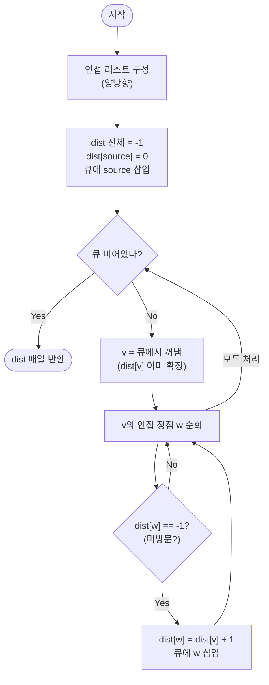

import { AlgorithmSimulation } from "#guide-sim";

# bfsShortestPath — FIFO 큐가 거리 순서를 공짜로 보장하는 이유

## 한눈에 보는 컨셉

무가중치 그래프에서 출발점 하나로부터 모든 정점까지의 최단 거리를 한 번에 구하는 문제예요. 핵심 관찰은 "간선 하나를 건널 때마다 거리가 정확히 1씩 늘어난다"는 것이고, FIFO 큐(First-In First-Out)로 정점을 꺼내면 이 거리 순서가 저절로 유지됩니다. 그 덕분에 정점과 간선을 각각 딱 한 번씩만 처리해서 `O(V + E)`에 전체 답을 끝낼 수 있어요.

## 출발점: 가장 순진한 방법부터

문제를 먼저 정확히 잡을게요.

```ts
function bfsShortestPath(n: number, edges: [number, number][], source: number): number[]
```

| 파라미터 | 의미 | 제약 |
|----------|------|------|
| `n` | 정점 수 (번호는 $0 \ldots n-1$) | $1 \leq n \leq 10^5$ |
| `edges` | 무향 간선 목록 `[u, v]` | $0 \leq E \leq 10^5$ |
| `source` | 출발 정점 | $0 \leq \text{source} < n$ |
| 반환값 | 길이 `n` 배열. `dist[i]` = `source`에서 `i`까지 최소 간선 수 | 도달 불가능하면 `-1`, `source` 자신은 `0` |

"두 정점 사이의 최단 경로를 구하라"는 요구는 자연스럽게 "경로 후보를 다 나열해서 그중 가장 짧은 걸 고르자"는 생각으로 이어져요. 가장 정직하게 옮기면 이런 모습입니다.

```ts
function bfsShortestPathNaive(n: number, edges: [number, number][], source: number): number[] {
  const adj: number[][] = Array.from({ length: n }, () => []);
  for (const [u, v] of edges) {
    if (u === v) continue; // 자기 루프는 경로에 영향 없음
    adj[u].push(v);
    adj[v].push(u);
  }

  const dist = new Array<number>(n).fill(-1);
  const onPath = new Array<boolean>(n).fill(false);

  function dfs(v: number, depth: number) {
    if (dist[v] === -1 || depth < dist[v]) dist[v] = depth; // 더 짧게 도달하면 갱신
    onPath[v] = true;
    for (const w of adj[v]) {
      if (!onPath[w]) dfs(w, depth + 1); // 현재 경로에 없는 이웃으로만 전진
    }
    onPath[v] = false; // 백트래킹 — 다른 경로에서 v를 다시 지날 수 있게 원복
  }

  dist[source] = 0;
  onPath[source] = true;
  for (const w of adj[source]) dfs(w, 1);
  onPath[source] = false;

  return dist;
}
```

`source`에서 갈 수 있는 모든 단순 경로(같은 정점을 두 번 지나지 않는 경로)를 전부 밟아 보면서, 각 정점에 대해 "지금까지 발견한 가장 짧은 도달 깊이"를 갱신하는 방식이에요. 정답은 맞지만 비용이 문제입니다 — 그래프에 사이클이 여러 개 있으면 같은 정점으로 가는 경로 수가 기하급수적으로 늘어나요.

실제로 정점을 모두 서로 연결한 완전그래프에서 이 `dfs`가 몇 번 호출되는지 세어 보면 이렇습니다(직접 실행해 측정한 값입니다).

```text
정점 3개 완전그래프(K3):  dfs 호출 5회
정점 5개 완전그래프(K5):  dfs 호출 65회
정점 8개 완전그래프(K8):  dfs 호출 13,700회
                          ↓ 정점이 늘수록 거의 계승(factorial)에 가깝게 폭증
정점 10^5개              →  현실적인 시간 안에 절대 끝나지 않음 (O(V!) 근방)
```

이 문제의 제약은 $V, E \leq 10^5$이므로 지수적/계승적 비용은 완전히 비현실적이에요. 그런데 나열해 보면 낌새가 하나 보입니다 — `dfs`가 같은 정점을 여러 경로로 반복해서 방문하고 있다는 것입니다. **이미 더 짧은 경로로 도달한 정점을, 굳이 더 긴 경로로 다시 찾아갈 필요가 있을까요?** 이 중복을 없애는 것이 이번 알고리즘의 출발 단서입니다.

## 아이디어 자세히 들여다보기

### 거리 0, 1, 2, …로 퍼져나가는 파동 — 수식과 그림

핵심 관찰을 정식으로 적으면 이렇습니다.

$$\text{dist}(v) = \min_{p \,:\, \text{source} \rightsquigarrow v} |p|$$

($p$는 `source`에서 $v$로 가는 경로, $|p|$는 그 경로의 간선 수)

이 정의 자체는 naive 코드가 계산하는 값과 똑같아요. 문제는 "이걸 지수적으로 계산하지 않고 어떻게 구하는가"입니다. 여기서 무가중치 그래프의 특수성이 등장해요 — **간선 하나를 지날 때마다 거리가 정확히 1씩만 늘어난다**는 사실입니다. 그렇다면 정점들을 거리 0, 1, 2, … 순서로 "파도가 퍼지듯" 발견해 나가면, 어떤 정점을 **처음** 발견한 순간의 거리가 곧 최단 거리라는 게 보장돼요. 예시 그래프(`n=6`, `edges=[[0,1],[0,2],[1,3],[2,3],[3,4],[2,5]]`, `source=0`)로 이 파동을 그려 보면 다음과 같습니다.

```text
거리 0:        0
              ╱ ╲
거리 1:      1    2
             │   ╱ ╲
거리 2:      3---┘   5
             │
거리 3:      4

파동이 한 칸씩 퍼진다: {0} → {1,2} → {3,5} → {4}
```

**왜 하필 이런 "파동" 형태로 정의해야 할까요?** 최단 거리를 "모든 경로 중 최솟값"으로 정의하는 건 수학적으로는 정확하지만 계산하려면 경로를 다 뒤져야 해요. 반면 "거리 $d$의 정점들을 다 찾은 다음에야 거리 $d+1$의 정점을 찾는다"는 **레이어(layer) 단위의 정의**는 계산 순서 자체가 알고리즘이 됩니다 — 두 정의는 값이 같지만(무가중치 그래프에서), 후자만 선형 시간 계산으로 바로 이어져요.

잠깐 확인해 볼까요? 위 그림에서 정점 3은 정점 1을 통해서도, 정점 2를 통해서도 도달할 수 있어요. 그런데 왜 dist(3) = 2이지 다른 값이 아닐까요? — 정점 1과 2가 모두 거리 1이고, 3은 그 다음 파동에서 처음 발견되니까, 어느 쪽을 거치든 거리는 2로 같습니다. 두 이웃 다 같은 거리에 있다면 그중 어느 쪽으로 도달해도 최단 거리는 변하지 않아요.

### 셈을 맡는 자료구조 — FIFO 큐

"파동을 순서대로 퍼뜨린다"는 아이디어를 실제로 구현하려면, "다음에 처리할 정점"을 항상 **가장 먼저 발견된 정점**부터 꺼낼 수 있는 자료구조가 필요해요. 이 역할을 FIFO 큐가 맡습니다 — 정점을 발견한 순서 그대로 뒤에 쌓고, 앞에서부터 꺼내면 자동으로 거리가 작은 정점부터 처리돼요. 큐 자체의 동작 원리(enqueue/dequeue, 배열 기반 구현의 트레이드오프)는 이 프로젝트의 [queue 가이드](../../../data-structures/linear/queue/queue-guide.mdx)에서 자세히 다루니, 여기서는 "먼저 들어온 정점을 먼저 꺼내 주는 상자"로만 알아도 충분합니다.

### 왜 모순 없이 작동하는가

이 알고리즘이 지키는 불변식은 하나입니다.

> 큐 안에 들어 있는 정점들의 `dist` 값은 항상 비감소(non-decreasing)이며, 그 안에는 최대 두 개의 연속된 값($d$와 $d+1$)만 존재한다.

귀납적으로 증명해 볼게요.

**기저**: 큐에 `source` 하나만 들어 있는 시작 시점, `dist[source] = 0`이고 이는 옳습니다. `source`까지 가는 가장 짧은 경로는 길이 0인 "아무것도 안 가는 경로"니까요.

**귀납 단계**: 거리 $d$까지의 모든 정점이 이미 올바른 최단 거리를 배정받았다고 가정합니다. 거리 $d$의 정점 $v$를 큐에서 꺼내 인접한 정점 $w$를 확인할 때, 경우는 딱 두 가지뿐입니다(경우의 완전성) — ① $w$가 이미 방문됐다(`dist[w] !== -1`), ② $w$가 아직 미방문이다(`dist[w] === -1`). ①이면 $w$는 이미 거리 $\leq d$로 확정되어 있으므로 손대지 않아도 정확합니다(최단 거리는 한 번 확정되면 더 줄어들 수 없어요 — 이미 그보다 짧은 파동에서 찾아냈으니까). ②라면 $w$에 $v$를 거치지 않는 더 짧은 경로가 있었다고 가정해 보죠. 그 경로의 첫 걸음은 거리 $\leq d$인 어떤 정점을 지났을 것이고, 귀납 가정에 의해 그 정점은 이미 처리되어 $w$도 그때 이미 발견됐어야 합니다 — 그런데 $w$는 아직 미방문이므로 모순입니다. 따라서 $v$를 거쳐 처음 발견하는 지금이 $w$의 최단 경로이고, $\text{dist}[w] = d + 1$이 옳습니다.

여기서 **헷갈리기 쉬운 포인트**는 "방문 표시를 언제 하느냐"입니다. `dist[w]`를 큐에 **넣을 때(enqueue)** 바로 설정해야지, 큐에서 **꺼낼 때(dequeue)** 설정하면 안 됩니다. 왜 안 되는지 삼각형 그래프 `edges=[[0,1],[0,2],[1,2]]`, `source=0`으로 직접 확인해 보면(실제 실행 결과입니다):

```text
정답(enqueue 시점에 표시)              : dist = [0, 1, 1]
버그(dequeue 시점에 표시)로 계산하면   : dist = [0, 1, 2]   ✗ (2가 틀렸다! 정답은 1)

무엇이 벌어졌나:
  0을 처리 → 1과 2를 큐에 넣으며 dist[1]=1, dist[2]=1로 "즉시" 표시해야 하는데
  방문 표시를 뒤로 미루면, 1을 처리할 때 2가 "아직 방문 안 한 것"처럼 보여
  다시 큐에 넣으며 dist[2] = dist[1]+1 = 2로 덮어써 버린다
```

`dist[w] = dist[v] + 1`과 "이 정점을 다시는 큐에 넣지 않는다"는 표시가 **같은 순간에** 일어나야, 나중에 더 먼 거리의 정점이 같은 `w`를 다시 발견해도 무시할 수 있어요. 이 표시 시점이 어긋나면 값 자체가 틀어집니다.

엣지 케이스도 확인해 둘게요.

```text
V=1, 간선 없음, source=0        →  dist = [0]                (자기 자신만 거리 0)
간선 없음, source=1 (V=4)       →  dist = [-1, 0, -1, -1]     (고립된 정점들은 -1 유지)
분리된 두 그룹, source=0        →  dist = [0, 1, -1, -1]      (닿지 않는 그룹은 영원히 -1)
자기 루프 [0,0] 포함           →  자기 루프는 무시되어도 결과 불변 (자기 자신 거리는 이미 0)
```

## 아이디어를 코드로 옮기기

지금까지의 아이디어를 그대로 옮기면 이런 모습이 돼요. 큐는 TypeScript/JavaScript에서 가장 손에 익은 방식 — 배열에 `push`로 넣고 `shift`로 꺼내는 방식을 씁니다.

```ts
function bfsShortestPath(n: number, edges: [number, number][], source: number): number[] {
  const adj: number[][] = Array.from({ length: n }, () => []);
  for (const [u, v] of edges) {
    adj[u].push(v);
    adj[v].push(u); // 무향 그래프: 양방향 등록
  }

  const dist = new Array<number>(n).fill(-1); // -1 = 미방문 센티넬
  dist[source] = 0;
  const queue: number[] = [source];

  while (queue.length > 0) {
    const v = queue.shift()!; // 큐 맨 앞 정점을 꺼낸다
    for (const w of adj[v]) {
      if (dist[w] === -1) {
        dist[w] = dist[v] + 1; // 처음 발견한 순간 = 최단 거리 확정
        queue.push(w);
      }
    }
  }

  return dist;
}
```

**가장 실수가 잦은 줄은 `dist[w] = dist[v] + 1;`과 `queue.push(w);`가 붙어 있는 이 두 줄입니다.** 앞 절에서 본 것처럼, 이 두 동작은 반드시 같은 순간(정점을 큐에 처음 넣는 시점)에 일어나야 해요. 둘 사이에 다른 로직이 끼어들거나, `dist` 설정이 `dequeue` 이후로 미뤄지면 값 자체가 틀어집니다. 그 외 결정 지점은 두 가지입니다.

- **초기값**: `dist`를 전부 `-1`로 채우고 `dist[source] = 0`만 먼저 확정합니다. `-1`이 "미방문"과 "센티넬" 역할을 동시에 하므로 별도 `visited` 배열이 필요 없어요.
- **`queue.shift()!`의 `!`**: TypeScript는 빈 배열에서 `shift()`를 호출할 가능성을 감안해 반환 타입을 `number | undefined`로 잡습니다. `while (queue.length > 0)`으로 이미 비어 있지 않음을 보장했으므로 non-null 단언이 안전합니다.

## 더 빠르게 만들 단서 찾기

이 구현은 이미 알고리즘적으로는 `O(V + E)`예요 — 정점마다 `dist`가 한 번만 `-1`에서 벗어나므로 `queue.push`는 정점당 최대 한 번, `for (const w of adj[v])`는 간선마다 양방향으로 한 번씩만 실행됩니다. 그런데 `queue.shift()`를 자세히 보면 걸리는 점이 있어요. 배열의 맨 앞 원소를 꺼낸다는 건, 명세상 나머지 모든 원소를 한 칸씩 앞으로 당겨야 한다는 뜻입니다.

```text
큐 = [3, 5, 4]     shift() 호출 →  3을 꺼내고

내부적으로:  [3, 5, 4]
                ↓ 나머지를 한 칸씩 당김
             [5, 4]

원소가 k개 남아 있으면 이 "당기기"에 O(k)가 든다 — 매 호출마다!
```

큐에 정점이 많이 쌓여 있는 상태(예: 허브 하나에 나머지 정점이 모두 매달린 별 모양 그래프)에서 `shift()`를 반복하면, 명세상 최악의 경우 총 비용이 `O(V)`씩 `V`번, 즉 `O(V²)`까지 커질 수 있어요. 실제로 재인덱싱이 필요 없는 큐 구현을 쓰면 이 비용을 완전히 없앨 수 있습니다.

## 단서를 최적화로 연결하기

`shift()`가 비싼 이유는 "맨 앞 원소가 사라지면 인덱스 0을 다시 채워야 한다"는 배열의 규칙 때문이에요. 그런데 우리는 꺼낸 원소를 다시 쓸 일이 없습니다 — 그렇다면 원소를 실제로 밀어내지 말고, **"여기까지는 이미 처리했다"는 포인터만 옮기면** 어떨까요?

```text
Before (shift 방식):           After (포인터 방식):
[0, 1, 2] → shift → [1, 2]     [0, 1, 2]
 배열 크기가 줄고                  head=0 → head=1
 나머지가 당겨짐                [0, 1, 2]  (배열은 그대로, head만 이동)
                                  ↑head
```

큐를 처음부터 크기 `n`짜리 고정 배열로 만들고, `head`(다음에 꺼낼 위치)와 `tail`(다음에 넣을 위치) 두 포인터만 관리합니다. `head`가 `tail`을 따라잡으면 큐가 빈 것이고, `enqueue`는 `queue[tail++] = w`, `dequeue`는 `queue[head++]`로 끝나요 — 둘 다 인덱스 계산 한 번이니 정확히 `O(1)`입니다.

**불변식**: 큐에 들어가는 정점은 `dist[w] === -1` 체크를 통과한 정점뿐이고, 그 체크와 동시에 `dist[w]`가 확정되므로 같은 정점이 두 번 들어갈 수 없습니다. 정점이 `n`개뿐이니 크기 `n`짜리 배열이면 항상 충분해요 — 이 불변식이 깨지면(앞서 본 "방문 표시를 미루는" 버그처럼) 같은 정점이 여러 번 들어가 배열 크기를 넘어설 수도 있다는 뜻이니, 고정 크기 `n`은 우리가 정당성을 지켰다는 방증이기도 합니다.

## 최적화 코드

바뀌는 곳은 **큐 부분뿐**입니다.

```ts
function bfsShortestPath(n: number, edges: [number, number][], source: number): number[] {
  const adj: number[][] = Array.from({ length: n }, () => []);
  for (const [u, v] of edges) {
    adj[u].push(v);
    adj[v].push(u);
  }

  const dist = new Array<number>(n).fill(-1);
  dist[source] = 0;
  const queue = new Array<number>(n); // 고정 크기 — 정점마다 최대 한 번만 들어온다
  queue[0] = source;
  let head = 0;
  let tail = 1;

  while (head < tail) {
    const v = queue[head++]; // O(1) — 재인덱싱 없이 포인터만 전진
    for (const w of adj[v]) {
      if (dist[w] === -1) {
        dist[w] = dist[v] + 1;
        queue[tail++] = w; // O(1) — 다음 빈 칸에 그대로 적재
      }
    }
  }

  return dist;
}
```

**가장 중요한 줄은 `while (head < tail)`입니다.** `head`가 `tail`을 따라잡는 순간이 "더 이상 처리할 정점이 없다"는 뜻이고, 이는 `shift` 버전의 `queue.length > 0`과 정확히 같은 조건이에요. 여기서 순서를 실수하기 쉬운 지점 하나 — `queue[head++]`처럼 **먼저 읽고 나중에 증가**해야지, `head`를 먼저 증가시키고 읽으면 큐의 첫 번째 원소(`source`)를 건너뛰고 시작하게 됩니다.

> 기억법: "큐를 비우지 않고, 다 읽은 지점만 표시한다."

실측으로도 확인해 봤습니다. 이 문제의 상한인 `n = 100,000`, 허브 하나에 나머지가 모두 매달린 별 모양 그래프(큐가 가장 오래 크게 유지되는 시나리오)에서 7회 측정한 중앙값은 `shift` 버전 15.5ms, 포인터 버전 9.5ms였어요. Bun의 JavaScript 엔진이 흔한 `push`/`shift` 패턴을 어느 정도 내부적으로 최적화해 주기 때문에 차이가 극적이진 않지만, 포인터 버전은 **엔진의 내부 최적화 여부와 무관하게 매 연산이 정확히 `O(1)`임을 명세 차원에서 보장**한다는 점이 실전에서 더 중요합니다.

이로써 애초 목표였던 `O(V + E)`를 값(정확성)과 시간(엔진 의존 없는 진짜 상수 시간 연산) 양쪽에서 달성했습니다. 여기서 더 줄일 여지가 있을까요? 정답을 내려면 최소한 도달 가능한 모든 정점을 한 번씩은 살펴봐야 하고(그렇지 않으면 어떤 정점의 거리가 확정됐는지 알 수 없으므로) 간선도 최소 한 번씩은 확인해야 하니(안 그러면 연결 여부를 놓칠 수 있으니), `Ω(V + E)`는 이 문제의 근본적인 하한입니다. 지금 구현은 이 하한과 점근적으로 일치하므로 더 개선할 여지가 없어요. 참고로 두 정점 사이의 "단일" 최단 거리만 필요하다면 양쪽에서 동시에 퍼뜨리는 양방향 BFS로 상수 배 개선을 노릴 수 있고, 간선 가중치가 0과 1 두 종류뿐이면 0-1 BFS(deque 기반)로 확장할 수 있습니다. 하지만 이 가이드처럼 "출발점 하나에서 모든 정점까지"가 목표라면, 지금의 단일 방향 BFS가 가장 단순하고 범용적인 정답입니다.

## 실행 시각화

예시 무향 그래프 `n = 6`, `edges = [[0,1], [0,2], [1,3], [2,3], [3,4], [2,5]]`, `source = 0`에 대해 BFS를 실행하는 과정입니다. 노드 위 숫자는 현재 `dist` 값(미방문은 -1), `keyValue` 패널은 FIFO 큐와 거리 배열의 스냅샷이에요. 노란색은 큐에 들어 있는 정점(frontier), 빨간색은 방금 꺼내 처리 중인 정점(active), 회색은 처리 완료(visited)를 뜻합니다. 실제 반환값은 `[0, 1, 1, 2, 3, 2]`이며(위 최적화 코드로 직접 실행해 확인한 값입니다), 시뮬레이션 마지막 프레임의 거리 라벨과 일치합니다.

> 대화형 시뮬레이션은 MDX 런타임에서 표시됩니다.

export const nodes = [
  { id: 0, label: "0", x: 50, y: 12 },
  { id: 1, label: "1", x: 20, y: 40 },
  { id: 2, label: "2", x: 80, y: 40 },
  { id: 3, label: "3", x: 50, y: 62 },
  { id: 4, label: "4", x: 50, y: 90 },
  { id: 5, label: "5", x: 90, y: 70 },
];

export const edges = [
  { from: 0, to: 1, directed: false },
  { from: 0, to: 2, directed: false },
  { from: 1, to: 3, directed: false },
  { from: 2, to: 3, directed: false },
  { from: 3, to: 4, directed: false },
  { from: 2, to: 5, directed: false },
];

export const steps = [
  {
    title: "초기화",
    detail: "dist[0]=0, 나머지는 -1. 큐에 0을 넣는다.",
    nodes, edges,
    nodeStatus: { 0: "frontier" },
    nodeValue: { 0: 0, 1: -1, 2: -1, 3: -1, 4: -1, 5: -1 },
    entries: [
      { label: "큐 (FIFO)", value: "[0]" },
      { label: "dist", value: "[0, -1, -1, -1, -1, -1]" },
    ],
  },
  {
    title: "0 처리 (dist=0)",
    detail: "0을 꺼냄. 미방문 이웃 1, 2를 dist=1로 갱신하고 큐에 넣는다.",
    nodes, edges,
    nodeStatus: { 0: "active", 1: "frontier", 2: "frontier" },
    nodeValue: { 0: 0, 1: 1, 2: 1, 3: -1, 4: -1, 5: -1 },
    entries: [
      { label: "큐 (FIFO)", value: "[1, 2]" },
      { label: "dist", value: "[0, 1, 1, -1, -1, -1]" },
    ],
  },
  {
    title: "1 처리 (dist=1)",
    detail: "1을 꺼냄. 미방문 이웃 3을 dist=2로 갱신. (0은 이미 방문)",
    nodes, edges,
    nodeStatus: { 0: "visited", 1: "active", 2: "frontier", 3: "frontier" },
    nodeValue: { 0: 0, 1: 1, 2: 1, 3: 2, 4: -1, 5: -1 },
    activeEdge: { from: 1, to: 3 },
    entries: [
      { label: "큐 (FIFO)", value: "[2, 3]" },
      { label: "dist", value: "[0, 1, 1, 2, -1, -1]" },
    ],
  },
  {
    title: "2 처리 (dist=1)",
    detail: "2를 꺼냄. 미방문 이웃 5를 dist=2로 갱신. (0, 3은 이미 방문/발견)",
    nodes, edges,
    nodeStatus: { 0: "visited", 1: "visited", 2: "active", 3: "frontier", 5: "frontier" },
    nodeValue: { 0: 0, 1: 1, 2: 1, 3: 2, 4: -1, 5: 2 },
    activeEdge: { from: 2, to: 5 },
    entries: [
      { label: "큐 (FIFO)", value: "[3, 5]" },
      { label: "dist", value: "[0, 1, 1, 2, -1, 2]" },
    ],
  },
  {
    title: "3 처리 (dist=2)",
    detail: "3을 꺼냄. 미방문 이웃 4를 dist=3으로 갱신.",
    nodes, edges,
    nodeStatus: { 0: "visited", 1: "visited", 2: "visited", 3: "active", 5: "frontier", 4: "frontier" },
    nodeValue: { 0: 0, 1: 1, 2: 1, 3: 2, 4: 3, 5: 2 },
    activeEdge: { from: 3, to: 4 },
    entries: [
      { label: "큐 (FIFO)", value: "[5, 4]" },
      { label: "dist", value: "[0, 1, 1, 2, 3, 2]" },
    ],
  },
  {
    title: "5 처리 (dist=2)",
    detail: "5를 꺼냄. 미방문 이웃 없음.",
    nodes, edges,
    nodeStatus: { 0: "visited", 1: "visited", 2: "visited", 3: "visited", 5: "active", 4: "frontier" },
    nodeValue: { 0: 0, 1: 1, 2: 1, 3: 2, 4: 3, 5: 2 },
    entries: [
      { label: "큐 (FIFO)", value: "[4]" },
      { label: "dist", value: "[0, 1, 1, 2, 3, 2]" },
    ],
  },
  {
    title: "4 처리 (dist=3)",
    detail: "4를 꺼냄. 미방문 이웃 없음. 큐가 비었다.",
    nodes, edges,
    nodeStatus: { 0: "visited", 1: "visited", 2: "visited", 3: "visited", 5: "visited", 4: "active" },
    nodeValue: { 0: 0, 1: 1, 2: 1, 3: 2, 4: 3, 5: 2 },
    entries: [
      { label: "큐 (FIFO)", value: "[]" },
      { label: "dist", value: "[0, 1, 1, 2, 3, 2]" },
    ],
  },
  {
    title: "완료: dist = [0, 1, 1, 2, 3, 2]",
    detail: "큐가 비어 종료. 정점 순서대로 거리 [0, 1, 1, 2, 3, 2].",
    nodes, edges,
    nodeStatus: { 0: "visited", 1: "visited", 2: "visited", 3: "visited", 4: "visited", 5: "visited" },
    nodeValue: { 0: 0, 1: 1, 2: 1, 3: 2, 4: 3, 5: 2 },
    entries: [
      { label: "큐 (FIFO)", value: "[]" },
      { label: "dist", value: "[0, 1, 1, 2, 3, 2]" },
    ],
  },
];

<AlgorithmSimulation view={["graph", "keyValue"]} steps={steps} title="BFS 최단거리: source=0" />

## 흐름 한눈에 보기


```mermaid
flowchart TD
    A([시작]) --> B["인접 리스트 구성\n(양방향)"]
    B --> C["dist 전체 = -1\ndist[source] = 0\n큐에 source 삽입"]
    C --> D{큐 비어있나?}
    D -- Yes --> E([dist 배열 반환])
    D -- No --> F["v = 큐에서 꺼냄\n(dist[v] 이미 확정)"]
    F --> G[v의 인접 정점 w 순회]
    G --> H{"dist[w] == -1?\n(미방문?)"}
    H -- No --> G
    H -- Yes --> I["dist[w] = dist[v] + 1\n큐에 w 삽입"]
    I --> G
    G -- "모두 처리" --> D
```

## 스스로 점검하기

1. `edges = [[0,1], [1,2], [2,0], [2,3]]`, `source = 0`인 그래프(삼각형 0-1-2에 꼬리 3이 붙은 모양)에서 BFS를 손으로 따라가며 큐의 변화와 최종 `dist` 배열을 적어 보세요. (정답: `dist = [0, 1, 1, 2]`. 0을 처리하며 1, 2가 동시에 거리 1로 발견되고, 2를 처리할 때 3이 거리 2로 발견됩니다.)
2. 본문의 "왜 모순 없이 작동하는가" 절에서 본 삼각형 그래프(`edges=[[0,1],[0,2],[1,2]]`, `source=0`) 버그 예시를 다시 보세요. 방문 표시를 `dequeue` 시점으로 미루면 `dist[2]`가 왜 정확히 `2`로(정답 `1`이 아니라) 틀어지는지, 어떤 정점이 어떤 순서로 큐에 다시 들어가는지 짚어 설명해 보세요.
3. 만약 간선마다 서로 다른 양의 정수 가중치가 붙는다면, 이 알고리즘을 그대로 재사용할 수 있을까요? "간선 하나당 거리 +1"이라는 전제가 무너지면 어떤 성질(파동이 레이어 단위로 퍼진다는 것)이 깨지는지, 그 대신 어떤 알고리즘을 써야 하는지 한 줄로 답해 보세요.
