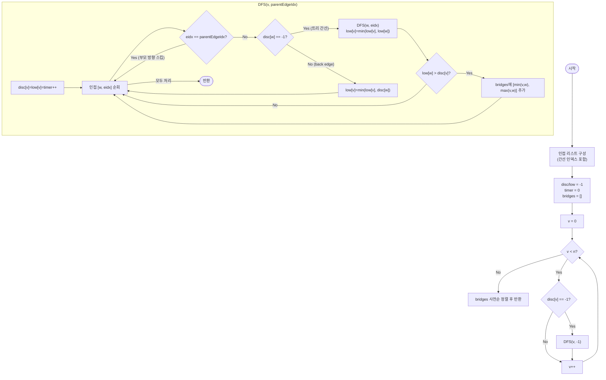

import { AlgorithmSimulation } from "#guide-sim";

# bridgesInGraph 해설

## 성능 목표 예측

| 제약 | 값 |
|------|----|
| 정점 수 $V$ | $1 \leq V \leq 10^5$ |
| 간선 수 $E$ | $0 \leq E \leq 10^5$ |
| 정점 번호 | $0 \ldots n-1$ |
| 그래프 종류 | 무향 |

**naive 접근의 비용**: 각 간선 $(u, v)$를 제거한 뒤 연결 성분 수가 늘어나는지 BFS/DFS로 확인한다.
$E$개 간선 × 탐색 $O(V + E)$ = $O(E(V + E))$.
$V = E = 10^5$이면 $10^{10}$ 연산 → 시간 초과.

**목표**: DFS 한 번으로 모든 다리를 동시에 찾는다. 시간 $O(V + E)$, 공간 $O(V + E)$.
$V + E \leq 2 \times 10^5$이므로 수백만 연산으로 통과 가능.

**공간 트레이드오프**: 인접 리스트(공간 $O(V + E)$). 인접 행렬은 $O(V^2) = 10^{10}$ 바이트로 불가.

---

## 목표 함수

```ts
function bridgesInGraph(n: number, edges: [number, number][]): [number, number][]
```

| 파라미터 | 의미 | 제약 |
|----------|------|------|
| `n` | 정점 수 | $1 \leq n \leq 10^5$ |
| `edges` | 무향 간선 목록 `[u, v]` | $0 \leq E \leq 10^5$ |
| 반환 | 다리 간선 배열. 각 원소 `[u,v]`는 $u < v$로 정규화, 전체 사전순 정렬 | — |

**엣지케이스**

1. **간선 없음**: 다리 없음 → `[]`.
2. **트리** ($E = V - 1$): 모든 간선이 다리. 어떤 간선을 제거해도 두 성분으로 분리된다.
3. **사이클 내 간선**: 사이클 안의 간선은 다리가 아니다. 제거해도 사이클의 다른 경로로 연결 유지.
4. **다중 간선** $(u, v)$가 두 개 이상: 하나를 제거해도 나머지로 연결이 유지되므로 다리가 아니다. → 간선 인덱스 기반 부모 추적 필요.

---

## 핵심 아이디어

**핵심 아이디어**: "간선을 하나씩 제거해 확인하는 대신, DFS 트리에서 '우회로 없는 간선'을 단 한 번의 탐색으로 가려낸다."

간선 $(u, c)$가 다리인지 알려면 $c$의 서브트리가 $u$ 또는 그 조상으로 도달하는 다른 경로(back edge)를 갖는지만 확인하면 된다. DFS 도중 각 정점의 `low` 값(서브트리에서 back edge를 통해 올라갈 수 있는 가장 오래된 조상의 발견 시각)을 계산하면, `low[c] > disc[u]`인 트리 간선이 곧 다리다. 이 계산은 DFS 한 번으로 모든 간선에 동시에 적용되어 $O(V+E)$를 달성한다.

**풀이 구조**
1. 인접 리스트를 구성할 때 간선 인덱스를 함께 저장한다(다중 간선 대응).
2. 미방문 정점에서 DFS를 시작하며 `disc[v] = low[v] = timer++`로 기록한다.
3. 부모 방향 간선은 간선 인덱스로 정확히 식별해 스킵한다.
4. 트리 간선 탐색 후 `low[v] = min(low[v], low[w])`로 자식 서브트리의 도달 범위를 전파한다.
5. `low[w] > disc[v]`이면 간선 `(v, w)`를 다리로 기록한다.
6. back edge는 `low[v] = min(low[v], disc[w])`로 갱신한다.
7. 수집된 다리를 $u < v$로 정규화하고 사전순 정렬하여 반환한다.

**조건**: 무향 그래프. 다중 간선(같은 두 정점 사이에 간선이 두 개 이상)이 있으면 반드시 간선 인덱스로 부모 방향을 추적해야 한다.

**대표 예시**: 네트워크 케이블 연결도에서 단일 장애 지점 간선 찾기
서버 A — B — C — D 형태의 선형 네트워크에서는 모든 간선이 다리다. 반면 A — B — C — A처럼 사이클이 형성된 구간에서는 어느 간선을 끊어도 우회로가 존재하므로 다리가 없다.

**언제 쓰나**
네트워크에서 끊어지면 전체 연결이 분리되는 핵심 링크를 찾거나, 그래프의 "취약 간선"을 탐지해야 할 때 사용한다. 단절점(articulationPoints)과 함께 그래프의 연결 취약성 분석에 쌍으로 활용된다.

---

### 원형 아이디어와 naive 접근

가장 단순한 방법:

```
bridges = []
for (u, v) in edges:
  G' = G에서 간선 (u,v)를 제거
  if connected_components(G') > connected_components(G):
    bridges.append([u, v])
```

간선마다 BFS/DFS $O(V + E)$를 실행하므로 전체 $O(E(V + E)) = O(10^{10})$ → 시간 초과.

문제의 근원: 간선을 제거할 때마다 그래프 전체를 다시 탐색한다. DFS 탐색 중 쌓인 정보를 활용하지 않는다.

### 어떤 관찰이 돌파구가 되는가

- **관찰 1**: DFS 트리에서 트리 간선 $(u, c)$(단 $u$가 $c$의 부모)가 다리인지 판별하려면, $c$의 서브트리가 $u$ 또는 $u$의 조상으로 우회하는 경로(back edge)를 가지는지만 확인하면 된다.
- **관찰 2**: $c$의 서브트리에서 back edge로 올라갈 수 있는 가장 오래된 조상의 발견 시각을 $\text{low}(c)$로 정의하면, $\text{low}(c) > \text{disc}(u)$는 "$c$의 서브트리에서 $u$ 또는 그 위로 우회하는 경로가 전혀 없다"는 의미이다.
- **관찰 3**: $\text{low}$ 값은 DFS 진행 중 재귀적으로 계산할 수 있으므로, DFS 한 번으로 모든 간선에 대해 동시에 판별이 가능하다.

### 관찰을 형식화: 상태/구조 정의

두 값을 정의한다.

$$\text{disc}(v) = \text{DFS에서 } v \text{를 처음 방문한 타임스탬프}$$

$$\text{low}(v) = \min\!\left(\text{disc}(v),\;
  \min_{(v,\,w)\,\in\,\text{back edge}} \text{disc}(w),\;
  \min_{(v,\,c)\,\in\,\text{tree edge}} \text{low}(c)\right)$$

$\text{low}(v)$의 직관: "$v$의 서브트리에서 back edge를 통해 올라갈 수 있는 가장 오래된 조상의 타임스탬프."

왜 이 형태인가? 서브트리의 "우회 가능성"을 단 하나의 스칼라로 요약하기 위해서이다. 이 스칼라가 작을수록 서브트리가 더 높은 조상과 연결되어 있다.

다리 판정:

$$\text{bridge}(u, c) \iff \text{low}(c) > \text{disc}(u)$$

단절점과의 차이 비교:

| 구분 | 조건 | 등호 포함? |
|------|------|-----------|
| 단절점 | $\text{low}(c) \geq \text{disc}(v)$ | 포함 |
| 다리 | $\text{low}(c) > \text{disc}(u)$ | 미포함 |

단절점에서 등호를 포함하는 이유: $\text{low}(c) = \text{disc}(v)$이면 $c$의 서브트리가 back edge로 정확히 $v$에 닿는다. $v$를 제거하면 이 back edge도 사라진다 → 단절.
다리에서 등호를 제외하는 이유: $\text{low}(c) = \text{disc}(u)$이면 $c$의 서브트리가 $u$ 자신으로 back edge를 가진다 → $(u, c)$ 간선을 제거해도 $c$는 이 back edge를 통해 $u$에 연결된다 → 다리가 아님.

### 점화식 또는 핵심 연산

DFS(v, parentEdgeIdx)에서 $\text{low}(v)$ 갱신:

1. 초기화: $\text{disc}(v) \leftarrow \text{low}(v) \leftarrow \text{timer}$, $\text{timer}$++
2. 인접 $[w, \text{eidx}]$에 대해:
   - $\text{eidx} = \text{parentEdgeIdx}$이면 스킵 (부모 방향 간선, 다중 간선 대응)
   - $w$ 미방문이면 DFS$(w, \text{eidx})$ 후:
     - $\text{low}(v) \leftarrow \min(\text{low}(v),\, \text{low}(w))$
     - $\text{low}(w) > \text{disc}(v)$이면 $(v, w)$는 다리
   - $w$ 방문됨(back edge)이면: $\text{low}(v) \leftarrow \min(\text{low}(v),\, \text{disc}(w))$

각 항의 의미:
- 트리 간선에서 $\text{low}(w)$를 $v$로 전파: 자식 서브트리의 "우회 가능성"을 부모가 이어받음
- back edge에서 $\text{disc}(w)$를 사용: 방문된 정점 $w$의 발견 시각이 현재 서브트리의 새로운 "도달 가능 최솟값" 후보

### 정당성 — 왜 이것이 옳은가

$\text{low}(c) > \text{disc}(u)$이면, $c$의 서브트리에서 $\text{disc}$ 값이 $\text{disc}(u)$ 이하인 정점으로 가는 back edge가 전혀 없다. 즉, $c$의 서브트리에서 $u$나 그 조상에 도달하는 다른 경로가 없다. 따라서 $(u, c)$ 간선은 $u$와 $c$를 잇는 유일한 경로이고, 이를 제거하면 연결 성분이 증가한다 → 다리.

$\text{low}(c) = \text{disc}(u)$인 경우: $c$의 서브트리에서 $u$로 back edge가 존재한다. $(u, c)$를 제거해도 이 back edge로 $c$의 서브트리와 $u$가 여전히 연결 → 다리가 아님.

$\text{low}(c) < \text{disc}(u)$인 경우: $c$의 서브트리에서 $u$의 조상으로 back edge가 존재한다. $(u, c)$를 제거해도 우회 경로 존재 → 다리가 아님.

### 구현 디테일과 최적화

**다중 간선 처리 — 핵심 함정**: 부모 방향 간선을 "부모 정점 번호 $\text{parent}$"로 스킵하면, $(u, v)$ 간선이 두 개 이상 있을 때 두 번째 간선을 back edge로 잘못 처리한다. $\text{low}(v)$가 $\text{disc}(u)$로 갱신되어 다리 판정이 오류가 된다. 해결책: **간선 인덱스**를 인접 리스트에 저장하고, 온 방향의 간선 인덱스($\text{parentEdgeIdx}$)와 정확히 일치하는 간선만 스킵한다.

**결과 정규화**: 간선 $(v, w)$에서 $v > w$인 경우를 $[w, v]$로 바꿔 정규화하고, 전체를 사전순으로 정렬해야 출력 형식을 만족한다.

**재귀 깊이**: $V = 10^5$인 선형 그래프에서 재귀 깊이가 $10^5$에 달할 수 있다. 런타임에 따라 명시적 스택으로 전환이 필요할 수 있다.

---

## 시뮬레이션

예시 무향 그래프 `n = 5`, `edges = [[0,1], [1,2], [2,0], [1,3], [3,4]]`에 대해 DFS로 `disc`/`low`를 계산해 다리를 찾는 과정이다. 노드 위 표기는 `disc/low`이다. 빨간색은 현재 정점(active), 노란색은 DFS 스택(frontier), 회색은 완료(visited)이다. 다리 판정은 `low[c] > disc[u]`(엄격 부등호)로, 삼각형 `0-1-2`의 간선은 back edge 우회로가 있어 다리가 아니다.

실제 반환값은 `[[1, 3], [3, 4]]` 이며, 시뮬레이션 마지막 프레임과 일치한다.

> 대화형 시뮬레이션은 MDX 런타임에서 표시됩니다.

export const nodes = [
  { id: 0, label: "0", x: 25, y: 25 },
  { id: 1, label: "1", x: 50, y: 50 },
  { id: 2, label: "2", x: 25, y: 78 },
  { id: 3, label: "3", x: 75, y: 38 },
  { id: 4, label: "4", x: 92, y: 70 },
];

export const edges = [
  { from: 0, to: 1, directed: false },
  { from: 1, to: 2, directed: false },
  { from: 2, to: 0, directed: false },
  { from: 1, to: 3, directed: false },
  { from: 3, to: 4, directed: false },
];

export const steps = [
  {
    title: "초기화",
    detail: "disc/low 미설정. 0에서 DFS 시작. 간선 인덱스로 부모 방향을 추적.",
    nodes, edges,
    nodeStatus: {},
    nodeValue: { 0: "−", 1: "−", 2: "−", 3: "−", 4: "−" },
    entries: [
      { label: "disc", value: "[-, -, -, -, -]" },
      { label: "low", value: "[-, -, -, -, -]" },
      { label: "다리", value: "[]" },
    ],
  },
  {
    title: "DFS(0) → DFS(1) → DFS(2)",
    detail: "트리 간선으로 0,1,2 진입. disc = 0,1,2.",
    nodes, edges,
    nodeStatus: { 0: "frontier", 1: "frontier", 2: "active" },
    nodeValue: { 0: "0/0", 1: "1/1", 2: "2/2", 3: "−", 4: "−" },
    entries: [
      { label: "disc", value: "[0, 1, 2, -, -]" },
      { label: "low", value: "[0, 1, 2, -, -]" },
      { label: "다리", value: "[]" },
    ],
  },
  {
    title: "back edge 2 → 0",
    detail: "2에서 0으로 back edge → low[2]=min(2, disc[0]=0)=0. 삼각형이 닫힌다.",
    nodes, edges,
    nodeStatus: { 0: "frontier", 1: "frontier", 2: "active" },
    nodeValue: { 0: "0/0", 1: "1/1", 2: "2/0", 3: "−", 4: "−" },
    activeEdge: { from: 2, to: 0 },
    entries: [
      { label: "disc", value: "[0, 1, 2, -, -]" },
      { label: "low", value: "[0, 1, 0, -, -]" },
      { label: "다리", value: "[]" },
    ],
  },
  {
    title: "2 반환: (1,2)는 다리 아님",
    detail: "low[1]=min(1, low[2]=0)=0. 간선 (1,2): low[2]=0 > disc[1]=1? 아니오 → 다리 아님.",
    nodes, edges,
    nodeStatus: { 0: "frontier", 1: "active", 2: "visited" },
    nodeValue: { 0: "0/0", 1: "1/0", 2: "2/0", 3: "−", 4: "−" },
    entries: [
      { label: "disc", value: "[0, 1, 2, -, -]" },
      { label: "low", value: "[0, 0, 0, -, -]" },
      { label: "다리", value: "[]" },
    ],
  },
  {
    title: "DFS(3) → DFS(4)",
    detail: "트리 간선 1→3→4. disc = 3,4. 4는 back edge 없음 → low[4]=4.",
    nodes, edges,
    nodeStatus: { 0: "frontier", 1: "frontier", 2: "visited", 3: "frontier", 4: "active" },
    nodeValue: { 0: "0/0", 1: "1/0", 2: "2/0", 3: "3/3", 4: "4/4" },
    entries: [
      { label: "disc", value: "[0, 1, 2, 3, 4]" },
      { label: "low", value: "[0, 0, 0, 3, 4]" },
      { label: "다리", value: "[]" },
    ],
  },
  {
    title: "(3,4)는 다리!",
    detail: "4 반환: low[4]=4 > disc[3]=3 → 간선 (3,4)는 다리. 우회로가 없다.",
    nodes, edges,
    nodeStatus: { 0: "frontier", 1: "frontier", 2: "visited", 3: "active", 4: "visited" },
    nodeValue: { 0: "0/0", 1: "1/0", 2: "2/0", 3: "3/3", 4: "4/4" },
    activeEdge: { from: 3, to: 4 },
    entries: [
      { label: "disc", value: "[0, 1, 2, 3, 4]" },
      { label: "low", value: "[0, 0, 0, 3, 4]" },
      { label: "다리", value: "[[3, 4]]" },
    ],
  },
  {
    title: "(1,3)도 다리!",
    detail: "3 반환: low[3]=3 > disc[1]=1 → 간선 (1,3)도 다리.",
    nodes, edges,
    nodeStatus: { 0: "visited", 1: "active", 2: "visited", 3: "visited", 4: "visited" },
    nodeValue: { 0: "0/0", 1: "1/0", 2: "2/0", 3: "3/3", 4: "4/4" },
    activeEdge: { from: 1, to: 3 },
    entries: [
      { label: "disc", value: "[0, 1, 2, 3, 4]" },
      { label: "low", value: "[0, 0, 0, 3, 4]" },
      { label: "다리", value: "[[1, 3], [3, 4]]" },
    ],
  },
  {
    title: "완료: [[1, 3], [3, 4]]",
    detail: "삼각형 간선 3개는 우회로가 있어 제외. 사전순 정렬해 반환.",
    nodes, edges,
    nodeStatus: { 0: "visited", 1: "visited", 2: "visited", 3: "visited", 4: "visited" },
    nodeValue: { 0: "0/0", 1: "1/0", 2: "2/0", 3: "3/3", 4: "4/4" },
    entries: [
      { label: "disc", value: "[0, 1, 2, 3, 4]" },
      { label: "low", value: "[0, 0, 0, 3, 4]" },
      { label: "다리", value: "[[1, 3], [3, 4]]" },
    ],
  },
];

<AlgorithmSimulation view={["graph", "keyValue"]} steps={steps} title="다리 찾기 (DFS disc/low)" />

## 수도 코드와 Activity Diagram

### 의사코드

```
timer = 0
disc[0..n-1] = -1              -- 불변식: -1은 미방문
low[0..n-1]  = -1
bridges = []

function dfs(v, parentEdgeIdx):
  disc[v] = low[v] = timer++   -- 불변식: disc[v]는 방문 순서; 이후 불변

  for [w, eidx] in adj[v]:
    if eidx == parentEdgeIdx:  -- 부모 방향 간선 스킵 (다중 간선 대응)
      continue

    if disc[w] == -1:          -- 트리 간선
      dfs(w, eidx)
      low[v] = min(low[v], low[w])  -- 자식 서브트리의 reach 전파

      if low[w] > disc[v]:          -- 불변식: w의 서브트리는 v 위로 못 올라감
        u = min(v, w); c = max(v, w)
        bridges.push([u, c])        -- 정규화하여 저장

    else:                      -- back edge
      low[v] = min(low[v], disc[w])  -- 도달 가능한 조상의 최소 disc 갱신

function bridgesInGraph(n, edges):
  adj[0..n-1] = 빈 리스트
  for i, [u, v] in enumerate(edges):
    adj[u].push([v, i])
    adj[v].push([u, i])         -- 무향: 양방향, 인덱스 함께 저장

  for v in 0..n-1:
    if disc[v] == -1: dfs(v, -1)

  bridges.sort()                -- 사전순 정렬
  return bridges
```

**핵심 불변식:**
$\text{low}(v)$는 $v$의 서브트리에서 back edge로 도달 가능한 가장 작은 $\text{disc}$ 값이다. $\text{eidx}$ 기반 부모 간선 스킵으로 다중 간선 환경에서도 이 불변식이 정확히 유지된다.

### Activity Diagram


