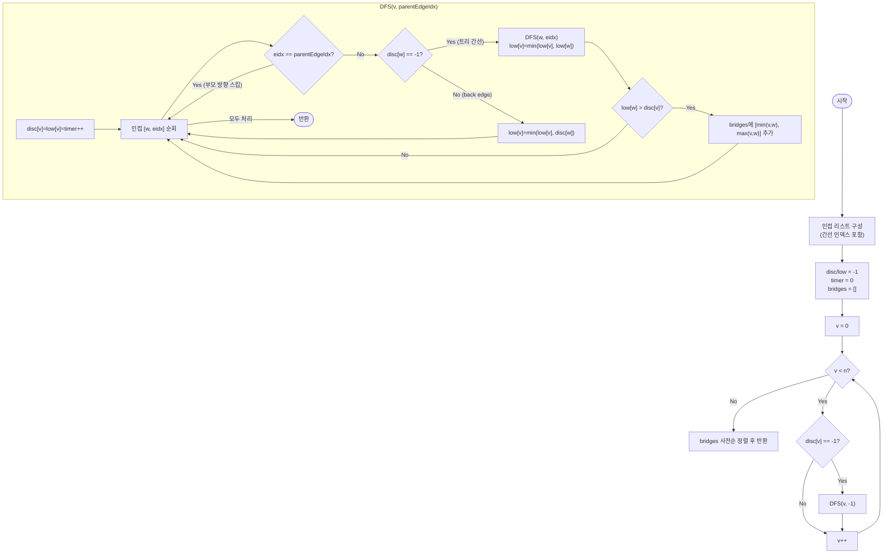

import { AlgorithmSimulation } from "#guide-sim";

# bridgesInGraph — 간선을 하나씩 지워보는 대신, DFS 한 번으로 우회로 없는 간선을 가려내는 이유

## 한눈에 보는 컨셉

무향 그래프에서 다리(bridge, 제거하면 그래프가 쪼개지는 간선)를 찾을 때, 간선을 하나씩 지워 보며 매번 연결성을 다시 확인하면 느립니다. DFS 트리를 **딱 한 번** 순회하면서 각 정점이 back edge를 타고 얼마나 위쪽 조상까지 되돌아갈 수 있는지(`low` 값)를 계산해 두면, 이 값 하나만으로 모든 간선의 다리 여부를 동시에 판정할 수 있어요. naive의 `O(E(V+E))`가 DFS 한 번의 `O(V+E)`로 줄어드는 것이 이번 알고리즘의 핵심입니다.

## 출발점: 가장 순진한 방법부터

문제를 먼저 정확히 잡을게요.

```ts
function bridgesInGraph(n: number, edges: [number, number][]): [number, number][]
```

| 파라미터 | 의미 | 제약 |
|----------|------|------|
| `n` | 정점 수, 번호는 $0 \ldots n-1$ | $1 \leq n \leq 10^5$ |
| `edges` | 무향 간선 목록 `[u, v]` | $0 \leq E \leq 10^5$ |
| 반환 | 다리 간선 배열. 각 원소 `[u,v]`는 $u < v$로 정규화, 전체 사전순 정렬 | 다리 없으면 `[]` |

다리의 정의를 그대로 코드로 옮기면 가장 정직한 방법이 나옵니다. **"간선 $(u,v)$를 지워 보고, 연결 성분 수가 늘었으면 다리다."**

```ts
function countComponents(n: number, edges: [number, number][]): number {
  const parent = Array.from({ length: n }, (_, i) => i);
  const find = (x: number): number => {
    while (parent[x] !== x) {
      parent[x] = parent[parent[x]!]!;
      x = parent[x]!;
    }
    return x;
  };
  const union = (a: number, b: number) => {
    const ra = find(a);
    const rb = find(b);
    if (ra !== rb) parent[ra] = rb;
  };
  for (const [u, v] of edges) union(u, v);
  const roots = new Set<number>();
  for (let i = 0; i < n; i++) roots.add(find(i));
  return roots.size;
}

function bridgesInGraphNaive(n: number, edges: [number, number][]): [number, number][] {
  const bridges: [number, number][] = [];
  const base = countComponents(n, edges);
  for (let i = 0; i < edges.length; i++) {
    const rest = edges.filter((_, j) => j !== i); // i번 간선만 뺀 그래프
    if (countComponents(n, rest) > base) {
      const [u, v] = edges[i]!;
      bridges.push(u < v ? [u, v] : [v, u]);
    }
  }
  bridges.sort((a, b) => a[0] - b[0] || a[1] - b[1]);
  return bridges;
}
```

작은 예로 비용을 체감해 봅시다. 간선 5개짜리 그래프라면 `countComponents`를 6번(기준 1번 + 간선마다 1번) 호출합니다. 각 호출이 union-find로 `O(V+E)`이니 전체는 `O(E(V+E))`예요.

```text
E = 5 개 간선  →  countComponents 호출 6회, 호출당 O(V+E)
E = 10^5, V = 10^5 이면:
  O(E(V+E)) = 10^5 × 2×10^5 = 2×10^10 연산   →  1초 안에 불가능(시간 초과)
```

문제의 근원은 간선을 하나 지울 때마다 그래프 전체를 처음부터 다시 훑는다는 점입니다. 앞서 지운 간선을 살펴보며 쌓인 정보(어디까지 연결돼 있었는지)를 다음 간선을 확인할 때 전혀 재사용하지 않아요. **"한 번의 탐색에서 얻은 정보로 모든 간선을 동시에 판정할 수는 없을까?"** — 이것이 다음 절로 이어지는 단서입니다.

## 아이디어 자세히 들여다보기

### DFS 트리로 다시 보기 — 수식과 그림

DFS로 그래프를 훑으면 방문한 간선은 두 종류로 나뉩니다. 처음 보는 정점으로 내려가는 **트리 간선**과, 이미 방문한 정점(조상)으로 거슬러 올라가는 **back edge**입니다.

```text
DFS(0)에서 시작한 삼각형 0-1-2:

    0 ──tree──▶ 1 ──tree──▶ 2
    ▲                       │
    └───────back edge───────┘

간선 (1,2)가 다리인지 알고 싶다면?
  2의 서브트리(자기 자신)가 1 또는 그 위(0)로 돌아가는 back edge를 갖는가?
  → 있다(2→0) → (1,2)를 지워도 2는 0을 거쳐 여전히 1에 닿는다 → 다리 아님
```

이 관찰을 숫자 하나로 요약하기 위해 두 값을 정의합니다.

$$\text{disc}(v) = \text{DFS가 } v \text{를 처음 방문한 순서(타임스탬프)}$$

$$\text{low}(v) = \min\!\left(\text{disc}(v),\;
  \min_{(v,w) \in \text{back edge}} \text{disc}(w),\;
  \min_{(v,c) \in \text{tree edge}} \text{low}(c)\right)$$

말로 풀면 $\text{low}(v)$는 "$v$의 서브트리 전체가 back edge를 통해 거슬러 올라갈 수 있는 가장 오래된(가장 작은 disc를 가진) 조상의 타임스탬프"입니다.

**왜 그냥 "back edge가 있다/없다"는 불리언이 아니라 숫자(disc)를 저장할까요?** 자식이 여럿인 정점에서는 각 자식 서브트리가 서로 다른 높이까지 되돌아갈 수 있습니다. 불리언만 저장하면 "되돌아간다"는 사실은 알아도 "얼마나 위까지"는 알 수 없어서, 그 정보를 부모가 이어받아 판단할 수 없어요. `disc` 값을 그대로 전파해야 "$u$보다 위인지 아래인지"를 조상마다 비교할 수 있습니다.

작은 예로 손으로 채워 볼까요? 삼각형 `0-1-2`(간선 `[0,1],[1,2],[2,0]`)에서 0부터 DFS하면:

| 정점 | disc | low | 근거 |
|------|------|-----|------|
| 0 | 0 | 0 | 시작점 |
| 1 | 1 | 0 | back edge 없음 → 자식 2의 low를 이어받음 |
| 2 | 2 | 0 | 2→0 back edge → $\text{low}(2)=\min(2,\text{disc}(0)=0)=0$ |

다리 판정식은 다음과 같습니다.

$$\text{bridge}(u, c) \iff \text{low}(c) > \text{disc}(u)$$

여기서 간선 $(1,2)$를 확인해 볼까요? $\text{low}(2)=0$, $\text{disc}(1)=1$이니 $0 > 1$은 거짓 → 다리가 아닙니다. 표와 그림이 말해 준 결론과 정확히 일치하죠.

### 단서를 설명해 주는 이론 — DFS 트리의 간선 분류

방금 쓴 "트리 간선/back edge" 구분은 즉흥적인 이름이 아니라 그래프 이론에서 이미 정리된 개념입니다. 방향 그래프 DFS에서는 간선이 트리 간선(tree edge), back edge, forward edge, cross edge 네 가지로 나뉩니다. 그런데 **무향 그래프**에서는 이 중 두 가지만 나타나요.

- forward edge(조상 → 먼 후손으로 지름길)가 생기려면, 그 간선을 부모 쪽에서 먼저 만났을 때 이미 방문 완료(visited) 상태인 후손으로 가는 간선이어야 합니다. 하지만 무향 간선은 양방향으로 존재하므로, 후손 쪽에서 먼저 그 간선을 만나 조상 방향 back edge로 처리해 버립니다 — 조상이 나중에 같은 간선을 forward edge로 다시 만날 일이 없습니다(간선 인덱스로 이미 부모 방향임을 알고 스킵합니다).
- cross edge(서로 다른 서브트리를 잇는 간선)도 마찬가지로, 무향 그래프에서 두 서브트리가 이미 갈라진 뒤에 만나는 간선이 있다면 DFS가 그 간선을 먼저 만난 시점에 상대는 아직 "조상 라인 위"에 있을 수밖에 없습니다(무향 그래프의 DFS는 항상 트리 간선 아니면 조상으로의 back edge만 만든다는 표준 결과입니다).

즉 **무향 그래프의 DFS에서 비-트리 간선은 전부 back edge**입니다. 그래서 앞 절의 정의가 "트리 간선 아니면 back edge"라는 이분법만으로 완전할 수 있었던 것이고, `low` 계산 점화식에 다른 경우를 추가로 고려할 필요가 없었던 것입니다. 뒤에서 볼 정당성 논증(경우의 완전성)이 바로 이 사실에 기대고 있으니 기억해 두세요.

### 셈을 맡는 자료구조 — 간선 인덱스를 함께 저장하는 인접 리스트

DFS는 "부모 방향으로 되돌아가는 간선"을 back edge로 착각하면 안 됩니다. 이때 부모를 **정점 번호**로 스킵하면 다중 간선(같은 두 정점을 잇는 간선이 두 개 이상)에서 오류가 납니다. 그래서 인접 리스트의 각 항목에 이웃 정점뿐 아니라 **그 간선의 인덱스**까지 함께 저장해, 정확히 "내가 타고 내려온 그 간선"만 골라 스킵합니다. 인접 리스트 자체의 구조와 구현이 궁금하다면 이 프로젝트의 [graphAdjList 가이드](../../../data-structures/graph-repr/graphAdjList/graphAdjList-guide.mdx)를 참고하세요 — 여기서는 "이웃 + 간선 인덱스를 함께 담는 배열의 배열"로만 쓰면 충분합니다.

### 왜 모순 없이 작동하는가

**귀납적 정당화.** DFS는 후위 순회처럼 자식을 모두 처리한 뒤 부모로 돌아오므로, "리프에서 루트로" 귀납합니다.

- **기저**: 자식이 없는(또는 모든 자식 처리가 끝난) 리프 정점 $c$는 $\text{low}(c) = \text{disc}(c)$로 시작해, 자신에게서 나가는 back edge들의 $\text{disc}$ 최솟값으로만 갱신됩니다. 이는 정의식 그대로이므로 자명하게 성립합니다.
- **귀납 단계**: 정점 $v$의 모든 자식 $c_1, \ldots, c_k$에 대해 $\text{low}(c_i)$가 이미 올바르게 계산되어 있다고 가정합니다. $v$에서 나가는 모든 간선은 앞 절의 이론에 따라 **트리 간선 아니면 back edge** 두 경우뿐입니다(경우의 완전성). 트리 간선이면 $\text{low}(v) \leftarrow \min(\text{low}(v), \text{low}(c_i))$로 자식의 도달 범위를 그대로 이어받고, back edge면 $\text{low}(v) \leftarrow \min(\text{low}(v), \text{disc}(w))$로 직접 도달한 조상의 타임스탬프를 반영합니다. 정의식의 우변에 있는 모든 항을 이 두 갈래가 정확히 다 덮으므로(각 경우의 정확성), $\text{low}(v)$는 정의대로 계산됩니다.

다리 판정 $\text{low}(c) > \text{disc}(u)$의 근거도 같은 자리에서 나옵니다. $\text{low}(c) > \text{disc}(u)$이면 $c$의 서브트리 어디에서도 $\text{disc}$ 값이 $\text{disc}(u)$ 이하인 정점으로 가는 back edge가 없다는 뜻이므로, $(u,c)$가 $u$와 $c$의 서브트리를 잇는 유일한 통로입니다 — 지우면 분리됩니다.

여기서 **헷갈리기 쉬운 포인트**가 하나 있습니다. **부모 방향 간선을 "정점 번호"로 스킵하는 실수**입니다.

```text
간선: [0,1], [0,1]  (0과 1 사이에 다중 간선 두 개, 인덱스 0과 1)

정점 번호로 부모를 추적하면:
  DFS(0,-1) → DFS(1, parent=0)
  1의 이웃 [0, eidx=0]: "이웃이 부모(0)다" → 스킵
  1의 이웃 [0, eidx=1]: "이웃이 부모(0)다" → 이것도 스킵 ✗
  → low[1]이 back edge를 하나도 못 받아 low[1]=disc[1]=1로 남는다
  → low[1]=1 > disc[0]=0 → (0,1)을 다리로 잘못 판정  ✗ (실제로는 다리 아님)

간선 인덱스로 부모를 추적하면:
  DFS(0,-1) → DFS(1, parentEdgeIdx=0)
  1의 이웃 [0, eidx=0]: eidx==parentEdgeIdx(0) → 스킵 (내가 타고 온 그 간선만)
  1의 이웃 [0, eidx=1]: eidx(1)!=parentEdgeIdx(0) → back edge로 처리
  → low[1]=min(disc[1]=1, disc[0]=0)=0
  → low[1]=0 > disc[0]=0? 거짓 → 다리 아님  ✓ (정답)
```

단절점(articulationPoints)과 다리를 같은 틀로 헷갈리는 경우도 있습니다. 등호 포함 여부가 다릅니다.

| 구분 | 조건 | 등호 포함? |
|------|------|-----------|
| 단절점 | $\text{low}(c) \geq \text{disc}(v)$ | 포함 |
| 다리 | $\text{low}(c) > \text{disc}(u)$ | 미포함 |

$\text{low}(c) = \text{disc}(u)$인 경우, $c$의 서브트리가 back edge로 정확히 $u$ 자신에게 닿습니다. 간선 $(u,c)$를 지워도 $c$는 이 back edge로 여전히 $u$에 연결되므로 다리가 아닙니다(등호 제외). 반면 정점 $u$ 자체를 지운다면 이 back edge도 함께 사라지므로 단절점 조건에서는 등호를 포함합니다.

엣지 케이스도 점검해 둡시다.

```text
정점 1개, 간선 없음        → DFS(0,-1) 한 번, low[0]=disc[0]=0, 비교 대상 자식 없음 → []
간선 없는 여러 정점        → 각 정점이 독립된 DFS 시작점 → 모두 고립, 다리 없음 → []
같은 정점 쌍 중복 간선     → 위에서 본 대로 back edge로 처리되어 다리에서 제외
이미 분리된 두 그래프      → for v in 0..n-1 루프가 미방문 정점마다 새 DFS를 시작 → 각 성분 안에서 독립적으로 다리 계산
```

## 아이디어를 코드로 옮기기

```ts
function bridgesInGraphRecursive(n: number, edges: [number, number][]): [number, number][] {
  const adj: Array<Array<[number, number]>> = Array.from({ length: n }, () => []);
  for (let i = 0; i < edges.length; i++) {
    const [u, v] = edges[i]!;
    adj[u]!.push([v, i]);
    adj[v]!.push([u, i]);
  }

  const disc = new Array<number>(n).fill(-1);
  const low = new Array<number>(n).fill(-1);
  const bridges: [number, number][] = [];
  let timer = 0;

  function dfs(v: number, parentEdgeIdx: number): void {
    disc[v] = low[v] = timer++;
    for (const [w, eidx] of adj[v]!) {
      if (eidx === parentEdgeIdx) continue; // 부모 방향 간선 스킵(간선 인덱스 기반)
      if (disc[w] === -1) {
        dfs(w, eidx);
        low[v] = Math.min(low[v]!, low[w]!);
        if (low[w]! > disc[v]!) {
          const u = Math.min(v, w);
          const c = Math.max(v, w);
          bridges.push([u, c]);
        }
      } else {
        low[v] = Math.min(low[v]!, disc[w]!);
      }
    }
  }

  for (let v = 0; v < n; v++) {
    if (disc[v] === -1) dfs(v, -1);
  }

  bridges.sort((a, b) => a[0] - b[0] || a[1] - b[1]);
  return bridges;
}
```

**가장 실수가 잦은 줄은 `if (eidx === parentEdgeIdx) continue;`입니다.** 앞 절에서 본 다중 간선 함정이 바로 이 줄 하나로 막힙니다 — 정점 번호가 아니라 간선 인덱스를 비교한다는 점을 놓치면 조용히 틀립니다. 그 외 결정 지점은 두 가지입니다.

- `disc`/`low`를 `-1`로 초기화해 "미방문"을 표시하고, `timer++`는 방문 **직후** 한 번만 증가합니다.
- `for v in 0..n-1` 바깥 루프는 그래프가 여러 연결 성분으로 나뉜 경우를 대비합니다. 이미 방문된 정점(`disc[v] !== -1`)은 건너뜁니다.

## 더 빠르게 만들 단서 찾기

이 구현은 이미 `O(V+E)`로 점근적으로 최적입니다. 그런데 자원 사용을 조금 더 관찰해 봅시다 — `dfs`는 재귀 함수이고, 정점 하나를 내려갈 때마다 호출 스택 프레임이 하나씩 쌓입니다. 선형 체인처럼 그래프가 한 방향으로 죽 이어져 있으면 재귀 깊이가 정점 수만큼 깊어집니다.

```text
n = 100,000개 정점이 0-1-2-...-99999로 한 줄로 이어진 체인
DFS(0) → DFS(1) → DFS(2) → ... → DFS(99999)
                                    호출 스택 깊이 100,000

실제 실행 결과 (bridgesInGraphRecursive, n=100000 체인):
  Maximum call stack size exceeded.   ← 런타임 스택 한도를 넘어 예외 발생
```

`V \leq 10^5`라는 제약이 바로 이 시나리오를 허용합니다. 알고리즘은 옳지만, 재귀 호출 자체가 자원(스택 공간)을 다 써버려 죽는다면 정답을 내지 못합니다. **"같은 계산을 재귀 없이도 할 수 없을까?"** — 이것이 이번 최적화의 단서입니다.

## 단서를 최적화로 연결하기

재귀 호출이 하는 일은 사실 단순합니다. "지금 보고 있는 정점, 그 정점에 들어올 때 쓴 부모 간선 인덱스, 그리고 인접 리스트를 어디까지 훑었는지"만 기억하면 됩니다. 이 세 가지를 담은 **프레임**을 배열(명시적 스택)에 직접 쌓으면, 함수 호출 스택 없이 똑같은 순서로 계산할 수 있습니다.

```text
Before (재귀):                       After (명시적 스택):
call dfs(0,-1)                       stack = [{v:0, parentEdgeIdx:-1, cursor:0}]
  call dfs(1,0)                      push  {v:1, parentEdgeIdx:0, cursor:0}
    call dfs(2,1)                    push  {v:2, parentEdgeIdx:1, cursor:0}
    return (low 전파)                pop 2, low[1]=min(low[1],low[2]) 갱신
  return (low 전파)                  pop 1, low[0]=min(low[0],low[1]) 갱신
return
호출 스택 깊이 = 재귀 깊이            배열 길이 = 재귀 깊이(똑같이 O(V))이지만
                                      힙에 있는 배열이라 런타임 콜스택 한도와 무관
```

불변식은 하나입니다. **각 프레임의 `cursor`는 "그 정점의 인접 리스트에서 다음에 확인할 위치"를 정확히 가리킨다.** 자식으로 내려갔다가(push) 돌아와도(pop 후 부모 프레임으로 복귀) 이 커서 덕분에 어디까지 봤는지 잃어버리지 않습니다.

## 최적화 코드

바뀌는 부분은 재귀 호출을 명시적 스택 루프로 펼치는 것뿐입니다. 전체를 다시 싣습니다(구조가 통째로 달라지므로).

```ts
function bridgesInGraph(n: number, edges: [number, number][]): [number, number][] {
  const adj: Array<Array<[number, number]>> = Array.from({ length: n }, () => []);
  for (let i = 0; i < edges.length; i++) {
    const [u, v] = edges[i]!;
    adj[u]!.push([v, i]);
    adj[v]!.push([u, i]);
  }

  const disc = new Array<number>(n).fill(-1);
  const low = new Array<number>(n).fill(-1);
  const bridges: [number, number][] = [];
  let timer = 0;

  type Frame = { v: number; parentEdgeIdx: number; cursor: number };

  for (let start = 0; start < n; start++) {
    if (disc[start] !== -1) continue;

    const stack: Frame[] = [{ v: start, parentEdgeIdx: -1, cursor: 0 }];
    disc[start] = low[start] = timer++;

    while (stack.length > 0) {
      const frame = stack[stack.length - 1]!;
      const neighbors = adj[frame.v]!;

      if (frame.cursor >= neighbors.length) {
        // v의 인접 리스트를 모두 처리 → 부모로 low 전파하고 다리 판정
        stack.pop();
        if (stack.length > 0) {
          const parent = stack[stack.length - 1]!;
          low[parent.v] = Math.min(low[parent.v]!, low[frame.v]!);
          if (low[frame.v]! > disc[parent.v]!) {
            const u = Math.min(parent.v, frame.v);
            const c = Math.max(parent.v, frame.v);
            bridges.push([u, c]);
          }
        }
        continue;
      }

      const [w, eidx] = neighbors[frame.cursor]!;
      frame.cursor++; // 이 이웃은 확인했으니 다음 호출에서는 넘어간다
      if (eidx === frame.parentEdgeIdx) continue;

      if (disc[w] === -1) {
        disc[w] = low[w] = timer++;
        stack.push({ v: w, parentEdgeIdx: eidx, cursor: 0 });
      } else {
        low[frame.v] = Math.min(low[frame.v]!, disc[w]!);
      }
    }
  }

  bridges.sort((a, b) => a[0] - b[0] || a[1] - b[1]);
  return bridges;
}
```

**가장 중요한 줄은 `frame.cursor++;`이고, 그것도 반드시 이웃을 꺼낸 직후·조건 분기 전에 실행돼야 합니다.** 만약 `if (eidx === frame.parentEdgeIdx) continue;`를 커서 증가보다 먼저 두면, 부모 방향 간선을 만날 때마다 커서가 그대로인 채 같은 자리를 계속 다시 읽어 무한 루프에 빠집니다.

```text
잘못된 순서 (cursor++ 를 건너뛰고 continue):
  frame.cursor = 0, neighbors[0] = [부모, parentEdgeIdx]
  → continue (cursor 그대로 0)
  → 다음 while 반복에서 다시 neighbors[0]을 읽는다
  → 영원히 같은 이웃만 반복 확인 → 무한 루프
```

기억법을 하나 남기면:

> 커서는 "다음에 볼 자리"가 아니라 "방금 본 자리를 지나왔다"는 표시입니다 — 무조건 먼저 전진시키고, 그다음에 무엇을 할지 결정합니다.

이제 이 최적화 사다리를 계속 올라갈 수 있을까요? 답은 "더 올라갈 자리가 없다"입니다. 다리인지 아닌지를 결정하려면 모든 간선을 최소 한 번씩은 살펴봐야 하고, 모든 정점에 도달할 수 있는지도 확인해야 합니다 — 즉 어떤 알고리즘이든 최소 $\Omega(V+E)$ 시간이 필요합니다. DFS 한 번으로 $O(V+E)$를 이미 달성했으므로 점근적으로 최적이고, 방금 한 재귀→반복 전환은 시간 복잡도를 더 줄인 게 아니라 **런타임 스택 한도라는 현실적 제약을 없앤 것**입니다. 참고로 이 low-link 방식(Tarjan의 다리 찾기)보다 점근적으로 더 빠른 특화 해법은 알려져 있지 않습니다 — 이 알고리즘 자체가 이 문제의 표준 최적해입니다.

## 실행 시각화

예시 무향 그래프 `n = 5`, `edges = [[0,1], [1,2], [2,0], [1,3], [3,4]]`에 대해 DFS로 `disc`/`low`를 계산해 다리를 찾는 과정입니다. 노드 위 표기는 `disc/low`이고, 빨간색은 현재 정점(active), 노란색은 DFS 스택(frontier), 회색은 완료(visited)입니다. 다리 판정은 `low[c] > disc[u]`(엄격 부등호)로, 삼각형 `0-1-2`의 간선은 back edge 우회로가 있어 다리가 아닙니다. 실제 반환값은 `[[1, 3], [3, 4]]`이며, 시뮬레이션 마지막 프레임과 일치합니다.

> 대화형 시뮬레이션은 MDX 런타임에서 표시됩니다.

export const nodes = [
  { id: 0, label: "0", x: 25, y: 25 },
  { id: 1, label: "1", x: 50, y: 50 },
  { id: 2, label: "2", x: 25, y: 78 },
  { id: 3, label: "3", x: 75, y: 38 },
  { id: 4, label: "4", x: 92, y: 70 },
];

export const edges = [
  { from: 0, to: 1, directed: false },
  { from: 1, to: 2, directed: false },
  { from: 2, to: 0, directed: false },
  { from: 1, to: 3, directed: false },
  { from: 3, to: 4, directed: false },
];

export const steps = [
  {
    title: "초기화",
    detail: "disc/low 미설정. 0에서 DFS 시작. 간선 인덱스로 부모 방향을 추적.",
    nodes, edges,
    nodeStatus: {},
    nodeValue: { 0: "−", 1: "−", 2: "−", 3: "−", 4: "−" },
    entries: [
      { label: "disc", value: "[-, -, -, -, -]" },
      { label: "low", value: "[-, -, -, -, -]" },
      { label: "다리", value: "[]" },
    ],
  },
  {
    title: "DFS(0) → DFS(1) → DFS(2)",
    detail: "트리 간선으로 0,1,2 진입. disc = 0,1,2.",
    nodes, edges,
    nodeStatus: { 0: "frontier", 1: "frontier", 2: "active" },
    nodeValue: { 0: "0/0", 1: "1/1", 2: "2/2", 3: "−", 4: "−" },
    entries: [
      { label: "disc", value: "[0, 1, 2, -, -]" },
      { label: "low", value: "[0, 1, 2, -, -]" },
      { label: "다리", value: "[]" },
    ],
  },
  {
    title: "back edge 2 → 0",
    detail: "2에서 0으로 back edge → low[2]=min(2, disc[0]=0)=0. 삼각형이 닫힌다.",
    nodes, edges,
    nodeStatus: { 0: "frontier", 1: "frontier", 2: "active" },
    nodeValue: { 0: "0/0", 1: "1/1", 2: "2/0", 3: "−", 4: "−" },
    activeEdge: { from: 2, to: 0 },
    entries: [
      { label: "disc", value: "[0, 1, 2, -, -]" },
      { label: "low", value: "[0, 1, 0, -, -]" },
      { label: "다리", value: "[]" },
    ],
  },
  {
    title: "2 반환: (1,2)는 다리 아님",
    detail: "low[1]=min(1, low[2]=0)=0. 간선 (1,2): low[2]=0 > disc[1]=1? 아니오 → 다리 아님.",
    nodes, edges,
    nodeStatus: { 0: "frontier", 1: "active", 2: "visited" },
    nodeValue: { 0: "0/0", 1: "1/0", 2: "2/0", 3: "−", 4: "−" },
    entries: [
      { label: "disc", value: "[0, 1, 2, -, -]" },
      { label: "low", value: "[0, 0, 0, -, -]" },
      { label: "다리", value: "[]" },
    ],
  },
  {
    title: "DFS(3) → DFS(4)",
    detail: "트리 간선 1→3→4. disc = 3,4. 4는 back edge 없음 → low[4]=4.",
    nodes, edges,
    nodeStatus: { 0: "frontier", 1: "frontier", 2: "visited", 3: "frontier", 4: "active" },
    nodeValue: { 0: "0/0", 1: "1/0", 2: "2/0", 3: "3/3", 4: "4/4" },
    entries: [
      { label: "disc", value: "[0, 1, 2, 3, 4]" },
      { label: "low", value: "[0, 0, 0, 3, 4]" },
      { label: "다리", value: "[]" },
    ],
  },
  {
    title: "(3,4)는 다리!",
    detail: "4 반환: low[4]=4 > disc[3]=3 → 간선 (3,4)는 다리. 우회로가 없다.",
    nodes, edges,
    nodeStatus: { 0: "frontier", 1: "frontier", 2: "visited", 3: "active", 4: "visited" },
    nodeValue: { 0: "0/0", 1: "1/0", 2: "2/0", 3: "3/3", 4: "4/4" },
    activeEdge: { from: 3, to: 4 },
    entries: [
      { label: "disc", value: "[0, 1, 2, 3, 4]" },
      { label: "low", value: "[0, 0, 0, 3, 4]" },
      { label: "다리", value: "[[3, 4]]" },
    ],
  },
  {
    title: "(1,3)도 다리!",
    detail: "3 반환: low[3]=3 > disc[1]=1 → 간선 (1,3)도 다리.",
    nodes, edges,
    nodeStatus: { 0: "visited", 1: "active", 2: "visited", 3: "visited", 4: "visited" },
    nodeValue: { 0: "0/0", 1: "1/0", 2: "2/0", 3: "3/3", 4: "4/4" },
    activeEdge: { from: 1, to: 3 },
    entries: [
      { label: "disc", value: "[0, 1, 2, 3, 4]" },
      { label: "low", value: "[0, 0, 0, 3, 4]" },
      { label: "다리", value: "[[1, 3], [3, 4]]" },
    ],
  },
  {
    title: "완료: [[1, 3], [3, 4]]",
    detail: "삼각형 간선 3개는 우회로가 있어 제외. 사전순 정렬해 반환.",
    nodes, edges,
    nodeStatus: { 0: "visited", 1: "visited", 2: "visited", 3: "visited", 4: "visited" },
    nodeValue: { 0: "0/0", 1: "1/0", 2: "2/0", 3: "3/3", 4: "4/4" },
    entries: [
      { label: "disc", value: "[0, 1, 2, 3, 4]" },
      { label: "low", value: "[0, 0, 0, 3, 4]" },
      { label: "다리", value: "[[1, 3], [3, 4]]" },
    ],
  },
];

<AlgorithmSimulation view={["graph", "keyValue"]} steps={steps} title="다리 찾기 (DFS disc/low)" />

## 흐름 한눈에 보기


```mermaid
flowchart TD
    A([시작]) --> B["인접 리스트 구성<br/>(간선 인덱스 포함)"]
    B --> C["disc/low = -1<br/>timer = 0<br/>bridges = []"]
    C --> D[v = 0]
    D --> E{v < n?}
    E -- No --> K["bridges 사전순 정렬 후 반환"]
    E -- Yes --> F{"disc[v] == -1?"}
    F -- No --> J[v++] --> E
    F -- Yes --> G["DFS(v, -1)"]
    G --> J

    subgraph DFS["DFS(v, parentEdgeIdx)"]
        D1["disc[v]=low[v]=timer++"]
        D1 --> D2["인접 [w, eidx] 순회"]
        D2 --> D3{"eidx == parentEdgeIdx?"}
        D3 -- "Yes (부모 방향 스킵)" --> D2
        D3 -- No --> D4{"disc[w] == -1?"}
        D4 -- "Yes (트리 간선)" --> D5["DFS(w, eidx)<br/>low[v]=min(low[v], low[w])"]
        D5 --> D6{"low[w] > disc[v]?"}
        D6 -- Yes --> D7["bridges에 [min(v,w), max(v,w)] 추가"] --> D2
        D6 -- No --> D2
        D4 -- "No (back edge)" --> D8["low[v]=min(low[v], disc[w])"] --> D2
        D2 -- "모두 처리" --> D9([반환])
    end
```

## 스스로 점검하기

1. `n = 4`, `edges = [[0,1],[1,2],[1,3]]`(별 모양, 1이 중심)에 대해 0부터 DFS한다고 할 때 `disc`, `low` 배열을 손으로 채우고 다리 목록을 구해 보세요. (힌트: back edge가 하나도 없는 그래프이므로 모든 간선이 다리입니다. `disc=[0,1,2,3]`, `low=[0,1,2,3]`, 다리는 `[[0,1],[1,2],[1,3]]`.)
2. 다중 간선 함정 절의 예시 `edges = [[0,1],[0,1]]`에서, 만약 부모 스킵을 간선 인덱스가 아니라 **"방문 순서상 바로 전 정점"**으로 구현했다면 `low[1]`이 몇으로 계산되는지, 그리고 그 결과로 `(0,1)`이 다리로 잘못 판정되는 과정을 앞의 반례를 참고해 직접 추적해 보세요.
3. 이 알고리즘을 살짝 바꿔 **단절점(articulation point)**을 찾으려면 무엇을 바꿔야 할까요? 다리 판정식 `low(c) > disc(u)`과 단절점 조건 `low(c) >= disc(v)`의 등호 차이가 왜 생기는지, 그리고 루트 정점(부모가 없는 시작 정점)은 이 조건만으로 판정할 수 없는 이유(자식이 2개 이상이어야 단절점)까지 생각해 보세요.
