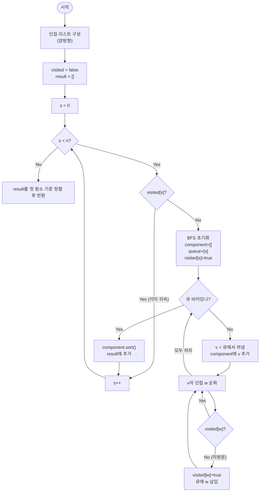

import { AlgorithmSimulation } from "#guide-sim";

# connectedComponents 해설

## 성능 목표 예측

| 제약 | 값 |
|------|----|
| 정점 수 $V$ | $1 \leq V \leq 10^5$ |
| 간선 수 $E$ | $0 \leq E \leq 10^5$ |
| 정점 번호 | $0 \ldots n-1$ |
| 그래프 종류 | 무향 |

**naive 접근의 비용**: 모든 정점 쌍 $(u, v)$에 대해 경로 존재 여부를 BFS/DFS로 확인하고 동치류를 묶는다.
$O(V^2)$ 쌍 × 탐색 $O(V + E)$ = $O(V^2(V + E))$.
$V = 10^5$이면 $10^{15}$ → 완전히 불가.

조금 나은 방법: 정점마다 독립적으로 DFS를 실행하고 방문 여부로 중복을 줄인다.
$O(V + E)$ — 이것이 이미 최선이다.

**목표**: 단 한 번의 탐색으로 모든 연결 성분을 동시에 식별한다.
시간 $O(V + E)$, 공간 $O(V + E)$.

**공간 트레이드오프**: 인접 리스트 $O(V + E)$. 인접 행렬은 $O(V^2) = 10^{10}$ 바이트로 불가.

---

## 목표 함수

```ts
function connectedComponents(n: number, edges: [number, number][]): number[][]
```

| 파라미터 | 의미 | 제약 |
|----------|------|------|
| `n` | 정점 수 | $1 \leq n \leq 10^5$ |
| `edges` | 무향 간선 목록 `[u, v]` | $0 \leq E \leq 10^5$ |
| 반환 | 각 성분이 **오름차순 정렬**된 정점 배열; 성분 배열 자체도 **각 성분의 첫 원소 기준 오름차순** | — |

**엣지케이스**

1. **간선 없음** ($E = 0$): 정점이 모두 고립됨. 성분이 $n$개, 각각 `[i]`.
2. **단일 정점** ($n = 1$): `[[0]]`.
3. **완전 연결 그래프**: 성분 1개, 모든 정점 포함.
4. **최대 입력** ($V = E = 10^5$): BFS 큐에 최대 $V$개 정점, 각 간선을 두 방향으로 한 번씩 총 $2E$번 처리.

---

## 핵심 아이디어

**핵심 아이디어**: "BFS를 한 번 돌리면 출발점과 연결된 모든 정점이 드러난다 — 이것이 곧 하나의 연결 성분이다."

두 정점이 같은 성분인지 모든 쌍에 대해 개별 탐색하면 $O(V^2(V+E))$로 너무 느리다. 대신 미방문 정점을 발견할 때마다 BFS를 새로 시작하면, 각 BFS 호출이 정확히 하나의 연결 성분 전체를 수집한다. 이미 방문한 정점은 다음 BFS에서 건너뛰므로 모든 정점과 간선이 총 한 번씩만 처리되어 $O(V+E)$가 된다.

**풀이 구조**
1. 인접 리스트를 양방향으로 구성하고, `visited` 배열을 `false`로 초기화한다.
2. 모든 정점을 순서대로 순회하며, 미방문 정점 `s`를 발견하면 새 BFS를 시작한다.
3. BFS 내에서 도달 가능한 모든 정점을 수집해 하나의 연결 성분으로 기록한다(큐에 넣는 시점에 `visited = true`).
4. 수집된 성분 내 정점을 오름차순 정렬한다.
5. 모든 성분을 각 성분의 최솟값(첫 원소) 기준으로 오름차순 정렬하여 반환한다.

**조건**: 무향 그래프. 방향 그래프에서는 "강한 연결 성분(SCC)"을 별도 알고리즘으로 찾아야 한다.

**대표 예시**: 지도에서 육지 덩어리(섬) 개수 세기
각 육지 셀을 정점으로, 인접한 셀을 간선으로 모델링하면 BFS 한 번이 섬 하나를 완전히 탐색한다. BFS를 총 몇 번 시작했느냐가 섬의 개수가 된다.

**언제 쓰나**
그래프가 몇 개의 독립된 덩어리로 이루어져 있는지 파악하거나, 특정 정점이 속한 덩어리를 찾아야 할 때 사용한다. Union-Find로도 같은 문제를 풀 수 있지만, 각 성분의 정점 목록이 필요하다면 BFS/DFS 기반 방법이 더 적합하다.

---

### 원형 아이디어와 naive 접근

"두 정점 $u, v$가 같은 연결 성분인가?"를 각 쌍에 대해 개별 탐색으로 확인한다.

```
for u in 0..n-1:
  for v in u+1..n-1:
    if path_exists(u, v):    -- BFS/DFS O(V+E)
      merge(u, v)            -- 같은 성분으로 묶기
```

$O(V^2)$번의 BFS → $O(V^2(V+E)) = O(10^{15})$. 불가.

문제의 근원: 이미 같은 성분임이 알려진 정점들을 반복해서 탐색한다. BFS를 한 번 실행하면 한 성분의 정점 전부를 알 수 있는데, 이 정보를 버리고 다시 시작한다.

### 어떤 관찰이 돌파구가 되는가

- **관찰 1**: "연결됨"은 동치 관계(reflexive, symmetric, transitive)이다. 따라서 정점 집합을 동치류로 나누면 각 동치류가 정확히 하나의 연결 성분이 된다.
- **관찰 2**: BFS를 정점 $s$에서 시작하면, $s$에서 도달 가능한 모든 정점을 한 번의 탐색으로 수집할 수 있다. 이것이 $s$의 동치류 전체이다.
- **관찰 3**: BFS가 끝난 뒤 방문되지 않은 정점이 있다면, 그 정점은 반드시 다른 동치류에 속한다. 따라서 모든 미방문 정점을 순서대로 BFS 출발점으로 삼으면, 각 BFS 호출은 정확히 하나의 새로운 연결 성분을 수집한다.

### 관찰을 형식화: 상태/구조 정의

상태:

$$\text{visited}[v] = \begin{cases} \text{false} & v \text{ 미방문} \\ \text{true} & v \text{ 이미 어떤 성분에 귀속됨} \end{cases}$$

왜 성분 번호(ID)가 아닌 불리언인가? 목표가 "성분 ID 할당"이 아니라 "정점 수집"이므로, 불리언이면 충분하다. 성분 ID까지 필요한 문제라면 정수 배열을 쓴다.

자료구조: FIFO 큐. BFS의 레벨 순서 탐색을 보장한다(연결 성분 문제에서는 DFS도 동등하게 동작하지만, BFS가 직관적이다).

### 점화식 또는 핵심 연산

BFS 내부 전이:

$$\text{if not visited}[w] \text{ and } (v, w) \in E: \quad \text{visited}[w] \leftarrow \text{true},\;\text{component} \leftarrow \text{component} \cup \{w\}$$

외부 루프:

$$\text{for } s = 0, 1, \ldots, n-1: \quad \text{if not visited}[s]: \text{새 BFS 시작} \to \text{새 성분 수집}$$

각 항의 의미:
- 외부 루프에서 `visited[s]`가 false인 시점: $s$는 아직 어떤 성분에도 속하지 않음 → $s$를 루트로 하는 새 성분 탐색 시작
- BFS 내부의 `visited[w] = true`: $w$를 현재 성분에 귀속. 이후 같은 $w$를 다른 BFS에서 출발점으로 삼지 않는다

### 정당성 — 왜 이것이 옳은가

귀납적으로 증명한다. BFS를 정점 $s$에서 시작하면, 큐를 통해 도달하는 정점 집합은 $s$와 경로로 연결된 정점들의 정확한 집합이다(BFS 정확성).

외부 루프가 $s$를 새 출발점으로 선택하는 시점에서 $s$가 방문되지 않았다는 것은, 이전의 모든 BFS 탐색에서 $s$에 도달하지 못했다는 의미이다. 도달하지 못했다는 것은 $s$와 이전 BFS 출발점들이 다른 연결 성분에 속한다는 것과 동치이다.

따라서 각 BFS 호출은 서로 다른 연결 성분을 수집하며, 모든 정점을 방문한 뒤 수집된 성분들의 합집합이 전체 정점 집합과 일치한다 → 정확성 보장.

까다로운 케이스: 자기 루프 $(v, v)$가 있어도 `visited[v] = true`가 이미 설정되어 있으므로 중복 처리되지 않는다.

### 구현 디테일과 최적화

**visited 설정 시점**: 큐에 넣는 시점에 `visited[w] = true`를 설정해야 한다. 큐에서 꺼낼 때 설정하면 같은 정점이 큐에 여러 번 삽입되어 $O(V \cdot E)$로 나빠진다.

**정렬 위치**: BFS 수집 순서는 큐 초기 상태와 인접 리스트 순서에 따라 달라진다. 수집 후 `component.sort()`로 정렬해야 출력 명세(정점 오름차순)를 만족한다. 성분 배열 자체도 각 성분의 첫 원소(= 정렬 후 최솟값) 기준으로 재정렬한다.

**DFS vs BFS**: 연결 성분 문제에서는 어느 쪽이든 $O(V + E)$이다. DFS는 재귀 깊이가 $V = 10^5$에 달할 수 있어 스택 오버플로우 위험이 있다. BFS가 더 안전하다.

**큐 구현**: `Array.shift()`는 $O(n)$이다. 실전에서는 인덱스 포인터(head 변수)를 이용한 슬라이딩 윈도우 큐를 사용한다.

## 시뮬레이션

예시 무향 그래프 `n = 6`, `edges = [[0,1], [1,2], [3,4]]` (정점 5는 고립)에 대해 연결 성분을 수집하는 과정이다. 빨간색은 방금 꺼내 처리 중인 정점(active), 노란색은 큐에 있는 정점(frontier), 회색은 이미 어떤 성분에 귀속된 정점(visited)이다. `keyValue` 패널은 현재 수집 중인 성분, 완성된 결과, 큐를 보여준다.

실제 반환값은 `[[0, 1, 2], [3, 4], [5]]` 이며, 시뮬레이션 마지막 프레임의 결과와 일치한다.

> 대화형 시뮬레이션은 MDX 런타임에서 표시됩니다.

export const nodes = [
  { id: 0, label: "0", x: 16, y: 22 },
  { id: 1, label: "1", x: 16, y: 50 },
  { id: 2, label: "2", x: 16, y: 78 },
  { id: 3, label: "3", x: 60, y: 30 },
  { id: 4, label: "4", x: 60, y: 64 },
  { id: 5, label: "5", x: 90, y: 80 },
];

export const edges = [
  { from: 0, to: 1, directed: false },
  { from: 1, to: 2, directed: false },
  { from: 3, to: 4, directed: false },
];

export const steps = [
  {
    title: "초기화",
    detail: "visited 전체 false, result 비어 있음. s를 0부터 순회한다.",
    nodes, edges,
    nodeStatus: {},
    entries: [
      { label: "현재 성분", value: "[]" },
      { label: "result", value: "[]" },
      { label: "큐", value: "[]" },
    ],
  },
  {
    title: "s=0: 새 BFS 시작",
    detail: "0이 미방문 → 새 성분 탐색 시작. 0을 큐에 넣는다.",
    nodes, edges,
    nodeStatus: { 0: "frontier" },
    entries: [
      { label: "현재 성분", value: "[]" },
      { label: "result", value: "[]" },
      { label: "큐", value: "[0]" },
    ],
  },
  {
    title: "0 처리",
    detail: "0을 꺼내 성분에 추가. 이웃 1을 큐에 넣는다.",
    nodes, edges,
    nodeStatus: { 0: "active", 1: "frontier" },
    activeEdge: { from: 0, to: 1 },
    entries: [
      { label: "현재 성분", value: "[0]" },
      { label: "result", value: "[]" },
      { label: "큐", value: "[1]" },
    ],
  },
  {
    title: "1 처리",
    detail: "1을 꺼내 성분에 추가. 이웃 2를 큐에 넣는다. (0은 방문됨)",
    nodes, edges,
    nodeStatus: { 0: "visited", 1: "active", 2: "frontier" },
    activeEdge: { from: 1, to: 2 },
    entries: [
      { label: "현재 성분", value: "[0, 1]" },
      { label: "result", value: "[]" },
      { label: "큐", value: "[2]" },
    ],
  },
  {
    title: "2 처리",
    detail: "2를 꺼내 성분에 추가. 이웃 1은 방문됨. 큐가 비었다.",
    nodes, edges,
    nodeStatus: { 0: "visited", 1: "visited", 2: "active" },
    entries: [
      { label: "현재 성분", value: "[0, 1, 2]" },
      { label: "result", value: "[]" },
      { label: "큐", value: "[]" },
    ],
  },
  {
    title: "성분 1 확정",
    detail: "정렬 후 [0, 1, 2]를 result에 추가.",
    nodes, edges,
    nodeStatus: { 0: "visited", 1: "visited", 2: "visited" },
    entries: [
      { label: "현재 성분", value: "[]" },
      { label: "result", value: "[[0, 1, 2]]" },
      { label: "큐", value: "[]" },
    ],
  },
  {
    title: "s=3: 새 BFS 시작",
    detail: "1, 2는 방문됨이라 건너뜀. 3이 미방문 → 새 성분 시작.",
    nodes, edges,
    nodeStatus: { 0: "visited", 1: "visited", 2: "visited", 3: "frontier" },
    entries: [
      { label: "현재 성분", value: "[]" },
      { label: "result", value: "[[0, 1, 2]]" },
      { label: "큐", value: "[3]" },
    ],
  },
  {
    title: "3 처리",
    detail: "3을 꺼내 성분에 추가. 이웃 4를 큐에 넣는다.",
    nodes, edges,
    nodeStatus: { 0: "visited", 1: "visited", 2: "visited", 3: "active", 4: "frontier" },
    activeEdge: { from: 3, to: 4 },
    entries: [
      { label: "현재 성분", value: "[3]" },
      { label: "result", value: "[[0, 1, 2]]" },
      { label: "큐", value: "[4]" },
    ],
  },
  {
    title: "4 처리",
    detail: "4를 꺼내 성분에 추가. 큐가 비었다.",
    nodes, edges,
    nodeStatus: { 0: "visited", 1: "visited", 2: "visited", 3: "visited", 4: "active" },
    entries: [
      { label: "현재 성분", value: "[3, 4]" },
      { label: "result", value: "[[0, 1, 2]]" },
      { label: "큐", value: "[]" },
    ],
  },
  {
    title: "성분 2 확정",
    detail: "[3, 4]를 result에 추가.",
    nodes, edges,
    nodeStatus: { 0: "visited", 1: "visited", 2: "visited", 3: "visited", 4: "visited" },
    entries: [
      { label: "현재 성분", value: "[]" },
      { label: "result", value: "[[0, 1, 2], [3, 4]]" },
      { label: "큐", value: "[]" },
    ],
  },
  {
    title: "s=5: 고립 정점",
    detail: "5가 미방문 → 새 BFS. 이웃이 없어 성분 [5] 하나만 수집.",
    nodes, edges,
    nodeStatus: { 0: "visited", 1: "visited", 2: "visited", 3: "visited", 4: "visited", 5: "active" },
    entries: [
      { label: "현재 성분", value: "[5]" },
      { label: "result", value: "[[0, 1, 2], [3, 4]]" },
      { label: "큐", value: "[]" },
    ],
  },
  {
    title: "완료: [[0,1,2], [3,4], [5]]",
    detail: "모든 정점 방문 완료. 성분 3개를 첫 원소 기준 정렬해 반환.",
    nodes, edges,
    nodeStatus: { 0: "visited", 1: "visited", 2: "visited", 3: "visited", 4: "visited", 5: "visited" },
    entries: [
      { label: "현재 성분", value: "[]" },
      { label: "result", value: "[[0, 1, 2], [3, 4], [5]]" },
      { label: "큐", value: "[]" },
    ],
  },
];

<AlgorithmSimulation view={["graph", "keyValue"]} steps={steps} title="연결 성분 수집 (반복 BFS)" />

## 수도 코드와 Activity Diagram

### 의사코드

```
function connectedComponents(n, edges):
  adj[0..n-1] = 빈 리스트
  for [u, v] in edges:
    adj[u].push(v)
    adj[v].push(u)             -- 무향: 양방향 등록

  visited[0..n-1] = false      -- 불변식: visited[v]는 v가 어떤 성분에 귀속됐음을 의미
  result = []

  for s in 0..n-1:
    if visited[s]:
      continue                 -- 이미 성분 확정된 정점은 건너뜀

    -- BFS 시작: s를 루트로 하는 새 성분 수집
    component = []
    queue = [s]
    visited[s] = true          -- 큐 삽입 시점에 즉시 표시 (중복 방지)

    while queue is not empty:
      v = queue.dequeue()
      component.push(v)        -- 불변식: component는 현재 BFS가 수집한 성분의 정점들
      for w in adj[v]:
        if not visited[w]:
          visited[w] = true
          queue.enqueue(w)

    component.sort()           -- 불변식: 추가 전 정렬 → 출력 명세 만족
    result.push(component)

  result.sort by first element -- 각 성분의 최솟값 기준 정렬
  return result
```

**핵심 불변식:**
`visited[v] = true`는 큐에 넣는 시점에 설정된다. 이로 인해 각 정점은 정확히 한 번만 큐에 삽입되며, 전체 시간복잡도 $O(V + E)$가 보장된다.

### Activity Diagram


