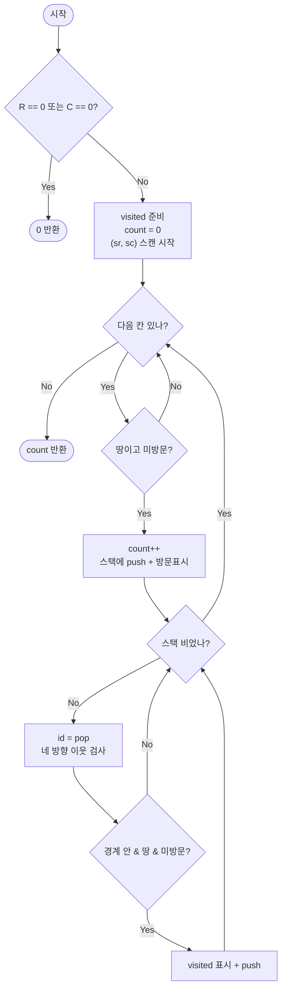

import { AlgorithmSimulation } from "#guide-sim";

# countIslands — 그리드를 암묵적 그래프로 보고 섬을 하나씩 침몰시키기

## 한눈에 보는 컨셉

`0`(물)과 `1`(땅)으로 채워진 격자에서, 상하좌우로 이어진 땅 덩어리(섬)가 몇 개인지 세는 문제예요. 핵심 관찰은 "격자의 각 칸은 상·하·좌·우 네 이웃과 연결된 **암묵적 그래프의 정점**"이라는 것이고, 아직 방문 안 한 땅을 만날 때마다 그 섬 전체를 flood fill로 통째로 침몰시키면 **flood fill을 시작한 횟수가 곧 섬의 개수**가 됩니다. 모든 칸을 상수 번만 훑으므로 시간은 격자 크기 $R \times C$에 대해 `O(R·C)`예요. 공간도 짚어 둘게요 — 입력 `grid`를 건드리지 않으려면 같은 크기의 `visited`가 필요하니 추가 공간은 `O(R·C)`이고, 뒤에 나오는 재귀 버전은 그 위에 호출 스택이 최악 `O(R·C)`까지 더 쌓입니다. 즉 "재귀만 피하면 메모리는 공짜"가 아니라, `visited` 자체가 이미 격자 크기에 비례하는 메모리를 씁니다.

## 출발점: 가장 순진한 방법부터

문제를 먼저 정확히 고정할게요.

```ts
function countIslands(grid: number[][]): number
```

| 항목 | 의미 | 제약 |
|------|------|------|
| `grid` | 직사각형 0/1 격자. `grid[r][c]`가 `1`이면 땅, `0`이면 물 | $0 \leq R, C \leq 10^3$, $R \times C \leq 10^6$ |
| 반환값 | 상하좌우로 연결된 땅 덩어리(섬)의 개수 | 대각선은 연결로 치지 않음 |
| 입력 계약 | `grid`와 각 행 배열을 **변형하지 않는다** | 방문 표시용 임시 수정도 금지 |

"연결된 땅 덩어리를 세라"는 요구는 자연스럽게 "땅 칸 하나에서 출발해 이어진 땅을 끝까지 따라가며 한 덩어리를 통째로 표시하고, 새 덩어리를 만날 때마다 하나씩 세자"는 생각으로 이어져요. 한 덩어리를 "끝까지 따라가는" 가장 정직한 방법은 재귀예요 — 지금 칸을 방문 표시하고, 네 방향 이웃에 대해 자기 자신을 다시 부르는 겁니다. 이게 **flood fill**이에요.

```text
grid =                     바깥 이중 루프가 (0,0)에서 처음 땅을 만나면:
  [1, 1, 0]                  count를 1 올리고, 그 칸에서 flood fill 시작
  [0, 1, 0]                    (0,0) → 우 (0,1) → 하 (1,1) 까지 번져 한 섬을 다 칠함
  [0, 0, 1]                  이후 (2,2)에서 새 땅을 만나면 count를 2로 올리고 또 침몰
                           → 스캔이 끝나면 count = 2
```

칸이 $R \times C$개인데 각 칸은 딱 한 번만 방문 표시되고, 각 칸에서 이웃 네 방향만 보므로 전체 일은 `O(R·C)`예요. 시간 복잡도만 보면 이 순진한 재귀가 이미 최적입니다. 그런데 여기엔 시간과는 **다른 축**의 함정이 숨어 있어요 — 재귀가 얼마나 **깊이** 쌓이느냐입니다. 그 낌새는 뒤에서 큰 격자로 직접 터뜨려 보겠습니다.

## 아이디어 자세히 들여다보기

### 격자는 사실 그래프다 — 수식과 그림

먼저 "섬"을 정식으로 정의할게요. 칸 $(r, c)$를 정점으로 두고, 두 땅 칸 사이에 간선을 이렇게 놓습니다.

$$(r, c) \sim (r', c') \iff \text{grid}[r][c] = \text{grid}[r'][c'] = 1 \ \text{이고} \ |r - r'| + |c - c'| = 1$$

여기서 $|r - r'| + |c - c'| = 1$ 이 바로 "상·하·좌·우 한 칸"이라는 조건이에요(맨해튼 거리 1). 그러면 **섬 = 이 그래프의 연결 성분(connected component)**, 섬의 개수 = 연결 성분의 개수가 됩니다.

**왜 하필 맨해튼 거리 1일까요?** 대각선까지 이웃으로 치려면 $\max(|r-r'|, |c-c'|) = 1$(체비쇼프 거리 1, 8방향)로 정의해야 해요. 문제 계약이 "한 변을 공유"로 못 박았으니 우리는 4방향만 씁니다. 이 정의 차이가 답을 얼마나 바꾸는지 대각선 격자로 확인해 봅시다.

```text
grid =              4방향(우리 정의):        8방향이라면:
  [1, 0, 1]           ● · ●   세 ●가 서로       ● · ●   대각선으로 다 이어져
  [0, 1, 0]           · ● ·   변을 안 맞댐        ╲●╱    하나의 섬
  [1, 0, 1]           ● · ●   → 5개 섬            ● · ●   → 1개 섬
```

이웃의 정의(간선을 어디에 긋느냐) 하나가 답을 5에서 1로 바꿔요. 우리 문제의 정답은 왼쪽, **5개**입니다.

잠깐 확인 하나만 해 볼까요? 맨 위 `한눈에 보는 컨셉`의 예시 `[[1,1,0],[0,1,0],[0,0,1]]`에서 칸 $(0,1)$과 $(1,1)$은 같은 섬일까요? — 두 칸은 행이 1만큼 차이 나고 열은 같으니 맨해튼 거리 1, 변을 공유합니다. 둘 다 땅이니 같은 섬이에요. 반면 $(0,1)$과 $(2,2)$는 멀리 떨어져 이어지는 땅 경로가 없으니 다른 섬입니다.

### 셈을 맡는 자료구조 — visited 배열

flood fill을 하려면 "이 칸을 이미 밟았나?"를 기억해야 해요. 안 그러면 두 칸이 서로를 무한히 다시 부르며 같은 자리를 맴돕니다. 흔한 flood fill 구현은 방문한 땅 칸의 값을 `1`에서 `0`으로 덮어써 격자 자체를 방문 표시판으로 재활용해요 — 메모리도 안 쓰고 빠릅니다. 하지만 이 문제는 **`grid` 불변**이 계약이에요. 그래서 우리는 같은 크기의 별도 `visited` 배열을 두고 거기에만 표시합니다(이 트레이드오프는 최적화 절에서 다시 짚을게요).

이 문제는 결국 "암묵적 그리드 그래프의 연결 성분 개수 세기"라, 명시적인 인접 리스트로 같은 일을 하는 [connectedComponents 가이드](../connectedComponents/connectedComponents-guide.mdx)와 뼈대가 같아요. 거기서는 정점·간선이 명시적으로 주어지고, 여기서는 격자 좌표와 "상하좌우"라는 규칙이 간선을 **암묵적으로** 만들어 낸다는 점만 다릅니다. `visited`가 하는 역할(정점을 한 번만 처리하도록 보장)은 두 곳에서 완전히 똑같아요.

### 왜 모순 없이 작동하는가

"바깥 이중 루프가 아직 방문 안 한 땅을 만날 때마다 count를 1 올리고 그 섬을 통째로 침몰시킨다"는 절차가 **각 섬을 정확히 한 번씩** 센다는 걸 귀납으로 보일게요.

**기저**: 아직 아무 칸도 방문하지 않은 시작 시점, count는 0이고 "이미 센 섬"도 0개라 옳습니다.

**귀납 단계**: 어떤 섬 $S$의 칸 하나 $(r, c)$를 바깥 루프가 처음으로 밟는 순간을 봅시다. 이 순간 $(r,c)$가 미방문이라는 건 $S$의 어떤 칸도 아직 방문 안 됐다는 뜻이에요 — 왜냐하면 flood fill은 시작하면 **한 섬의 도달 가능한 모든 칸**을 한 번에 방문 표시하기 때문에, $S$의 칸이 하나라도 방문됐다면 $(r,c)$도 그때 함께 방문됐어야 하니까요(모순). 그러니 지금이 $S$를 처음 만나는 순간이고, 여기서 count를 1 올린 뒤 flood fill이 $S$ 전체를 침몰시킵니다. 이후 바깥 루프가 $S$의 다른 칸에 도달해도 전부 방문됨으로 걸러져 다시 세지 않아요. 경우는 "미방문 땅(새 섬 시작)"과 "방문된 땅 또는 물(건너뜀)" 둘뿐이고 그 밖의 경우는 없습니다(완전성). 따라서 각 섬은 정확히 한 번 세어집니다.

여기서 **헷갈리기 쉬운 포인트 세 가지**를 짚어 둘게요.

1. **대각선은 이웃이 아니다.** 이웃은 `(r-1,c), (r+1,c), (r,c-1), (r,c+1)` 네 개뿐이에요. `(r-1,c-1)` 같은 대각선을 넣으면 위 체커보드 예시가 5가 아니라 1로 조용히 틀어집니다.
2. **경계 가드가 먼저다.** 이웃 칸을 볼 때 `nr`, `nc`가 격자 밖인지를 **값을 읽기 전에** 검사해야 해요. 순서를 뒤집어 `grid[nr][nc]`를 먼저 읽으면 격자 밖 인덱스 접근이 됩니다(`noUncheckedIndexedAccess`가 켜져 있어 `undefined`가 새어 나와요).
3. **count는 flood fill을 "시작할 때" 올린다.** 섬을 다 칠한 뒤가 아니라, 새 땅을 처음 만난 그 순간에 `count++`를 합니다. 그래야 "flood fill 시작 횟수 = 섬 수"라는 등식이 성립해요.

엣지 케이스도 값으로 점검해 둡니다(모두 실행으로 확인한 값이에요).

```text
[]            → 0   (행이 없음: R=0)
[[]]          → 0   (행은 있으나 열이 없음: C=0)
[[0,0],[0,0]] → 0   (전부 물: flood fill이 한 번도 시작되지 않음)
[[1,1],[1,1]] → 1   (전부 땅: 첫 칸에서 시작한 한 번의 flood fill이 전체를 침몰)
[[1]]         → 1,  [[0]] → 0   (한 칸짜리)
```

## 아이디어를 코드로 옮기기

아이디어를 그대로 옮기면 이런 재귀 flood fill이 돼요. `grid`를 건드리지 않으려고 별도 `visited`를 씁니다.

```ts
function countIslands(grid: number[][]): number {
  const R = grid.length;
  if (R === 0) return 0;
  const C = grid[0]!.length;
  if (C === 0) return 0;

  const visited: boolean[][] = Array.from({ length: R }, () => new Array(C).fill(false));
  let count = 0;

  function fill(r: number, c: number): void {
    if (r < 0 || r >= R || c < 0 || c >= C) return; // ① 경계 가드가 먼저
    if (visited[r]![c] || grid[r]![c] !== 1) return; // ② 방문했거나 물이면 멈춤
    visited[r]![c] = true;
    fill(r - 1, c);
    fill(r + 1, c);
    fill(r, c - 1);
    fill(r, c + 1);
  }

  for (let r = 0; r < R; r++) {
    for (let c = 0; c < C; c++) {
      if (grid[r]![c] === 1 && !visited[r]![c]) {
        count++;      // ③ 새 섬을 "시작하는" 순간에 센다
        fill(r, c);
      }
    }
  }
  return count;
}
```

**가장 실수가 잦은 부분은 `fill` 첫머리의 가드 두 줄(①②)의 순서예요.** ①에서 격자 밖을 먼저 걸러 내야, ②에서 `grid[r]![c]`를 읽을 때 항상 격자 안의 유효한 칸만 봅니다. 두 줄을 바꾸면 경계 밖 좌표로 값을 읽으려다 무너져요. 그 밖의 결정 지점은 이렇습니다.

- **빈 격자 가드**: `R === 0`(행 없음)과 `C === 0`(열 없음)을 먼저 `0`으로 처리합니다. 이걸 빼면 `grid[0]!.length`에서 빈 배열을 건드릴 수 있어요.
- **`count++`의 위치(③)**: 반드시 flood fill **호출 직전**입니다. `fill` 안에서 세면 한 섬의 칸 수만큼 중복으로 세어져 답이 폭증해요.

## 더 빠르게 만들 단서 찾기

이 재귀 버전은 앞서 봤듯 시간은 이미 `O(R·C)`예요. 그런데 시간이 아니라 **재귀 깊이**를 관찰하면 치명적인 낌새가 잡힙니다. `fill(r,c)`가 이웃 `fill`을 부르고 그게 또 이웃을 부르는 사슬은, 한 섬이 길게 이어져 있으면 그 길이만큼 깊어져요.

```text
전부 땅인 큰 격자에서 fill이 뱀처럼 이어지면:
  fill(0,0) → fill(0,1) → fill(0,2) → … → fill(R-1,C-1)
  └───────── 호출 스택이 섬 칸 수만큼 깊이 쌓인다 ─────────┘

  1000×1000 전부 땅 = 10^6 칸  →  재귀 깊이가 최대 Θ(R·C) = 10^6 근방
  JS 호출 스택 한계는 엔진·실행옵션에 따라 다른 환경 의존값  →  10^6 깊이는 넘기기 쉬움
```

구조적으로 보면 뱀처럼 이어진 한 섬의 flood fill은 최악의 경우 재귀 깊이가 섬 칸 수, 즉 $\Theta(R \times C)$까지 자라요. 호출 스택의 최대 깊이는 엔진(V8·JavaScriptCore 등)과 실행 옵션에 따라 다른 환경 의존값이지만 대개 이 정도 깊이를 감당하지 못하므로, **많은 JS 환경에서 호출 스택 한계를 넘어 오버플로**가 납니다. 실제로 `_scratch`의 검증 스크립트를 이 환경(Bun)에서 돌리면 **1000×1000 전부 땅** 격자의 재귀 버전이 `RangeError`(Maximum call stack size exceeded)로 터지는 걸 관측할 수 있어요. 시간 복잡도가 최적이어도 **호출 스택이라는 유한한 자원**을 넘겨 버리면 답을 아예 못 내는 겁니다. 이 문제의 상한이 $R \times C \leq 10^6$이니, 이 시나리오는 얼마든지 입력으로 들어올 수 있습니다. 단서는 분명해요 — **깊이가 입력 크기에 비례해 자라는 "암묵적" 호출 스택을, 우리가 통제하는 "명시적" 스택으로 바꾸자.**

## 단서를 최적화로 연결하기

재귀가 위험한 건 방문 순서를 **호출 스택**이라는, 크기가 고정돼 있고 우리가 못 늘리는 자원에 맡겼기 때문이에요. 그런데 flood fill이 재귀에게 실제로 원하는 건 단 하나 — "아직 펼쳐 볼 칸들을 어딘가 담아 두었다가, 하나씩 꺼내 이웃을 마저 펼치는" 일입니다. 그 "담아 두는 상자"를 힙에 놓인 **명시적 배열 스택**으로 바꾸면, 깊이 한계는 스택 오버플로가 아니라 메모리 크기가 되고, 메모리는 넉넉히 여유가 있어요.

```text
Before (재귀 = 암묵적 호출 스택):        After (명시적 스택):
  fill(r,c)                              stack = [start]
    → fill 이웃  (스택 프레임 쌓임)        while stack 안 비었으면:
      → fill 이웃 …                         id = stack.pop()
        깊이 = 섬 칸 수                       미방문 땅 이웃을 stack.push
        └ 10^6 되면 터짐                    깊이 = 그냥 배열 길이 (안 터짐)
```

바꾸는 규칙은 기계적이에요. 재귀가 "지금 칸을 방문 표시하고 네 이웃으로 내려간다"였으니, 반복 버전은 "스택에서 칸을 꺼내(pop) 네 이웃 중 미방문 땅을 방문 표시하며 스택에 넣는다(push)"가 됩니다. **불변식**: 스택에 들어가는 칸은 넣는 순간 곧바로 `visited` 표시되므로, 같은 칸이 두 번 스택에 들어가지 않아요. 덕분에 push 총횟수는 땅 칸 수를 넘지 않습니다.

여기서 아까 미뤄 둔 **입력 불변 트레이드오프**를 마저 짚을게요. 인터넷의 흔한 flood fill 풀이는 방문한 땅을 `grid`에서 `0`으로 덮어써 격자 자체를 방문판으로 재활용합니다 — 별도 `visited` 배열이 없어 `O(R·C)` 추가 공간을 아끼고 캐시 지역성도 좋아 더 빠르죠. 하지만 그건 **입력을 파괴**해요 — 함수가 끝나면 `grid`가 물바다로 변합니다.

그런데 **이 문제에서는 in-place 0-덮어쓰기가 아예 금지된 대안**이에요. 문제 계약이 "`grid`와 각 행 배열을 변형하지 않는다(방문 표시용 임시 수정도 금지)"라고 못 박았기 때문입니다. 그러니 헷갈리지 말고 확실히 갈라 둡시다.

> - **이 문제의 정답 구현 = 별도 `visited`** (grid 불변 계약을 지킨다)
> - **in-place 0-덮어쓰기 = 더 빠르지만 계약 위반, 여기서는 비허용**

in-place가 더 빠른 길인 건 맞지만 계약이 막습니다. "더 빠른 길이 있는데 계약 때문에 못 쓴다"는 걸 알고 별도 `visited`를 택하는 것과, in-place를 정답인 줄 알고 쓰는 건 완전히 다른 이야기예요.

## 최적화 코드

바뀌는 곳은 **flood fill을 재귀에서 명시적 스택으로 옮긴 부분**뿐이에요. 좌표는 `r * C + c`라는 정수 하나로 눌러 담아(2차원을 1차원 id로 인코딩) 스택을 가볍게 유지합니다.

```ts
function countIslands(grid: number[][]): number {
  const R = grid.length;
  if (R === 0) return 0;
  const C = grid[0]!.length;
  if (C === 0) return 0;

  const visited = new Uint8Array(R * C); // 칸 (r,c) → 인덱스 r*C + c
  const stack: number[] = [];
  const DR = [-1, 1, 0, 0];
  const DC = [0, 0, -1, 1]; // 상, 하, 좌, 우
  let count = 0;

  for (let sr = 0; sr < R; sr++) {
    for (let sc = 0; sc < C; sc++) {
      if (grid[sr]![sc] !== 1 || visited[sr * C + sc]) continue;
      count++;                    // 새 섬 시작 — 여기서 센다
      stack.push(sr * C + sc);
      visited[sr * C + sc] = 1;
      while (stack.length > 0) {
        const id = stack.pop()!;
        const r = (id / C) | 0;   // id를 다시 (r, c)로 디코딩
        const c = id % C;
        for (let d = 0; d < 4; d++) {
          const nr = r + DR[d]!;
          const nc = c + DC[d]!;
          if (nr < 0 || nr >= R || nc < 0 || nc >= C) continue; // 경계 가드 먼저
          const nid = nr * C + nc;
          if (visited[nid] || grid[nr]![nc] !== 1) continue;
          visited[nid] = 1;       // push와 동시에 방문 표시
          stack.push(nid);
        }
      }
    }
  }
  return count;
}
```

**가장 중요한 줄은 `visited[nid] = 1;`과 `stack.push(nid);` 이 두 줄이 붙어 있는 부분입니다.** 이웃을 스택에 넣는 바로 그 순간에 방문 표시를 해야 해요. 만약 표시를 pop한 뒤로 미루면, 한 칸이 서로 다른 이웃에게서 여러 번 push되어 스택 길이가 땅 칸 수를 넘어 부풀고, 최악엔 같은 칸을 중복 처리합니다(재귀 버전 대비 조용히 느려지는 함정이에요). 순서를 지키면 push 총량이 땅 칸 수로 묶여 안전합니다.

> 기억법: "발견하는 순간 곧바로 침몰시킨다 — 넣기와 표시는 한 몸."

이 반복 버전은 재귀와 똑같은 `O(R·C)` 시간이면서 호출 스택을 전혀 쓰지 않아, 재귀가 오버플로로 죽던 1000×1000 전부 땅(10^6 칸) 격자도 무사히 통과합니다. 공간은 여전히 `visited`의 `O(R·C)`에 명시적 스택 최악 `O(R·C)`가 더해지지만, 이 둘은 힙에 잡히므로 호출 스택 한계와 무관해요. 참고로 `_scratch`를 이 환경(Bun)에서 돌리면 그 격자를 약 10~20밀리초에 끝냈는데, 이는 측정 환경(엔진·머신·부하)에 따라 달라지는 실측값(추정)이라는 점만 감안하세요.

여기서 더 줄일 여지가 있을까요? 격자의 **어느 한 칸이든 그 값이 답(섬 수)을 바꿀 수 있습니다** — 예컨대 물 한 칸이 두 땅 덩어리를 가르고 있다면 그 칸을 안 읽고서는 섬이 하나인지 둘인지 구분할 수 없어요. 따라서 최악의 경우 알고리즘은 모든 셀을 최소 한 번은 읽어야 하고, 이로부터 `Ω(R·C)`가 이 문제의 근본 하한이 됩니다. 지금 구현이 이 하한과 정확히 일치하므로 점근적으로 더 개선할 여지는 없어요. 섬을 세는 대신 합치는 문제라면 유니온-파인드(서로소 집합)로도 풀 수 있지만, "개수만 센다"는 이 목표엔 지금의 명시적 스택 flood fill이 가장 단순하고 범용적인 정답입니다.

한 가지 오해를 미리 풀어 둘게요. flood fill을 **명시적 스택(pop을 뒤에서)**으로 짜면 깊이 우선(DFS)으로, **큐(shift를 앞에서)**로 짜면 너비 우선(BFS)으로 한 섬을 번져 나가요. 하지만 우리가 세는 건 "flood fill을 몇 번 시작했는가"일 뿐이라, 스택이든 큐든 **한 섬을 통째로 침몰시킨다는 결과는 똑같고 섬 개수도, 시간·공간 복잡도도 전혀 바뀌지 않습니다.** 달라지는 건 오직 한 섬 안에서 칸을 밟는 방문 순서뿐이에요 — 그래서 이 문제에서는 DFS냐 BFS냐가 정답에 영향을 주지 않습니다(재귀 flood fill이 바로 DFS의 한 형태였고요).

## 실행 시각화

예시 격자 `countIslands([[1,1,0],[0,1,0],[0,0,1]])`에 대해 명시적 스택 flood fill을 실행하는 과정이에요. 각 칸을 격자 좌표에 놓인 노드로 그리고, 노드 라벨은 그 칸의 값(`1`=땅, `0`=물)입니다. 노란색은 스택에 들어 있는 칸(frontier), 빨간색은 방금 꺼내 이웃을 펼치는 칸(active), 회색은 침몰이 끝난 칸(visited)을 뜻해요. `keyValue` 패널은 현재까지의 섬 count, 스택 내용, 방문한 칸 집합의 스냅샷입니다. 실제 반환값은 `2`이며(위 최적화 코드를 `_scratch`에서 직접 실행해 확인한 값이에요), 두 섬이 각각 언제 새로 카운트되는지 프레임으로 드러납니다.

> 대화형 시뮬레이션은 MDX 런타임에서 표시됩니다.

export const nodes = [
  { id: 0, label: "1", x: 25, y: 20 },
  { id: 1, label: "1", x: 50, y: 20 },
  { id: 2, label: "0", x: 75, y: 20 },
  { id: 3, label: "0", x: 25, y: 50 },
  { id: 4, label: "1", x: 50, y: 50 },
  { id: 5, label: "0", x: 75, y: 50 },
  { id: 6, label: "0", x: 25, y: 80 },
  { id: 7, label: "0", x: 50, y: 80 },
  { id: 8, label: "1", x: 75, y: 80 },
];

export const edges = [
  { from: 0, to: 1, directed: false },
  { from: 1, to: 2, directed: false },
  { from: 3, to: 4, directed: false },
  { from: 4, to: 5, directed: false },
  { from: 6, to: 7, directed: false },
  { from: 7, to: 8, directed: false },
  { from: 0, to: 3, directed: false },
  { from: 3, to: 6, directed: false },
  { from: 1, to: 4, directed: false },
  { from: 4, to: 7, directed: false },
  { from: 2, to: 5, directed: false },
  { from: 5, to: 8, directed: false },
];

export const steps = [
  {
    title: "초기화",
    detail: "count=0, 스택 비어 있음, 방문 없음. 바깥 루프가 (0,0)부터 스캔 시작.",
    nodes, edges,
    nodeStatus: {},
    entries: [
      { label: "count(섬 수)", value: 0 },
      { label: "스택", value: "[]" },
      { label: "방문 셀", value: "{}" },
    ],
  },
  {
    title: "새 섬 1 발견: (0,0)",
    detail: "(0,0)은 미방문 땅. count=1로 올리고 (0,0)을 push + 방문표시.",
    nodes, edges,
    nodeStatus: { 0: "frontier" },
    entries: [
      { label: "count(섬 수)", value: 1 },
      { label: "스택", value: "[(0,0)]" },
      { label: "방문 셀", value: "{(0,0)}" },
    ],
  },
  {
    title: "(0,0) 처리",
    detail: "(0,0)을 pop. 미방문 땅 이웃 우(0,1)을 push + 방문표시. (하(1,0)은 물)",
    nodes, edges,
    nodeStatus: { 0: "active", 1: "frontier" },
    entries: [
      { label: "count(섬 수)", value: 1 },
      { label: "스택", value: "[(0,1)]" },
      { label: "방문 셀", value: "{(0,0), (0,1)}" },
    ],
  },
  {
    title: "(0,1) 처리",
    detail: "(0,1)을 pop. 미방문 땅 이웃 하(1,1)을 push + 방문표시. (좌(0,0)은 방문됨, 우(0,2)는 물)",
    nodes, edges,
    nodeStatus: { 0: "visited", 1: "active", 4: "frontier" },
    entries: [
      { label: "count(섬 수)", value: 1 },
      { label: "스택", value: "[(1,1)]" },
      { label: "방문 셀", value: "{(0,0), (0,1), (1,1)}" },
    ],
  },
  {
    title: "(1,1) 처리 — 섬 1 침몰 완료",
    detail: "(1,1)을 pop. 미방문 땅 이웃 없음(사방이 물/방문됨). 스택이 비어 섬 1 종료.",
    nodes, edges,
    nodeStatus: { 0: "visited", 1: "visited", 4: "visited" },
    entries: [
      { label: "count(섬 수)", value: 1 },
      { label: "스택", value: "[]" },
      { label: "방문 셀", value: "{(0,0), (0,1), (1,1)}" },
    ],
  },
  {
    title: "스캔 계속 — 전부 건너뜀",
    detail: "바깥 루프가 (0,1)~(2,1)을 지나지만 모두 물이거나 이미 방문됨. count 그대로 1.",
    nodes, edges,
    nodeStatus: { 0: "visited", 1: "visited", 4: "visited" },
    entries: [
      { label: "count(섬 수)", value: 1 },
      { label: "스택", value: "[]" },
      { label: "방문 셀", value: "{(0,0), (0,1), (1,1)}" },
    ],
  },
  {
    title: "새 섬 2 발견: (2,2)",
    detail: "(2,2)는 미방문 땅. count=2로 올리고 (2,2)를 push + 방문표시.",
    nodes, edges,
    nodeStatus: { 0: "visited", 1: "visited", 4: "visited", 8: "frontier" },
    entries: [
      { label: "count(섬 수)", value: 2 },
      { label: "스택", value: "[(2,2)]" },
      { label: "방문 셀", value: "{(0,0), (0,1), (1,1), (2,2)}" },
    ],
  },
  {
    title: "완료: 섬 2개",
    detail: "(2,2)를 pop. 미방문 땅 이웃 없음. 스택도 스캔도 끝. 반환값 = 2.",
    nodes, edges,
    nodeStatus: { 0: "visited", 1: "visited", 4: "visited", 8: "visited" },
    entries: [
      { label: "count(섬 수)", value: 2 },
      { label: "스택", value: "[]" },
      { label: "방문 셀", value: "{(0,0), (0,1), (1,1), (2,2)}" },
    ],
  },
];

<AlgorithmSimulation view={["graph", "keyValue"]} steps={steps} title="countIslands flood fill: [[1,1,0],[0,1,0],[0,0,1]] → 2" />

## 흐름 한눈에 보기



## 스스로 점검하기

1. 격자 `[[1,1,0,1],[1,0,0,1],[0,0,1,1]]`에서 명시적 스택 flood fill을 손으로 따라가며, 각 섬을 발견하는 순간의 `count` 값과 그 섬에 속한 칸들을 적어 보세요. (정답: 섬 **2개**. 스캔이 처음 만나는 `(0,0)`에서 count=1이 되며 왼쪽 위 `{(0,0),(0,1),(1,0)}`이 침몰하고, 다음으로 미방문 땅 `(0,3)`에서 count=2가 되며 `{(0,3),(1,3),(2,3),(2,2)}`이 한 덩어리로 침몰합니다. 함정 확인: `(2,2)`와 `(2,3)`은 변을 공유하니 오른쪽 세로줄과 같은 섬이에요 — 따로 세지 않습니다.)
2. 누군가 `count++`를 flood fill "시작 직전"이 아니라 `fill`/`while` **안**으로 옮겼다고 해 봅시다. 예시 `[[1,1,0],[0,1,0],[0,0,1]]`에서 반환값이 왜 `2`가 아닌 얼마로 틀어지는지, 어떤 칸들에서 몇 번씩 세어지는지 추적해 설명해 보세요. (힌트: 침몰시키는 칸 수만큼 세어집니다.)
3. 이 알고리즘을 "대각선까지 연결로 인정(8방향)"하도록 바꾸려면 코드에서 정확히 어디를 고쳐야 할까요? 그리고 체커보드 `[[1,0,1],[0,1,0],[1,0,1]]`의 반환값은 4방향일 때와 8방향일 때 각각 얼마인지 답해 보세요. (본문 3.1의 그림을 참고하세요.)
