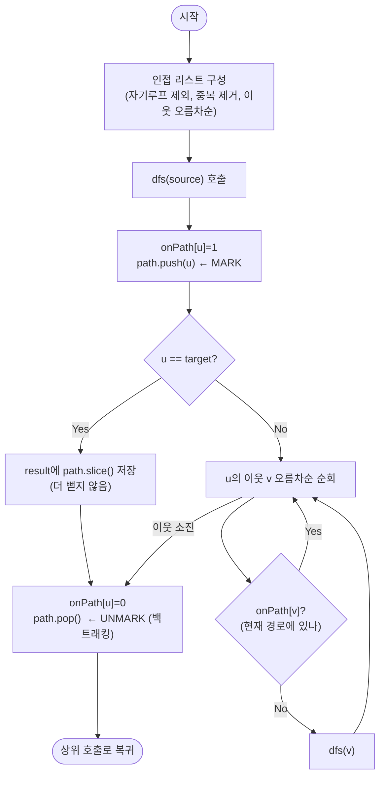

import { AlgorithmSimulation } from "#guide-sim";

# dfsAllPaths — 되돌아갈 때 표시를 지워야 다음 경로가 살아난다

## 한눈에 보는 컨셉

방향 그래프에서 `source`부터 `target`까지 같은 정점을 두 번 밟지 않는 **모든 단순 경로**를 사전식으로 열거하는 문제예요. 핵심은 **백트래킹**입니다 — 정점에 들어갈 때 "지금 경로에 있음"으로 표시(`onPath`)하고 경로 스택에 넣되, 그 정점에서 이탈할 때 **표시를 지우고 스택에서 빼서** 다른 경로가 그 정점을 다시 지날 수 있게 되돌려 놓아요. 전체 시간은 인접 리스트 전처리 `O(E log E)`에, 모든 출력 경로 길이의 합 이상을 쓰는 탐색 비용이 더해집니다 — 출력 크기가 비용의 바닥이고, 실제로는 `target`에 못 닿고 되돌아오는 가지 탐색이 그 위에 얹힐 수 있어요.

## 출발점: 가장 순진한 방법부터

문제를 먼저 정확히 고정할게요.

```ts
function dfsAllPaths(
  n: number,
  edges: [number, number][],
  source: number,
  target: number,
): number[][]
```

| 파라미터 | 의미 | 제약 |
|----------|------|------|
| `n` | 정점 수 (번호는 $0 \ldots n-1$) | $1 \leq n \leq 10^3$ |
| `edges` | 방향 간선 목록 `[u, v]` (`u → v` 일방통행) | $0 \leq E \leq 10^4$ |
| `source` | 출발 정점 | $0 \leq \text{source} \leq n-1$ |
| `target` | 도착 정점 | $0 \leq \text{target} \leq n-1$ |
| 반환값 | `source`→`target` 모든 단순 경로. 각 경로는 정점 배열(맨 앞 `source`, 맨 뒤 `target`) | 사전식 정렬. 경로 없으면 `[]` |

"모든 경로를 빠짐없이 뽑아라"는 요구는 자연스럽게 "출발점에서 갈 수 있는 데까지 깊이 파고들어(DFS) 보고, `target`에 닿으면 지금까지 밟아 온 경로를 하나 적어 두자"는 생각으로 이어져요. 기본 DFS 순회 자체는 형제 문제인 [dfsTraversal 가이드](../dfsTraversal/dfsTraversal-guide.mdx)에서 다루니, 여기서는 그 순회에 "경로를 기록한다"를 얹는 데 집중합니다.

그런데 순수 순회를 그대로 옮기면 곧바로 함정에 빠져요. 순회에서 쓰는 표시를 여기서는 **전역 방문표시 `visited`**라고 부를게요 — 정점을 한 번 방문하면 찍고 **끝까지 안 지우는** 표시입니다(순회의 정석이에요). 이걸 경로 열거에 그대로 쓰면 어떻게 될까요? 작은 다이아몬드 `edges=[[0,1],[0,2],[1,3],[2,3]]`, `source=0`, `target=3`으로 직접 돌려 봅시다(실제 실행 결과입니다).

```text
그래프(방향):        0
                    ↙ ↘
                   1   2
                    ↘ ↙
                     3

정답(백트래킹)             : [[0,1,3], [0,2,3]]   ← 경로 두 개
버그(전역 visited 안 지움) : [[0,1,3]]            ✗ 두 번째 경로가 사라졌다!

무슨 일이 벌어졌나:
  0→1→3 을 찾아 저장한다. 이때 visited = {0,1,3}
  되돌아와 0의 다음 이웃 2로 간다: 0→2 …
  그런데 2의 이웃 3은 이미 visited={…,3} 이라 "가지 마"로 막힌다
  → 0→2→3 을 영영 못 찾는다
```

정점 3은 첫 경로에서 한 번 방문됐다는 이유로 잠겨 버렸고, 그 바람에 3을 지나는 **다른** 경로가 통째로 사라졌어요. 여기서 두 표시를 확실히 갈라놓아야 합니다.

- **전역 방문표시 `visited`**(순수 순회용): 한 번 찍으면 안 지운다. "이 정점은 이미 처리했다"는 영구 표시.
- **현재 경로 표시 `onPath`**(이 문제용): "**지금 이 경로 스택 위에** 있다"는 표시. 되돌아 나올 때 **지운다**.

우리에게 필요한 건 후자예요. 앞으로는 순회의 전역 `visited`와 헷갈리지 않도록 **표시를 `onPath`로 통일**해 부르고, 순수 순회와 달리 **되돌아 나올 때 반드시 지운다**는 것을 이번 알고리즘의 출발 단서로 삼습니다.

## 아이디어 자세히 들여다보기

### 진입은 mark·push, 이탈은 unmark·pop — 수식과 그림

먼저 우리가 열거하려는 대상을 정식으로 적을게요.

$$\mathcal{P}(s,t) = \{\, (v_0, v_1, \ldots, v_k) : v_0 = s,\ v_k = t,\ (v_i, v_{i+1}) \in E,\ v_i \text{ 모두 서로 다름} \,\}$$

"모두 서로 다름"이 단순 경로 조건이에요. 이 조건을 실시간으로 지키기 위해 두 가지 상태를 함께 들고 다닙니다.

- `path` — 지금 밟고 있는 정점들의 **스택**(순서 그대로가 곧 경로).
- `onPath` — 각 정점이 지금 `path`에 들어 있는지를 나타내는 불리언 배열. 불변식은 다음과 같아요.

$$\text{onPath}[v] = 1 \iff v \in \text{path}$$

이 두 상태를 재귀 한 겹마다 **짝을 맞춰** 갱신하는 게 백트래킹의 전부입니다.

```text
dfs(u) 한 겹의 생애:

  진입(내려갈 때)          이탈(올라올 때)
  ┌────────────────┐      ┌────────────────┐
  │ onPath[u] = 1  │      │ onPath[u] = 0  │   ← 표시를 지운다(핵심!)
  │ path.push(u)   │      │ path.pop()     │
  └────────────────┘      └────────────────┘
        내려가서 …  자식들 다 돌고 나면  … 올라온다
```

**왜 하필 진입·이탈을 이렇게 대칭으로 묶어야 할까요?** 진입에서 켠 표시를 이탈에서 끄지 않으면(앞 절의 버그) 그 정점은 형제 서브트리에서 영영 잠깁니다. 반대로 이탈에서 끄기만 하고 진입에서 켜지 않으면 같은 경로 안에서 정점을 다시 밟아 사이클이 생겨요. 두 연산이 **정확히 짝을 이뤄야** "지금 경로 위에 있는 정점만 잠겨 있다"는 불변식이 매 순간 유지됩니다.

작은 예로 손을 움직여 볼까요? 다이아몬드에서 `0→1→3`을 저장한 직후, 되돌아 나오며 `onPath[3]=0`, `onPath[1]=0`으로 지웁니다. 그 결과 `onPath`는 다시 `{0}`만 남고, 이제 `0→2`로 내려가면 3이 **열려 있어** `0→2→3`을 새로 찾을 수 있어요. 잠깐 확인 — 만약 이탈에서 `onPath[1]`만 지우고 `onPath[3]`을 안 지웠다면 어떻게 될까요? 그렇죠, `0→2→3`에서 3이 막혀 두 번째 경로를 또 놓칩니다. 지우는 건 **켰던 그 정점 하나**를, **되돌아 나오는 바로 그 자리**에서예요.

### 단서를 설명해 주는 이론 — 백트래킹(Backtracking)

앞에서 쓴 "켰다가 되돌릴 때 끈다"는 단서는 사실 **백트래킹**이라는 일반적인 탐색 기법의 언어로 그대로 승격됩니다. 백트래킹은 해(解)를 한 조각씩 쌓아 가다가, 막히거나 하나를 완성하면 **직전 선택을 취소하고(undo)** 다른 가지를 시도하는 방식이에요. 핵심은 "상태 변경"과 "상태 복원"이 항상 짝을 이룬다는 것입니다.

```text
choose(선택)  →  explore(더 내려감)  →  un-choose(선택 취소)
  onPath/push        재귀 dfs             onPath/pop
```

이 문제에서 "선택"은 "정점 u를 현재 경로에 추가"이고, "선택 취소"는 "u를 경로에서 제거"예요. `target`에 닿으면 하나의 완성된 해(경로)를 **스냅샷으로 복사해** 결과에 담고, 역시 되돌아 나옵니다. 뒤에서 복잡도를 따질 때 이 "해 하나 = 완성된 경로 하나"라는 관점을 다시 소환할 테니 기억해 두세요 — 완성된 해의 개수가 곧 우리가 피할 수 없는 비용의 바닥이 됩니다.

### 왜 모순 없이 작동하는가

이 알고리즘이 "모든 단순 경로를 정확히 한 번씩" 내놓는다는 걸 귀납으로 납득해 볼게요.

**기저**: `source == target`이면, `dfs(source)`에 들어가자마자 `u == target`이 참이라 `path=[source]` 하나를 저장하고 끝납니다. 길이 1짜리 경로 `[source]`가 유일한 단순 경로이고, 그것 하나만 나오니 정확해요.

**귀납 단계**: `dfs(u)`가 "현재 `path`(=`source`에서 `u`까지의 어떤 단순 경로)를 접두사로 갖는, `target`으로 끝나는 모든 단순 경로를 정확히 한 번씩 저장한다"고 가정합니다. `dfs(u)`가 `u`의 이웃 `v`를 볼 때 경우는 딱 둘뿐이에요(경우의 완전성) — ① `onPath[v] == 1`: `v`는 이미 현재 경로에 있으므로 여기로 가면 정점이 중복돼 단순 경로가 깨집니다. 그래서 건너뛰는 게 정확합니다. ② `onPath[v] == 0`: `v`는 아직 경로에 없으니 `path + [v]`도 여전히 단순 경로이고, `dfs(v)`가 귀납 가정에 의해 그 접두사를 갖는 모든 경로를 빠짐없이·중복 없이 저장해요. `u`의 서로 다른 이웃들이 만드는 경로 집합은 접두사의 다음 정점이 서로 달라 겹치지 않으므로, 합쳐도 **정확히 한 번씩**이 유지됩니다.

여기서 **헷갈리기 쉬운 포인트**가 몇 개 있어요.

첫째, `u == target`일 때 경로를 저장하고 **거기서 더 뻗지 않는다**는 점입니다. 왜 `target`의 이웃으로 더 안 갈까요? 우리가 원하는 경로는 `target`에서 "끝나는" 경로이기 때문이에요. `target`을 지나 더 가면 그건 `target`에서 끝나지 않으니 답이 아닙니다.

```text
0→2→3 을 찾음(3=target).  여기서 3의 이웃으로 더 가면?
  3→? 로 이어 봤자 마지막이 3이 아니게 되어 우리가 셀 경로가 아니다.
  → target에 닿는 순간 저장 후 멈추고 되돌아 나온다.
```

둘째, 스냅샷 저장입니다. `path`는 계속 바뀌는 스택이라, 참조를 그대로 담으면 나중에 `pop`될 때 저장해 둔 것까지 함께 망가져요. 반드시 `path.slice()`처럼 **복사본**을 담아야 합니다.

셋째, unmark의 위치예요. `onPath[u] = 0`은 `u`의 모든 자식 재귀가 끝난 **직후**, 즉 재귀에서 복귀하는 자리에 와야 합니다. 자식을 돌기 전에 지우면 사이클을 막지 못하고, 너무 늦게 지우면 형제 경로를 잠급니다.

엣지 케이스도 점검해 둘게요(모두 실제 실행으로 확인한 값입니다).

```text
경로 없음         dfsAllPaths(3, [[0,1]], 0, 2)               → []
source==target    dfsAllPaths(3, [[0,1],[1,2]], 1, 1)         → [[1]]
사이클 존재       dfsAllPaths(3, [[0,1],[1,2],[2,0],[0,2]], 0, 2) → [[0,1,2],[0,2]]  (2→0 사이클은 단순경로에서 배제)
자기 루프         dfsAllPaths(2, [[0,0],[0,1]], 0, 1)         → [[0,1]]           (0→0은 인접리스트에서 제외)
중복 간선         dfsAllPaths(3, [[0,1],[0,1],[1,2]], 0, 2)   → [[0,1,2]]         (같은 이웃은 한 번만)
```

## 아이디어를 코드로 옮기기

아이디어를 그대로 옮기면 이런 모습이에요. 먼저 인접 리스트를 만드는데, 여기서 세 가지를 처리합니다 — 자기 루프 제외, 중복 이웃 제거, 그리고 **이웃을 오름차순 정렬**(이게 결과의 사전식 순서를 공짜로 만들어 줍니다. 뒤에서 다시 봐요).

```ts
function dfsAllPaths(
  n: number,
  edges: [number, number][],
  source: number,
  target: number,
): number[][] {
  // 자기 루프 제외 + 중복 이웃 제거 + 이웃 오름차순
  const sets: Set<number>[] = Array.from({ length: n }, () => new Set());
  for (const [u, v] of edges) {
    if (u === v) continue; // 자기 루프는 단순 경로에 못 씀
    sets[u].add(v);
  }
  const adj: number[][] = sets.map((s) => [...s].sort((a, b) => a - b));

  const onPath = new Uint8Array(n); // 0/1: 지금 경로 위에 있나
  const path: number[] = [];
  const result: number[][] = [];

  const dfs = (u: number) => {
    onPath[u] = 1;          // ── 진입: mark
    path.push(u);           //          push
    if (u === target) {
      result.push(path.slice()); // 스냅샷 저장, 더 안 뻗음
    } else {
      for (const v of adj[u]) {
        if (!onPath[v]) dfs(v); // 현재 경로에 없는 이웃으로만 전진
      }
    }
    onPath[u] = 0;          // ── 이탈: unmark (백트래킹)
    path.pop();             //          pop
  };

  dfs(source);
  return result;
}
```

**가장 실수가 잦은 부분은 맨 아래 두 줄 `onPath[u] = 0; path.pop();`입니다.** 맨 위의 `onPath[u] = 1; path.push(u);`와 정확히 대칭을 이뤄야 해요. 이 두 줄을 빼먹으면(앞 절 버그) 형제 경로가 잠기고, `onPath[u] = 0`만 하고 `path.pop()`을 잊으면 다음 스냅샷에 엉뚱한 정점이 섞여 들어갑니다. 그 밖의 결정 지점은 이렇습니다.

- **`u === target` 분기**: 도달하면 저장하고 `else`로 빠져 이웃 순회를 **건너뜁니다**. `if/else`가 아니라 둘 다 실행되게 짜면 `target`에서 더 뻗어 잘못된 경로가 생겨요.
- **`path.slice()`**: `path` 참조가 아니라 복사본을 저장. `slice()`를 빼면 모든 결과가 같은 배열을 가리켜 마지막엔 전부 `[]`가 됩니다.
- **`new Set` 후 정렬**: 중복 간선을 한 번으로 접고, 정렬로 사전식을 보장. 이웃 순회 순서가 곧 결과 순서예요. 중복 간선을 접어도 되는 이유는 우리가 반환하는 게 **간선이 아니라 정점 시퀀스**이기 때문입니다 — 같은 `(u,v)` 간선이 몇 개든 그로 만들어지는 정점 경로는 완전히 동일하므로, 접어도 답이 바뀌지 않아요.

한 가지 덧붙이면, 이 `dfs`는 재귀지만 재귀 깊이가 걱정되지 않아요. 경로가 단순 경로라 `path`에 같은 정점이 두 번 들어갈 수 없고, 따라서 재귀 깊이가 정점 수 `n`(≤ 1000)을 넘지 못하기 때문입니다. 깊이가 `Θ(V)` = 최대 $10^5$까지 갈 수 있는 순수 그래프 순회 문제라면 스택 오버플로를 피하려 명시적 스택으로 바꿔야 하지만, 여기서는 깊이가 `n`으로 묶여 대부분의 JS 환경에서 재귀 그대로도 안전합니다.

## 더 빠르게 만들 단서 찾기

보통 이쯤에서 "기본 구현을 관찰해 더 빠른 방법을 찾자"고 하지만, 이 문제는 결이 조금 달라요. 출력의 크기 자체를 먼저 재 봐야 합니다. `m × m` 격자에서 오른쪽/아래로만 가는 DAG를 생각해 볼게요 — 왼쪽 위에서 오른쪽 아래까지 가는 단순 경로의 수를 세면 이렇습니다(직접 실행해 확인한 값입니다).

```text
격자 크기   경로 수 = C(2m, m)
  1 x 1          2
  2 x 2          6
  3 x 3         20
  4 x 4         70
  5 x 5        252
  6 x 6        924
  7 x 7      3,432      ← 정점은 겨우 64개인데 경로는 3천 개가 넘는다
             ↓ m이 커지면 경로 수가 지수적으로 폭증(중심이항계수)
```

정점 수는 `(m+1)²`으로 얌전히 크는데 **경로 수는 지수적으로** 늘어요. 여기서 결정적인 관찰이 나옵니다 — 우리가 만들어 반환해야 하는 것은 이 경로들을 **전부 적은 목록**입니다. 출력 경로들의 길이를 다 더한 값(= $\sum |\text{path}|$)만큼의 숫자는 정답을 적는 것만으로도 반드시 써야 해요. 그러니 어떤 방법이든 **최소한 출력 크기만큼의 비용은 든다**는 게 이 문제의 바닥입니다 — "더 빠른 알고리즘"으로 이 바닥 아래로 내려갈 수는 없어요.

그렇다면 우리가 통제할 수 있는 낭비는 딱 하나, **답이 되지도 않을 가지를 헛도는 것**입니다. 특히 사이클이 있는 그래프에서, 표시를 되돌리지 않으면 같은 정점을 무한히 맴돌 수도 있어요.

## 단서를 최적화로 연결하기

그 낭비를 막는 장치가 바로 우리가 이미 쓰고 있는 `onPath` 가지치기(pruning)예요. `if (!onPath[v])` 한 줄이 "현재 경로에 이미 있는 정점으로는 가지 않는다"를 강제해, 모든 탐색 가지를 **단순 경로**로만 제한합니다.

```text
사이클 0→1→2→0 이 있는 그래프에서 0→1→2 까지 왔다면:
  onPath = {0,1,2}
  2의 이웃 0을 보는 순간 → onPath[0]==1 → 막힌다
  → 0으로 되돌아가 무한 순환하는 일이 원천 봉쇄된다
```

**불변식**: `onPath`에 켜진 정점은 항상 현재 `path`에 든 정점과 정확히 일치하고, 그 개수는 최대 `n`이에요. 덕분에 어떤 탐색 가지의 깊이도 `n`을 넘지 않고, 사이클이 있어도 탐색이 반드시 끝납니다. 그리고 `adj`의 이웃을 오름차순으로 두었으니, DFS가 항상 "번호가 작은 이웃부터" 내려가 결과가 **자연히 사전식**으로 쌓여요 — 끝나고 따로 정렬할 필요가 없습니다.

왜 그럴까요? 한 단계만 따져 보면 됩니다. 두 경로가 처음으로 갈라지는 분기 정점을 생각하면, 그 지점에서 DFS는 **번호가 작은 이웃 쪽 서브트리를 먼저 완전히 소진**한 뒤에야 큰 이웃 쪽으로 넘어가요. 그러니 먼저 완성되어 `result`에 들어가는 경로일수록 그 분기 지점의 다음 정점 번호가 작고, 이는 곧 사전식에서 앞선다는 뜻입니다. 이 성질이 모든 분기에서 재귀적으로 성립하므로 결과 전체가 사전식이 돼요.

```text
다이아몬드에서 0의 이웃 adj[0] = [1, 2] (오름차순):
  먼저 1로 → 0→1→3 저장   (분기점 0에서 작은 이웃 1을 먼저 소진)
  다음 2로 → 0→2→3 저장   (그다음 큰 이웃 2)
  결과 [[0,1,3],[0,2,3]] 이 이미 사전식 순서
```

## 최적화 코드

이 문제에는 "더 빠른 알고리즘"으로 갈아탈 사다리가 없어요(출력 크기가 곧 하한이니까요). 그래서 바꿀 코드가 따로 없고, 앞서 쓴 구현이 그대로 최적입니다. 다만 그 정당성을 지탱하는 **핵심 줄**만 다시 짚을게요.

```ts
      for (const v of adj[u]) {
        if (!onPath[v]) dfs(v); // ← 이 가드가 "단순 경로"와 "종료"를 동시에 보장
      }
```

**가장 중요한 줄은 `if (!onPath[v])`입니다.** 이 한 줄이 두 가지를 동시에 해내요 — (1) 현재 경로 위의 정점을 재방문하지 않아 결과가 항상 단순 경로이고, (2) 그 덕분에 사이클이 있어도 탐색 깊이가 `n`으로 묶여 반드시 종료합니다. 여기서 순서를 실수하기 쉬운 지점 하나 — `onPath[u]=1`(진입 mark)은 반드시 이 이웃 순회 **전에** 끝나 있어야 해요. 만약 자기 자신을 mark 하기 전에 이웃을 돌면, `u`로 되돌아오는 자기 참조 간선을 못 막아 조용히 사이클 경로가 새어 나옵니다.

> 기억법: "켠 건 되돌아올 때 끄고, 켜진 곳으로는 가지 않는다."

**종료 선언**: 전체 시간을 두 조각으로 나눠 보죠. (a) 인접 리스트 구성·정렬 전처리가 `O(E log E)`, (b) 나머지가 탐색 비용입니다. 탐색 비용의 **하한**은 앞 절에서 본 대로 "모든 출력 경로 길이의 합"($\Omega(\sum |\text{path}|)$)이에요 — 답을 만들어 내려면 그 숫자들은 반드시 써야 하니까요. 다만 실제 구현의 탐색 비용은 여기서 **딱 멈추지 않습니다** — `target`에 닿지 못하고 되돌아 나오는 dead-end 가지를 탐색하는 비용이 그 위에 더해질 수 있어요. 그러니 "출력 크기와 정확히 일치한다"거나 "열거가 공짜다"라고 말하면 안 되고, **최소한 출력 크기만큼은 들며 실제로는 탐색 오버헤드가 더해질 수 있다**가 정확한 서술입니다. 그럼에도 이 구현은 그 하한과 **점근적으로 어긋나지 않는**(출력 민감, output-sensitive) 수준이라 알고리즘을 통째로 갈아탈 여지는 없어요. 참고로 dead-end 오버헤드 자체를 줄이는 특화 기법은 있습니다 — 예를 들어 "`target`에 절대 도달 못 하는 정점"을 미리 역방향 도달성으로 계산해 그런 죽은 가지로 아예 안 내려가는 가지치기예요. 하지만 이건 탐색 오버헤드를 깎을 뿐 출력 크기 하한 자체를 바꾸지는 못하므로, 이 가이드의 백트래킹이 여전히 가장 단순하고 범용적인 정답입니다.

## 실행 시각화

예시 방향 그래프 `dfsAllPaths(4, [[0,1],[0,2],[1,3],[2,3]], 0, 3)`(다이아몬드)에 대해 백트래킹을 스텝별로 따라갑니다. 실제 반환값은 `[[0,1,3],[0,2,3]]`이에요(위 코드로 직접 실행해 확인한 값이며, 시뮬레이션 마지막 프레임의 `result`와 일치합니다). 그래프 패널에서 빨강(active)은 방금 mark 한 정점, 노랑(frontier)은 현재 경로 위의 나머지 정점, 회색(visited)은 `target` 도달 순간을 뜻하고, 색이 기본으로 돌아오는 것이 곧 **unmark(백트래킹)** 입니다. `keyValue` 패널은 경로 스택 `path`, 표시 집합 `onPath`, 지금까지 모은 `result`의 스냅샷이에요.

> 대화형 시뮬레이션은 MDX 런타임에서 표시됩니다.

export const nodes = [
  { id: 0, label: "0", x: 50, y: 10 },
  { id: 1, label: "1", x: 20, y: 45 },
  { id: 2, label: "2", x: 80, y: 45 },
  { id: 3, label: "3", x: 50, y: 82 },
];

export const edges = [
  { from: 0, to: 1, directed: true },
  { from: 0, to: 2, directed: true },
  { from: 1, to: 3, directed: true },
  { from: 2, to: 3, directed: true },
];

export const steps = [
  {
    title: "MARK 0 (진입)",
    detail: "dfs(0): onPath[0]=1, path.push(0). source에서 출발.",
    nodes, edges,
    nodeStatus: { 0: "active" },
    entries: [
      { label: "path", value: "[0]" },
      { label: "onPath", value: "{0}" },
      { label: "result", value: "[]" },
    ],
  },
  {
    title: "MARK 1 (진입)",
    detail: "adj[0]=[1,2] 중 먼저 1로 내려간다. onPath[1]=1, path.push(1).",
    nodes, edges,
    nodeStatus: { 0: "frontier", 1: "active" },
    activeEdge: { from: 0, to: 1 },
    entries: [
      { label: "path", value: "[0, 1]" },
      { label: "onPath", value: "{0, 1}" },
      { label: "result", value: "[]" },
    ],
  },
  {
    title: "MARK 3 (진입)",
    detail: "adj[1]=[3]. 3으로 내려간다. onPath[3]=1, path.push(3).",
    nodes, edges,
    nodeStatus: { 0: "frontier", 1: "frontier", 3: "active" },
    activeEdge: { from: 1, to: 3 },
    entries: [
      { label: "path", value: "[0, 1, 3]" },
      { label: "onPath", value: "{0, 1, 3}" },
      { label: "result", value: "[]" },
    ],
  },
  {
    title: "SAVE [0,1,3] (target 도달)",
    detail: "3 == target. path.slice()를 result에 저장하고 더 뻗지 않는다.",
    nodes, edges,
    nodeStatus: { 0: "frontier", 1: "frontier", 3: "visited" },
    entries: [
      { label: "path", value: "[0, 1, 3]" },
      { label: "onPath", value: "{0, 1, 3}" },
      { label: "result", value: "[[0,1,3]]" },
    ],
  },
  {
    title: "UNMARK 3 (백트래킹)",
    detail: "3에서 이탈: onPath[3]=0, path.pop(). 3이 다시 열린다.",
    nodes, edges,
    nodeStatus: { 0: "frontier", 1: "active" },
    entries: [
      { label: "path", value: "[0, 1]" },
      { label: "onPath", value: "{0, 1}" },
      { label: "result", value: "[[0,1,3]]" },
    ],
  },
  {
    title: "UNMARK 1 (백트래킹)",
    detail: "1의 이웃을 다 돌았다. onPath[1]=0, path.pop(). 0으로 복귀.",
    nodes, edges,
    nodeStatus: { 0: "active" },
    entries: [
      { label: "path", value: "[0]" },
      { label: "onPath", value: "{0}" },
      { label: "result", value: "[[0,1,3]]" },
    ],
  },
  {
    title: "MARK 2 (진입) — 3이 다시 열려 있다",
    detail: "adj[0]의 다음 이웃 2로 내려간다. 아까 3을 unmark 했으므로 3이 다시 방문 가능.",
    nodes, edges,
    nodeStatus: { 0: "frontier", 2: "active" },
    activeEdge: { from: 0, to: 2 },
    entries: [
      { label: "path", value: "[0, 2]" },
      { label: "onPath", value: "{0, 2}" },
      { label: "result", value: "[[0,1,3]]" },
    ],
  },
  {
    title: "MARK 3 (진입, 두 번째 경로)",
    detail: "adj[2]=[3]. onPath[3]==0 이라 통과! onPath[3]=1, path.push(3).",
    nodes, edges,
    nodeStatus: { 0: "frontier", 2: "frontier", 3: "active" },
    activeEdge: { from: 2, to: 3 },
    entries: [
      { label: "path", value: "[0, 2, 3]" },
      { label: "onPath", value: "{0, 2, 3}" },
      { label: "result", value: "[[0,1,3]]" },
    ],
  },
  {
    title: "SAVE [0,2,3] (target 도달)",
    detail: "3 == target. 두 번째 경로를 저장한다.",
    nodes, edges,
    nodeStatus: { 0: "frontier", 2: "frontier", 3: "visited" },
    entries: [
      { label: "path", value: "[0, 2, 3]" },
      { label: "onPath", value: "{0, 2, 3}" },
      { label: "result", value: "[[0,1,3], [0,2,3]]" },
    ],
  },
  {
    title: "UNMARK 3, 2 (백트래킹)",
    detail: "3과 2에서 차례로 이탈. onPath에서 지우고 path에서 뺀다.",
    nodes, edges,
    nodeStatus: { 0: "active" },
    entries: [
      { label: "path", value: "[0]" },
      { label: "onPath", value: "{0}" },
      { label: "result", value: "[[0,1,3], [0,2,3]]" },
    ],
  },
  {
    title: "완료: result = [[0,1,3],[0,2,3]]",
    detail: "0의 이웃을 다 돌아 UNMARK 0. 재귀 종료, 사전식 순서로 두 경로 반환.",
    nodes, edges,
    nodeStatus: {},
    entries: [
      { label: "path", value: "[]" },
      { label: "onPath", value: "{}" },
      { label: "result", value: "[[0,1,3], [0,2,3]]" },
    ],
  },
];

<AlgorithmSimulation view={["graph", "keyValue"]} steps={steps} title="dfsAllPaths 백트래킹: 0→3 모든 단순 경로" />

## 흐름 한눈에 보기



## 스스로 점검하기

1. `dfsAllPaths(4, [[0,1],[0,2],[1,2],[1,3],[2,3]], 0, 3)`을 손으로 따라가며 `path`·`onPath`의 변화와 최종 결과를 적어 보세요. (정답: `[[0,1,2,3],[0,1,3],[0,2,3]]`. `adj[1]=[2,3]`이라 1에서 2를 먼저 내려가 `0→1→2→3`을 찾고, 되돌아와 `0→1→3`, 그다음 `0→2→3` 순으로 쌓여 사전식이 됩니다.)
2. 본문 첫머리의 "버그(visited를 안 지움)" 예시를 다시 보세요. 다이아몬드에서 `onPath[u]=0`(unmark) 두 줄을 지우면 왜 결과가 `[[0,1,3]]` 하나로 줄어드는지, 정점 3이 언제 잠기고 어떤 경로가 사라지는지 짚어 설명해 보세요. 그리고 만약 `path.pop()`만 지우고 `onPath[u]=0`은 남긴다면 결과가 또 어떻게 달라질지 예상해 보세요.
3. 이 알고리즘은 `if (!onPath[v])`로 사이클을 막습니다. 만약 이 가드를 빼고 대신 "경로 길이가 `n`을 넘으면 멈춤" 같은 조건으로 바꾸면, 사이클이 있는 그래프에서 무엇이 잘못될까요? 단순 경로가 아닌 결과가 왜 새어 나오는지 한 줄로 답해 보세요.
