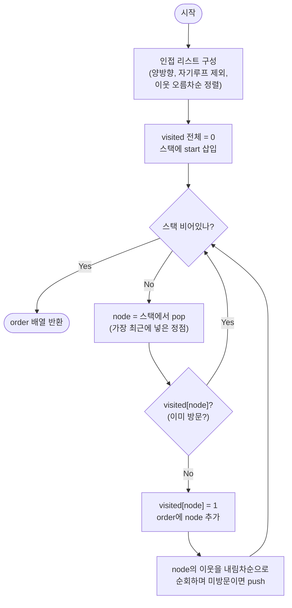

import { AlgorithmSimulation } from "#guide-sim";

# dfsTraversal — 재귀의 호출 스택을 눈에 보이는 배열로 끌어내리기

## 한눈에 보는 컨셉

시작 정점 하나에서 그래프를 깊이 우선(DFS)으로 훑을 때, 정점을 **처음 밟는 순서**(preorder)를 구하는 문제예요. 이웃은 항상 번호가 작은 쪽을 먼저 파고들기로 정해 두면 출력이 입력 순서와 무관하게 하나로 결정됩니다. 재귀로 쓰면 몇 줄이면 끝나지만 긴 체인에서 호출 스택이 넘쳐요 — 그 호출 스택을 명시적 배열 스택으로 바꾸면 같은 순서를 내면서 안전하게 끝납니다. "이웃을 오름차순으로" 방문한다는 결정성 요구 때문에 인접 리스트 정렬 비용이 더해져 전체 시간은 `O(V + E \log E)`이고, 이 정렬을 요구하지 않으면 `O(V + E)`입니다.

## 출발점: 가장 순진한 방법부터

문제를 먼저 정확히 못 박을게요.

```ts
function dfsTraversal(n: number, edges: [number, number][], start: number): number[]
```

| 파라미터 | 의미 | 제약 |
|----------|------|------|
| `n` | 정점 수 (번호는 $0 \ldots n-1$) | $1 \leq n \leq 10^5$ |
| `edges` | 무향 간선 목록 `[u, v]` (멀티그래프 가능) | $0 \leq E \leq 10^5$ |
| `start` | 시작 정점 | $0 \leq \text{start} \leq n-1$ |
| 반환값 | `start`에서 DFS로 정점을 처음 방문한 순서 배열 | 도달 불가 정점은 미포함 |

방문 규칙은 딱 세 가지예요. ① 현재 정점의 **직접 이웃 중 번호가 가장 작은** 미방문 정점으로 먼저 내려간다. ② 한 번 방문한 정점은 다시 결과에 넣지 않는다. ③ `start`에서 간선을 따라 닿을 수 없는 정점은 결과에 없다. 무향이고, 자기 루프 `[v,v]`와 중복 간선은 방문 순서에 영향을 주지 않아요.

"깊이 우선으로 훑어라"는 요구는 가장 자연스럽게 **재귀**로 옮겨집니다 — "이 방에 들어왔으면, 안 가본 이웃 방으로 더 깊이 들어가고, 막히면 돌아 나온다"를 그대로 함수 호출로 적으면 되니까요. 먼저 간선 목록을 다루기 쉬운 **인접 리스트**로 바꾸고(무향이라 양방향 등록, 자기 루프 제외, 이웃은 오름차순 정렬), 각 정점에서 재귀로 파고듭니다.

이 방식은 정답을 정확히 냅니다. 그런데 "깊이 우선"이라는 말 자체에 낌새가 하나 숨어 있어요 — 깊이 우선은 **한 갈래를 끝까지 파고든 다음에야** 되돌아 나온다는 뜻입니다. 그렇다면 그래프가 한 줄로 길게 이어진 체인이면, 되돌아 나오기 전까지 함수 호출이 얼마나 깊이 쌓일까요?

```text
체인 그래프:  0 — 1 — 2 — 3 — … — (V-1)

go(0)
 └ go(1)
    └ go(2)
       └ go(3)
          └ …            ← 되돌아 나오기 전까지 호출이 V겹으로 쌓인다
             └ go(V-1)

호출 깊이 = V.  V가 10^5이면 함수가 10만 겹...
```

정점이 $10^5$까지 갈 수 있는데 호출 깊이가 정점 수만큼 쌓인다는 게 이 순진한 재귀의 아픈 지점입니다. 이 낌새는 5단계에서 실제 실행으로 확인할게요.

## 아이디어 자세히 들여다보기

### 안 가본 이웃 중 가장 작은 쪽으로 — 수식과 그림

먼저 방문 순서를 정식으로 정의할게요. 정점 $v$의 정렬된 이웃 목록을 $adj[v]$(오름차순)라 하면, preorder 방문 순서 $\text{order}$는 이렇게 재귀적으로 쌓입니다.

$$\text{visit}(v):\quad \text{order} \mathrel{+}= [v],\quad \text{그다음 } adj[v] \text{를 순서대로 돌며 미방문 } w \text{에 대해 } \text{visit}(w)$$

말로 풀면 "정점에 도착하는 **바로 그 순간** 결과에 적고(preorder), 그다음 작은 이웃부터 재귀로 내려간다"예요. 예시 그래프 `dfsTraversal(5, [[0,1],[0,2],[1,3],[2,4]], 0)`으로 인접 리스트와 방문 흐름을 그려 봅시다(아래 `adj`는 실제로 코드를 돌려 얻은 값입니다).

```text
adj = [ [1,2], [0,3], [0,4], [1], [2] ]
       ↑0     ↑1    ↑2     ↑3   ↑4      (각 정점의 이웃, 오름차순)

           0
          ╱ ╲          방문: 0에 도착 → order=[0]
         1   2                 0의 작은 이웃 1로 내려감 → order=[0,1]
         │   │                 1의 작은 이웃 3으로 내려감 → order=[0,1,3]
         3   4                 3은 막힘, 되돌아 0으로 → 다음 이웃 2 → order=[0,1,3,2]
                               2의 이웃 4로 내려감 → order=[0,1,3,2,4]
반환: [0, 1, 3, 2, 4]
```

**왜 하필 "현재 정점의 이웃들 중 최솟값"일까요?** "전체 그래프에서 아직 안 간 최소 번호 정점"으로 정의하면 그건 DFS가 아니라 다른 순서가 돼요(깊이 우선이 깨집니다). 규칙을 "지금 서 있는 정점의 직접 이웃"으로 **국소화**해야 "한 갈래를 끝까지 판다"는 깊이 우선의 성질이 지켜지고, 그 덕분에 결과가 입력 `edges` 나열 순서와 무관하게 하나로 결정됩니다.

잠깐 확인해 볼까요? 위 예시에서 0을 방문한 직후, 결과에 다음으로 들어가는 정점은 무엇일까요? — 0의 이웃은 `[1, 2]`이고 둘 다 미방문이니, 더 작은 **1**입니다. 2가 아니에요. 2는 1쪽 갈래(1과 그 자손 3)를 전부 훑고 돌아온 뒤에야 차례가 옵니다.

### 셈을 맡는 자료구조 — 스택

"한 갈래를 끝까지 파고들었다가 되돌아 나온다"는 동작은 사실 **스택(LIFO, Last-In First-Out)** 그 자체예요. 가장 최근에 들어간 정점(가장 깊이 판 곳)으로 가장 먼저 돌아가니까요. 재귀 버전에서는 이 스택이 언어 런타임의 **호출 스택**으로 숨어 있을 뿐입니다. 스택 자체의 동작 원리(push/pop, 배열 기반 구현)는 이 프로젝트의 [stack 가이드](../../../data-structures/linear/stack/stack-guide.mdx)에서 자세히 다루니, 여기서는 "마지막에 넣은 걸 먼저 꺼내 주는 상자"로만 알아도 충분합니다. 뒤에서 이 숨은 호출 스택을 **눈에 보이는 배열 스택**으로 끌어낼 거예요 — 그러니 스택의 LIFO 성질을 기억해 두세요.

### 왜 모순 없이 작동하는가

이 알고리즘이 지키는 약속은 하나입니다.

> 도달 가능한 각 정점은 결과 배열에 **정확히 한 번** 들어가고, 그 순간이 그 정점을 처음 밟는 순간이다.

귀납으로 납득해 볼게요.

**기저**: 시작할 때 `start`를 방문 표시하고 결과에 넣습니다. `start`는 자기 자신에 길이 0으로 도달하니 첫 방문이 맞고, 정확히 한 번 들어갔어요.

**귀납 단계**: 어떤 정점 $v$를 처음 방문했다고 합시다. 우리는 $v$의 이웃 $w$를 하나씩 보며, `visited[w]`에 따라 경우가 **딱 둘뿐**입니다(경우의 완전성) — ① 이미 방문됨, ② 미방문. ①이면 건너뜁니다(이미 한 번 들어갔으니 다시 넣으면 약속 위반). ②이면 $w$로 내려가 그때 처음 방문 표시를 하고 결과에 넣습니다. 방문 표시가 "이미 넣었다"는 사실과 **같은 순간**에 찍히므로, 나중에 다른 경로로 $w$를 또 만나도 ①로 걸러져요. 도달 가능한 정점은 간선을 따라 언젠가 $v$의 이웃으로 등장하므로 빠짐없이 방문되고, 도달 불가능한 정점은 어떤 방문된 정점의 이웃으로도 나타나지 않으니 결과에 없습니다. 따라서 "도달 가능 = 정확히 한 번"이 지켜집니다.

여기서 **헷갈리기 쉬운 포인트**가 두 가지 있어요. 둘 다 뒤에 나올 명시적 스택 버전에서 조용히 사람을 무는 지점입니다.

**(1) 이웃을 어느 순서로 스택에 넣어야 하나?** 스택은 마지막에 넣은 걸 먼저 꺼냅니다. 그러니 작은 번호를 먼저 꺼내려면 이웃을 **내림차순으로 push**해야 해요. 오름차순으로 넣으면 순서가 뒤집힙니다. 정점 0(이웃 `[1,2]`)에서 확인해 보면(실제 실행 기준):

```text
올바름: 이웃 [1,2]를 내림차순 push → 스택 [2, 1]  → pop 1 (작은 쪽 먼저) ✓
버그  : 이웃 [1,2]를 오름차순 push → 스택 [1, 2]  → pop 2 (큰 쪽 먼저) ✗
                                                      결과가 [0,2,...]로 규칙 위반
```

**(2) 방문 표시를 언제 확정하나?** 같은 정점이 서로 다른 이웃을 통해 스택에 **여러 번** 올라올 수 있어요(예: 삼각형 `[[0,1],[0,2],[1,2]]`). 그래서 방문 확정은 스택에 **넣을 때가 아니라 꺼낼 때(pop)** 해야 하고, 꺼낸 정점이 이미 방문됐으면 그냥 버립니다(중복 push 가드). 삼각형에서 직접 보면:

```text
edges=[[0,1],[0,2],[1,2]], start=0,  adj=[[1,2],[0,2],[0,1]]

0 pop·방문 → order=[0], 이웃 2,1 push        스택=[2, 1]
1 pop·방문 → order=[0,1], 1의 이웃 2 push    스택=[2, 2]   ← 2가 두 번 올라옴!
2 pop·방문 → order=[0,1,2]                    스택=[2]
2 pop → 이미 방문됨 → 버림 (가드가 없으면 order에 2를 또 넣어 [0,1,2,2] ✗)
```

pop 시점 방문 확정과 가드가 없으면 결과에 같은 정점이 중복으로 들어갑니다.

엣지 케이스도 점검해 둘게요(모두 실제 실행으로 확인).

```text
n=1, 간선 없음, start=0          →  [0]        (자기 자신만)
start=2 고립 (edges=[[0,1]])     →  [2]        (닿는 이웃 없음)
자기루프+중복 [[0,0],[0,1],[0,1]] →  [0, 1]     (흡수되어 영향 없음)
비연결 [[0,1],[2,3]], start=0    →  [0, 1]     (2,3 컴포넌트는 미포함)
```

## 아이디어를 코드로 옮기기

아이디어를 그대로 옮기면 이렇게 돼요. 먼저 인접 리스트를 만드는 헬퍼, 그다음 재귀 DFS입니다.

```ts
function buildAdj(n: number, edges: [number, number][]): number[][] {
  const adj: number[][] = Array.from({ length: n }, () => []);
  for (const [u, v] of edges) {
    if (u === v) continue;     // 자기 루프는 방문에 영향 없음 → 버린다
    adj[u].push(v);
    adj[v].push(u);            // 무향: 양방향 등록
  }
  for (const list of adj) list.sort((a, b) => a - b); // 이웃 오름차순 → 결정적 순서
  return adj;
}

function dfsTraversal(n: number, edges: [number, number][], start: number): number[] {
  const adj = buildAdj(n, edges);
  const visited = new Uint8Array(n);
  const order: number[] = [];

  function go(node: number) {
    visited[node] = 1;         // 방문 표시
    order.push(node);          // 처음 밟는 순간 = 결과에 추가 (preorder)
    for (const next of adj[node]) {
      if (!visited[next]) go(next); // 미방문 이웃으로만 더 깊이
    }
  }

  go(start);
  return order;
}
```

**가장 중요한 두 줄은 `visited[node] = 1;`과 `order.push(node);`가 나란히 붙어 있는 부분입니다.** 이 둘이 함수에 들어오자마자, 이웃을 보기 **전에** 실행돼야 해요. 만약 자식을 다 돈 뒤(postorder)에 `order.push`를 하면 방문 순서가 완전히 달라지고, `visited` 표시를 미루면 사이클에서 같은 정점을 무한히 다시 부릅니다. 그 밖의 결정 지점은 두 가지예요.

- **오름차순 정렬**: `list.sort((a, b) => a - b)`가 "작은 이웃 먼저"를 보장합니다. 이게 없으면 결과가 입력 `edges` 순서에 휘둘려요.
- **자기 루프 제거**: `if (u === v) continue`. 자기 자신은 새로 갈 곳이 아니니 인접 리스트에서 아예 빼 둡니다.

## 더 빠르게 만들 단서 찾기

이 재귀는 방문·간선 순회 자체는 `O(V + E)`예요 — 정점마다 `go`가 최대 한 번 불리고(방문 가드), 간선은 양방향으로 한 번씩만 훑으니까요. 다만 `buildAdj`가 각 인접 리스트를 정렬하므로 전체 시간은 정렬 비용을 포함해 `O(V + E \log E)`(정확히는 $O(V + \sum_v \deg(v)\log\deg(v))$)입니다. 시간 복잡도로는 흠잡을 데가 없습니다. 문제는 **자원**, 정확히는 **호출 스택 깊이**입니다. 2단계에서 남긴 낌새 — 체인 그래프에서 호출이 V겹으로 쌓인다 — 를 실제로 돌려 확인해 봤어요(`_scratch/dfsTraversal.ts` 실행 결과, 실측값은 측정 환경에 따라 달라집니다).

```text
V = 100,000 짜리 체인(0—1—2—…—99999)에서:

  재귀 dfsTraversal(V, chain, 0)  →  재귀 깊이가 최악 Θ(V)까지 쌓여
                                     많은 JS 환경에서 호출 스택 한계를 넘어
                                     오버플로(RangeError)가 난다

  명시적 스택 버전                →  100,000개 전부 방문, 정상 종료
                                     (실행시간은 측정 환경에 따라 다른 실측값)
```

같은 방문 로직인데 한쪽은 아예 실행조차 못 하고 죽을 수 있어요. 원인은 구조적입니다 — 재귀는 되돌아 나오기 전까지 자바스크립트 엔진의 호출 스택에 프레임을 계속 쌓는데, 그 스택 크기 한계는 엔진·실행옵션에 따라 다른 환경 의존값이고 우리가 마음대로 못 늘립니다.

```text
호출 스택(엔진이 관리, 크기 한계는 환경 의존):

  go(0) → go(1) → go(2) → … → go(99999)
  └───────────── 프레임 10만 개 ──────────┘
                                          ↑ 한계 돌파 → 크래시
```

단서는 이거예요 — **재귀가 쓰는 "호출 스택"을 우리가 직접 관리하는 배열로 옮기면**, 엔진의 호출 스택 한계와 무관하게 힙에 확보한 배열이 담는 만큼 깊이 들어갈 수 있습니다. (물론 전체 메모리 한계 — 인접 리스트·`visited`·명시 스택의 합 — 는 여전히 존재하므로 "무한"은 아니에요.)

## 단서를 최적화로 연결하기

재귀 호출은 사실 "돌아올 자리를 스택에 적어 두고 점프"하는 일이에요. 3.3에서 봤듯 DFS의 되돌아 나오기는 LIFO 그 자체이니, 숨은 호출 스택을 **눈에 보이는 배열 스택**으로 바꿔 쓰면 됩니다.

```text
Before (재귀 · 암묵적 호출 스택):     After (반복 · 명시적 배열 스택):
  go(v) 호출 = 엔진 스택에 프레임 push   stack.push(v)  = 우리 배열에 push
  return       = 프레임 pop              stack.pop()    = 우리 배열에서 pop
  깊이 한계 = 엔진이 정함(못 늘림)       깊이 한계 = 힙에 잡은 배열 크기
```

바꿀 때 지켜야 할 **불변식**은 3.4에서 예고한 두 가지예요. ① 이웃을 **내림차순으로 push**해야 작은 번호가 먼저 pop 되어 재귀와 똑같은 순서가 난다. ② 같은 정점이 여러 번 push될 수 있으므로 방문 확정은 **pop 시점**에 하고, 이미 방문한 정점을 pop하면 버린다(중복 push 가드). 이 두 규칙이 재귀 버전의 "함수 진입 시 방문 표시 + 미방문 이웃만 재귀"와 정확히 대응합니다.

## 최적화 코드

`buildAdj`는 그대로 재사용하고, 방문부만 재귀에서 명시적 스택으로 바꿉니다.

```ts
function dfsTraversal(n: number, edges: [number, number][], start: number): number[] {
  const adj = buildAdj(n, edges);
  const visited = new Uint8Array(n);
  const order: number[] = [];
  const stack: number[] = [start];

  while (stack.length > 0) {
    const node = stack.pop()!;          // 가장 최근에 넣은 정점부터 (LIFO)
    if (visited[node]) continue;        // 중복 push 가드 — 이미 방문했으면 버린다
    visited[node] = 1;
    order.push(node);                   // pop 시점에 방문 확정 + 결과 추가
    const neighbors = adj[node];
    for (let i = neighbors.length - 1; i >= 0; i--) { // 내림차순 push
      const next = neighbors[i]!;
      if (!visited[next]) stack.push(next);
    }
  }

  return order;
}
```

**가장 중요한 줄은 `for (let i = neighbors.length - 1; i >= 0; i--)` — 이웃을 뒤에서부터(내림차순) push하는 이 루프입니다.** 여기서 방향을 정방향(`i = 0 → length`)으로 바꾸면 큰 번호가 스택 위에 올라가 먼저 pop 되고, 결과가 조용히 뒤집힙니다 — 에러도 안 나고 그냥 틀린 순서를 내놔요. 두 번째로 중요한 줄은 `if (visited[node]) continue;` 가드입니다. 이게 없으면 3.4의 삼각형 예처럼 같은 정점이 결과에 중복으로 들어갑니다.

이 반복 버전이 지키는 불변식을 한 문장으로 못 박아 둘게요 — **`visited`가 false인 동안 같은 정점이 스택에 여러 번 들어갈 수 있으나, 최초 pop에서만 방문을 확정하고 이후의 pop은 가드로 폐기하므로 사이클·중복 간선이 있어도 결과가 깨지지 않습니다.**

> 기억법: "작은 걸 먼저 꺼내려면 큰 걸 먼저 넣는다. 방문 도장은 꺼낼 때 찍는다."

실측으로도 확인했어요. 이 문제 상한인 `V = 100,000` 체인에서 재귀 버전은 재귀 깊이가 Θ(V)까지 쌓여 많은 JS 환경에서 `RangeError`로 죽는 반면, 이 명시적 스택 버전은 10만 개를 전부 방문하고 정상 종료합니다(구체 실행시간은 측정 환경에 따라 달라지는 실측값이에요). 두 버전은 모든 예시·경계 입력에서 완전히 같은 순서를 내면서(교차검증 통과), 스택 깊이 안전성만 얻은 거예요.

이로써 목표였던 시간 복잡도(정렬 비용 포함 `O(V + E \log E)`)를 **정확성**(재귀와 동일한 preorder)과 **견고성**(엔진 호출 스택 한계에 안 걸림) 양쪽에서 달성했습니다. 더 줄일 여지가 있을까요? 도달 가능한 정점 집합을 $V'$, 그 사이 간선을 $E'$라 하면, 정답을 내려면 $V'$의 정점을 최소 한 번씩 결과에 넣고 $E'$의 간선을 최소 한 번씩 봐야 하니 `Ω(V' + E')`가 이 문제의 하한이에요. 여기에 "이웃 오름차순" 결정성을 위한 정렬 비용 `O(E log E)`가 더해지므로, 지금 구현은 이 하한과 점근적으로 일치합니다(정렬을 요구하지 않는다면 `O(V + E)`로 내려갑니다). (방문 순서가 아니라 연결 여부만 필요하다면 union-find로 갈아탈 수 있지만, "처음 밟는 순서"가 목표라면 이 DFS가 가장 단순한 정답입니다.)

## 실행 시각화

예시 무향 그래프 `dfsTraversal(5, [[0,1],[0,2],[1,3],[2,4]], 0)`에 대해 명시적 스택 DFS를 한 스텝씩 실행하는 과정입니다. 노드 위 `#k`는 몇 번째로 방문됐는지(preorder 순위), `keyValue` 패널은 스택(오른쪽 끝이 top, 다음에 pop될 원소)과 지금까지의 방문 순서 스냅샷이에요. 노란색은 스택에 올라와 대기 중(frontier), 빨간색은 방금 pop해 처리 중(active), 회색은 처리 완료(visited)를 뜻합니다. 실제 반환값은 `[0, 1, 3, 2, 4]`이며(위 코드로 직접 실행해 확인한 값), 시뮬레이션 마지막 프레임의 방문 순서와 일치합니다.

> 대화형 시뮬레이션은 MDX 런타임에서 표시됩니다.

export const nodes = [
  { id: 0, label: "0", x: 50, y: 10 },
  { id: 1, label: "1", x: 26, y: 42 },
  { id: 2, label: "2", x: 74, y: 42 },
  { id: 3, label: "3", x: 26, y: 78 },
  { id: 4, label: "4", x: 74, y: 78 },
];

export const edges = [
  { from: 0, to: 1, directed: false },
  { from: 0, to: 2, directed: false },
  { from: 1, to: 3, directed: false },
  { from: 2, to: 4, directed: false },
];

export const steps = [
  {
    title: "초기화",
    detail: "스택에 start=0을 넣는다. 아직 방문 없음.",
    nodes, edges,
    nodeStatus: { 0: "frontier" },
    nodeValue: {},
    entries: [
      { label: "스택 (오른쪽=top)", value: "[0]" },
      { label: "방문 순서", value: "[]" },
    ],
  },
  {
    title: "pop 0 — 방문 확정",
    detail: "0을 꺼내 방문. 이웃 [1,2]를 내림차순으로 push → 스택 [2, 1].",
    nodes, edges,
    nodeStatus: { 0: "active", 1: "frontier", 2: "frontier" },
    nodeValue: { 0: "#1" },
    entries: [
      { label: "스택 (오른쪽=top)", value: "[2, 1]" },
      { label: "방문 순서", value: "[0]" },
    ],
  },
  {
    title: "pop 1 — 방문 확정",
    detail: "top인 1을 꺼내 방문. 이웃 [0,3] 중 0은 방문됨, 3을 push → 스택 [2, 3].",
    nodes, edges,
    nodeStatus: { 0: "visited", 1: "active", 2: "frontier", 3: "frontier" },
    nodeValue: { 0: "#1", 1: "#2" },
    activeEdge: { from: 0, to: 1 },
    entries: [
      { label: "스택 (오른쪽=top)", value: "[2, 3]" },
      { label: "방문 순서", value: "[0, 1]" },
    ],
  },
  {
    title: "pop 3 — 방문 확정",
    detail: "top인 3을 꺼내 방문. 이웃 [1]은 방문됨 → push 없음. 스택 [2].",
    nodes, edges,
    nodeStatus: { 0: "visited", 1: "visited", 2: "frontier", 3: "active" },
    nodeValue: { 0: "#1", 1: "#2", 3: "#3" },
    activeEdge: { from: 1, to: 3 },
    entries: [
      { label: "스택 (오른쪽=top)", value: "[2]" },
      { label: "방문 순서", value: "[0, 1, 3]" },
    ],
  },
  {
    title: "pop 2 — 방문 확정",
    detail: "3 갈래가 막혀 되돌아옴. 2를 꺼내 방문. 이웃 [0,4] 중 4를 push → 스택 [4].",
    nodes, edges,
    nodeStatus: { 0: "visited", 1: "visited", 2: "active", 3: "visited", 4: "frontier" },
    nodeValue: { 0: "#1", 1: "#2", 2: "#4", 3: "#3" },
    activeEdge: { from: 0, to: 2 },
    entries: [
      { label: "스택 (오른쪽=top)", value: "[4]" },
      { label: "방문 순서", value: "[0, 1, 3, 2]" },
    ],
  },
  {
    title: "pop 4 — 방문 확정",
    detail: "4를 꺼내 방문. 이웃 [2]는 방문됨 → push 없음. 스택이 비었다.",
    nodes, edges,
    nodeStatus: { 0: "visited", 1: "visited", 2: "visited", 3: "visited", 4: "active" },
    nodeValue: { 0: "#1", 1: "#2", 2: "#4", 3: "#3", 4: "#5" },
    activeEdge: { from: 2, to: 4 },
    entries: [
      { label: "스택 (오른쪽=top)", value: "[]" },
      { label: "방문 순서", value: "[0, 1, 3, 2, 4]" },
    ],
  },
  {
    title: "완료: [0, 1, 3, 2, 4]",
    detail: "스택이 비어 종료. preorder 방문 순서 [0, 1, 3, 2, 4].",
    nodes, edges,
    nodeStatus: { 0: "visited", 1: "visited", 2: "visited", 3: "visited", 4: "visited" },
    nodeValue: { 0: "#1", 1: "#2", 2: "#4", 3: "#3", 4: "#5" },
    entries: [
      { label: "스택 (오른쪽=top)", value: "[]" },
      { label: "방문 순서", value: "[0, 1, 3, 2, 4]" },
    ],
  },
];

<AlgorithmSimulation view={["graph", "keyValue"]} steps={steps} title="DFS preorder: start=0" />

## 흐름 한눈에 보기



## 스스로 점검하기

1. `dfsTraversal(4, [[0,2],[0,1],[1,3]], 0)`을 명시적 스택 버전으로 손으로 따라가며, 매 pop마다 스택 내용과 방문 순서를 적어 보세요. (정답: `[0, 1, 3, 2]`. 0의 이웃은 정렬되어 `[1,2]`가 되고 내림차순 push로 스택 `[2,1]`이 되니, 입력에 `[0,2]`가 먼저 적혔어도 1쪽을 먼저 팝니다.)
2. 최적화 코드에서 이웃을 **내림차순** 대신 **오름차순**으로 push하도록 루프를 `for (let i = 0; i < neighbors.length; i++)`로 바꾸면, 예시 `dfsTraversal(5, [[0,1],[0,2],[1,3],[2,4]], 0)`의 결과가 어떻게 틀어질까요? 첫 몇 개 정점이 어떤 순서로 pop되는지 짚어 설명해 보세요. (힌트: 0에서 스택이 `[1, 2]`가 되어 2가 먼저 pop됩니다.)
3. `if (visited[node]) continue;` 가드를 지운다면, 사이클이 있는 그래프 `dfsTraversal(3, [[0,1],[0,2],[1,2]], 0)`에서 결과 배열이 왜 `[0, 1, 2, 2]`처럼 중복을 갖게 되는지, 어떤 정점이 스택에 두 번 올라오는지 3.4의 그림을 근거로 설명해 보세요.
