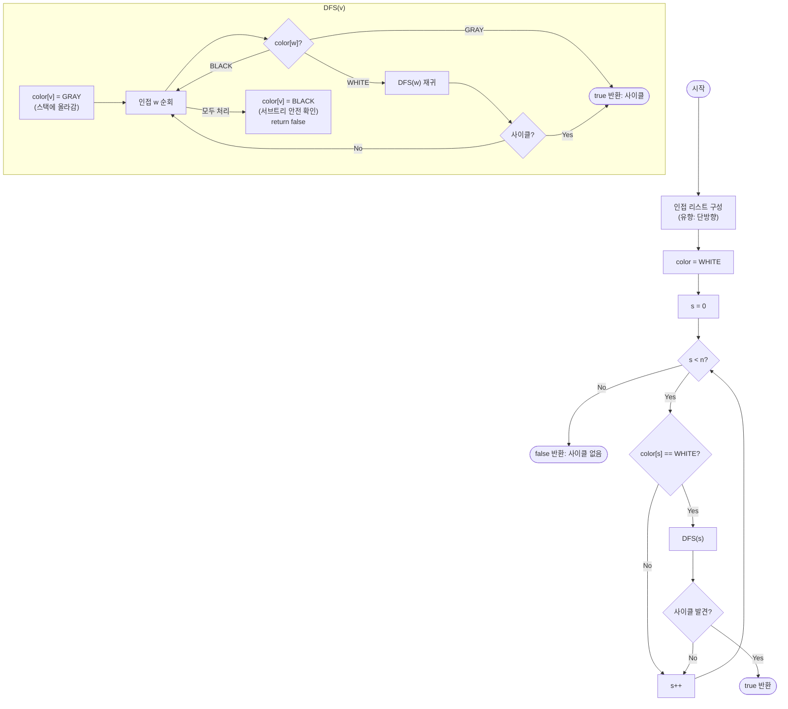

import { AlgorithmSimulation } from "#guide-sim";

# directedCycleDetection — 스택에 아직 남아 있는 정점으로 되돌아가는 순간이 사이클의 증거인 이유

## 한눈에 보는 컨셉

DFS를 딱 한 번 돌리면서 정점을 세 가지 색(미방문 / 지금 탐색 경로 위 / 탐색 완료)으로 표시하는 방법이에요. 지금 내 DFS 경로 위에 있는 정점으로 되돌아가는 간선을 만나는 순간이 곧 사이클이고, 이미 탐색이 끝나 안전하다고 확인된 정점으로 가는 간선은 무시해도 됩니다. 정점과 간선을 각각 정확히 한 번씩만 보기 때문에 `O(V+E)`에 끝나요.

## 출발점: 가장 순진한 방법부터

문제를 먼저 정확히 잡을게요.

```ts
function directedCycleDetection(n: number, edges: [number, number][]): boolean
```

| 파라미터 | 의미 | 제약 |
|----------|------|------|
| `n` | 정점 수. 정점 번호는 $0 \ldots n-1$ | $1 \leq n \leq 10^5$ |
| `edges` | 유향 간선 `[u, v]` ($u \to v$) 목록 | $0 \leq E \leq 10^5$ |
| 반환 | 사이클이 존재하면 `true`, 없으면 `false` | — |

"사이클이 존재하는가"라는 질문을 가장 정직하게 풀면 이렇습니다 — **정의를 그대로 실행**해 보는 거예요. 사이클이란 "어떤 정점에서 출발해 방향을 따라가다 다시 그 정점으로 돌아올 수 있는 경로"이니, 정점마다 "여기서 출발해서 나 자신에게 돌아오는 길이 있는가"를 DFS로 직접 확인하면 됩니다.

```text
for v in 0..n-1:
  path = DFS starting from v
  if v가 path 안에서 다시 나타난다:
    return true
return false
```

코드로 옮기면 이렇습니다.

```ts
function directedCycleDetectionNaive(n: number, edges: [number, number][]): boolean {
  const adj: number[][] = Array.from({ length: n }, () => []);
  for (const [u, v] of edges) adj[u].push(v);

  function reachesBack(start: number, v: number, visited: Set<number>): boolean {
    for (const w of adj[v]) {
      if (w === start) return true; // start로 돌아오는 경로 발견
      if (!visited.has(w)) {
        visited.add(w);
        if (reachesBack(start, w, visited)) return true;
      }
    }
    return false;
  }

  for (let s = 0; s < n; s++) {
    if (reachesBack(s, s, new Set([s]))) return true;
  }
  return false;
}
```

이 방법은 정점마다 `O(V+E)`짜리 DFS를 새로 돌립니다. 작은 예로 감을 잡아 봅시다.

```text
V = 5, E = 6 인 작은 그래프
정점마다 DFS 한 번:  O(V+E) 씩, 총 V번
비용:                 O(V·(V+E))

문제의 실제 제약 V = 10^5, E = 10^5 를 그대로 넣으면:
  O(V·(V+E)) = 10^5 × (10^5 + 10^5) = 10^5 × 2×10^5 = 2×10^10

1초에 처리 가능한 연산이 대략 10^8~10^9임을 감안하면 100배 넘게 초과합니다 → 시간 초과
```

문제의 근원은 명확합니다. 정점 $v$에서 DFS를 완료했는데 사이클이 없었다는 사실이, 다음 정점 $v'$의 DFS에서는 전혀 재사용되지 않아요. 매번 처음부터 다시 훑습니다. **이미 탐색을 끝낸 정점의 정보를 어떻게든 재사용할 수 없을까?** — 이것이 이번 알고리즘의 출발 단서입니다.

## 아이디어 자세히 들여다보기

### 지금 탐색 경로 위에 있는가를 색으로 표시하기 — 수식과 그림

핵심 관찰은 이겁니다 — 사이클이 있다는 것은 **"DFS가 지금 밟고 있는 경로 위의 정점으로 되돌아가는 간선"이 있다는 것과 같은 말**이에요. 반대로 이미 탐색이 완전히 끝나 그 경로에서 빠져나간 정점으로 향하는 간선은, 그 정점의 서브트리에서 사이클이 없다는 게 이미 확인됐으므로 안전합니다.

이걸 구별하려면 정점마다 세 가지 색(상태)이 필요합니다.

$$\text{color}(v) \in \{\text{WHITE},\, \text{GRAY},\, \text{BLACK}\}$$

| 색 | 의미 |
|----|------|
| WHITE | 아직 방문하지 않음 |
| GRAY | 지금 DFS 경로(콜 스택) 위에 있음 — 탐색 중 |
| BLACK | 탐색이 완전히 끝남 — 이 정점의 서브트리에는 사이클이 없음이 확인됨 |

작은 그래프 `n=4`, `edges=[[0,1],[1,2],[2,0],[2,3]]`로 색이 어떻게 바뀌는지 직접 따라가 봅시다. 인접 리스트는 등록 순서대로 `adj[0]=[1]`, `adj[1]=[2]`, `adj[2]=[0,3]`입니다.

```text
0:W 1:W 2:W 3:W    시작, 모두 WHITE

DFS(0) → 0:G                        0을 GRAY로, 경로 = [0]
  0→1 (WHITE) → DFS(1) → 1:G        1을 GRAY로, 경로 = [0,1]
    1→2 (WHITE) → DFS(2) → 2:G      2를 GRAY로, 경로 = [0,1,2]
      2→0 (GRAY!) → back edge 발견  0이 아직 경로 위에 있다 → 사이클
```

**여기서 확인 질문 하나** — 만약 2→0 대신 2→3부터 먼저 검사했다면 어떻게 될까요? `adj[2] = [0, 3]`이므로 실제로는 0이 먼저지만, 등록 순서가 `[3, 0]`이었다고 가정해 보세요. 그러면 `3`은 WHITE → `DFS(3)`을 호출해 3을 GRAY로 만들고, `adj[3]`이 비어 있으니 바로 BLACK으로 되돌아옵니다. 그다음에야 `2→0` 간선을 검사해 여전히 사이클을 찾아냅니다. **순서를 바꿔도 결과는 같지만, 색이 바뀌는 시점과 방문 순서는 달라진다**는 점을 기억해 두세요.

**왜 하필 2색이 아니라 3색인가?** 방문/미방문 2색만 쓴다면 "지금 스택에 있다(GRAY)"와 "이미 완전히 끝났다(BLACK)"를 구별할 수 없습니다. 이 둘을 섞으면 어떤 일이 생기는지는 바로 다음 절 "왜 모순 없이 작동하는가"에서 실제 그래프로 확인해 봅니다.

### 단서를 설명해 주는 이론 — DFS 간선 분류(Edge Classification)

"back edge를 찾으면 사이클"이라는 관찰은 사실 그래프 이론에서 이미 일반화된 언어를 갖고 있습니다. 유향 그래프에서 DFS를 한 번 실행하면, 검사하는 모든 간선 $(v, w)$는 도착점 $w$의 상태에 따라 정확히 네 가지 중 하나로 분류됩니다.

| 종류 | 조건 (간선 $(v,w)$ 검사 시점의 $\text{color}(w)$) | 의미 |
|------|------|------|
| tree edge | WHITE | $w$를 이 간선을 통해 처음 발견 — DFS 트리(숲)의 뼈대가 됨 |
| back edge | GRAY | $w$는 $v$의 DFS 트리 조상(지금 스택 위에 있음) — **사이클의 증거** |
| forward edge | BLACK이고 $w$가 $v$의 자손(같은 DFS 트리에서 이미 방문된 하위) | 같은 트리 안에서 아래쪽으로 건너뛰는 간선 |
| cross edge | BLACK이고 $w$가 $v$의 조상도 자손도 아님 | 이미 끝난 다른 가지를 연결 — 사이클과 무관 |

이 문제에서 tree edge와 back edge만이 중요합니다. 표준적인 정리는 다음과 같습니다.

> **정리**: 유향 그래프는 비순환(acyclic)이다 $\iff$ 그 그래프의 DFS가 back edge를 하나도 만들지 않는다.

우리 알고리즘은 이 정리를 그대로 사용합니다 — WHITE/GRAY/BLACK 색 구분이 정확히 이 정리를 검사하는 도구예요. forward edge와 cross edge는 도착점이 BLACK이라는 공통점 때문에 구현에서는 굳이 구분하지 않고 둘 다 "스킵"으로 처리합니다(둘 다 사이클에 기여하지 않으므로). 다이아몬드 DAG `edges=[[0,1],[0,2],[1,3],[2,3]]`을 같은 순서로 추적하면 `0→1`, `1→3`, `0→2`는 tree edge이고, `2→3`을 검사할 때는 이미 `color[3]=BLACK`(1의 가지에서 먼저 끝남)이라 **cross edge**로 분류됩니다 — 사이클이 아니라는 뜻이고, 이 관찰은 바로 다음 절의 반례에서 다시 씁니다.

### 셈을 맡는 자료구조 — 인접 리스트

이 알고리즘은 "정점 $v$에서 나가는 간선들"을 반복해서 순회합니다. 유향 그래프이므로 $u \to v$ 간선은 `adj[u]`에만 등록하면 충분하고(무향처럼 양방향에 넣지 않습니다), 정점당 이웃을 나열하는 비용이 이웃 수(`degree`)에 비례하는 자료구조가 필요합니다 — 인접 리스트가 정확히 이 역할입니다. 인접 리스트 자체의 설계(공간 트레이드오프, 인접 행렬과의 비교 등)는 이 프로젝트의 [graphAdjList 가이드](../../../data-structures/graph-repr/graphAdjList/graphAdjList-guide.mdx)에서 자세히 다루므로, 여기서는 "$O(V+E)$ 공간에 방향을 지킨 이웃 목록"으로만 쓰면 충분합니다.

### 왜 모순 없이 작동하는가

이 알고리즘이 옳다는 것은 다음 명제로 정리됩니다.

> **그래프에 사이클이 존재한다 $\iff$ DFS 실행 중 back edge(도착점이 GRAY인 간선)가 하나 이상 발견된다.**

**정방향 (사이클 → back edge 발견)**: 사이클 $v_0 \to v_1 \to \cdots \to v_{k-1} \to v_0$ ($k \geq 1$)가 있다고 하고, 그중 DFS가 가장 먼저 방문하는 정점을 $v_0$라 하겠습니다. $k$에 대한 귀납으로 봅니다.

- **기저($k=1$, 자기 루프)**: DFS가 $v_0$를 방문해 GRAY로 칠하는 즉시 인접 리스트에서 $v_0 \to v_0$ 간선을 검사합니다. 이때 $\text{color}(v_0) = \text{GRAY}$이므로 바로 back edge가 발견됩니다.
- **귀납 단계($k>1$)**: $v_0$가 GRAY인 동안 DFS는 간선 $v_0 \to v_1$을 검사합니다. $v_0$가 가장 먼저 방문된 정점이므로 $v_1, \ldots, v_{k-1}$은 아직 방문 전(WHITE)이고, DFS는 $v_1$로 재귀해 들어갑니다. **재귀 호출이 반환되어야만 $v_0$가 BLACK으로 바뀌므로**, $v_1$의 서브트리를 탐색하는 동안(즉 $v_1, v_2, \ldots$를 따라 사이클을 마저 도는 동안) $v_0$는 계속 GRAY 상태를 유지합니다. 같은 논리로 $v_1 \to v_2 \to \cdots \to v_{k-1}$을 따라가다 보면 결국 $v_{k-1} \to v_0$ 간선을 검사하는 순간이 오고, 이때도 $v_0$는 여전히 GRAY입니다. 따라서 back edge가 발견됩니다.

경우의 완전성도 짚어야 합니다. 도착 정점의 색은 WHITE, GRAY, BLACK 셋 중 하나뿐이고(정의상 다른 상태가 없음), 사이클 경로 위의 정점 $v_1, \ldots, v_{k-1}$은 모두 "가장 먼저 방문된 정점" $v_0$의 서브트리 안에서 발견되므로 $v_0$가 BLACK이 되기 전에는 결코 BLACK이 될 수 없습니다(만약 됐다면 $v_0$보다 먼저 그 정점의 탐색이 끝났다는 뜻인데, 그러면 사이클을 따라 다시 $v_0$로 못 돌아온다는 모순).

**역방향 (back edge 발견 → 사이클 존재)**: DFS 콜 스택은 정확히 "지금까지의 탐색 경로"를 담고 있습니다. 간선 $(v, w)$를 검사할 때 $\text{color}(w) = \text{GRAY}$라면, $w$는 정의상 지금 스택 위에 있다는 뜻이고, 이는 곧 스택에 $w \to \cdots \to v$ 경로가 이미 쌓여 있다는 뜻입니다. 여기에 방금 찾은 간선 $v \to w$를 이으면 $w \to \cdots \to v \to w$가 닫힌 사이클을 이룹니다.

**여기서 헷갈리기 쉬운 포인트는 "이미 방문한 정점을 다시 만나면 사이클이다"라고 단순화하는 것입니다.** 유향 그래프에서는 이게 틀립니다 — 완전히 탐색이 끝난(BLACK) 정점으로 가는 간선은 사이클이 아니에요. 앞 절의 다이아몬드 DAG로 실제로 확인해 봅시다.

```text
edges = [[0,1],[0,2],[1,3],[2,3]]   (사이클 없는 DAG, 정답 = false)

실제 3색 DFS 실행 로그:
  enter 0 -> GRAY
    0->1 : WHITE  → enter 1 -> GRAY
      1->3 : WHITE → enter 3 -> GRAY
      exit 3 -> BLACK
    exit 1 -> BLACK
    0->2 : WHITE  → enter 2 -> GRAY
      2->3 : color[3] = BLACK → 스킵 (cross edge, 사이클 아님)
    exit 2 -> BLACK
  exit 0 -> BLACK
  RESULT: false                     ✓ 정답

만약 "방문했으면 사이클"이라는 2색(방문/미방문) 규칙을 썼다면:
  2->3 을 검사할 때 visited[3] = true (이미 방문됨) → "사이클 발견!"으로 오판   ✗
  실제로는 3이 1의 가지에서 이미 끝난 정점일 뿐, 2의 조상이 아니다
```

BLACK과 GRAY를 구분하지 않으면 정점 3처럼 "이미 완료된 다른 가지의 정점"을 사이클로 오판합니다. 3색 구분이 정확히 이 오판을 막아 줍니다.

엣지 케이스도 확인해 둡시다.

```text
n=1, edges=[]           → 정점 하나, 간선 없음 → false
n=1, edges=[[0,0]]      → 자기 루프 → true (귀납의 기저 케이스 그대로)
n=5, edges=[]           → 어떤 간선도 없음 → back edge가 있을 수 없음 → false
2개 분리된 컴포넌트      → 한쪽은 DAG, 한쪽은 사이클 → 외부 루프가 WHITE인 모든 정점에서
  (하나는 DAG, 하나는 사이클)   DFS를 다시 시작하므로 누락 없이 true
```

## 아이디어를 코드로 옮기기

```ts
const WHITE = 0;
const GRAY = 1;
const BLACK = 2;

function directedCycleDetectionRecursive(
  n: number,
  edges: [number, number][],
): boolean {
  const adj: number[][] = Array.from({ length: n }, () => []);
  for (const [u, v] of edges) adj[u].push(v); // 유향: 단방향만 등록

  const color = new Array<number>(n).fill(WHITE);

  function dfs(v: number): boolean {
    color[v] = GRAY; // 현재 DFS 경로에 올라감

    for (const w of adj[v]) {
      if (color[w] === GRAY) return true; // back edge = 사이클
      if (color[w] === WHITE) {
        if (dfs(w)) return true;
      }
      // BLACK이면 스킵 (이미 사이클 없음이 확인된 정점)
    }

    color[v] = BLACK; // 서브트리 탐색 완료, 사이클 없음 확정
    return false;
  }

  for (let s = 0; s < n; s++) {
    if (color[s] === WHITE) {
      if (dfs(s)) return true;
    }
  }

  return false;
}
```

**가장 중요한 줄은 `if (color[w] === WHITE) { if (dfs(w)) return true; }`입니다.** 이 WHITE 가드가 없으면 — 즉 GRAY만 아니면 무조건 재귀해 버리면 — 이미 BLACK으로 확정된 정점의 서브트리를 다른 부모를 통해 만날 때마다 매번 다시 훑게 됩니다. 실제로 확인해 봅시다. 부모 정점 $m$개가 모두 길이 $L$짜리 체인의 시작점 하나를 공유하는 그래프(팬인 구조)에서 `dfs` 호출 횟수를 세면:

```text
m=200,  L=200  (V=400,  E=399)   WHITE 가드 있음: 400 회 호출     가드 없음: 40,200 회 호출   (약 100배)
m=2000, L=2000 (V=4000, E=3999)  WHITE 가드 있음: 4,000 회 호출   가드 없음: 4,002,000 회 호출 (약 1000배)
```

가드 하나를 빼먹으면 정답은 여전히 맞지만(BLACK 정점을 다시 방문해도 GRAY가 아니므로 사이클로 오판하지는 않습니다), 복잡도가 $O(V+E)$에서 조용히 무너집니다. 결과는 맞는데 시간 제한에서만 틀리는, 가장 찾기 어려운 종류의 버그예요.

이 구현은 이미 목표했던 $O(V+E)$ 시간, $O(V+E)$ 공간을 달성했습니다. 사이클 존재 여부를 판별하려면 최소한 간선을 한 번씩은 봐야 back edge가 없다는 것을 확신할 수 있으므로, $\Omega(V+E)$가 이 문제의 하한이고 더 나은 점근 복잡도는 존재하지 않습니다. 다만 이 재귀 구현에는 시간 복잡도와 무관한 **또 다른 한계**가 숨어 있습니다 — 다음 절에서 실측으로 확인해 봅시다.

## 더 빠르게 만들 단서 찾기

재귀 함수 `dfs`는 호출될 때마다 콜 스택에 프레임을 하나씩 쌓습니다. 정점이 사슬처럼 길게 이어진 그래프에서는 이 프레임이 정점 수만큼 쌓여요.

```text
0 → 1 → 2 → 3 → ... → 99999   (V = 100,000짜리 순수 체인, 사이클 없음)

DFS(0) 호출 스택:
  DFS(0)
    DFS(1)
      DFS(2)
        DFS(3)
          ⋮   (재귀가 끝나기 전까지 프레임이 계속 쌓인다 — 최악의 경우 깊이 V)
```

이 문제의 제약은 $V \leq 10^5$이니, 위 체인은 제약 안에 있는 합법적인 입력입니다. 앞 절의 재귀 구현으로 실제 실행해 보면:

```text
n = 100,000짜리 체인 그래프에서 directedCycleDetectionRecursive 실행 결과:
  RangeError: Maximum call stack size exceeded

이진 탐색으로 실측한 안전 최대 체인 길이(이 문서를 검증한 Bun 런타임 기준):
  약 24,000 ~ 26,000 사이 (실행 시점의 메모리 상태에 따라 다소 흔들림)
```

$10^5$는 이 안전 범위를 넘어섭니다. 즉 재귀 구현은 시간 복잡도는 맞지만, 문제가 허용하는 입력의 일부(길게 이어진 사슬 형태 그래프)에서 정답 대신 런타임 에러로 죽습니다. 재귀가 콜 스택에 암묵적으로 들고 있는 정보는 딱 두 가지뿐입니다 — **(1) 지금 처리 중인 정점, (2) 그 정점의 인접 리스트에서 다음에 봐야 할 이웃의 위치**. 이 두 가지를 우리가 직접 배열에 담아 관리하면, 재귀 없이 똑같은 순서로 DFS를 흉내 낼 수 있지 않을까요?

## 단서를 최적화로 연결하기

재귀 콜 스택을 우리가 만든 배열(명시적 스택)로 바꿔치기합니다. 스택의 각 프레임을 `[정점, 다음에 검사할 인접 리스트 인덱스]` 쌍으로 표현해요.

```text
Before (재귀):  콜 스택이 [v, 다음 이웃 위치]를 암묵적으로 관리한다
                런타임이 스택 프레임 크기를 정하므로 깊이에 한계가 있다

After (반복):   우리가 만든 배열이 [v, idx] 쌍을 명시적으로 담는다
                힙 메모리를 쓰므로 실질적인 깊이 한계가 사라진다 (실측: V=100,000에서도 정상 동작)
```

지키는 불변식은 하나입니다.

> 스택의 프레임 `[v, idx]`는 "정점 $v$의 DFS가 아직 끝나지 않았고, `adj[v][0..idx-1]`까지는 이미 처리를 마쳤다"를 뜻한다.

`color[v]`를 GRAY로 칠하는 시점과 프레임을 push하는 시점이 항상 함께 일어나고, `color[v]`를 BLACK으로 칠하는 시점과 프레임을 pop하는 시점이 항상 함께 일어납니다 — 재귀 버전에서 "함수 진입 = GRAY, 함수 반환 = BLACK"이었던 것과 정확히 같은 대응입니다(이런 배열 기반 관리는 [stack 자료구조](../../../data-structures/linear/stack/stack-guide.mdx)의 push/pop 규약 그대로예요).

## 최적화 코드

바뀌는 부분은 `dfs` 재귀 함수를 통째로 걷어내고 명시적 스택으로 같은 순서를 흉내 내는 것입니다. 바깥의 "WHITE인 정점마다 시작" 루프는 그대로예요.

```ts
function directedCycleDetection(n: number, edges: [number, number][]): boolean {
  const adj: number[][] = Array.from({ length: n }, () => []);
  for (const [u, v] of edges) adj[u].push(v);

  const color = new Array<number>(n).fill(WHITE);

  for (let s = 0; s < n; s++) {
    if (color[s] !== WHITE) continue;

    // 스택 프레임 = [정점, 다음에 검사할 인접 리스트 인덱스]
    const stack: [number, number][] = [[s, 0]];
    color[s] = GRAY;

    while (stack.length > 0) {
      const top = stack[stack.length - 1]!;
      const v = top[0];
      const idx = top[1];

      if (idx < adj[v].length) {
        const w = adj[v][idx]!;
        top[1] = idx + 1; // 이 프레임으로 돌아왔을 때 다음 이웃부터 이어본다
        if (color[w] === GRAY) return true; // back edge = 사이클
        if (color[w] === WHITE) {
          color[w] = GRAY;
          stack.push([w, 0]);
        }
        // BLACK이면 스킵
      } else {
        color[v] = BLACK; // 인접 리스트를 다 봤다 = 서브트리 탐색 완료
        stack.pop();
      }
    }
  }

  return false;
}
```

**가장 중요한 줄은 `top[1] = idx + 1;`입니다.** 이 갱신을 빼먹으면 어떻게 될까요? 자식 프레임이 없는 경우(예: `w`가 이미 GRAY도 WHITE도 아닌 BLACK) 스택 상태가 전혀 바뀌지 않은 채 같은 `while` 반복이 또 옵니다. `top`은 여전히 같은 `[v, idx]`이고 `idx`도 그대로이니, **똑같은 간선을 영원히 다시 검사**하는 무한 루프가 됩니다. 실제로 이 한 줄만 지운 버그 버전을 아주 작은 DAG `n=2, edges=[[0,1]]`에 돌려 보면, 정상이면 몇 스텝 만에 끝나야 할 실행이 10만 스텝을 넘도록 끝나지 않습니다 — 스택 오버플로처럼 요란하게 죽지 않고 그냥 멈춰버리는(hang) 조용한 버그라 더 위험합니다.

> 기억법: "인덱스를 먼저 한 칸 밀어두고, 그다음에 그 값을 쓴다." push든 반환이든, 이 프레임으로 다시 돌아왔을 때 같은 이웃을 또 보지 않도록 먼저 전진시켜 둡니다.

이 반복형 구현은 점근 복잡도 $O(V+E)$를 그대로 유지하면서(스택에 각 정점이 정확히 한 번 push/pop되고, 각 간선이 정확히 한 번 검사됩니다), 실측으로도 정점 10만 개짜리 체인 그래프를 스택 오버플로 없이 처리합니다. 앞 절에서 확인했듯 $\Omega(V+E)$가 이 문제의 하한이므로, 시간 복잡도 면에서 더 개선할 여지는 없습니다 — 이제 남은 유일한 위험(재귀 깊이)까지 제거했으니 여기가 종착점입니다.

## 실행 시각화

예시 유향 그래프 `n = 4`, `edges = [[0,1], [1,2], [2,0], [2,3]]`에 대해 3색 DFS를 실행하는 과정입니다. 노드 위 글자는 색(W=WHITE 미방문, G=GRAY 현재 스택, B=BLACK 완료)이고, 빨간색이 GRAY(현재 DFS 경로), 회색이 BLACK입니다. `keyValue` 패널은 DFS 스택과 검사 중인 간선을 보여줍니다. 실제 반환값은 `true`이며, 시뮬레이션 마지막 프레임에서 back edge `2 → 0`이 발견되는 것과 일치합니다.

> 대화형 시뮬레이션은 MDX 런타임에서 표시됩니다.

export const nodes = [
  { id: 0, label: "0", x: 25, y: 25 },
  { id: 1, label: "1", x: 75, y: 25 },
  { id: 2, label: "2", x: 75, y: 75 },
  { id: 3, label: "3", x: 25, y: 75 },
];

export const edges = [
  { from: 0, to: 1, directed: true },
  { from: 1, to: 2, directed: true },
  { from: 2, to: 0, directed: true },
  { from: 2, to: 3, directed: true },
];

export const steps = [
  {
    title: "초기화",
    detail: "모든 정점 WHITE. s=0부터 DFS 시작.",
    nodes, edges,
    nodeStatus: {},
    nodeValue: { 0: "W", 1: "W", 2: "W", 3: "W" },
    entries: [
      { label: "DFS 스택", value: "[]" },
      { label: "검사 중", value: "-" },
    ],
  },
  {
    title: "DFS(0): 0을 GRAY로",
    detail: "0을 방문해 GRAY로 칠하고 스택에 올린다.",
    nodes, edges,
    nodeStatus: { 0: "active" },
    nodeValue: { 0: "G", 1: "W", 2: "W", 3: "W" },
    entries: [
      { label: "DFS 스택", value: "[0]" },
      { label: "검사 중", value: "-" },
    ],
  },
  {
    title: "간선 0 → 1 검사",
    detail: "1은 WHITE → DFS(1) 재귀.",
    nodes, edges,
    nodeStatus: { 0: "active" },
    nodeValue: { 0: "G", 1: "W", 2: "W", 3: "W" },
    activeEdge: { from: 0, to: 1 },
    entries: [
      { label: "DFS 스택", value: "[0]" },
      { label: "검사 중", value: "0 → 1 (WHITE)" },
    ],
  },
  {
    title: "DFS(1): 1을 GRAY로",
    detail: "1을 GRAY로 칠하고 스택에 올린다.",
    nodes, edges,
    nodeStatus: { 0: "active", 1: "active" },
    nodeValue: { 0: "G", 1: "G", 2: "W", 3: "W" },
    entries: [
      { label: "DFS 스택", value: "[0, 1]" },
      { label: "검사 중", value: "-" },
    ],
  },
  {
    title: "간선 1 → 2 검사",
    detail: "2는 WHITE → DFS(2) 재귀.",
    nodes, edges,
    nodeStatus: { 0: "active", 1: "active" },
    nodeValue: { 0: "G", 1: "G", 2: "W", 3: "W" },
    activeEdge: { from: 1, to: 2 },
    entries: [
      { label: "DFS 스택", value: "[0, 1]" },
      { label: "검사 중", value: "1 → 2 (WHITE)" },
    ],
  },
  {
    title: "DFS(2): 2를 GRAY로",
    detail: "2를 GRAY로 칠하고 스택에 올린다. 스택은 [0, 1, 2].",
    nodes, edges,
    nodeStatus: { 0: "active", 1: "active", 2: "active" },
    nodeValue: { 0: "G", 1: "G", 2: "G", 3: "W" },
    entries: [
      { label: "DFS 스택", value: "[0, 1, 2]" },
      { label: "검사 중", value: "-" },
    ],
  },
  {
    title: "간선 2 → 0 검사: back edge!",
    detail: "0이 GRAY(현재 스택에 있음) → back edge 발견 → 사이클 0→1→2→0. true 반환.",
    nodes, edges,
    nodeStatus: { 0: "active", 1: "active", 2: "active" },
    nodeValue: { 0: "G", 1: "G", 2: "G", 3: "W" },
    activeEdge: { from: 2, to: 0 },
    entries: [
      { label: "DFS 스택", value: "[0, 1, 2]" },
      { label: "검사 중", value: "2 → 0 (GRAY → 사이클!)" },
    ],
  },
  {
    title: "결과: true (사이클 존재)",
    detail: "GRAY-to-GRAY 간선이 발견되었으므로 사이클이 존재한다. 즉시 true 반환.",
    nodes, edges,
    nodeStatus: { 0: "active", 1: "active", 2: "active" },
    nodeValue: { 0: "G", 1: "G", 2: "G", 3: "W" },
    entries: [
      { label: "반환값", value: "true" },
      { label: "사이클", value: "0 → 1 → 2 → 0" },
    ],
  },
];

<AlgorithmSimulation view={["graph", "keyValue"]} steps={steps} title="유향 사이클 탐지 (3색 DFS)" />

## 흐름 한눈에 보기



## 스스로 점검하기

1. `n=5`, `edges=[[0,1],[1,2],[2,3],[3,1],[4,0]]`에 대해 3색 DFS를 손으로 따라가며 정점이 GRAY가 되는 순서와 최종 결과를 적어 보세요. (정점 4는 방문될까요?) 힌트: 정점 0부터 시작해 `0→1→2→3`까지 GRAY가 된 뒤, `3→1` 간선을 검사하는 순간 1이 이미 GRAY입니다. 정답은 `true`이고, GRAY가 되는 순서는 `0, 1, 2, 3`이며, 사이클을 찾는 즉시 반환하므로 정점 4는 아예 방문되지 않습니다.
2. "아이디어를 코드로 옮기기" 절의 함정처럼 `if (color[w] === WHITE)` 가드를 빼고 GRAY만 아니면 무조건 재귀하도록 고치면, 부모 200개가 길이 200짜리 체인 하나를 공유하는 그래프에서 `dfs` 호출 횟수가 정확히 몇 배로 늘어나는지 본문의 실측 수치로 확인해 보세요. 왜 결과값(`true`/`false`) 자체는 바뀌지 않는지도 함께 설명해 보세요.
3. 이 함수는 사이클의 "존재 여부"만 반환합니다. 실제로 사이클을 이루는 정점 목록(예: `[0, 1, 2]`)까지 반환하려면 반복형 구현을 어떻게 확장해야 할까요? (힌트: back edge `v → w`를 발견한 순간, 명시적 스택에는 `w`부터 `v`까지의 경로가 프레임 순서대로 그대로 쌓여 있습니다.)
