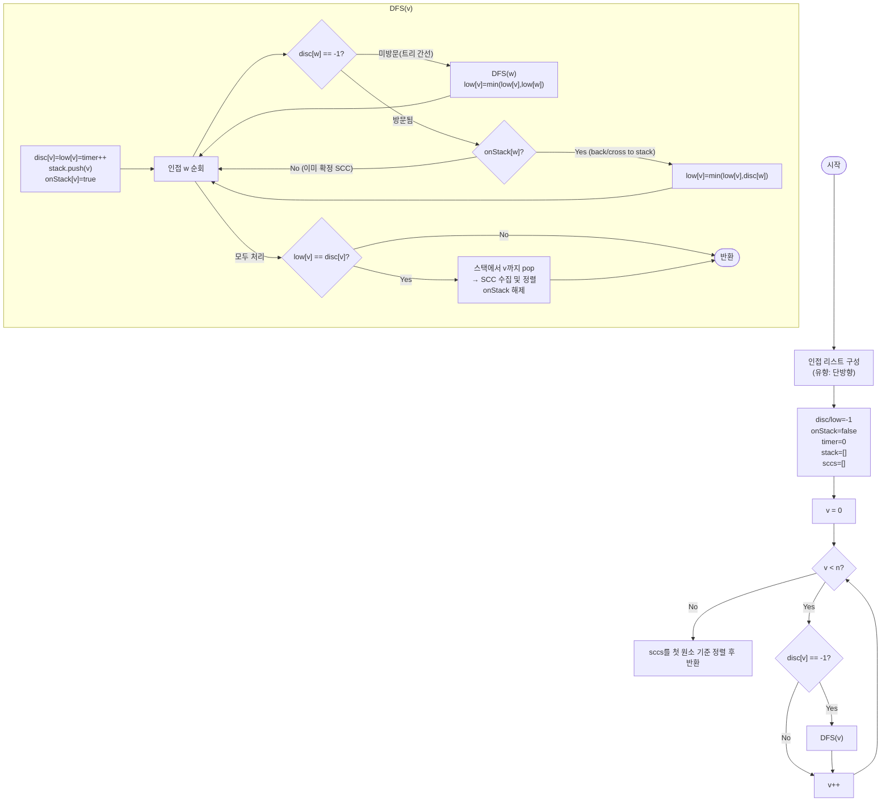

import { AlgorithmSimulation } from "#guide-sim";

# Strongly Connected Components — DFS 한 번으로 "서로 오갈 수 있는 무리"를 한꺼번에 찾는 이유

## 한눈에 보는 컨셉

유향 그래프에서 서로 왕복 가능한 정점 묶음(SCC)을 찾는 문제예요. 모든 정점 쌍의 왕복 가능성을 따로 확인하면 `O(V^2(V+E))`가 걸리지만, DFS 한 번을 돌리면서 "각 정점이 자기 서브트리에서 얼마나 오래된 조상까지 되돌아갈 수 있는가"만 추적하면 `O(V + E)`에 모든 SCC를 동시에 찾을 수 있어요. 이 되돌아가는 최솟값을 `low-link`라고 부르고, 이 값이 자기 자신의 발견 시각과 같아지는 정점이 곧 SCC의 루트입니다.

## 출발점: 가장 순진한 방법부터

문제를 먼저 정확히 잡을게요.

```ts
function stronglyConnectedComponents(n: number, edges: [number, number][]): number[][]
```

| 파라미터 | 의미 | 제약 |
|----------|------|------|
| `n` | 정점 수, 번호는 `0..n-1` | $1 \leq n \leq 10^5$ |
| `edges` | 유향 간선 `[u, v]` 목록 ($u \to v$ 방향) | $0 \leq E \leq 10^5$ |
| 반환 | SCC 배열. SCC 내부는 오름차순, SCC 배열 자체는 각 SCC 첫 원소 기준 오름차순 | — |

두 정점 $u, v$가 같은 SCC에 속한다는 것은 "$u \to v$ 경로도 있고 $v \to u$ 경로도 있다"는 것과 동치예요. 가장 정직한 방법은 이 정의를 그대로 코드로 옮기는 겁니다 — 모든 정점 쌍에 대해 양쪽 방향 도달 가능성을 BFS로 확인하는 거예요.

```ts
function isReachable(n: number, adj: number[][], src: number, dst: number): boolean {
  const visited = new Array(n).fill(false);
  const queue: number[] = [src];
  visited[src] = true;
  while (queue.length > 0) {
    const cur = queue.shift()!;
    if (cur === dst) return true;
    for (const next of adj[cur]) {
      if (!visited[next]) {
        visited[next] = true;
        queue.push(next);
      }
    }
  }
  return false;
}

function stronglyConnectedComponentsNaive(n: number, edges: [number, number][]): number[][] {
  const adj: number[][] = Array.from({ length: n }, () => []);
  for (const [u, v] of edges) adj[u].push(v);

  const sccId = new Array(n).fill(-1);
  const sccs: number[][] = [];
  for (let u = 0; u < n; u++) {
    if (sccId[u] !== -1) continue; // 이미 어느 그룹에 배정됨
    const group = [u];
    sccId[u] = sccs.length;
    for (let v = u + 1; v < n; v++) {
      if (sccId[v] !== -1) continue;
      if (isReachable(n, adj, u, v) && isReachable(n, adj, v, u)) {
        group.push(v);
        sccId[v] = sccs.length;
      }
    }
    sccs.push(group.sort((a, b) => a - b));
  }
  return sccs.sort((a, b) => a[0]! - b[0]!);
}
```

작은 예로 비용을 체감해 볼게요. 정점이 4개면 확인해야 할 쌍은 `(0,1) (0,2) (0,3) (1,2) (1,3) (2,3)` 여섯 개이고, 쌍마다 BFS를 두 번(양방향) 돌립니다.

```text
V = 4 일 때:
쌍 개수         = C(4,2) = 6
쌍 하나의 비용   = BFS(u→v) + BFS(v→u) = O(V+E) 두 번
총 비용         ≈ 6 × 2 × O(V+E)

V = 10^5 로 늘리면:
쌍 개수 ≈ V^2/2 = 5×10^9
총 비용 ≈ 5×10^9 × O(V+E) → V+E ≤ 2×10^5 이므로 최악 10^15 근처 → 1초 안에 불가능
```

문제의 근원은 "왕복 도달 가능성"을 모든 쌍에 대해 독립적으로 다시 계산한다는 데 있어요. 그런데 잘 생각해 보면, `isReachable`을 부를 때마다 그래프를 처음부터 다시 훑는 대신, DFS를 **한 번**만 돌리면서 그 트리 구조 위에서 "누가 누구에게 되돌아갈 수 있는지"를 함께 알아낼 수는 없을까요? 이것이 다음 절의 출발 단서입니다.

## 아이디어 자세히 들여다보기

### 발견 시각과 되돌아가는 최솟값 — 수식과 그림

DFS를 한 번 돌리면서 두 값을 정점마다 기록합니다.

$$\text{disc}(v) = v \text{를 처음 방문한 순번(타임스탬프)}$$

$$\text{low}(v) = \min\!\left(\text{disc}(v),\; \min_{(v,w) \in E,\ \text{onStack}(w)} \text{disc}(w),\; \min_{(v,c)\ \text{tree edge}} \text{low}(c)\right)$$

$\text{low}(v)$를 말로 풀면 "$v$의 서브트리 안에서, 아직 스택에 남아 있는 정점으로 거슬러 올라갈 수 있는 가장 오래된 disc 값"이에요. 작은 그래프로 직접 채워 봅시다. `0 → 1 → 2 → 0` 사이클을 DFS로 방문하면:

```text
DFS(0) → DFS(1) → DFS(2)

트리 간선: 0→1, 1→2       (처음 만나는 정점으로 내려가는 간선)
back edge: 2→0             (이미 스택에 있는 조상으로 되돌아가는 간선)

disc: [0, 1, 2]
DFS(2)에서 2→0 간선을 만나는 순간:
  low(2) = min(disc(2)=2, disc(0)=0) = 0   ← 0까지 거슬러 올라갈 수 있음!
DFS(1)이 자식 2의 결과를 받으며:
  low(1) = min(disc(1)=1, low(2)=0) = 0
DFS(0)도 마찬가지로:
  low(0) = min(disc(0)=0, low(1)=0) = 0

low = [0, 0, 0] = disc(0) → 0이 SCC 루트, {0,1,2} 전체가 하나의 SCC
```

여기서 "왜 하필 `disc(w)`를 쓰고 `low(w)`를 쓰지 않는가"를 짚고 넘어갈게요. back edge를 만난 시점의 `w`는 아직 DFS가 끝나지 않은 조상이라서 `low(w)`가 아직 최종값으로 확정되지 않았어요. 그래서 back edge에서는 "확실히 아는 값"인 `disc(w)`를 쓰고, 자식이 완전히 끝난 뒤에 돌아오는 트리 간선에서만 확정된 `low(w)`를 전파받습니다. 이 둘을 바꿔 쓰면 아직 계산 중인 값을 참조하는 오류가 생겨요.

잠깐, 확인 하나만 해 볼까요? 위 그래프에 정점 3이 있고 간선 `0 → 3`만 추가로 있다면(3에서 나가는 간선은 없음), `low(3)`은 얼마일까요? 3은 스택에 아무도 되돌아갈 대상이 없으니 `low(3) = disc(3)`이고, 3 혼자 SCC가 됩니다 — 그림에 없던 정점이라도 자기 자신을 가리키는 값이 기본값이라는 걸 기억해 두면 됩니다.

**onStack이 하는 일**: 방문은 됐지만 이미 다른 SCC로 확정되어 스택에서 빠진 정점을 구분해야 합니다.

$$\text{onStack}(v) = \begin{cases} \text{true} & v \text{가 현재 DFS 스택에 있음} \\ \text{false} & v \text{가 이미 확정된 SCC에 속함} \end{cases}$$

$\text{onStack}(w) = \text{false}$인 정점으로 가는 간선은 low 계산에서 완전히 무시합니다 — 이미 끝난 SCC로 들어가는 지름길일 뿐, $v$의 SCC를 넓히는 데는 관여하지 않기 때문이에요.

SCC 루트 판정은 이 두 값의 등식 하나로 끝납니다.

$$v \text{는 SCC 루트} \iff \text{low}(v) = \text{disc}(v)$$

### 단서를 설명해 주는 이론 — DFS 트리의 간선 분류

방금 "트리 간선"과 "back edge"라는 말을 썼는데, 이건 즉석에서 지어낸 구분이 아니라 그래프 이론에서 DFS를 돌릴 때 **모든 간선을 반드시 네 종류 중 하나로 분류할 수 있다**는 정리에서 온 것이에요.

- **트리 간선(tree edge)**: DFS가 처음 방문하는 정점으로 내려가는 간선. DFS 트리의 뼈대를 이룹니다.
- **역방향 간선(back edge)**: 현재 스택에 있는(아직 DFS가 끝나지 않은) 조상으로 되돌아가는 간선. 사이클의 존재를 알려줍니다.
- **순방향 간선(forward edge)**: 이미 방문이 끝난 자손으로 내려가는 간선.
- **교차 간선(cross edge)**: 서로 조상/자손 관계가 아닌, 이미 방문이 끝난(스택에서 빠진) 다른 서브트리로 가는 간선.

무향 그래프 DFS에서는 forward/cross edge가 아예 나타나지 않지만, **유향 그래프에서는 네 종류가 모두 나타날 수 있어요.** 이 문제에서 SCC를 결정하는 데 실제로 쓰이는 건 트리 간선(자식의 `low`를 전파)과, "스택에 남아 있는" 조건을 만족하는 back edge뿐입니다. forward edge와, 스택에서 이미 빠진 정점으로 가는 cross edge는 `onStack(w) = false`로 자동으로 걸러져 low 계산에서 배제돼요. `onStack` 검사가 바로 이 네 가지 간선 중 "지금 low 계산에 유효한 것"만 골라내는 필터라는 점을 기억해 두세요 — 뒤에서 SCC 정확성을 따질 때 다시 이 분류로 돌아옵니다.

### 셈을 맡는 자료구조 — 스택

DFS가 진행되는 동안 "지금 이 경로 위에 있는 정점들"을 순서대로 담아 두는 역할을 스택이 맡습니다. 정점을 방문하면 push하고, SCC 루트를 발견하면 그 루트가 나올 때까지 pop해서 하나의 SCC로 묶어요. LIFO(후입선출) 성질 덕분에 "가장 최근에 들어온, 아직 확정되지 않은 정점들"이 항상 스택 위쪽에 모여 있고, 그게 정확히 우리가 SCC로 묶어야 하는 후보들이에요. 스택 자체의 동작 원리는 이 프로젝트의 [Stack 가이드](../../../data-structures/linear/stack/stack-guide.mdx)를 참고하세요 — 여기서는 "push/pop이 `O(1)`인 LIFO 컨테이너"로만 쓰면 충분합니다.

### 왜 모순 없이 작동하는가

**귀납적 정당화**: DFS가 정점 $v$에서 완료(모든 자식을 다 처리)됐을 때 $\text{low}(v) = \text{disc}(v)$라면, $v$와 그 시점에 스택에서 $v$ 위에 쌓여 있는 정점들이 정확히 하나의 SCC를 이룬다는 걸 보여야 해요.

- **기저**: $v$가 리프(자식 없음)이고 back edge도 없다면 $\text{low}(v) = \text{disc}(v)$가 정의상 그대로 성립하고, $v$ 혼자 스택 맨 위에 있으므로 $\{v\}$가 SCC라는 것도 자명합니다(자기 자신과는 항상 도달 가능하니까요).
- **귀납 단계**: $v$의 자식 $c$들을 모두 처리한 뒤라고 합시다. $v$의 서브트리에 있는 정점 $u$가 취할 수 있는 경우는 정확히 둘뿐이에요(경우의 완전성) — (a) $u$에서 $v$의 조상(스택에서 $v$보다 아래)으로 가는 back edge 경로가 존재하거나, (b) 존재하지 않거나. (a)이면 그 back edge가 어떤 자식 $c$의 서브트리를 거쳐 $\text{low}(c)$로, 다시 $\text{low}(v)$로 전파되어 $\text{low}(v) < \text{disc}(v)$가 되므로 애초에 $v$는 이번 판정에서 SCC 루트가 아닙니다(모순, 전제 위반). 따라서 $\text{low}(v) = \text{disc}(v)$인 상황에서는 (b)만 남고, $v$의 서브트리에 있는 모든 정점이 $v$보다 오래된 조상으로 빠져나가는 경로가 없다는 뜻이 돼요. 이때 $v$에서 서브트리의 각 정점 $u$로는 트리 간선을 따라가는 경로가 항상 있고(DFS 트리니까), 반대로 $u$에서 $v$로는 $u$가 $v$의 서브트리 안에서 만든 back edge들을 연결하면(그렇지 않았다면 앞서 다른 자식의 SCC로 이미 분리되어 스택에서 빠졌을 것이므로, 아직 스택에 있다는 것 자체가 $v$로 돌아가는 경로가 있다는 증거예요) 돌아오는 경로가 있습니다. 왕복이 모두 성립하므로 SCC 정의를 만족합니다.

여기서 **헷갈리기 쉬운 포인트**는 "back edge 하나라도 있으면 무조건 큰 SCC가 된다"고 생각하는 것입니다. 아래처럼 반례를 봅시다.

```text
그래프: 0 → 1 → 2,  2 → 1  (back edge지만 0으로는 못 돌아옴)

DFS(0): disc=0, low=0
DFS(1): disc=1, low=1
DFS(2): disc=2, low=2
  2→1 은 back edge, 1이 스택에 있음 → low(2) = min(2, disc(1)=1) = 1
DFS(2) 완료: low(2)=1 ≠ disc(2)=2 → 2는 루트 아님, 아직 확정 안 됨
DFS(1) 완료: low(1) = min(low(1), low(2)=1) = 1 = disc(1) → 1이 루트!
  스택에서 2, 1을 pop → SCC {1, 2}
DFS(0) 완료: low(0) = min(0, low(1)... 이미 pop됨, 전파는 반환값으로만) = 0 = disc(0) → 0은 혼자 SCC
```

back edge `2 → 1`은 있지만 `0`으로 돌아가는 경로는 없어서, `0`은 `{1,2}`와 분리된 별도 SCC예요. "back edge가 있으니 지금까지 스택에 쌓인 정점 전부가 한 SCC"라고 성급히 묶으면 이 경우 `{0,1,2}`를 하나로 잘못 묶게 됩니다. `low`가 오직 **자신의 서브트리 안에서** 되돌아갈 수 있는 범위만 정확히 추적하기 때문에 이런 실수를 막아 줘요.

엣지 케이스도 짚어 둘게요.

```text
간선 없음 (n개 정점)         → 모든 정점이 disc=low, 각자 SCC. 총 n개.
자기 루프 (v, v)              → low(v) = min(low(v), disc(v)) = disc(v) → 즉시 루트, {v} 단원소 SCC.
단방향 체인 0→1→2→...        → back edge가 하나도 없으므로 매 정점이 SCC 루트. 각자 SCC.
완전 양방향 사이클            → 첫 정점에서 시작한 back edge가 처음 정점까지 low를 끌어내려 전체가 하나의 SCC.
```

## 아이디어를 코드로 옮기기

```ts
function stronglyConnectedComponents(n: number, edges: [number, number][]): number[][] {
  const adj: number[][] = Array.from({ length: n }, () => []);
  for (const [u, v] of edges) adj[u].push(v); // 유향: 단방향으로만 넣는다

  const disc = new Array(n).fill(-1);
  const low = new Array(n).fill(-1);
  const onStack = new Array(n).fill(false);
  const stack: number[] = [];
  const sccs: number[][] = [];
  let timer = 0;

  function dfs(v: number): void {
    disc[v] = low[v] = timer++;
    stack.push(v);
    onStack[v] = true;

    for (const w of adj[v]) {
      if (disc[w] === -1) {
        dfs(w);
        low[v] = Math.min(low[v], low[w]);
      } else if (onStack[w]) {
        low[v] = Math.min(low[v], disc[w]);
      }
      // onStack[w] === false: 이미 확정된 SCC → 무시
    }

    if (low[v] === disc[v]) {
      const scc: number[] = [];
      while (true) {
        const w = stack.pop()!;
        onStack[w] = false;
        scc.push(w);
        if (w === v) break;
      }
      scc.sort((a, b) => a - b);
      sccs.push(scc);
    }
  }

  for (let v = 0; v < n; v++) {
    if (disc[v] === -1) dfs(v);
  }

  return sccs.sort((a, b) => a[0]! - b[0]!);
}
```

**가장 실수가 잦은 줄은 `else if (onStack[w])`입니다.** 이걸 `disc[w] !== -1`로만 쓰면(즉 onStack 검사를 빼먹으면), 이미 다른 SCC로 확정되어 스택에서 빠진 정점까지 `low` 계산에 끌어들이게 돼요. `n=4`, `edges=[[0,1],[1,0],[2,3],[3,0]]`로 실제 값을 비교해 보면 이렇습니다.

```text
그래프: 0⇄1 (SCC {0,1}, 먼저 완성되어 스택에서 pop됨, disc[0]=0)
        2→3→0 (3에서 이미 pop된 0으로 가는 cross edge)

정상(onStack 검사 O): low[3]=3(0은 이미 onStack=false라 무시) → 3 단독 SCC
                       low[2]=3 → 2도 단독 SCC
                       결과 = [[0,1],[2],[3]]

버그(onStack 검사 X): low[3]=min(3, disc[0]=0)=0 → 3은 루트 판정 실패(low≠disc)
                       low[2]도 0으로 끌려 내려가 2도 루트 판정 실패
                       2, 3은 끝내 어떤 SCC로도 수집되지 못하고 스택에 남는다
                       결과 = [[0,1]]                    ← 2, 3이 통째로 유실!
```

그 외에 놓치기 쉬운 지점:

- `disc[v] = low[v] = timer++`에서 두 값을 **같은 순간에 같은 값으로** 시작합니다. 이후 `low`만 아래로 갱신되고 `disc`는 다시는 바뀌지 않는다는 게 전체 알고리즘의 기준점이에요.
- SCC 루트 판정(`low[v] === disc[v]`)은 **자식을 모두 순회한 뒤**에만 검사합니다. 순회 도중에 검사하면 아직 발견하지 못한 back edge를 놓칠 수 있어요.
- `scc.sort((a, b) => a - b)`는 SCC 내부 정렬, 마지막 `sccs.sort(...)`는 SCC 배열 자체의 정렬입니다. 이 둘을 헷갈려서 하나만 정렬하면 출력 형식 조건을 만족하지 못해요.

이 구현은 DFS 한 번, 정점·간선 각각을 상수 번 처리하므로 시간 `O(V + E)`, 공간은 인접 리스트·세 개 배열·스택 모두 `O(V + E)`입니다. 처음에 세운 목표(`O(V+E)`)를 그대로 달성했어요. 참고로 Kosaraju 알고리즘도 같은 `O(V+E)`를 DFS 두 번(원본 그래프 + 전치 그래프)으로 달성합니다 — 점근 복잡도는 동일하지만 그래프를 뒤집는 과정과 두 번째 순회가 추가로 필요해서, DFS 한 번으로 끝내는 Tarjan 쪽이 상수 계수와 구현 단순성 면에서 조금 더 유리해요. 두 접근 모두 이미 이론적 하한(모든 정점·간선을 최소 한 번은 봐야 하므로 `Ω(V+E)`)에 닿아 있어서, 이 문제에는 더 빠른 범용 알고리즘이 존재하지 않습니다.

한 가지 실무 주의사항도 남겨 둘게요. 위 구현은 재귀 DFS라서, `V = 10^5`짜리 단방향 체인처럼 극단적으로 깊은 그래프에서는 재귀 깊이가 정점 수만큼 쌓여 스택 오버플로 위험이 있어요. 실제 프로덕션 코드라면 명시적 스택으로 DFS를 재작성해 이 위험을 없애는 것이 안전합니다.

## 실행 시각화

예시 유향 그래프 `n = 5`, `edges = [[0,1], [1,2], [2,0], [2,3], [3,4], [4,3]]`에 대해 Tarjan 알고리즘을 실행하는 과정입니다. 노드 위 표기는 `disc/low`이고, 노란색(frontier)은 현재 스택에 있는 정점, 빨간색(active)은 지금 처리 중인 정점, 회색(visited)은 이미 확정된 SCC에 속한 정점입니다. `low[v] == disc[v]`가 되는 순간 스택을 그 정점까지 비워 SCC로 수집해요. 실제 반환값은 `[[0, 1, 2], [3, 4]]`이며, 시뮬레이션 마지막 프레임과 일치합니다.

> 대화형 시뮬레이션은 MDX 런타임에서 표시됩니다.

export const nodes = [
  { id: 0, label: "0", x: 20, y: 20 },
  { id: 1, label: "1", x: 42, y: 50 },
  { id: 2, label: "2", x: 20, y: 80 },
  { id: 3, label: "3", x: 72, y: 32 },
  { id: 4, label: "4", x: 72, y: 76 },
];

export const edges = [
  { from: 0, to: 1, directed: true },
  { from: 1, to: 2, directed: true },
  { from: 2, to: 0, directed: true },
  { from: 2, to: 3, directed: true },
  { from: 3, to: 4, directed: true },
  { from: 4, to: 3, directed: true },
];

export const steps = [
  {
    title: "초기화",
    detail: "disc/low 미설정, 스택 비어 있음. 0에서 DFS 시작.",
    nodes, edges,
    nodeStatus: {},
    nodeValue: { 0: "−", 1: "−", 2: "−", 3: "−", 4: "−" },
    entries: [
      { label: "스택", value: "[]" },
      { label: "low", value: "[-, -, -, -, -]" },
      { label: "SCC", value: "[]" },
    ],
  },
  {
    title: "DFS(0)→(1)→(2)",
    detail: "트리 간선으로 0,1,2 진입. 모두 스택에 push. disc=0,1,2.",
    nodes, edges,
    nodeStatus: { 0: "frontier", 1: "frontier", 2: "active" },
    nodeValue: { 0: "0/0", 1: "1/1", 2: "2/2", 3: "−", 4: "−" },
    entries: [
      { label: "스택", value: "[0, 1, 2]" },
      { label: "low", value: "[0, 1, 2, -, -]" },
      { label: "SCC", value: "[]" },
    ],
  },
  {
    title: "back edge 2 → 0",
    detail: "0이 스택에 있음 → low[2]=min(2, disc[0]=0)=0.",
    nodes, edges,
    nodeStatus: { 0: "frontier", 1: "frontier", 2: "active" },
    nodeValue: { 0: "0/0", 1: "1/1", 2: "2/0", 3: "−", 4: "−" },
    activeEdge: { from: 2, to: 0 },
    entries: [
      { label: "스택", value: "[0, 1, 2]" },
      { label: "low", value: "[0, 1, 0, -, -]" },
      { label: "SCC", value: "[]" },
    ],
  },
  {
    title: "DFS(3)→(4)",
    detail: "2→3 트리 간선. 3,4 진입해 스택에 push. disc=3,4.",
    nodes, edges,
    nodeStatus: { 0: "frontier", 1: "frontier", 2: "frontier", 3: "frontier", 4: "active" },
    nodeValue: { 0: "0/0", 1: "1/1", 2: "2/0", 3: "3/3", 4: "4/4" },
    entries: [
      { label: "스택", value: "[0, 1, 2, 3, 4]" },
      { label: "low", value: "[0, 1, 0, 3, 4]" },
      { label: "SCC", value: "[]" },
    ],
  },
  {
    title: "back edge 4 → 3",
    detail: "3이 스택에 있음 → low[4]=min(4, disc[3]=3)=3. 4 종료: low[4]=3≠disc[4]=4 → 루트 아님.",
    nodes, edges,
    nodeStatus: { 0: "frontier", 1: "frontier", 2: "frontier", 3: "frontier", 4: "active" },
    nodeValue: { 0: "0/0", 1: "1/1", 2: "2/0", 3: "3/3", 4: "4/3" },
    activeEdge: { from: 4, to: 3 },
    entries: [
      { label: "스택", value: "[0, 1, 2, 3, 4]" },
      { label: "low", value: "[0, 1, 0, 3, 3]" },
      { label: "SCC", value: "[]" },
    ],
  },
  {
    title: "3은 SCC 루트 → [3,4] 수집",
    detail: "low[3]=3 == disc[3]=3 → 루트. 스택에서 4,3을 pop → SCC [3,4]. onStack 해제.",
    nodes, edges,
    nodeStatus: { 0: "frontier", 1: "frontier", 2: "active", 3: "visited", 4: "visited" },
    nodeValue: { 0: "0/0", 1: "1/1", 2: "2/0", 3: "3/3", 4: "4/3" },
    entries: [
      { label: "스택", value: "[0, 1, 2]" },
      { label: "low", value: "[0, 1, 0, 3, 3]" },
      { label: "SCC", value: "[[3, 4]]" },
    ],
  },
  {
    title: "low 전파: 2→1→0",
    detail: "low[2]=min(0, low[3]=3)=0. 반환하며 low[1]=0, low[0]=0. 모두 루트 아님(2,1).",
    nodes, edges,
    nodeStatus: { 0: "active", 1: "frontier", 2: "frontier", 3: "visited", 4: "visited" },
    nodeValue: { 0: "0/0", 1: "1/0", 2: "2/0", 3: "3/3", 4: "4/3" },
    entries: [
      { label: "스택", value: "[0, 1, 2]" },
      { label: "low", value: "[0, 0, 0, 3, 3]" },
      { label: "SCC", value: "[[3, 4]]" },
    ],
  },
  {
    title: "0은 SCC 루트 → [0,1,2] 수집",
    detail: "low[0]=0 == disc[0]=0 → 루트. 스택에서 2,1,0을 pop → SCC [0,1,2].",
    nodes, edges,
    nodeStatus: { 0: "visited", 1: "visited", 2: "visited", 3: "visited", 4: "visited" },
    nodeValue: { 0: "0/0", 1: "1/0", 2: "2/0", 3: "3/3", 4: "4/3" },
    entries: [
      { label: "스택", value: "[]" },
      { label: "low", value: "[0, 0, 0, 3, 3]" },
      { label: "SCC", value: "[[3, 4], [0, 1, 2]]" },
    ],
  },
  {
    title: "완료: [[0,1,2], [3,4]]",
    detail: "첫 원소 기준 정렬해 반환. 사이클 0-1-2와 3-4가 각각 하나의 SCC.",
    nodes, edges,
    nodeStatus: { 0: "visited", 1: "visited", 2: "visited", 3: "visited", 4: "visited" },
    nodeValue: { 0: "0/0", 1: "1/0", 2: "2/0", 3: "3/3", 4: "4/3" },
    entries: [
      { label: "스택", value: "[]" },
      { label: "low", value: "[0, 0, 0, 3, 3]" },
      { label: "SCC", value: "[[0, 1, 2], [3, 4]]" },
    ],
  },
];

<AlgorithmSimulation view={["graph", "keyValue"]} steps={steps} title="강한 연결 요소 (Tarjan)" />

## 흐름 한눈에 보기



## 스스로 점검하기

1. `n = 4`, `edges = [[0,1],[1,2],[2,3],[3,1]]`에 대해 손으로 DFS를 따라가며 `disc`, `low`를 채워 보세요. 어떤 SCC가 나오나요? (힌트: `1→2→3→1`이 사이클을 이루고 `0`은 그 사이클로 들어가기만 합니다. 답: `[[0], [1, 2, 3]]`.)
2. "아이디어를 코드로 옮기기"에서 본 `n=4`, `edges=[[0,1],[1,0],[2,3],[3,0]]` 그래프를, `onStack` 검사 없이 `disc[w] !== -1`만으로 판정하도록 바꾼 코드로 손으로 따라가 보세요. `low[3]`이 어느 시점에 몇으로 잘못 갱신되고, 그 값이 `low[2]`까지 어떻게 전파되어 결과에서 `2`, `3`이 통째로 사라지는지 단계별로 짚어 보세요.
3. 만약 그래프가 무향이라면(모든 간선이 양방향) SCC라는 개념은 어떻게 달라질까요? 무향 그래프에서 "서로 도달 가능한 정점 묶음"을 찾는 문제는 이미 다른 이름의 더 단순한 문제와 같아지는데, 그게 무엇일지 생각해 보세요.
