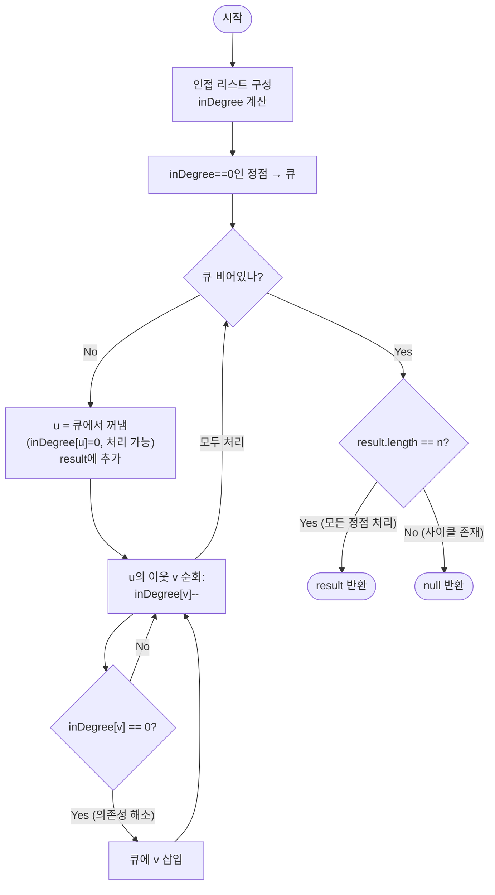

import { AlgorithmSimulation } from "#guide-sim";

# topologicalSort 해설

## 성능 목표 예측

| 제약 | 값 |
|------|----|
| 정점 수 $V$ | $1 \leq V \leq 10^5$ |
| 간선 수 $E$ | $0 \leq E \leq 10^5$ |
| 정점 번호 | $0 \ldots n-1$ |
| 그래프 종류 | 유향 (DAG이면 위상 정렬 존재, 사이클이면 null) |

**naive 접근의 비용**: 모든 순열 $\sigma: V \to \{0, \ldots, n-1\}$을 열거해 조건 $\forall (u,v) \in E: \sigma(u) < \sigma(v)$를 만족하는 것을 찾는다.
순열 수 $n!$ → $n = 10$만 돼도 $3.6 \times 10^6$, $n = 20$이면 $2.4 \times 10^{18}$ → 완전 불가.

조금 나은 방법: DFS로 후위 순서(post-order)를 기록해 역순 정렬한다.
$O(V + E)$ — 이것이 최선.

**목표**: Kahn's Algorithm(BFS 기반) 또는 DFS 후위 역순으로 $O(V + E)$ 안에 위상 정렬 또는 null을 반환한다.
$V + E \leq 2 \times 10^5$으로 충분히 빠르다.

**공간 트레이드오프**: 인접 리스트 $O(V + E)$ + inDegree 배열 $O(V)$ + 큐 $O(V)$.

---

## 목표 함수

```ts
function topologicalSort(n: number, edges: [number, number][]): number[] | null
```

| 파라미터 | 의미 | 제약 |
|----------|------|------|
| `n` | 정점 수 | $1 \leq n \leq 10^5$ |
| `edges` | 유향 간선 `[u, v]` ($u \to v$) 목록 | $0 \leq E \leq 10^5$ |
| 반환 | 유효한 위상 정렬 배열(복수 답 가능); 사이클 존재 시 `null` | — |

**엣지케이스**

1. **간선 없음**: 모든 정점의 진입차수가 0. 임의의 순서가 유효. 예: `[0, 1, ..., n-1]`.
2. **단방향 체인** $0 \to 1 \to 2$: 유일한 위상 정렬 `[0, 1, 2]`.
3. **사이클 존재**: null 반환. 사이클 내 정점들은 서로를 기다려 큐에 들어가지 못한다.
4. **다수의 유효 답**: 테스트는 검증 함수(validity checker)로 확인한다.

---

## 핵심 아이디어

**핵심 아이디어**: "선행 조건이 모두 해소된 작업을 큐로 관리하면, 매번 전체를 다시 탐색하지 않고도 처리 가능한 작업을 즉시 찾을 수 있다."

모든 작업 순열을 시도하면 $n!$이고, 매 반복마다 전체 정점을 스캔해도 $O(V^2)$이다. Kahn's Algorithm은 각 정점의 진입차수(아직 처리 안 된 선행 정점 수)를 유지하면서, 진입차수가 0이 되는 순간 즉시 큐에 삽입한다. 큐에서 꺼낸 순서가 곧 유효한 위상 정렬이 되며, 처리된 정점 수가 $n$보다 적으면 사이클이 있다는 증거가 된다 — 모두 $O(V+E)$에 처리된다.

**풀이 구조**
1. 인접 리스트를 구성하면서 각 정점의 `inDegree`를 계산한다.
2. `inDegree == 0`인 정점을 모두 큐에 삽입한다.
3. 큐에서 정점 `u`를 꺼내 결과에 추가하고, `u`의 모든 이웃 `v`에 대해 `inDegree[v]--`를 수행한다.
4. `inDegree[v] == 0`이 되면 즉시 큐에 삽입한다.
5. 처리된 정점 수 == $n$이면 결과를 반환하고, 아니면 `null`(사이클 존재)을 반환한다.

**조건**: 유향 비순환 그래프(DAG)에서만 위상 정렬이 존재한다. 사이클이 있으면 `null`을 반환한다.

**대표 예시**: 대학 강의 수강 순서 결정
"자료구조를 듣기 전에 프로그래밍 입문을 들어야 한다"처럼 선수 과목 관계를 간선으로 표현한다. 진입차수 0(선수 과목이 없는) 과목부터 큐에 넣어 처리하면 유효한 수강 순서가 만들어진다. 서로가 서로의 선수 과목인 순환이 있다면 `null`을 반환한다.

**언제 쓰나**
의존성이 있는 작업들을 올바른 순서로 실행해야 할 때(빌드 시스템, 패키지 설치, 강의 이수 순서 등), 또는 유향 그래프에 사이클이 있는지 동시에 확인해야 할 때 사용한다.

---

### 원형 아이디어와 naive 접근

"모든 간선 $(u, v)$에 대해 $u$가 $v$보다 앞에 오는 순열"을 직접 구성하려면, 어떤 정점이 "먼저 올 수 있는가"를 따져야 한다.

가장 단순한 접근:

```
result = []
while result.length < n:
  찾기: 다른 모든 정점보다 먼저 올 수 있는 정점 v
  (= 결과에 아직 포함되지 않은 정점 중 진입차수가 0인 정점)
  result.append(v)
  v를 그래프에서 제거 (v에서 나가는 간선 삭제)
```

각 반복에서 "진입차수 0인 정점 찾기"에 $O(V)$를 쓰면 전체 $O(V^2)$ → $V = 10^5$이면 $10^{10}$ → 시간 초과.

문제의 근원: 매번 전체 정점을 스캔하면서 진입차수 0인 정점을 찾는다. 이미 알고 있는 "0이 될 정점" 목록을 유지하지 않는다.

### 어떤 관찰이 돌파구가 되는가

- **관찰 1**: 어떤 정점 $v$의 진입차수가 0이라는 것은, $v$가 "선행 조건 없이 처리 가능"하다는 의미이다. 이런 정점들을 큐로 관리하면 매번 $O(V)$ 탐색 없이 $O(1)$로 가져올 수 있다.
- **관찰 2**: 정점 $u$를 처리하고 나면(결과에 추가하면), $u$에서 나가는 간선 $(u, v)$를 "제거"한다. 이를 $\text{inDegree}[v]$를 1 감소시키는 것으로 구현한다. $\text{inDegree}[v] = 0$이 되는 순간 $v$를 큐에 넣는다.
- **관찰 3**: 처리된 정점 수가 $n$보다 작으면 처리되지 못한 정점들이 있다. 이들은 진입차수가 항상 $\geq 1$이었다는 뜻이고, 이는 곧 사이클의 존재를 의미한다.

### 관찰을 형식화: 상태/구조 정의

상태:

$$\text{inDegree}[v] = \text{간선 집합 } E \text{에서 } v \text{로 들어오는 간선 수}$$

처리 진행 중 $\text{inDegree}[v]$의 동적 의미:

$$\text{inDegree}[v]_{\text{현재}} = \text{아직 결과에 추가되지 않은 } v \text{의 선행 정점 수}$$

이 값이 0이 되는 순간 $v$의 모든 선행 조건이 충족된 것이므로 $v$를 결과에 추가할 수 있다.

왜 큐인가? FIFO 큐는 "이미 처리 가능해진 정점"들을 순서대로 꺼낸다. 위상 정렬의 답이 유일하지 않을 수 있으므로, 큐에서 꺼내는 순서가 하나의 유효한 위상 정렬을 결정한다. (우선순위 큐를 쓰면 사전순 최소 위상 정렬을 얻는다.)

### 점화식 또는 핵심 연산

초기화:

$$\text{inDegree}[v] = |\{u : (u, v) \in E\}| \quad \forall v \in V$$

처리 규칙 (정점 $u$를 결과에 추가할 때):

$$\forall (u, v) \in E: \quad \text{inDegree}[v] \leftarrow \text{inDegree}[v] - 1$$
$$\text{if } \text{inDegree}[v] = 0: \quad \text{큐에 } v \text{ 삽입}$$

사이클 판별:

$$\text{result.length} < n \iff \text{사이클 존재}$$

각 항의 의미:
- $\text{inDegree}[v]$를 $-1$: 간선 $(u, v)$를 "제거"하는 효과. $u$가 이미 정렬됐으므로 $v$는 이 의존성이 해소됨.
- $\text{inDegree}[v] = 0$: 더 이상 기다릴 선행 정점이 없다. 즉시 큐에 삽입 가능.
- 처리 수 $< n$: 일부 정점이 진입차수가 0이 되지 못했다는 뜻 = 사이클 내 정점이 서로를 기다림.

### 정당성 — 왜 이것이 옳은가

**완전성**: 그래프가 DAG라면, 위상 정렬이 반드시 존재하므로 Kahn's Algorithm은 항상 $n$개의 정점을 처리한다. 귀납적으로: 임의의 DAG에는 진입차수 0인 정점이 반드시 하나 이상 존재한다. 그 정점을 처리하고 나면, 남은 그래프도 DAG이므로 같은 논리가 반복 적용된다.

**정확성**: 큐에서 꺼낸 정점 $u$는, 이미 모든 선행 정점이 결과에 추가된 상태이다($\text{inDegree}[u] = 0$). 따라서 $u$ 이전에 처리된 정점들이 모두 $u$의 선행 정점이므로 위상 정렬 조건 $\sigma(u) < \sigma(v)$가 만족된다.

**사이클 탐지**: 사이클 $v_0 \to v_1 \to \cdots \to v_k = v_0$에서 각 정점의 진입차수는 사이클 내 간선 때문에 항상 $\geq 1$이다. 따라서 이 정점들은 큐에 절대 들어가지 못하고, `result.length < n`으로 사이클을 판별한다.

까다로운 케이스: 자기 루프 $(v, v)$. $\text{inDegree}[v] \geq 1$이 유지되어 큐에 들어가지 못함 → null 반환.

### 구현 디테일과 최적화

**inDegree 초기화 시점**: 간선 목록을 읽으며 즉시 `inDegree[v]++`하고, 초기에 0인 정점을 큐에 넣는다. 이 두 단계가 뒤섞이면 오류가 발생한다.

**inDegree[v]의 의미 변화 함정**: 처리 진행 중 `inDegree[v]`는 "원래 진입차수"가 아니라 "아직 처리되지 않은 선행 정점 수"로 의미가 바뀐다. 이 동적 의미를 혼동하면 잘못된 판별이 발생한다.

**큐 vs 스택**: DFS 후위 역순을 사용하는 방법도 $O(V + E)$이지만, 사이클 탐지를 위해 directedCycleDetection과 유사한 GRAY/BLACK 색 처리가 추가된다. Kahn's Algorithm은 사이클 탐지와 위상 정렬을 동시에 처리해 구현이 단순하다.

**다수의 유효 답**: 큐 대신 우선순위 큐(min-heap)를 쓰면 사전순 최소 위상 정렬을 얻는다. 일반 큐는 임의의 유효한 위상 정렬을 반환한다.

## 시뮬레이션

예시 DAG `n = 6`, `edges = [[0,2], [1,2], [2,3], [2,4], [3,5], [4,5]]` (선수 과목 관계)에 대해 Kahn's Algorithm을 실행하는 과정이다. 노드 위 숫자는 현재 진입차수(아직 처리되지 않은 선행 정점 수)이다. 노란색은 큐에 든 정점(진입차수 0), 빨간색은 방금 꺼낸 정점(active), 회색은 결과에 추가 완료(visited)를 뜻한다. `keyValue` 패널은 result, 큐, 진입차수 배열을 보여준다.

실제 반환값은 `[0, 1, 2, 3, 4, 5]` (유효한 위상 정렬 중 하나)이며, 시뮬레이션 마지막 프레임과 일치한다.

> 대화형 시뮬레이션은 MDX 런타임에서 표시됩니다.

export const nodes = [
  { id: 0, label: "0", x: 22, y: 14 },
  { id: 1, label: "1", x: 52, y: 14 },
  { id: 2, label: "2", x: 37, y: 42 },
  { id: 3, label: "3", x: 20, y: 68 },
  { id: 4, label: "4", x: 54, y: 68 },
  { id: 5, label: "5", x: 37, y: 90 },
];

export const edges = [
  { from: 0, to: 2, directed: true },
  { from: 1, to: 2, directed: true },
  { from: 2, to: 3, directed: true },
  { from: 2, to: 4, directed: true },
  { from: 3, to: 5, directed: true },
  { from: 4, to: 5, directed: true },
];

export const steps = [
  {
    title: "초기화",
    detail: "진입차수 계산 후 inDegree==0인 0, 1을 큐에 넣는다.",
    nodes, edges,
    nodeStatus: { 0: "frontier", 1: "frontier" },
    nodeValue: { 0: 0, 1: 0, 2: 2, 3: 1, 4: 1, 5: 2 },
    entries: [
      { label: "result", value: "[]" },
      { label: "큐", value: "[0, 1]" },
      { label: "inDegree", value: "[0, 0, 2, 1, 1, 2]" },
    ],
  },
  {
    title: "0 처리",
    detail: "0을 꺼내 result에 추가. 이웃 2의 inDegree 2→1.",
    nodes, edges,
    nodeStatus: { 0: "active", 1: "frontier" },
    nodeValue: { 0: 0, 1: 0, 2: 1, 3: 1, 4: 1, 5: 2 },
    activeEdge: { from: 0, to: 2 },
    entries: [
      { label: "result", value: "[0]" },
      { label: "큐", value: "[1]" },
      { label: "inDegree", value: "[0, 0, 1, 1, 1, 2]" },
    ],
  },
  {
    title: "1 처리",
    detail: "1을 꺼내 추가. 이웃 2의 inDegree 1→0 → 2를 큐에 넣는다.",
    nodes, edges,
    nodeStatus: { 0: "visited", 1: "active", 2: "frontier" },
    nodeValue: { 0: 0, 1: 0, 2: 0, 3: 1, 4: 1, 5: 2 },
    activeEdge: { from: 1, to: 2 },
    entries: [
      { label: "result", value: "[0, 1]" },
      { label: "큐", value: "[2]" },
      { label: "inDegree", value: "[0, 0, 0, 1, 1, 2]" },
    ],
  },
  {
    title: "2 처리",
    detail: "2를 꺼내 추가. 이웃 3, 4의 inDegree가 0이 되어 둘 다 큐에 넣는다.",
    nodes, edges,
    nodeStatus: { 0: "visited", 1: "visited", 2: "active", 3: "frontier", 4: "frontier" },
    nodeValue: { 0: 0, 1: 0, 2: 0, 3: 0, 4: 0, 5: 2 },
    entries: [
      { label: "result", value: "[0, 1, 2]" },
      { label: "큐", value: "[3, 4]" },
      { label: "inDegree", value: "[0, 0, 0, 0, 0, 2]" },
    ],
  },
  {
    title: "3 처리",
    detail: "3을 꺼내 추가. 이웃 5의 inDegree 2→1 (아직 큐에 못 들어감).",
    nodes, edges,
    nodeStatus: { 0: "visited", 1: "visited", 2: "visited", 3: "active", 4: "frontier" },
    nodeValue: { 0: 0, 1: 0, 2: 0, 3: 0, 4: 0, 5: 1 },
    activeEdge: { from: 3, to: 5 },
    entries: [
      { label: "result", value: "[0, 1, 2, 3]" },
      { label: "큐", value: "[4]" },
      { label: "inDegree", value: "[0, 0, 0, 0, 0, 1]" },
    ],
  },
  {
    title: "4 처리",
    detail: "4를 꺼내 추가. 이웃 5의 inDegree 1→0 → 5를 큐에 넣는다.",
    nodes, edges,
    nodeStatus: { 0: "visited", 1: "visited", 2: "visited", 3: "visited", 4: "active", 5: "frontier" },
    nodeValue: { 0: 0, 1: 0, 2: 0, 3: 0, 4: 0, 5: 0 },
    activeEdge: { from: 4, to: 5 },
    entries: [
      { label: "result", value: "[0, 1, 2, 3, 4]" },
      { label: "큐", value: "[5]" },
      { label: "inDegree", value: "[0, 0, 0, 0, 0, 0]" },
    ],
  },
  {
    title: "5 처리",
    detail: "5를 꺼내 추가. 큐가 비었다.",
    nodes, edges,
    nodeStatus: { 0: "visited", 1: "visited", 2: "visited", 3: "visited", 4: "visited", 5: "active" },
    nodeValue: { 0: 0, 1: 0, 2: 0, 3: 0, 4: 0, 5: 0 },
    entries: [
      { label: "result", value: "[0, 1, 2, 3, 4, 5]" },
      { label: "큐", value: "[]" },
      { label: "inDegree", value: "[0, 0, 0, 0, 0, 0]" },
    ],
  },
  {
    title: "완료: [0, 1, 2, 3, 4, 5]",
    detail: "처리한 정점 수 6 == n 이므로 사이클 없음. 위상 정렬을 반환.",
    nodes, edges,
    nodeStatus: { 0: "visited", 1: "visited", 2: "visited", 3: "visited", 4: "visited", 5: "visited" },
    nodeValue: { 0: 0, 1: 0, 2: 0, 3: 0, 4: 0, 5: 0 },
    entries: [
      { label: "result", value: "[0, 1, 2, 3, 4, 5]" },
      { label: "큐", value: "[]" },
      { label: "inDegree", value: "[0, 0, 0, 0, 0, 0]" },
    ],
  },
];

<AlgorithmSimulation view={["graph", "keyValue"]} steps={steps} title="위상 정렬 (Kahn's Algorithm)" />

## 수도 코드와 Activity Diagram

### 의사코드

```
function topologicalSort(n, edges):
  adj[0..n-1]      = 빈 리스트
  inDegree[0..n-1] = 0          -- 불변식: 초기값 = 원래 진입차수

  for [u, v] in edges:
    adj[u].push(v)
    inDegree[v]++               -- v로 들어오는 간선 카운트

  queue = []
  for v in 0..n-1:
    if inDegree[v] == 0:
      queue.push(v)             -- 선행 조건 없는 정점 즉시 처리 가능

  result = []
  while queue is not empty:
    u = queue.shift()           -- 불변식: u는 현재 처리 가능한 정점 (inDegree = 0)
    result.push(u)

    for v in adj[u]:
      inDegree[v]--             -- 불변식: inDegree는 "아직 처리 안 된 선행 정점 수"
      if inDegree[v] == 0:
        queue.push(v)           -- 의존성 해소 → 즉시 큐에 삽입

  if result.length < n:
    return null                 -- 일부 정점이 큐에 못 들어감 = 사이클 존재
  return result
```

**핵심 불변식:**
`inDegree[v]`는 처리 진행 중 "아직 결과 배열에 추가되지 않은 $v$의 선행 정점 수"를 의미한다. 이 값이 0이 되는 순간이 $v$를 결과에 추가할 수 있는 최초이자 유일한 적기이다.

### Activity Diagram


