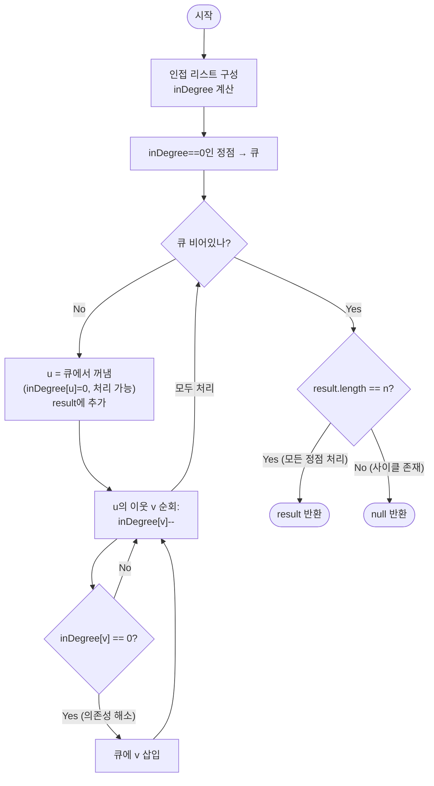

import { AlgorithmSimulation } from "#guide-sim";

# topologicalSort — 진입차수가 0이 되는 순간을 큐가 놓치지 않는 이유

## 한눈에 보는 컨셉

선행 조건이 있는 작업들(과목 이수, 빌드 순서, 패키지 설치)을 규칙에 맞게 한 줄로 세우는 문제예요. 매번 "지금 놓아도 되는 정점"을 처음부터 다시 찾으면 `O(V^2)`이지만, 어떤 정점의 진입차수(선행 정점 수)가 0이 되는 **바로 그 순간**을 놓치지 않고 큐에 담아 두면 다시 찾을 필요가 없어져 `O(V + E)`로 끝납니다. 이 알고리즘의 본질은 하나예요 — **"0이 되는 순간을 잡아채는 큐"**를 유지하는 것입니다.

## 출발점: 가장 순진한 방법부터

문제를 먼저 정확히 잡을게요.

```ts
function topologicalSort(n: number, edges: [number, number][]): number[] | null
```

| 파라미터 | 의미 | 제약 |
|----------|------|------|
| `n` | 정점 수 (번호는 `0..n-1`) | $1 \leq n \leq 10^5$ |
| `edges` | 유향 간선 `[u, v]` ($u \to v$, "$u$가 $v$보다 먼저") 목록 | $0 \leq E \leq 10^5$ |
| 반환 | 모든 간선을 만족하는 정점 순열(복수 정답 가능). 사이클이 있으면 `null` | — |

$V + E \leq 2 \times 10^5$입니다. 시간 제한 1초를 기준으로 하면 `O(V+E)`는 여유롭지만, `O(V^2)`는 $V=10^5$에서 $10^{10}$ 연산이 되어 확실히 시간 초과예요.

"모든 간선 $(u,v)$에 대해 $u$가 $v$보다 앞에 오는 나열"을 만들려면 어떻게 시작해야 할까요? 가장 정직한 방법은 **지금 당장 맨 앞에 놓아도 안전한 정점**, 즉 자신보다 먼저 와야 하는 정점이 하나도 남지 않은 정점(진입차수 0)을 찾아 하나씩 결과로 옮기는 겁니다.

코드로 그대로 옮기면 이렇습니다.

```ts
function topologicalSortNaiveScan(
  n: number,
  edges: [number, number][],
): number[] | null {
  const adj: number[][] = Array.from({ length: n }, () => []);
  const inDegree = new Array<number>(n).fill(0);
  for (const [u, v] of edges) {
    adj[u]!.push(v);
    inDegree[v]!++;
  }

  const done = new Array<boolean>(n).fill(false);
  const result: number[] = [];
  while (result.length < n) {
    let found = -1;
    for (let v = 0; v < n; v++) {
      // 매번 처음(v=0)부터 다시 훑는다 — 여기가 O(V^2)의 근원
      if (!done[v] && inDegree[v] === 0) {
        found = v;
        break;
      }
    }
    if (found === -1) return null; // 더 찾을 수 없는데 다 못 옮겼다 = 사이클
    done[found] = true;
    result.push(found);
    for (const v of adj[found]!) inDegree[v]!--;
  }
  return result;
}
```

왜 느린가: `result`에 하나를 추가할 때마다 정점 `0..n-1`을 처음부터 다시 훑어 진입차수 0인 정점을 찾습니다. 정점을 `n`개 옮겨야 하므로 이 훑기가 최대 `n`번 반복되고, 매번 최대 `n`칸을 봅니다 — 총 `O(V^2)`입니다.

작게 손으로 따라가 볼게요. 체인 `n=4`, `edges=[[0,1],[1,2],[2,3]]`입니다.

```text
초기 inDegree = [0, 1, 1, 1]

반복1: v=0..3 훑다가 v=0에서 발견(진입차수0)         →  훑은 칸 수 1
       result=[0], inDegree=[0, 0, 1, 1]
반복2: v=0(이미 옮김, 건너뜀), v=1에서 발견            →  훑은 칸 수 2
       result=[0,1], inDegree=[0, 0, 0, 1]
반복3: v=0,1(건너뜀), v=2에서 발견                    →  훑은 칸 수 3
       result=[0,1,2], inDegree=[0, 0, 0, 0]
반복4: v=0,1,2(건너뜀), v=3에서 발견                  →  훑은 칸 수 4
       result=[0,1,2,3]

총 훑은 칸 수 = 1+2+3+4 = 10   (실측 확인됨)
```

$n=4$짜리 체인에서만 벌써 $1+2+\cdots+n = \frac{n(n+1)}{2}$번을 훑습니다. $n = 10^5$이면 약 $5 \times 10^9$ — 시간 초과입니다. 문제는 **매번 처음부터 전체 정점을 다시 훑는다**는 점이에요. 방금 어떤 정점의 진입차수가 0이 됐는지는 이미 알고 있는데, 그 정보를 버리고 매번 새로 찾고 있습니다. **"0이 된 정점을 발견하는 그 순간에 바로 기억해 두면 되지 않을까?"** — 이것이 다음 절의 출발 단서입니다.

## 아이디어 자세히 들여다보기

### 지금 당장 처리 가능한 정점 — 수식과 그림

핵심 상태는 하나, 진입차수입니다. 처음에는 정적인 값이지만, 처리가 진행되면 뜻이 바뀝니다.

$$\text{inDegree}[v]_{\text{초기}} = \big|\{\, u : (u, v) \in E \,\}\big|$$

$$\text{inDegree}[v]_{t} = \big|\{\, u : (u, v) \in E,\; u \notin \text{result}_t \,\}\big| \quad \text{(시점 } t\text{까지 아직 result에 없는 } v\text{의 선행 정점 수)}$$

이 값이 0이 되는 순간이 $v$를 결과에 추가할 수 있는 최초의 시점입니다.

작은 다이아몬드 DAG `n=4`, `edges=[[0,1],[0,2],[1,3],[2,3]]`로 표를 채워 볼게요.

```text
      0
     / \
    v   v
    1   2
     \ /
      v
      3
```

| $v$ | 직접 선행 정점 | 초기 inDegree |
|---|---|---|
| 0 | 없음 | 0 |
| 1 | {0} | 1 |
| 2 | {0} | 1 |
| 3 | {1, 2} | 2 |

확인 하나 해 볼까요? 0을 결과에 추가하고 나면 $\text{inDegree}[3]$은 몇이 될까요? 여전히 **2**입니다 — 3의 직접 선행 정점은 1과 2이지 0이 아니거든요. 1과 2가 **둘 다** 결과에 들어간 뒤에야 $\text{inDegree}[3]$이 0이 됩니다.

**왜 하필 "카운터를 감소시키는" 형태일까요?** 대안으로 "$v$의 모든 선행 정점이 이미 result에 있는가"를 매번 집합으로 다시 확인할 수도 있습니다. 하지만 이 확인은 $v$의 선행 정점 수만큼 비용이 들고, 같은 $v$를 여러 번 다시 확인하게 될 수도 있어요. 반면 카운터 감소는 간선 $(u,v)$ 하나당 정확히 한 번만 $-1$을 적용합니다 — 총 비용이 정확히 간선 수 $E$에 비례해요. 이 "간선 하나당 정확히 한 번"이라는 성질이 뒤에서 볼 `O(V+E)`의 근거입니다.

### 단서를 설명해 주는 이론 — 추상 자료형(ADT)과 구현의 비용 모델

이 알고리즘은 "진입차수가 0이 된 정점들을 큐에 넣고 순서대로 꺼낸다"는 아이디어를 씁니다. 여기서 "큐에서 꺼낸다(dequeue)"는 연산이 `O(1)`이라는 전제가 깔려 있는데, 이 전제가 항상 공짜로 주어지는 건 아니에요.

큐라는 **추상 자료형(Abstract Data Type)**은 "먼저 넣은 것을 먼저 꺼낸다(FIFO)"는 **인터페이스 약속**일 뿐, 구현 방법을 지정하지 않습니다. 구현에 따라 실제 비용이 달라져요.

- **연결 리스트**: 앞에서 노드를 떼어내기만 하면 되므로 매 호출이 진짜 `O(1)`입니다. 다만 노드마다 별도 할당이 필요해 메모리 지역성이 떨어져요.
- **head 포인터를 쓰는 배열**: 원소를 지우지 않고 "여기부터가 앞이다"라는 포인터만 옮깁니다. 매 호출이 `O(1)`입니다(뒤에서 직접 구현해 볼게요).
- **`Array.prototype.shift()`**: 명세상 앞 원소를 빼면서 **나머지 원소를 전부 한 칸씩 당겨야** 합니다. 즉 호출 시점의 남은 길이에 비례하는 비용이 이론적으로 매 호출마다 붙습니다.

**기억해 두세요** — 지금 코드로 옮길 기본 구현은 이 중 세 번째, `shift()`를 씁니다. 실행 엔진에 따라 내부적으로 시작 위치만 옮기는 최적화를 해 주기도 하지만(그래서 이론적 최악 비용을 매번 다 지불하지는 않아요), 그건 명세가 보장하는 성질이 아닙니다. "엔진이 알아서 봐줄 것"에 기대는 대신, 애초에 `O(1)`을 보장하는 head 포인터 구조를 쓰는 게 안전합니다 — 이 대비를 "더 빠르게 만들 단서 찾기" 절에서 실측으로 다시 불러올게요.

### 셈을 맡는 자료구조 — 큐(Queue)

이 알고리즘에서 큐는 "지금 당장 처리 가능한(진입차수 0) 정점들의 대기줄" 역할을 합니다. FIFO이므로 먼저 진입차수가 0이 된 정점을 먼저 처리하고, 이 처리 순서가 곧 하나의 유효한 위상 정렬 결과가 돼요(우선순위 큐로 바꾸면 사전순 최소 위상 정렬을 얻을 수 있습니다). 큐 자체의 구현 트레이드오프(배열 `shift()` vs head 포인터 vs 원형 버퍼)는 이 프로젝트의 [Queue 가이드](../../../data-structures/linear/queue/queue-guide.mdx)에서 상세히 다루므로, 여기서는 "역할"만 짚고 넘어갈게요.

### 왜 모순 없이 작동하는가

이 알고리즘이 완전하다는 것, 즉 **DAG라면 반드시 $n$개를 전부 처리한다**는 사실부터 증명해 볼게요.

**보조 정리**: 정점이 하나 이상 있는 모든 DAG에는 진입차수가 0인 정점이 반드시 존재한다.

*증명*: 모든 정점의 진입차수가 1 이상이라고 가정해 볼게요. 임의의 정점 $v_0$에서 시작해 들어오는 간선을 따라 선행 정점 $v_1$로, 다시 $v_1$의 선행 정점 $v_2$로 계속 거슬러 올라갈 수 있습니다(진입차수가 항상 1 이상이므로 막히지 않습니다). 정점은 유한 개이므로 이 과정을 계속하면 언젠가 같은 정점을 두 번 방문하게 되고, 그 사이의 경로가 사이클을 이룹니다. 이는 DAG(사이클 없음) 가정과 모순이에요. 따라서 진입차수 0인 정점이 적어도 하나 존재해야 합니다. $\blacksquare$

**귀납적 완전성**: "지금까지 처리한 $k$개 정점이 모두 올바르게 배치됐다"고 가정하면($k=0$일 때는 자명하게 참, 아무것도 안 옮겼으니까요), 남은 $n-k$개 정점으로 이루어진 그래프도 여전히 DAG입니다(원래 그래프의 부분 그래프는 사이클을 새로 만들지 않습니다). $n - k > 0$이면 위 보조 정리에 의해 남은 그래프에도 진입차수 0인 정점이 반드시 있고, 그 정점은 이미 큐 조건(진입차수 0)을 만족하므로 반드시 큐에 들어와 있습니다. 이 정점을 처리해 $k+1$개로 늘려도 같은 논리가 다시 성립해요. 이 귀납이 $k=n$에 도달할 때까지 끊기지 않으므로, **그래프가 DAG라면 큐가 결코 조기에 비지 않고 $n$개를 전부 처리합니다.**

**정확성**: 큐에서 꺼낸 정점 $u$는 그 시점에 $\text{inDegree}[u] = 0$입니다. 정의에 따라 이는 $u$의 모든 선행 정점이 이미 result에 있다는 뜻이므로, $u$ 이전에 처리된 정점들이 곧 $u$의 (직접 또는 간접) 선행 정점 전부를 포함합니다. 따라서 어떤 간선 $(a, b)$를 보더라도 $a$가 $b$보다 먼저 result에 들어갑니다 — 위상 정렬의 정의를 만족해요.

**사이클 탐지의 건전성**: 반대 방향도 성립합니다. `result.length < n`으로 끝났다면, 처리되지 않고 남은 정점들은 큐에 한 번도 들어오지 못했다는 뜻이고, 이는 진입차수가 끝까지 1 이상으로 유지됐다는 뜻이에요. 위 보조 정리의 대우로, 진입차수가 모두 1 이상인 정점 집합은 사이클을 포함합니다.

여기서 **헷갈리기 쉬운 포인트**가 셋 있습니다.

- **`inDegree[v]`의 의미가 도중에 바뀝니다.** 처음엔 "원래 진입차수"였다가, 처리가 진행되면 "아직 result에 없는 선행 정점 수"로 뜻이 바뀝니다. 다이아몬드 예시에서 $\text{inDegree}[3]$은 $2 \to 1 \to 0$으로 줄어드는데, 첫 감소(0 처리 후)에서 "왜 1이 아니라 그대로 2겠지" 헷갈릴 수 있어요 — 아닙니다, 0이 처리되면 **즉시 1**로 줄어듭니다(0은 3의 직접 선행 정점이 아니지만, 1의 선행 정점인 0이 처리됐다고 3까지 줄어들진 않아요. 실제로는 1과 2가 각각 처리될 때마다 3의 카운터가 하나씩 줄어듭니다). 헷갈림의 진짜 지점은 "누구를 처리해야 3의 카운터가 줄어드는가"입니다 — 정확히 3의 **직접** 선행 정점(1, 2)이 처리될 때만 줄어들고, 그 이전 조상(0)이 처리되는 것만으로는 줄지 않습니다.
- **자기 루프도 사이클입니다.** `edges=[[0,0]]`이면 $\text{inDegree}[0] = 1$로 시작하고, 0을 처리해야만 그 값이 줄어드는데 0은 진입차수가 0이 아니라서 애초에 큐에 못 들어갑니다. 영원히 대기 상태 → `result.length = 0 < n = 1` → `null`.
- **부분적으로 처리되다가도 사이클 때문에 null이 될 수 있습니다.** `n=3, edges=[[0,1],[1,2],[2,1]]`을 볼게요. $\text{inDegree} = [0, 2, 1]$이라 처음엔 0만 큐에 들어갑니다. 0을 처리하면 $\text{inDegree}[1]$이 $2 \to 1$로 줄지만 아직 0이 아니에요. 이제 큐가 비었는데 `result = [0]`, 길이 1 < 3이므로 `null`입니다. "정점을 하나라도 처리했으니 사이클이 없다"는 생각은 틀렸다는 뜻이에요 — 판정 기준은 **끝까지 다 처리했는가**뿐입니다.

엣지 케이스도 실제 실행으로 확인해 두었습니다.

```text
n=1, edges=[]                    → [0]                (선행 조건 없음)
n=4, edges=[]                    → [0,1,2,3]           (모두 진입차수 0, 순서는 이 구현 기준)
n=1, edges=[[0,0]]                → null                (자기 루프)
n=3, edges=[[0,1],[1,2],[2,0]]    → null                (순수 사이클)
n=3, edges=[[0,1],[1,2],[2,1]]    → null                (부분 처리 [0] 후 1↔2 사이클로 막힘)
```

## 아이디어를 코드로 옮기기

앞 절의 아이디어를 그대로 옮기면 이렇습니다. 큐는 가장 익숙한 도구, 배열의 `push`/`shift`로 시작해요.

```ts
function topologicalSortBasic(
  n: number,
  edges: [number, number][],
): number[] | null {
  const adj: number[][] = Array.from({ length: n }, () => []);
  const inDegree = new Array<number>(n).fill(0);
  for (const [u, v] of edges) {
    adj[u]!.push(v);
    inDegree[v]!++;
  }

  const queue: number[] = [];
  for (let v = 0; v < n; v++) if (inDegree[v] === 0) queue.push(v);

  const result: number[] = [];
  while (queue.length > 0) {
    const u = queue.shift()!; // FIFO: 앞에서 꺼낸다
    result.push(u);
    for (const v of adj[u]!) {
      inDegree[v]!--;
      if (inDegree[v] === 0) queue.push(v); // 0이 되는 "그 순간" 바로 큐에 담는다
    }
  }
  return result.length === n ? result : null;
}
```

**가장 실수가 잦은 줄은 `if (inDegree[v] === 0) queue.push(v)`의 조건 검사입니다.** 이 검사를 빼고 감소시킬 때마다 무조건 `push`하면 어떻게 될까요? 다이아몬드 예시(`n=4, edges=[[0,1],[0,2],[1,3],[2,3]]`)에서 실제로 돌려 보면 `[0, 1, 2, 3, 3]`, 길이 **5**가 나옵니다 — 정점 3이 두 번(1을 처리할 때 $\text{inDegree}[3]$이 $2\to1$로 줄 때 한 번, 2를 처리할 때 $1\to0$으로 줄 때 또 한 번) 큐에 들어가서 결과에 중복으로 찍힙니다. `n`개여야 할 결과가 `n`보다 길어지는 조용한 버그예요.

그 외 짚어 둘 지점:
- 인접 리스트를 만들면서 **동시에** `inDegree`를 채웁니다. 이 두 단계를 분리하면 순서 실수가 나기 쉬워요.
- 초기 큐는 `v=0..n-1`을 훑으며 진입차수 0인 정점을 모읍니다. 이 초기화가 빠지면 애초에 시작점이 없어 큐가 항상 빈 채로 끝나요.

## 더 빠르게 만들 단서 찾기

`queue.shift()`가 진짜 문제가 되는 상황을 만들어 볼게요. **그래프가 넓으면**(많은 정점이 동시에 진입차수 0이 되면) 큐가 한꺼번에 많은 원소를 담게 됩니다.

```text
극단적인 예: n개 정점, 간선 0개
→ 모든 정점의 초기 inDegree = 0 → 큐가 시작부터 n개를 담는다

queue: [v0, v1, v2, ..., v(n-1)]
        ^head                 이 위치에서 shift() 호출
        → v0을 빼면서 나머지 (n-1)개를 전부 한 칸씩 당겨야 한다(명세상)
        → 다음 shift()는 (n-2)개를 당기고 ... 매 호출이 결코 공짜가 아니다
```

3.2절 이론에서 예고한 대로, 이 재정렬 비용은 명세가 보장하는 게 아니라 엔진이 알아서 줄여줄 수도 있는 영역입니다. 실제로 확인해 볼게요. 위 극단적 케이스(`n=100000`, 간선 0개)를 `topologicalSortBasic`으로 11회 반복 실행해 중앙값을 비교하면:

```text
basic(shift 기반)   중앙값 ≈ 3.2 ms
head 포인터 버전     중앙값 ≈ 0.67 ms
배율 ≈ 4~6배 (실행마다 변동 있음, 여러 회 재측정 결과 4.7배~6.1배)
```

`shift()`가 명세상 O(현재 큐 길이)라는 대가를 완전히 피하진 못한다는 뜻이에요. 반면 성긴 랜덤 DAG(`n=E=100000`, 큐가 한 번에 크게 불어나지 않는 경우)로 같은 비교를 하면 배율이 훨씬 줄어듭니다(≈ 1.2~2배) — **큐가 얼마나 커지는가**, 즉 그래프가 얼마나 "넓은가"에 따라 체감 폭이 달라진다는 걸 실측으로 확인한 셈입니다.

## 단서를 최적화로 연결하기

`shift()`가 하는 일은 사실 "앞이 어디인지"를 다시 계산하는 일입니다. 그런데 애초에 **각 정점은 정확히 한 번만 큐에 들어옵니다**(진입차수가 0이 되는 순간은 한 번뿐이니까요). 그렇다면 배열을 통째로 당길 필요 없이, "여기부터가 앞이다"를 가리키는 포인터 하나만 옮기면 충분합니다.

```text
Before (shift 기반)
queue = [v0, v1, v2, v3]
shift() → v0 반환, 나머지 [v1, v2, v3]을 한 칸씩 이동 (비용 3)

After (head 포인터)
queue = [v0, v1, v2, v3],  head=0
꺼내기 → queue[head++] = v0 반환, 배열은 그대로 (비용 1)
        head=1이 되어 다음부터 v1이 "앞"이 된다
```

불변식은 이렇습니다: **큐 배열은 최대 $n$칸이면 절대 넘치지 않는다**(정점마다 정확히 한 번만 `tail`에 쓰이므로). 그래서 배열을 `n`칸으로 미리 만들어 두고, `head`(다음에 꺼낼 위치)와 `tail`(다음에 쓸 위치) 두 포인터만 증가시키면 재할당도, 재정렬도 필요 없습니다.

## 최적화 코드

바뀌는 곳은 큐 부분뿐입니다. 배열+`shift()`/`push()`를, 미리 크기를 정한 `Int32Array` + `head`/`tail` 포인터로 바꿉니다.

```ts
function topologicalSort(
  n: number,
  edges: [number, number][],
): number[] | null {
  const adj: number[][] = Array.from({ length: n }, () => []);
  const inDegree = new Int32Array(n);
  for (const [u, v] of edges) {
    adj[u]!.push(v);
    inDegree[v]!++;
  }

  const queue = new Int32Array(n); // 정점당 정확히 1번만 들어온다 → n칸이면 절대 넘치지 않는다
  let head = 0;
  let tail = 0;
  for (let v = 0; v < n; v++) {
    if (inDegree[v] === 0) queue[tail++] = v;
  }

  const result: number[] = [];
  while (head < tail) {
    const u = queue[head++]!; // shift() 대신 포인터 이동만
    result.push(u);
    for (const v of adj[u]!) {
      if (--inDegree[v]! === 0) queue[tail++] = v;
    }
  }
  return result.length === n ? result : null;
}
```

**가장 중요한 줄은 `queue[head++]`와 `queue[tail++] = v`입니다.** 이 두 줄이 "배열을 당기지 않고도 앞/뒤를 관리"하는 전부예요. 순서를 바꿔 `tail`을 먼저 늘리고 대입하면(`queue[++tail] = v`) 인덱스가 하나씩 밀려 첫 칸이 항상 비고 마지막에 `undefined`를 읽게 되는 조용한 버그가 납니다 — `++x`(먼저 증가)와 `x++`(나중 증가)의 차이를 여기서 명확히 구분해야 해요.

> shift() 대신 head를 밀어라 — 큐는 "앞을 옮기는" 게 아니라 "앞이 어딘지 가리키는" 것으로 충분하다.

실측으로 다시 확인하면(11회 중앙값): 넓은 그래프(`n=100000`, 간선 0개)에서 약 4.7~6.1배, 성긴 랜덤 DAG(`n=E=100000`)에서 약 1.2~2배 빨라집니다. 두 경우 모두 **점근 복잡도는 그대로 `O(V+E)`**이고, 바뀌는 건 상수항뿐이에요 — 그래프가 얼마나 "넓은가"에 따라 체감은 달라지지만, head 포인터 버전은 최악의 경우에도 항상 안전하므로 입력 모양을 가정할 수 없다면 기본으로 채택할 가치가 있습니다.

더 최적화할 여지가 있을까요? 인접 리스트를 `number[][]`(정점마다 별도 배열) 대신 CSR(Compressed Sparse Row, 오프셋 배열 하나로 모든 간선을 한 덩어리에 저장하는 방식)로 바꾸면 정점당 배열 할당을 없애 실측 약 1.8~2배를 추가로 아낄 수 있습니다(같은 조건에서 확인됨). 하지만 이 역시 상수항 튜닝일 뿐이에요. **점근적으로는 여기가 끝입니다** — 어떤 알고리즘이든 모든 간선의 방향을 최소 한 번씩은 확인해야 사이클 유무를 판정할 수 있고, 모든 정점을 결과에 최소 한 번씩은 써야 하므로 $\Omega(V+E)$가 하한이고, 우리는 이미 그 하한과 같은 $O(V+E)$에 도달했습니다.

## 실행 시각화

예시 DAG `n = 6`, `edges = [[0,2], [1,2], [2,3], [2,4], [3,5], [4,5]]` (선수 과목 관계)에 대해 이 최적화 버전(내부적으로 head 포인터 큐를 쓰지만, 큐에 담기고 빠지는 시점 자체는 기본 구현과 동일합니다)을 실행하는 과정입니다. 노드 위 숫자는 현재 진입차수(아직 처리되지 않은 선행 정점 수)이고, 노란색은 큐에 든 정점(진입차수 0), 빨간색은 방금 꺼낸 정점(active), 회색은 결과에 추가 완료(visited)를 뜻합니다. `keyValue` 패널은 result, 큐, 진입차수 배열을 보여줘요.

실제 반환값은 `[0, 1, 2, 3, 4, 5]`(유효한 위상 정렬 중 하나, 실측 확인됨)이며 시뮬레이션 마지막 프레임과 일치합니다.

> 대화형 시뮬레이션은 MDX 런타임에서 표시됩니다.

export const nodes = [
  { id: 0, label: "0", x: 22, y: 14 },
  { id: 1, label: "1", x: 52, y: 14 },
  { id: 2, label: "2", x: 37, y: 42 },
  { id: 3, label: "3", x: 20, y: 68 },
  { id: 4, label: "4", x: 54, y: 68 },
  { id: 5, label: "5", x: 37, y: 90 },
];

export const edges = [
  { from: 0, to: 2, directed: true },
  { from: 1, to: 2, directed: true },
  { from: 2, to: 3, directed: true },
  { from: 2, to: 4, directed: true },
  { from: 3, to: 5, directed: true },
  { from: 4, to: 5, directed: true },
];

export const steps = [
  {
    title: "초기화",
    detail: "진입차수 계산 후 inDegree==0인 0, 1을 큐에 넣는다.",
    nodes, edges,
    nodeStatus: { 0: "frontier", 1: "frontier" },
    nodeValue: { 0: 0, 1: 0, 2: 2, 3: 1, 4: 1, 5: 2 },
    entries: [
      { label: "result", value: "[]" },
      { label: "큐", value: "[0, 1]" },
      { label: "inDegree", value: "[0, 0, 2, 1, 1, 2]" },
    ],
  },
  {
    title: "0 처리",
    detail: "0을 꺼내 result에 추가. 이웃 2의 inDegree 2→1.",
    nodes, edges,
    nodeStatus: { 0: "active", 1: "frontier" },
    nodeValue: { 0: 0, 1: 0, 2: 1, 3: 1, 4: 1, 5: 2 },
    activeEdge: { from: 0, to: 2 },
    entries: [
      { label: "result", value: "[0]" },
      { label: "큐", value: "[1]" },
      { label: "inDegree", value: "[0, 0, 1, 1, 1, 2]" },
    ],
  },
  {
    title: "1 처리",
    detail: "1을 꺼내 추가. 이웃 2의 inDegree 1→0 → 2를 큐에 넣는다.",
    nodes, edges,
    nodeStatus: { 0: "visited", 1: "active", 2: "frontier" },
    nodeValue: { 0: 0, 1: 0, 2: 0, 3: 1, 4: 1, 5: 2 },
    activeEdge: { from: 1, to: 2 },
    entries: [
      { label: "result", value: "[0, 1]" },
      { label: "큐", value: "[2]" },
      { label: "inDegree", value: "[0, 0, 0, 1, 1, 2]" },
    ],
  },
  {
    title: "2 처리",
    detail: "2를 꺼내 추가. 이웃 3, 4의 inDegree가 0이 되어 둘 다 큐에 넣는다.",
    nodes, edges,
    nodeStatus: { 0: "visited", 1: "visited", 2: "active", 3: "frontier", 4: "frontier" },
    nodeValue: { 0: 0, 1: 0, 2: 0, 3: 0, 4: 0, 5: 2 },
    entries: [
      { label: "result", value: "[0, 1, 2]" },
      { label: "큐", value: "[3, 4]" },
      { label: "inDegree", value: "[0, 0, 0, 0, 0, 2]" },
    ],
  },
  {
    title: "3 처리",
    detail: "3을 꺼내 추가. 이웃 5의 inDegree 2→1 (아직 큐에 못 들어감).",
    nodes, edges,
    nodeStatus: { 0: "visited", 1: "visited", 2: "visited", 3: "active", 4: "frontier" },
    nodeValue: { 0: 0, 1: 0, 2: 0, 3: 0, 4: 0, 5: 1 },
    activeEdge: { from: 3, to: 5 },
    entries: [
      { label: "result", value: "[0, 1, 2, 3]" },
      { label: "큐", value: "[4]" },
      { label: "inDegree", value: "[0, 0, 0, 0, 0, 1]" },
    ],
  },
  {
    title: "4 처리",
    detail: "4를 꺼내 추가. 이웃 5의 inDegree 1→0 → 5를 큐에 넣는다.",
    nodes, edges,
    nodeStatus: { 0: "visited", 1: "visited", 2: "visited", 3: "visited", 4: "active", 5: "frontier" },
    nodeValue: { 0: 0, 1: 0, 2: 0, 3: 0, 4: 0, 5: 0 },
    activeEdge: { from: 4, to: 5 },
    entries: [
      { label: "result", value: "[0, 1, 2, 3, 4]" },
      { label: "큐", value: "[5]" },
      { label: "inDegree", value: "[0, 0, 0, 0, 0, 0]" },
    ],
  },
  {
    title: "5 처리",
    detail: "5를 꺼내 추가. 큐가 비었다.",
    nodes, edges,
    nodeStatus: { 0: "visited", 1: "visited", 2: "visited", 3: "visited", 4: "visited", 5: "active" },
    nodeValue: { 0: 0, 1: 0, 2: 0, 3: 0, 4: 0, 5: 0 },
    entries: [
      { label: "result", value: "[0, 1, 2, 3, 4, 5]" },
      { label: "큐", value: "[]" },
      { label: "inDegree", value: "[0, 0, 0, 0, 0, 0]" },
    ],
  },
  {
    title: "완료: [0, 1, 2, 3, 4, 5]",
    detail: "처리한 정점 수 6 == n 이므로 사이클 없음. 위상 정렬을 반환.",
    nodes, edges,
    nodeStatus: { 0: "visited", 1: "visited", 2: "visited", 3: "visited", 4: "visited", 5: "visited" },
    nodeValue: { 0: 0, 1: 0, 2: 0, 3: 0, 4: 0, 5: 0 },
    entries: [
      { label: "result", value: "[0, 1, 2, 3, 4, 5]" },
      { label: "큐", value: "[]" },
      { label: "inDegree", value: "[0, 0, 0, 0, 0, 0]" },
    ],
  },
];

<AlgorithmSimulation view={["graph", "keyValue"]} steps={steps} title="위상 정렬 (Kahn's Algorithm)" />

## 흐름 한눈에 보기


```mermaid
flowchart TD
    A([시작]) --> B["인접 리스트 구성<br/>inDegree 계산"]
    B --> C["inDegree==0인 정점 → 큐"]
    C --> D{"큐 비어있나?"}
    D -- No --> E["u = 큐에서 꺼냄<br/>(inDegree[u]=0, 처리 가능)<br/>result에 추가"]
    E --> F["u의 이웃 v 순회:<br/>inDegree[v]--"]
    F --> G{"inDegree[v] == 0?"}
    G -- "Yes (의존성 해소)" --> H["큐에 v 삽입"] --> F
    G -- No --> F
    F -- "모두 처리" --> D
    D -- Yes --> I{"result.length == n?"}
    I -- "Yes (모든 정점 처리)" --> J([result 반환])
    I -- "No (사이클 존재)" --> K([null 반환])
```

## 스스로 점검하기

1. `n=5`, `edges=[[0,1],[0,2],[1,3],[2,3],[3,4]]`에 대해 이 가이드의 최적화 코드가 만드는 큐의 변화를 직접 적어 보세요. (힌트: 초기 큐는 `[0]`이고, 0을 처리하면 1, 2가 동시에 큐에 들어갑니다. 정답 순서는 `[0, 1, 2, 3, 4]`입니다.)
2. "아이디어를 코드로 옮기기" 절의 함정(`if (inDegree[v] === 0)` 검사를 빼먹는 것)을 `n=3, edges=[[0,1],[0,2]]`(정점 1과 2가 모두 0에만 의존하고 서로 독립)에 적용하면 어떤 값이 나올지, 왜 틀린지 손으로 따라가 보세요. (힌트: 1과 2는 각각 정확히 한 번만 감소하므로 이 그래프에서는 버그가 드러나지 않습니다 — 함정은 **한 정점이 둘 이상의 선행 정점을 가질 때만** 드러나요. 어떤 정점을 최소한 2개의 부모를 갖도록 바꿔야 버그가 보이는지 생각해 보세요.)
3. 이 알고리즘을 "원형 스케줄"(마지막 작업 다음이 다시 첫 작업으로 이어지는 순환 의존성)에 그대로 적용하면 항상 `null`이 나옵니다. 그런데 만약 "지금 당장 완료 못 해도 좋으니, 최대한 많은 작업을 순서대로 처리하고 싶다"면 이 함수를 어떻게 바꿔야 할까요? (힌트: `result.length < n`일 때 `null` 대신 무엇을 반환하면 될까요? 이미 그 값은 계산되어 있습니다.)
