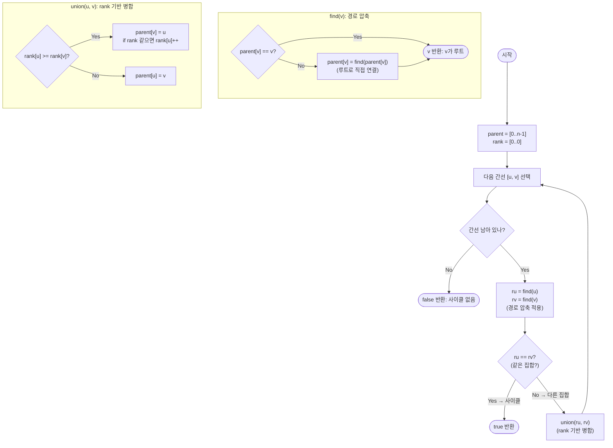

import { AlgorithmSimulation } from "#guide-sim";

# undirectedCycleDetection — 이미 연결된 두 정점을 잇는 간선이 곧 사이클입니다

## 한눈에 보는 컨셉

무향 그래프에 사이클이 있는지는, 간선을 하나씩 무대에 올리면서 "이 두 정점, 이미 같은 무리에 속해 있나요?"라고 딱 한 번씩만 물어보면 알 수 있어요. 아직 다른 무리라면 합치고 지나가고, 이미 같은 무리라면 그 간선이 곧 사이클입니다. Union-Find(Disjoint Set)는 이 "같은 무리인가?" 질문에 경로 압축과 랭크 합치기를 더해 사실상 상수 시간으로 답하므로, 간선 `E`개를 한 번씩만 훑는 `O(V + E)`에 사이클 존재 여부가 결정됩니다.

## 출발점: 가장 순진한 방법부터

문제를 먼저 정확히 잡을게요.

```ts
function undirectedCycleDetection(n: number, edges: [number, number][]): boolean
```

| 파라미터 | 의미 | 제약 |
|----------|------|------|
| `n` | 정점 수, 번호는 $0 \ldots n-1$ | $1 \leq n \leq 10^{5}$ |
| `edges` | 무향 간선 목록. 각 원소 `[u, v]`는 정점 `u`와 `v` 사이의 무향 간선 | $0 \leq E \leq 10^{5}$ |
| 반환 | 사이클이 존재하면 `true`, 없으면 `false` | — |

추가 규칙도 짚어 둘게요. 자기 루프 `[v, v]`도 사이클로 간주하고, 같은 정점 쌍을 잇는 간선이 두 번 이상 나와도(다중 간선) 사이클로 간주합니다. 그래프가 여러 성분으로 나뉘어 있으면 그중 하나에라도 사이클이 있으면 `true`입니다.

사이클의 정의를 그대로 따라가 볼까요? 사이클은 서로 다른 정점들로 이루어진 닫힌 경로이니, 가장 정직한 확인법은 "닫힌 경로가 하나라도 있는지 모든 경로를 나열해서" 확인하는 것입니다. 정점 4개짜리 작은 그래프로 직접 나열해 봅시다.

```text
정점 {0,1,2,3}의 배치 순서(닫힌 경로 후보) 일부:
0-1-2-3-0   0-1-3-2-0   0-2-1-3-0   0-2-3-1-0   0-3-1-2-0   0-3-2-1-0
→ 4개 정점만으로도 순서 후보가 4! = 24가지

n이 조금만 커져도:
n=10  → 10! = 3,628,800
n=15  → 15! = 1,307,674,368,000
n=10^5 → 사실상 계산 불가능한 크기
```

$O(V!)$은 명백히 손을 댈 수 없는 크기입니다. 그렇다면 "닫힌 경로를 전부 나열"하는 대신 "각 정점에서 출발해 이미 밟은 정점을 다시 밟는지"만 보면 충분하다는 낌새를 잡을 수 있어요 — 이게 DFS 기반 접근입니다.

```ts
function undirectedCycleDetectionDFS(n: number, edges: [number, number][]): boolean {
  const adj: number[][] = Array.from({ length: n }, () => []);
  for (const [u, v] of edges) {
    adj[u].push(v);
    adj[v].push(u);
  }
  const visited = new Array<boolean>(n).fill(false);

  function dfs(v: number, parent: number): boolean {
    visited[v] = true;
    for (const next of adj[v]) {
      if (!visited[next]) {
        if (dfs(next, v)) return true; // 아직 안 밟은 정점이면 더 들어간다
      } else if (next !== parent) {
        return true; // 부모가 아닌데 이미 밟은 정점 = 사이클
      }
    }
    return false;
  }

  for (let v = 0; v < n; v++) {
    if (!visited[v]) {
      if (dfs(v, -1)) return true;
    }
  }
  return false;
}
```

이 방법은 각 정점·간선을 한 번씩만 보므로 시간은 이미 `O(V + E)`로 최선입니다. 문제는 시간이 아니라 "부담"이에요.

```text
비용 항목                필요한 이유                          크기
인접 리스트 adj[]        각 정점에서 이웃을 찾으려면 필요       O(V + E) 공간
dfs() 재귀 호출 스택      정점을 타고 내려가는 만큼 쌓임         최악 O(V) 깊이

정점이 일렬로 늘어선 그래프(0-1-2-...-99999)라면
dfs(0)가 dfs(1)을 부르고, dfs(1)이 dfs(2)를 부르고 ... 총 10^5단 재귀
대부분의 JS/TS 런타임은 이 정도 재귀 깊이에서 스택 오버플로우 위험을 안는다
```

인접 리스트도 만들지 않고, 재귀도 쓰지 않으면서 "이미 같은 무리에 속해 있나?"만 빠르게 답할 수 있다면 훨씬 단순해지지 않을까요? 이 질문이 다음 절의 출발점입니다.

## 아이디어 자세히 들여다보기

### 간선을 무대에 올릴 때마다 "같은 무리인가?"를 묻기 — 수식과 그림

핵심 관찰은 이겁니다. 사이클이 없는 무향 그래프(포레스트)에서 새 간선 $(u, v)$를 추가할 때, $u$와 $v$가 **이미 같은 연결 성분**에 있다면 그 간선은 여분이고, 여분 간선은 곧 사이클을 만듭니다. 다른 성분에 있다면 두 성분이 합쳐질 뿐 사이클은 생기지 않아요.

이걸 다루기 위한 상태는 "정점들의 분할(partition)"입니다. 어느 시점이든 정점 집합 $\{0, \ldots, n-1\}$은 서로소 부분집합 $S_1, S_2, \ldots$로 나뉘어 있고, 같은 부분집합에 있으면 "연결되어 있다"는 뜻입니다. 각 부분집합은 대표 원소(루트) 하나로 식별합니다.

$$\text{find}(v) = S_i \text{의 루트}, \quad \text{단 } v \in S_i$$

$$\text{find}(u) = \text{find}(v) \iff u \text{와 } v \text{는 같은 연결 성분}$$

작은 예로 직접 확인해 봅시다. `n = 5`, 간선을 `(0,1) → (1,2) → (2,0) → (3,4)` 순서로 하나씩 올립니다.

```text
초기: {0} {1} {2} {3} {4}         5개의 독립된 무리

(0,1) 처리: find(0) ≠ find(1) → 합침
            {0,1} {2} {3} {4}

(1,2) 처리: find(1) ≠ find(2) → 합침
            {0,1,2} {3} {4}

(2,0) 처리: find(2) = find(0)  → 이미 같은 무리! 이 간선이 사이클
            {0,1,2} {3} {4}    (판정: 사이클 발견, 여기서 true 반환)
```

잠깐, 확인 하나만 해 볼까요? `(2,0)`을 처리하기 **직전**, 정점 0과 2는 같은 무리였을까요? — 네, 맞습니다. 바로 앞 단계 `(1,2)`에서 `{0,1}`과 `{2}`가 합쳐져 `{0,1,2}`가 됐으니, 0과 2는 이미 한 무리예요. 그래서 `(2,0)` 간선은 "이미 연결된 두 점을 다시 잇는" 여분 간선이고, 이것이 곧 사이클입니다.

왜 하필 "분할(집합)"로 표현할까요? 대안은 매 간선마다 BFS/DFS로 두 정점의 연결 여부를 처음부터 다시 확인하는 것입니다. 하지만 이건 간선 하나 확인에 $O(V+E)$가 들고, 그걸 $E$번 반복하면 $O(E(V+E))$로 폭발해요. 분할을 **누적해서 유지**하면 직전까지의 계산을 버리지 않고 재사용할 수 있습니다 — 이게 Union-Find가 필요한 이유입니다.

### 단서를 설명해 주는 이론 — 스패닝 포레스트와 여분 간선

방금 본 "이미 같은 무리면 사이클"이라는 판정은 그래프 이론의 표준 사실에서 곧바로 나옵니다.

$V$개의 정점과 $c$개의 연결 성분으로 이루어진 무향 그래프가 **사이클이 없다(포레스트)**면, 정확히 다음이 성립합니다.

$$|E_{\text{forest}}| = V - c$$

각 성분은 트리이고, 트리는 정점 수보다 정확히 1개 적은 간선을 가지니까요($c$개 트리를 합치면 $V - c$). 이 등식이 의미하는 바는 이렇습니다 — **간선이 $V - c$개를 넘어서는 순간, 그 그래프는 더 이상 포레스트가 아니다.** 즉 사이클이 생겼다는 뜻이에요.

이제 간선을 하나씩 추가하는 과정으로 바꿔서 봅시다. 간선 $(u, v)$를 추가하기 직전 성분 수가 $c$라고 하면:

- $u, v$가 다른 성분에 있으면 → 추가 후 성분 수가 $c - 1$로 줄고 간선 수는 정확히 $V - (c-1)$을 유지 → 여전히 포레스트.
- $u, v$가 같은 성분에 있으면 → 성분 수는 그대로 $c$인데 간선 수만 $V-c+1$로 늘어남 → 포레스트의 등식이 깨짐 → **사이클**.

이것이 바로 Union-Find의 판정 규칙의 근거입니다: `find(u) == find(v)`는 "$u$와 $v$가 이미 같은 성분"을 뜻하고, 그 상태에서 간선 $(u,v)$를 더하는 것이 정확히 "포레스트의 등식을 깨는 여분 간선"에 해당합니다. 이 성질은 뒤에서 정당성을 증명할 때 다시 소환할 테니 기억해 두세요. (참고로 이 성질은 Kruskal 최소 신장 트리 알고리즘에서 "사이클을 만들 간선은 버린다"는 규칙의 근거이기도 합니다.)

### 셈을 맡는 자료구조 — Union-Find(Disjoint Set)

이 문제에서 Union-Find가 맡는 역할은 딱 하나, "두 정점이 같은 성분에 있는가?"를 빠르게 답하고, 아니라면 두 성분을 합치는 것입니다. 인접 리스트 없이 간선 목록만 순서대로 훑으면 되므로 공간도 `parent`(와 최적화 단계에서 쓸 `rank`) 배열 $O(V)$면 충분해요.

이 자료구조 내부의 경로 압축·랭크 합치기 메커니즘 자체가 궁금하다면 이 프로젝트의 [Union-Find 가이드](../../../data-structures/disjoint-set/unionFind/unionFind-guide.mdx)를 참고하세요. 이 문서에서는 "사이클 판정에 쓰는 도구"로만 사용하고, 뒤 "더 빠르게 만들 단서" 절에서 이 문제의 맥락에 맞춰 최적화를 직접 다시 따라가 볼게요.

### 왜 모순 없이 작동하는가

이 알고리즘이 지키는 불변식은 하나입니다.

> 간선을 $k$개 처리한 시점에, `find(x) = find(y)`인 것과 $x, y$가 지금까지 처리한 간선들만으로 연결되어 있는 것은 동치이다.

**기저($k=0$)**: 아직 아무 간선도 처리하지 않았으면 모든 정점이 독립이고, `parent[v] = v`로 각자가 자기 자신의 루트입니다. 어떤 두 정점도 연결되어 있지 않으므로 불변식은 자명하게 성립합니다.

**귀납 단계**: $k-1$개 간선까지 불변식이 성립한다고 가정하고, $k$번째 간선 $(u, v)$를 처리합니다. 이 시점에 가능한 경우는 정확히 둘뿐입니다(find가 항상 하나의 루트를 반환하므로 "같다/다르다" 외의 제3의 경우는 없습니다).

- **`find(u) ≠ find(v)`인 경우**: 귀납 가정에 의해 $u, v$는 지금까지 연결돼 있지 않았습니다. `union(ru, rv)`로 두 트리를 합치면, 두 정점은 이제 이 새 간선 하나를 통해서만 연결됩니다 — 다른 경로가 없었으니 사이클이 생기지 않고, 앞 절의 스패닝 포레스트 등식도 그대로 유지됩니다. `false` 없이 다음 간선으로 넘어가는 것이 맞습니다.
- **`find(u) = find(v)`인 경우**: 귀납 가정에 의해 $u, v$ 사이에는 이미 트리 안의 경로가 있습니다. 여기에 간선 $(u, v)$를 더하면, "트리 경로 + 이 간선"이 정확히 닫힌 경로 하나를 만듭니다. 앞 절의 등식이 깨지는 순간과 정확히 일치하므로 `true` 반환이 맞습니다.

두 경우 모두 불변식을 유지한 채(또는 사이클을 정확히 찾아낸 채) 다음 간선으로 넘어가므로, 모든 간선을 처리하고도 `true`가 나오지 않았다면 최종 그래프는 포레스트, 즉 `false`가 맞습니다.

여기서 **헷갈리기 쉬운 포인트**가 두 가지 있습니다.

첫째, 문제 정의는 "사이클은 3개 이상의 서로 다른 정점으로 이루어진 닫힌 경로"라고 말하면서도 자기 루프와 다중 간선을 별도 규칙으로 사이클 취급합니다. 얼핏 코드에 특별 처리가 필요해 보이지만, 실은 필요 없습니다.

```text
자기 루프 (v, v):  find(v) == find(v) → 항상 참 → 별도 분기 없이 즉시 true

다중 간선 (u,v) 두 번:
  1번째 (u,v): find(u) ≠ find(v) → union 실행, 사이클 아님
  2번째 (u,v): find(u) = find(v) (방금 합쳤으니까) → true

→ "같은 집합인가"라는 하나의 질문이 두 특수 규칙을 공짜로 흡수한다
```

둘째, 이 판정은 **무향** 그래프에서만 옳습니다. 유향 그래프에 그대로 적용하면 방향 정보가 사라져 실제로는 사이클이 없는데 있다고 오판할 수 있어요. 실제로 확인해 봅시다. 유향 간선 `0→1, 0→2, 1→3, 2→3`(마름모 모양 DAG, 유향 사이클 없음)을 방향을 무시하고 무향 union-find에 그대로 넣으면:

```text
(0,1): find(0)≠find(1) → union, {0,1}
(0,2): find(0)≠find(2) → union, {0,1,2}
(1,3): find(1)≠find(3) → union, {0,1,2,3}
(2,3): find(2)=find(3) → true! (실제로는 유향 사이클이 없는데 오판)
```

이 반례에서 보듯, 방향이 있는 그래프에는 Union-Find가 아니라 DFS 3색(흰색/회색/검은색) 탐색을 써야 합니다 — "회색(현재 탐색 스택 위)" 정점을 다시 만나야 진짜 유향 사이클입니다.

엣지 케이스를 텍스트로 점검해 두면:

```text
n=1, 간선 없음        → 루프가 돌지 않음 → false
간선 없음 (n=5)        → 루프가 돌지 않음 → false
자기 루프 [0,0]        → find(0)==find(0) → true
중복 간선 [0,1],[0,1]  → 두 번째에서 true
삼각형 0-1-2-0        → 세 번째 간선에서 true
선형 트리 0-1-2-3      → 끝까지 서로 다른 무리 → false
```

## 아이디어를 코드로 옮기기

앞 절의 규칙을 그대로 옮긴 기본 구현입니다.

```ts
function undirectedCycleDetectionBasic(n: number, edges: [number, number][]): boolean {
  const parent = Array.from({ length: n }, (_, i) => i);

  function find(v: number): number {
    while (parent[v] !== v) v = parent[v]; // 루트까지 부모 체인을 그대로 따라간다 (압축 없음)
    return v;
  }

  function union(u: number, v: number): void {
    parent[u] = v; // u의 루트를 v의 루트 아래에 그냥 붙인다 (랭크 무시)
  }

  for (const [u, v] of edges) {
    const ru = find(u);
    const rv = find(v);
    if (ru === rv) return true;
    union(ru, rv);
  }
  return false;
}
```

**가장 중요한 줄은 `if (ru === rv) return true;`입니다.** 이 한 줄이 알고리즘 전체의 판정 기준이에요 — 나머지 코드는 전부 이 질문에 빠르게 답하기 위한 준비 작업입니다. 그 외에 짚어 둘 결정 지점:

- `parent`의 초기값은 `i` 자기 자신입니다 — 모든 정점이 독립된 무리로 시작한다는 뜻이고, 여기서 시작해야 기저 사례(간선 0개 → 사이클 없음)가 성립합니다.
- `union(u, v): parent[u] = v`는 항상 "먼저 찾은 루트(u)를 나중 루트(v) 아래" 방향으로 붙입니다. 방향이 정해져 있지 않고 트리 크기·높이를 전혀 고려하지 않는다는 점이 다음 절의 관찰 대상입니다.

## 더 빠르게 만들 단서 찾기

`union`이 트리 높이를 신경 쓰지 않는다는 점을 실제로 관찰해 봅시다. `n = 6`인 그래프에 간선을 `(0,1) → (1,2) → (2,3) → (3,4) → (4,5)` 순서로, 즉 일렬로 늘어선 경로 그래프로 넣어 봅니다.

```text
edge (0,1) -> parent = [1,1,2,3,4,5]
edge (1,2) -> parent = [1,2,2,3,4,5]
edge (2,3) -> parent = [1,2,3,3,4,5]
edge (3,4) -> parent = [1,2,3,4,4,5]
edge (4,5) -> parent = [1,2,3,4,5,5]

체인 모양:  0 → 1 → 2 → 3 → 4 → 5(루트)
find(0) 홉 수 = 5  (n=6일 때 n-1)
```

`union(u,v): parent[u] = v`가 항상 "방금 찾은 루트를 다음 루트 아래"로 붙이다 보니, 경로 그래프처럼 아주 자연스러운 입력에서도 트리가 **길이 $n-1$짜리 사슬**이 되어버립니다. 이러면 `find(0)` 하나에 $n-1$번의 점프가 필요해요. 정점이 $10^5$개인 사슬이라면 `find` 한 번이 최악 $O(V)$이고, 이런 `find`가 간선마다 두 번씩 불리니 전체가 $O(V \cdot E)$까지 치솟을 수 있습니다 — 애초에 목표했던 $O(V+E)$와는 거리가 먼 수치예요.

## 단서를 최적화로 연결하기

사슬이 문제라면, 두 가지 습관을 들이면 됩니다.

**경로 압축(path compression)**: `find`가 루트를 찾는 김에, 지나온 정점들을 전부 루트에 직접 연결해 버립니다.

$$\text{find}(v) = \begin{cases} v & \text{if } \text{parent}[v] = v \\ \text{find}(\text{parent}[v]), \; \text{동시에 } \text{parent}[v] \leftarrow \text{루트} & \text{otherwise} \end{cases}$$

```text
Before:  0 → 1 → 2 → 3 → 4 → 5(루트)         find(0) 호출 → 5홉

After find(0) 호출 (압축 적용):
         0 → 5,  1 → 5,  2 → 5,  3 → 5,  4 → 5(루트)   이후 find(0)은 1홉
```

**랭크 합치기(union by rank)**: 낮은 트리를 높은 트리 아래 붙여서,애초에 사슬이 만들어지지 않게 합니다.

$$\text{union}(r_u, r_v): \begin{cases}
\text{parent}[r_v] \leftarrow r_u & \text{if } \text{rank}[r_u] > \text{rank}[r_v] \\
\text{parent}[r_u] \leftarrow r_v & \text{if } \text{rank}[r_u] < \text{rank}[r_v] \\
\text{parent}[r_v] \leftarrow r_u,\; \text{rank}[r_u]\mathrel{+}=1 & \text{if } \text{rank}[r_u] = \text{rank}[r_v]
\end{cases}$$

이 규칙을 지키면 트리 높이가 항상 $O(\log V)$ 이하로 유지된다는 사실이 알려져 있습니다(작은 트리를 큰 트리 아래 붙이므로, 높이가 늘려면 두 트리의 높이가 같아야만 하고 그 경우에도 딱 1만 늘어요). 여기에 경로 압축까지 더하면, $E$번의 연산 전체 비용이 역아커만 함수 $\alpha(V)$를 써서 $O(E \cdot \alpha(V))$로 떨어집니다. $\alpha(V)$는 $V$가 우주의 원자 수를 넘어도 5를 넘지 않을 만큼 극도로 느리게 자라므로, 실전에서는 사실상 $O(1)$로 취급합니다.

> 기억법: "찾을 땐 평평하게(compression), 합칠 땐 작은 쪽이 밑으로(rank)."

## 최적화 코드

바뀌는 곳은 `find`와 `union` 두 함수뿐이고, 판정 로직(`if (ru === rv) return true;`)은 그대로입니다.

```ts
function undirectedCycleDetectionFinal(n: number, edges: [number, number][]): boolean {
  const parent = Array.from({ length: n }, (_, i) => i);
  const rank = new Array<number>(n).fill(0);

  function find(v: number): number {
    if (parent[v] !== v) {
      parent[v] = find(parent[v]); // 경로 압축: 재귀 반환값을 부모에 그대로 저장
    }
    return parent[v];
  }

  function union(u: number, v: number): void {
    if (rank[u] < rank[v]) [u, v] = [v, u]; // 항상 랭크 높은 쪽을 u로
    parent[v] = u;                          // 낮은 랭크 트리를 높은 랭크 트리 아래로
    if (rank[u] === rank[v]) rank[u]++;     // 높이가 같을 때만 랭크 증가
  }

  for (const [u, v] of edges) {
    const ru = find(u);
    const rv = find(v);
    if (ru === rv) return true;
    union(ru, rv);
  }
  return false;
}
```

**가장 중요한 줄은 `parent[v] = find(parent[v]);`입니다.** 재귀가 루트까지 다 다녀온 뒤 그 반환값(루트)을 현재 정점의 부모에 바로 써넣기 때문에, 한 번 `find`가 지나간 경로는 다음부터 한 방에 루트로 연결됩니다. 이 대입을 빼먹으면(그냥 `find(parent[v])`만 호출하고 저장하지 않으면) 결과값은 여전히 맞지만 압축 효과가 사라져 앞 절의 사슬 문제가 되살아납니다 — **정답은 맞는데 조용히 느려지는** 전형적인 함정이에요.

값(정답) 자체가 틀리는 함정도 있습니다. `if (ru === rv) return true;`를 `if (ru !== rv) return true;`로 조건을 뒤집으면 어떻게 될까요? 선형 트리 `edges = [[0,1],[1,2],[2,3]]`(정답 `false`)을 넣어 보면, 첫 간선 `(0,1)`부터 `find(0)=0`, `find(1)=1`로 다르니 뒤집힌 조건은 그 자리에서 바로 `true`를 반환해 버립니다 — 사이클이 전혀 없는 그래프를 첫 간선만 보고 사이클이 있다고 오답을 냅니다.

이제 목표를 되짚어 볼까요? 랭크 합치기로 트리 높이를 $O(\log V)$ 이하로 묶고, 경로 압축으로 반복 조회를 평탄화했으니, $E$번의 간선 처리 전체가 $O(E \cdot \alpha(V)) \approx O(E)$이고, 초기화까지 합치면 $O(V + E)$ — 애초에 세운 목표를 정확히 달성했습니다.

더 최적화할 여지가 있을까요? 사이클 여부를 결정하려면 최소한 모든 간선을 한 번씩은 들여다봐야 합니다(들여다보지 않은 간선에 사이클이 숨어 있을 수 있으니까요). 즉 $\Omega(E)$는 이 문제의 하한이고, 우리는 이미 그 하한에 거의 맞닿은 $O(V+E)$(더 정확히는 $O((V+E)\cdot\alpha(V))$)에 도달했습니다. 유향 그래프라면 DFS 3색 탐색이 필요하지만, 이건 "더 빠른 해법"이 아니라 **다른 문제**를 위한 다른 도구입니다.

## 실행 시각화

고정 입력은 `n = 5`, `edges = [[0,1], [1,2], [2,0], [3,4]]`이고, 앞 절 최적화 코드로 처리한 결과입니다. 빨간색(`active`)은 현재 처리 중인 간선의 두 끝점, 회색(`visited`)은 이미 어떤 집합에 합쳐진 정점이에요. 노드 위 숫자는 `parent[v]`(현재 가리키는 부모)이고, `keyValue` 패널에는 `parent` 배열과 `find` 결과, 사이클 판정이 함께 나옵니다. 실제 반환값은 `true`이며(간선 `(2,0)`에서 사이클 형성), 아래 시뮬레이션의 마지막 프레임과 일치합니다.

> 대화형 시뮬레이션은 MDX 런타임에서 표시됩니다.

export const nodes = [
  { id: 0, label: "0", x: 25, y: 25 },
  { id: 1, label: "1", x: 65, y: 25 },
  { id: 2, label: "2", x: 45, y: 55 },
  { id: 3, label: "3", x: 82, y: 62 },
  { id: 4, label: "4", x: 82, y: 90 },
];

export const edges = [
  { from: 0, to: 1, directed: false },
  { from: 1, to: 2, directed: false },
  { from: 2, to: 0, directed: false },
  { from: 3, to: 4, directed: false },
];

export const steps = [
  {
    title: "초기화",
    detail: "parent[v] = v. 모든 정점이 자기 자신이 루트인 독립 집합.",
    nodes, edges,
    nodeStatus: {},
    nodeValue: { 0: 0, 1: 1, 2: 2, 3: 3, 4: 4 },
    entries: [
      { label: "parent", value: "[0, 1, 2, 3, 4]" },
      { label: "처리할 간선", value: "(0,1) (1,2) (2,0) (3,4)" },
    ],
  },
  {
    title: "간선 (0,1)",
    detail: "find(0)=0, find(1)=1 → 다른 집합. union → parent[1]=0.",
    nodes, edges,
    nodeStatus: { 0: "active", 1: "active" },
    nodeValue: { 0: 0, 1: 0, 2: 2, 3: 3, 4: 4 },
    activeEdge: { from: 0, to: 1 },
    entries: [
      { label: "find(0), find(1)", value: "0, 1 (다름)" },
      { label: "판정", value: "union → 사이클 아님" },
      { label: "parent", value: "[0, 0, 2, 3, 4]" },
    ],
  },
  {
    title: "간선 (1,2)",
    detail: "find(1)=0, find(2)=2 → 다른 집합. union → parent[2]=0.",
    nodes, edges,
    nodeStatus: { 0: "visited", 1: "active", 2: "active" },
    nodeValue: { 0: 0, 1: 0, 2: 0, 3: 3, 4: 4 },
    activeEdge: { from: 1, to: 2 },
    entries: [
      { label: "find(1), find(2)", value: "0, 2 (다름)" },
      { label: "판정", value: "union → 사이클 아님" },
      { label: "parent", value: "[0, 0, 0, 3, 4]" },
    ],
  },
  {
    title: "간선 (2,0): 사이클!",
    detail: "find(2)=0, find(0)=0 → 같은 집합. 이 간선은 사이클을 형성. true 반환.",
    nodes, edges,
    nodeStatus: { 0: "active", 1: "visited", 2: "active" },
    nodeValue: { 0: 0, 1: 0, 2: 0, 3: 3, 4: 4 },
    activeEdge: { from: 2, to: 0 },
    entries: [
      { label: "find(2), find(0)", value: "0, 0 (같음!)" },
      { label: "판정", value: "사이클 → true" },
      { label: "parent", value: "[0, 0, 0, 3, 4]" },
    ],
  },
  {
    title: "결과: true",
    detail: "같은 집합의 두 정점을 잇는 간선이 발견되어 사이클이 존재한다. (간선 (3,4)는 도달 전 종료)",
    nodes, edges,
    nodeStatus: { 0: "visited", 1: "visited", 2: "visited" },
    nodeValue: { 0: 0, 1: 0, 2: 0, 3: 3, 4: 4 },
    entries: [
      { label: "반환값", value: "true" },
      { label: "사이클 간선", value: "(2, 0)" },
    ],
  },
];

<AlgorithmSimulation view={["graph", "keyValue"]} steps={steps} title="무향 사이클 탐지 (Union-Find)" />

## 흐름 한눈에 보기



## 스스로 점검하기

1. `n = 4`, `edges = [[0,1], [2,3], [1,2], [0,3]]`을 손으로 따라가며 각 간선 처리 후 `parent` 배열을 적어 보세요. 어느 간선에서 처음으로 사이클이 검출될까요? (정답: `(0,1)` 후 `[0,0,2,3]`, `(2,3)` 후 `[0,0,2,2]`, `(1,2)` 후 `[0,0,0,2]`, 마지막 `(0,3)`에서 `find(0)=0, find(3)=0`으로 같아져 `true`를 반환합니다.)
2. `if (ru === rv) return true;`를 `if (ru !== rv) return true;`로 바꾸면 `edges = [[0,1],[1,2],[2,3]]`(사이클이 없는 선형 트리)에서 정확히 몇 번째 간선을 처리할 때, 왜 잘못된 `true`가 나오는지 짚어 보세요.
3. 만약 입력 그래프가 유향 그래프이고 방향 정보를 무시할 수 없다면, 이 코드의 어떤 부분을 무엇으로 바꿔야 할까요? "왜 모순 없이 작동하는가"의 DAG 다이아몬드 반례를 참고해, 대안이 되는 탐색 방식의 이름과 핵심 아이디어를 한 문장으로 적어 보세요.
