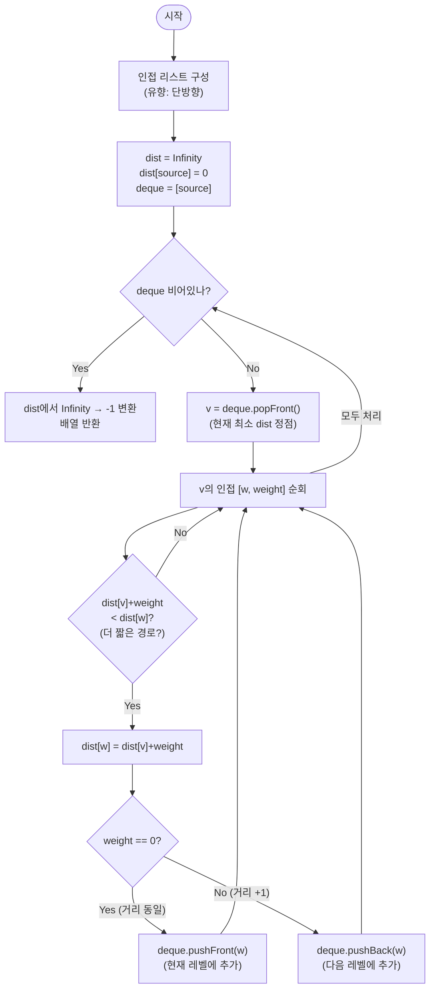

import { AlgorithmSimulation } from "#guide-sim";

# 0-1 BFS — 가중치 두 종류만 있으면 힙이 필요 없는 이유

## 한눈에 보는 컨셉

간선 가중치가 정확히 $0$ 또는 $1$뿐인 그래프에서 출발점부터 모든 정점까지의 최단 거리를 구하는 문제예요. 가중치가 두 종류뿐이라는 제약 덕분에, 정렬을 도맡는 힙(우선순위 큐) 없이도 양방향 큐(deque) 하나로 Dijkstra와 똑같은 정확성을 얻을 수 있습니다. 가중치 $0$ 이웃은 덱 앞에, 가중치 $1$ 이웃은 덱 뒤에 넣는 것만으로 `O(V + E)`에 끝나요.

## 출발점: 가장 순진한 방법부터

먼저 무엇을 계산해야 하는지 정확히 잡을게요.

```ts
function zeroOneBfs(n: number, edges: [number, number, number][], source: number): number[]
```

| 파라미터 | 의미 | 제약 |
|----------|------|------|
| `n` | 정점 수 (번호는 $0 \ldots n-1$) | $1 \leq n \leq 10^5$ |
| `edges` | 유향 간선 `[u, v, w]` | $0 \leq E \leq 10^5$, $w \in \{0, 1\}$ |
| `source` | 출발 정점 | $0 \leq \text{source} < n$ |
| 반환 | 길이 `n` 배열. `dist[i]` = `source`에서 `i`까지 최소 가중치 합 | 도달 불가 시 `-1`, `dist[source] = 0` |

"최단 거리를 구하라"는 문제를 보면 가장 정직한 접근은 **모든 경로를 다 세어 보고 그중 최솟값을 고르는 것**입니다.

```
function dist(s, v):
  best = Infinity
  for path in all_paths(s, v):
    best = min(best, sum(weights(path)))
  return best
```

작은 예로 이게 왜 안 되는지 체감해 볼게요. 정점이 두 갈래로 갈라졌다가 다시 합쳐지는 구조가 $L$겹 반복된다고 합시다.

```text
층마다 2갈래 분기:  (s) => (·)(·) => (·)(·)(·)(·) => ...  => (t)

층 수 L=1  경로 수 2
층 수 L=5  경로 수 2^5  =    32
층 수 L=10 경로 수 2^10 = 1,024
층 수 L=20 경로 수 2^20 ≈ 1,048,576

정점 수는 층마다 2개씩만 늘어나는데(V ≈ 2L), 경로 수는 지수적으로 폭발한다
```

$V \leq 10^5$이면 이런 구조에서 경로 수가 순식간에 우주적인 크기가 됩니다. 전부 나열하는 방법은 애초에 후보가 되지 못해요.

그럼 "지금까지 발견한 최소 거리부터 넓혀 나가자"는 Dijkstra는 어떨까요? 이건 실제로 정확합니다 — 힙에서 최솟값을 하나씩 꺼내 확정하는 방식이라, 가중치가 음수만 아니면 항상 옳은 답을 냅니다. 다만 힙의 push/pop이 $O(\log V)$라서 전체는 $O((V+E)\log V)$예요. $V = E = 10^5$이면 $V + E = 2 \times 10^5$, $\log_2 10^5 \approx 16.6$이니 대략 $2 \times 10^5 \times 16.6 \approx 3.3 \times 10^6$번의 힙 연산이 발생합니다. 시간 제한 1초에는 통과하겠지만, 목표로 삼을 `O(V + E)` (약 $2 \times 10^5$)보다 **약 17배**나 많은 일을 하는 셈이에요.

**공간**은 인접 리스트 `O(V + E)`, `dist` 배열 `O(V)`, 큐(또는 힙) `O(V)`가 필요합니다.

여기서 낌새를 하나 챙겨 갈게요. 가중치가 $0$ 아니면 $1$, 딱 두 종류뿐이라는 사실은 아직 안 썼습니다. **정렬이 필요한 이유는 가중치가 다양해서**인데, 두 종류뿐이라면 굳이 힙으로 전체를 정렬할 필요가 있을까요? 이 질문이 다음 절의 출발점입니다.

## 아이디어 자세히 들여다보기

### 가중치 0/1이 만드는 두 겹의 레벨 — 수식과 그림

일반 BFS(가중치가 전부 $1$인 경우)를 먼저 떠올려 봅시다. 큐에서 정점을 하나 꺼낼 때, 그 정점의 `dist` 값은 큐 안의 다른 어떤 정점의 `dist` 값보다도 작거나 같습니다 — 큐가 딱 두 레벨($d$와 $d+1$)만 담고 있고, FIFO 순서가 그 레벨 순서와 일치하기 때문이에요.

이제 가중치가 $0$과 $1$ 두 종류로 늘어나면 무슨 일이 생길까요? 가중치 $0$ 간선을 타면 거리가 그대로($d \to d$)이고, 가중치 $1$ 간선을 타면 거리가 하나 늘어납니다($d \to d+1$). **큐가 아니라 "양쪽 다 넣고 뺄 수 있는" 덱을 쓰면, 가중치 $0$ 이웃은 앞에, 가중치 $1$ 이웃은 뒤에 넣어서 같은 두-레벨 구조를 유지할 수 있습니다.**

정식으로 상태를 정의하면 이렇습니다.

$$\text{dist}[v] = \min_{\,p:\, s \to v} \sum_{e \in p} w(e), \qquad \text{dist}[s] = 0$$

그리고 덱이 항상 지키는 불변식은 다음과 같아요.

$$\text{덱 안의 모든 원소는 } \text{dist} \text{ 값이 } d \text{ 또는 } d+1 \text{이고,}$$
$$\text{앞쪽 구간의 dist는 전부 } d,\ \text{뒤쪽 구간의 dist는 전부 } d+1$$

**왜 "값 하나짜리 큐"가 아니라 "값 두 개짜리 덱"으로 정의해야 할까요?** 일반 BFS의 큐는 레벨이 하나($d$)만 진행 중이면 충분했지만, 가중치 $0$ 간선이 있으면 같은 레벨 $d$ 안에서 새 정점이 계속 발견될 수 있습니다. 이걸 뒤에 쌓아 버리면(보통 큐처럼) $d$ 레벨 처리가 끝나기도 전에 $d+1$ 레벨 원소가 먼저 나오는 순서 오류가 생겨요. 그래서 "새로 발견된 같은 레벨" 원소를 **앞에 끼워 넣을 자리**가 필요하고, 이게 덱이 필요한 이유입니다.

작은 예로 확인해 볼게요. `n = 5`, 간선이 `0→1(w1)`, `0→2(w0)`, `2→1(w0)`, `2→3(w1)`, `1→3(w1)`, `3→4(w0)`이고 `source = 0`인 그래프에서, 정점 `0`을 막 처리한 직후의 상태는 이렇습니다.

```text
처리 전:  dist = [0, ∞, ∞, ∞, ∞]   deque = [0]

0을 pop:
  0→1 (w1): dist[1] = 0+1 = 1  →  뒤에 삽입 (pushBack)
  0→2 (w0): dist[2] = 0+0 = 0  →  앞에 삽입 (pushFront)

처리 후:  dist = [0, 1, 0, ∞, ∞]   deque = [2, 1]   (front → back)
```

`deque`의 앞(`2`)은 `dist = 0`, 뒤(`1`)는 `dist = 1`이니 불변식 그대로예요. 확인 질문 하나만 해 볼까요? 이 상태에서 덱 뒤에 있는 정점 `1`의 `dist`가, 앞에 있는 정점 `2`의 `dist`보다 작아질 수 있을까요? — 아니요. 불변식이 "앞쪽 $\leq$ 뒤쪽"을 보장하므로, `popFront()`가 항상 현재 최소 `dist`를 꺼낸다는 사실이 이 시점에도 깨지지 않습니다.

### 단서를 설명해 주는 이론 — BFS 레벨 불변식의 일반화

방금 쓴 "덱이 두 레벨만 담는다"는 관찰은 사실 일반 BFS의 핵심 불변식을 그대로 확장한 것입니다. 이론을 조금 더 자세히 볼게요.

무가중치 BFS에서 큐는 항상 **연속된 두 레벨**만 담습니다: 레벨 $d$ 정점을 모두 처리하는 동안, 새로 발견되는 이웃은 전부 레벨 $d+1$이라서 큐 뒤에 쌓여요. 레벨 $d$가 큐에서 다 빠져나가면 자연스럽게 레벨 $d+1$ 차례가 됩니다. FIFO(선입선출) 성질이 "레벨이 먼저 끝난 순서대로 처리된다"는 것을 공짜로 보장해 주는 거예요.

가중치가 $\{0, 1\}$인 그래프에서는 레벨이 "정수 인덱스"가 아니라 "현재까지 발견된 dist 값"으로 이름만 바뀌었을 뿐, 구조는 동일합니다. 다만 가중치 $0$ 간선을 타면 레벨이 그대로 유지된 채(즉 **현재 레벨에 새 멤버가 추가**), 가중치 $1$ 간선을 타면 레벨이 하나 올라갑니다(**다음 레벨에 추가**). 일반 큐는 "뒤에만 추가"할 수 있어서 이 두 가지 경우를 구분하지 못하지만, 덱은 "앞/뒤 어느 쪽에도 추가"할 수 있으므로 같은 레벨 불변식을 그대로 유지할 수 있어요.

이 불변식은 잠시 후 정당성을 증명할 때, 그리고 뒤에서 "더 빠르게 만들 단서"를 찾을 때 다시 쓸 테니 기억해 두세요 — **"덱은 항상 최대 두 종류의 dist 값만 담는다"**가 이 알고리즘 전체를 떠받치는 한 문장입니다.

### 셈을 맡는 자료구조 — 양방향 큐(Deque)

방금 본 불변식을 실제로 유지하려면 앞/뒤 양쪽에서 삽입·삭제가 되는 자료구조가 필요합니다. 배열 하나로 이걸 흉내 내면(`Array.prototype.unshift`/`shift`) 앞쪽 연산이 매번 나머지 원소를 통째로 한 칸씩 밀어야 해서 비용이 커집니다 — 이 문제와 그 해결책(배열 두 개를 반대 방향으로 쌓는 트릭)은 이 프로젝트의 [deque 가이드](../../../data-structures/linear/deque/deque-guide.mdx)에서 자세히 다룹니다. 여기서는 "앞/뒤 삽입·삭제가 amortized `O(1)`인 큐"로만 알고 있으면 충분하고, 뒤 최적화 단계에서 같은 기법을 직접 적용해 볼게요.

### 왜 모순 없이 작동하는가

핵심 불변식을 다시 적으면 이렇습니다.

> 덱에서 `popFront()`로 꺼내는 정점은 항상 현재 시점에 확정 가능한 최소 `dist` 값을 가진다.

**기저**: 알고리즘 시작 시 덱에는 `source` 하나뿐이고 `dist[source] = 0`이 최솟값이므로 자명하게 성립합니다.

**귀납 단계**: 어느 시점에 불변식이 성립한다고 가정하고, `popFront()`로 정점 `v`(dist $d$)를 꺼내 인접한 `[w, weight]`를 relax한다고 합시다. `weight`는 문제 제약상 $0$ 또는 $1$뿐이므로 경우는 정확히 두 가지이고, 이 밖의 경우는 없습니다(경우의 완전성).

- `weight = 0`이면 $\text{newDist} = d$. 이 값은 덱의 앞쪽 구간과 같은 레벨이므로 `pushFront`로 넣어도 "앞쪽 $\leq$ 뒤쪽" 순서가 깨지지 않습니다.
- `weight = 1`이면 $\text{newDist} = d + 1$. 이 값은 덱의 뒤쪽 구간과 같거나 그보다 큰 레벨(뒤쪽은 최대 $d+1$)이므로 `pushBack`으로 넣어도 순서가 깨지지 않습니다.

두 경우 모두 불변식을 보존하므로, 다음에 `popFront()`가 꺼내는 정점도 여전히 그 시점의 최소 `dist`를 가진 정점입니다. 이는 Dijkstra가 힙에서 최솟값을 꺼내 확정하는 것과 동일한 보장이고, 비음수 가중치 그래프에서 "한 번 확정된 최소값은 다시 줄어들지 않는다"는 표준 논증(더 짧은 경로가 있었다면 그 경로의 중간 정점이 먼저 확정돼 있어야 하는데, 그 정점의 dist가 이미 최소였다는 가정에 모순)이 그대로 적용됩니다.

여기서 **헷갈리기 쉬운 포인트**가 두 개 있습니다.

**하나, `pushFront`/`pushBack`을 서로 바꿔도 최종 답은 맞습니다 — 그런데 그게 함정입니다.** relax 조건 `newDist < dist[w]`가 있는 한, 어느 순서로 처리하든 결국 모든 값이 수렴하기 때문에(음수 가중치가 없는 한 재처리해도 틀린 값이 나오지는 않습니다) *결과값만* 보면 문제를 못 느낄 수 있어요. 하지만 이 순서가 "정점당 최대 한 번만 pop된다"는 효율성 보장의 전부입니다. 실제로 확인해 보면, 정점 51개·간선 410개짜리 그래프에서 올바른 순서는 정확히 51번만 `popFront`가 일어나는데(정점당 정확히 1번), `pushFront`와 `pushBack`을 서로 바꾸면 같은 그래프에서 101번이나 `popFront`가 일어납니다 — 결과 배열은 동일하지만 거의 2배의 재작업이 생긴 거예요. 순서를 틀리면 "틀린 답"이 아니라 "Dijkstra만큼 느려질 수 있는 정답"이 나온다는 뜻입니다.

**둘, `newDist < dist[w]` 가드를 빼먹으면 무한 루프에 빠질 수 있습니다.** 이 조건 없이 이웃을 무조건 큐에 넣으면, 가중치 $0$ 사이클(예: `0→1→2→0`, 전부 weight 0)에서 매 정점이 다음 정점을 끝없이 다시 밀어 넣어 덱이 절대 비지 않습니다. 실제로 이 가드가 있는 정상 구현은 같은 사이클(`0→1→2→0`, 전부 weight 0)에서 `[0, 0, 0]`을 반환하며 즉시 종료합니다 — 가드가 "더 짧은 경로를 찾았을 때만" 재삽입을 허용해서, 사이클을 돌아도 `dist` 값이 더는 줄어들지 않는 순간 삽입이 멈추기 때문입니다.

엣지 케이스도 같은 불변식 위에서 점검해 둘게요.

```text
V=1, E=0, source=0        → [0]                 (자기 자신만 존재, dist=0)
source만 존재(n=3, source=1) → [-1, 0, -1]         (다른 정점은 간선이 없어 도달 불가)
도달 불가 정점 존재         → [0, 1, -1, -1]      (Infinity로 남은 값만 -1로 변환)
모든 가중치 1               → [0, 1, 2, 3]         (일반 BFS와 동일한 결과)
모든 가중치 0               → [0, 0, 0, 0]         (전부 같은 레벨, 전부 dist=0)
가중치 0 사이클 존재         → [0, 0, 0]            (무한 루프 없이 정상 종료)
```

## 아이디어를 코드로 옮기기

앞 절의 아이디어를 그대로 옮긴 기본 구현입니다. 덱은 아직 최적화하지 않고, JavaScript 배열의 `unshift`/`push`로 "앞/뒤 삽입"을 직접 흉내 냅니다.

```ts
function zeroOneBfsBase(
  n: number,
  edges: [number, number, number][],
  source: number,
): number[] {
  const adj: [number, number][][] = Array.from({ length: n }, () => []);
  for (const [u, v, w] of edges) {
    adj[u]!.push([v, w]); // 유향 간선: u -> v 방향으로만 등록
  }

  const dist = new Array<number>(n).fill(Infinity);
  dist[source] = 0;

  const deque: number[] = [source];

  while (deque.length > 0) {
    const v = deque.shift()!; // 배열 맨 앞 제거
    for (const [w, weight] of adj[v]!) {
      const newDist = dist[v]! + weight;
      if (newDist < dist[w]!) {
        dist[w] = newDist;
        if (weight === 0) {
          deque.unshift(w); // 앞에 삽입
        } else {
          deque.push(w); // 뒤에 삽입
        }
      }
    }
  }

  return dist.map((d) => (d === Infinity ? -1 : d));
}
```

**가장 실수가 잦은 줄은 `if (newDist < dist[w])`입니다.** 이 조건이 "이미 더 짧은 경로로 확정된 정점을 다시 갱신하지 않는다"는 stale entry 필터 역할을 합니다. 앞서 본 것처럼 이 줄이 없으면 가중치 $0$ 사이클에서 무한 루프에 빠질 수 있어요.

그 외에 놓치기 쉬운 지점 두 가지를 짚어 둘게요.

- **`adj[u].push([v, w])`는 단방향으로만 등록해야 합니다.** 문제의 간선은 유향인데, 실수로 `adj[v].push([u, w])`까지 추가해 무향으로 만들면 존재하지 않아야 할 역방향 경로가 생깁니다. 예를 들어 앞서 본 5정점 그래프에서 `source = 3`으로 실행하면, 원래는 `3→4(w0)`만 갈 수 있어 정답이 `[-1, -1, -1, 0, 0]`인데, 무향으로 잘못 등록하면 `[1, 1, 1, 0, 0]`이 나옵니다 — 있어서는 안 될 역방향 경로 덕분에 `0`, `1`, `2`가 전부 "도달 가능"으로 둔갑하는 거예요.
- **마지막 줄의 `Infinity → -1` 변환을 빼먹으면** 도달 불가 정점이 `-1`이 아니라 `Infinity` 그대로 반환됩니다. 앞서 본 도달 불가 예시(`n=4`, `edges=[[0,1,1],[2,3,0]]`, `source=0`)의 정답은 `[0, 1, -1, -1]`인데, 변환을 빼먹으면 `[0, 1, Infinity, Infinity]`가 나와 버립니다.

## 더 빠르게 만들 단서 찾기

기본 구현은 정확하지만, `deque.unshift(w)`가 숨긴 비용이 있습니다. JavaScript 배열의 `unshift`는 새 원소를 맨 앞에 넣기 위해 **기존 원소를 전부 한 칸씩 뒤로 밀어야** 해서, 그 시점 배열 길이에 비례하는 비용이 듭니다. `shift`도 마찬가지로 맨 앞을 지운 뒤 나머지를 한 칸씩 당겨야 해요.

```text
deque = [3, 7, 9, 12, ...]     길이 m
unshift(5) 호출 시:
  [5, 3, 7, 9, 12, ...]        m개 전부 한 칸씩 밀림 → 비용 O(m)

가중치 0 간선이 연달아 나오면 unshift가 반복 호출되고,
그때마다 "현재 덱 길이"만큼의 비용이 쌓인다
```

실제로 재보면 이 낭비가 뚜렷합니다. `source`가 가중치 $1$ 간선 100개로 정점 100개에 뻗치고(전부 `push`로 뒤에 쌓임), 그중 한 정점이 다시 가중치 $0$ 간선 100개로 새 정점 100개에 뻗치는(전부 `unshift`로 앞에 삽입) 그래프를 만들어 `shift`/`unshift` 호출 시점의 배열 길이를 전부 더해 보면, 정점 201개·간선 200개(`V + E = 401`)짜리 그래프인데도 원소 이동 총합이 **34,851**번입니다 — 목표로 삼은 `O(V + E)` (`401`)의 약 **87배**예요. 정점·간선 수를 5배로 늘린 정점 1001개·간선 1000개(`V + E = 2001`) 그래프에서는 원소 이동 총합이 **874,251**번, 약 **437배**로 격차가 더 벌어집니다. 배열 길이가 커질수록 `unshift` 한 번의 비용도 커지기 때문에, 이 낭비는 그래프가 커질수록 빠르게 불어나요.

3.2에서 짚어 둔 이론을 다시 불러올게요. [deque 가이드](../../../data-structures/linear/deque/deque-guide.mdx)에서 봤듯, 배열 하나로 앞뒤를 흉내 내는 대신 **배열 두 개를 반대 방향으로 쌓으면** 양쪽 다 배열 끝(`push`/`pop`, `O(1)`)만으로 처리할 수 있습니다. 이걸 그대로 적용하는 게 다음 단서예요.

## 단서를 최적화로 연결하기

`front` 배열(역순 저장, 끝이 논리적 맨 앞)과 `back` 배열(정순 저장, 시작이 논리적 다음 원소) 두 개를 씁니다.

```text
Before (배열 하나 + unshift/shift):
  deque = [2, 1]
  pushFront(w) → 전체를 한 칸씩 밀고 맨 앞에 삽입   O(길이)

After (front/back 두 배열):
  front = [1, 2]  (역순: 끝이 논리적 맨 앞 = 2)   back = []
  pushFront(w) → front.push(w)                    O(1)
  popFront()   → front.length > 0 ? front.pop()
                 : back을 뒤집어 front로 옮긴 뒤 pop  O(1) 상각
```

불변식은 이렇습니다: **논리적 순서는 항상 `[...front.reversed(), ...back]`이고, 원소 하나는 `back → front` 방향으로 평생 최대 한 번만 옮겨진다.** 이 "평생 한 번"이 상각(amortized) 분석의 핵심이에요 — 원소가 총 $k$번 삽입되면, 그 원소가 `back`에서 `front`로 옮겨지는 데 드는 비용은 전체 실행에서 딱 한 번만 지불되므로, $n$번의 연산에 걸쳐 나눠 보면 연산당 평균 `O(1)`입니다.

## 최적화 코드

바뀌는 부분은 덱 구현 하나입니다. 그래프를 순회하는 본체 로직은 그대로 두고, `deque.unshift(w)` / `deque.shift()` 자리를 `ZeroOneDeque` 메서드 호출로 바꿉니다.

```ts
class ZeroOneDeque {
  private front: number[] = []; // 역순 저장: front[length-1] = 논리적 맨 앞
  private back: number[] = [];  // 정순 저장: back[0] = front 바로 다음 원소

  pushFront(x: number): void {
    this.front.push(x); // O(1)
  }

  pushBack(x: number): void {
    this.back.push(x); // O(1)
  }

  popFront(): number | undefined {
    if (this.front.length > 0) return this.front.pop(); // O(1)
    if (this.back.length > 0) {
      this.front = this.back.reverse(); // back을 뒤집어 front로 승격
      this.back = [];                   // back을 새 배열로 분리
      return this.front.pop();
    }
    return undefined;
  }

  isEmpty(): boolean {
    return this.front.length === 0 && this.back.length === 0;
  }
}

function zeroOneBfs(
  n: number,
  edges: [number, number, number][],
  source: number,
): number[] {
  const adj: [number, number][][] = Array.from({ length: n }, () => []);
  for (const [u, v, w] of edges) {
    adj[u]!.push([v, w]);
  }

  const dist = new Array<number>(n).fill(Infinity);
  dist[source] = 0;

  const deque = new ZeroOneDeque();
  deque.pushFront(source);

  while (!deque.isEmpty()) {
    const v = deque.popFront()!;
    for (const [w, weight] of adj[v]!) {
      const newDist = dist[v]! + weight;
      if (newDist < dist[w]!) {
        dist[w] = newDist;
        if (weight === 0) {
          deque.pushFront(w);
        } else {
          deque.pushBack(w);
        }
      }
    }
  }

  return dist.map((d) => (d === Infinity ? -1 : d));
}
```

**가장 중요한 줄은 `this.back = [];`입니다.** `Array.prototype.reverse()`는 배열을 새로 만드는 게 아니라 **원본 배열을 제자리에서 뒤집고 같은 참조를 반환**합니다. 그래서 `this.front = this.back.reverse()`만 실행하고 이 줄을 빼먹으면, `front`와 `back`이 **같은 배열 객체**를 가리키게 돼요. 실제로 재현해 보면 문제가 바로 드러납니다.

```text
정상 구현: pushBack(1,2,3) → popFront() → pushBack(4) → popFront() 세 번
  결과: 1, 2, 3, 4  (넣은 순서 그대로 나온다)

this.back = [] 를 빼먹은 버전: 같은 연산 순서
  popFront() 첫 호출 직후 이미 snapshot이 [2, 3, 3, 2] 로 오염됨
  이후 popFront() 결과: 4, 2, 3  (순서가 뒤섞이고 원소가 중복·손실된다)
```

`front`와 `back`이 별칭(alias)이 되면, 그다음 `pushBack`이 사실은 `front` 내부를 건드리는 셈이라 상태가 조용히 망가집니다. `this.back = []`로 완전히 새 배열을 만들어 별칭을 끊는 것이 이 최적화의 전부예요.

더 최적화할 여지가 있을까요? 이 알고리즘은 모든 간선을 최소 한 번은 확인해야 하므로 `O(V + E)`는 이 문제의 하한이고, 더 줄일 수 없습니다. 가중치 종류가 $0, 1$을 넘어 더 다양해지면 이 덱 트릭은 더 이상 통하지 않고(레벨이 두 개를 넘어서므로) 다시 힙 기반 Dijkstra(`O((V+E)\log V)`)나, 가중치가 작은 정수 범위로 제한된다면 버킷 큐를 쓴 확장(0-1-2 BFS 등)이 필요합니다. 그럼에도 0-1 BFS를 따로 배우는 이유는, "가중치가 두 종류뿐"이라는 흔한 특수 상황(무료 이동 vs 유료 이동, 벽 부수기 등)에서 힙의 로그 비용을 완전히 걷어낼 수 있기 때문이에요.

## 실행 시각화

예시 유향 그래프 `n = 5`, `edges = [[0,1,1], [0,2,0], [2,1,0], [2,3,1], [1,3,1], [3,4,0]]`, `source = 0`에 대해 0-1 BFS를 실행하는 과정이다. 노드 위 숫자는 현재 `dist`(∞는 미발견)이다. 빨간색은 deque 앞에서 막 꺼낸 정점(active), 노란색은 deque에 든 정점(frontier), 회색은 처리 완료(visited)이다. `keyValue` 패널의 deque는 `front → back` 순서이며, 가중치 0 이웃은 앞(pushFront), 가중치 1 이웃은 뒤(pushBack)에 삽입된다.

실제 반환값은 `[0, 0, 0, 1, 1]` 이며(예: `0→2→1`의 비용 0), 시뮬레이션 마지막 프레임의 거리 라벨과 일치한다.

> 대화형 시뮬레이션은 MDX 런타임에서 표시됩니다.

export const nodes = [
  { id: 0, label: "0", x: 14, y: 50 },
  { id: 1, label: "1", x: 44, y: 20 },
  { id: 2, label: "2", x: 44, y: 80 },
  { id: 3, label: "3", x: 72, y: 50 },
  { id: 4, label: "4", x: 92, y: 50 },
];

export const edges = [
  { from: 0, to: 1, weight: 1, directed: true },
  { from: 0, to: 2, weight: 0, directed: true },
  { from: 2, to: 1, weight: 0, directed: true },
  { from: 2, to: 3, weight: 1, directed: true },
  { from: 1, to: 3, weight: 1, directed: true },
  { from: 3, to: 4, weight: 0, directed: true },
];

export const steps = [
  {
    title: "초기화",
    detail: "dist[0]=0, 나머지 ∞. deque에 0을 넣는다.",
    nodes, edges,
    nodeStatus: { 0: "frontier" },
    nodeValue: { 0: 0, 1: "∞", 2: "∞", 3: "∞", 4: "∞" },
    entries: [
      { label: "deque (front→back)", value: "[0]" },
      { label: "dist", value: "[0, ∞, ∞, ∞, ∞]" },
    ],
  },
  {
    title: "0 처리 (dist=0)",
    detail: "0→1(w1): dist[1]=1, pushBack. 0→2(w0): dist[2]=0, pushFront. deque 앞에 2.",
    nodes, edges,
    nodeStatus: { 0: "active", 1: "frontier", 2: "frontier" },
    nodeValue: { 0: 0, 1: 1, 2: 0, 3: "∞", 4: "∞" },
    activeEdge: { from: 0, to: 2 },
    entries: [
      { label: "deque (front→back)", value: "[2, 1]" },
      { label: "dist", value: "[0, 1, 0, ∞, ∞]" },
    ],
  },
  {
    title: "2 처리 (dist=0)",
    detail: "2→1(w0): 1+0=0 < dist[1]=1 → dist[1]=0, pushFront. 2→3(w1): dist[3]=1, pushBack.",
    nodes, edges,
    nodeStatus: { 0: "visited", 2: "active", 1: "frontier", 3: "frontier" },
    nodeValue: { 0: 0, 1: 0, 2: 0, 3: 1, 4: "∞" },
    activeEdge: { from: 2, to: 1 },
    entries: [
      { label: "deque (front→back)", value: "[1, 1, 3]" },
      { label: "dist", value: "[0, 0, 0, 1, ∞]" },
    ],
  },
  {
    title: "1 처리 (dist=0)",
    detail: "앞의 1을 꺼냄. 1→3(w1): 0+1=1, dist[3]=1보다 작지 않음 → 갱신 없음.",
    nodes, edges,
    nodeStatus: { 0: "visited", 2: "visited", 1: "active", 3: "frontier" },
    nodeValue: { 0: 0, 1: 0, 2: 0, 3: 1, 4: "∞" },
    activeEdge: { from: 1, to: 3 },
    entries: [
      { label: "deque (front→back)", value: "[1, 3]" },
      { label: "dist", value: "[0, 0, 0, 1, ∞]" },
    ],
  },
  {
    title: "1 처리 (stale)",
    detail: "남은 1을 꺼냄. dist[1]은 이미 0으로 확정 → 재처리해도 갱신 없음(stale).",
    nodes, edges,
    nodeStatus: { 0: "visited", 2: "visited", 1: "active", 3: "frontier" },
    nodeValue: { 0: 0, 1: 0, 2: 0, 3: 1, 4: "∞" },
    entries: [
      { label: "deque (front→back)", value: "[3]" },
      { label: "dist", value: "[0, 0, 0, 1, ∞]" },
    ],
  },
  {
    title: "3 처리 (dist=1)",
    detail: "3→4(w0): dist[4]=1, pushFront.",
    nodes, edges,
    nodeStatus: { 0: "visited", 1: "visited", 2: "visited", 3: "active", 4: "frontier" },
    nodeValue: { 0: 0, 1: 0, 2: 0, 3: 1, 4: 1 },
    activeEdge: { from: 3, to: 4 },
    entries: [
      { label: "deque (front→back)", value: "[4]" },
      { label: "dist", value: "[0, 0, 0, 1, 1]" },
    ],
  },
  {
    title: "4 처리 (dist=1)",
    detail: "4는 이웃이 없다. deque가 비었다.",
    nodes, edges,
    nodeStatus: { 0: "visited", 1: "visited", 2: "visited", 3: "visited", 4: "active" },
    nodeValue: { 0: 0, 1: 0, 2: 0, 3: 1, 4: 1 },
    entries: [
      { label: "deque (front→back)", value: "[]" },
      { label: "dist", value: "[0, 0, 0, 1, 1]" },
    ],
  },
  {
    title: "완료: [0, 0, 0, 1, 1]",
    detail: "deque가 비어 종료. 가중치 0 간선들이 앞으로 삽입돼 비용 0 경로가 먼저 확정됐다.",
    nodes, edges,
    nodeStatus: { 0: "visited", 1: "visited", 2: "visited", 3: "visited", 4: "visited" },
    nodeValue: { 0: 0, 1: 0, 2: 0, 3: 1, 4: 1 },
    entries: [
      { label: "deque (front→back)", value: "[]" },
      { label: "dist", value: "[0, 0, 0, 1, 1]" },
    ],
  },
];

<AlgorithmSimulation view={["graph", "keyValue"]} steps={steps} title="0-1 BFS (deque)" />

## 흐름 한눈에 보기



## 스스로 점검하기

1. `n = 6`, `edges = [[0,1,0], [1,2,1], [0,3,1], [3,4,0], [4,5,0], [2,5,0]]`, `source = 0`일 때 `dist` 배열을 손으로 따라가며 구해 보세요. (`0→1`이 비용 0이므로 `dist[1]=0`이고, 이어서 `1→2`가 비용 1이라 `dist[2]=1`입니다. 반면 `0→3`은 비용 1이라 `dist[3]=1`, `3→4→5`가 전부 비용 0이라 `dist[4]=dist[5]=1`이 됩니다. `2→5`도 비용 0이라 `1+0=1`로 동률이라 값은 바뀌지 않아요. 정답은 `[0, 0, 1, 1, 1, 1]`입니다.)
2. 본문에서 인접 리스트를 무향으로(양방향으로) 잘못 등록하면 `source = 3`일 때 정답 `[-1, -1, -1, 0, 0]` 대신 `[1, 1, 1, 0, 0]`이 나온다고 했습니다. 왜 정점 `0`, `1`, `2`까지 "도달 가능"으로 바뀌는지, 어떤 역방향 간선이 새로 생기는 셈인지 직접 추적해 보세요.
3. 만약 간선 가중치가 $0, 1$이 아니라 $0, 1, 2$ 세 종류로 늘어나면 이 알고리즘의 어떤 불변식이 깨질까요? "덱은 최대 두 종류의 dist 값만 담는다"는 전제가 무너지는 지점을 짚고, 어떻게 확장하면(힌트: 레벨별 버킷을 몇 개나 두어야 할까요) 같은 `O(1)` 삽입 아이디어를 되살릴 수 있을지 생각해 보세요.

> 기억법: **"0은 앞으로, 1은 뒤로"** — 이 한 문장이 힙을 걷어낸 이유의 전부입니다.
