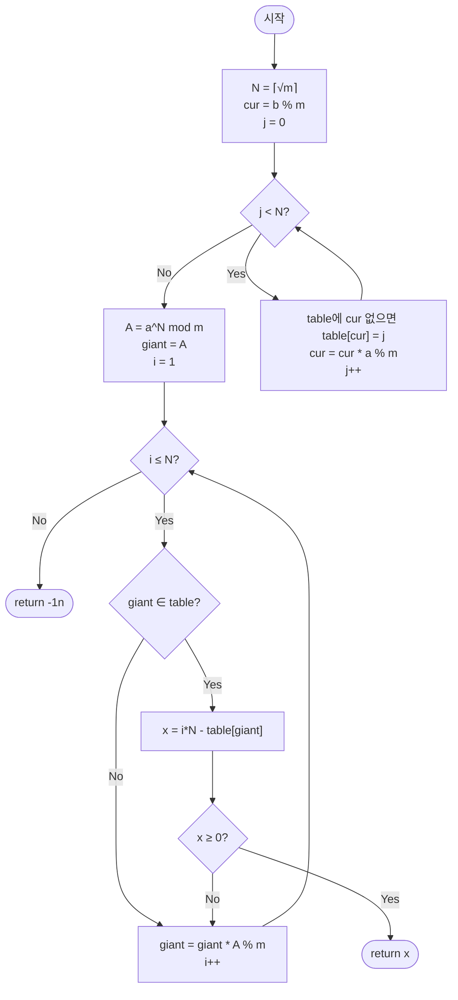

import { AlgorithmSimulation } from "#guide-sim";

# babyStepGiantStep — 이산 로그 (Baby-step Giant-step) 해설

## 성능 목표 예측

| 항목 | 값 |
|------|-----|
| 입력 범위 | $m \geq 2$ (bigint), $a, b \geq 0$ |
| 시간 복잡도 | $O(\sqrt{m})$ |
| 공간 복잡도 | $O(\sqrt{m})$ (해시맵) |

**naive 접근의 한계.** $a^x \equiv b \pmod{m}$에서 $x$의 후보 범위는 $[0, m)$이다. $x = 0, 1, 2, \ldots$를 순차적으로 시도하면 $O(m)$이다. $m = 10^{12}$이면 $10^{12}$번의 연산이 필요해 수십 분이 걸린다.

**목표 복잡도와 근거.** $N = \lceil \sqrt{m} \rceil$으로 설정해 $x = iN - j$ ($1 \leq i \leq N$, $0 \leq j < N$) 형태로 분해하면 탐색 공간이 $N \times N = O(m)$이지만, baby-step $N$회 + giant-step $N$회로 $O(\sqrt{m})$에 처리된다. 해시맵으로 $O(1)$ 조회가 가능하므로 전체 $O(\sqrt{m})$이다.

**공간 트레이드오프.** baby-step 단계에서 $N$개 항목을 해시맵에 저장하므로 $O(\sqrt{m})$ 공간이 필요하다. $m = 10^{12}$이면 $N \approx 10^6$이고, 해시맵 항목당 약 40바이트면 약 40MB가 필요하다.

---

## 목표 함수

```ts
function babyStepGiantStep(a: bigint, b: bigint, m: bigint): bigint
```

| 파라미터 | 의미 | 제약 |
|----------|------|------|
| `a` | 거듭제곱의 밑 | bigint |
| `b` | 목표값 | bigint |
| `m` | 모듈러 | $m \geq 2$, bigint |

**반환값**: $a^x \equiv b \pmod{m}$을 만족하는 가장 작은 $x \geq 0$. 해가 없으면 `-1n`.

**엣지케이스**:
1. `a = 2n, b = 1n, m = 7n` → `0n` ($a^0 = 1 \equiv 1$)
2. `a = 3n, b = 6n, m = 7n` → `3n` ($3^3 = 27 \equiv 6$)
3. `a = 2n, b = 5n, m = 7n` → `-1n` (해 없음: $\{2^0, \ldots, 2^5\} = \{1,2,4,1,2,4\}$, 5 없음)
4. `a = 1n, b = 1n, m = 5n` → `0n` ($1^0 = 1$)
5. `a = 0n, b = 0n, m = 5n` → `1n` ($0^1 = 0 \equiv 0$)

---

## 핵심 아이디어

**핵심 아이디어**: "탐색 공간을 두 절반으로 쪼개 각각 √m번만 계산한 뒤 해시맵으로 만나게 한다 — Meet in the Middle"

이산 로그 문제 $a^x \equiv b \pmod{m}$에서 $x$를 0부터 m-1까지 순차적으로 시도하면 $O(m)$으로 m이 크면 불가능하다. 핵심 아이디어는 $x = iN - j$ 형태로 분해해 좌변(giant-step)과 우변(baby-step)을 각각 독립적으로 $O(\sqrt{m})$에 계산하고, 해시맵으로 일치하는 쌍을 찾는 것이다. 이렇게 하면 전체 탐색을 $O(\sqrt{m})$으로 줄일 수 있다.

**풀이 구조**
1. $N = \lceil \sqrt{m} \rceil$ 설정, $x = iN - j$로 분해
2. Baby-step: $j = 0, \ldots, N-1$에 대해 $b \cdot a^j \bmod m$ 값을 해시맵에 저장
3. Giant-step: $i = 1, \ldots, N$에 대해 $a^{iN} \bmod m$을 계산하며 해시맵 조회
4. 매칭되면 $x = iN - j$ 반환, 끝까지 없으면 -1 반환

**조건**: $a^x \equiv b \pmod{m}$을 만족하는 정수 $x \geq 0$가 존재하는 이산 로그 문제. 표준 BSGS는 $\gcd(a, m) = 1$ 조건을 전제한다.

**대표 예시**: $3^x \equiv 6 \pmod{7}$ 풀기
$N = \lceil\sqrt{7}\rceil = 3$으로 설정한다. Baby-step으로 $6 \cdot 3^0 = 6$, $6 \cdot 3^1 = 18 \equiv 4$, $6 \cdot 3^2 = 54 \equiv 5$를 해시맵에 저장한다. Giant-step에서 $A = 3^3 = 27 \equiv 6 \pmod{7}$이고 $i=1$일 때 $\text{giant} = 6$이 해시맵에 있으므로 $x = 1 \cdot 3 - 0 = 3$을 반환한다.

**언제 쓰나**
$a^x \equiv b \pmod{m}$의 형태로 지수 $x$를 구해야 하고 $m$이 $10^{12}$ 수준으로 크지만 $10^{18}$은 되지 않을 때 사용한다. 이산 로그, 위수(order) 계산, 암호학적 역산 문제에 자주 등장한다.

---

### 원형 아이디어와 naive 접근

$x = 0, 1, 2, \ldots, m-1$을 순차적으로 시도하며 $a^x \bmod m = b$를 찾는 방법은 $O(m)$이다. $m$이 크면 완전히 불가능하다. "탐색 공간 $[0, m)$을 두 부분으로 나눠 각각 $O(\sqrt{m})$에 처리하면 전체 $O(\sqrt{m})$이 되지 않을까?"라는 Meet-in-the-Middle 발상이 출발점이다.

### 어떤 관찰이 돌파구가 되는가

- **핵심 관찰 1**: $x = iN - j$로 분해하면 ($N = \lceil \sqrt{m} \rceil$, $1 \leq i \leq N$, $0 \leq j < N$), 이 분해가 $[0, N^2) \supseteq [0, m)$을 모두 커버한다. (단, $x \geq 0$ 조건은 $x = iN - j \geq 0$으로 확인)
- **핵심 관찰 2**: $x = iN - j$를 $a^x \equiv b \pmod{m}$에 대입하면 $a^{iN} \equiv b \cdot a^j \pmod{m}$이 된다. 좌변은 $i$의 함수, 우변은 $j$의 함수이므로 각각 독립적으로 계산할 수 있다.
- **핵심 관찰 3**: 우변 $b \cdot a^j \bmod m$을 $j = 0, \ldots, N-1$에 대해 미리 해시맵에 저장하면 (baby-step), 좌변 $a^{iN} \bmod m$을 $i = 1, \ldots, N$에 대해 계산하며 해시맵을 조회해 매칭을 찾는다 (giant-step).

### 관찰을 형식화: 상태/구조 정의

$N = \lceil \sqrt{m} \rceil$으로 설정한다. 두 단계로 나눈다:

**Baby-step**: 해시맵 $\text{table}$에 $\text{table}[b \cdot a^j \bmod m] = j$ ($j = 0, \ldots, N-1$)를 저장한다.

**Giant-step**: $A = a^N \bmod m$을 계산하고, $\text{giant} = A^i \bmod m$ ($i = 1, \ldots, N$)을 순차 계산하며 $\text{table}[\text{giant}]$를 조회한다. 매칭되면 $x = iN - \text{table}[\text{giant}]$이다.

이 형태여야 하는 이유: $x$의 분해 $x = iN - j$가 $a^{iN} = b \cdot a^j$로 변환되어, 좌변과 우변을 각각 $O(\sqrt{m})$에 계산해 해시맵으로 매칭하기 때문이다.

### 점화식 또는 핵심 연산

$x = iN - j$ 분해에서:

$$a^x \equiv b \pmod{m} \iff a^{iN - j} \equiv b \pmod{m} \iff a^{iN} \equiv b \cdot a^j \pmod{m}$$

**유도**: $a^{iN - j} = a^{iN} / a^j$이지만 모듈러 역원이 존재하지 않을 수 있으므로, 양변에 $a^j$를 곱해 $a^{iN} \equiv b \cdot a^j \pmod{m}$ 형태로 변환한다. ($\gcd(a, m) = 1$인 표준 BSGS는 이 변환이 동치이다.)

baby-step에서: $\text{cur}_0 = b \bmod m$, $\text{cur}_{j+1} = \text{cur}_j \cdot a \bmod m$으로 순차 계산한다.

giant-step에서: $A = a^N \bmod m$ (fastPower), $\text{giant}_i = A^i \bmod m = \text{giant}_{i-1} \cdot A \bmod m$으로 순차 계산한다.

### 정당성 — 왜 이것이 옳은가

**완전성 (해가 있으면 반드시 찾음)**: $0 \leq x < m$인 해 $x$에 대해 $x = iN - j$ ($1 \leq i \leq N$, $0 \leq j < N$)로 분해가 항상 가능하다. $i = \lceil (x+1)/N \rceil$, $j = iN - x$으로 설정하면 된다. 따라서 giant-step $i$에서 반드시 매칭이 발견된다.

**건전성 (반환값이 올바른 해임)**: $\text{giant} = a^{iN} \bmod m$이 $\text{table}[b \cdot a^j \bmod m] = j$와 매칭되면, $a^{iN} \equiv b \cdot a^j \pmod{m}$이 성립하므로 $x = iN - j$가 해이다.

**최솟값 보장**: 해시맵에 같은 값이 여러 $j$에 매핑될 경우 최솟값 $j$를 저장해 $x = iN - j$가 최대화된다. 또한 giant-step을 $i = 1$부터 순서대로 진행하므로 같은 $i$에서 최솟값 $j$를 취하면 된다. 전체 최솟값 $x$를 보장하려면 추가 처리가 필요할 수 있다.

**까다로운 케이스**: $x = 0$인 경우 $a^0 = 1 \equiv b$이면 즉시 $0$을 반환한다. $j = 0$일 때 $b \cdot a^0 = b$가 해시맵에 들어가므로, $i = N/N = 1$에서 $\text{giant} = a^N$과 매칭될 수 있다. 이 경우 $x = N - 0 = N$이 아니라 $x = 0$을 먼저 확인해야 최솟값이 보장된다.

### 구현 디테일과 최적화

- **$x = 0$ 선확인**: baby-step 전에 $b \bmod m = 1$이면 $x = 0$을 반환한다.
- **해시맵 키 충돌**: 같은 $b \cdot a^j \bmod m$ 값에 여러 $j$가 대응될 때, 최솟값 $j$를 저장해야 최솟값 $x$를 얻는다.
- **$x \geq 0$ 확인**: $x = iN - j$가 음수가 되지 않도록 확인한다.
- **bigint 사용**: 모든 연산을 bigint로 수행해 오버플로를 방지한다.
- **함정**: 표준 BSGS는 $\gcd(a, m) = 1$을 전제한다. $\gcd(a, m) > 1$인 경우에는 별도 처리가 필요하다.

---

## 시뮬레이션

고정 입력 `a = 3n`, `b = 6n`, `m = 7n` (즉 `3^x ≡ 6 (mod 7)` 풀기)에 대해 `babyStepGiantStep`을 실행하는 과정이다. `N = ceil(sqrt(7)) = 3`. `keyValue` 패널은 baby-step의 해시맵 누적과 giant-step의 조회 상태를 보여준다.

실제 반환값은 `3n` (`3^3 = 27 ≡ 6 (mod 7)`)이며, 시뮬레이션 마지막 프레임과 일치한다.

> 대화형 시뮬레이션은 MDX 런타임에서 표시됩니다.

export const steps = [
  {
    title: "초기화",
    detail: "N = ceil(sqrt(7)) = 3. cur = b mod m = 6. 해시맵 table 비어있음.",
    entries: [
      { label: "N", value: 3 },
      { label: "cur = 6 mod 7", value: 6 },
      { label: "table", value: "{}" },
    ],
  },
  {
    title: "Baby-step j=0",
    detail: "cur = b*3^0 = 6. table[6]=0. 다음 cur = 6*3 mod 7 = 4.",
    entries: [
      { label: "j", value: 0 },
      { label: "table[6]", value: 0 },
      { label: "다음 cur", value: 4 },
    ],
  },
  {
    title: "Baby-step j=1",
    detail: "cur = b*3^1 = 4. table[4]=1. 다음 cur = 4*3 mod 7 = 5.",
    entries: [
      { label: "j", value: 1 },
      { label: "table[4]", value: 1 },
      { label: "다음 cur", value: 5 },
    ],
  },
  {
    title: "Baby-step j=2",
    detail: "cur = b*3^2 = 5. table[5]=2. baby-step 종료. table = {6:0, 4:1, 5:2}.",
    entries: [
      { label: "j", value: 2 },
      { label: "table[5]", value: 2 },
      { label: "table", value: "{6:0, 4:1, 5:2}" },
    ],
  },
  {
    title: "Giant-step 준비",
    detail: "A = a^N mod m = 3^3 mod 7 = 6. giant = A = 6 (i=1).",
    entries: [
      { label: "A = 3^3 mod 7", value: 6 },
      { label: "giant (i=1)", value: 6 },
    ],
  },
  {
    title: "Giant-step i=1: 매칭",
    detail: "giant=6 이 table에 존재. table[6]=0. x = i*N - j = 1*3 - 0 = 3 >= 0.",
    entries: [
      { label: "i", value: 1 },
      { label: "giant", value: 6 },
      { label: "table[6] = j", value: 0 },
      { label: "x = 1*3 - 0", value: 3 },
    ],
  },
  {
    title: "완료: return 3n",
    detail: "x=3 이 유효한 최소 해. 검증: 3^3 = 27 = 7*3 + 6 ≡ 6 (mod 7).",
    entries: [
      { label: "x", value: 3 },
      { label: "검증 3^3 mod 7", value: 6 },
    ],
  },
];

<AlgorithmSimulation view="keyValue" steps={steps} title="BSGS: 3^x ≡ 6 (mod 7)" />

## 수도 코드와 Activity Diagram

### 의사코드

```
function babyStepGiantStep(a, b, m):
    N = ceil(sqrt(m))    // N ≈ √m

    // Baby-step: table[b*a^j mod m] = j (j=0..N-1)
    table = new Map
    cur = b % m
    for j = 0 to N-1:
        // 불변식: cur = b * a^j mod m
        if not table.has(cur): table.set(cur, j)    // 최솟값 j 저장
        cur = cur * a % m

    // Giant-step: giant = a^(iN) mod m (i=1..N)
    A = fastPower(a, N, m)
    giant = A    // i=1: giant = a^N
    for i = 1 to N:
        // 불변식: giant = a^(iN) mod m
        if table.has(giant):
            x = i * N - table.get(giant)
            if x >= 0: return x    // 유효한 해
        giant = giant * A % m

    return -1n    // 해 없음
```

### Activity Diagram



**핵심 불변식**: baby-step 루프에서 $\text{cur} = b \cdot a^j \bmod m$, giant-step 루프에서 $\text{giant} = a^{iN} \bmod m$이 항상 성립한다.

---

## 관련 알고리즘과 한계

### gcd(a, m) > 1인 경우

표준 BSGS는 $\gcd(a, m) = 1$을 전제한다. $\gcd(a, m) > 1$이면 $a^j$가 $\bmod m$에서 역원이 없어 변환이 동치가 아닐 수 있다. 이 경우 "General BSGS" 또는 "Extended BSGS"를 사용한다. 이 알고리즘은 $a^k \equiv b \pmod{m}$을 반복적으로 $g = \gcd(a, m)$으로 나누어 환원하는 전처리를 수행한다.

### 이산 로그의 어려움과 암호학

$m$이 큰 소수이고 $a$가 원시근(primitive root)이면, 이산 로그 문제(DLP: Discrete Logarithm Problem)는 현재 알려진 가장 효율적인 알고리즘(GNFS 등)으로도 지수 시간이 필요하다. BSGS는 이 범주에서 $O(\sqrt{m})$으로 기본 공격 알고리즘이지만, $m \approx 2^{256}$인 암호학적 매개변수에서는 여전히 불가능하다.

### 순서(Order)와의 관계

$a^x \equiv b \pmod{m}$에서 $b = 1$이면, 가장 작은 양의 해 $x$가 $a$의 $\bmod m$ 위에서의 위수(order)이다. BSGS로 위수도 $O(\sqrt{m})$에 구할 수 있다. 위수를 알면 이산 로그의 전체 해 구조($x + k \cdot \text{ord}$)를 파악할 수 있다.
