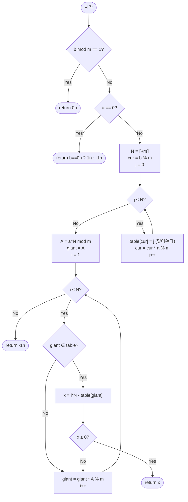

import { AlgorithmSimulation } from "#guide-sim";

# babyStepGiantStep — 탐색 구간을 반으로 접어 해시맵에서 마주치게 하는 이유

## 한눈에 보는 컨셉

이산 로그 문제 $a^x \equiv b \pmod{m}$에서 $x$를 $0$부터 하나씩 대입하면 `O(m)`이 걸려서, $m$이 커지면 손 쓸 도리가 없어져요. 핵심 아이디어는 $x$를 $x = iN - j$ ($N = \lceil\sqrt{m}\rceil$) 형태로 접어, 절반(우변)은 해시맵에 미리 저장해 두고 나머지 절반(좌변)은 하나씩 계산하며 해시맵에서 마주치게 하는 것이에요. baby-step과 giant-step을 각각 `N`번만 계산하면 되므로 전체가 `O(√m)`로 줄어듭니다.

## 출발점: 가장 순진한 방법부터

앨리스가 밥에게 "공개된 수 `a`를 몇 번 거듭제곱해서 `b`를 만들었어"라고 알렸다고 해봅시다. 도청자는 `a`, `b`, `m`을 전부 볼 수 있지만, 그 "몇 번"에 해당하는 `x`를 되짚어 내려면 손을 움직여야 해요. 밥(또는 도청자)이 풀어야 하는 함수는 이렇습니다.

```ts
function babyStepGiantStep(a: bigint, b: bigint, m: bigint): bigint
```

| 파라미터 | 의미 | 제약 |
|---|---|---|
| `a` | 거듭제곱의 밑 | bigint, 음수·`m` 이상도 가능하지만 **정답이 보장되는 범위는 `a=0`(특수 처리) 또는 `gcd(a,m)=1`(서로소)뿐** |
| `b` | 목표값 | bigint, 임의 |
| `m` | 모듈러 | bigint, `m ≥ 2` |

반환값은 $a^x \equiv b \pmod m$을 만족하는 가장 작은 $x \ge 0$이고, 그런 $x$가 없으면 `-1n`을 돌려줍니다. `a`, `b`는 음수이거나 `m`보다 클 수 있으니 연산 전에 `mod m`으로 정규화해야 해요. 이 가이드가 다루는 것은 **표준 BSGS**로, `a=0`은 별도 케이스로 걸러내고 그 나머지 입력에서는 `gcd(a,m)=1`을 전제로 삼습니다 — `gcd(a,m)>1`인 입력에서는 뒤의 "건전성" 절에서 보듯 매칭이 나와도 진짜 해가 아닐 수 있어요(그 경우를 다루려면 "General BSGS"라는 별도 확장이 필요합니다).

가장 정직한 방법은 $x=0,1,2,\ldots$를 순서대로 대입해 보는 겁니다. "몇 번 거듭제곱했는지 모르겠다 → 0번부터 하나씩 늘려 보며 확인한다"가 가장 손쉬운 출발이에요.

```ts
function babyStepGiantStepNaive(a: bigint, b: bigint, m: bigint): bigint {
  a = ((a % m) + m) % m;
  b = ((b % m) + m) % m;
  let cur = 1n % m; // a^0 mod m
  for (let x = 0n; x < m; x++) {
    if (cur === b) return x;
    cur = (cur * a) % m;
  }
  return -1n;
}
```

이 함수를 실제로 돌려서 비용을 재 보면 이렇습니다. `m = 1,000,003`(소수)에서 해가 존재하지 않는 경우(끝까지 못 찾고 전체를 훑는 최악의 경우)를, 이 예시를 작성한 환경에서 한 번 워밍업 없이 단발로 측정했어요(절대 수치는 실행 환경마다 달라지지만, 배수 관계는 유지됩니다).

```text
naive:  x = 0, 1, 2, ..., m-1 을 전부 순회
        m ≈ 10^6 일 때 단발 실측 약 22.7ms  (같은 입력에서 BSGS는 약 0.2ms, 대략 100배 차이)
        m 이 10^12 규모가 되면 순회 횟수가 그대로 10^6배 불어난다 → 도저히 못 기다릴 시간
```

naive 코드를 가만히 보면 낌새가 하나 보입니다 — `cur`은 매 단계 `a`를 한 번씩 곱해서 갱신될 뿐이고, 우리는 그 값을 처음부터 끝까지 순서대로 훑고 있어요. **"이 긴 순회를 반으로 쪼개, 절반은 미리 계산해 저장해 두고 나머지 절반은 진행하면서 마주치게 할 수 없을까?"** 이것이 이번 알고리즘의 출발 단서입니다.

## 아이디어 자세히 들여다보기

### 탐색 구간을 반으로 접기 — 수식과 그림

$N = \lceil\sqrt{m}\rceil$로 두고, $x$를 다음과 같이 쪼갭니다.

$$x = iN - j \qquad (1 \le i \le N,\ 0 \le j < N)$$

이 분해를 원래 식에 대입하면 이렇게 돼요.

$$a^x \equiv b \pmod m \iff a^{iN-j} \equiv b \pmod m$$

여기서 바로 양변을 $a^j$로 나누고 싶어지지만, `mod m` 세계에서 나눗셈은 항상 되는 게 아니에요(역원이 없을 수 있으니까요). 대신 **양변에 $a^j$를 곱합니다** — 곱셈은 합동식에서 항상 안전해요.

$$a^{iN-j} \equiv b \pmod m \;\Longrightarrow\; a^{iN} \equiv b \cdot a^j \pmod m$$

좌변 $a^{iN}$은 오직 $i$에만, 우변 $b \cdot a^j$는 오직 $j$에만 의존합니다. **왜 하필 $x = iN - j$(뺄셈) 형태여야 할까요?** 만약 $x = iN + j$로 잡았다면 $a^{iN+j} \equiv b$에서 $a^{iN} \cdot a^j \equiv b$가 되어, $a^{iN}$을 구하려면 $b$를 $a^j$로 나눠야 하는 것처럼 보입니다(역원 필요). 다만 이 나눗셈이 "불가능"한 건 아니에요 — $\gcd(a,m)=1$이라면 $a^{-1} \bmod m$을 미리 한 번만 구해 두고 $b \cdot (a^{-1})^j$를 누적 곱으로 전개해도 결국 곱셈만으로 풀립니다. 그래도 뺄셈 형태 $x=iN-j$를 쓰면 역원을 구하는 준비 단계 자체가 필요 없이 원래의 곱셈 $a^j$만으로 바로 전개된다는 점에서 더 직접적입니다. 즉 "나눗셈을 곱셈으로 바꿔치기"는 이 분해가 가진 유일한 길은 아니지만, 역원 계산 없이 가장 곧장 도달하는 형태라는 것이 뺄셈 분해를 택하는 이유입니다.

$N=3$(즉 $m=7$일 때 $N=\lceil\sqrt7\rceil=3$)으로 $i, j$가 만드는 $x$ 값을 표로 직접 채워 봅시다.

```text
N = 3.  x = i*N - j   (i = 1..3, j = 0..2)

        j=0   j=1   j=2
i=1 |    3     2     1
i=2 |    6     5     4
i=3 |    9     8     7

이 표가 만드는 x 값 전체 = {1,2,...,9} = [1, N^2] 구간을 빈틈없이 채운다
```

잠깐 확인 하나 해 볼까요? $m=7$일 때 실제로 찾아야 하는 해는 $x=3$이었는데(뒤에서 직접 풀어볼 예시입니다), 위 표에서 $x=3$은 어디 있을까요? — $i=1, j=0$ 칸입니다. 즉 giant-step의 **첫 번째 시도**($i=1$)에서 baby-step 표의 **첫 번째 항목**($j=0$)과 만나는 경우예요.

baby-step은 우변 $b \cdot a^j \bmod m$ ($j=0,\ldots,N-1$)을 전부 계산해 해시맵에 저장해 두는 단계이고, giant-step은 좌변 $a^{iN} \bmod m$ ($i=1,\ldots,N$)을 하나씩 계산하며 해시맵을 조회하는 단계입니다. 두 단계 모두 각각 $N$번만 계산하면 되니, 표 전체($N \times N = O(m)$칸)를 순회하지 않고도 $O(\sqrt m)$에 답을 찾을 수 있어요.

### 단서를 설명해 주는 이론 — Meet in the Middle

방금 쓴 "절반은 미리 저장, 절반은 진행하며 조회"라는 수법에는 이미 이름이 있습니다. **Meet in the Middle(중간에서 만나기)**라는 탐색 기법이에요. 탐색 공간 전체를 두 조각으로 나눌 수 있고, 각 조각의 결과를 독립적으로 계산할 수 있으며, 두 조각의 결과를 짝지어(매칭) 판별할 수 있을 때 쓰는 일반적인 도구입니다.

가장 널리 알려진 적용 예는 부분집합 합(subset sum) 문제예요. 원소 $2n$개의 부분집합 합을 전부 나열하면 $O(2^{2n})$이지만, 원소를 절반씩 나눠 각 절반의 부분합을 $O(2^n)$에 나열한 뒤, 정렬 또는 해시맵으로 "합이 목표값이 되는 두 절반의 짝"을 찾으면 $O(2^n \log 2^n)$ 또는 $O(2^n)$으로 줄어듭니다.

작은 예로 확인해 볼까요? 원소 $\{1, 3, 5, 8\}$에서 합이 $9$가 되는 부분집합이 있는지 찾는다고 해 봅시다. 절반으로 나눠 각 절반의 부분합을 모두 나열하면 이렇습니다.

```text
원소 {1, 3, 5, 8} → 절반 왼쪽 {1, 3}, 절반 오른쪽 {5, 8}

왼쪽 부분합(2^2=4개):  {}=0, {1}=1, {3}=3, {1,3}=4
오른쪽 부분합(2^2=4개): {}=0, {5}=5, {8}=8, {5,8}=13

목표 9 = 왼쪽값 + 오른쪽값 이 되는 짝 찾기
  → 왼쪽 4 + 오른쪽 5 = 9  (짝 발견: {1,3}과 {5})

전체 부분집합 2^4=16개를 다 보지 않고, 각 절반 4개씩만 나열해 매칭했다
```

두 문제의 공통점은 "전체를 한 번에 보지 않고, 절반씩 계산해서 매칭 구조로 합친다"는 설계 방식이에요.

BSGS는 이 기법을 지수 $x$의 탐색 공간 $[0, m)$에 적용한 것입니다. baby-step이 만드는 후보군(우변)과 giant-step이 만드는 후보군(좌변)이 각각 $O(\sqrt m)$개이고, 이 둘을 해시맵으로 매칭하는 순간이 바로 "중간에서 만나는" 지점이에요.

### 셈을 맡는 자료구조 — 해시맵

baby-step에서 만든 $N$개의 (값, $j$) 쌍을 저장해 두고, giant-step에서 값 하나씩을 즉시 조회해야 합니다. 값의 범위가 `mod m`이라 배열 인덱스로 바로 쓰기엔 `m`이 너무 클 수 있으므로(`m`이 $10^{12}$ 규모라면 배열 자체를 만들 수 없어요), 해시 맵을 사용해 평균 `O(1)`로 읽고 씁니다. 해시 맵 자체의 동작 원리가 궁금하다면 이 프로젝트의 [hashMapChaining 가이드](../../../data-structures/hash/hashMapChaining/hashMapChaining-guide.mdx)를 참고하세요 — 여기서는 "평균 `O(1)`로 값→j를 기록하고 조회하는 표"로만 쓰면 충분합니다.

### 왜 모순 없이 작동하는가

이 알고리즘이 옳다는 것을 세 갈래로 나눠 확인해 볼게요.

**완전성 — 해가 있으면 반드시 발견됩니다.** $x=1$부터 $x=N^2$까지, 모든 $x$가 $(i,j)$ 쌍과 정확히 하나씩 대응한다는 것을 귀납으로 보입니다.

- **기저**: $x=1$일 때 $i=1, j=N-1$이면 $x = iN-j = N-(N-1) = 1$이 성립합니다.
- **귀납 단계**: $x=k$ ($1 \le k < N^2$)에 대응하는 쌍이 $(i,j)$라고 합시다. $x=k+1$의 쌍은 두 경우로 완전히 나뉩니다(이 두 경우 밖의 가능성은 없습니다 — $j$는 $N-1$에서 $0$까지 내려가거나, $0$이 되는 순간 $i$가 늘어나는 것 말고 다른 전이는 없으니까요).
  - $j>0$이면 $(i,\,j-1)$이 $x=k+1$에 대응합니다: $iN-(j-1) = (iN-j)+1 = k+1$.
  - $j=0$이면 $(i+1,\,N-1)$이 $x=k+1$에 대응합니다: $(i+1)N-(N-1) = iN+1 = k+1$ (여기서 $iN=k$였으므로).

  두 경우 모두 $1 \le i \le N$, $0 \le j < N$ 범위를 벗어나지 않으므로, $x=1,\ldots,N^2$ 전 구간이 빠짐없이 덮입니다(존재성).

- **유일성**: 지금까지는 "모든 $x$에 대응하는 $(i,j)$가 있다"만 보였습니다. 그런데 서로 다른 두 쌍이 같은 $x$를 만들 수는 없을까요? $(i,j) \ne (i',j')$인데 $iN-j = i'N-j'$라고 가정하면 $N(i-i') = j-j'$입니다. $0 \le j, j' < N$이므로 우변의 절댓값은 $N$보다 작고, 좌변은 $N$의 배수이니 그 배수가 $N$보다 작으려면 $0$일 수밖에 없습니다. 즉 $i=i'$이고, 그러면 $j=j'$도 바로 따라옵니다. 그러므로 $(i,j) \leftrightarrow x$ 대응은 존재할 뿐 아니라 유일합니다 — "정확히 하나씩 대응한다"는 처음 선언 그대로예요.

  $m \le N^2$이 항상 성립하므로($N=\lceil\sqrt m\rceil$의 정의 그대로) $[1, m-1]$ 구간의 모든 $x$도 당연히 이 안에 들어옵니다. $x=0$은 이 범위 밖(가장 작은 $iN-j$ 값이 $1$)이라 baby-step 이전에 따로 확인합니다 — $b \bmod m = 1$이면 $a^0=1\equiv b$이므로 즉시 $0$을 반환해요.

  잠깐, 왜 하필 탐색 범위를 $m$까지만 잡아도 충분할까요? $\gcd(a,m)=1$이면 $a$는 `mod m`의 곱셈군 안에 있고, 오일러 정리에 따라 $a^{\varphi(m)} \equiv 1 \pmod m$이 성립합니다($\varphi(m) \le m-1$). 즉 $a$의 거듭제곱값은 주기 $\varphi(m)$ 이하로 반복되므로, 방정식에 해가 존재한다면 그 최소해는 반드시 이 주기 안 — 즉 $[0, m-1]$ 범위 안 — 에 있습니다(그보다 큰 해가 있다면 주기만큼 뺀 더 작은 해가 항상 따라오기 때문이에요). 그래서 $x \in [0, N^2]$까지만 훑어도 $[0,m-1]$ 안의 최소해를 놓치지 않습니다.

**건전성 — giant-step에서 매칭이 나오면 진짜 해입니다(단, 전제 조건 아래).** baby-step은 $b\cdot a^j \bmod m$을 표에 저장했고, giant-step은 $a^{iN}\bmod m$을 조회합니다. 두 값이 같다는 것은 $a^{iN} \equiv b\cdot a^j \pmod m$이 성립한다는 뜻이고, 여기서 $a^j$의 역원이 존재해 양변에 곱하면(나누면) $a^{iN-j}\equiv b \pmod m$, 즉 $x=iN-j$가 해라는 결론을 얻습니다. **이 마지막 한 걸음(양변을 $a^j$로 나누는 것)이 성립하려면 $a^j$가 `mod m`에서 역원을 가져야 하고, 이는 $\gcd(a,m)=1$일 때 보장됩니다.** 왜냐하면 $\gcd(a,m)=1$이면 $a$를 아무리 거듭제곱해도 $m$과 새 공약수가 생기지 않아 $\gcd(a^j,m)=1$이 그대로 유지되고, `mod m`에서 서로소인 수는 항상 역원을 갖기 때문이에요($a$가 서로소라는 것과 $a^j$가 역원을 갖는다는 것이 바로 이 고리로 연결됩니다). 표준 BSGS가 이 조건을 전제로 삼는 이유가 바로 여기예요.

여기서 **헷갈리기 쉬운 포인트**가 있습니다. $\gcd(a,m)>1$이어도 giant-step의 "값이 같다"는 매칭 자체는 얼마든지 일어날 수 있습니다 — 그런데 그 매칭이 실제 해를 보장하지는 않아요. 실측으로 확인해 봅시다.

```text
babyStepGiantStep(2n, 0n, 4n) 을 그대로 돌리면 1n 을 반환한다

검산: 2^1 mod 4 = 2   (목표는 b=0)   →  1은 해가 아닌데 매칭돼 버렸다!

이유: gcd(2,4)=2 이므로 2^j 는 mod 4 세계에서 역원이 없다.
      "값이 같다"는 매칭에서 "x=iN-j가 해다"로 넘어가는 마지막 나눗셈이 무너진 것.
```

즉 `a`, `m`이 서로소가 아닌 입력에는 이 함수를 그대로 적용하면 안 됩니다. (`gcd(a,m)>1`인 일반적인 경우는 "General BSGS"라는 별도의 전처리가 필요한 확장 주제이고, 이 가이드에서는 표준 BSGS의 전제인 $\gcd(a,m)=1$ 범위를 다룹니다.)

**최솟값 보장 — 왜 표에 "가장 큰 j"를 남겨야 할까요?** baby-step에서 같은 잔여값 $b\cdot a^j \bmod m$이 서로 다른 $j$에서 반복될 수 있습니다(예: $a$의 위수(order)가 작을 때). 이럴 때 어떤 $j$를 표에 남기느냐가 최솟값 $x$를 좌우해요. $x=iN-j$이므로 **같은 $i$에서는 $j$가 클수록 $x$가 작아집니다**. 그러므로 충돌이 나면 **더 큰 $j$로 덮어써야** 합니다.

```text
Before: 먼저 들어온 j만 남기는 정책(작은 j 유지)
  babyStepGiantStep(4n, 4n, 5n)  →  3n 을 반환
  검산: 4^3 mod 5 = 4  (b=4와 일치하니 "해"이긴 하다)
  그런데 4^1 mod 5 = 4 도 성립 — 진짜 최솟값은 1n인데 3n을 내놓은 것

After: 나중에 들어온 j로 덮어쓰는 정책(큰 j 유지)
  babyStepGiantStep(4n, 4n, 5n)  →  1n 을 반환  ✓ (실측 검증 완료)
```

`4 mod 5`의 위수는 $2$입니다($4^2 = 16 \equiv 1$이므로 $4^1$과 $4^3$이 같은 값 $4$가 됩니다). baby-step에서 $j=0$일 때와 $j=2$일 때 모두 값 $4$가 나오는데, 작은 $j=0$을 지키면 $x=3$(iN-0)이 되어 손해를 보고, 큰 $j=2$로 덮어쓰면 $x=1$(iN-2)로 진짜 최솟값을 얻습니다.

그런데 "같은 $i$ 안에서" 큰 $j$가 유리하다는 것만으로 "전체 giant-step 루프에서 가장 먼저 나오는 매칭이 전역 최솟값"이라고 바로 단정할 수 있을까요? 여기엔 한 단계가 더 필요해요. $j$의 범위가 $0 \le j < N$으로 고정돼 있으므로, $i$가 만드는 $x=iN-j$ 값들은 $((i-1)N,\ iN]$ 구간 — 즉 $i=1$이면 $(0,N]$, $i=2$이면 $(N,2N]$ — 에 딱 맞게 갇힙니다. 이 구간들은 서로 겹치지 않고 $i$가 커질수록 통째로 더 큰 수 쪽으로 옮겨가므로, **더 작은 $i$가 만드는 모든 $x$는 더 큰 $i$가 만드는 모든 $x$보다 항상 작습니다.** 그래서 $i=1$부터 순서대로 시도하다 첫 매칭을 만나면, 그보다 작은 $x$는 더 작은 $i$ 쪽에서 이미 다 확인이 끝난 상태라 남아 있을 수 없어요. 여기에 "같은 $i$ 안에서는 큰 $j$가 이긴다"는 방금 확인한 사실을 더하면, "가장 작은 $i$에서, 그 $i$가 만들 수 있는 가장 작은 $x$"를 얻게 되어 전체 최솟값이 보장됩니다.

> **기억법**: baby-step 표는 "먼저 온 손님"이 아니라 "나중에 다시 온 손님"을 기억한다 — 큰 $j$가 이깁니다.

엣지 케이스도 짚어 둘게요.

```text
b mod m = 1           → x=0 이 항상 해 (a^0=1). baby-step 전에 선확인.
a = 0, b mod m = 0     → x=1 이 최소해 (0^1=0). x=0은 위에서 이미 걸러졌다.
a = 0, b mod m ≠ 0,1   → 해 없음 (0의 거듭제곱은 0 아니면 1뿐).
a = 1                 → 1^x는 항상 1. b mod m = 1이면 x=0, 아니면 해 없음.
해가 존재하지 않는 경우 → giant-step이 i=N까지 매칭 없이 끝나면 -1n.
```

## 아이디어를 코드로 옮기기

앞서 세운 식 $a^{iN} \equiv b\cdot a^j \pmod m$을 그대로 옮기면 이렇습니다. 아직은 "빠르게 만드는" 고민 없이, 필요한 값을 그때그때 거듭제곱으로 계산하는 가장 직접적인 버전이에요.

```ts
function fastPower(base: bigint, exp: bigint, mod: bigint): bigint {
  base = ((base % mod) + mod) % mod;
  let result = 1n % mod;
  while (exp > 0n) {
    if (exp & 1n) result = (result * base) % mod;
    base = (base * base) % mod;
    exp >>= 1n;
  }
  return result;
}

function bigintSqrtFloor(n: bigint): bigint {
  if (n < 2n) return n;
  let x0 = n;
  let x1 = (x0 + 1n) / 2n;
  while (x1 < x0) {
    x0 = x1;
    x1 = (x0 + n / x0) / 2n;
  }
  return x0;
}

function ceilSqrt(n: bigint): bigint {
  const s = bigintSqrtFloor(n);
  return s * s < n ? s + 1n : s;
}

function babyStepGiantStepBasic(a: bigint, b: bigint, m: bigint): bigint {
  a = ((a % m) + m) % m;
  b = ((b % m) + m) % m;

  if (b === 1n % m) return 0n;           // x = 0 선확인
  if (a === 0n) return b === 0n ? 1n : -1n; // a = 0 특수 케이스

  const N = ceilSqrt(m);

  // baby-step: table[b * a^j mod m] = j  (j = 0..N-1)
  const table = new Map<bigint, bigint>();
  for (let j = 0n; j < N; j++) {
    const value = (b * fastPower(a, j, m)) % m; // 매번 처음부터 a^j 계산
    table.set(value, j);                        // 큰 j로 덮어쓴다
  }

  // giant-step: giant = a^(iN) mod m  (i = 1..N)
  for (let i = 1n; i <= N; i++) {
    const giant = fastPower(a, i * N, m); // 매번 처음부터 a^(iN) 계산
    if (table.has(giant)) {
      const j = table.get(giant)!;
      const x = i * N - j;
      if (x >= 0n) return x;
    }
  }

  return -1n;
}
```

**가장 중요한 줄은 `table.set(value, j)`입니다.** 조건 없이 매번 덮어쓰기 때문에, 같은 `value`가 여러 `j`에서 나오면 항상 가장 나중(가장 큰) `j`가 남아요 — 방금 확인한 최솟값 보장의 핵심입니다. 그 외에 놓치기 쉬운 지점은 두 곳이에요.

- `x = 0` 선확인과 `a = 0` 특수 케이스는 **baby-step 루프보다 먼저** 와야 합니다. baby-step은 $i \ge 1$인 $x=iN-j$만 만들 수 있어서 $x=0$을 표현할 수 없고, `a=0`은 `0`의 거듭제곱이라는 별도 규칙(0 아니면 1)을 따르기 때문이에요.
- `fastPower(a, j, m)`과 `fastPower(a, i * N, m)`은 각각 매 반복마다 **처음부터 다시** 거듭제곱을 계산합니다. 정답은 맞지만, 바로 다음 절에서 이 부분이 낭비라는 걸 확인할게요.

## 더 빠르게 만들 단서 찾기

`fastPower`는 지수를 이진수로 쪼개 계산하므로 한 번 호출에 `O(log N)`이 듭니다. 그런데 baby-step에서 `j`가 `1`씩 증가할 때마다 `a^j`를 처음부터 다시 계산하고 있어요.

```text
j=0: a^0            (그 자체로 1)
j=1: a^1            ← 사실 a^0 * a 한 번만 곱하면 되는데, 처음부터 다시 계산
j=2: a^2            ← 마찬가지로 a^1 * a 한 번이면 되는데, 처음부터 다시 계산
...
```

giant-step도 마찬가지입니다. `a^{iN}`을 `i`마다 처음부터 계산하지만, 사실 $a^{(i+1)N} = a^{iN} \cdot a^N$이라 이전 값에 $A=a^N$ 한 번만 곱하면 충분해요. **바로 이전 결과에서 곱셈 한 번만 더하면 되는데, 매번 통째로 다시 계산하고 있다**는 것이 낭비의 정체입니다. baby-step 루프 전체는 `O(N log N)`, giant-step 루프 전체도 `O(N log N)`이 드는데, 이 낭비를 없애면 각각 `O(N)`으로 줄어들 거예요.

## 단서를 최적화로 연결하기

`a^j`와 `a^{iN}` 모두 "이전 값에 상수를 한 번 곱하면 다음 값이 나온다"는 점화식으로 바꿀 수 있습니다.

$$\text{baby: } \text{cur}_0 = b \bmod m,\qquad \text{cur}_{j+1} = \text{cur}_j \cdot a \bmod m$$

$$\text{giant: } A = a^N \bmod m \text{ (딱 한 번만 계산)},\qquad \text{giant}_1 = A,\qquad \text{giant}_{i+1} = \text{giant}_i \cdot A \bmod m$$

```text
Before (매번 처음부터):  a^j 계산 O(log N)  ×  N번  =  O(N log N)
After  (이전 값에 곱셈 1회): O(1)          ×  N번  =  O(N)
```

불변식은 이렇습니다 — baby-step 루프 중에는 항상 $\text{cur} = b\cdot a^j \bmod m$, giant-step 루프 중에는 항상 $\text{giant} = a^{iN}\bmod m$이 성립합니다. 각 반복은 이 불변식을 딱 한 단계만 전진시켜요.

## 최적화 코드

바뀌는 곳은 두 루프뿐입니다. `fastPower` 반복 호출을 곱셈 누적으로 바꿉니다.

```ts
function babyStepGiantStep(a: bigint, b: bigint, m: bigint): bigint {
  a = ((a % m) + m) % m;
  b = ((b % m) + m) % m;

  if (b === 1n % m) return 0n;
  if (a === 0n) return b === 0n ? 1n : -1n;

  const N = ceilSqrt(m);

  // baby-step: cur = b * a^j mod m 을 곱셈 누적으로 유지
  const table = new Map<bigint, bigint>();
  let cur = b;
  for (let j = 0n; j < N; j++) {
    table.set(cur, j);       // 큰 j로 덮어쓴다
    cur = (cur * a) % m;     // O(1) 전진
  }

  // giant-step: giant = a^(iN) mod m 을 곱셈 누적으로 유지
  const A = fastPower(a, N, m); // 여기서만 fastPower 한 번
  let giant = A;                // i = 1: giant = a^N
  for (let i = 1n; i <= N; i++) {
    if (table.has(giant)) {
      const j = table.get(giant)!;
      const x = i * N - j;
      if (x >= 0n) return x;
    }
    giant = (giant * A) % m; // O(1) 전진
  }

  return -1n;
}
```

**가장 중요한 줄은 `cur = (cur * a) % m`과 `giant = (giant * A) % m`입니다.** 이 두 줄이 각각 baby-step과 giant-step을 `O(N log N)`에서 `O(N)`으로 낮춘 전부예요. `fastPower`는 `A = a^N mod m`을 구하는 단 한 번의 호출(`O(log N)`)로만 남습니다.

실수하기 쉬운 순서 하나 — `table.set(cur, j)`가 `cur`을 갱신하기 **전에** 와야 합니다. 순서를 바꿔 `cur`부터 갱신하면 `table[cur]`에 `j`가 아니라 `j+1`이 조용히 잘못 저장됩니다. 직접 실측해 볼까요? 앞서 쓴 `a=3n, b=6n, m=7n` 예시에서 `cur`을 먼저 갱신하도록 바꾼 버전을 그대로 돌리면 이렇습니다.

```text
올바른 순서: babyStepGiantStep(3n, 6n, 7n) = 3n   (정답)
순서 바꾼 버전(cur부터 갱신) = 4n

검산: 3^4 mod 7 = 4   (목표는 b=6) → 4는 해가 아닌데 반환돼 버렸다!
이유: baby-step 표가 {6:0, 4:1, 5:2} 대신 {4:0, 5:1, 1:2}로 밀려 저장되고,
      giant-step이 giant=1과 매칭돼 엉뚱한 x = 2*3 - 2 = 4를 내놓는다.
```

전체 비용은 baby-step `O(N)` + giant-step `O(N)` + `A` 계산 `O(log N)` = `O(N) = O(\sqrt m)`이고, 앞서 세운 목표를 그대로 달성했습니다. 다만 이 `O(\sqrt m)`은 시간만이 아니라 **공간에도 그대로 적용됩니다** — baby-step 표가 `N`개의 항목을 담아야 하니 공간도 `O(\sqrt m)`이에요. 암호학에서 흔히 다루는 $m \approx 10^{18}$ 규모라면 $\sqrt m \approx 10^9$개를 해시맵에 담아야 해서 시간이 아니라 메모리가 먼저 바닥납니다. 그래서 표준 BSGS는 보통 $m$이 대략 $10^{12}$ 안팎일 때까지가 실용적인 한계로 여겨지고, 그보다 큰 $m$에는 공간을 적게 쓰는 Pollard's rho 이산 로그 알고리즘 같은 대안이 필요해요.

여기서 더 줄일 수 있을까요? 이 문제(일반적인 $a, b, m$에 대한 이산 로그)를 **군의 구조에 대한 추가 가정 없이 결정적으로** 푸는 알고리즘으로서는 여기가 사실상 한계입니다 — 알려진 더 빠른 방법(Pollard's rho 이산 로그 알고리즘 등)은 특정 구조(군의 위수 등)를 추가로 가정하거나 기대 성능이 확률적이라, "임의의 $a,b,m$"이라는 이 함수의 일반성과는 다른 전제 위에 서 있어요. BSGS를 배우는 이유는 바로 이 **범용성**입니다 — 군의 구조에 대한 추가 가정 없이 $O(\sqrt m)$을 보장하는 몇 안 되는 기본 알고리즘이거든요.

## 실행 시각화

고정 입력 `a = 3n`, `b = 6n`, `m = 7n`(즉 `3^x ≡ 6 (mod 7)` 풀기)에 대해 위 최적화 코드를 실행한 과정입니다. `N = ceil(sqrt(7)) = 3`이고, `keyValue` 패널은 baby-step이 채우는 해시맵 `table`과 giant-step의 조회 상태를 프레임마다 보여줘요. 실제로 이 코드를 실행하면 `3n`을 반환하며(`3^3 = 27 ≡ 6 (mod 7)`), 아래 시뮬레이션의 마지막 프레임과 일치합니다.

> 대화형 시뮬레이션은 MDX 런타임에서 표시됩니다.

export const steps = [
  {
    title: "초기화",
    detail: "N = ceil(sqrt(7)) = 3. cur = b mod m = 6. 해시맵 table 비어있음.",
    entries: [
      { label: "N", value: 3 },
      { label: "cur = 6 mod 7", value: 6 },
      { label: "table", value: "{}" },
    ],
  },
  {
    title: "Baby-step j=0",
    detail: "cur = b*3^0 = 6. table[6]=0. 다음 cur = 6*3 mod 7 = 4.",
    entries: [
      { label: "j", value: 0 },
      { label: "table[6]", value: 0 },
      { label: "다음 cur", value: 4 },
    ],
  },
  {
    title: "Baby-step j=1",
    detail: "cur = b*3^1 = 4. table[4]=1. 다음 cur = 4*3 mod 7 = 5.",
    entries: [
      { label: "j", value: 1 },
      { label: "table[4]", value: 1 },
      { label: "다음 cur", value: 5 },
    ],
  },
  {
    title: "Baby-step j=2",
    detail: "cur = b*3^2 = 5. table[5]=2. baby-step 종료. table = {6:0, 4:1, 5:2}.",
    entries: [
      { label: "j", value: 2 },
      { label: "table[5]", value: 2 },
      { label: "table", value: "{6:0, 4:1, 5:2}" },
    ],
  },
  {
    title: "Giant-step 준비",
    detail: "A = a^N mod m = 3^3 mod 7 = 6. giant = A = 6 (i=1).",
    entries: [
      { label: "A = 3^3 mod 7", value: 6 },
      { label: "giant (i=1)", value: 6 },
    ],
  },
  {
    title: "Giant-step i=1: 매칭",
    detail: "giant=6 이 table에 존재. table[6]=0. x = i*N - j = 1*3 - 0 = 3 >= 0.",
    entries: [
      { label: "i", value: 1 },
      { label: "giant", value: 6 },
      { label: "table[6] = j", value: 0 },
      { label: "x = 1*3 - 0", value: 3 },
    ],
  },
  {
    title: "완료: return 3n",
    detail: "x=3 이 유효한 최소 해. 검증: 3^3 = 27 = 7*3 + 6 ≡ 6 (mod 7).",
    entries: [
      { label: "x", value: 3 },
      { label: "검증 3^3 mod 7", value: 6 },
    ],
  },
];

<AlgorithmSimulation view="keyValue" steps={steps} title="BSGS: 3^x ≡ 6 (mod 7)" />

## 흐름 한눈에 보기


```mermaid
flowchart TD
    A([시작]) --> P{"b mod m == 1?"}
    P -- Yes --> Q(["return 0n"])
    P -- No --> R{"a == 0?"}
    R -- Yes --> S(["return b==0n ? 1n : -1n"])
    R -- No --> B["N = ⌈√m⌉\ncur = b % m\nj = 0"]
    B --> C{"j < N?"}
    C -- No --> D["A = a^N mod m\ngiant = A\ni = 1"]
    C -- Yes --> E["table[cur] = j (덮어쓴다)\ncur = cur * a % m\nj++"]
    E --> C
    D --> F{"i ≤ N?"}
    F -- No --> G(["return -1n"])
    F -- Yes --> H{"giant ∈ table?"}
    H -- No --> I["giant = giant * A % m\ni++"]
    I --> F
    H -- Yes --> J["x = i*N - table[giant]"]
    J --> K{"x ≥ 0?"}
    K -- Yes --> L(["return x"])
    K -- No --> I
```

## 스스로 점검하기

1. `a = 2n, b = 3n, m = 5n`을 손으로 따라가 보세요. `N = ceil(sqrt(5)) = 3`이고, baby-step 표는 `table = {b*2^0=3, b*2^1=1(=6 mod5), b*2^2=2(=12 mod5)}`가 됩니다. giant-step은 `A = 2^3 mod 5 = 3`부터 시작해요. 어느 `i`에서 매칭이 나고, 최종 반환값은 무엇일까요? (실제로 실행하면 `3n`이 나옵니다 — `2^3 = 8 ≡ 3 (mod 5)`.)
2. baby-step의 `table.set(cur, j)`를 `if (!table.has(cur)) table.set(cur, j)`(먼저 온 `j`만 유지)로 바꾸면 어떤 입력에서 문제가 생길까요? `a=4n, b=4n, m=5n`으로 직접 추적해 보고, 반환값이 왜 최솟값이 아니게 되는지 설명해 보세요.
3. 이 함수를 `gcd(a, m) > 1`인 입력, 예를 들어 `a=2n, b=0n, m=4n`에 그대로 돌리면 어떤 값이 나올까요? 그 값을 `a^x mod m`에 다시 대입해 실제로 `b`와 같은지 검산해 보고, 어느 단계의 어떤 가정이 깨졌는지 짚어 보세요.
