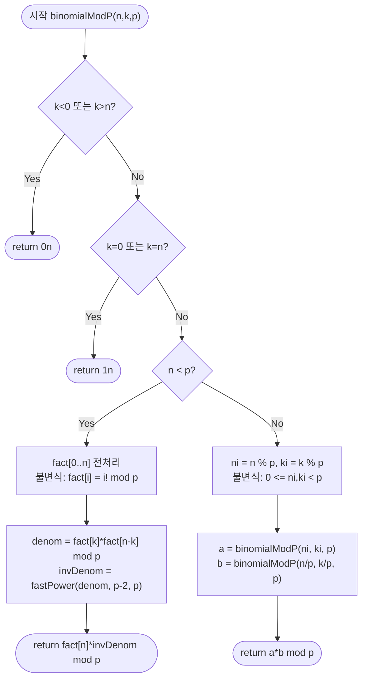

import { AlgorithmSimulation } from "#guide-sim";

# binomialModP — 나눗셈이 막히는 자리에서 곱셈으로 갈아타는 이유

## 한눈에 보는 컨셉

이항계수 $\binom{n}{k}$를 소수 $p$로 나눈 나머지를 구하는 문제예요 — 그냥 나누면 $n!$이 순식간에 거대해지고, $n \geq p$이면 $n!$ 자체가 $p$의 배수가 되어 나눗셈이 막혀 버립니다. 이 가이드는 그 막힌 나눗셈을 **모듈러 역원 곱셈**(페르마의 소정리, $n<p$일 때)과 **자릿수 분해**(Lucas 정리, $n \geq p$일 때)로 뚫는 이야기이고, 전체 비용은 "자릿수 개수"와 "자릿수 하나당 처리 비용"의 곱으로 정해집니다(정확한 식은 코드를 본 뒤 정리할게요).

## 출발점: 가장 순진한 방법부터

문제를 먼저 정확히 잡고 갈게요.

```ts
function binomialModP(n: bigint, k: bigint, p: bigint): bigint
```

- `n` — 전체 원소 수, $n \geq 0$인 bigint
- `k` — 선택할 원소 수, $k \geq 0$인 bigint
- `p` — 소수 모듈러, $p \geq 2$인 bigint (반드시 소수)
- 반환값 — $\binom{n}{k} \bmod p$, 범위는 $[0, p)$

엣지 케이스도 미리 고정해 둡니다. `k < 0n`이거나 `k > n`이면 뽑을 방법 자체가 없으니 `0n`, `k = 0n`이거나 `k = n`이면 "전부 뽑거나 하나도 안 뽑는" 경우라 `1n`이에요. $n$이 $p$보다 클 수 있다는 점이 이 문제를 까다롭게 만드는 지점입니다 — 미리 기억해 두세요.

이항계수는 정의 그대로 옮기면 제일 먼저 떠오르는 방법이 있습니다. $\binom{n}{k} = n! / (k!(n-k)!)$을 **정수 그대로** 계산한 다음 마지막에 `% p`를 취하는 거예요.

```ts
function binomialModPNaive(n: bigint, k: bigint, p: bigint): bigint {
  function factorial(n: bigint): bigint {
    let result = 1n;
    for (let i = 2n; i <= n; i++) result *= i;
    return result;
  }
  if (k < 0n || k > n) return 0n;
  return (factorial(n) / (factorial(k) * factorial(n - k))) % p;
}
```

$\binom{n}{k}$는 항상 정수이므로 이 나눗셈 자체는 수학적으로 정확합니다. 문제는 크기예요.

```text
30!  =  265252859812191058636308480000000     ( 33 자리)
100! 은                                        (158 자리)
1000! 은                                       (2568 자리)

n이 커질수록 자릿수가 거의 선형으로 늘고,
그 큰 수끼리의 곱셈·나눗셈 비용도 함께 늘어난다  →  n = 10^5 근처만 가도 사실상 처리 불가
```

경쟁 프로그래밍에서 흔히 보는 $n \leq 10^5$, $p \approx 10^9$ 규모라면, 이 방식은 답을 구하기도 전에 시간과 메모리를 다 써버립니다.

"그럼 처음부터 `% p`를 취하면서 곱해 나가면 어떨까?" — 자연스러운 다음 생각입니다. $k!$과 $(n-k)!$은 `% p`로 유지하면서 곱해 크기 폭발은 피할 수 있어요. 그런데 나눗셈이 걸립니다. 모듈러 세계에서 나눗셈은 곱셈처럼 그냥 되지 않아요. 게다가 $n \geq p$이면 $1, 2, \ldots, n$ 안에 $p$의 배수가 반드시 하나 들어 있으므로, $n! \bmod p = 0$이 되어 버립니다.

```text
n = 7, p = 5 인 경우:
  7! = 5040,  5040 mod 5 = 0     ← 5가 7! 의 인수 중 하나(5 자체)를 포함하기 때문

0으로는 역원(division)을 정의할 수 없다 — "0으로 나누기"와 본질이 같은 상황
```

작은 값이라도 나눗셈이 완전히 막히는 지점이 생긴다는 것, 이게 두 번째 벽입니다. **"나눗셈을 곱셈으로 바꿔치기할 방법이 있을까, 그리고 애초에 나눗셈이 막히는 큰 $n$은 어떻게 처리할까?"** — 이 두 질문이 다음 절의 출발점입니다.

## 아이디어 자세히 들여다보기

### 나눗셈이 막히는 두 지점 — 수식과 그림

두 문제를 각각 어떻게 우회할지 먼저 그림으로 잡아 볼게요.

**첫 번째 우회: 나눗셈 → 모듈러 역원 곱셈.** 정수 나눗셈 $a / b$ 대신, "곱하면 $1$이 되는 짝꿍" $b^{-1}$을 찾아 $a \cdot b^{-1}$을 계산합니다.

$$b^{-1} \bmod p \;\; \text{는} \;\; b \cdot b^{-1} \equiv 1 \pmod{p} \;\; \text{을 만족하는 값}$$

```text
p = 7, b = 3 이라면?
  3 * 1 = 3,  3 * 2 = 6,  3 * 3 = 9 ≡ 2,  3 * 4 = 12 ≡ 5,  3 * 5 = 15 ≡ 1  ✓

  → 3^{-1} mod 7 = 5      (3 * 5 = 15 = 2*7 + 1)
```

확인해 볼까요? $10 / 2 = 5$인데, mod 7 세계에서는 $10 \equiv 3$, $2^{-1} \bmod 7 = 4$ ($2 \times 4 = 8 \equiv 1$)이니 $3 \times 4 = 12 \equiv 5 \pmod 7$ — 그대로 $5$가 나옵니다. 나눗셈을 "역원과의 곱셈"으로 바꿔도 답은 똑같이 나온다는 뜻이에요.

이 발상을 이항계수에 그대로 적용하면 ($n < p$인 경우에 한해):

$$\binom{n}{k} \equiv n! \cdot (k!)^{-1} \cdot ((n-k)!)^{-1} \pmod{p}$$

작은 예로 직접 채워 봅시다. $n = 5, p = 7$일 때 팩토리얼을 미리 `% 7`로 유지한 표는 이렇습니다.

```text
i     :  0   1   2   3   4   5
i!    :  1   1   2   6  24  120
i! mod7: 1   1   2   6   3    1
```

$\binom{5}{2} \bmod 7$을 구하려면 $\text{fact}[5] \cdot \text{fact}[2]^{-1} \cdot \text{fact}[3]^{-1} \bmod 7$이 필요합니다. $\text{fact}[2] = 2$의 역원은 $4$ ($2 \times 4 = 8 \equiv 1$), $\text{fact}[3] = 6$의 역원은 $6$ ($6 \times 6 = 36 \equiv 1$)입니다. 잠깐, $6 \times 6 = 36$이 진짜 $7$로 나눠 $1$이 남는지 확인해 볼까요? $36 = 5 \times 7 + 1$이니 맞습니다. 그러면 $1 \times 4 \times 6 = 24 \equiv 3 \pmod 7$이고, 실제로 $\binom{5}{2} = 10$, $10 \bmod 7 = 3$이니 정확히 일치해요.

**두 번째 우회: 큰 $n$ → 자릿수로 쪼개기.** $n \geq p$이면 위 방법 자체가 막히므로($n!$이 $0 \bmod p$), $n$을 $p$진수로 표현해 자릿수 단위의 작은 이항계수 곱으로 되돌립니다.

$$n = \sum_i n_i\, p^i, \qquad k = \sum_i k_i\, p^i \qquad (0 \le n_i, k_i < p)$$

```text
n = 7, p = 5 를 5진수로:  7 = 1*5 + 2   →  자릿수 (n_1, n_0) = (1, 2)
k = 3, p = 5 를 5진수로:  3 = 0*5 + 3   →  자릿수 (k_1, k_0) = (0, 3)

각 자릿수는 항상 p 미만이므로, 첫 번째 우회(모듈러 역원)로 바로 처리 가능
```

왜 하필 이 형태여야 할까요? 자릿수 분해 없이 $n \bmod p$만 따로 떼서 처리하면 상위 자릿수 정보($\lfloor n/p \rfloor$)가 통째로 사라져 버립니다. $p$진수 전개는 $n$ 전체를 정보 손실 없이 "각 자리가 $p$ 미만인 조각들"로 되돌리는 유일한 표준 방법이라, 조각마다 첫 번째 우회를 적용하고 남은 조각(몫)에 재귀적으로 같은 과정을 반복할 수 있습니다.

### 단서를 설명해 주는 이론 — 페르마의 소정리

첫 번째 우회, 즉 "역원을 어떻게 구하는가"를 정당화하는 이론은 이미 이름이 있습니다. **페르마의 소정리(Fermat's little theorem)**는 $p$가 소수이고 $\gcd(a, p) = 1$이면 다음이 성립한다고 말합니다.

$$a^{p-1} \equiv 1 \pmod{p}$$

양변을 $a$로 나누면(양변에 $a^{-1}$을 곱하면) $a^{p-2} \equiv a^{-1} \pmod{p}$를 얻습니다. 즉 **역원을 구하는 문제가 거듭제곱 문제로 바뀝니다.** $n < p$이면 $1, 2, \ldots, n$ 중에 $p$의 배수가 없으므로 $\gcd(n!, p) = 1$이 항상 성립합니다. $k$와 $n-k$ 역시 $n$보다 크지 않아 $p$ 미만이므로 같은 이유로 $\gcd(k!, p) = \gcd((n-k)!, p) = 1$이고, 따라서 $k!$과 $(n-k)!$의 역원이 각각 항상 존재합니다. 서로소인 두 값의 곱은 여전히 $p$와 서로소이므로, 뒤에서 $k!$과 $(n-k)!$을 먼저 곱한 `denom` 하나에만 역원을 구해도 안전합니다.

거듭제곱 $a^{p-2} \bmod p$를 지수만큼 반복 곱셈으로 구하면 $O(p)$가 걸려 다시 느려집니다. 여기서 **이진 지수법(빠른 거듭제곱)**을 씁니다 — 지수를 이진수로 보고 "제곱"과 "필요할 때만 곱하기"만 반복하면 $O(\log p)$에 끝나요.

```text
a^13 을 구한다고 하면  13 = 1101₂ = 8 + 4 + 1

a^1 -> 제곱 -> a^2 -> 제곱 -> a^4 (곱하기, 3번째 비트=1) -> 제곱 -> a^8 (곱하기, 4번째 비트=1)
                                     ↳ 누적 a^1 * a^4 * a^8 = a^13
곱셈 13번이 아니라, 제곱 4번 + 필요한 곱하기 3번 = 총 7번으로 끝난다
```

이 기법 자체(빠른 거듭제곱)를 더 깊게 보고 싶다면 이 프로젝트의 [fastPower 가이드](../fastPower/fastPower-guide.mdx)를 참고하세요. 여기서는 "지수 $e$에 대해 $O(\log e)$에 $a^e \bmod p$를 구해 주는 도구"로만 쓰면 충분합니다.

### 단서를 설명해 주는 이론 — Lucas 정리

두 번째 우회, 즉 "큰 $n$을 자릿수로 쪼개도 정말 답이 같은가"를 보장하는 이론이 **Lucas의 정리**입니다.

$$\binom{n}{k} \equiv \prod_i \binom{n_i}{k_i} \pmod{p}$$

이 등식이 왜 성립하는지, 표면만 훑지 않고 유도까지 따라가 볼게요. 이항식 $(1+x)^n$을 $\bmod p$ 세계($\mathbb{F}_p[x]$)에서 전개하는 데서 출발합니다. 소수 $p$에서는 프로베니우스 준동형성(Frobenius endomorphism)이라는 성질, $(A+B)^p \equiv A^p + B^p \pmod p$가 성립합니다 (이항 전개의 중간 항들이 모두 $\binom{p}{i}$를 계수로 갖는데, $0 < i < p$이면 $\binom{p}{i}$가 항상 $p$의 배수라서 사라지기 때문이에요). 이 성질을 반복 적용하면:

$$(1+x)^{n} = (1+x)^{n_0 + n_1 p + n_2 p^2 + \cdots} = (1+x)^{n_0} \cdot \big((1+x)^{p}\big)^{n_1} \cdot \big((1+x)^{p^2}\big)^{n_2} \cdots$$

$$\equiv (1+x)^{n_0} \cdot (1+x^p)^{n_1} \cdot (1+x^{p^2})^{n_2} \cdots \pmod p$$

이제 양변에서 $x^k$의 계수를 비교합니다. 우변에서 $x^k$ 항을 만들려면 각 인수 $(1+x^{p^i})^{n_i}$에서 $x^{k_i \cdot p^i}$ 항을 하나씩 골라 곱해야 하는데(자릿수가 겹치지 않는 진법 표현의 성질), 그 계수가 바로 $\binom{n_i}{k_i}$입니다. 이걸 모든 자릿수에 대해 곱하면 $\prod_i \binom{n_i}{k_i}$를 얻고, 이것이 좌변의 $x^k$ 계수 $\binom{n}{k}$와 같아야 하므로 등식이 증명됩니다.

재귀적으로 쓰면 이렇습니다.

$$\binom{n}{k} \equiv \binom{n \bmod p}{\,k \bmod p\,} \cdot \binom{\lfloor n/p \rfloor}{\lfloor k/p \rfloor} \pmod p$$

최하위 자릿수 $(n \bmod p, k \bmod p)$는 항상 $p$ 미만이라 앞 절의 방법(페르마 역원)으로 바로 처리되고, 나머지 $(\lfloor n/p \rfloor, \lfloor k/p \rfloor)$는 같은 문제를 더 작은 크기로 다시 풉니다 — 이게 재귀의 형태예요.

### 왜 모순 없이 작동하는가

**귀납적 정당화.** 재귀 $\binom{n}{k} \equiv \binom{n \bmod p}{k \bmod p} \cdot \binom{\lfloor n/p \rfloor}{\lfloor k/p \rfloor}$가 유한 단계 안에 끝나고, 항상 옳은 값을 낸다는 것을 보여야 합니다.

- **기저**: $n < p$이면 재귀를 멈추고 페르마 역원법으로 직접 계산합니다. 이 경우는 위에서 이미 정당화했어요($\gcd(n!, p) = 1$이 보장되므로 역원이 항상 존재).
- **귀납 단계**: $n \geq p$인 모든 경우는 정확히 "$n \bmod p$가 만드는 항"과 "$\lfloor n/p \rfloor$가 만드는 항"의 곱, 이 한 가지 형태로만 분해됩니다(Lucas 정리가 이 곱셈 등식을 보장하므로, 재귀가 이 두 항의 곱 이외의 값으로 갈 일이 없습니다). 두 재귀 호출 중 $n \bmod p$ 쪽은 항상 $p$ 미만이라 즉시 기저 사례로 떨어지고, $\lfloor n/p \rfloor$ 쪽만 실제로 다시 작아지며 재귀를 이어갑니다 — 이 쪽 인자가 매 단계 최소 $1/p$ 수준으로 줄어들므로($\lfloor n/p \rfloor < n$), **재귀 깊이**는 정확히 $\lfloor \log_p n \rfloor + 1$입니다. 깊이마다 두 번째 인자 호출이 하나씩 따라붙으므로, **총 호출 수**는 재귀 깊이에 비례하는 $O(\log_p n)$개입니다(깊이와 혼동하기 쉬운 지점이라 구분해 둡니다).

두 조건을 합치면 모든 $n, k$에 대해 유한 단계 안에 정확한 값이 계산된다는 것이 증명돼요. 여기에 한 가지만 덧붙이면 완전해집니다 — 자릿수 하나라도 $k_i > n_i$이면 그 자리의 지역 이항계수 $\binom{n_i}{k_i}$가 (전역 경계조건과 같은 이유로) $0$이 되고, 전체 값은 자릿수별 곱 $\prod_i \binom{n_i}{k_i}$이므로 인수 하나가 $0$이면 전체도 즉시 $0$이 됩니다. 뒤의 실행 시각화에서 보게 될 "carry" 상황이 바로 이 경우예요.

여기서 **헷갈리기 쉬운 포인트**가 셋 있습니다.

- **"$n \geq p$인데 Lucas를 빼먹고 그냥 페르마 역원법만 쓰면?"** 코드에서 분기 조건을 실수로 빠뜨리면 조용히 틀린 값이 나옵니다. $n = 10, k = 3, p = 7$일 때 실제 정답은 $\binom{10}{3} = 120$, $120 \bmod 7 = 1$이에요. 그런데 Lucas 분기 없이 $n < p$ 경로로 그냥 밀어붙이면 $10! \bmod 7 = 0$이 되어 최종 결과가 $0$으로 나옵니다(실측 확인 완료) — $0$은 유효한 값처럼 보이지만 완전히 틀린 답입니다.

```text
정상 경로(Lucas 적용):     binomialModP(10, 3, 7) = 1   ✓ (Lucas: C(3,3)*C(1,0) = 1*1 = 1)
Lucas 생략(버그):          10! mod 7 = 0  →  0 * inv(...) * inv(...) = 0   ✗ (정답 1과 다름)
```

- **fact 배열은 반드시 bigint로 유지해야 합니다.** `number[]`로 바꾸면 팩토리얼 자체보다 **거듭제곱 도중의 제곱 연산**(`b = b * b % mod`)에서 문제가 생겨요. $b$가 $p$에 가까운 값(예: $10^9$ 근처)이면 $b \times b$는 약 $10^{18}$인데, JS `Number`의 안전 정수 범위는 $2^{53} \approx 9 \times 10^{15}$뿐이라 정밀도가 깨집니다. 실제로 `fastPower(123456789, p-2, p)`를 `p = 10^9+7`로 계산하면, BigInt 버전은 `18633540`을 내놓지만 Number 버전은 `940527808`이라는 **다른 값**을 냅니다(실측 확인 완료) — 둘 중 하나가 아니라 아예 다른 답이라는 점이 무섭습니다.
- **$p$가 반드시 소수여야 합니다.** 페르마의 소정리도, Lucas 정리도 $p$가 소수라는 전제 위에서만 성립합니다. $p$가 합성수면 $\gcd(a, p) \neq 1$인 $a$가 존재할 수 있어 역원이 아예 없는 경우가 생겨요. 합성수 $p$를 다뤄야 한다면 이 가이드의 접근을 그대로 쓸 수 없고, 소인수별로 나눠 중국인의 나머지 정리(CRT)로 합치거나 소인수의 거듭제곱에 대한 별도 처리(p-adic valuation 계열)가 필요합니다 — 여기서는 그 경계만 짚어 둘게요.

엣지 케이스도 이 틀 위에서 점검해 둘게요.

```text
k < 0 또는 k > n        → 0 (재귀 진입 전에 즉시 반환)
k = 0 또는 k = n        → 1 (재귀 진입 전에 즉시 반환)
n = 0, k = 0            → 1 (위 규칙에 그대로 포함)
p = 2                    → Lucas로 정상 처리: C(5,2) mod 2 = 0, C(6,2) mod 2 = 1 (실측 확인)
                           (p=2 기저 사례의 n,k는 항상 0 또는 1이라 fact 값이 늘 1 → 역원 계산이 자명하게 성립)
n, k 모두 매우 큰 bigint → Lucas 재귀 깊이 O(log_p n) 안에서 종료
```

> 기억법: 나눗셈이 막히면 곱셈으로, 자릿수가 크면 조각으로 — **"나눌 수 없으면 곱하고, 자르지 못하면 쪼갠다."**

## 아이디어를 코드로 옮기기

앞 절 아이디어를 그대로 옮긴 기본 구현입니다.

```ts
function fastPower(base: bigint, exp: bigint, mod: bigint): bigint {
  let result = 1n;
  let b = ((base % mod) + mod) % mod;
  let e = exp;
  while (e > 0n) {
    if (e & 1n) result = (result * b) % mod;
    b = (b * b) % mod;
    e >>= 1n;
  }
  return result;
}

function binomialModP(n: bigint, k: bigint, p: bigint): bigint {
  if (k < 0n || k > n) return 0n;
  if (k === 0n || k === n) return 1n;

  if (n < p) {
    const fact: bigint[] = [1n];
    for (let i = 1n; i <= n; i++) {
      fact.push((fact[Number(i - 1n)]! * i) % p);
    }
    const invK = fastPower(fact[Number(k)]!, p - 2n, p);
    const invNK = fastPower(fact[Number(n - k)]!, p - 2n, p);
    return ((fact[Number(n)]! * invK) % p) * invNK % p;
  }

  const ni = n % p;
  const ki = k % p;
  return (binomialModP(ni, ki, p) * binomialModP(n / p, k / p, p)) % p;
}
```

**가장 실수가 잦은 줄은 `if (n < p)`로 분기하는 첫 줄입니다.** 이 조건이 페르마 역원법(기저 사례)과 Lucas 재귀(귀납 단계)를 가르는 유일한 경계예요. 그 외에 눈여겨볼 지점:

- `fact` 배열은 `fact[0] = 1n`에서 시작해 `fact[i] = fact[i-1] * i % p`로 채웁니다. 이 불변식 — "`fact[i]`는 항상 `i! mod p`" — 이 무너지면 이후 모든 계산이 틀어집니다.
- `k === 0n || k === n` 조기 반환이 `n < p` 분기보다 **먼저** 옵니다. 그렇지 않으면 `n = k = 0`일 때 길이 1짜리 `fact` 배열조차 없이 `fact[0]`을 참조하는 등 불필요한 경계 처리가 늘어나요.
- 재귀 호출 `binomialModP(n / p, k / p, p)`의 `n / p`는 bigint 나눗셈이라 자동으로 내림(`Math.floor`) 처리됩니다 — $\lfloor n/p \rfloor$를 그대로 얻는 이유입니다.
- `fact[Number(i - 1n)]`처럼 배열 인덱싱에서 `bigint`를 `Number()`로 변환합니다. 이 변환은 `p`(따라서 기저 사례의 `n`)가 JS 배열 인덱스로 안전한 범위일 때만 유효합니다 — 다만 실용적으로 큰 제약은 아닙니다, $p$가 그 정도로 크면 뒤에서 볼 `fact` 배열 생성 비용 자체가 이미 감당 불가능한 수준이라 이 구현을 쓸 수 없는 상황이기 때문이에요.

이 구현을 실행하면 $\binom{5}{2} \bmod 7 = 3$, $\binom{7}{3} \bmod 5 = 0$ 모두 앞 절의 손 계산과 정확히 일치합니다(실측 확인 완료).

## 더 빠르게 만들 단서 찾기

기저 사례 코드를 다시 봅시다. `fastPower`를 **두 번** 호출하고 있어요 — `invK`를 구할 때 한 번, `invNK`를 구할 때 한 번. 두 호출 모두 지수가 똑같이 `p - 2n`입니다.

```text
invK  = fastPower(fact[k],   p-2, p)   →  제곱 연산 ~log2(p)번
invNK = fastPower(fact[n-k], p-2, p)   →  제곱 연산 ~log2(p)번
                                           합계 ~ 2 * log2(p)번
```

그런데 역원의 성질을 떠올려 보면, $(a \cdot b)^{-1} \equiv a^{-1} \cdot b^{-1} \pmod p$입니다. 페르마의 소정리로 풀어 쓰면 $(ab)^{p-2} \equiv a^{p-2} \cdot b^{p-2} \pmod p$— **같은 지수 $p-2$를 base만 바꿔 두 번 거듭제곱하는 대신, base를 먼저 곱해 놓고 한 번만 거듭제곱해도 똑같은 값**이 나온다는 뜻이에요. 지수 길이(따라서 반복 횟수)는 그대로지만, 호출 자체가 절반으로 줄어듭니다.

## 단서를 최적화로 연결하기

`fact[k]`와 `fact[n-k]`를 먼저 곱해 하나의 분모로 만든 다음, 그 값 하나에만 `fastPower`를 적용합니다.

```text
Before:  invK = fastPower(fact[k], p-2, p)         (제곱 ~log2(p)번)
         invNK = fastPower(fact[n-k], p-2, p)       (제곱 ~log2(p)번)
         result = fact[n] * invK % p * invNK % p    → fastPower 호출 2회

After:   denom = fact[k] * fact[n-k] % p
         invDenom = fastPower(denom, p-2, p)         (제곱 ~log2(p)번, 1회뿐)
         result = fact[n] * invDenom % p             → fastPower 호출 1회
```

불변식은 그대로예요 — `denom`은 여전히 "분모 전체를 `mod p`로 묶은 값"이고, `invDenom`은 그 값의 역원입니다. 바뀌는 건 "역원을 몇 번 구하느냐"뿐, 수학적으로 얻는 값은 완전히 동일합니다.

## 최적화 코드

기저 사례에서 바뀌는 부분만 보면 이렇습니다.

```ts
// Before
const invK = fastPower(fact[Number(k)]!, p - 2n, p);
const invNK = fastPower(fact[Number(n - k)]!, p - 2n, p);
return ((fact[Number(n)]! * invK) % p) * invNK % p;

// After
const denom = (fact[Number(k)]! * fact[Number(n - k)]!) % p; // 분모를 먼저 합친다
const invDenom = fastPower(denom, p - 2n, p);                // fastPower 호출 1회로 통합
return (fact[Number(n)]! * invDenom) % p;
```

**가장 중요한 줄은 `denom = fact[k] * fact[n-k] % p`입니다.** 여기서 곱하는 순서를 바꿔 `fact[n] * fact[k]`처럼 엉뚱한 값을 묶으면, `fastPower`가 완전히 다른(그리고 틀린) 역원을 계산하게 됩니다 — 실행은 되지만 조용히 답이 틀리는 전형적인 사례예요.

실측으로 확인한 효과는 이렇습니다. $\binom{10}{3} \bmod (10^9+7)$을 계산할 때, 최적화 전은 `fastPower` 호출 2회에 제곱 연산 총 60회, 최적화 후는 호출 1회에 제곱 연산 30회입니다(실측 확인 완료) — 호출 횟수 기준 정확히 2배 줄었습니다.

> 기억법: **"따로 뒤집지 말고, 합쳐서 한 번만 뒤집는다."**

더 최적화할 여지가 있을까요? **이 함수, 이 접근 범위 안에서는** 단일 쿼리 기준으로 더 손댈 곳이 많지 않습니다. 자릿수 개수 $O(\log_p n)$은 $n$을 $p$진수로 표현하는 데 필요한 최소 자릿수라 줄일 수 없고, 자릿수 하나의 역원 계산도 이진 지수법으로 이미 $O(\log p)$에 도달해 있습니다. 다만 자릿수 하나를 처리할 때마다 `fact` 배열을 그 자릿수 값만큼 매번 다시 채우는 부분(비용 $O(n_i)$, 최악 $O(p)$)은 그대로 남아 있어서, $p$가 크면(경쟁 프로그래밍에서 흔한 $p \approx 10^9$ 규모) 이 부분이 전체 비용을 지배하게 됩니다. 다만 **동일한 $p$에 대해 쿼리가 여러 번 들어오는 상황**이라면 이야기가 다릅니다 — 팩토리얼 배열과 역팩토리얼 배열(`invFact[i] = (i!)^{p-2} mod p`)을 단 한 번만 전처리해 두면, 이후 각 쿼리는 `fact` 재구성 없이 자릿수마다 상수 시간 곱셈만 하면 되어 쿼리당 `O(log_p n)`까지 떨어지는 특화 최적화가 존재합니다(자릿수를 훑는 비용 자체는 여전히 쿼리마다 남습니다). 이 가이드가 다루는 함수 시그니처는 매번 독립적인 단일 쿼리이므로, 이 확장은 방향만 짚어 두고 여기서 최적화를 마칩니다.

정리하면, 자릿수 하나를 처리하는 비용은 그 자릿수 값 $n_i$만큼 `fact` 배열을 채우는 $O(n_i)$(최악 $O(p)$)에 페르마 역원의 $O(\log p)$를 더한 값이고, 자릿수 개수가 $O(\log_p n)$개이므로 전체는 `O(log_p n · (p + log p))`가 걸립니다 — "한눈에 보는 컨셉"에서 예고했던 "자릿수 개수 × 자릿수당 비용"의 곱 그대로입니다.

## 실행 시각화

고정 입력 `n = 7n`, `k = 3n`, `p = 5n`(즉 `C(7,3) mod 5`)에 대해 `binomialModP`를 실행하는 과정입니다. $n = 7 \geq p = 5$이므로 Lucas 정리로 자릿수별 분해가 일어나요. 아래 패널의 `entries`는 각 단계에서 확인한 인자와 중간값을 라벨-값 쌍으로 보여줍니다. 실제 반환값은 `0n`이며, `C(7,3) = 35 = 5 * 7`이므로 `35 mod 5 = 0`과 정확히 일치합니다(실측 확인 완료).

> 대화형 시뮬레이션은 MDX 런타임에서 표시됩니다.

export const steps = [
  {
    title: "호출 binomialModP(7, 3, 5)",
    detail: "k=3 은 0<=k<=n 범위, 0/n 도 아님. n=7 >= p=5 → Lucas 정리 적용.",
    entries: [
      { label: "n, k, p", value: "7, 3, 5" },
      { label: "k > n?", value: "false" },
      { label: "n < p?", value: "false (Lucas)" },
    ],
  },
  {
    title: "Lucas 자릿수 분해",
    detail: "ni = 7 mod 5 = 2, ki = 3 mod 5 = 3. 상위: n/p=1, k/p=0. 두 서브문제로 분해.",
    entries: [
      { label: "ni = 7 mod 5", value: 2 },
      { label: "ki = 3 mod 5", value: 3 },
      { label: "n/p", value: 1 },
      { label: "k/p", value: 0 },
    ],
  },
  {
    title: "서브호출 a = binomialModP(2, 3, 5)",
    detail: "k=3 > n=2 → 경계 조건. C(2,3) = 0. 이 자릿수에서 carry 발생 → 전체가 0이 됨.",
    entries: [
      { label: "n, k, p", value: "2, 3, 5" },
      { label: "k > n?", value: "true" },
      { label: "반환 a", value: 0 },
    ],
  },
  {
    title: "서브호출 b = binomialModP(1, 0, 5)",
    detail: "k=0 → C(1,0) = 1. 기저 사례 도달.",
    entries: [
      { label: "n, k, p", value: "1, 0, 5" },
      { label: "k = 0?", value: "true" },
      { label: "반환 b", value: 1 },
    ],
  },
  {
    title: "결과 합성",
    detail: "C(7,3) ≡ a * b = 0 * 1 = 0 (mod 5). 한 자릿수라도 ki > ni 면 전체가 0.",
    entries: [
      { label: "a", value: 0 },
      { label: "b", value: 1 },
      { label: "a * b mod 5", value: 0 },
    ],
  },
  {
    title: "완료: return 0n",
    detail: "C(7,3) = 35 = 5 * 7 이므로 5로 나누어떨어진다. 검증: 35 mod 5 = 0.",
    entries: [
      { label: "결과", value: 0 },
      { label: "검증 C(7,3) mod 5", value: 0 },
    ],
  },
];

<AlgorithmSimulation view="keyValue" steps={steps} title="binomialModP: C(7,3) mod 5 (Lucas)" />

## 흐름 한눈에 보기



## 스스로 점검하기

1. `binomialModP(6n, 3n, 7n)`을 손으로 따라가 보세요. `n=6 < p=7`이므로 페르마 역원 경로를 탑니다. `fact` 배열을 직접 채우고 최종값을 구해 보세요. (힌트: $\binom{6}{3} = 20$, $20 \bmod 7 = 6$이 정답입니다.)
2. "왜 모순 없이 작동하는가"에서 본 것처럼, `n = 10, k = 3, p = 7`에서 실수로 `n < p` 분기(Lucas 생략)를 타면 어떤 값이 나오는지, 그리고 왜 정답 `1n`과 다른지 짚어 보세요. (힌트: `10! mod 7`이 왜 `0`이 되는지부터 확인하세요.)
3. 이 함수가 같은 `p`에 대해 `Q`번 반복 호출된다면, "최적화 코드" 절 끝에서 언급한 역팩토리얼 배열 전처리를 어떻게 적용해야 쿼리당 `fact` 재구성 비용을 없애고 `O(log_p n)`으로 떨어뜨릴 수 있을까요? `invFact[n] = fastPower(fact[n], p-2, p)`를 구한 뒤 `invFact[i-1] = invFact[i] * i % p`로 거꾸로 채울 수 있다는 점에서 출발해 보세요.
