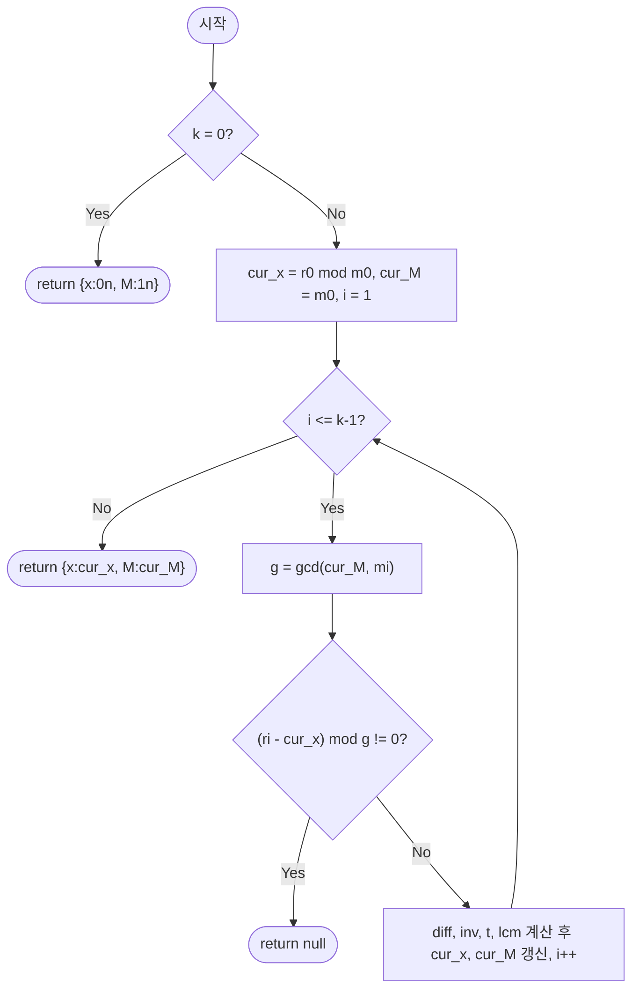

import { AlgorithmSimulation } from "#guide-sim";

# crt — 두 합동식을 대수적으로 접으면 후보를 하나도 나열하지 않는 이유

## 한눈에 보는 컨셉

"$x$는 3으로 나누면 2가 남고, 5로 나누면 3이 남는다" 같은 조건 여러 개를 동시에 만족하는 정수 $x$를 찾는 문제예요. 후보를 하나씩 나열하며 확인하면 주기 $M$(각 나머지의 최소공배수)만큼 걸리는데, $M$은 조건이 늘어날수록 곱셈적으로 폭발합니다. 대신 조건을 **두 개씩 짝지어 대수적으로 합치면**(확장 유클리드 호제법 1회로) 후보를 단 하나도 세지 않고 `O(log min(m_1, m_2))`에 새 합동식 하나로 압축할 수 있고, 이를 $k-1$번 반복하면 전체가 `O(k log M)`에 끝납니다.

## 출발점: 가장 순진한 방법부터

문제를 정확히 잡을게요.

```ts
function crt(
  remainders: bigint[],
  moduli: bigint[],
): { x: bigint; M: bigint } | null
```

`remainders = [r_1, ..., r_k]`와 `moduli = [m_1, ..., m_k]`가 주어지면, 연립 합동식

$$x \equiv r_1 \pmod{m_1},\quad x \equiv r_2 \pmod{m_2},\quad \ldots,\quad x \equiv r_k \pmod{m_k}$$

을 모두 만족하는 $0 \leq x < M$인 **가장 작은 해** $x$와 그 주기 $M = \mathrm{lcm}(m_1, \ldots, m_k)$를 `{ x, M }` 형태로 반환합니다. 조건들이 서로 모순되면 `null`을 반환해요. 제약은 각 $m_i \geq 1$(bigint), 실용 범위로 $m_i \leq 10^{18}$까지 다룰 수 있어야 하고, 모듈러들이 반드시 서로소일 필요는 없습니다(일반 CRT).

가장 정직한 방법은 뭘까요? "$x \equiv r_1 \pmod{m_1}$을 만족하는 후보를 하나씩 만들면서, 나머지 조건도 맞는지 확인한다"는 접근이 제일 자연스러워요. 코드로 옮기면 이렇습니다.

```ts
function crtNaive(
  remainders: bigint[],
  moduli: bigint[],
): { x: bigint; M: bigint } | null {
  const k = remainders.length;
  if (k === 0) return { x: 0n, M: 1n };

  const gcd = (a: bigint, b: bigint): bigint => (b === 0n ? a : gcd(b, a % b));
  const M = moduli.reduce((acc, m) => (acc * m) / gcd(acc, m), 1n); // 실제 해가 존재하는 주기(lcm)

  const m0 = moduli[0]!;
  const r0 = ((remainders[0]! % m0) + m0) % m0;

  for (let x = r0; x < M; x += m0) { // 첫 조건을 만족하는 후보만 순서대로 생성
    let ok = true;
    for (let i = 1; i < k; i++) {
      const want = ((remainders[i]! % moduli[i]!) + moduli[i]!) % moduli[i]!;
      if (((x % moduli[i]!) + moduli[i]!) % moduli[i]! !== want) {
        ok = false;
        break;
      }
    }
    if (ok) return { x, M }; // 나머지 조건까지 모두 만족하는 첫 후보
  }
  return null; // 주기까지 다 봤는데 못 찾았다 → 모순
}
```

작은 예로 직접 나열해 봅시다. `x ≡ 2 (mod 3)`, `x ≡ 3 (mod 5)`를 풀 때, 첫 조건을 만족하는 후보를 순서대로 만들며 두 번째 조건을 확인합니다.

```text
후보(3으로 나누면 2 남음):  2    5    8
mod 5 확인:                 2%5=2✗  5%5=0✗  8%5=3✓ → x=8
```

세 개면 세 번 만에 끝났으니 괜찮아 보이죠? 문제는 조건 개수 $k$가 늘어날 때입니다. 모듈러가 서로 다른 소수들이면 $M$은 그 소수들의 곱이라 **조건 하나가 늘 때마다 곱셈으로 불어납니다**.

```text
소수를 하나씩 곱하며 M 누적:
  2 → 6 → 30 → 210 → 2,310 → 30,030 → 510,510 → 9,699,690 → 223,092,870 → 6,469,693,230
  (조건 10개, 각 소수 ≤ 29인데도 M이 이미 64억을 넘는다)
```

`crtNaive`의 바깥 루프가 `x < M`까지 도는 이상, $M$이 이 정도만 돼도 실행 자체가 불가능해집니다. 게다가 루프 한 번마다 남은 $k-1$개 조건을 검사하니, 총 비용은 단순히 "$M$번"이 아니라 $O(kM)$ 규모로 커집니다. 여기에 더해 문제 제약은 $m_i \leq 10^{18}$까지 허용하니 $M$은 지수적으로, 사실상 무한히 커질 수 있어요. **"후보를 나열하지 않고 두 조건을 그 자리에서 하나로 합칠 수는 없을까?"** — 이것이 다음 절의 출발 단서입니다.

## 아이디어 자세히 들여다보기

### 합동식 두 개를 하나로 접기 — 수식과 그림

핵심 상태를 $(x_\text{cur}, M_\text{cur})$ 쌍으로 정의할게요. 의미는 "지금까지 처리한 조건들을 동시에 만족하는 유일한 해가 $x \equiv x_\text{cur} \pmod{M_\text{cur}}$이다"입니다. 왜 이 형태여야 할까요? 조건을 하나씩 늘려 나가려면, 지금까지 본 조건들의 정보를 **압축된 단일 합동식 하나**로 들고 있어야 다음 조건과 다시 합칠 수 있기 때문이에요(개별 조건을 리스트로 쌓아 두면 매번 전부 다시 확인해야 합니다).

두 합동식 $x \equiv r_1 \pmod{m_1}$과 $x \equiv r_2 \pmod{m_2}$를 합치는 `merge` 연산을 정의합니다.

$$\begin{cases} x \equiv r_1 \pmod{m_1} \\ x \equiv r_2 \pmod{m_2} \end{cases} \;\Longrightarrow\; x \equiv x_\text{new} \pmod{\mathrm{lcm}(m_1, m_2)}$$

유도는 이렇습니다. 첫 조건의 해를 $x = r_1 + m_1 t$로 매개변수화하면($t$는 정수), 두 번째 조건은

$$r_1 + m_1 t \equiv r_2 \pmod{m_2} \quad\Longrightarrow\quad m_1 t \equiv r_2 - r_1 \pmod{m_2}$$

라는 **$t$에 대한 선형 합동식**으로 바뀝니다. $g = \gcd(m_1, m_2)$라 하면, 이 식이 풀리는 필요충분조건은 $g \mid (r_2 - r_1)$이에요. 조건을 만족하면 양변을 $g$로 나눠 $\gcd(m_1/g,\, m_2/g) = 1$인 식으로 정리합니다. 나눗셈이 왜 그대로 통하냐면, $m_1 t \equiv r_2-r_1 \pmod{m_2}$는 곧 어떤 정수 $c$에 대해 $m_1 t - (r_2-r_1) = c\, m_2$라는 뜻인데, $g$가 $m_1$, $r_2-r_1$, $m_2$ 세 항 모두를 나누어떨어뜨리니 양변을 $g$로 나눈 $\frac{m_1}{g} t - \frac{r_2-r_1}{g} = c\, \frac{m_2}{g}$도 정수 등식으로 그대로 성립하고, 이건 정확히 $\bmod\, (m_2/g)$에서의 합동식이에요.

$$\frac{m_1}{g}\, t \equiv \frac{r_2 - r_1}{g} \pmod{\frac{m_2}{g}}$$

$m_1/g$와 $m_2/g$가 서로소이므로 $m_1/g$는 $\bmod\, (m_2/g)$에서 역원 $u$를 가지고(다음 절에서 이 역원을 구하는 법을 봅니다), $t_0 = \dfrac{r_2-r_1}{g}\, u \bmod \dfrac{m_2}{g}$가 유일한 해가 됩니다. 최종적으로

$$x_\text{new} = \big(r_1 + m_1\, t_0\big) \bmod \mathrm{lcm}(m_1, m_2)$$

이 $x_\text{new}$가 왜 진짜 답인지 확인해 둘게요. 첫째, $x_\text{new} = r_1 + m_1 t_0 \equiv r_1 \pmod{m_1}$이니 첫 조건은 정의상 그대로 만족됩니다. 둘째, $t_0$가 방금 유도한 선형 합동식을 풀었으므로 $x_\text{new} \equiv r_1 + (r_2-r_1) = r_2 \pmod{m_2}$로 두 번째 조건도 만족해요. 셋째, 유일성은 이렇게 봅니다 — 다른 해 $x'$이 있다면 $x' - x_\text{new}$는 $m_1$의 배수이면서 동시에 $m_2$의 배수이니 $\mathrm{lcm}(m_1, m_2)$의 배수이고, 즉 $x' \equiv x_\text{new} \pmod{\mathrm{lcm}(m_1, m_2)}$입니다.

작은 예로 직접 채워 봅시다. `x ≡ 2 (mod 3)`, `x ≡ 3 (mod 5)`를 합치면:

```text
x = 2 + 3t 로 놓는다
2 + 3t ≡ 3 (mod 5)  →  3t ≡ 1 (mod 5)
g = gcd(3,5) = 1 → 1 | 1 이므로 해 존재
3⁻¹ (mod 5) = 2  (3×2 = 6 ≡ 1)
t = 1 × 2 mod 5 = 2
x_new = 2 + 3×2 = 8,  lcm(3,5) = 15
검증: 8 mod 3 = 2 ✓,  8 mod 5 = 3 ✓
```

잠깐, 확인 하나만 해 볼까요? 같은 두 조건을 `x = 3 + 5t`로(순서를 뒤집어) 매개변수화해도 답이 같을지 궁금하지 않나요? 실제로 계산해 보면 `3 + 5t ≡ 2 (mod 3)` → `2t ≡ -1 ≡ 2 (mod 3)` → `t ≡ 1 (mod 3)` → `x = 3 + 5×1 = 8`로, 정확히 같은 `x = 8`이 나옵니다. **두 조건을 어느 쪽 기준으로 매개변수화하든, 합쳐진 결과 합동식 자체는 같다**는 뜻이에요.

### 단서를 설명해 주는 이론 — 확장 유클리드 호제법과 모듈러 역원

방금 유도에서 "$m_1/g$의 $\bmod\,(m_2/g)$ 역원 $u$를 구한다"는 부분이 등장했죠. 이걸 일반 이론으로 승격해 봅시다.

**베주 항등식(Bézout's identity)**: 정수 $a, b$에 대해 $g = \gcd(a, b)$라 하면, $ax + by = g$를 만족하는 정수 $x, y$가 항상 존재합니다. **확장 유클리드 호제법**은 유클리드 호제법으로 $\gcd$를 구하는 재귀를 거꾸로 되짚으며 이 $x, y$를 함께 계산합니다.

```text
gcd(3, 5) 계산 과정을 거꾸로:
  5 = 1×3 + 2
  3 = 1×2 + 1
  2 = 2×1 + 0        → gcd = 1

거꾸로 대입(뒤에서부터 앞 나머지를 치환):
  1 = 3 - 1×2
  1 = 3 - 1×(5 - 1×3) = 2×3 - 1×5
  → x=2, y=-1,  즉 2×3 + (-1)×5 = 1
```

이제 $ax + by = g$에서 $g=1$이고 $b=5$이면, 양변을 $\bmod\, 5$로 보면 $ax \equiv 1 \pmod 5$가 되어 **$x$가 곧 $a$의 $\bmod\, 5$ 역원**이 됩니다. 위 결과에서 $x=2$이니 $3^{-1} \equiv 2 \pmod 5$ — 바로 앞 절에서 손으로 확인한 값과 정확히 같아요. 이 알고리즘은 재귀 한 단계당 나눗셈 한 번이라 $O(\log \min(m_1, m_2))$에 끝납니다(일반 유클리드 호제법과 같은 재귀 횟수).

`merge` 연산이 확장 유클리드에 의존하는 지점은 "$m_1/g$의 $\bmod\,(m_2/g)$ 역원 $u$를 구하는" 곳입니다. 이론적으로는 확장 유클리드 호제법 한 번으로 $\gcd$와 베주 계수를 동시에 얻을 수 있지만, 뒤에서 볼 코드는 역할을 나눕니다 — "$g \mid (r_2-r_1)$인지" 판정에 필요한 $g$ 자체는 `gcdBig`로 먼저 구하고, `extendedEuclidean(m1/g, m2g)`는 그다음 역원 계산에만 씁니다. (참고로 이 프로젝트에는 확장 유클리드 호제법 자체만 다루는 [extendedEuclidean 가이드](../extendedEuclidean/extendedEuclidean-guide.mdx)도 있습니다.)

### 왜 모순 없이 작동하는가

이 알고리즘이 옳다는 것을 귀납으로 보일게요.

**기저 사례($k=1$)**: 조건이 하나뿐이면 $x_\text{cur} = r_1 \bmod m_1$, $M_\text{cur} = m_1$이 유일한 해입니다. 자명하게 성립해요.

**귀납 가정**: $i-1$개 조건까지 처리한 $(x_\text{cur}, M_\text{cur})$가 "그 $i-1$개 조건을 동시에 만족하는 정수 전체의 집합"을 정확히 $x \equiv x_\text{cur} \pmod{M_\text{cur}}$로 표현한다고 하자.

**귀납 단계($i$번째 조건 추가)**: $i$번째 조건 $x \equiv r_i \pmod{m_i}$를 `merge(x_cur, M_cur, r_i, m_i)`로 합칩니다. 이때 벌어질 수 있는 경우는 정확히 둘뿐이에요 — $g = \gcd(M_\text{cur}, m_i)$가 $(r_i - x_\text{cur})$를 나누거나, 나누지 않거나. 이 둘 말고 세 번째 경우는 없습니다(정수 나눗셈 가능 여부는 이분법적이니까요). 나누지 않으면 두 조건을 동시에 만족하는 정수가 존재하지 않는다는 뜻이라 `null`이 정확한 답이고, 나누면 앞 절의 선형 합동식 이론에 의해 $x_\text{new} \bmod \mathrm{lcm}(M_\text{cur}, m_i)$가 **유일한** 해가 됩니다. 두 경우 모두 처리했으니 경우의 완전성이 성립하고, 각 경우의 결과가 정확히 옳으니 귀납이 완성됩니다.

여기서 **헷갈리기 쉬운 포인트**가 있습니다. "조건을 합치는 순서를 바꾸면 최종 답도 달라지지 않을까?"라는 의심이에요. 그렇지 않습니다 — `merge`는 매번 "지금까지의 조건을 전부 만족하는 집합"과 "새 조건"의 교집합을 구하는 연산이고, 집합의 교집합은 순서에 무관합니다. 실제로 확인해 볼까요?

```text
x≡2(mod3), x≡3(mod5), x≡2(mod7) 을 순서 (3,5,7)로 합치면 → x=23, M=105
같은 세 조건을 순서 (5,7,3)으로 합쳐도             → x=23, M=105
같은 세 조건을 순서 (7,3,5)으로 합쳐도             → x=23, M=105  (중간 x_cur 값은 다르지만 최종은 동일)
```

또 하나 헷갈리기 쉬운 포인트는 **정규화를 안 하면 정말 "틀린" 해가 나오는가**입니다. 결론부터 말하면 아닙니다 — 정규화는 계약이 약속한 범위($0 \le x < M$)를 지키기 위한 장치이지, 합동식 자체를 참으로 만들어 주는 장치가 아니에요. `diff`, `t`가 음수인 대표값인 채로 계산을 이어가도 이후 연산이 나머지류(congruence class)를 그대로 보존하기 때문에, 마지막에 `lcm`으로 한 번만 정규화하면 여전히 같은 해가 나옵니다.

```text
r1=1, m1=3, r2=0, m2=5 를 합치는 상황 (계약상 정답: x=10, M=15)

diff·t 중간 정규화만 생략(부호 그대로 곱셈), 마지막 xNew 정규화는 유지:
  diff = (0-1)/1 = -1,  t = -1 × 2 = -2 (중간 정규화 없이)
  xNew = ((1 + 3×(-2)) mod 15 + 15) mod 15 = 10   ✓ (마지막 정규화 하나면 여전히 정답)

마지막 xNew 정규화까지 생략하면:
  xNew = (1 + 3×(-2)) mod 15 = -5
  검증해 보면 -5 mod 3 = 1, -5 mod 5 = 0으로 합동식 자체는 여전히 참입니다.
  다만 -5는 "0 ≤ x < 15인 가장 작은 해"라는 반환 계약을 어깁니다.
```

즉 세 정규화 중 계약 위반을 실제로 막는 지점은 **마지막 `xNew` 정규화** 하나뿐이고, `diff`·`t` 정규화는 중간값을 항상 `[0, m2g)` 범위에 묶어 디버깅과 가독성을 편하게 해 주는 안전장치입니다.

엣지 케이스도 이 불변식 위에서 그대로 성립하는지 점검해 둡니다.

```text
k = 0 (빈 연립식)     → 관례상 { x: 0n, M: 1n } (아무 조건도 없으니 모든 x가 해, 최솟값 0)
k = 1                → merge를 한 번도 안 하고 { x: r1 mod m1, M: m1 } 그대로 반환
m_i = 1n             → x mod 1은 항상 0이라 어떤 x든 조건을 만족 → 항상 해 존재
서로소 아닌 모듈러    → g = gcd(m_i, m_j) > 1일 때 (r_i - r_j) mod g ≠ 0이면 모순(null)
```

> 기억법: **"나누어떨어지면 합쳐지고, 아니면 갈라진다."** `merge`의 결과가 존재하느냐 마느냐는 오직 $g \mid (r_i - r_j)$ 하나로 결정됩니다.

## 아이디어를 코드로 옮기기

앞 절의 유도를 그대로 옮기면 됩니다. 확장 유클리드 호제법부터 준비해요.

```ts
function extendedEuclidean(
  a: bigint,
  b: bigint,
): { g: bigint; x: bigint; y: bigint } {
  if (b === 0n) return { g: a, x: 1n, y: 0n };
  const { g, x: x1, y: y1 } = extendedEuclidean(b, a % b);
  return { g, x: y1, y: x1 - (a / b) * y1 }; // 재귀를 거꾸로 되짚어 베주 계수 복원
}

function gcdBig(a: bigint, b: bigint): bigint {
  a = a < 0n ? -a : a;
  b = b < 0n ? -b : b;
  while (b) [a, b] = [b, a % b];
  return a;
}

function merge(
  r1: bigint,
  m1: bigint,
  r2: bigint,
  m2: bigint,
): { x: bigint; M: bigint } | null {
  const g = gcdBig(m1, m2);
  const diffRaw = r2 - r1;
  if (((diffRaw % g) + g) % g !== 0n) return null; // 모순: 해 없음

  const m2g = m2 / g;
  const diff = (((diffRaw / g) % m2g) + m2g) % m2g;      // 음수 정규화

  const { x: u } = extendedEuclidean(m1 / g, m2g);        // u = (m1/g)⁻¹ mod m2g
  const t = (((diff * u) % m2g) + m2g) % m2g;             // t >= 0 보장

  const lcm = (m1 / g) * m2;                              // g로 먼저 나눠 오버플로 완화
  const xNew = ((r1 + m1 * t) % lcm + lcm) % lcm;
  return { x: xNew, M: lcm };
}

function crt(
  remainders: bigint[],
  moduli: bigint[],
): { x: bigint; M: bigint } | null {
  const k = remainders.length;
  if (k === 0) return { x: 0n, M: 1n };

  let curX = ((remainders[0]! % moduli[0]!) + moduli[0]!) % moduli[0]!;
  let curM = moduli[0]!;

  for (let i = 1; i < k; i++) {
    const ri = ((remainders[i]! % moduli[i]!) + moduli[i]!) % moduli[i]!;
    const result = merge(curX, curM, ri, moduli[i]!);
    if (result === null) return null; // 모순 발견 즉시 전파
    curX = result.x;
    curM = result.M;
  }

  return { x: curX, M: curM };
}
```

**가장 실수가 잦은 줄은 `merge` 마지막의 `xNew` 정규화 `((r1 + m1 * t) % lcm + lcm) % lcm`입니다.** bigint의 `%`는 부호를 그대로 남기는 나머지(truncating remainder)라서, 피연산자가 음수면 결과도 음수가 나올 수 있어요. 이 줄 하나만 빠져도 반환값이 계약 범위(`0 ≤ x < M`) 밖으로 튀어나옵니다 — 앞 절에서 확인한 `x=-5`가 정확히 이 경우예요. `diff`·`t`의 중간 정규화는 최종 값 자체를 바꾸지는 않지만(나머지류가 보존되니까요), 중간 상태를 항상 `[0, m2g)` 안에 묶어 두면 디버깅과 가독성이 편해지니 남겨 두는 편이 좋습니다. 그 외에 놓치기 쉬운 지점을 짚어 둘게요.

- `curX`, `curM`의 초깃값은 `remainders[0]`을 **먼저 정규화**한 값입니다. 입력이 이미 `0 ≤ r < m` 범위라고 가정하면 안 돼요(문제 정의는 그런 보장을 하지 않습니다).
- `lcm = (m1 / g) * m2` 순서로 계산합니다. `m1 * m2 / g` 순서로 바꾸면 나눗셈 전에 곱셈이 먼저 일어나 중간값이 불필요하게 커집니다(오버플로는 없지만 연산 비용이 늘어요).
- `k = 0`일 때 `{ x: 0n, M: 1n }`을 반환하는 관례를 빼먹기 쉽습니다 — 루프에 안 들어가므로 이 분기를 명시적으로 처리해야 해요.
- 이 구현은 `moduli.length === remainders.length`와 각 `m_i \geq 1`이라는 문제 제약을 그대로 신뢰하고 방어적으로 검사하지 않습니다. 두 배열 길이가 다르면 `remainders[i]!`/`moduli[i]!`가 `undefined`가 되어 이후 산술 연산에서 런타임 에러로 이어져요 — 제약을 벗어난 입력은 이 함수의 계약 밖입니다.

이 구현은 이미 앞서 목표로 세운 `O(k log M)`을 달성합니다 — `merge` 한 번이 확장 유클리드 `O(log min(m1,m2))`이고, 이를 `k-1`번 반복하니 전체는 `O(k log M)`이에요(`M`은 최종 lcm). 여기서 더 개선할 여지가 있을까요? 적어도 이 `merge` 기반 접근 안에서는 딱히 안 보입니다 — 조건을 하나씩은 읽어야 하니 `O(k)` 미만으로 줄이기는 어렵고, 각 병합의 비용도 이미 확장 유클리드 한 번으로 압축해 둔 상태예요(엄밀한 하한 증명은 아니고, 이 구현 관점에서 더 줄일 지점이 보이지 않는다는 뜻입니다). 모듈러들이 **미리 서로소라고 보장된** 특수한 경우라면, `gcd` 판정을 매번 반복하지 않고 $M_i = M/m_i$를 미리 계산해 한 번에 합산하는 공식화된 형태를 쓰기도 하지만, 이는 일반적인(서로소가 아닐 수 있는) 입력을 다루지 못하는 트레이드오프가 있고 점근 복잡도도 동일합니다. 이 가이드의 `merge` 기반 구현은 서로소 여부를 가정하지 않는 **일반 CRT**를 그대로 처리한다는 점에서 범용성을 유지합니다.

## 실행 시각화

고정 입력 `remainders = [2n, 3n]`, `moduli = [3n, 5n]` (즉 `x ≡ 2 (mod 3)`, `x ≡ 3 (mod 5)`)에 대해 `crt`를 실행하는 과정입니다. `keyValue` 패널은 누적 해 `(cur_x, cur_M)`와 merge 연산의 중간 변수(`g`, `diff`, `inv`, `t`, `lcm`)를 프레임마다 보여줘요. 두 모듈러가 서로소이므로 `lcm(3,5)=15` 주기로 유일한 해가 존재합니다. 실제 반환값은 `{ x: 8n, M: 15n }`이며(검증: `8 mod 3 = 2`, `8 mod 5 = 3`), 시뮬레이션 마지막 프레임과 일치합니다.

> 대화형 시뮬레이션은 MDX 런타임에서 표시됩니다.

export const steps = [
  {
    title: "초기화 (i=0)",
    detail: "cur_x = 2 mod 3 = 2, cur_M = 3. 첫 합동식을 누적 해로 채택.",
    entries: [
      { label: "cur_x", value: 2 },
      { label: "cur_M", value: 3 },
    ],
  },
  {
    title: "merge 시작 (i=1)",
    detail: "새 조건 x ≡ 3 (mod 5)와 합병. g = gcd(3, 5) = 1.",
    entries: [
      { label: "(cur_x, cur_M)", value: "(2, 3)" },
      { label: "(ri, mi)", value: "(3, 5)" },
      { label: "g = gcd(3,5)", value: 1 },
    ],
  },
  {
    title: "해 존재성 검사",
    detail: "(ri - cur_x) = 1, 1 mod g = 1 mod 1 = 0 → 해 존재. 진행.",
    entries: [
      { label: "ri - cur_x", value: 1 },
      { label: "(ri-cur_x) mod g", value: 0 },
    ],
  },
  {
    title: "선형 합동식 풀이",
    detail: "m2g = 5/1 = 5, diff = 1 mod 5 = 1. (cur_M/g)=3 의 mod 5 역원 inv = 2 (3*2=6≡1).",
    entries: [
      { label: "m2g = mi/g", value: 5 },
      { label: "diff", value: 1 },
      { label: "inv (3⁻¹ mod 5)", value: 2 },
    ],
  },
  {
    title: "t 계산",
    detail: "t = diff * inv mod 5 = 1*2 mod 5 = 2.",
    entries: [
      { label: "t", value: 2 },
    ],
  },
  {
    title: "새 해 합성",
    detail: "lcm = 3/1 * 5 = 15. x_new = (cur_x + cur_M*t) mod lcm = (2 + 3*2) mod 15 = 8.",
    entries: [
      { label: "lcm", value: 15 },
      { label: "x_new = (2 + 3*2) mod 15", value: 8 },
    ],
  },
  {
    title: "완료: { x: 8n, M: 15n }",
    detail: "모든 조건 처리 완료. 검증: 8 mod 3 = 2, 8 mod 5 = 3.",
    entries: [
      { label: "x", value: 8 },
      { label: "M", value: 15 },
      { label: "x mod 3", value: 2 },
      { label: "x mod 5", value: 3 },
    ],
  },
];

<AlgorithmSimulation view="keyValue" steps={steps} title="crt: x≡2(mod3), x≡3(mod5)" />

## 흐름 한눈에 보기



## 스스로 점검하기

1. `remainders = [1n, 2n]`, `moduli = [2n, 3n]`을 손으로 풀어 보세요. `x = 1 + 2t`로 놓고 `t`를 구한 뒤, 최종 `{ x, M }`을 적어 보세요. (답: `x = 1 + 2t ≡ 2 (mod 3)` → `2t ≡ 1 (mod 3)` → `t ≡ 2 (mod 3)`(`2×2=4≡1`이 아니라 `2`가 `2`의 역원이므로 `t=1×2=2`) → `x = 1 + 2×2 = 5`, `M = 6`. 즉 `{ x: 5n, M: 6n }`입니다.)
2. `merge`에서 정규화 `((... % n) + n) % n`을 전부 지우고 `remainders = [1n, 0n]`, `moduli = [3n, 5n]`을 넣으면 어떤 값이 나올지 앞 절의 계산을 참고해 추적해 보세요. 왜 그 값이 `0 ≤ x < 15` 범위를 벗어나는지도 설명해 보세요.
3. 만약 문제에서 "`moduli`가 쌍쌍이 서로소임이 보장된다"는 조건이 추가된다면, `merge`에서 지금 하고 있는 `gcd` 계산과 모순 검사(`null` 반환 분기)를 생략해도 안전할까요? 안전하다면 무엇을 미리 계산해 두면 좋을지, 안전하지 않다면 왜인지 생각해 보세요.
