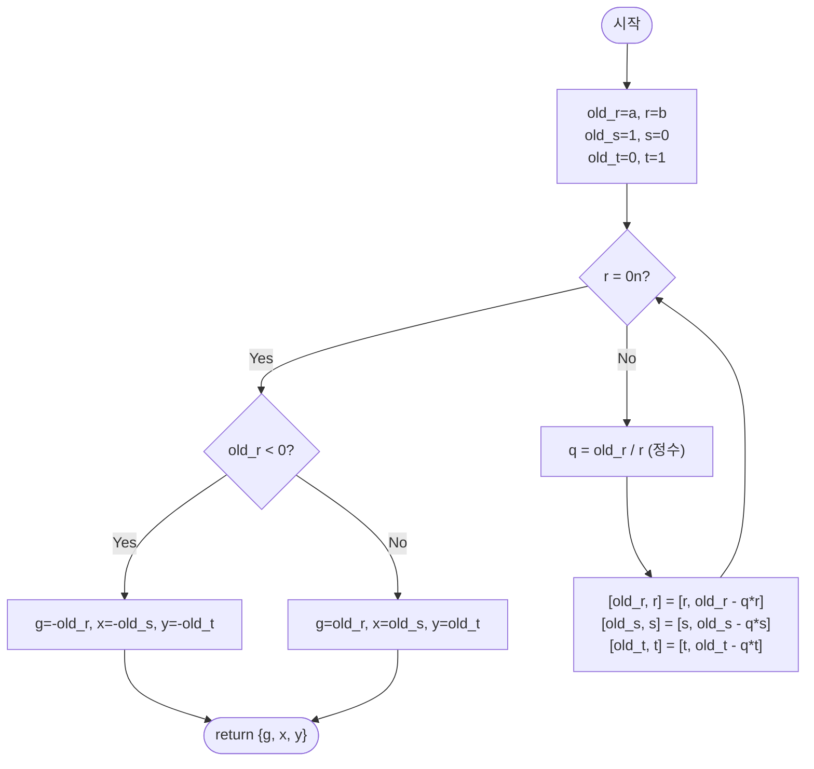

import { AlgorithmSimulation } from "#guide-sim";

# extendedEuclidean — 유클리드 호제법의 나머지 수열을 거꾸로 밟으면 베주 계수가 함께 나오는 이유

## 한눈에 보는 컨셉

정수 `a`, `b`가 주어졌을 때 $a \cdot x + b \cdot y = \gcd(a, b)$를 만족하는 정수 `x`, `y`를 구하는 문제예요. `x`를 하나씩 대입해 보는 브루트포스는 탐색 폭이 `b`에 비례해 커지지만, 유클리드 호제법이 `gcd`를 구하며 만들어내는 나머지 수열이 사실 항상 초기 입력 `a`, `b`의 정수 선형결합이라는 사실을 이용하면 이야기가 달라집니다. `gcd`를 구하는 바로 그 나눗셈 과정 안에서 계수 `x`, `y`까지 `O(log min(|a|, |b|))`에 함께 얻을 수 있어요. 핵심은 **"gcd만 구하고 버리는 계산을, 각 단계의 계수까지 같이 들고 가는 계산으로 확장하는 것"**입니다.

## 출발점: 가장 순진한 방법부터

문제를 먼저 정확히 잡을게요.

```ts
function extendedEuclidean(
  a: bigint,
  b: bigint,
): { g: bigint; x: bigint; y: bigint }
```

`a`, `b`는 부호가 있는 임의의 `bigint`입니다 — `bigint`의 강점이 64비트 정수 범위를 넘어서는 임의 정밀도인 만큼, 이 글에서도 암호학 등에서 흔히 쓰는 수백~수천 비트급 큰 정수를 실용 범위로 가정합니다. 반환값 `{ g, x, y }`는 $g = \gcd(a, b) \geq 0$이고 $a \cdot x + b \cdot y = g$를 만족해야 해요. 베주 계수 $(x, y)$ 쌍은 무수히 많지만(하나를 찾으면 $(x + b/g \cdot k,\ y - a/g \cdot k)$도 항상 해가 됩니다), 이 문제는 그중 특정한 하나만 반환하면 충분합니다.

"$g$부터 구하자"는 자연스럽습니다. 유클리드 호제법으로 $g$는 금방 나와요. 문제는 그다음 $x$, $y$입니다. 가장 정직한 방법은 $g$를 구해 둔 뒤 $x = 0, 1, -1, 2, -2, \dots$ 순서로 대입하면서 $(g - a \cdot x)$가 `b`로 나누어떨어지는 순간을 기다리는 겁니다.

```text
a=30, b=18 → g=gcd(30,18)=6

x=0  → (6 - 30*0)/18 =  6/18   정수 아님
x=1  → (6 - 30*1)/18 = -24/18  정수 아님
x=-1 → (6 - 30*(-1))/18 = 36/18 = 2   ✓ 찾음! (x=-1, y=2)

탐색 폭:  |x| 가 커질 수 있는 한계는 이론상 O(|b|/g)
|b| ≈ 2^63 이면                        →  탐색 자체가 불가능한 규모
```

이 예시는 운 좋게 `x=-1`에서 바로 걸렸지만, 일반적으로는 $x$가 $\pm b/g$ 근방까지 갈 수 있습니다 — 베주 계수의 일반해는 $x = x_0 + (b/g)\cdot k$ ($k \in \mathbb{Z}$) 형태로 정수 간격 $b/g$마다 반복되므로, 절댓값이 가장 작은 해라 해도 최악의 경우 그 간격의 절반 정도인 $\Theta(b/g)$ 규모가 될 수 있다는 뜻입니다. `gcd`는 $O(\log \min(|a|,|b|))$면 끝나는데, 계수를 찾는 데 $O(|b|)$가 걸린다면 앞뒤가 안 맞아요. **"`gcd`를 구하는 나눗셈 과정 자체가 이미 계수에 대한 정보를 담고 있는 게 아닐까?"** — 이 질문이 이번 알고리즘의 출발 단서입니다.

## 아이디어 자세히 들여다보기

### 나머지 수열은 항상 초기 입력의 선형결합이다 — 수식과 그림

유클리드 호제법은 $(a, b) \to (b,\ a \bmod b)$로 두 수를 줄여 나가다가 `b`가 0이 되면 그 직전 값이 `gcd`라고 선언합니다. 이 수열을 조금 다르게 바라볼게요. 각 나머지 $r$에 대해, 정수 $s, t$를 붙여서

$$r = s \cdot a + t \cdot b$$

를 만족하는 상태 $(r, s, t)$로 정의합니다. 초기값은 $r_0 = a$(즉 $s_0=1, t_0=0$)와 $r_1 = b$(즉 $s_1=0, t_1=1$)이고, 이후 매 단계 몫 $q = \lfloor r_{i-1} / r_i \rfloor$에 대해

$$r_{i+1} = r_{i-1} - q \cdot r_i, \qquad s_{i+1} = s_{i-1} - q \cdot s_i, \qquad t_{i+1} = t_{i-1} - q \cdot t_i$$

로 다음 상태를 만듭니다.

이 갱신식이 왜 성립하는지 한 번만 검산해 볼게요. 귀납적으로 $r_{i-1} = s_{i-1} a + t_{i-1} b$와 $r_i = s_i a + t_i b$가 이미 성립한다고 하면, 나눗셈 관계식 $r_{i+1} = r_{i-1} - q \cdot r_i$에 두 식을 그대로 대입해서

$$r_{i+1} = (s_{i-1} a + t_{i-1} b) - q(s_i a + t_i b) = (s_{i-1} - q s_i) a + (t_{i-1} - q t_i) b$$

로 묶입니다. 즉 $s_{i+1} = s_{i-1} - q s_i$, $t_{i+1} = t_{i-1} - q t_i$로 정의하면 $r_{i+1} = s_{i+1} a + t_{i+1} b$가 자동으로 성립해요 — `r`과 완전히 같은 모양의 점화식을 `s`, `t`에도 그대로 써도 되는 이유가 바로 이 대입입니다.

`r`이 유클리드 호제법 그대로 줄어드는 동안, `s`와 `t`도 **똑같은 몫 `q`로 같이 갱신**된다는 게 핵심이에요.

작은 예로 직접 채워 봅시다. `a=12, b=8`이면:

```text
i   r_i    s_i    t_i     (검산: s_i*12 + t_i*8)
0   12      1      0        1*12 + 0*8  = 12  ✓
1    8      0      1        0*12 + 1*8  =  8  ✓
2    4      1     -1        1*12 + (-1)*8 = 4  ✓   (q=1: 4 = 12 - 1*8)
3    0      -      -        (r=0 이므로 여기서 멈춘다)
```

`r_2 = 4`가 바로 $\gcd(12, 8)$이고, 같은 줄의 $s_2=1, t_2=-1$이 곧 베주 계수입니다. **나머지를 줄이는 과정과 계수를 갱신하는 과정이 완전히 같은 리듬으로 진행된다**는 것이 이 문제를 푸는 열쇠예요.

잠깐, 확인 하나만 해 볼까요? 정의식이 $r_{i+1} = r_{i-1} - q \cdot r_i$ 형태이므로, $r_2$를 만드는 몫은 $i=1$ 단계에서 $q = \lfloor r_0/r_1 \rfloor = \lfloor 12/8 \rfloor = 1$로 정해집니다. 이걸로 $s_2 = s_0 - q \cdot s_1 = 1 - 1 \cdot 0 = 1$, $t_2 = t_0 - q \cdot t_1 = 0 - 1 \cdot 1 = -1$을 직접 계산해 보면 위 표와 정확히 일치하죠? 표 값을 베끼지 않고 정의식만으로 재현할 수 있어야 다음 절이 자연스럽게 이해됩니다.

**왜 하필 이런 삼중항으로 정의해야 할까요?** 대안으로 "그냥 나머지 수열만 관찰하고, 다 끝난 뒤에 거꾸로 계수를 역산한다"는 방법도 있습니다(뒤에서 재귀 버전으로 직접 다뤄요). 삼중항을 미리 다 같이 들고 가는 방법과, 나중에 역산으로 복원하는 방법은 **같은 관계식을 앞으로 계산하느냐 뒤로 계산하느냐**의 차이일 뿐 수학적으로 동치입니다. 재귀도 매 호출에서 똑같은 관계식 $r_{i+1}=r_{i-1}-q\cdot r_i$(그리고 그로부터 유도되는 $s, t$ 갱신식)를 쓰되, 계수를 조합하는 시점만 기저 조건에서 위로 되짚어 올라가며 미룰 뿐 다른 수식을 쓰는 게 아니라는 점이 핵심이에요. 이 절에서는 관계식 자체를 먼저 확실히 잡고, 코드로 옮기는 절에서 "뒤로"(재귀), 최적화 절에서 "앞으로"(반복문) 계산하는 두 형태를 각각 만나게 됩니다.

### 단서를 설명해 주는 이론 — 베주 항등식(Bézout's identity)

방금 관찰한 "선형결합으로 `gcd`를 표현할 수 있다"는 사실은 이미 정수론에서 정리된 정리입니다. **베주 항등식**은 다음을 말합니다.

> 정수 $a, b$가 동시에 0이 아니면, $a \cdot x + b \cdot y = \gcd(a, b)$를 만족하는 정수 $x, y$가 반드시 존재한다. 더 나아가, 집합 $\{a x + b y : x, y \in \mathbb{Z}\}$는 정확히 $\gcd(a, b)$의 배수 전체와 같다.

왜 성립하는지 납득할 수준으로만 짚어 볼게요. $S = \{ax + by : x,y \in \mathbb{Z}, ax+by > 0\}$을 생각하면 $S$는 공집합이 아닌 양의 정수 집합이므로(정렬 원리에 의해) 최솟값 $d$를 가집니다. $d$가 $a$를 나누지 못한다고 가정하면 $a = qd + r$ ($0 < r < d$)인데, $r = a - qd$는 여전히 $a, b$의 선형결합이면서 $d$보다 작은 양수가 되어 $d$가 최솟값이라는 가정과 모순됩니다. 따라서 $d \mid a$이고 같은 논리로 $d \mid b$이므로 $d$는 공약수입니다. 이제 $a, b$의 임의의 공약수 $c$를 생각해 볼게요. $c \mid a$이고 $c \mid b$이면 $c$는 $a, b$의 어떤 정수결합도 나누므로 $c \mid (ax+by) = d$이고, $d > 0$이므로 $c \leq d$입니다. 즉 $d$는 공약수이면서 다른 모든 공약수보다 크거나 같으므로 $d = \gcd(a,b)$입니다.

이 증명은 **존재**만 보장할 뿐 $x, y$를 손에 쥐여 주지 않아요. 확장 유클리드 알고리즘이 하는 일이 바로 이 존재 증명을 **구성적**으로(즉 계산 절차로) 바꾼 것입니다 — 유클리드 호제법이 진행되는 매 단계마다 그 순간의 나머지를 표현하는 계수 $(s, t)$를 함께 만들어 나가다가, 나머지가 $\gcd$에 도달하는 순간 계수도 함께 완성됩니다. 즉 앞 절의 삼중항 $(r, s, t)$는 베주 항등식의 증명을 알고리즘으로 옮긴 자료구조인 셈이에요.

### 왜 모순 없이 작동하는가

**종료 보장**: `bigint`의 `%` 연산은 $r = a - q \cdot b$ ($q$는 `a/b`를 0 방향으로 절단한 값)를 계산하는데, 부호에 관계없이 항상 $|r| < |b|$가 성립합니다. 그러므로 나머지의 절댓값이 매 단계 엄격히 줄어들고, 음이 아닌 정수는 무한히 줄어들 수 없으므로 유한 단계 후 나머지가 0에 도달합니다.

**gcd 불변식**: 계수 $(s,t)$ 이야기와 별개로, `old_r`이 정말 `gcd(a,b)`가 맞는지도 짚어야 완결됩니다. $r = a - q \cdot b$ 관계에서 $(a,b)$의 공약수 집합과 $(b,r)$의 공약수 집합은 정확히 같습니다 — 공약수는 $a,b$의 임의의 정수결합인 $r=a-qb$도 나누고, 거꾸로 $b,r$의 공약수는 $a=qb+r$도 나누기 때문입니다. 따라서 $\gcd(\text{old\_r}, r)$은 매 단계 그대로 보존되고, 나머지가 $r=0$에 도달하면 $\gcd(\text{old\_r}, 0) = |\text{old\_r}|$이므로 그 순간의 `old_r`이 곧 처음 $a, b$의 `gcd`입니다.

**귀납 정당성**: 재귀로 표현하면 이해가 쉬워요.
- 기저: $b=0$이면 $a \cdot 1 + 0 \cdot 0 = a$이므로 $(x,y)=(\mathrm{sign}(a), 0)$, $g=|a|$가 자명하게 항등식을 만족합니다.
- 귀납 단계: $b \neq 0$인 모든 호출은 정확히 이 두 경우(`b=0` 또는 `b≠0`) 중 하나이므로 case 분석이 완전합니다. `b≠0`이면 몫 $q = a/b$(절단), 나머지 $r = a \bmod b$에 대해 재귀 호출 $(g, x', y') = \text{extGcd}(b, r)$이 $b \cdot x' + r \cdot y' = g$를 만족한다고 귀납 가정합니다. $r = a - q\cdot b$를 대입하면

$$b \cdot x' + (a - q\cdot b) \cdot y' = g \;\Longrightarrow\; a \cdot y' + b \cdot (x' - q \cdot y') = g$$

이므로 현재 단계의 계수는 $x = y'$, $y = x' - q \cdot y'$로 정확히 결정됩니다. 대안이 없는 유일한 해가 아니라 "하나의 유효한 선택"이라는 점은 유의하세요 — 베주 계수는 무수히 많고, 이 유도는 그중 재귀가 자연스럽게 만들어내는 하나를 고르는 것뿐입니다.

여기서 **헷갈리기 쉬운 포인트**가 하나 있습니다. "나머지 연산은 파이썬처럼 항상 floor 방식(몫을 내림)이어야 이 유도가 성립하는 것 아닌가?"라고 생각하기 쉬운데, 그렇지 않습니다. 유도 과정에서 쓴 조건은 오직 $r = a - q \cdot b$(즉 $q,r$이 나눗셈의 몫·나머지 관계)뿐이고, $q$를 floor로 고르든 trunc(0 방향 절단)로 고르든 등식 자체는 그대로 성립합니다. JS `bigint`는 trunc 방식을 쓰는데, 실제로 어떻게 다른지 봅시다.

```text
a=-12, b=8 인 경우

JS bigint (trunc):  q = -12n / 8n = -1n   (−1.5 를 0 방향으로 절단)
                     r = -12 - (-1)*8 = -4
                     → -4 = -12 - (-1)*8   등식 성립 ✓

floor 방식이라면:    q = ⌊-12/8⌋ = -2
                     r = -12 - (-2)*8 = 4
                     → 4 = -12 - (-2)*8   등식도 성립 ✓ (다른 (q,r) 선택일 뿐)
```

두 선택 모두 $|r| < |b|$를 지키고 등식도 성립하므로, 어느 쪽을 써도 알고리즘은 종료하고 올바른 결과를 냅니다 — 다만 나오는 베주 계수 쌍은 서로 다를 수 있습니다(둘 다 유효한 해).

엣지 케이스도 짚어 둘게요.

```text
a=9,  b=0   → g=9,  x=1,  y=0     (a*1 + 0*0 = 9)
a=-9, b=0   → g=9,  x=-1, y=0     (부호가 있는 a도 sign(a)로 처리)
a=0,  b=-9  → g=9,  x=0,  y=-1
a=0,  b=0   → g=0,  x=0,  y=0     (자명하게 0*0+0*0=0)
```

## 아이디어를 코드로 옮기기

앞 절의 재귀 유도($x=y', y=x'-q\cdot y'$)를 그대로 옮기면 다음과 같은 기본 구현이 나옵니다.

```ts
function extendedEuclideanRecursive(
  a: bigint,
  b: bigint,
): { g: bigint; x: bigint; y: bigint } {
  if (b === 0n) {
    const sign = a > 0n ? 1n : a < 0n ? -1n : 0n;
    return { g: a < 0n ? -a : a, x: sign, y: 0n };
  }
  const q = a / b; // bigint 절단(trunc) 나눗셈
  const r = a % b; // |r| < |b|, 부호는 a(피제수)를 따름
  const { g, x: xPrime, y: yPrime } = extendedEuclideanRecursive(b, r);
  return { g, x: yPrime, y: xPrime - q * yPrime };
}
```

**가장 중요한 줄은 마지막 `return`입니다.** 재귀 호출이 돌려준 `(g, x', y')`을 그대로 반환하지 않고, `x = y'`, `y = x' - q * y'`로 **자리를 바꾸고 몫을 곱해 빼는** 조합이 앞 절에서 유도한 대입 그 자체예요. 이 줄을 빼먹거나 `x`, `y`를 그대로 반환하면 `b*x' + r*y' = g`라는 하위 문제의 항등식만 만족하고 `a*x + b*y = g`는 깨집니다.

그 외 짚어 둘 지점:
- 기저 조건 `b === 0n`에서 `sign(a)`를 쓰는 이유는 `a`가 음수여도 $g = |a| \geq 0$을 보장하기 위해서입니다. `a=0, b=0`이면 `sign(0)=0`이라 자연스럽게 `g=0, x=0, y=0`이 나옵니다.
- `q`와 `r`을 각각 `a/b`, `a%b` 한 번씩만 계산해서 재사용합니다 — 재귀 호출 인자에 `a%b`를 다시 쓰면 같은 나눗셈을 두 번 하는 낭비가 생겨요.

## 더 빠르게 만들 단서 찾기

이 재귀 구현을 `(a=12, b=8)`로 직접 따라가 보면, 호출이 쌓였다가 한 번에 풀리는 모양이 보입니다.

```text
extGcd(12, 8)                                   ─┐ 호출 스택 쌓는 중
  q=1, r=4 → extGcd(8, 4)                        ─┤ (자식 결과를 기다리는 중)
              q=2, r=0 → extGcd(4, 0)            ─┘ 기저 도달, depth=2

                                                반환 시작 (스택 풀리는 중)
  extGcd(4, 0)  → { g:4, x:1,  y:0  }
  extGcd(8, 4)  → { g:4, x:0,  y:1-2*0=1 }   (x'=1,y'=0에서 x=y'=0, y=x'-q*y'=1-2*0=1)
  extGcd(12, 8) → { g:4, x:1,  y:0-1*1=-1 }  (x'=0,y'=1에서 x=y'=1, y=x'-q*y'=0-1*1=-1)
```

`(12,8)`처럼 작은 값은 깊이가 2에 불과해 문제없지만, 암호에 쓰이는 수백~수천 비트짜리 `bigint`라면 깊이가 그만큼(대략 $O(\log \min(|a|,|b|))$) 늘어납니다. 재귀 호출마다 스택 프레임을 새로 쌓고, **자식 호출이 끝날 때까지 부모 프레임이 대기**하다가 되짚어 올라오며 계산을 완성해요. 스택 프레임 하나하나가 메모리이고 함수 호출 자체에도 비용이 있으니, "**굳이 다 쌓아 놓고 되짚어야 할까, 진행 방향 그대로 계산할 수는 없을까?**"라는 게 다음 단서입니다. 앞서 나머지 수열을 선형결합으로 정의한 절에서 이미 봤듯이 $(r,s,t)$ 관계식은 앞으로 갱신하는 것도 뒤로 역산하는 것도 둘 다 가능한 형태였다는 점, 기억해 두세요.

## 단서를 최적화로 연결하기

재귀는 자식 호출이 끝나야 부모가 값을 조합할 수 있었죠(**Before**: 대기 → 대기 → 기저 → 조합 → 조합). 앞서 나머지 수열을 선형결합으로 정의한 절의 갱신식 $r_{i+1}=r_{i-1}-q r_i,\ s_{i+1}=s_{i-1}-q s_i,\ t_{i+1}=t_{i-1}-q t_i$를 다시 보면, 이 값들은 사실 **이전 두 상태만 있으면 다음 상태를 바로 계산**할 수 있습니다. 즉 스택에 쌓아 되짚을 필요 없이, 상태를 앞으로 밀고 가면 됩니다(**After**: 상태 갱신 → 상태 갱신 → … → 종료 즉시 답).

```text
Before (재귀, 뒤로 계산):  쌓기 → 쌓기 → 기저 → 풀기 → 풀기      스택 깊이 O(log min(|a|,|b|))
After  (반복문, 앞으로 계산): (r,s,t) 갱신 → 갱신 → … → r=0에서 바로 읽기   추가 메모리 O(1)
```

불변식은 그대로입니다 — 매 반복 시작 직전 `old_r = old_s*a + old_t*b`, `r = s*a + t*b`. 이 불변식이 유지된 채로 `r`이 0이 되는 순간, `old_r`이 곧 `gcd`이고 `old_s, old_t`가 곧 베주 계수입니다.

## 최적화 코드

```ts
function extendedEuclidean(
  a: bigint,
  b: bigint,
): { g: bigint; x: bigint; y: bigint } {
  let oldR = a, r = b;
  let oldS = 1n, s = 0n;
  let oldT = 0n, t = 1n;

  while (r !== 0n) {
    const q = oldR / r;
    [oldR, r] = [r, oldR - q * r];
    [oldS, s] = [s, oldS - q * s];
    [oldT, t] = [t, oldT - q * t];
  }

  let g = oldR, x = oldS, y = oldT;
  if (g < 0n) { g = -g; x = -x; y = -y; }
  return { g, x, y };
}
```

**가장 중요한 줄은 세 개의 `[old, cur] = [cur, old - q*cur]` 동시 대입입니다.** 세 쌍 모두 **같은 `q`로, 같은 타이밍에** 갱신되어야 앞서 나머지 수열을 선형결합으로 정의한 절의 불변식이 깨지지 않아요. 만약 병렬 대입 대신 순서대로 풀어서 쓰면 어떻게 조용히 틀리는지 볼게요.

```text
잘못된 구현 (병렬 대입 대신 순차 대입):
  oldR = r;            // oldR: 12 → 8
  r = oldR - q * r;     // 이미 바뀐 oldR(8)을 사용! q=1이면 r = 8 - 1*8 = 0

정상 구현이라면 r = 12 - 1*8 = 4 여야 하는데, 위 실수는 r=0을 만들어
루프가 한 단계 일찍 끝나 버립니다 → g = oldR = 8 (틀림, 정답은 4)
```

`s`, `t`도 마찬가지로 갱신 전의 `old` 값을 참조해야 하므로, 구조 분해 할당(destructuring)으로 세 쌍을 한 줄씩 동시에 바꾸는 것이 안전합니다.

> 세 쌍은 한 몸처럼 같이 움직인다 — 하나만 따로 갱신하면 불변식이 깨진다.

마지막 `if (g < 0n)` 블록도 놓치기 쉬운 지점입니다. `oldR`은 부호가 있는 `bigint`의 나머지 연산 특성상 음수로 끝날 수 있는데(예: `a`, `b`가 모두 음수인 경우), 문제의 계약은 $g \geq 0$이므로 부호가 뒤집혔다면 `g`, `x`, `y`를 모두 반전해서 항등식 $a\cdot x + b\cdot y = g$를 유지한 채 부호만 바로잡습니다.

이 최적화는 **점근 복잡도를 줄이는 최적화가 아니라 공간을 줄이는 최적화**라는 점을 짚고 갈게요. 재귀·반복문 모두 유클리드 호제법과 똑같은 횟수만큼 나눗셈을 수행하므로 **나눗셈 단계 수**는 둘 다 $O(\log \min(|a|,|b|))$입니다. 다만 이 $\log$는 "나눗셈 한 번을 상수 시간으로 본다"는 워드 크기(word-size) 모델의 단계 수이고, `bigint`처럼 자릿수 $N$이 입력 크기만큼 커지는 임의 정밀도 정수에서는 나눗셈 한 번의 비용 자체도 $N$에 비례해 커집니다(실무 구현 기준 대략 $O(N^2)$ 안팎) — 단계 수와 실행 시간을 같은 말로 섞지 않는 게 정확합니다. 공간도 마찬가지로 "변수 개수"로는 반복문이 정확히 $O(1)$개(여섯 개)지만, 그 각각이 담는 큰 정수의 비트 수는 입력 크기에 비례하므로 비트 단위로는 "상수 개수의 큰 정수를 담을 공간"이라고 보는 편이 정확합니다. 재귀는 이 변수들에 더해 스택 깊이 $O(\log \min(|a|,|b|))$만큼 프레임이 쌓이므로, 반복문 대비 그 프레임 수에 비례하는 추가 공간을 씁니다 — 두 구현의 실질적 차이는 바로 이 스택 프레임 유무입니다.

정리하면, 이 글의 출발점이었던 목표 — 브루트포스의 $O(|b|)$ 탐색을 계수 계산까지 포함해 $O(\log \min(|a|,|b|))$ 나눗셈 단계로 낮추는 것 — 은 재귀·반복문 두 구현 모두 달성했고, 반복문 버전은 여기에 더해 추가 공간을 $O(\log \min(|a|,|b|))$의 스택 프레임에서 $O(1)$개의 변수로 줄였습니다.

더 최적화할 여지가 있을까요? 나눗셈 단계 수 자체는 유클리드 호제법의 것과 동일하고, 이는 최악의 경우(연속한 피보나치 수 입력) 이미 $\Theta(\log \min(|a|,|b|))$로 알려진 유클리드 호제법의 한계와 일치합니다 — 나눗셈 기반 접근에서 단계 수만 놓고 보면 이보다 더 줄이기는 어렵습니다(다만 이는 "나눗셈 횟수" 기준이지, `bigint` 대형 정수 나눗셈 자체의 실행 시간을 줄이는 이야기는 아닙니다). 나눗셈 대신 시프트·뺄셈만 쓰는 이진 GCD(Stein's algorithm)의 확장판이 하드웨어에 따라 상수 인자를 더 줄이는 특화 해법으로 존재하지만, 나눗셈 연산 자체가 비싸지 않은 환경(현재 `bigint` 런타임 포함)에서는 이 알고리즘의 **단순성과 범용성**(모듈러 역원, CRT, 디오판토스 방정식에 그대로 재사용 가능)이 더 큰 가치를 가집니다.

## 실행 시각화

고정 입력 `a = 12n`, `b = 8n`에 대해 방금 본 반복문 버전 `extendedEuclidean`을 실행하는 과정입니다. `keyValue` 패널은 매 단계의 상태 쌍 `(old_r, r)`, `(old_s, s)`, `(old_t, t)`와 몫 `q`를 보여줍니다. 불변식 `old_r = old_s*a + old_t*b`, `r = s*a + t*b`가 항상 유지된다는 점을 프레임을 넘기며 직접 확인해 보세요.

실제 반환값은 `{ g: 4n, x: 1n, y: -1n }`이며(검증: `12*1 + 8*(-1) = 4`), 시뮬레이션 마지막 프레임과 일치합니다.

> 대화형 시뮬레이션은 MDX 런타임에서 표시됩니다.

export const steps = [
  {
    title: "초기화",
    detail: "old_r=12, r=8 / old_s=1, s=0 / old_t=0, t=1.",
    entries: [
      { label: "(old_r, r)", value: "(12, 8)" },
      { label: "(old_s, s)", value: "(1, 0)" },
      { label: "(old_t, t)", value: "(0, 1)" },
    ],
  },
  {
    title: "1단계: q = 12/8 = 1",
    detail: "각 쌍을 (cur, old - q*cur)로 교환 갱신. r=4 != 0 이므로 진행.",
    entries: [
      { label: "q", value: 1 },
      { label: "(old_r, r)", value: "(8, 4)" },
      { label: "(old_s, s)", value: "(0, 1)" },
      { label: "(old_t, t)", value: "(1, -1)" },
    ],
  },
  {
    title: "2단계: q = 8/4 = 2",
    detail: "갱신 후 r = 0 이 된다 → 루프 종료 조건 충족.",
    entries: [
      { label: "q", value: 2 },
      { label: "(old_r, r)", value: "(4, 0)" },
      { label: "(old_s, s)", value: "(1, -2)" },
      { label: "(old_t, t)", value: "(-1, 3)" },
    ],
  },
  {
    title: "루프 종료",
    detail: "r = 0. g=old_r=4, x=old_s=1, y=old_t=-1. g >= 0 이므로 부호 반전 불필요.",
    entries: [
      { label: "g", value: 4 },
      { label: "x", value: 1 },
      { label: "y", value: -1 },
    ],
  },
  {
    title: "완료: { g: 4n, x: 1n, y: -1n }",
    detail: "검증: 12*1 + 8*(-1) = 4 = gcd(12, 8). 베주 항등식 성립.",
    entries: [
      { label: "g", value: 4 },
      { label: "x", value: 1 },
      { label: "y", value: -1 },
      { label: "a*x + b*y", value: 4 },
    ],
  },
];

<AlgorithmSimulation view="keyValue" steps={steps} title="extendedEuclidean: a=12, b=8" />

## 흐름 한눈에 보기



## 스스로 점검하기

1. `a=25, b=15`에 대해 반복문 버전을 손으로 따라가며 `(old_r, r)`, `(old_s, s)`, `(old_t, t)`의 변화를 표로 그려 보세요. (몫은 `q=25/15=1`, 다음 단계 `q=15/10=1`, 그다음 `q=10/5=2`로 이어집니다. 최종 결과는 `{ g: 5n, x: -1n, y: 2n }`이고 검산하면 `25*(-1) + 15*2 = 5`입니다.)
2. 최적화 코드 절의 "잘못된 구현" 블록처럼 세 쌍을 병렬 대입 대신 순차 대입으로 바꿨다고 합시다. `a=12, b=8` 입력에서 실제로 어느 줄에서 `r`이 몇으로 잘못 계산되고, 그 결과 루프가 몇 번째 반복에서 멈추는지 앞 절의 수치를 근거로 추적해 보세요.
3. 베주 항등식 $a \cdot x + b \cdot y = \gcd(a,b)$에서 $\gcd(a,b)=1$이면 $a \cdot x \equiv 1 \pmod{b}$가 되어 `x`가 곧 모듈러 역원이라는 점을 직접 활용해 봅시다. `extendedEuclidean(3n, 11n)`을 손으로 계산해 `3^-1 mod 11`을 구해 보세요. (힌트: 결과 `x`를 `((x % 11) + 11) % 11`로 정규화합니다. 실제로 `{ g: 1n, x: 4n, y: -1n }`이 나오고, `4`가 정답입니다 — `3*4=12 ≡ 1 (mod 11)`로 검산됩니다.)
