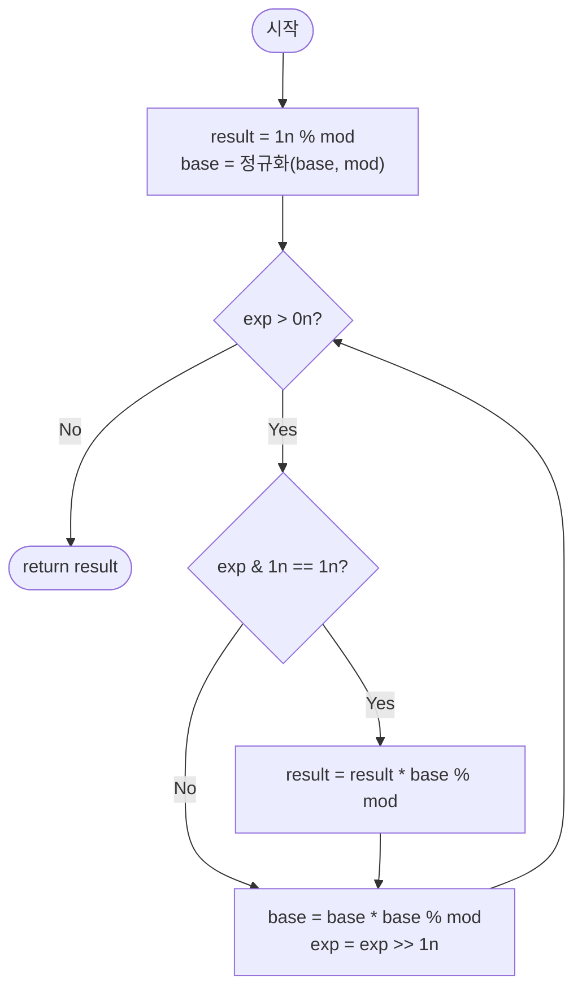

import { AlgorithmSimulation } from "#guide-sim";

# fastPower — 빠른 거듭제곱 (이진 지수법) 해설

## 성능 목표 예측

| 항목 | 값 |
|------|-----|
| 입력 크기 | `exp`는 임의의 bigint $\geq 0$, 실용 범위 $\text{exp} \leq 10^{18}$ |
| 시간 복잡도 | $O(\log \text{exp})$ |
| 공간 복잡도 | $O(1)$ (반복문 버전), $O(\log \text{exp})$ (재귀 스택) |

**naive 접근의 한계.** `base`를 `exp`번 곱하는 직접 반복은 $O(\text{exp})$이다. $\text{exp} = 10^{18}$이면 $10^{18}$번의 곱셈이 필요하므로 수백억 년이 걸린다. 암호학 문제에서 $p - 1 \approx 10^{18}$인 거듭제곱을 계산해야 하는 경우가 흔하므로 이 수준의 지수를 처리할 수 있는 알고리즘이 필수이다.

**목표 복잡도와 근거.** 지수를 이진수로 표현하면 $\lfloor \log_2 \text{exp} \rfloor + 1$ 비트이다. 각 비트 위치에서 "제곱" 연산 한 번과 (비트가 1이면) "곱하기" 연산 한 번으로 처리하므로 총 $O(\log \text{exp})$번의 곱셈이다. $\text{exp} = 10^{18}$이어도 약 60번으로 완료된다.

**공간 트레이드오프.** 반복문 버전은 $O(1)$ 추가 공간을 사용한다. 재귀 버전은 $O(\log \text{exp})$ 스택을 소모하지만, 깊이가 60 수준이므로 오버플로 위험은 없다.

---

## 목표 함수

```ts
function fastPower(base: bigint, exp: bigint, mod: bigint): bigint
```

| 파라미터 | 의미 | 제약 |
|----------|------|------|
| `base` | 거듭제곱의 밑 | 임의의 bigint |
| `exp` | 지수 | $\text{exp} \geq 0$ |
| `mod` | 나머지 연산의 모듈러 | $m \geq 1$ |

**반환값**: $\text{base}^{\text{exp}} \bmod m$. 결과는 $0 \leq \text{result} < m$이다.

**엣지케이스**:
1. `exp = 0n, mod = 7n` → `1n` (어떤 수의 0제곱도 1)
2. `mod = 1n` → `0n` (모든 정수를 1로 나누면 나머지 0)
3. `base = 0n, exp = 0n, mod = 5n` → `1n` ($0^0$은 관례상 1)
4. `base = 2n, exp = 62n, mod = 10n` → `4n` ($2^{62} \bmod 10 = 4$)

---

## 핵심 아이디어

**핵심 아이디어**: "지수를 이진수로 전개하면 O(exp)번 곱셈이 O(log exp)번으로 줄어든다"

`base`를 `exp`번 곱하는 직접 반복은 $O(\text{exp})$이어서 $\text{exp} = 10^{18}$이면 사실상 불가능하다. 이진 지수법은 지수를 이진수로 표현해, 매 단계에서 현재 `base`를 제곱하고(`base → base²`) 지수를 절반으로 줄이는(`exp → exp >> 1`) 과정을 반복한다. 현재 비트가 1일 때만 결과에 `base`를 누적하면 $O(\log \text{exp})$번의 곱셈만으로 동일한 결과를 얻는다.

**풀이 구조**
1. `result = 1`, `base`를 `% mod`로 정규화
2. `exp > 0`인 동안 반복: 최하위 비트가 1이면 `result = result * base % mod`
3. `base = base * base % mod`, `exp >>= 1`로 다음 비트로 이동
4. `exp = 0`이 되면 `result` 반환

**조건**: `exp >= 0`이어야 한다. `mod >= 1`이면 항상 동작하며, `mod = 1`이면 모든 결과가 0이다.

**대표 예시**: $2^{10} \bmod 7$ 계산
$10 = (1010)_2$이다. `base=2, exp=10`: 비트0=0이므로 누적 건너뜀, `base=4, exp=5`; 비트0=1이므로 `result=4`, `base=16%7=2, exp=2`; 비트0=0, `base=4, exp=1`; 비트0=1이므로 `result=4*4%7=2`. 결과 $2^{10} = 1024 = 7 \cdot 146 + 2$이므로 2가 맞다.

**언제 쓰나**
지수가 $10^9$ 이상으로 크거나 모듈러 거듭제곱이 필요한 모든 상황에서 사용한다. 페르마의 소정리를 이용한 모듈러 역원($a^{p-2} \bmod p$), 밀러-라빈 소수 판정, 행렬 거듭제곱 등 수론 알고리즘의 핵심 기반이다.

---

### 원형 아이디어와 naive 접근

가장 직관적인 방법은 `result = 1`로 시작해 `base`를 `exp`번 반복 곱하는 것이다. 구현은 단순하지만 $O(\text{exp})$이어서 지수가 $10^{18}$에 달하면 완전히 동작 불가능하다. "더 적은 곱셈으로 같은 결과를 얻을 수 없을까?"라는 의문이 돌파구의 출발점이다.

### 어떤 관찰이 돌파구가 되는가

- **핵심 관찰 1**: $\text{base}^{2k} = (\text{base}^k)^2$이므로, 짝수 지수는 절반 지수의 제곱으로 표현할 수 있다. 이렇게 하면 문제 크기가 매 단계 절반으로 줄어든다.
- **핵심 관찰 2**: 홀수 지수는 $\text{base}^{2k+1} = \text{base} \cdot (\text{base}^k)^2$로 처리할 수 있다. 홀짝 분기만으로 지수를 이진수로 분해하는 것과 완전히 동일한 효과이다.
- **핵심 관찰 3**: 모든 중간 결과를 $\bmod m$으로 환산하면 숫자 크기가 $m$ 미만으로 유지되어 bigint 연산 비용이 제어된다.

### 관찰을 형식화: 상태/구조 정의

반복문 버전의 상태를 `(result, base, exp)` 삼중항으로 정의한다. 불변식은 다음과 같다:

$$\text{result} \cdot \text{base}^{\text{exp}} \equiv \text{base}_0^{\text{exp}_0} \pmod{m}$$

여기서 $\text{base}_0$, $\text{exp}_0$는 입력 초기값이다. 이 불변식이 유지되면서 `exp → 0`으로 수렴하면 `result`가 최종 답이 된다.

이 형태여야 하는 이유: 지수의 이진 표현 $\text{exp} = \sum_{i} b_i \cdot 2^i$에서, 각 비트 $b_i$에 해당하는 $\text{base}^{2^i}$를 순차적으로 계산하고 비트가 1일 때만 `result`에 누적하는 구조이기 때문이다.

### 점화식 또는 핵심 연산

$$\text{fastPower}(\text{base},\, \text{exp},\, m) = \begin{cases}
  1 & \text{if } \text{exp} = 0 \\
  \bigl(\text{fastPower}(\text{base},\, \text{exp}/2,\, m)\bigr)^2 \bmod m & \text{if exp is even} \\
  \text{base} \cdot \bigl(\text{fastPower}(\text{base},\, (\text{exp}-1)/2,\, m)\bigr)^2 \bmod m & \text{if exp is odd}
\end{cases}$$

**유도 과정**: 지수를 이진 전개하면 $\text{exp} = b_k 2^k + \cdots + b_1 2 + b_0$이다. 따라서:

$$\text{base}^{\text{exp}} = \prod_{i:\, b_i = 1} \text{base}^{2^i}$$

하위 비트($b_0$)부터 처리하며, 매 단계 `base`를 제곱하고($\text{base} \to \text{base}^2$) `exp`를 우시프트($\text{exp} \to \lfloor \text{exp}/2 \rfloor$)한다. 현재 비트가 1이면(`exp & 1 == 1`) `result`에 현재 `base`를 곱한다.

### 정당성 — 왜 이것이 옳은가

**종료 보장**: 매 단계에서 `exp`가 $\lfloor \text{exp}/2 \rfloor$로 감소하므로, 유한 단계 후 반드시 `exp = 0`에 도달한다.

**귀납 정당성**: $\text{exp} = 0$이면 $\text{base}^0 = 1$이 자명하다. $\text{exp} = 2k$이면 $(\text{base}^k)^2 = \text{base}^{2k}$, $\text{exp} = 2k+1$이면 $\text{base} \cdot (\text{base}^k)^2 = \text{base}^{2k+1}$으로 귀납이 성립한다.

**까다로운 케이스**: `mod = 1n`이면 $\text{base}^{\text{exp}} \bmod 1 = 0$이므로, 초기값 `result = 1n % mod = 0n`을 설정하거나 별도로 분기 처리해야 한다. `base`가 음수인 경우 `base = ((base % mod) + mod) % mod`로 진입 시 정규화하면 안전하다.

### 구현 디테일과 최적화

- **반복문 구현**: `while exp > 0n`으로 처리하며, `exp & 1n`으로 홀수 여부를 확인하고 `exp >>= 1n`으로 절반씩 줄인다. 재귀보다 스택 안전하다.
- **bigint 비트 연산**: JS bigint에서 `>>`, `&` 등 비트 연산이 지원된다. `exp % 2n === 1n`보다 `exp & 1n === 1n`이 가독성과 성능 모두 낫다.
- **중간 오버플로 방지**: 매 곱셈 후 즉시 `% mod`를 적용해야 한다. bigint는 임의 정밀도이므로 수치 오버플로는 없으나, 숫자가 커질수록 연산 비용이 커지므로 매 단계 축소가 중요하다.
- **함정**: `mod = 1n`이면 `1n % 1n = 0n`이므로 초기값에 주의가 필요하다.

---

## 시뮬레이션

고정 입력 `base = 2n`, `exp = 10n`, `mod = 7n`에 대해 이진 지수법을 실행하는 과정이다. `10 = (1010)2`이며, 하위 비트부터 처리한다. keyValue 패널은 매 반복 직전의 `result`, `base`, `exp`와 현재 비트값을 보여준다.

실제 반환값은 `2n` 이다 (2^10 = 1024 = 7·146 + 2). 시뮬레이션 마지막 프레임의 `result`와 일치한다.

> 대화형 시뮬레이션은 MDX 런타임에서 표시됩니다.

export const steps = [
  {
    title: "초기화",
    detail: "result = 1 % 7 = 1, base = 2 % 7 = 2, exp = 10.",
    entries: [
      { label: "result", value: 1 },
      { label: "base", value: 2 },
      { label: "exp (이진)", value: "10 (1010)" },
    ],
  },
  {
    title: "비트 0 = 0 → 누적 건너뜀",
    detail: "exp & 1 = 0. result 유지. base = 2·2 % 7 = 4, exp >>= 1 → 5.",
    entries: [
      { label: "result", value: 1 },
      { label: "base", value: 4 },
      { label: "exp (이진)", value: "5 (101)" },
    ],
  },
  {
    title: "비트 0 = 1 → 누적",
    detail: "exp & 1 = 1. result = 1·4 % 7 = 4. base = 4·4 % 7 = 2, exp >>= 1 → 2.",
    entries: [
      { label: "result", value: 4 },
      { label: "base", value: 2 },
      { label: "exp (이진)", value: "2 (10)" },
    ],
  },
  {
    title: "비트 0 = 0 → 누적 건너뜀",
    detail: "exp & 1 = 0. result 유지. base = 2·2 % 7 = 4, exp >>= 1 → 1.",
    entries: [
      { label: "result", value: 4 },
      { label: "base", value: 4 },
      { label: "exp (이진)", value: "1 (1)" },
    ],
  },
  {
    title: "비트 0 = 1 → 누적",
    detail: "exp & 1 = 1. result = 4·4 % 7 = 16 % 7 = 2. base = 4·4 % 7 = 2, exp >>= 1 → 0.",
    entries: [
      { label: "result", value: 2 },
      { label: "base", value: 2 },
      { label: "exp (이진)", value: "0" },
    ],
  },
  {
    title: "종료: exp = 0",
    detail: "while 조건 거짓. result = 2 반환.",
    entries: [
      { label: "result (반환값)", value: 2 },
      { label: "base", value: 2 },
      { label: "결과", value: "2^10 mod 7 = 2" },
    ],
  },
];

<AlgorithmSimulation view="keyValue" steps={steps} title="이진 지수법 2^10 mod 7" />

## 수도 코드와 Activity Diagram

### 의사코드

```
function fastPower(base, exp, mod):
    // 불변식: result * base^exp ≡ base_원래^exp_원래 (mod m)
    result = 1n % mod       // mod=1이면 0n, 아니면 1n
    base = ((base % mod) + mod) % mod  // 음수 base 정규화

    while exp > 0n:
        if exp & 1n == 1n:              // 현재 최하위 비트가 1
            result = result * base % mod   // 불변식: result에 현재 base 누적
        base = base * base % mod           // 불변식: base = base_원래^(2^현재단계)
        exp = exp >> 1n                    // 불변식: 다음 비트로 이동

    return result
```

### Activity Diagram



**핵심 불변식**: 루프 매 반복 직전, $\text{result} \cdot \text{base}^{\text{exp}} \equiv \text{base}_0^{\text{exp}_0} \pmod{m}$.

---

## 관련 알고리즘과 응용

### 페르마의 소정리 역원 계산

$p$가 소수이고 $\gcd(a, p) = 1$이면 $a^{-1} \equiv a^{p-2} \pmod{p}$이다. fastPower를 직접 호출해 역원을 구한다:

```ts
const inv = fastPower(a, p - 2n, p);
```

### 밀러-라빈 소수 판정

밀러-라빈은 내부적으로 $a^d \bmod n$을 fastPower로 계산한다. fastPower가 없으면 밀러-라빈 자체가 성립하지 않는다.

### 행렬 거듭제곱

같은 이진 지수 분해 아이디어를 행렬에 적용하면, $k \times k$ 행렬의 $n$제곱을 $O(k^3 \log n)$에 계산할 수 있다. 피보나치 수열 등의 선형 점화식을 $O(\log n)$에 계산하는 데 사용된다.

### 오버플로 주의 (number vs bigint)

JS의 `number` 타입은 64-bit 부동소수점으로 안전한 정수 범위가 $2^{53}$이다. $\text{mod} \approx 10^9$이면 $\text{base}^2$이 최대 $10^{18} \approx 2^{60}$이 되어 오버플로가 발생한다. 이 함수는 bigint를 사용해 이 문제를 원천 차단한다.
