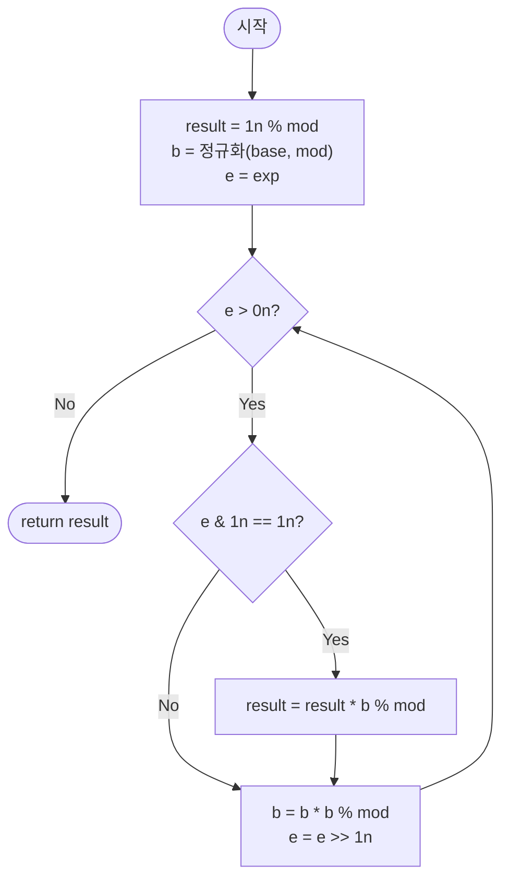

import { AlgorithmSimulation } from "#guide-sim";

# fastPower — 지수를 반씩 접으면 곱셈 횟수가 로그로 줄어드는 이유

## 한눈에 보는 컨셉

`base`를 `exp`번 곱하는 대신, `base^(2k) = (base^k)^2`라는 항등식 하나로 지수를 매 단계 절반씩 접어 나가요. 지수를 이진수로 펼쳐 보면 이 항등식을 비트 하나하나에 반복 적용하는 것과 완전히 같아서, 반복 횟수가 `O(exp)`에서 `O(log exp)`로 줄어듭니다. `exp`가 $10^{18}$이어도 반복은 약 60번, 그 안에서 이뤄지는 모듈러 곱셈은 많아야 두 배 안팎이면 끝나요.

## 출발점: 가장 순진한 방법부터

문제를 먼저 정확히 잡을게요.

```ts
function fastPower(base: bigint, exp: bigint, mod: bigint): bigint
```

| 파라미터 | 의미 | 제약 |
|----------|------|------|
| `base` | 거듭제곱의 밑 | 임의의 bigint(음수 포함) |
| `exp` | 지수 | $\text{exp} \geq 0$ |
| `mod` | 모듈러 | $\text{mod} \geq 1$ |

**반환값**: $\text{base}^{\text{exp}} \bmod \text{mod}$, 범위는 항상 $[0, \text{mod})$입니다. 실용적으로는 모듈러 거듭제곱이 RSA를 비롯한 암호 연산에서처럼 매우 큰 지수(예: $\text{exp} \approx 10^{18}$)를 다뤄야 하는 상황을 목표로 삼습니다.

가장 정직한 방법은 `result = 1`에서 시작해 `base`를 `exp`번 곱하는 겁니다. 작게 손으로 짚어 보면요, `base = 2, exp = 5, mod = 1000`일 때:

```text
곱셈 1회: result = 2
곱셈 2회: result = 4
곱셈 3회: result = 8
곱셈 4회: result = 16
곱셈 5회: result = 32
```

이 과정을 그대로 코드로 옮기면 다음과 같습니다.

```ts
function naivePower(base: bigint, exp: bigint, mod: bigint): bigint {
  let result = 1n % mod;
  for (let i = 0n; i < exp; i++) {
    result = (result * base) % mod;
  }
  return result;
}
```

`naivePower(2n, 5n, 1000n)`을 실행하면 위 손 계산과 똑같이 `32n`이 나옵니다.

`exp = 5`면 5번으로 끝나니 멀쩡해 보이죠. 그런데 `exp`가 커지면 이야기가 달라집니다.

```text
비용:   곱셈 exp번
exp = 10^18 이면 →  초당 10^9회 연산이어도 약 10억 초(≈ 32년)
```

모듈러 거듭제곱은 RSA를 비롯한 암호 연산에서 이런 크기의 지수를 다뤄야 하는 경우가 흔하므로, `exp`번 곱하는 접근은 애초에 후보가 될 수 없어요. 목표 복잡도는 `exp`의 자릿수(비트 수)에 비례하는 $O(\log \text{exp})$입니다 — 이 정도여야 $\text{exp} = 10^{18}$도 60번 안팎으로 끝나거든요. "한 번 곱할 때마다 문제 크기를 절반으로 줄일 방법은 없을까?"가 다음 절의 출발점입니다.

## 아이디어 자세히 들여다보기

### 지수를 이진수로 쪼개기 — 수식과 그림

핵심 항등식은 딱 하나입니다.

$$\text{base}^{2k} = (\text{base}^{k})^{2}, \qquad \text{base}^{2k+1} = \text{base} \cdot (\text{base}^{k})^{2}$$

이 항등식을 반복 적용하면, 지수를 이진수로 전개했을 때 $\text{exp} = \sum_i b_i 2^i$($b_i \in \{0,1\}$)입니다. 그리고 지수법칙 $a^{x+y} = a^x \cdot a^y$을 거듭 적용하면 지수의 "합"이 그대로 "곱"으로 바뀌므로

$$\text{base}^{\text{exp}} = \prod_{i:\, b_i = 1} \text{base}^{2^i}$$

가 됩니다. 즉 "1이 켜진 비트에 해당하는 $\text{base}^{2^i}$들만 골라서 곱하면 된다"는 뜻이에요. `base = 2, mod = 1000`으로 $\text{base}^{2^i}$ 표를 직접 채워 보면:

```text
i :  0    1    2    3
2^i: 1    2    4    8
base^(2^i) mod 1000:  2    4   16  256
```

`exp = 10 = (1010)₂`는 1번 비트와 3번 비트, 즉 $2^1$자리(값 2)와 $2^3$자리(값 8)가 켜져 있습니다.

```text
exp = 10 = 0b1010
              ↑  ↑
           2^3  2^1  (켜진 비트)

base^exp mod 1000 = base^8 · base^2 mod 1000
                   = 256 · 4 mod 1000
                   = 1024 mod 1000
                   = 24
```

실제로 `fastPower(2n, 10n, 1000n)`의 정답은 `24n`이고, 위 계산과 정확히 일치합니다.

> 확인 질문 하나: `exp = 13`이면 어떤 비트가 켜져 있고, 위 표의 어떤 값들을 곱해야 할까요?

`13 = (1101)₂`이니 0번·2번·3번 비트가 켜져 있습니다. 표에서 $\text{base}^{2^0} = 2$, $\text{base}^{2^2} = 16$, $\text{base}^{2^3} = 256$을 곱하면 $2 \cdot 16 \cdot 256 = 8192$, $8192 \bmod 1000 = 192$입니다. 실제로 $2^{13} = 8192$이므로 그대로 맞습니다.

**왜 하필 이진수로 쪼개는가?** 지수를 3등분해서 세제곱으로 묶을 수도 있어 보이지만, 세제곱 $x^3 = x \cdot x \cdot x$을 얻으려면 곱셈이 2번 필요합니다. 반면 이진수 분할은 "제곱"($x \to x^2$) 단 한 번의 곱셈으로 다음 단계를 얻어요. 일반화하면 $k$진법 분할은 한 자리를 만드는 데 $(k-1)$번의 곱셈이 들고, 그 자리가 담는 정보는 $\log_2 k$비트입니다. 곱셈 한 번당 비용 $(k-1)/\log_2 k$를 계산해 보면 $k=2$일 때 $1$로 최소이고, $k=3$이면 약 $1.26$, $k=4$면 $1.5$로 커집니다 — 이진 분할이 곱셈 한 번당 가장 많은 지수 정보를 확정하는 셈이에요.

### 단서를 설명해 주는 이론 — 분할정복(Divide and Conquer)

방금 쓴 항등식은 사실 **분할정복** 패러다임의 전형적인 사례입니다. 분할정복은 "크기 $n$의 문제를 크기 $n/2$의 부분 문제로 줄이고, 부분 문제의 답을 상수 시간에 합친다"는 설계 기법이에요. 이 문제에 대응시키면:

- **분할**: $\text{exp}$짜리 거듭제곱 문제를 $\lfloor \text{exp}/2 \rfloor$짜리 부분 문제로 줄인다.
- **정복**: 부분 문제(더 작은 지수)를 재귀적으로 푼다.
- **결합**: 부분 답을 제곱하고(짝수), 필요하면 `base`를 한 번 더 곱한다(홀수) — 상수 시간 결합.

재귀 호출 트리의 깊이를 점화식으로 쓰면 $T(\text{exp}) = T(\text{exp}/2) + O(1)$이고, 이를 풀면 $T(\text{exp}) = O(\log \text{exp})$입니다. 이진 탐색·병합 정렬과 같은 뼈대예요. **뒤에서 재귀를 반복문으로 펼칠 때, 이 "매 단계 절반씩 줄어든다"는 사실이 그대로 반복 횟수의 상한이 된다는 점을 기억해 두세요.**

### 왜 모순 없이 작동하는가

먼저 재귀 함수 자체가 계산하는 값을 귀납으로 증명합니다: $\text{rec}(\text{base}, \text{exp}) = \text{base}^{\text{exp}} \bmod \text{mod}$.

**귀납 정당화**

- **기저**: $\text{exp} = 0$이면 $\text{base}^0 = 1$이므로 `rec(base, 0) = 1 % mod`가 정답입니다.
- **귀납 단계**: $\text{exp} > 0$인 정수는 짝수이거나 홀수, 둘 중 하나뿐입니다(그 외의 경우는 없으므로 경우의 완전성이 성립합니다).
  - 짝수($\text{exp} = 2k$)라면 $\text{base}^{2k} = (\text{base}^k)^2$이 정확히 성립합니다. `rec`은 `base`는 그대로 둔 채 절반의 지수로 부분 문제 `rec(base, k)`를 풀어 $\text{half} = \text{base}^k \bmod \text{mod}$를 얻고, 이 값을 제곱해 $\text{base}^{2k} \bmod \text{mod}$를 만듭니다 — `base` 자체를 미리 제곱하는 게 아니라 **부분 문제의 답을** 제곱한다는 점이 핵심입니다.
  - 홀수($\text{exp} = 2k+1$)라면 $\text{base}^{2k+1} = \text{base} \cdot (\text{base}^k)^2$이므로, 짝수와 같은 절반 축소에 `base` 한 번을 더 곱하면 됩니다.
- 두 경우 모두 부분 문제가 원래보다 엄격히 작아지므로($\lfloor \text{exp}/2 \rfloor < \text{exp}$, $\text{exp} > 0$일 때), 유한 단계 후 반드시 `exp = 0`에 도달해 종료합니다.

이 귀납은 재귀 함수의 정확성을 보장합니다. 뒤에서 이 재귀를 반복문으로 펼칠 때는 진행 상황을 담는 누적 변수 `result`를 새로 둡니다. 이 반복문이 매 순간 지키는 불변식이 다음입니다.

$$\text{result} \cdot \text{base}^{\text{exp}} \equiv \text{base}_0^{\text{exp}_0} \pmod{\text{mod}}$$

여기서 `base`, `exp`는 반복문이 진행되며 매번 갱신되는 "그 시점의" 값이고, $\text{base}_0, \text{exp}_0$는 최초 입력값입니다. 아직 처리하지 않은 몫은 $\text{base}^{\text{exp}}$ 쪽에 남겨 두고, 이미 처리를 끝낸 몫은 `result`에 옮겨 적는 셈이에요. `exp`가 줄어들며 이 불변식이 계속 유지되다가, `exp = 0`이 되면 $\text{result} \equiv \text{base}_0^{\text{exp}_0}$, 즉 `result` 자체가 답이 됩니다.

**여기서 헷갈리기 쉬운 포인트는 "제곱을 먼저 하느냐, 비트를 먼저 확인하느냐"입니다.** 반복문으로 옮길 때 "현재 비트가 1이면 `result`에 `base`를 곱하고, 그다음 `base`를 제곱한다"는 순서를 지켜야 하는데, 순서를 바꿔서 "`base`를 먼저 제곱한 뒤 비트를 확인"하면 조용히 다른 값을 냅니다. 실제로 순서를 바꿔 `2^10 mod 7`을 계산해 보면:

```text
정상 순서: 비트 확인 → result 갱신 → base 제곱     결과 = 2  (정답)
버그 순서: base 제곱 → 비트 확인 → result 갱신     결과 = 4  (오답)
```

`2^13 mod 5`로 다시 확인해도 정상 순서는 `2`(정답)를, 버그 순서는 `4`(오답)를 냅니다. 비트를 확인하는 시점의 `base`가 "그 비트 자리에 대응하는 $\text{base}^{2^i}$"여야 하는데, 제곱을 먼저 해버리면 한 자리 앞선 값을 곱하게 되는 것이죠.

**또 다른 함정은 `mod = 1n`과 음수 `base`입니다.**

```text
mod = 1n, exp = 0n 일 때
  올바른 초기화: result = 1n % 1n = 0n   →  정답 0n
  버그 초기화:   result = 1n (그대로)     →  오답 1n  (exp=0이라 루프가 안 돌아 안 고쳐짐)
```

```text
base = -3n, mod = 5n 일 때
  -3n % 5n = -3n           (JS bigint의 %는 부호를 base 그대로 따라간다 — 정규화 아님)
  ((-3n % 5n) + 5n) % 5n = 2n   (올바른 정규화)
```

`base`를 `((base % mod) + mod) % mod`로 정규화하지 않으면 이후 모든 곱셈에 음수가 섞여 최종 결과가 $[0, \text{mod})$ 범위를 벗어날 수 있습니다.

**엣지 케이스 점검**:

```text
exp = 0n, mod = 7n           →  1n  (base^0 = 1)
mod = 1n                     →  0n  (모든 정수를 1로 나눈 나머지는 0)
base = 0n, exp = 0n, mod = 5n →  1n  (0^0은 이 문제에서 관례상 1)
```

이 세 경우 모두 별도 분기 없이 자동으로 지켜집니다 — `exp = 0`이면 `base` 값과 무관하게 기저 케이스가 `1 % mod`를 반환하기 때문입니다.

## 아이디어를 코드로 옮기기

앞 절의 점화식을 그대로 옮기면 재귀 함수가 됩니다.

```ts
function fastPowerRecursive(base: bigint, exp: bigint, mod: bigint): bigint {
  const b0 = ((base % mod) + mod) % mod; // 음수 base 정규화

  function rec(base: bigint, exp: bigint): bigint {
    if (exp === 0n) return 1n % mod; // 기저: base^0 = 1
    const half = rec(base, exp / 2n); // 부분 문제: 지수 절반
    const squared = (half * half) % mod; // 결합: 제곱
    if (exp % 2n === 1n) {
      return (squared * base) % mod; // 홀수면 base 한 번 더
    }
    return squared;
  }

  return rec(b0, exp);
}
```

**가장 중요한 줄은 `if (exp === 0n) return 1n % mod;`입니다.** `1n`이 아니라 `1n % mod`를 반환해야, `mod = 1n`일 때도 `0n`이라는 올바른 값이 재귀의 기저에서부터 보장돼요. 그다음으로 눈여겨볼 지점은 `exp / 2n`(bigint 나눗셈은 자동으로 내림)과, `squared`를 만든 뒤에야 홀수 보정을 곱하는 순서입니다 — 앞 절에서 본 "제곱과 비트 확인의 순서" 문제가 재귀 버전에서는 "결합 순서"로 나타난 셈이에요.

안쪽 함수 `rec`의 매개변수 이름도 바깥과 똑같이 `base`인데, 이건 바깥 매개변수를 가리는(shadowing) 별개의 지역 변수입니다. 최초 호출 `rec(b0, exp)`에서 넘겨주는 값은 정규화된 `b0`이고, 이후 재귀 호출마다 그 시점의 `base`가 새로 바인딩되므로 바깥의 원본 `base`와 헷갈릴 일은 없습니다.

## 더 빠르게 만들 단서 찾기

이 재귀는 이미 곱셈 횟수 자체는 $O(\log \text{exp})$로 목표를 달성했습니다. 그런데 실행 구조를 보면 낭비가 보여요. `rec`이 `exp`가 0이 될 때까지 스스로를 호출하며 콜 스택을 쌓았다가, 다시 되짚어 나오면서 제곱을 계산합니다.

```text
rec(base, 10)
 └─ rec(base, 5)
     └─ rec(base, 2)
         └─ rec(base, 1)
             └─ rec(base, 0) → 1n % mod           ← 여기서부터 되짚어 올라오며 곱셈
         ↑ 스택 깊이 log(exp)개가 호출이 끝날 때까지 쌓여 있음
```

`exp`가 60비트짜리 정수라면 스택 깊이도 60 정도라 실무에서는 문제가 되지 않지만, **재귀 호출 자체의 오버헤드(함수 프레임 생성/해제)** 와 **콜 스택이라는 O(log exp)의 추가 공간**은 굳이 필요하지 않습니다. 분할정복 절에서 확인했듯 "매 단계 지수가 절반으로 줄어든다"는 사실은 반복문의 종료 조건으로 그대로 쓸 수 있어요 — 재귀로 아래로 내려갔다가 다시 올라올 필요 없이, 아래에서 위로 한 방향으로만 훑으면 됩니다.

## 단서를 최적화로 연결하기

재귀가 "위(큰 지수) → 아래(exp=0) → 다시 위로 올라오며 곱셈"이라면, 반복문은 **"아래(최하위 비트)부터 위로 한 번만" 훑습니다.**

```text
Before(재귀): exp=10 → exp=5 → exp=2 → exp=1 → exp=0  (내려감)
                                                   ↓
              result 계산                       (다시 올라오며 제곱·곱셈)

After(반복):  exp=10 → 비트 확인 → base 제곱 → exp>>=1 → exp=5 → ... → exp=0
              (내려가기만 하면서 그 자리에서 바로 result에 누적)
```

불변식은 그대로 유지됩니다: 매 반복 시작 시 $\text{result} \cdot \text{base}^{\text{exp}} \equiv \text{base}_0^{\text{exp}_0} \pmod{\text{mod}}$. 차이는 이 불변식을 재귀 호출/반환으로 유지하느냐, 반복문 한 바퀴로 유지하느냐뿐이에요. 최하위 비트가 1이면 그 자리에서 바로 `result`에 현재 `base`를 곱하고, 그다음 `base`를 제곱해 다음 비트 자리 값으로 갱신하고, `exp`를 오른쪽으로 한 칸 시프트해 다음 비트로 넘어갑니다.

다시 말해, $i$번째 반복을 시작하는 시점의 `base` 변수 값은 정확히 $\text{base}_0^{2^i} \bmod \text{mod}$입니다. 비트 $i$를 확인하는 순간의 `base`가 그 자리에 대응하는 값이어야 하므로, "비트 확인 먼저, 제곱은 그다음"이라는 순서가 지켜질 때만 이 대응이 유지됩니다.

## 최적화 코드

```ts
function fastPower(base: bigint, exp: bigint, mod: bigint): bigint {
  let result = 1n % mod; // mod=1n이면 0n
  let b = ((base % mod) + mod) % mod; // 음수 base 정규화
  let e = exp;

  while (e > 0n) {
    if (e & 1n) {
      result = (result * b) % mod; // 현재 비트가 1이면 누적
    }
    b = (b * b) % mod; // base 제곱 (다음 비트 자리 값)
    e >>= 1n; // 다음 비트로 이동
  }

  return result;
}
```

재귀 버전과 비교하면 스택 대신 `result`, `b`, `e` 세 변수만 남았습니다. **가장 중요한 줄은 `if (e & 1n) { result = (result * b) % mod; }`가 `b = (b * b) % mod;`보다 먼저 온다는 것입니다.** 순서를 바꾸면 앞서 "왜 모순 없이 작동하는가"에서 확인한 대로 `2^10 mod 7`이 `2`(정답) 대신 `4`(오답)로 나옵니다.

> 기억법: "**곱하고(비트 1이면 result) 그다음 키운다(base 제곱)**" — 순서를 바꾸면 한 자리 앞선 값을 곱하게 됩니다.

**복잡도 정리**: 반복 횟수는 `exp`의 비트 수, 즉 $O(\log \text{exp})$입니다. `exp`가 $10^{18}$이면 $\lfloor \log_2 10^{18} \rfloor + 1 = 60$번 안팎이에요. 매 반복 곱셈은 최대 2번(제곱 1회 + 비트가 1일 때 누적 1회)이므로 실제 모듈러 곱셈 횟수는 최대 약 $2\log_2(\text{exp})$번, $\text{exp} = 10^{18}$이면 약 120회 이내입니다. 이 $O(\log \text{exp})$는 어디까지나 "모듈러 곱셈의 횟수" 기준이고, `bigint` 하나의 곱셈·나머지 연산 자체도 자릿수($\log \text{mod}$비트)에 비례하는 비용이 든다는 점을 감안하면, 비트 단위 시간 복잡도는 $O(\log \text{exp} \cdot M(\log \text{mod}))$에 더 가깝습니다($M(d)$는 $d$비트 정수 곱셈의 비용). 공간도 마찬가지입니다 — 재귀 스택이 없어졌다는 뜻에서 "변수 3개, $O(1)$"이라 부르지만, 각 변수가 담는 값의 비트 폭까지 세면 `result`·`b`는 $O(\log \text{mod})$, `e`는 $O(\log \text{exp})$이므로 비트 공간 복잡도는 $O(\log \text{exp} + \log \text{mod})$입니다. 이 가이드에서 "$O(1)$ 공간"은 재귀 버전 대비 **추가로 필요한 변수 개수**가 상수라는 의미로 씁니다.

더 최적화할 여지가 있을까요? 매 비트를 최소 한 번은 들여다봐야 지수의 정보를 온전히 반영할 수 있으므로, 곱셈 횟수를 지수의 비트 수 아래로 일반적인 경우에 줄이기는 어렵습니다. 참고로 애디션 체인(addition-chain) 최적화나 슬라이딩 윈도우 지수법처럼 특정 지수 패턴에서 곱셈 상수항을 줄이는 특화 기법도 있지만, 점근 복잡도 자체를 낮추지는 못해요. 이 알고리즘을 배우는 이유는 **범용성**입니다 — 이진 지수법은 RSA의 모듈러 거듭제곱, 페르마의 소정리를 이용한 모듈러 역원($a^{-1} \equiv a^{p-2} \pmod p$) 계산, 밀러-라빈 소수 판정의 내부 연산, 행렬 거듭제곱을 이용한 선형 점화식 계산까지 같은 틀로 재사용되는 수론 알고리즘의 기반입니다.

## 실행 시각화

고정 입력 `base = 2n`, `exp = 10n`, `mod = 7n`에 대해 이진 지수법(최적화 코드)을 실행하는 과정입니다. `10 = (1010)₂`이며 최하위 비트부터 처리합니다. keyValue 패널은 매 반복 직전(또는 종료 시점)의 `result`, `base`, `exp`를 보여줘요. 실제 반환값은 `2n`입니다($2^{10} = 1024 = 7 \cdot 146 + 2$). 시뮬레이션 마지막 프레임의 `result`와 정확히 일치합니다.

> 대화형 시뮬레이션은 MDX 런타임에서 표시됩니다.

export const steps = [
  {
    title: "초기화",
    detail: "result = 1 % 7 = 1, base = 2 % 7 = 2, exp = 10.",
    entries: [
      { label: "result", value: 1 },
      { label: "base", value: 2 },
      { label: "exp (이진)", value: "10 (1010)" },
    ],
  },
  {
    title: "비트 0 = 0 → 누적 건너뜀",
    detail: "exp & 1 = 0. result 유지. base = 2·2 % 7 = 4, exp >>= 1 → 5.",
    entries: [
      { label: "result", value: 1 },
      { label: "base", value: 4 },
      { label: "exp (이진)", value: "5 (101)" },
    ],
  },
  {
    title: "비트 0 = 1 → 누적",
    detail: "exp & 1 = 1. result = 1·4 % 7 = 4. base = 4·4 % 7 = 2, exp >>= 1 → 2.",
    entries: [
      { label: "result", value: 4 },
      { label: "base", value: 2 },
      { label: "exp (이진)", value: "2 (10)" },
    ],
  },
  {
    title: "비트 0 = 0 → 누적 건너뜀",
    detail: "exp & 1 = 0. result 유지. base = 2·2 % 7 = 4, exp >>= 1 → 1.",
    entries: [
      { label: "result", value: 4 },
      { label: "base", value: 4 },
      { label: "exp (이진)", value: "1 (1)" },
    ],
  },
  {
    title: "비트 0 = 1 → 누적",
    detail: "exp & 1 = 1. result = 4·4 % 7 = 16 % 7 = 2. base = 4·4 % 7 = 2, exp >>= 1 → 0.",
    entries: [
      { label: "result", value: 2 },
      { label: "base", value: 2 },
      { label: "exp (이진)", value: "0" },
    ],
  },
  {
    title: "종료: exp = 0",
    detail: "while 조건 거짓. result = 2 반환.",
    entries: [
      { label: "result (반환값)", value: 2 },
      { label: "base", value: 2 },
      { label: "결과", value: "2^10 mod 7 = 2" },
    ],
  },
];

<AlgorithmSimulation view="keyValue" steps={steps} title="이진 지수법 2^10 mod 7" />

## 흐름 한눈에 보기


```mermaid
flowchart TD
    A([시작]) --> B["result = 1n % mod<br/>b = 정규화(base, mod)<br/>e = exp"]
    B --> C{"e > 0n?"}
    C -- No --> F([return result])
    C -- Yes --> D{"e & 1n == 1n?"}
    D -- Yes --> E["result = result * b % mod"]
    D -- No --> G["b = b * b % mod<br/>e = e >> 1n"]
    E --> G
    G --> C
```

**핵심 불변식**: 루프 매 반복 직전, $\text{result} \cdot \text{base}^{\text{exp}} \equiv \text{base}_0^{\text{exp}_0} \pmod{\text{mod}}$ (다이어그램의 `b`, `e`는 그 시점의 `base`, `exp` 값입니다).

## 스스로 점검하기

1. `2^13 mod 5`를 손으로 계산해 보세요. 이진 지수법의 각 반복에서 `result`, `base`, `exp`가 어떻게 바뀌는지 적어 보고, 최종값이 `2`인지 확인해 보세요. (힌트: $13 = (1101)_2$)
2. `base`를 제곱하는 줄과 `result`를 갱신하는 `if` 문의 순서를 서로 바꾸면 `2^10 mod 7`의 결과가 `2` 대신 무엇이 되는지, 어느 반복에서 어긋나기 시작하는지 직접 추적해 보세요.
3. 만약 `exp`가 음수일 수도 있다고 요구가 바뀐다면(예: `base^(-3) mod m`처럼 역원이 필요한 경우), 지금의 반복문 구조를 어떻게 확장해야 할까요? (힌트: 페르마의 소정리로 역원을 먼저 구한 뒤 양의 지수 문제로 되돌릴 수 있는 조건이 무엇인지 생각해 보세요.)
