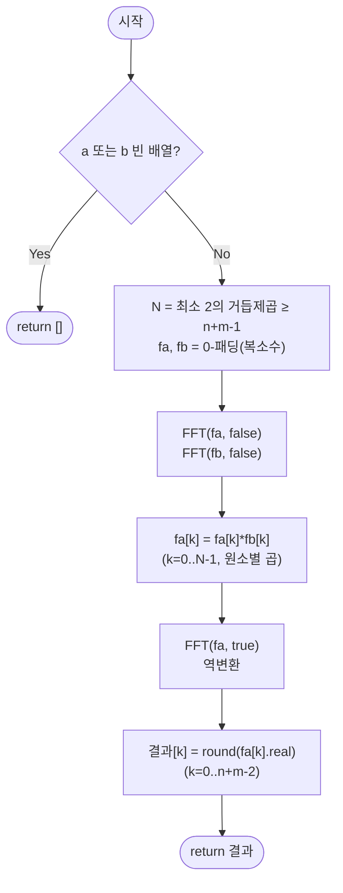

import { AlgorithmSimulation } from "#guide-sim";

# fftMultiply — 계수 대신 값으로 표현하면 곱셈이 O(n log n)으로 줄어드는 이유

## 한눈에 보는 컨셉

두 다항식을 곱할 때 계수끼리 그대로 곱하면 `O(nm)`이 걸려요. 그런데 다항식은 계수만이 아니라 **충분히 많은 점에서의 값**으로도 똑같이 표현할 수 있고, 값 표현끼리는 그냥 원소별로 곱하기만 하면 `O(N)`에 곱이 끝납니다. 문제는 "계수 ↔ 값"을 오가는 변환(평가·보간)을 얼마나 빨리 하느냐인데, 평가 점을 복소수 단위근으로 고르면 FFT(Fast Fourier Transform)로 이 변환이 `O(N log N)`에 끝나요. 그래서 전체 곱셈이 **평가 → 점별 곱 → 보간**의 세 단계, `O((n+m) \log(n+m))`에 완료됩니다.

## 출발점: 가장 순진한 방법부터

문제를 먼저 정확히 잡을게요.

```ts
function fftMultiply(a: number[], b: number[]): number[]
```

`a[i]`는 `x^i`의 계수, `b[j]`는 `x^j`의 계수(정수)입니다. 반환값은 곱 다항식 `C(x) = A(x) * B(x)`의 계수 배열이고, 길이는 정확히 `n + m - 1`(`n = a.length`, `m = b.length`)이에요. `a`나 `b` 둘 중 하나라도 빈 배열이면 `[]`을 반환합니다. 실용 범위는 `n, m ≤ 10^6`, 시간 제한은 1초예요.

가장 정직한 방법은 곱셈의 정의 $c_k = \sum_{i+j=k} a_i b_j$를 그대로 이중 루프로 도는 겁니다.

```ts
function fftMultiplyNaive(a: number[], b: number[]): number[] {
  if (a.length === 0 || b.length === 0) return [];
  const c = new Array(a.length + b.length - 1).fill(0);
  for (let i = 0; i < a.length; i++) {
    for (let j = 0; j < b.length; j++) {
      c[i + j] += a[i] * b[j]; // 모든 (i,j) 쌍을 직접 더한다
    }
  }
  return c;
}
```

작은 예로 손 검산해 볼까요? `a = [3, 2]`(즉 `3 + 2x`), `b = [1, 4]`(즉 `1 + 4x`)이면:

```text
c[0] = a0*b0                 = 3*1             = 3
c[1] = a0*b1 + a1*b0         = 3*4 + 2*1       = 14
c[2] =         a1*b1         =       2*4       = 8

곱셈 횟수 = n*m = 2*2 = 4번   (일반적으로는 n*m번)
```

`n = m = 2`일 때는 4번이라 아무 문제 없어 보이죠. 그런데 `n = m = 10^5`로 커지면 곱셈 횟수가 `n*m = 10^{10}`번이 됩니다. 초당 `10^9`번 연산하는 기계로도 10초 이상이 걸려 1초 제한을 훌쩍 넘깁니다. 이 문제 규모에서 우리가 노려야 할 목표는 `O((n+m) \log(n+m))`이에요 — `n=m=10^5`면 약 `2 \times 10^5 \times 17 \approx 3.4 \times 10^6`으로, naive 대비 자릿수가 몇 개나 줄어듭니다.

여기서 낌새 하나가 보여요. `c_k`를 구하는 이중 루프는 결국 **계수 표현**에서 곱셈의 정의를 그대로 실행한 것뿐입니다. "계수가 아니라 다른 방식으로 다항식을 표현하면 곱셈 자체가 더 쉬워지지 않을까?"라는 질문이 다음 절의 출발점이에요.

## 아이디어 자세히 들여다보기

### 다항식을 값으로 표현하기 — 수식과 그림

핵심 사실 하나를 정식으로 짚고 갈게요.

> **보간 유일성**: 차수가 `n-1` 이하인 다항식은 계수 `n`개(`a_0, \ldots, a_{n-1}`)로 표현할 수도 있지만, **서로 다른 `n`개의 점에서의 값**으로도 유일하게 결정됩니다.

직선(1차 다항식, 차수 1)을 예로 들면 감이 옵니다. 잠깐 확인해 볼까요? 직선은 몇 개의 점으로 결정될까요? 두 점이면 충분하죠(기울기와 절편이 정해집니다) — 이게 `n=2`인 경우의 보간 유일성입니다.

이 사실을 곱셈에 적용하면 이렇게 됩니다. `A`, `B`를 계수 표현이 아니라 같은 `N`개 점 `x_0, \ldots, x_{N-1}`에서의 값 `A(x_0), \ldots, A(x_{N-1})`과 `B(x_0), \ldots, B(x_{N-1})`로 표현해 두면, 곱 `C = A \cdot B`의 그 점들에서의 값은 그냥 **원소별 곱** `C(x_k) = A(x_k) \cdot B(x_k)`으로 얻어집니다. `C`의 차수가 `n+m-2`이므로 `N \geq n+m-1`개 점만 있으면 이 값들로부터 `C`의 계수를 다시 유일하게 복원(보간)할 수 있어요.

```text
계수 표현                    값 표현 (점 N개)                    계수 표현
A = [a0..a_{n-1}]  --평가-->  A(x0), ..., A(x_{N-1})   ┐
B = [b0..b_{m-1}]  --평가-->  B(x0), ..., B(x_{N-1})   ┤ 원소별 곱 O(N)
                                                         ▼
                              C(x_k) = A(x_k)*B(x_k), k=0..N-1
                                                         │ 보간
                                                         ▼
                    C = [c0, c1, ..., c_{n+m-2}]  (원하던 곱셈 결과)
```

그런데 여기서 하필 "아무 점"이 아니라 잘 고른 점을 써야 합니다. 왜 하필 그래야 할까요? 점 `x_0, \ldots, x_{N-1}`을 아무렇게나 고르면, 평가는 점마다 Horner 방식으로 `O(n)`씩 `N`번이라 `O(nN)`, 보간은 Lagrange 공식으로 `O(N^2)`이 걸립니다 — 여전히 naive보다 나을 게 없어요. 반면 점을 **복소수 `N`제곱근** $\omega_N^k = e^{2\pi i k/N}\ (k=0,\ldots,N-1)$으로 고르면, 이 점들 사이에 $\omega_N^{k+N/2} = -\omega_N^k$라는 대칭이 생겨서 평가 자체를 절반 크기 두 개로 쪼개는 재귀 구조(다음 절에서 다룰 Cooley-Tukey FFT)가 가능해지고, 평가·보간 모두 `O(N \log N)`에 끝납니다.

이 점들에서의 값 전체를 **DFT(이산 푸리에 변환)** 라고 부릅니다.

$$\text{DFT}(a)[k] = \sum_{j=0}^{N-1} a_j\, \omega_N^{jk}, \qquad \omega_N = e^{2\pi i /N}$$

`N = 4`로 `a = [3, 2, 0, 0]`(즉 `A(x) = 3 + 2x`)을 단위근 4개 $\omega_4^0=1,\ \omega_4^1=i,\ \omega_4^2=-1,\ \omega_4^3=-i$에서 직접 평가해 봅시다.

```text
A(1)  = 3 + 2*1  = 5        →  DFT(a)[0] = (5, 0)
A(i)  = 3 + 2*i  = 3 + 2i   →  DFT(a)[1] = (3, 2)
A(-1) = 3 + 2*(-1) = 1      →  DFT(a)[2] = (1, 0)
A(-i) = 3 + 2*(-i) = 3 - 2i →  DFT(a)[3] = (3, -2)
```

이 네 값은 뒤에서 볼 시뮬레이션의 첫 프레임과 정확히 같습니다 — 정의를 손으로 대입한 값이 알고리즘의 실제 중간 결과라는 뜻이에요.

### 단서를 설명해 주는 이론 — 합성곱 정리와 Cooley-Tukey 재귀

두 가지 이론이 지금까지의 단서를 정확히 해소해 줍니다.

**합성곱 정리(Convolution Theorem)**: 애초에 우리가 원했던 $c_k = \sum_{i+j=k} a_i b_j$는, `a`와 `b`를 길이 `N`으로 0-패딩했을 때의 **순환 합성곱** $(a \circledast b)[k] = \sum_{i=0}^{N-1} a_i\, b_{(k-i)\bmod N}$과 `N \geq n+m-1`인 한 정확히 일치합니다. 왜 그런지 한 단계씩 뜯어보면: 우리가 필요한 결과는 `k = 0, \ldots, n+m-2` 구간뿐이고, `a_i`가 실제 값을 갖는 `i`는 `0 \leq i \leq n-1`뿐입니다. **`i \leq k`인 항**은 `k-i`가 이미 `0` 이상 `N` 미만이라 `(k-i) \bmod N = k-i`로 전혀 순환하지 않고, 이는 선형 합성곱이 요구하는 인덱스와 정확히 같습니다. **`i > k`인 항**은 `k-i < 0`이라 한 번 순환해 `(k-i) \bmod N = k-i+N`이 되는데, `N \geq n+m-1`과 `i \leq n-1`을 합치면 `k-i+N \geq k - (n-1) + (n+m-1) = k+m \geq m`이 되어(마지막은 `k \geq 0`이므로) 이 순환된 인덱스는 항상 `b`의 실제 길이 `m`을 넘어선 **패딩된 0** 자리를 가리킵니다. 즉 순환이 실제로 일어나는 항은 전부 `0`을 곱해 사라지므로(랩어라운드로 인한 aliasing이 없으므로), 이 범위의 `k`에서는 순환 합성곱이 선형 합성곱과 정확히 일치합니다. 그리고 이 순환 합성곱은 DFT로 옮기면 원소별 곱이 됩니다.

$$\text{DFT}(a \circledast b)[k] = \text{DFT}(a)[k] \cdot \text{DFT}(b)[k]$$

왜 그럴까요? 정의를 그대로 풀면 됩니다.

$$\text{DFT}(a \circledast b)[k] = \sum_{t=0}^{N-1} \Big(\sum_{i=0}^{N-1} a_i b_{(t-i)\bmod N}\Big) \omega_N^{tk}$$

$t - i \equiv j \pmod N$으로 치환합니다(즉 $j = (t-i) \bmod N$). `i`를 고정하면 `t`가 `0`부터 `N-1`까지 한 번씩 돌 때 `j = (t-i) \bmod N`도 `0`부터 `N-1`까지 정확히 한 번씩(순환 이동일 뿐이니 겹치거나 빠지는 값 없이) 돕니다 — 그래서 `t`에 대한 합을 그대로 `j`에 대한 합으로 바꿔 써도 됩니다. 그리고 $\omega_N^{tk}$는 실제로 `t`가 `i+j`를 `N`으로 나눈 나머지여도(즉 `t`가 `i+j`보다 `N`만큼 작을 수 있어도) $\omega_N^{Nk} = 1$이라 $\omega_N^{tk} = \omega_N^{(i+j)k} = \omega_N^{ik}\,\omega_N^{jk}$로 그대로 정리됩니다. 이 두 사실을 이용해 이중합을 `i`합과 `j`합으로 분리하면 이렇게 됩니다.

$$= \sum_{i=0}^{N-1} a_i \omega_N^{ik} \sum_{j=0}^{N-1} b_j \omega_N^{jk} = \text{DFT}(a)[k] \cdot \text{DFT}(b)[k]$$

즉 "값 표현에서는 원소별 곱이면 충분하다"는 앞 절의 직관이, 우리가 원래 풀어야 했던 합성곱 문제와 정확히 같은 것임을 이 정리가 보증해 줍니다.

**Cooley-Tukey 재귀**: 그럼 DFT 자체(즉 `N`개 점에서의 평가)를 `O(N \log N)`에 계산하는 방법이 필요하죠. `N`이 짝수일 때, 인덱스를 짝수/홀수로 나눠서 재귀적으로 계산할 수 있습니다.

$$\text{DFT}(a)[k] = \sum_{j=0}^{N-1} a_j \omega_N^{jk} = \sum_{l} a_{2l}\, \omega_N^{2lk} + \omega_N^{k} \sum_{l} a_{2l+1}\, \omega_N^{2lk}$$

$\omega_N^{2} = \omega_{N/2}$이므로 두 합은 정확히 크기 `N/2`짜리 DFT입니다.

$$\text{DFT}(a)[k] = \text{DFT}(a_\text{even})[k] + \omega_N^{k} \cdot \text{DFT}(a_\text{odd})[k]$$

이 식은 `k = 0, \ldots, N/2-1`까지만 직접 커버합니다. 나머지 `k+N/2` 구간을 구하려면 정의를 그대로 `k+N/2`에 대입해야 하는데, 여기서 두 가지 사실이 함께 쓰입니다. 첫째, $\omega_N^{lN} = (\omega_N^N)^l = 1$이므로 $\omega_N^{2l(k+N/2)} = \omega_N^{2lk} \cdot \omega_N^{lN} = \omega_N^{2lk}$ — 즉 짝수 인덱스 항의 지수가 `k`일 때와 완전히 똑같아져서, 크기 `N/2` DFT인 $\text{DFT}(a_\text{even})$는 인수를 `k+N/2`로 넣어도 `k`를 넣은 것과 **같은 값**을 냅니다(주기 `N/2`). 홀수 인덱스 항도 같은 이유로 $\omega_N^{(2l+1)k}$ 부분(즉 $\text{DFT}(a_\text{odd})[k]$에 해당하는 부분)은 그대로 재사용되고, 둘째, $\omega_N^{N/2} = e^{i\pi} = -1$이므로 홀수 항 앞에 곱해지는 계수만 $\omega_N^{k+N/2} = \omega_N^k \cdot \omega_N^{N/2} = -\omega_N^{k}$로 부호가 뒤집힙니다. 두 사실을 합치면 다음처럼 **같은 두 DFT 값을 재사용**해서 얻을 수 있습니다.

$$\text{DFT}(a)[k+N/2] = \text{DFT}(a_\text{even})[k] - \omega_N^{k} \cdot \text{DFT}(a_\text{odd})[k]$$

크기 `N` DFT 하나가 크기 `N/2` DFT 두 개 + `O(N)`짜리 재조합(나비 연산, butterfly)으로 끝나니, 재귀 깊이가 `\log_2 N`이고 전체가 `T(N) = 2T(N/2) + O(N) = O(N \log N)`이 됩니다. **이 재귀 관계를 기억해 두세요** — 이후 "더 빠르게 만들 단서 찾기"에서 이 재귀를 어떻게 반복문으로 펴는지가 최적화의 핵심입니다.

역변환(IFFT, 보간에 해당)도 똑같은 재귀 구조를 쓰되 $\omega_N$ 대신 $\omega_N^{-1} = e^{-2\pi i/N}$을 쓰고, 마지막에 전체를 `N`으로 나누면 됩니다 — 이 이유는 다음 절에서 다룹니다.

### 왜 모순 없이 작동하는가

Cooley-Tukey 재귀가 모든 `N = 2^t`에 대해 실제로 옳은 DFT를 계산한다는 것을 귀납으로 확인해 볼게요.

**기저**: `N = 1`이면 $\text{DFT}(a)[0] = a_0 \cdot \omega_1^{0} = a_0$이므로, 재귀는 그냥 입력을 그대로 반환하면 됩니다(연산 없음).

**귀납 단계**: 크기 `N/2`에서 재귀가 옳다고 가정하면, 위에서 유도한 두 식

$$\text{DFT}(a)[k] = \text{DFT}(a_\text{even})[k] + \omega_N^k \text{DFT}(a_\text{odd})[k], \quad \text{DFT}(a)[k+N/2] = \text{DFT}(a_\text{even})[k] - \omega_N^k \text{DFT}(a_\text{odd})[k]$$

는 대수적으로 정의에서 직접 유도된 등식이라(위 절에서 이미 보였습니다), 크기 `N/2` DFT 두 개가 정확하기만 하면 그대로 성립합니다. **경우의 완전성**도 확인이 필요해요 — `k`가 `0`부터 `N/2-1`까지 돌면 `k`와 `k+N/2`가 `0`부터 `N-1`까지를 정확히 한 번씩(중복 없이) 모두 커버합니다. 그러니 크기 `N/2` 두 개의 정확성으로부터 크기 `N`의 정확성이 남김없이 따라 나옵니다.

이 **radix-2 Cooley-Tukey 재귀에서는 `N`이 항상 2의 거듭제곱이어야 하는 이유**도 여기서 나옵니다(FFT 자체가 일반적으로 2의 거듭제곱 길이만 허용하는 것은 아니고 — radix-3, mixed-radix, Bluestein 알고리즘처럼 임의 길이를 다루는 변형도 있습니다 — 우리가 짝/홀로 정확히 반씩 나누는 이 재귀를 택했기 때문에 생기는 조건이에요). 재귀가 `N=1`까지 정확히 반으로만 쪼개지려면 `N`이 2의 거듭제곱이어야 하고, 그래서 우리는 `n+m-1` 이상인 **가장 작은 2의 거듭제곱**으로 0-패딩합니다.

여기서 **헷갈리기 쉬운 포인트**가 둘 있어요.

- **정방향과 역방향의 각도 부호를 바꿔야 한다는 것.** 역변환은 그냥 같은 함수를 다시 부르면 되는 게 아니라, $\omega_N$ 대신 $\omega_N^{-1}$(즉 각도 부호 반전)을 써야 합니다. 이걸 빼먹으면 어떻게 될까요? `a=[3,2]`, `b=[1,4]` 예시에서 역변환 각도 부호를 안 바꾸고 그대로 돌리면(나누기는 정상 적용해도) 결과가 `[3, 0, 8, 14]`로 나옵니다 — 정답 `[3, 14, 8, 0]`과 비교하면 인덱스 1과 3이 뒤바뀐 모양이에요. 이유는 켤레 대칭이 아니라 **정방향 DFT를 두 번 연달아 적용하면 인덱스가 뒤집힌다**는 성질 때문입니다: $\text{DFT}(\text{DFT}(x))[k] = N \cdot x[(-k) \bmod N]$. 각도 부호를 반전하지 않은 "역변환"은 정확히 정방향 DFT를 한 번 더 적용한 것과 같으므로, `÷N`을 적용해도 인덱스 `k`가 `(-k) mod N`, 즉 `0`은 그대로, 나머지는 좌우가 뒤집힌 자리에 값이 나오는 겁니다(`N=4`라 인덱스 1과 3만 맞바뀝니다).

  ```text
  올바른 IFFT 실수부: [3, 14, 8, 0]
  부호 버그(각도 반전 누락): [3, 0, 8, 14]   ← 인덱스 1,3이 맞바뀐 모양
  ```

- **역변환 후 `N`으로 나누는 것을 잊으면 안 된다는 것.** 정방향 DFT를 두 번(역방향 각도로 한 번) 적용하면 원래 값의 정확히 `N`배가 나옵니다. 이건 단위근의 직교성 $\sum_{k=0}^{N-1} \omega_N^{k(l-j)} = N$ (l=j일 때) 또는 `0`(그 외)에서 나오는 결과예요. 나누기를 빼먹으면 같은 예시에서 실수부가 `[12, 56, 32, 0]`으로 나옵니다 — 정답 `[3, 14, 8, 0]`의 정확히 4배(`N=4`)입니다.

  ```text
  올바른 값(÷N 적용):   [3, 14, 8, 0]
  ÷N을 빼먹은 값:       [12, 56, 32, 0]   ← 정확히 N=4배
  ```

엣지 케이스도 짚고 갈게요.

```text
a = [] 또는 b = []           → FFT 진입 전에 [] 반환 (가드가 먼저)
a = [1], b = [1]             → N=1, DFT는 항등(연산 없음) → [1]
N이 n+m-1과 정확히 같은 경우 → a=[1,2,3], b=[4,5]: resultLen=4, N=4(패딩 없이 딱 맞음)
                                실제 결과 [4, 13, 22, 15] (naive와 일치, 경계에서 넘치지 않음)
```

지금까지 확인한 조각을 한 번에 이어 보면: Cooley-Tukey 재귀가 DFT를 정확히 계산한다는 것(방금 귀납으로 확인), 0-패딩된 순환 합성곱이 `N \geq n+m-1`에서 우리가 원하는 선형 합성곱과 일치한다는 것(합성곱 정리 절), 그리고 그 순환 합성곱이 DFT에서는 원소별 곱이 된다는 것을 모두 합치면 — "정방향 FFT로 값 표현을 얻고 → 원소별 곱하고 → 역방향 FFT(및 `÷N`)로 되돌리면 정확히 `c_k`가 나온다"는 전체 파이프라인의 정확성이 남김없이 따라 나옵니다. 이제 이 파이프라인을 코드로 옮겨 볼게요.

## 아이디어를 코드로 옮기기

앞 절의 재귀 관계를 그대로 옮기면 이렇습니다. 복소수는 `{ re, im }` 객체로 표현해요.

```ts
type Complex = { re: number; im: number };

function nextPow2(n: number): number {
  let N = 1;
  while (N < n) N <<= 1;
  return N;
}

function fftRecursive(a: Complex[], invert: boolean): Complex[] {
  const N = a.length;
  if (N === 1) return a; // 기저: 크기 1의 DFT는 자기 자신

  const even: Complex[] = [];
  const odd: Complex[] = [];
  for (let i = 0; i < N; i++) {
    (i % 2 === 0 ? even : odd).push(a[i]);
  }

  const fe = fftRecursive(even, invert);
  const fo = fftRecursive(odd, invert);

  const result: Complex[] = new Array(N);
  const angle = ((2 * Math.PI) / N) * (invert ? -1 : 1); // 역방향은 각도 부호 반전
  for (let k = 0; k < N / 2; k++) {
    const wRe = Math.cos(angle * k);
    const wIm = Math.sin(angle * k);
    const tRe = wRe * fo[k].re - wIm * fo[k].im; // t = w^k * fo[k] (복소수 곱)
    const tIm = wRe * fo[k].im + wIm * fo[k].re;
    result[k] = { re: fe[k].re + tRe, im: fe[k].im + tIm };
    result[k + N / 2] = { re: fe[k].re - tRe, im: fe[k].im - tIm };
  }
  return result;
}

function fftMultiply(a: number[], b: number[]): number[] {
  if (a.length === 0 || b.length === 0) return [];
  const resultLen = a.length + b.length - 1;
  const N = nextPow2(resultLen);

  const fa: Complex[] = new Array(N);
  const fb: Complex[] = new Array(N);
  for (let i = 0; i < N; i++) {
    fa[i] = { re: i < a.length ? a[i] : 0, im: 0 };
    fb[i] = { re: i < b.length ? b[i] : 0, im: 0 };
  }

  const Fa = fftRecursive(fa, false);
  const Fb = fftRecursive(fb, false);

  const Fc: Complex[] = new Array(N);
  for (let i = 0; i < N; i++) {
    Fc[i] = {
      re: Fa[i].re * Fb[i].re - Fa[i].im * Fb[i].im, // 복소수 곱
      im: Fa[i].re * Fb[i].im + Fa[i].im * Fb[i].re,
    };
  }

  const c = fftRecursive(Fc, true); // 역변환 (각도 부호만 반전, 나누기는 아직 안 함)
  const result: number[] = new Array(resultLen);
  for (let i = 0; i < resultLen; i++) {
    result[i] = Math.round(c[i].re / N); // 여기서 딱 한 번 N으로 나눈다
  }
  return result;
}
```

**가장 실수가 잦은 부분은 `÷N` 나누기를 어디서 하느냐입니다.** 재귀 호출은 매번 크기가 절반으로 줄어드는데, 만약 "역변환이니까 나눠야지"라는 생각으로 `fftRecursive` 안에서 매 호출마다 나눠 버리면 재귀 깊이만큼 여러 번 나누는 꼴이 되어 값이 지나치게 작아집니다. 나누기는 **재귀가 전부 끝난 뒤, 최상위 호출자에서 딱 한 번**만 해야 합니다(`fftMultiply` 안의 `c[i].re / N` 한 줄). 그 외에 결정 지점: 기저 조건은 `N === 1`일 때 아무 연산 없이 그대로 반환(위 "왜 모순 없이"의 기저와 동일), 각도 부호는 `invert` 하나로만 제어하고 나머지 나비 연산 공식은 정방향·역방향이 완전히 같습니다.

## 더 빠르게 만들 단서 찾기

이 재귀 구현을 실행 관점에서 관찰해 봅시다. 재귀가 한 단계 내려갈 때마다 `even`, `odd`, `result` 배열을 **새로** 만들어요. 크기 `N=8`이라면 다음처럼 배열이 계속 생성됩니다.

```text
레벨0: 크기 8 배열 1개 (result)
레벨1: 크기 4 배열 2개 (even, odd)
레벨2: 크기 2 배열 4개
레벨3: 크기 1 배열 8개 (재귀 기저, push로 생성)
------------------------------------------------
레벨별 배열 개수 1+2+4+8 = 15개, 그것도 fftMultiply 한 번 호출에
fa 변환·fb 변환·역변환까지 세 번 반복 → 총 45개 배열 할당
```

점근 복잡도는 여전히 `O(N \log N)`이지만(각 레벨의 총 원소 수가 `N`이고 레벨이 `\log N`개), 레벨마다 `push`로 배열을 채우고 버리는 과정에서 힙 할당·가비지 컬렉션 비용과 재귀 함수 호출 오버헤드가 쌓입니다. 게다가 원소들이 매번 새 배열로 복사되니 캐시 지역성도 나빠요. **재귀를 걷어내고 딱 한 벌의 배열 안에서 끝낼 수는 없을까?**가 다음 단서입니다.

## 단서를 최적화로 연결하기

재귀가 만드는 짝/홀 분리를 잘 보면, 최종적으로 재귀의 맨 아래(기저, 크기 1)에 도달했을 때 각 원소가 원래 배열의 **어느 위치**에서 왔는지가 미리 정해져 있다는 걸 알 수 있어요. 그 위치는 원래 인덱스의 **이진수를 뒤집은(bit-reversal) 자리**입니다. `N=8`이면 다음과 같습니다.

```text
원래 인덱스(2진)   →  뒤집은 인덱스(2진) = 새 위치
0 = 000            →  000 = 0
1 = 001            →  100 = 4
2 = 010            →  010 = 2
3 = 011            →  110 = 6
4 = 100            →  001 = 1
5 = 101            →  101 = 5
6 = 110            →  011 = 3
7 = 111            →  111 = 7
```

그러니 재귀로 짝/홀을 나누는 대신, **처음에 한 번** 이 순서로 원소를 재배치해 두면, 그 뒤로는 재귀 호출 없이 **크기 2 → 4 → 8 → ... → N** 순서로 나비 연산을 반복문으로 밀어붙일 수 있습니다.

```text
Before(재귀): 매 레벨마다 새 배열 생성 → top-down 재귀 호출 → 배열 15개(N=8 기준)
After(반복):  bit-reversal로 딱 한 번 제자리 재배치 → bottom-up으로 len=2,4,8 순회
              → fftIterative 함수 내부는 추가 배열 할당 없음(re[], im[] 두 배열 안에서 전부 끝남)
```

이때 지켜야 할 불변식은 이겁니다.

> 반복문이 `len` 단계를 마친 시점에서, 원본 배열을 `len` 크기로 나눈 각 블록은 그 블록에 해당하는 부분열의 DFT 값을 담고 있다.

이 불변식의 **기저**는 `len = 1`(bit-reversal 직후, 아직 나비 연산을 하기 전)입니다 — 크기 1짜리 블록은 원소 하나뿐이라 그 자체가 이미 크기 1 DFT(앞서 본 재귀의 기저와 동일하게 "연산 없이 자기 자신")를 만족하므로, 굳이 `len=1` 단계를 반복문으로 돌 필요 없이 시작점으로 그냥 성립합니다. `len`을 2, 4, 8, ...로 두 배씩 늘려가며 이 불변식을 유지하면, 마지막에 `len = N`이 됐을 때 전체가 정확한 DFT가 됩니다 — 이는 앞서 귀납으로 확인한 재귀 관계를 반복문 순서로 그대로 재현한 것뿐이에요.

## 최적화 코드

배열을 재배치하는 비트 역순 순열과, 그 뒤 반복문으로 나비 연산을 도는 부분이 바뀝니다.

```ts
function fftIterative(re: Float64Array, im: Float64Array, invert: boolean): void {
  const N = re.length;

  // 비트 역순 순열 — 재귀가 만들었을 최종 순서를 한 번에 재현
  for (let i = 1, j = 0; i < N; i++) {
    let bit = N >> 1;
    for (; j & bit; bit >>= 1) j ^= bit;
    j ^= bit;
    if (i < j) {
      [re[i], re[j]] = [re[j], re[i]];
      [im[i], im[j]] = [im[j], im[i]];
    }
  }

  // bottom-up 나비 연산: len = 2, 4, 8, ..., N
  for (let len = 2; len <= N; len <<= 1) {
    const ang = ((2 * Math.PI) / len) * (invert ? -1 : 1);
    for (let i = 0; i < N; i += len) {
      for (let j = 0; j < len / 2; j++) {
        const wRe = Math.cos(ang * j); // 회전 인자를 매번 인덱스로 직접 계산(정밀도 우선, 아래 설명 참고)
        const wIm = Math.sin(ang * j);
        const uRe = re[i + j], uIm = im[i + j];
        const vRe = re[i + j + len / 2] * wRe - im[i + j + len / 2] * wIm;
        const vIm = re[i + j + len / 2] * wIm + im[i + j + len / 2] * wRe;

        re[i + j] = uRe + vRe;               // 나비 연산 위쪽
        im[i + j] = uIm + vIm;
        re[i + j + len / 2] = uRe - vRe;      // 나비 연산 아래쪽
        im[i + j + len / 2] = uIm - vIm;
      }
    }
  }

  if (invert) {
    for (let i = 0; i < N; i++) {
      re[i] /= N; // 재귀 버전과 마찬가지로 딱 한 번, 맨 끝에서만 나눈다
      im[i] /= N;
    }
  }
}

function fftMultiply(a: number[], b: number[]): number[] {
  if (a.length === 0 || b.length === 0) return [];
  const resultLen = a.length + b.length - 1;
  let N = 1;
  while (N < resultLen) N <<= 1;

  const faRe = new Float64Array(N);
  const faIm = new Float64Array(N);
  const fbRe = new Float64Array(N);
  const fbIm = new Float64Array(N);
  for (let i = 0; i < a.length; i++) faRe[i] = a[i];
  for (let i = 0; i < b.length; i++) fbRe[i] = b[i];

  fftIterative(faRe, faIm, false);
  fftIterative(fbRe, fbIm, false);

  const fcRe = new Float64Array(N);
  const fcIm = new Float64Array(N);
  for (let i = 0; i < N; i++) {
    fcRe[i] = faRe[i] * fbRe[i] - faIm[i] * fbIm[i];
    fcIm[i] = faRe[i] * fbIm[i] + faIm[i] * fbRe[i];
  }

  fftIterative(fcRe, fcIm, true);

  const result = new Array<number>(resultLen);
  for (let i = 0; i < resultLen; i++) {
    result[i] = Math.round(fcRe[i]);
  }
  return result;
}
```

**가장 중요한 줄은 나비 연산 네 줄입니다.**

```ts
re[i + j] = uRe + vRe;
im[i + j] = uIm + vIm;
re[i + j + len / 2] = uRe - vRe;
im[i + j + len / 2] = uIm - vIm;
```

`u`는 그대로, `v`는 회전 인자를 곱한 값이고, 이 둘을 더하고 빼는 것이 재귀 버전의 `result[k] = fe[k]+t`, `result[k+N/2] = fe[k]-t`와 정확히 같은 연산입니다 — 다만 이제는 새 배열을 만들지 않고 **같은 배열의 두 위치를 제자리에서 갱신**해요. 순서를 바꿔 `re[i+j]`를 먼저 덮어쓰고 나서 `re[i+j+len/2]`를 계산하면 `uRe`를 이미 잃어버린 뒤라 조용히 틀린 값이 나옵니다 — 그래서 `uRe`, `uIm`을 지역 변수로 먼저 빼 둔 뒤에 두 결과를 계산하는 순서가 중요해요.

> 기억법: "짝은 더하고, 홀은 돌려서 더하고 뺀다 — 그게 나비(butterfly)의 전부다."

**왜 `wRe`, `wIm`을 매 `j`마다 `Math.cos(ang*j)`로 다시 계산할까요?** 흔한 대안은 `wRe, wIm`을 `1, 0`에서 시작해 매 스텝마다 `wLenRe, wLenIm`을 곱해 누적 갱신하는 방식입니다(곱셈 두 번이 삼각함수 호출 두 번보다 싸니까요). 문제는 이 누적 곱셈이 부동소수점 오차를 매 스텝 그대로 이어받는다는 점이에요. 실측해 보면 `n=m=500000`(`N \approx 1.05 \times 10^6`) 근처, 계수가 수천 단위만 돼도 이 누적 오차가 `Math.round` 앞에서 `0.5`에 근접하거나 넘어서 **정답과 다른 정수로 반올림**되는 사례가 나옵니다. 반면 매번 `j`로부터 직접 계산하면 각 회전 인자의 오차가 다른 스텝과 독립적이라 누적되지 않고, 같은 규모에서 오차가 `0.5`보다 몇 자릿수나 작게 유지됩니다. 그래서 이 구현은 상수 배 속도보다 정확성을 우선해 매번 다시 계산합니다.

**계수 크기와 `Math.round`의 안전 범위.** 입력 계수의 절댓값이 `C` 이하이고 패딩 길이가 `N`이면, 결과 계수의 참값은 최대 `N \cdot C^2` 정도까지 커질 수 있습니다. 부동소수점 배정밀도는 유효자릿수가 약 `2^{53} \approx 9 \times 10^{15}`이므로, `N \cdot C^2`가 여기서 몇 자릿수 이상 여유 있게 작을 때만(대략 `10^{12}` 이하 권장) `Math.round`가 안전합니다. 계수가 매우 크거나 결과를 특정 모듈러 `p`로 정확히 맞춰야 한다면, 부동소수점 오차 자체가 없는 NTT(수론적 변환)로 바꿔야 해요 — 이 절 끝에서 다시 언급합니다.

지금까지 얻은 것: 반복적 FFT(비트 역순 + bottom-up 나비 연산)로 시간 복잡도 `O(N \log N)`, 공간 복잡도 `O(N)`을 유지하면서 재귀 호출과, 매 재귀 레벨마다 새로 만들던 `even`/`odd`/`result` 중간 배열 할당을 모두 없앴습니다(`fftIterative` 함수 자체는 인자로 받은 `re[], im[]` 두 배열 안에서 끝나고 추가 배열을 만들지 않습니다 — 다만 `fftMultiply` 전체로 보면 `faRe/faIm/fbRe/fbIm/fcRe/fcIm` 여섯 개의 `Float64Array`를 여전히 최상위에서 한 번씩 할당합니다). 정확히 `n=m=10^5`(`N \approx 2 \times 10^5`) 규모에서 앞서 세운 목표 `O((n+m)\log(n+m)) \approx 3.4 \times 10^6`에 도달한 것이고, 이 값은 naive의 `10^{10}`과 비교해 자릿수 몇 개가 줄어든 크기예요.

더 최적화할 여지가 있을까요? 이 알고리즘의 뼈대로는 여기가 사실상 끝입니다(회전 인자를 미리 테이블로 캐싱하거나, 실수 입력 두 개를 복소수 하나로 묶어 FFT 호출 횟수를 절반으로 줄이는 것 같은 상수 배 미세 최적화 정도가 남아 있어요). 참고로 계수가 정수이고 결과를 모듈러 값으로 정확히 얻어야 하는 경우에는 부동소수점 오차 걱정이 없는 NTT(수론적 변환)라는 특화 해법도 존재합니다. 그럼에도 FFT를 배우는 이유는 **범용성**이에요 — `fftMultiply` 자체의 입출력 계약은 정수 계수(그래서 `Math.round`로 복원)로 고정돼 있지만, FFT라는 도구 자체는 특정 소수 모듈러에 매이지 않고 실수·복소수 계수를 다루는 모든 합성곱(신호 처리, 큰 정수 곱셈, 문자열 와일드카드 매칭 등)에 같은 틀을 그대로 쓸 수 있습니다.

## 실행 시각화

고정 입력 `a = [3, 2]`(즉 `3 + 2x`), `b = [1, 4]`(즉 `1 + 4x`)에 대해 `fftMultiply`를 실행하는 과정입니다. 결과 길이는 `n+m-1 = 3`이므로 `N = 4`로 0-패딩합니다. `keyValue` 패널은 FFT 파이프라인의 각 단계(0-패딩 → 정방향 FFT → 점별 곱 → 역방향 FFT → 반올림)에서의 값들을 보여줘요. 실제 반환값은 `[3, 14, 8]`이며(`(3+2x)(1+4x) = 3 + 14x + 8x^2`), 앞서 손으로 계산한 값·시뮬레이션 마지막 프레임과 모두 일치합니다.

> 대화형 시뮬레이션은 MDX 런타임에서 표시됩니다.

export const steps = [
  {
    title: "0-패딩",
    detail: "결과 길이 3 → N=4. fa = [3,2,0,0], fb = [1,4,0,0] (복소수, 허수부 0).",
    entries: [
      { label: "N", value: 4 },
      { label: "fa", value: "[3, 2, 0, 0]" },
      { label: "fb", value: "[1, 4, 0, 0]" },
    ],
  },
  {
    title: "정방향 FFT(fa)",
    detail: "Cooley-Tukey로 a를 주파수 영역으로 변환. 복소수 (실, 허) 표기.",
    entries: [
      { label: "DFT(a)[0]", value: "(5, 0)" },
      { label: "DFT(a)[1]", value: "(3, 2)" },
      { label: "DFT(a)[2]", value: "(1, 0)" },
      { label: "DFT(a)[3]", value: "(3, -2)" },
    ],
  },
  {
    title: "정방향 FFT(fb)",
    detail: "b도 동일하게 주파수 영역으로 변환.",
    entries: [
      { label: "DFT(b)[0]", value: "(5, 0)" },
      { label: "DFT(b)[1]", value: "(1, 4)" },
      { label: "DFT(b)[2]", value: "(-3, 0)" },
      { label: "DFT(b)[3]", value: "(1, -4)" },
    ],
  },
  {
    title: "점별 곱",
    detail: "주파수 영역에서 fa[k] * fb[k] (복소수 곱). 합성곱 정리로 시간 영역 합성곱에 대응.",
    entries: [
      { label: "[0] 5*5", value: "(25, 0)" },
      { label: "[1] (3,2)*(1,4)", value: "(-5, 14)" },
      { label: "[2] 1*-3", value: "(-3, 0)" },
      { label: "[3] (3,-2)*(1,-4)", value: "(-5, -14)" },
    ],
  },
  {
    title: "역방향 FFT(IFFT)",
    detail: "역변환 후 N=4로 나눠 시간 영역 복귀. 실수부가 계수, 허수부는 ~0.",
    entries: [
      { label: "실수부 [0]", value: 3 },
      { label: "실수부 [1]", value: 14 },
      { label: "실수부 [2]", value: 8 },
      { label: "실수부 [3]", value: 0 },
    ],
  },
  {
    title: "완료: round → [3, 14, 8]",
    detail: "앞 n+m-1=3 개 실수부를 반올림. (3+2x)(1+4x) = 3 + 14x + 8x^2.",
    entries: [
      { label: "c0", value: 3 },
      { label: "c1", value: 14 },
      { label: "c2", value: 8 },
    ],
  },
];

<AlgorithmSimulation view="keyValue" steps={steps} title="fftMultiply: (3+2x)(1+4x)" />

## 흐름 한눈에 보기



**핵심 불변식**: 정방향 FFT 완료 직후에는 `fa[k] = DFT(a)[k]`, `fb[k] = DFT(b)[k]`입니다. 원소별 곱을 마친 시점(위 그림의 F 단계)에는 아직 계수가 아니라 **주파수 영역 값** `fa[k] = DFT(a)[k] \cdot DFT(b)[k] = DFT(c)[k]`가 들어 있고, 여기에 IFFT(역변환 + `÷N`)까지 적용해야 비로소 `fa[k] = c_k = \sum_{i+j=k} a_i b_j`로 시간 영역 계수가 됩니다.

## 스스로 점검하기

1. `a = [2, 3, 4]`, `b = [5, 6]`일 때 $c_k = \sum_{i+j=k} a_i b_j$ 정의대로 `c0, c1, c2, c3`를 손으로 구해 보세요. (실제 `fftMultiply([2,3,4],[5,6])`의 반환값은 `[10, 27, 38, 24]`입니다 — 손 계산과 맞춰 보세요.)
2. 역변환에서 `÷N`을 빼먹으면 `a=[3,2]`, `b=[1,4]` 예시의 결과가 왜 정확히 `[12, 56, 32, 0]`(정답의 4배)이 되는지, 단위근의 직교성 $\sum_k \omega_N^{k(l-j)}$을 이용해 설명해 보세요.
3. 세 자릿수 정수 두 개(예: `123 \times 456`)를 이 알고리즘으로 곱하려면 어떻게 다항식으로 바꿔야 할까요? (힌트: 자릿수를 계수로, 10진법의 자리값을 `x`의 거듭제곱으로 치환한 뒤, 곱셈 결과에서 자리올림(carry)을 처리합니다.)
