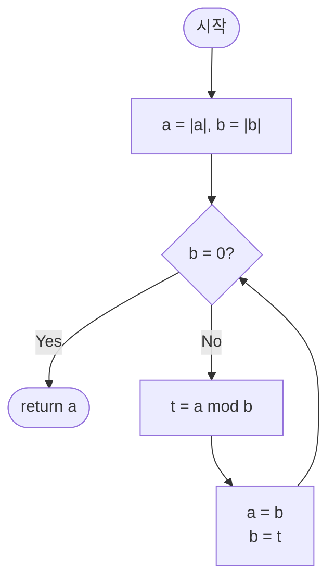

import { AlgorithmSimulation } from "#guide-sim";

# gcd — 나머지를 취해도 공약수가 그대로 남는 이유

## 한눈에 보는 컨셉

두 정수 `a`, `b`의 최대공약수를 구할 때, 1부터 하나씩 나눠 보는 대신 나눗셈의 나머지를 이용해 문제 크기를 접어 버리는 기법이에요(정확히는 두 번의 나눗셈마다 값이 최소 절반 이하로 줄어듭니다 — 한 번만으로는 항상 절반이 보장되지 않아요). 핵심 관찰은 `gcd(a, b) = gcd(b, a mod b)` — 나머지를 취해도 두 수의 공약수 집합이 그대로 보존된다는 것입니다. 이 전환 하나만으로 `O(min(|a|,|b|))`였던 탐색이 `O(log min(|a|,|b|))`로 줄어, 최악의 경우(인접한 피보나치 수 쌍)라도 `2^63` 크기의 bigint가 100번 안쪽의 반복이면 충분해집니다.

## 출발점: 가장 순진한 방법부터

문제를 먼저 정확히 고정할게요.

```ts
function gcd(a: bigint, b: bigint): bigint
```

| 파라미터 | 의미 | 제약 |
|----------|------|------|
| `a` | 첫 번째 정수 | 임의의 bigint (음수·0 포함), 실용 범위 `\|a\| ≤ 2^63` |
| `b` | 두 번째 정수 | 임의의 bigint (음수·0 포함), 실용 범위 `\|b\| ≤ 2^63` |

반환값은 두 수의 최대공약수이고 항상 `0` 이상이에요. 음수가 들어와도 절댓값 기준으로 계산합니다.

"두 수를 모두 나누는 가장 큰 수를 찾아라"라는 문제를 처음 마주치면 가장 정직한 접근은 후보를 전부 나열해 보는 겁니다. 공약수는 `min(|a|,|b|)`을 넘을 수 없으니, 그 값부터 1까지 내려가며 두 수를 동시에 나누어떨어지게 하는 첫 값을 찾으면 됩니다.

```ts
function gcdNaive(a: bigint, b: bigint): bigint {
  a = a < 0n ? -a : a;
  b = b < 0n ? -b : b;
  if (a === 0n) return b;
  if (b === 0n) return a;
  let candidate = a < b ? a : b;
  while (candidate > 1n) {
    if (a % candidate === 0n && b % candidate === 0n) return candidate; // 둘 다 나누어떨어지는 첫 후보
    candidate--;
  }
  return 1n;
}
```

작은 예로 직접 나열해 봅시다. `a = 12`, `b = 18`이면 후보는 12부터 시작합니다.

```text
gcd(12, 18) 후보 탐색: candidate = min(12,18) = 12 부터 1까지 감소

candidate=12: 12%12=0 이지만 18%12=6 ≠ 0      불일치
candidate=11..7: 마찬가지로 최소 한쪽이 안 나눠짐
candidate=6:  12%6=0, 18%6=0                   일치 → gcd = 6

원소 몇 개짜리 예시는 순식간에 끝나지만,
a ≈ 2^63 이면 candidate가 최대 9×10^18개 남아 사실상 끝나지 않는다
```

여기서 낌새가 하나 보입니다. `candidate = 12`를 확인하다가 `18 % 12 = 6`이라는 나머지가 나온 순간, 사실 `(12, 18)`의 공약수 집합과 `(12, 6)`의 공약수 집합이 똑같다는 걸 눈치챌 수 있어요 — 큰 수 `18`을 작은 수 `12`로 나눈 나머지 `6`이, `18` 대신 `12`와 짝지어져도 같은 공약수 집합을 만든다는 뜻입니다(왜 `18`이 아니라 `12`와 짝짓는지는 바로 다음 절에서 정식으로 증명합니다). **나머지를 취해도 공약수 집합이 바뀌지 않는다면, 굳이 후보를 하나씩 내리며 확인할 필요가 있을까요?** 이 낌새를 정식으로 다듬는 것이 다음 절의 목표입니다.

## 아이디어 자세히 들여다보기

### 나머지를 취해도 공약수가 그대로인 이유 — 수식과 그림

두 정수 `a`, `b`(`b > 0`)를 나누면 항상 다음을 만족하는 몫 `q`와 나머지 `r`이 존재합니다.

$$a = q \cdot b + r, \qquad 0 \leq r < b$$

이제 `d`가 `a`와 `b`의 공약수라고 해 봅시다. `d | a`이고 `d | b`이면 `a = x \cdot d`, `b = y \cdot d`인 정수 `x`, `y`가 존재하고, `a - q \cdot b = (x - q \cdot y) \cdot d`이므로 `d | (a - q \cdot b) = r`이 성립합니다. 거꾸로 `d`가 `b`와 `r`의 공약수이면 같은 방식으로 `b = y' \cdot d`, `r = z \cdot d`라 할 때 `q \cdot b + r = (q \cdot y' + z) \cdot d`이므로 `d | (q \cdot b + r) = a`이고, 따라서 `d`는 `a`와 `b`의 공약수이기도 합니다. 즉,

$$\{d : d \mid a,\ d \mid b\} = \{d : d \mid b,\ d \mid r\}$$

양쪽 집합이 완전히 같으니 그중 최댓값도 같습니다.

$$\gcd(a, b) = \gcd(b, a \bmod b)$$

그림으로 확인해 볼게요. `a = 48`, `b = 18`이면 `48 = 2 · 18 + 12`입니다.

```text
48의 약수: 1 2 3 4 6 8 12 16 24 48
18의 약수: 1 2 3 6 9 18
공통(=(48,18)의 공약수): 1 2 3 6

12의 약수: 1 2 3 4 6 12
공통(=(18,12)의 공약수): 1 2 3 6   ← (48,18)의 공약수 집합과 완전히 동일!
```

잠깐, 확인 하나만 해 볼까요? `gcd(18, 12)`와 `gcd(12, 6)`의 공약수 집합도 같을까요? `18 = 1·12 + 6`이니 위 등식을 그대로 적용하면 `{d : d|18, d|12} = {d : d|12, d|6}`이고, 실제로 `12`의 약수 `{1,2,3,4,6,12}`와 `6`의 약수 `{1,2,3,6}`의 교집합은 둘 다 `{1,2,3,6}`으로 같습니다.

**왜 하필 "나머지"일까요?** 원래 유클리드가 쓴 방식은 나눗셈이 아니라 뺄셈이었습니다 — `gcd(a, b) = gcd(a - b, b)` (단, `a ≥ b`)를 `a < b`가 될 때까지 반복하는 방식이죠. 이 정의도 옳지만, `a`가 `b`보다 훨씬 크면(`a = 10^18`, `b = 1`처럼) 뺄셈을 `10^18`번 반복해야 합니다. 나머지 `a mod b`는 그 뺄셈을 몫 `q`번만큼 한꺼번에 처리한 결과예요 — 즉 "여러 번의 뺄셈을 한 번에 묶어서 뛰어넘는" 형태이기 때문에 나눗셈 기반 정의를 씁니다.

### 단서를 설명해 주는 이론 — 나눗셈 정리(division algorithm)

방금 쓴 등식은 사실 "나눗셈 정리"라는 이름이 붙은 정리에 기대고 있습니다. 정식으로 쓰면 다음과 같아요.

> **나눗셈 정리**: 임의의 정수 `a`와 양의 정수 `b`에 대해, `a = q·b + r`이고 `0 ≤ r < b`를 만족하는 정수 `q`, `r`이 **유일하게** 존재한다.

존재성은 이렇게 확인할 수 있습니다. 집합 `S = {a - k·b : k ∈ ℤ, a - k·b ≥ 0}`는 공집합이 아니고(예: `k`를 충분히 작게 잡으면 `a - k·b`가 얼마든지 커질 수 있음) 자연수만 담고 있으니, 정렬 원리(well-ordering principle)에 의해 최솟값 `r`이 존재합니다. 이 `r`이 `b` 이상이라면 `r - b`도 `S`의 원소이면서 `r`보다 작아 최솟값이라는 가정에 모순이니, 반드시 `r < b`입니다. 유일성은 두 쌍 `(q₁,r₁)`, `(q₂,r₂)`가 모두 조건을 만족한다고 가정하면 `(q₁-q₂)·b = r₂-r₁`이고 우변의 절댓값이 `b`보다 작으므로 `q₁=q₂, r₁=r₂`로 강제됩니다.

이 정리에서 두 가지를 기억해 두세요. 하나는 방금 쓴 "공약수 집합이 보존된다"는 등식의 근거이고, 다른 하나는 `0 ≤ r < b`라는 부등식 — **나머지가 항상 원래 `b`보다 엄격히 작다**는 사실입니다. 뒤에서 종료를 증명할 때 바로 이 부등식을 다시 씁니다.

이 등식은 이름만 다를 뿐 실전에서도 자주 마주칩니다. 분수를 기약분수로 약분하거나, 모듈러 역원·중국인의 나머지 정리(CRT)를 계산하기 전 전처리 단계로 gcd를 구할 때 모두 이 정리가 배경에 깔려 있어요.

### 왜 모순 없이 작동하는가

지금까지의 증명은 `b > 0`인 경우만 다뤘습니다. 음수가 섞인 입력은 어떻게 될까요? `d`가 `a`를 나누는 것과 `-a`를 나누는 것은 완전히 같은 조건이므로(부호만 다를 뿐 배수 관계는 그대로예요), `a`, `b`의 공약수 집합은 `|a|`, `|b|`의 공약수 집합과 정확히 같습니다. 그래서 함수 맨 앞에서 `a`, `b`를 절댓값으로 한 번만 정규화해 두면, 그 뒤로는 오직 `0` 이상인 `b`에 대해서만 증명하면 충분합니다 — 음수 케이스가 별도로 필요하지 않습니다.

유클리드 호제법이 지키는 불변식은 하나입니다.

> 반복문의 어느 시점이든, 현재 `(a, b)`의 `gcd`는 처음 입력받은 `(a₀, b₀)`의 `gcd`와 같다.

**기저 사례**: `b = 0`이면 어떨까요? `0`은 모든 정수의 배수이므로(`0 = k · d`를 만족하는 정수 `k`가 항상 존재), 모든 정수가 `0`의 약수입니다. 따라서 `a`와 `0`의 공약수 집합은 그냥 `a`의 약수 집합 전체와 같고, 그중 최댓값은 `|a|`입니다. 여기서 `a`는 이미 절댓값 정규화를 거친 뒤이므로 `a ≥ 0`이고, 결국 `gcd(a, 0) = a`(= `|a|`)로 정의와 정확히 맞아떨어집니다.

**귀납 단계**: 매 반복에서 상태는 정확히 두 가지 경우로만 갈립니다 — `b = 0`(종료)이거나 `b ≠ 0`(전이)이거나. 이 둘 외의 제3의 경우는 없습니다(완전성). `b ≠ 0`인 경우, 위에서 증명한 공약수 집합 등식에 의해 `gcd(a, b) = gcd(b, a mod b)`가 성립합니다(정확성) — 즉 `(a, b) → (b, a mod b)`로 전이해도 불변식이 그대로 유지됩니다.

**종료 보장**: 나눗셈 정리가 보장하는 `0 ≤ r < b`에 의해, 전이 후 새로운 `b`(옛 `r`)는 항상 옛 `b`보다 엄격히 작습니다. 음이 아닌 정수는 무한히 감소할 수 없으니(정렬 원리), 유한 단계 후 반드시 `b = 0`에 도달합니다. 이 논증이 코드에서도 그대로 성립하려면 반복문 내내 `a`, `b`가 `0` 이상으로 유지돼야 하는데, 진입 시의 절댓값 정규화 덕분에 `a`, `b`는 항상 `0` 이상이고, 그 상태에서 TypeScript의 bigint `%`는 수학적 나머지(`0 ≤ r < b`)와 정확히 일치합니다.

여기서 **헷갈리기 쉬운 포인트**는 TypeScript의 bigint `%` 연산자가 음수를 어떻게 다루는지입니다. `%`는 몫을 0 방향으로 버림하고 나머지의 부호를 **피제수(왼쪽 값)의 부호**에 맞춥니다.

```text
-12n % 8n 을 계산하면?

수학적 정의(0 ≤ r < b)라면: -12 = -2·8 + 4  →  r = 4
그런데 TS의 %는:            -12 = -1·8 + (-4)  →  결과는 -4n

즉 (-12n) % 8n === -4n  (양수가 아니다!)
```

만약 진입 시 절댓값 처리를 건너뛰고 바로 `%`를 적용하면, 나머지가 음수로 나와 다음 반복의 `b`가 음수가 될 수 있습니다. 그러면 이 문서가 방금 쓴 `0 ≤ r < b` 기반 종료 논증을 더 이상 그대로 적용할 수 없게 됩니다 — `b`가 음수와 양수를 오가는 상태에서는 "엄격히 감소"의 의미 자체를 다시 정의해야 하니까요. 그래서 함수 맨 앞에서 `a`, `b`를 절댓값으로 정규화하는 한 줄이 빠지면 안 됩니다.

엣지 케이스도 불변식 위에서 확인해 둘게요.

```text
a=0, b=5   → 첫 반복에서 b≠0, t = 0 mod 5 = 0 → (a,b)=(5,0) → 종료, 반환 5
a=-12, b=8 → 절댓값 처리로 (12,8)에서 시작 → 정상 진행 → 반환 4
a=0, b=0   → 절댓값 처리 후 (0,0), b=0이라 반복문 진입 없이 바로 반환 0 (관례)
a=1, b=매우 큼 → 첫 반복에서 t = 1 mod b = 1 → (b,1) → 다음 반복 t = b mod 1 = 0 → 반환 1
```

## 아이디어를 코드로 옮기기

```ts
function gcd(a: bigint, b: bigint): bigint {
  a = a < 0n ? -a : a;
  b = b < 0n ? -b : b;
  while (b !== 0n) {
    const t = a % b; // 반드시 a, b를 덮어쓰기 전에 계산
    a = b;
    b = t;
  }
  return a;
}
```

**가장 실수가 잦은 줄은 `const t = a % b; a = b; b = t;` 세 줄의 순서입니다.** 만약 임시 변수 `t` 없이 `a = b; b = a % b;`처럼 줄여 쓰면, 두 번째 줄의 `a`는 이미 옛 `b` 값으로 덮어써진 뒤라 `a % b`가 `b % b = 0`이 되어 버립니다. `gcd(48, 18)`에서 이렇게 하면 첫 반복만에 `a=18, b=0`이 되어 `18`을 반환하는데, 진짜 정답은 `6`입니다 — 조용히 틀린 값을 내는 대표적인 함정이에요. 임시 변수 `t`(또는 `[a, b] = [b, a % b]` 구조 분해 대입)로 옛 `a`, `b`를 동시에 참조해야 안전합니다.

## 더 빠르게 만들 단서 찾기

방금 구현은 이미 `O(log min(|a|,|b|))`로 목표를 달성했습니다. 지금까지 잰 복잡도는 모두 "반복(또는 후보) 횟수" 기준이었습니다 — naive는 후보 개수, 유클리드 호제법은 나눗셈 반복 횟수죠. 그런데 매 반복이 실제로 무슨 일을 하는지 다시 보면, `a % b`라는 나눗셈 연산 자체에도 비용이 있습니다. 이제부터는 "반복 1회당 비용"까지 함께 재기 위해 비트 길이 기준의 척도를 씁니다.

```text
bigint a, b가 각각 n비트 정수라고 하면 (즉 min(|a|,|b|) ≈ 2^n 이므로 log min(|a|,|b|) ≈ n)

한 번의 a % b  비용: 나눗셈 알고리즘에 의존 (school-book 기준 대략 O(n^2), 빠른 알고리즘도 곱셈만큼 듦)
한 번의 shift/비교/뺄셈 비용: O(n)  ← 훨씬 쌉니다

반복 횟수는 두 경우 모두 O(n)(= O(log min(|a|,|b|)), 같은 양을 비트 길이로 표현한 것뿐)으로 동일하지만,
"반복 1회당 비용"이 나눗셈 쪽이 훨씬 무겁습니다 — 특히 n이 수천 비트로 커지는 암호학 규모에서 격차가 벌어집니다
```

나눗셈 없이 같은 만큼 문제를 줄일 수는 없을까요? 이 낌새가 다음 최적화의 출발점입니다.

## 단서를 최적화로 연결하기

나눗셈 대신 **비트 시프트와 뺄셈**만으로 같은 축소를 만드는 방법이 있습니다 — 이진 GCD(binary GCD, Stein's algorithm)입니다. 세 가지 규칙만 있으면 됩니다.

- `a`, `b` **둘 다 짝수**이면: `gcd(a,b) = 2 · gcd(a/2, b/2)` — 공통 인수 2를 하나 떼어 따로 적립해 둔다.
- **한쪽만 짝수**이면: 홀수 쪽은 2의 배수를 약수로 가질 수 없으니 `gcd(a,b) = gcd(a/2, b)`(짝수 쪽만 나눈다).
- **둘 다 홀수**이면: `gcd(a,b) = gcd(|a-b|, min(a,b))` — 홀수끼리 빼면 항상 짝수가 나와, 다음 반복에서 다시 절반으로 접을 수 있다.

세 번째 규칙이 코드에서는 `if (a > b) [a, b] = [b, a]; b -= a;` 두 줄로 나타납니다. `min(a,b)`를 만드는 대신 **큰 쪽을 `b` 자리로 swap**해 두고 `b -= a`로 차이를 계산하면, `a`는 그대로 `min(a,b)`가 되고 새 `b`는 `|a-b|`가 되어 규칙이 그대로 재현됩니다. 이 규칙이 반드시 `b = 0`으로 수렴하는 이유도 짚어 둘게요 — 홀수끼리의 차 `|a-b|`는 항상 원래 `max(a,b)`보다 작고(뺄셈이니 당연하죠), 게다가 항상 짝수가 되므로 다음 반복에서 최소 한 번은 2로 나뉘어 값이 다시 한 번 줄어듭니다. 이렇게 매 반복마다 값이 엄격히 작아지고, 음이 아닌 정수는 무한히 줄어들 수 없으니(정렬 원리, 위에서 쓴 것과 같은 논증), 유한 단계 후 `b = 0`에 도달합니다.

Before/After로 `a=48, b=18`을 따라가 봅시다.

```text
Before: a=48(짝수), b=18(짝수)
  → 공통 인수 2 하나 적립(shift=1), a=24, b=9

After 1: a=24, b=9
  → a만 짝수 → a를 홀수가 될 때까지 계속 2로 나눔: 24→12→6→3
  → a=3(홀수), b=9(홀수)

After 2: a=3, b=9  (둘 다 홀수)
  → 큰 쪽에서 작은 쪽을 뺌: b = 9-3 = 6.  a=3, b=6

After 3: a=3, b=6  (b가 짝수)
  → b를 홀수가 될 때까지 나눔: 6→3.  a=3, b=3

After 4: a=3, b=3  (같아짐 → b -= a → b=0)
  → 반복 종료. 적립해 둔 인수 2를 곱해 복원: 3 << 1 = 6
```

## 최적화 코드

```ts
function gcdBinary(a: bigint, b: bigint): bigint {
  a = a < 0n ? -a : a;
  b = b < 0n ? -b : b;
  if (a === 0n) return b;
  if (b === 0n) return a;

  let shift = 0n;
  while (((a | b) & 1n) === 0n) { // 둘 다 짝수인 동안 공통 인수 2 적립
    a >>= 1n;
    b >>= 1n;
    shift++;
  }
  while ((a & 1n) === 0n) a >>= 1n; // a에 남은 2의 인수 제거

  while (b !== 0n) {
    while ((b & 1n) === 0n) b >>= 1n; // b에 남은 2의 인수 제거
    if (a > b) [a, b] = [b, a];       // 큰 쪽이 b로 오도록 swap
    b -= a;                          // 홀수끼리 빼면 항상 짝수가 남는다
  }
  return a << shift; // 처음에 적립해 둔 인수 2를 되돌려 곱한다
}
```

**가장 중요한 줄은 마지막의 `return a << shift`입니다.** 앞에서 `a`, `b`가 둘 다 짝수일 때마다 2를 하나씩 떼어 `shift`에 적립해 뒀는데, 이 시프트를 되돌려 곱하는 줄을 빠뜨리면 결과가 항상 `2^shift`배만큼 작게 나옵니다. 실제로 `gcd(48, 18)`은 `shift=1`이 적립되므로, 이 줄이 없으면 함수가 `3`을 반환합니다(정답은 `6`) — 딱 절반이 조용히 사라지는 함정입니다.

> 기억법: "짝수만큼 옮긴 자리는 끝에서 도로 채워 넣는다."

또 하나 놓치기 쉬운 지점은 `if (a > b) [a, b] = [b, a];`입니다. 이 swap이 없으면 `b -= a`가 음수를 만들 수 있어 다음 반복의 "홀수 나눗셈" 전제가 깨집니다.

**여기서 마무리해도 되는 이유를 짚고 넘어갈게요.** 이진 GCD도 매 반복 값이 최소 절반 수준으로 줄어드는 구조라, 반복 횟수는 여전히 비트 길이 기준으로 로그 수준(`O(log min(|a|,|b|))` 정도)입니다 — 유클리드 호제법과 점근적으로 다르지 않습니다. 더 줄어드는 건 반복 횟수가 아니라 **반복 1회의 비용**입니다(나눗셈 → 시프트/뺄셈). 즉 이 최적화는 상수항 개선이며, 나눗셈 하드웨어가 느리거나 피연산자가 아주 큰 환경(예: 수천 비트 암호 연산)에서 실측 이득이 커집니다. Lehmer's GCD algorithm처럼 워드 단위로 여러 단계를 한꺼번에 처리하는 더 정교한 특화 기법도 존재하지만, 그건 이 알고리즘 계열의 미세 튜닝일 뿐 별도로 익힐 가치가 있는 완전히 다른 도구입니다. 이 가이드가 다루는 유클리드 호제법 자체의 가치는 **간단함과 범용성**에 있습니다 — 나눗셈 연산자 하나만 있으면 어떤 정수 환경에서도 그대로 이식되고, 애초 목표였던 `O(log min(|a|,|b|))`는 기본 구현 단계에서 이미 달성했습니다.

## 실행 시각화

고정 입력 `a = 48n`, `b = 18n`에 대해 유클리드 호제법을 실행하는 과정입니다. keyValue 패널은 매 반복 직전의 상태 `(a, b)`와 직전 계산한 나머지 `t`를 보여줍니다. `b`가 0이 되는 순간의 `a`가 최대공약수예요. 실제 반환값은 `6n`이며, 시뮬레이션 마지막 프레임의 `a` 값과 일치합니다.

> 대화형 시뮬레이션은 MDX 런타임에서 표시됩니다.

export const steps = [
  {
    title: "초기화 (절댓값 정규화)",
    detail: "a = |48| = 48, b = |18| = 18. 둘 다 양수라 그대로.",
    entries: [
      { label: "a", value: 48 },
      { label: "b", value: 18 },
      { label: "t = a mod b", value: "-" },
    ],
  },
  {
    title: "1회전: t = 48 mod 18 = 12",
    detail: "b ≠ 0 이므로 진행. 48 = 2·18 + 12.",
    entries: [
      { label: "a", value: 48 },
      { label: "b", value: 18 },
      { label: "t = a mod b", value: 12 },
    ],
  },
  {
    title: "1회전 갱신: (a, b) ← (18, 12)",
    detail: "a = b = 18, b = t = 12. gcd 보존.",
    entries: [
      { label: "a", value: 18 },
      { label: "b", value: 12 },
      { label: "t = a mod b", value: 12 },
    ],
  },
  {
    title: "2회전: t = 18 mod 12 = 6",
    detail: "b ≠ 0 이므로 진행. 18 = 1·12 + 6.",
    entries: [
      { label: "a", value: 18 },
      { label: "b", value: 12 },
      { label: "t = a mod b", value: 6 },
    ],
  },
  {
    title: "2회전 갱신: (a, b) ← (12, 6)",
    detail: "a = b = 12, b = t = 6.",
    entries: [
      { label: "a", value: 12 },
      { label: "b", value: 6 },
      { label: "t = a mod b", value: 6 },
    ],
  },
  {
    title: "3회전: t = 12 mod 6 = 0",
    detail: "b ≠ 0 이므로 진행. 12 = 2·6 + 0.",
    entries: [
      { label: "a", value: 12 },
      { label: "b", value: 6 },
      { label: "t = a mod b", value: 0 },
    ],
  },
  {
    title: "3회전 갱신: (a, b) ← (6, 0)",
    detail: "a = b = 6, b = t = 0.",
    entries: [
      { label: "a", value: 6 },
      { label: "b", value: 0 },
      { label: "t = a mod b", value: 0 },
    ],
  },
  {
    title: "종료: b = 0",
    detail: "while 조건 거짓. gcd(6, 0) = 6 반환.",
    entries: [
      { label: "a (반환값)", value: 6 },
      { label: "b", value: 0 },
      { label: "결과", value: "gcd = 6" },
    ],
  },
];

<AlgorithmSimulation view="keyValue" steps={steps} title="유클리드 호제법 gcd(48, 18)" />

## 흐름 한눈에 보기



## 스스로 점검하기

1. `gcd(270n, 192n)`을 유클리드 호제법으로 손으로 따라가 보세요. 매 회전의 `(a, b, t)`를 적어 보고, 몇 회전 만에 끝나는지, 최종 반환값이 무엇인지 확인해 보세요. (힌트: `270 = 1·192 + 78`부터 시작합니다.)
2. "아이디어를 코드로 옮기기" 절에서 짚은, 임시 변수 없이 줄인 버전 `a = b; b = a % b;`로 `gcd(100n, 40n)`을 실행하면 몇 회전 만에 어떤 값을 반환하는지 짚어 보세요. 올바른 `gcd(100, 40) = 20`과 왜 달라지는지 설명해 보세요.
3. `lcm(a, b) = |a·b| / gcd(a, b)`를 이 함수로 구현한다고 할 때, `a / gcd(a, b) * b` 순서 대신 `a * b / gcd(a, b)` 순서로 계산하면 어떤 문제가 생길 수 있을까요? (이 함수는 bigint를 쓰므로 오버플로로 값이 틀려지진 않습니다 — 힌트: `a`, `b`가 각각 `2^62` 근처인 아주 큰 bigint일 때, 나눗셈 전에 만들어지는 중간값 `a * b`의 비트 길이와 그 곱셈·나눗셈 비용을 생각해 보세요.)
