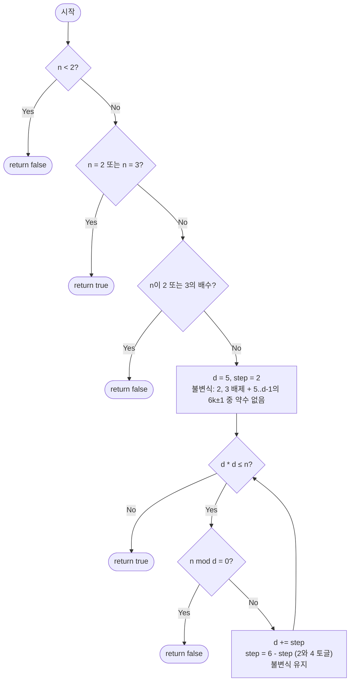

import { AlgorithmSimulation } from "#guide-sim";

# isPrimeTrial — √n까지만 나눠봐도 소수인지 다 알 수 있는 이유

## 한눈에 보는 컨셉

정수 하나가 소수인지 확인하는 가장 정직한 방법은 2부터 n-1까지 전부 나눠보는 거예요. 그런데 "합성수라면 반드시 √n 이하에 약수가 숨어 있다"는 사실 하나만 쓰면, 탐색 범위를 `O(n)`에서 `O(√n)`으로 확 줄일 수 있습니다. 여기에 짝수와 3의 배수를 미리 걸러내는 사전 처리를 더하면, 홀수만 거른 상태 대비 실제로 나눠봐야 하는 후보 수를 다시 3분의 2 수준으로 줄일 수 있어요(전체 정수 기준으로 보면 애초에 1/3 수준입니다).

## 출발점: 가장 순진한 방법부터

문제를 먼저 정확히 잡을게요.

```ts
function isPrimeTrial(n: number): boolean
```

| 파라미터 | 의미 | 제약 |
|----------|------|------|
| `n` | 판별할 정수 | $n \leq 10^{12}$ 범위 권장 |

**반환값**: `n`이 소수이면 `true`, 아니면 `false`입니다.

$n \leq 10^{12}$ 권장은 **시간** 기준이에요 — $\sqrt{n} \approx 10^6$ 수준이라 반복 횟수가 감당할 만합니다. TypeScript/JavaScript의 `number`는 IEEE-754 배정밀도라서 정수를 오차 없이 표현하는 한계가 `Number.MAX_SAFE_INTEGER`($2^{53}-1 \approx 9 \times 10^{15}$)까지인데, 이 가이드의 루프는 $d \leq \sqrt{n} \leq 10^6$만 다루므로 $d \times d \leq n \leq 10^{12}$는 이 한계에 여유 있게 들어갑니다. 다만 $n$이 $2^{53}$ 근처까지 커지면 `number` 자체의 정밀도가 깨져 `d * d`가 부정확해질 수 있어요 — 그 정도 규모라면 `BigInt`를 쓰거나 뒤에서 다룰 밀러-라빈으로 넘어가야 합니다.

소수의 정의를 그대로 코드로 옮기면 됩니다 — "1과 자기 자신 외에 약수가 없다"는 건, 2부터 n-1까지 어떤 수로도 나누어떨어지지 않는다는 뜻이니까요.

```ts
function isPrimeTrialNaive(n: number): boolean {
  if (n < 2) return false;
  for (let d = 2; d < n; d++) {
    if (n % d === 0) return false; // d가 약수를 발견하면 즉시 합성수
  }
  return true;
}
```

작은 수로는 이 방법으로 충분해요. `n = 91`이라면 `d = 2, 3, 4, 5, 6, 7`을 시도하다가 `91 % 7 = 0`에서 여섯 번 만에 멈춥니다(91 = 7 × 13). 그런데 `n`이 소수이거나 큰 소인수를 가진 합성수라면 얘기가 달라져요.

```text
n = 999,999,999,989 (10^12 근방의 소수)이라면?

naive(d = 2..n-1):  최대 10^12 번 나눗셈  ≈ 수백 초        → 시간 초과
```

"꼭 n-1까지 다 확인해야 할까? 절반만 봐도, 아니 훨씬 적게 봐도 안전하지 않을까?" — 이 질문이 다음 절의 출발점입니다.

## 아이디어 자세히 들여다보기

### 합성수는 반드시 √n 이하에 약수를 숨긴다 — 수식과 그림

직관부터 잡고 갈게요. 두 수를 곱해서 $n$을 만든다면, 두 수가 동시에 $\sqrt{n}$보다 클 수도 없고 동시에 $\sqrt{n}$보다 작을 수도 없어요 — 둘 다 크면 곱이 $n$을 넘어버리고, 둘 다 작으면 곱이 $n$에 못 미치니까요. 그러니 작은 쪽 인수는 항상 $\sqrt{n}$ 이하에서 발견될 수밖에 없습니다. 이 직관을 정식으로 써 볼게요.

$n$이 합성수라면 $n = a \times b$ ($a \leq b$, $a, b \geq 2$)로 쪼갤 수 있습니다. 이때 다음이 반드시 성립해요.

$$a \leq \sqrt{n} \leq b$$

**왜 그럴까요?** 만약 $a > \sqrt{n}$이라면 $a \leq b$이므로 $b \geq a > \sqrt{n}$이고, 따라서 $a \times b > \sqrt{n} \times \sqrt{n} = n$이 되어 "$n = a \times b$"라는 전제와 모순됩니다. 그러므로 작은 쪽 인수 $a$는 항상 $\sqrt{n}$ 이하에 있어요.

작은 수로 직접 확인해 봅시다. $n = 91$의 비자명한(둘 다 2 이상인) 인수분해는 $91 = 7 \times 13$뿐입니다.

```text
n = 91 = a × b 로 쪼개는 방법:  a=1,b=91  또는  a=7,b=13

√91 ≈ 9.54

     a=7        √91≈9.54        b=13
      │             │             │
──────┼─────────────┼─────────────┼──────→
      작은 인수는 항상 여기 이하   큰 인수는 항상 여기 이상
```

즉 91이 합성수인지 확인하려면 2부터 90까지 다 볼 필요 없이, 2부터 9(= $\lfloor \sqrt{91} \rfloor$)까지만 보면 충분합니다. 7이 그 범위 안에 있으니까요.

잠깐, 확인 하나만 해 볼까요? $n = 81 = 9 \times 9$처럼 완전제곱수라면 $a$와 $b$가 어떻게 될까요? $a = b = 9 = \sqrt{81}$이 되어 두 인수가 정확히 경계에서 만납니다. 이 경우를 놓치지 않으려면 탐색 조건이 "$d < \sqrt{n}$"이 아니라 "$d \leq \sqrt{n}$"이어야 해요 — 이 등호 하나를 빠뜨리면 뒤에서 볼 함정에 그대로 빠집니다.

### 단서를 설명해 주는 이론 — 바퀴 인수분해(wheel factorization)

$\sqrt{n}$ 경계 하나로도 이미 `O(n)`이 `O(\sqrt{n})`으로 줄었지만, 검사할 후보 수를 한 번 더 줄일 수 있는 일반 이론이 있습니다. 바로 **바퀴 인수분해**예요.

아이디어는 이렇습니다. 어떤 작은 소수들(예: 2, 3)을 미리 걸러내고 나면, 남은 후보는 그 소수들과 서로소인 나머지들만 검사하면 됩니다. $2$와 $3$을 기준으로 하면 나머지를 $6$으로 나눈 값으로 분류할 수 있어요.

```text
정수를 6으로 나눈 나머지로 분류하면

나머지:   0     1     2     3     4     5
         6k   6k+1  6k+2  6k+3  6k+4  6k+5
          │     │     │     │     │     │
        2,3의   ✓   2의   3의   2의    ✓
        배수         배수   배수  배수

2와 3을 이미 걸렀다면, 남는 후보는 나머지 1 또는 5뿐이다
```

즉 $5, 7, 11, 13, 17, 19, 23, 25, \ldots$처럼 "$6k+1$ 또는 $6k-1$" 형태의 수만 검사하면 되고, 이 패턴을 **6k±1 패턴**이라고 부릅니다. 홀수만 걸러내면 후보가 전체의 $1/2$로 줄지만, $2$와 $3$을 함께 걸러내면 후보가 전체의 $1/3$로 줄어요(나머지 1, 5 두 칸이 6칸 중 $2/6 = 1/3$). 이 이론은 뒤의 "단서를 최적화로 연결하기"에서 그대로 다시 쓸 것이니 기억해 두세요.

### 왜 모순 없이 작동하는가

알고리즘이 지키는 불변식은 하나입니다.

> 루프의 매 반복 직전, $2$부터 $d - 1$까지의 어떤 정수도 $n$을 나누지 못했다.

**기저**: 사전 처리를 통과하면(즉 $n \geq 2$, $n \neq 2$, $n$이 홀수) 아직 아무것도 검사하지 않은 상태에서 $d = 3$으로 시작합니다. $2$부터 $2$까지(즉 $2$ 하나)는 이미 사전 처리에서 확인했으므로 불변식이 성립해요.

**귀납 단계**: 불변식이 $d$ 시점에 성립한다고 가정합시다. 이때 경우는 정확히 둘뿐입니다(다른 경우는 없어요 — $n \bmod d$는 $0$이거나 아니거나 둘 중 하나이므로).

- $n \bmod d = 0$이면 $d$가 약수이므로 즉시 `false`를 반환합니다. 이 판정은 정확합니다 — $d$가 실제로 $n$을 나누기 때문이에요.
- $n \bmod d \neq 0$이면 $d$는 약수가 아니므로, $d$를 건너뛰고 다음 홀수($d + 2$)로 넘어가도 안전합니다. 불변식이 "$d+2-1 = d+1$까지 약수 없음"으로 확장되어 유지돼요.

여기서 짝수인 $d+1$은 왜 직접 검사하지 않고도 안전하게 넘어갈 수 있을까요? 사전 처리에서 $n$이 홀수임을 이미 확정했으므로, $n$은 어떤 짝수로도 나누어떨어질 수 없습니다. 그래서 검사를 건너뛴 짝수까지 포함해도 불변식은 "$2$부터 $d+1$까지 약수 없음"으로 정확히 유지되는 거예요 — 홀수 부분은 직접 검사로, 짝수 부분은 사전 처리의 결론으로 각각 보장되는 셈입니다.

루프가 $d^2 > n$에서 멈추면, 그 시점까지 $\sqrt{n}$ 이하의 어떤 정수도 $n$을 나누지 못했다는 뜻입니다. 앞 절의 관찰(합성수라면 반드시 $\sqrt{n}$ 이하에 약수가 있다)에 의해, 약수가 없다는 것은 $n$이 소수라는 뜻이에요.

여기서 **헷갈리기 쉬운 포인트**는 루프 조건을 `d * d < n`(등호 없이)으로 잘못 쓰는 경우입니다. 완전제곱수 경계에서 정확히 하나의 검사를 놓치게 되는데, 실제로 코드를 돌려 보면 이렇게 조용히 틀립니다.

```text
잘못된 조건 d*d < n 으로 실행한 결과 (실측):

n = 9   (= 3×3)  → true   ✗ (실제로는 합성수, 3이 약수)
n = 25  (= 5×5)  → true   ✗ (실제로는 합성수, 5가 약수)
n = 121 (= 11×11) → true  ✗ (실제로는 합성수, 11이 약수)

d*d 가 n과 정확히 같아지는 순간 루프가 먼저 멈춰버려
그 d를 검사하지 못하고 지나친다
```

완전제곱수가 아닌 합성수(예: `n = 91 = 7 × 13`)는 더 작은 인수(`d = 7`)에서 이미 걸리기 때문에 이 버그가 드러나지 않아요 — 그래서 더 위험한 함정입니다.

왜 하필 완전제곱수에서만, 그것도 소수의 제곱에서만 조용히 틀릴까요? 합성수 $n = a \times b$ ($a \leq b$)에서 가장 작은 인수 $a$는 항상 소수입니다 — 만약 $a$가 합성수라면 $a$ 자신의 소인수가 $a$보다 작으면서 동시에 $n$의 약수가 되어, $a$가 가장 작은 인수라는 가정과 모순되니까요. 그리고 이 버그는 정확히 $a = \sqrt{n}$인 경우, 즉 $n = a^2$이고 $a$가 소수인 경우에만 검사 하나($d = a$)를 놓칩니다. $a < \sqrt{n}$이면 이미 $d = a$에서 걸리므로 버그가 드러나지 않고, $a$가 합성수의 최소 인수라는 사실 자체가 $a$를 소수로 만들기 때문에, 결국 "소수의 제곱"만 이 함정에 정확히 걸리는 거예요.

엣지 케이스도 점검해 둡시다.

```text
n = -7  →  n < 2 이므로 false
n = 0   →  n < 2 이므로 false
n = 1   →  n < 2 이므로 false (1은 "1보다 큰 자연수"라는 소수의 정의를 만족하지 않아 제외 — "1 미만"이 아니라 정의 미충족입니다)
n = 2   →  사전 처리에서 true (유일한 짝수 소수)
n = 3   →  n%2≠0, 루프에서 d=3, 3*3=9 > 3 이므로 루프 진입 안 함 → true
n = 4   →  n%2=0 이므로 false
```

## 아이디어를 코드로 옮기기

앞 절의 불변식을 그대로 옮기면 됩니다.

```ts
function isPrimeTrialBase(n: number): boolean {
  if (n < 2) return false;
  if (n === 2) return true;
  if (n % 2 === 0) return false;

  let d = 3;
  while (d * d <= n) {
    if (n % d === 0) return false;
    d += 2; // 홀수만 검사
  }
  return true;
}
```

**가장 실수가 잦은 줄은 `while (d * d <= n)`의 `<=`입니다.** 앞서 본 것처럼 완전제곱수 경계를 포함해야 하기 때문에 등호를 빠뜨리면 조용히 틀려요. 그 외에 결정 지점 두 가지를 짚어 둘게요.

- 초기값 `d = 3`: `2`는 이미 위 세 줄의 사전 처리에서 처리했으므로, 루프는 `3`부터 시작해 홀수만 봅니다.
- `d += 2`: `d`를 하나씩 늘리지 않고 둘씩 늘려 짝수 후보를 아예 만들지 않습니다. `n`이 이미 홀수로 확정된 뒤이므로 짝수 약수를 가질 수 없기 때문이에요.

## 더 빠르게 만들 단서 찾기

방금 만든 구현을 실제로 관찰해 볼게요. `n = 187` ($= 11 \times 17$)로 손 추적을 해 봅시다.

```text
n = 187 (실측 트레이스)

d=3   d*d=9    187 mod 3 = 1   → 약수 아님
d=5   d*d=25   187 mod 5 = 2   → 약수 아님
d=7   d*d=49   187 mod 7 = 5   → 약수 아님
d=9   d*d=81   187 mod 9 = 7   → 약수 아님   ← 이 검사, 꼭 필요했을까?
d=11  d*d=121  187 mod 11 = 0  → 발견! false 반환
```

`d = 9`에서의 검사를 다시 봅시다. `d = 3`에서 이미 `187 mod 3 = 1 ≠ 0`이라는 걸 확인했어요. 그런데 $9 = 3 \times 3$이므로, $9$가 $187$을 나눈다면 $3$도 반드시 $187$을 나눠야 합니다(약수 관계의 전이성 — $3 \mid 9$이고 $9 \mid n$이면 $3 \mid n$). $3$이 나누지 못했다는 걸 이미 아는데, $9$를 다시 검사하는 건 **이미 알고 있는 정보를 한 번 더 묻는 것**이에요.

```text
홀수 후보를 3의 배수 여부로 나눠 보면

3, 5, 7, 9, 11, 13, 15, 17, 19, 21, ...
   │     │  │      │   │      │
  살아남음  살아남음  살아남음   3의 배수(9,15,21,...)는
                              d=3 검사에서 이미 결론 남
```

3의 배수인 홀수(9, 15, 21, ...)는 전체 홀수의 3개 중 1개꼴입니다. `d = 3`에서 이미 `n`이 3의 배수가 아님을 확인했다면, 이후 이 후보들을 걸러낼 근거가 이미 손에 있는 셈이에요. 이것이 바로 앞서 본 바퀴 인수분해 이론이 정확히 해소해 주는 낌새입니다.

## 단서를 최적화로 연결하기

$2$와 $3$을 사전 처리 단계에서 한 번에 걸러내고, 루프에서는 $6$으로 나눈 나머지가 $1$ 또는 $5$인 후보만 시도하도록 바꿔 봅시다.

```text
Before (홀수만 검사):   3, 5, 7, 9, 11, 13, 15, 17, 19, 21, 23, 25, ...
After  (6k±1만 검사):        5, 7,    11, 13,     17, 19,     23, 25, ...
                              ↑ +2  ↑  +4  ↑ +2  ↑  +4  ↑ +2  ↑  +4  ↑
```

간격이 `+2, +4`를 번갈아 가며 반복되는 패턴이에요($5 \to 7$은 $+2$, $7 \to 11$은 $+4$, $11 \to 13$은 $+2$, ...). 불변식은 이렇게 바뀝니다.

> 루프의 매 반복 직전, $2$, $3$, 그리고 $5$부터 $d$ 이전까지 시도한 $6k\pm1$ 형태의 어떤 정수도 $n$을 나누지 못했다.

$2$와 $3$을 사전 처리에서 걸렀으므로 $n$이 이 지점까지 왔다면 $2$와 $3$의 배수가 아니라는 게 이미 보장되고, 루프는 나머지 후보(6k±1)만 훑으면 됩니다.

이 불변식이 왜 "$5$부터 $d$ 이전까지의 $6k\pm1$"만 언급해도 충분할까요? 건너뛴 정수들은 전부 $2$ 또는 $3$의 배수입니다 — 앞서 본 바퀴 인수분해 그림에서 $6$으로 나눈 나머지가 $0, 2, 4$인 자리는 $2$의 배수, 나머지가 $0, 3$인 자리는 $3$의 배수였죠. 사전 처리에서 $n$이 $2$와 $3$의 배수가 아님을 이미 확인했으니, 이 자리에 해당하는 정수들이 $n$의 약수일 수 없다는 것도 함께 확정됩니다. 그래서 직접 검사하지 않고 건너뛰어도 불변식은 "$2$부터 $d-1$까지 약수 없음"이라는 원래 의미를 그대로 유지해요.

## 최적화 코드

바뀌는 곳은 사전 처리 두 줄과 루프의 진행 방식입니다.

```ts
function isPrimeTrialOptimized(n: number): boolean {
  if (n < 2) return false;
  if (n === 2 || n === 3) return true;
  if (n % 2 === 0 || n % 3 === 0) return false;

  let d = 5;
  let step = 2; // 5,7,11,13,17,19,... : +2,+4 교대
  while (d * d <= n) {
    if (n % d === 0) return false;
    d += step;
    step = 6 - step; // 2 <-> 4 토글
  }
  return true;
}
```

**가장 중요한 줄은 `step = 6 - step`입니다.** `step`이 `2`이면 다음은 `6 - 2 = 4`로, `4`이면 다음은 `6 - 4 = 2`로 뒤집혀요 — 이 한 줄이 $+2, +4$ 교대를 만듭니다. 순서를 반대로 짜서 `d += 4`부터 시작하면(즉 `5 → 9`) `9`는 $3$의 배수라서 사전 처리와 어긋나는 후보를 검사하게 되니, 시작 `step`은 반드시 `2`여야 해요.

> 기억법: "5에서 시작해 2, 4를 번갈아 더한다 — 5, 7, (+4)11, 13, (+4)17, 19, ..."

**실제로 얼마나 줄었는지 재 봅시다.** $n = 999{,}999{,}999{,}989$ ($10^{12}$ 근방의 소수)에 두 구현을 실제로 실행해 나눗셈 횟수를 세면 다음과 같습니다.

```text
n ≈ 10^12 근방의 소수, 실측 나눗셈 횟수

홀수만 검사(이전 절 base):     499,999 번
6k±1만 검사(이번 절 optimized):  333,332 번

333,332 / 499,999 ≈ 2/3   → 홀수-only 대비 약 33% 감소 (3의 배수 후보가 통째로 빠졌다)
```

세 구현(naive, base, optimized) 모두 $0$부터 $2{,}000$까지 전수 비교로 결과가 일치함을 확인했습니다. 그 위로는 naive가 너무 느려 직접 대조할 수 없으므로, `base`와 `optimized` 두 구현만 $10^9$ 미만 범위에서 무작위 표본 5,000개로 교차 검증해 전부 일치함을 실행으로 확인했습니다.

**더 최적화할 여지가 있을까요?** 바퀴를 $2 \times 3 = 6$에서 $2 \times 3 \times 5 = 30$으로 키우면(나머지 8칸만 검사) 후보를 조금 더 줄일 수 있지만, 사전 처리 분기와 스텝 패턴이 복잡해지는 데 비해 점근 복잡도는 여전히 $O(\sqrt{n})$ 그대로예요 — 상수항만 계속 깎일 뿐, 더 나은 시간 복잡도로 넘어가지는 못합니다. 여기서 시행 나눗셈 계열의 최적화는 사실상 끝이라고 봅니다.

$n$이 $10^{12}$를 크게 넘어서면(예: $n < 2^{64}$) $\sqrt{n}$ 자체가 너무 커져 시행 나눗셈으로는 시간 안에 끝나지 않습니다(게다가 이 시점이면 `number`의 안전 정수 범위도 이미 넘어선 뒤라, `BigInt` 없이는 `d * d` 계산 자체도 신뢰할 수 없습니다). 이때는 밀러-라빈(Miller-Rabin) 소수 판정법이 $O(k \log^2 n)$으로 대응합니다. 반대로 범위 안의 소수를 **전부** 나열해야 한다면 에라토스테네스의 체가 $O(n \log \log n)$으로 더 적합해요. 그럼에도 시행 나눗셈을 배우는 이유는 **코드 한 페이지로 끝나는 단순함과 전처리 없이 즉시 판정 가능하다는 실용성** 때문입니다 — 단발성 판정에는 이 이상의 장비가 오히려 과합니다.

## 실행 시각화

고정 입력 `n = 97`에 대해 최종 구현 `isPrimeTrialOptimized`(6k±1 패턴)를 실행하는 과정입니다. `keyValue` 패널은 매 단계의 핵심 변수(`d`, `step`, `d*d`, `n mod d`)와 판정 진행 상황을 보여줘요. 사전 처리(`n<2`, `n=2 또는 3`, `2 또는 3의 배수` 검사)를 통과한 뒤 `d = 5, 7`만 시도하고, `d = 11`에서 `d*d = 121 > 97`이 되어 루프가 종료됩니다. 기본 구현으로 같은 `n = 97`을 돌리면 `d = 3, 5, 7, 9` 네 번을 시도하는데(직접 손으로 따라가 확인해 보세요), 이 최적화 버전은 `d = 3`과 `d = 9`(3의 배수)가 통째로 빠져 두 번만에 같은 결론에 도달합니다.

실제 반환값은 `true`이며, 시뮬레이션 마지막 프레임의 결론과 일치합니다.

> 대화형 시뮬레이션은 MDX 런타임에서 표시됩니다.

export const steps = [
  {
    title: "사전 처리",
    detail: "n=97 은 2 이상, 2도 3도 아니며, 2의 배수도 3의 배수도 아니다. 사전 처리 통과 → 본 루프 진입.",
    entries: [
      { label: "n", value: 97 },
      { label: "n < 2", value: "false" },
      { label: "n = 2 또는 3", value: "false" },
      { label: "n mod 2 = 0 또는 n mod 3 = 0", value: "false" },
    ],
  },
  {
    title: "d = 5, step = 2",
    detail: "d*d = 25 <= 97 이므로 검사. 97 mod 5 = 2 != 0 → 약수 아님. d += step(2) → 7, step = 6-2 = 4.",
    entries: [
      { label: "d", value: 5 },
      { label: "step", value: 2 },
      { label: "d*d", value: 25 },
      { label: "d*d <= n", value: "true" },
      { label: "n mod d", value: 2 },
    ],
  },
  {
    title: "d = 7, step = 4",
    detail: "d*d = 49 <= 97 이므로 검사. 97 mod 7 = 6 != 0 → 약수 아님. d += step(4) → 11, step = 6-4 = 2.",
    entries: [
      { label: "d", value: 7 },
      { label: "step", value: 4 },
      { label: "d*d", value: 49 },
      { label: "d*d <= n", value: "true" },
      { label: "n mod d", value: 6 },
    ],
  },
  {
    title: "d = 11 → 루프 종료",
    detail: "d*d = 121 > 97 이므로 루프 조건 거짓. √n 이하에 (2, 3의 배수를 포함해도) 약수가 없다.",
    entries: [
      { label: "d", value: 11 },
      { label: "d*d", value: 121 },
      { label: "d*d <= n", value: "false" },
    ],
  },
  {
    title: "완료: return true",
    detail: "어떤 d 도 97을 나누지 못했다 → 97은 소수. true 반환. (기본 구현이라면 d=3,5,7,9 네 번을 시도했을 자리를 이 최적화 버전은 두 번만에 끝냅니다.)",
    entries: [
      { label: "결과", value: "true (소수)" },
    ],
  },
];

<AlgorithmSimulation view="keyValue" steps={steps} title="isPrimeTrialOptimized: n=97" />

## 흐름 한눈에 보기



**핵심 불변식**: 루프 매 반복 직전, $2$, $3$, 그리고 $5$부터 $d$ 이전까지 시도한 $6k\pm1$ 형태의 어떤 정수도 $n$을 나누지 못했습니다.

## 스스로 점검하기

1. $n = 221$ ($= 13 \times 17$)에 대해 기본 구현(`isPrimeTrialBase`)이 시도하는 `d` 값을 순서대로 적어 보고, 어디서 멈추는지 확인해 보세요. 그다음 6k±1 최적화 구현이 몇 번 만에 같은 결론에 도달하는지도 세어 보세요. (기본: `d = 3, 5, 7, 9, 11, 13`에서 `221 mod 13 = 0`으로 6번째에 멈춥니다. 최적화: `d = 5, 7, 11, 13`으로 4번째에 같은 곳에서 멈춰요.)
2. 루프 조건을 `d * d <= n` 대신 `d * d < n`으로 바꾸면 `n = 25`에서 무슨 일이 벌어질까요? 실제로 손으로 따라가 보고, 왜 `false`가 아니라 `true`가 나오는지 짚어 보세요.
3. 만약 같은 배열 안의 원소 하나하나를 반복해서 소수인지 여러 번 물어야 하는 상황이라면(예: 1부터 $10^6$까지 중 소수를 모두 찾기), 매번 `isPrimeTrial`을 새로 호출하는 것과 에라토스테네스의 체로 한 번에 전처리하는 것 중 어느 쪽이 유리할지, 그리고 그 기준이 무엇인지 생각해 보세요.
