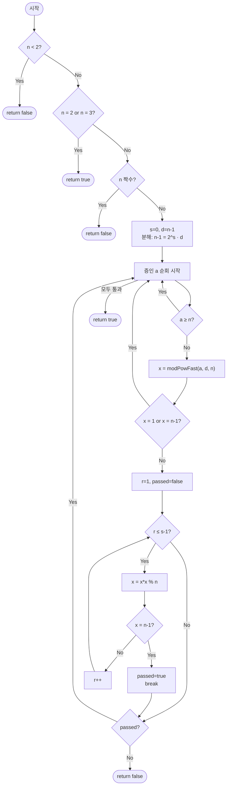

import { AlgorithmSimulation } from "#guide-sim";

# millerRabin — 제곱해서 1이 되기 직전, 소수라면 반드시 -1을 거친다는 관찰

## 한눈에 보는 컨셉

소수인지 판정해야 하는데, 페르마의 소정리를 곧이곧대로 쓰면 카마이클 수라는 교묘한 합성수에게 속아 넘어가요. 밀러-라빈 소수 판정법은 "소수라면 반복 제곱 수열이 1에 도달하기 직전 값은 반드시 -1이어야 한다"는 조건을 추가로 검사해 이 사기꾼을 잡아냅니다. 정해진 12개의 증인만 검사하면 `O(k log^2 n)`(`k=12`)만에 64비트 범위 전체에서 결정적으로 정확한 판정이 끝나요.

## 출발점: 가장 순진한 방법부터

문제를 먼저 정확히 잡을게요.

```ts
function millerRabin(n: bigint): boolean
```

| 파라미터 | 의미 | 제약 |
|----------|------|------|
| `n` | 소수인지 판별할 정수 | bigint, $0 \leq n < 2^{64}$ |

**반환값**: `n`이 소수이면 `true`, 합성수(또는 0, 1)이면 `false`. 64비트 범위 전체에서 **결정적으로** 정확해야 합니다 — 확률적으로 "아마 소수일 거예요" 수준은 허용되지 않아요.

가장 정직한 방법은 "소수"의 정의를 그대로 코드로 옮기는 겁니다. 2부터 하나씩 나눠보면서 나누어떨어지는 수가 있는지 찾아보는 거예요.

```ts
function isPrimeNaive(n: bigint): boolean {
  if (n < 2n) return false;
  for (let i = 2n; i * i <= n; i++) {
    if (n % i === 0n) return false;
  }
  return true;
}
```

이 방법의 비용을 실제 규모로 체감해 봅시다.

```text
n ≈ 2^64                          시행 나눗셈 범위: i = 2 .. √n
√(2^64) = 2^32 = 4,294,967,296    (약 43억 번의 나눗셈)
시간 제한 1초                     → 43억 번의 나눗셈은 어림도 없다
```

나눗셈 횟수를 줄이는 방향으로는 답이 없어 보입니다. 그렇다면 아예 시행 나눗셈(trial division) 없이, 거듭제곱만으로 소수 여부를 알아낼 수는 없을까요 — 이게 다음 절의 출발 단서입니다.

## 아이디어 자세히 들여다보기

### 제곱해서 1이 되는 순간을 거슬러 올라가기 — 수식과 그림

시행 나눗셈 없이 판별하는 첫 번째 후보는 페르마의 소정리입니다. $p$가 소수이고 $\gcd(a, p) = 1$이면

$$a^{p-1} \equiv 1 \pmod{p}$$

가 성립해요. 이걸 뒤집으면, $a^{n-1} \not\equiv 1 \pmod{n}$인 $a$를 하나라도 찾으면 $n$은 합성수라고 결론지을 수 있습니다. 나눗셈 대신 거듭제곱 하나만 계산하면 되니 훨씬 빠르죠.

그런데 이 테스트에는 구멍이 있습니다. $n = 561 = 3 \times 11 \times 17$은 명백한 합성수인데, $a = 2$를 넣어 실제로 계산해 보면 $2^{560} \bmod 561 = 1$이 나와요(직접 계산해도 확인됩니다). $\gcd(a, 561) = 1$인 어떤 $a$를 넣어도 마찬가지로 테스트를 통과합니다. 이런 합성수를 **카마이클 수(Carmichael number)**라고 불러요.

> 확인 질문 하나 — 페르마 테스트를 통과했다고 해서 반드시 소수일까요? 561의 사례가 보여주듯 답은 "아니오"입니다. 통과는 "소수일 가능성이 있다"는 힌트일 뿐, 증명이 아니에요.

페르마 테스트가 보는 것은 딱 하나, "$a^{n-1}$이 1인가"뿐입니다. 그런데 $n - 1$이 짝수라면 $a^{n-1}$은 어떤 값을 제곱한 결과예요. 제곱하기 **직전** 값에도 정보가 숨어 있습니다.

**핵심 관찰**: 소수 $p$ 위에서 $x^2 \equiv 1 \pmod{p}$의 해는 $x \equiv \pm 1 \pmod{p}$뿐입니다.

```text
p = 13 (소수)일 때 x^2 ≡ 1 (mod 13)의 해를 0..12 전부 검사하면
x = 1  → 1^2   =   1 ≡ 1   ✓
x = 12 → 12^2  = 144 ≡ 1   ✓  (144 = 11·13 + 1)
그 외 x = 2..11 → 모두 1이 아님
                 → 해는 정확히 {1, 12} = {1, -1} 뿐
```

즉 소수라면, 반복 제곱 과정에서 1에 **처음 도달하기 직전** 값은 반드시 $-1$이어야 해요. 페르마 테스트는 이 "직전 값"이라는 정보를 그냥 버렸던 거고, 밀러-라빈은 바로 이 버려진 정보를 추적해서 카마이클 수 같은 사기꾼을 잡아냅니다 — 이게 페르마 테스트만으로는 부족하고 굳이 이 형태(중간값 추적)여야 하는 이유예요.

이제 이 관찰을 정식으로 씁니다. $n - 1$을 짝수 부분과 홀수 부분으로 분해합니다.

$$n - 1 = 2^s \cdot d, \qquad d \text{는 홀수}$$

증인 $a$에 대해 반복 제곱 수열을 정의해요.

$$x_0 = a^d \bmod n, \qquad x_{r+1} = x_r^2 \bmod n \quad (r = 0, 1, \ldots, s-1)$$

지수 법칙을 그대로 따라가면 $x_s = a^{d \cdot 2^s} \bmod n$인데, $d \cdot 2^s = n - 1$이니 $x_s = a^{n-1} \bmod n$이에요. $n$이 소수이고 $\gcd(a, n) = 1$이면 페르마 소정리에 의해 이 값은 항상 $1$이어야 합니다 — 즉 수열은 반드시 마지막 항 $x_s$에서 $1$에 도달해요. 문제는 "어떻게" 도달하느냐입니다. $n$이 소수라면 이 수열은 다음 중 하나를 반드시 만족합니다.

1. $x_0 \equiv 1 \pmod{n}$ (처음부터 이미 1)
2. 어떤 $r \in \{0, \ldots, s-1\}$에서 $x_r \equiv -1 \pmod{n}$ (1이 되기 전에 -1을 거침)

작은 소수로 직접 채워 봅시다. $n = 13$, 증인 $a = 2$:

```text
n=13, a=2:  n-1 = 12 = 2^2 · 3   (s=2, d=3)

r=0: x0 = 2^3 mod 13 = 8         (1도 아니고 -1(=12)도 아님 → 계속)
r=1: x1 = 8^2 mod 13 = 64 mod 13 = 12 = -1   ← 여기서 -1 발견! 조건 2 충족, 통과
```

> 확인 질문 — 만약 $r=1$에서도 $-1$이 아닌 값이 나왔다면 어떻게 될까요? $s=2$이므로 $r$은 $0, 1$만 있고, 그다음은 곧 최종값 $x_2 = a^{n-1} \bmod n$인데 $n$이 소수라면 이 값은 페르마 정리에 의해 항상 $1$이어야 합니다. 그러니 $r=0,1$ 어디에서도 $-1$을 못 만난다는 건 "1이 되기 직전이 $-1$이 아니었다"는 뜻이고, 핵심 관찰에 따르면 이는 소수에서는 있을 수 없는 일 — 합성수라는 강한 신호가 됩니다.

### 단서를 설명해 주는 이론 — 체(Field)와 다항식의 근

"소수에서는 $x^2 \equiv 1$의 해가 $\pm 1$뿐"이라는 성질은 우연이 아니라, 대수학의 일반 정리 하나가 그대로 적용된 결과입니다.

**체(Field) 위에서 다항식의 근의 개수**: 체 위에서 0이 아닌 차수 $d$ 다항식은 근을 최대 $d$개까지만 가질 수 있습니다. 정수·유리수·실수·복소수뿐 아니라 $\mathbb{Z}/p\mathbb{Z}$($p$가 소수일 때)도 체예요. $\mathbb{Z}/n\mathbb{Z}$가 체가 되는 것은 정확히 $n$이 소수일 때뿐입니다 — $n$이 소수면 0이 아닌 모든 원소가 곱셈 역원을 갖지만(확장 유클리드 알고리즘으로 항상 구해집니다), $n$이 합성수면 그 소인수들끼리는 역원이 없거든요. 예를 들어 $\bmod\ 6$에서 $2$는 역원이 없습니다 — $2x \equiv 1 \pmod 6$을 만족하는 $x$가 존재하지 않아요.

이 정리를 다항식 $x^2 - 1$(차수 2)에 적용하면: $n = p$가 소수일 때는 체 위의 다항식이므로 근이 최대 2개, 그런데 $1$과 $-1$이 이미 근이니(홀수 소수라면 $1 \ne -1$) 근은 정확히 $\{1, -1\}$뿐입니다. 이게 앞 절 "핵심 관찰"의 정체예요.

$n$이 합성수면 이 정리가 아예 적용되지 않습니다 — $\mathbb{Z}/n\mathbb{Z}$가 체가 아니니까요. 실제로 근이 늘어나는 사례를 봅시다.

```text
n = 8 (합성수)일 때 x^2 ≡ 1 (mod 8)의 해를 전부 찾으면
x=1: 1^2  =  1 ≡ 1   ✓
x=3: 3^2  =  9 ≡ 1   ✓   (9  = 1·8+1)
x=5: 5^2  = 25 ≡ 1   ✓   (25 = 3·8+1)
x=7: 7^2  = 49 ≡ 1   ✓   (49 = 6·8+1)
                     →  근이 {1,3,5,7} 네 개!  ±1(={1,7}) 말고도 3, 5라는 "가짜 제곱근"이 있다
```

이 "가짜 제곱근"(자명하지 않은 1의 제곱근)의 존재가 합성수를 잡아내는 통로입니다. 밀러-라빈의 강한 의사소수 조건은, 반복 제곱 수열에서 1에 도달하기 직전 값이 $\pm 1$이 아닌 가짜 제곱근으로 나타나는 순간을 감시하는 거예요. 이 이론은 뒤 "왜 모순 없이 작동하는가"에서 다시 소환할 테니 기억해 두세요.

### 왜 모순 없이 작동하는가

이 알고리즘이 지키는 약속은 하나입니다.

> $n$이 소수라면, 어떤 증인 $a$($1 \leq a < n$)를 넣어도 강한 의사소수 조건 — $a^d \equiv 1$ 또는 어떤 $r \in [0, s)$에서 $a^{d \cdot 2^r} \equiv -1$ — 을 반드시 만족한다.

**기저**: $n = 2, 3$은 특수 처리로 즉시 `true`를 반환하므로 증인 루프 자체가 실행되지 않습니다. 가장 작은 소수 두 개를 예외로 떼어 둔 것뿐, 별도 증명이 필요한 대상이 아니에요.

**일반 단계 (직접 증명 — 소수 $n = p$인 경우)**: 페르마 소정리에 의해 $a^{p-1} \equiv 1 \pmod p$이고(증인 $a$가 범위 $1 \leq a < p$ 안에 있으므로 $\gcd(a, p) = 1$), $p - 1 = 2^s d$이니 $a^{p-1} = (a^d)^{2^s}$입니다. 수열 $x_0 = a^d,\ x_{r+1} = x_r^2 \pmod p$를 두면 $x_s = a^{p-1} \equiv 1$이에요.

- **경우 1**: $x_0 \equiv 1$이면 조건의 첫 갈래가 바로 충족됩니다.
- **경우 2**: $x_0 \not\equiv 1$이면, $x_0, x_1, \ldots, x_s$는 유한수열이고 $x_s \equiv 1$이므로 처음으로 1이 되는 인덱스 $r^\ast \in [1, s]$가 반드시 존재합니다 — 수열이 유한하고 끝이 1이라는 사실만으로 존재가 보장되니, 이 둘 말고 제3의 경우는 없습니다(경우의 완전성). 그 직전 값 $x_{r^\ast - 1}$을 $x$라 하면 $x^2 = x_{r^\ast} \equiv 1$이고, $r^\ast$가 "최초로 1이 되는 지점"이라는 정의상 $x \not\equiv 1$입니다. 앞 절의 이론 — 소수 위에서 $x^2 \equiv 1$의 해는 $\{1, -1\}$뿐 — 을 적용하면 $x \equiv -1$일 수밖에 없어요. 즉 $r = r^\ast - 1 \in [0, s)$에서 $-1$이 등장해 조건의 둘째 갈래가 충족됩니다.

두 경우 말고 다른 가능성이 없으므로, 소수라면 모든 증인이 강한 의사소수 조건을 통과합니다. 대우를 취하면, 조건을 위반하는 증인이 하나라도 발견되면 $n$은 확실히 합성수예요 — 이게 알고리즘이 `false`를 반환해도 되는 근거입니다.

그런데 반대 방향 — "증인 12개를 다 통과했다고 정말 소수인가?" — 은 순수 증명만으로 나오지 않습니다. 이론적으로는 통과하는 합성수(강한 의사소수)가 존재할 수 있어요. 다만 $\{2,3,5,7,11,13,17,19,23,29,31,37\}$이라는 이 조합을 최초로 속이는 합성수는 전수 계산으로 확인된 바 $3.317 \times 10^{24}$ 근처에서야 등장합니다 — $2^{64} \approx 1.8 \times 10^{19}$보다 압도적으로 큰 범위예요. 그래서 이 문제의 제약 $n < 2^{64}$ 안에서는 12개 증인만으로 결정적으로 정확하다고 확신할 수 있습니다. 덧붙이면 이 알고리즘의 오차는 항상 한쪽 방향입니다 — 실제 합성수를 소수로 오판(위양성)할 가능성만 이론적으로 남아 있고, 실제 소수를 합성수로 오판(위음성)하는 경우는 알고리즘 자체에는 존재하지 않아요(뒤에서 볼 $a \geq n$ 증인 처리를 빠뜨리는 구현 실수는 예외입니다).

여기서 **헷갈리기 쉬운 포인트**가 둘 있습니다.

- **"페르마 테스트를 통과했으니 소수겠지"라는 착각.** $n = 561$로 직접 확인해 봅시다. $561 - 1 = 560 = 2^4 \cdot 35$ (s=4, d=35). 증인 $a=2$로 강한 의사소수 조건을 검사하면:

```text
n=561, a=2:  n-1 = 560 = 2^4 · 35   (s=4, d=35)

r=0: x0 = 2^35 mod 561 = 263        (1도 아니고 -1(=560)도 아님)
r=1: x1 = 263^2 mod 561 = 166       (560 아님)
r=2: x2 = 166^2 mod 561 = 67        (560 아님)
r=3: x3 = 67^2 mod 561 = 1          (560을 거치지 않고 바로 1에 도착!)

→ r=0..3(=s-1) 어디에서도 -1(=560)을 못 만났다 → 강한 합성수 증인 발견 → false
```

  같은 $a=2$가 페르마 테스트($2^{560} \bmod 561 = 1$)는 통과시키지만, 강한 의사소수 조건은 통과시키지 않습니다. "1이 되기 직전 값(67)이 $-1$이 아니었다"는 것이 정확히 앞서 "단서를 설명해 주는 이론" 절에서 다룬 "가짜 제곱근"의 등장이에요 — $67^2 \equiv 1 \pmod{561}$인데 $67 \not\equiv \pm 1$이니까요.

- **"증인 $a$가 $n$보다 크거나 같아도 그냥 계산하면 되지 않을까".** $a > n$ 자체는 사실 문제가 아니에요 — 밀러-라빈은 본질적으로 $a \bmod n$이라는 잉여류를 검사하는 거라, 예를 들어 $a = n + 1$처럼 $a \bmod n = 1$인 값은 오히려 무해합니다. 진짜 문제는 $a \equiv 0 \pmod n$인 경우예요. 고정 증인 목록에는 $37$까지 들어 있으니, $n$이 그보다 작은 소수면 목록 안의 어떤 $a$가 $n$과 정확히 같아져 이 경우가 생깁니다. $n = 5$에서 만약 $a \geq n$ 스킵을 빼먹고 $a = 5$를 그대로 쓰면:

```text
n=5 (실제로는 소수), 버그: a>=n 스킵 없이 a=5 사용
n-1 = 4 = 2^2 · 1   (s=2, d=1)

x0 = 5^1 mod 5 = 0        ← a mod n = 0 이라 아예 0으로 붕괴
0은 1도 아니고 -1(=4)도 아님 → 내부 루프 진입
r=1: x = 0^2 mod 5 = 0    ← 0은 제곱해도 영원히 0, 4(-1)에 절대 도달 못함
→ 강한 합성수 증인(?) 발견 → false 오반환 (실제로는 소수인데!)
```

  $a \equiv 0 \pmod n$이면 $x_0 = a^d \bmod n = 0$으로 붕괴하고, $0$은 제곱해도 영원히 $0$이라 $1$에도 $-1$(=n-1)에도 도달할 수 없어요. 그러면 실제로는 소수인 $n$을 합성수로 오판(위음성)하게 됩니다. 이 실패를 확실히 피하려고, 이 구현은 (더 정교하게 $a \bmod n = 0$만 걸러도 되지만) 간단히 $a \geq n$인 증인을 통째로 건너뜁니다.

엣지 케이스도 확인해 둡시다.

```text
n = 0, 1        → false (소수의 정의를 만족하지 못함)
n = 2           → true  (가장 작은 소수, 특수 처리)
n = 4           → false (짝수 필터에서 즉시 걸러짐)
n = 561         → false (카마이클 수, 강한 의사소수 조건으로 잡아냄)
n = 2^64 - 1    → false (합성수, 3·5·17·257·641·65537·6700417의 곱)
2^64 미만 최대 소수 (2^64 - 59) → true
```

## 아이디어를 코드로 옮기기

아이디어를 그대로 옮긴 기본 구현입니다. $a^d \bmod n$을 정의 그대로, 곱셈을 $d$번 반복해서 계산합니다.

```ts
const WITNESSES = [2n, 3n, 5n, 7n, 11n, 13n, 17n, 19n, 23n, 29n, 31n, 37n];

function modPowLinear(a: bigint, e: bigint, n: bigint): bigint {
  let result = 1n % n;
  let base = a % n;
  for (let i = 0n; i < e; i++) {
    result = (result * base) % n;
  }
  return result;
}

function millerRabinBasic(n: bigint): boolean {
  if (n < 2n) return false;
  if (n === 2n || n === 3n) return true;
  if (n % 2n === 0n) return false;

  let d = n - 1n;
  let s = 0;
  while (d % 2n === 0n) {          // 불변식: n - 1 = 2^s · d
    d /= 2n;
    s++;
  }

  for (const a of WITNESSES) {
    if (a >= n) continue;          // 유효하지 않은 증인은 건너뛴다

    let x = modPowLinear(a, d, n); // x = a^d mod n
    if (x === 1n || x === n - 1n) continue; // 이 증인 통과

    let passed = false;
    for (let r = 1; r < s; r++) {
      x = (x * x) % n;              // 불변식: 이 줄 실행 직후 x = a^(d·2^r) mod n
      if (x === n - 1n) {
        passed = true;
        break;
      }
    }
    if (!passed) return false;     // 강한 합성수 증인 발견
  }

  return true;
}
```

결정 지점만 짚어 볼게요.

- **사전 필터의 순서**: `n < 2n` → `n === 2n || n === 3n` → `n % 2n === 0n` 순서로 걸러야, 짝수 필터에 들어가기 전에 $2$가 먼저 `true`로 빠집니다. 순서를 바꿔 짝수 필터를 먼저 두면 $n=2$가 "짝수"로 걸려 `false`를 반환하는 사고가 납니다.
- **분해 루프의 불변식**: `while (d % 2n === 0n)`은 매 반복 `n - 1 = 2^s · d`를 유지하면서 `d`에서 2의 배수를 다 뽑아냅니다. 짝수 사전 필터를 통과한 뒤라 `n - 1`은 항상 짝수이므로 이 루프는 최소 1번은 돕니다(`s ≥ 1` 보장).
- **증인 범위 체크는 `modPowLinear` 호출 전에** — 고정 증인 목록(최대 37까지)에는 $n$과 값이 같아지는 소수가 섞여 있을 수 있고, 그 경우 `a % n === 0`이 되어 `x0`이 영원히 `0`에 머무릅니다(앞 절 "헷갈리기 쉬운 포인트" 참고). `a >= n`을 통째로 건너뛰면 이 실패를 간단히 피할 수 있어요.
- **내부 루프 경계는 `r = 1`부터 `s - 1`까지**입니다. `r = 0`(즉 `x0`)은 이미 루프 밖에서 확인했으니, 안쪽 루프는 나머지 `s - 1`번의 제곱만 담당해요.

**가장 실수가 잦은 줄은 `if (x === 1n || x === n - 1n) continue;`입니다.** 이 줄을 빠뜨리면 소수인데도 항상 안쪽 루프로 들어가 버려서, `s = 1`인 경우(내부 루프가 아예 안 도는 경우) 정상 소수도 대부분 `false`로 오판됩니다.

## 더 빠르게 만들 단서 찾기

`modPowLinear`를 실측해 봅시다. $n = 561$, $d = 35$일 때 곱셈 횟수를 세면 정확히 $35$번입니다(스크래치 실행으로 확인: `linear 곱셈 수 (d=35): 35`). 작은 예에서는 티가 안 나지만, 문제의 실제 규모로 확장해 보면 얘기가 달라집니다.

```text
n ≈ 2^64 근방의 큰 소수 후보라면  d ~ n/2 ~ 2^63 ≈ 9.2 × 10^18
modPowLinear 한 번 호출 = 곱셈 약 9.2 × 10^18 번
증인 12개를 다 돌리면       ≈ 1.1 × 10^20 번의 곱셈

→ 성능 목표로 잡았던 O(k log^2 n) (수만 번 수준)과는 완전히 딴판 — 나눗셈만 없앴을 뿐, 진짜 병목은 그대로 남아 있다
```

`modPowLinear`가 곱셈 한 번에 지수를 딱 $1$씩만 소모한다는 게 문제입니다. 지수를 훨씬 빨리 줄이는 방법이 있어야, 이번 절 처음에 세운 목표 복잡도가 실제로 달성됩니다.

## 단서를 최적화로 연결하기

곱셈을 한 번 할 때 지수를 $2$배씩 줄일 수 있다면 어떨까요? $a^d$를 구할 때, $d$를 이진수로 보고 자리마다 "제곱"과 "곱하기"를 조합하는 방법 — **이진 거듭제곱(binary exponentiation, square-and-multiply)**입니다.

$d = 35$는 이진수로 `100011`이에요. 최하위 비트부터 훑으면서, base를 계속 제곱해 나가고(자리가 올라갈 때마다 $a^{2^i}$가 됨), 비트가 $1$인 자리에서만 그 값을 결과에 곱합니다.

```text
Before (선형):  a^1 → a^2 → a^3 → ... → a^35   (곱셈 35번, 한 걸음에 지수 +1)

After (이진):   base: a → a^2 → a^4 → a^8 → a^16 → a^32   (제곱만 반복, 지수 매번 ×2)
                비트가 1인 자리(35=100011, 즉 2^0, 2^1, 2^5)에서만 result에 곱함
                result = a^1 · a^2 · a^32 = a^35            (곱셈 총 9번, 스크래치 실측)
```

불변식은 이래요 — 매 반복이 끝날 때 `base`는 항상 $a^{2^i}$($i$는 지금까지 처리한 자리 수), `result`는 지금까지 본 비트들만으로 만든 $a^{(\text{지금까지 처리한 하위 비트})}$입니다. 비트 수는 $\log_2 d$개뿐이니, 곱셈 총 횟수도 $O(\log d)$로 줄어듭니다.

## 최적화 코드

바뀌는 곳은 **`modPowLinear`를 대체하는 `modPowFast` 하나**뿐입니다. 나머지 `millerRabin` 로직은 그대로예요.

```ts
function modPowFast(a: bigint, e: bigint, n: bigint): bigint {
  let result = 1n % n;
  let base = a % n;
  while (e > 0n) {
    if ((e & 1n) === 1n) result = (result * base) % n; // 현재 최하위 비트가 1이면 결과에 반영
    base = (base * base) % n;                 // base를 다음 자리(제곱)로 전진
    e >>= 1n;                                  // 처리한 비트를 버림
  }
  return result;
}

function millerRabin(n: bigint): boolean {
  if (n < 2n) return false;
  if (n === 2n || n === 3n) return true;
  if (n % 2n === 0n) return false;

  let d = n - 1n;
  let s = 0;
  while (d % 2n === 0n) {
    d /= 2n;
    s++;
  }

  for (const a of WITNESSES) {
    if (a >= n) continue;

    let x = modPowFast(a, d, n);
    if (x === 1n || x === n - 1n) continue;

    let passed = false;
    for (let r = 1; r < s; r++) {
      x = (x * x) % n;
      if (x === n - 1n) {
        passed = true;
        break;
      }
    }
    if (!passed) return false;
  }

  return true;
}
```

**가장 중요한 줄은 `base = (base * base) % n;`이 `e >>= 1n;`보다 먼저, 그리고 `if ((e & 1n) === 1n) ...`보다 나중에 오는 순서입니다.** 이 셋의 순서를 바꾸면 조용히 틀립니다 — 예를 들어 `result` 갱신 전에 먼저 `base`를 제곱해 버리면, 그 반복에서 반영해야 할 비트에 이미 다음 자리 값이 들어가 답이 어긋나요. 반대로 `e >>= 1n`을 깜빡 빼먹으면 `e`가 절대 0이 되지 않아 무한 루프에 빠집니다.

> 기억법: "먼저 곱하고(현재 자리), 그다음 키우고(다음 자리 준비), 마지막에 버린다(처리 끝난 자리)."

이제 처음 곱셈 횟수 비교로 돌아가 볼까요. $d=35$ 기준 선형 방식은 $35$번, 이진 거듭제곱은 $9$번의 곱셈으로 같은 값을 만듭니다(스크래치 실측: `fast 곱셈 수 (d=35): 9`). $d \sim 2^{63}$ 규모에서는 선형 방식이 감당 못 할 $9.2 \times 10^{18}$번인 반면, 이진 거듭제곱은 매 비트마다 제곱 1번(총 $\lceil \log_2 d \rceil$번)에 비트가 $1$인 자리마다 곱셈 1번(총 popcount(d)번)이 더해져 대략 $2\log_2 d$번 안쪽입니다 — 실측으로도 $d \approx 2^{63}$급 값에서 $122$번, 비트가 모두 $1$인 최악 케이스($d = 2^{64}-1$)에서도 $128$번이면 충분해요(스크래치 실행 확인). 증인 12개를 다 돌려도 최악 $12 \times 128 = 1536$번, 즉 여전히 수백~수천 번 수준입니다.

이 결과를 이번 가이드 맨 앞에서 세운 목표 $O(k \log^2 n)$과 연결해 볼게요. 증인 한 번의 modular exponentiation에 필요한 곱셈 "횟수"만 세면 $O(\log n)$번이라 총 연산 횟수는 $O(k \log n)$입니다. 그런데 $n$이 $b = O(\log n)$비트짜리 큰 수라, 곱셈 한 번 자체도 공짜가 아니에요 — 학교식(schoolbook) 곱셈은 $b$비트 수 두 개를 곱하는 데 $O(b^2)$가 아니라(이 값은 곱셈 자체의 비용이고, $b=O(\log n)$이므로) $O(\log^2 n)$ 비트 연산이 듭니다. 그래서 "곱셈 횟수 × 곱셈 1회 비용" $= O(\log n) \times O(\log n) = O(\log^2 n)$이 증인 하나당 비트 복잡도이고, 증인 $k$개를 다 돌리면 $O(k \log^2 n)$이 됩니다(더 빠른 곱셈 알고리즘을 쓰면 지수는 낮아지지만, 이 가이드는 `bigint` 기본 곱셈을 기준으로 잡았어요). 시행 나눗셈 없이 거듭제곱만으로 판정한다는 애초의 방향과도 일치해요.

더 최적화할 여지가 있을까요? 이 접근으로는 사실상 여기가 끝입니다. 각 증인은 최소 $O(\log n)$번의 곱셈 없이는 $a^d \bmod n$ 자체를 계산할 수 없고(지수를 표현하는 데 필요한 비트 수가 그만큼이니까요), 증인 수 $k=12$도 $n < 2^{64}$ 범위에서 결정적 정확성이 전수 검증으로 확인된 **충분한** 조합입니다 — 다만 "최소" 조합은 아니에요. 실제로 이보다 훨씬 적은, $n < 2^{64}$ 전용으로 알려진 7개짜리 비소수 증인 조합(예: $\{2, 325, 9375, 28178, 450775, 9780504, 1795265022\}$)도 같은 범위에서 결정적임이 알려져 있습니다. 이 가이드가 소수 12개 조합을 쓰는 이유는 최소를 노리기보다, 이해하기 쉬운 "작은 소수들" 목록으로 여유 있게 검증된 상한($3.317 \times 10^{24}$)을 확보하기 위해서예요. 임의로 증인을 줄이려면 그 조합이 실제로 목표 범위에서 안전한지 별도로 검증해야 합니다. 참고로 bigint 곱셈이 부담스러운 상황이라면 $n < 2^{53}$일 때 `number`로 좁혀 처리하는 미세 최적화, 또는 결정성 대신 확률적 오차를 허용하고 무작위 증인 몇 개만 쓰는 방식(고전적 Miller-Rabin)도 있습니다. 그럼에도 이 12개 고정 증인 방식을 쓰는 이유는 **확률에 기대지 않는 결정적 정확성**이에요 — 검증 라이브러리처럼 오판이 절대 허용되지 않는 상황에서 가치가 있습니다.

## 실행 시각화

고정 입력 `n = 561n`(카마이클 수, `561 = 3 × 11 × 17`)에 대해 `millerRabin`을 실행하는 과정입니다. `keyValue` 패널은 분해 결과 `(s, d)`, 현재 증인 `a`, 반복 제곱 수열 `x`를 보여줘요. 페르마 테스트는 통과하지만( $2^{560} \bmod 561 = 1$ ), 증인 `a = 2`의 강한 의사소수 조건 검사에서 실측대로 `x0=263 → 166 → 67 → 1`이 나오며 `-1(=560)`을 거치지 않고 `1`에 도달해 위반이 확정됩니다. 실제 반환값은 `false`(합성수)이며, 시뮬레이션 마지막 프레임과 일치합니다.

> 대화형 시뮬레이션은 MDX 런타임에서 표시됩니다.

export const steps = [
  {
    title: "사전 처리",
    detail: "n=561 은 2 이상, 2/3 아님, 홀수. 사전 걸러내기 통과 → 분해로 진행.",
    entries: [
      { label: "n", value: 561 },
      { label: "n 짝수", value: "false" },
    ],
  },
  {
    title: "n-1 분해",
    detail: "560 = 2^4 * 35. d % 2 != 0 까지 나눠 s=4, d=35 (홀수).",
    entries: [
      { label: "n - 1", value: 560 },
      { label: "s", value: 4 },
      { label: "d (홀수)", value: 35 },
    ],
  },
  {
    title: "증인 a = 2: x0 = a^d mod n",
    detail: "x0 = 2^35 mod 561 = 263. x0 != 1 이고 != 560 → 내부 반복 제곱 시작.",
    entries: [
      { label: "a", value: 2 },
      { label: "x0 = 2^35 mod 561", value: 263 },
      { label: "1 또는 n-1(560)?", value: "아니오" },
    ],
  },
  {
    title: "r = 1: 제곱",
    detail: "x = 263^2 mod 561 = 166. n-1=560 아님 → 계속.",
    entries: [
      { label: "r", value: 1 },
      { label: "x = 263^2 mod 561", value: 166 },
      { label: "x = 560?", value: "아니오" },
    ],
  },
  {
    title: "r = 2: 제곱",
    detail: "x = 166^2 mod 561 = 67. n-1=560 아님 → 계속.",
    entries: [
      { label: "r", value: 2 },
      { label: "x = 166^2 mod 561", value: 67 },
      { label: "x = 560?", value: "아니오" },
    ],
  },
  {
    title: "r = 3: 제곱",
    detail: "x = 67^2 mod 561 = 1. 1이 되기 직전 값(67)이 -1(560)이 아니었다 → 위반.",
    entries: [
      { label: "r", value: 3 },
      { label: "x = 67^2 mod 561", value: 1 },
      { label: "x = 560?", value: "아니오" },
    ],
  },
  {
    title: "강한 합성수 증인 발견",
    detail: "r 루프(1..s-1=3) 종료, passed=false. -1을 거치지 않고 1에 도달 → 합성수 확정.",
    entries: [
      { label: "passed", value: "false" },
      { label: "증인 a=2", value: "강한 합성수 증인" },
    ],
  },
  {
    title: "완료: return false",
    detail: "증인 a=2 에서 즉시 false 반환. 페르마 테스트와 달리 561을 합성수로 정확히 판정.",
    entries: [
      { label: "결과", value: "false (합성수)" },
    ],
  },
];

<AlgorithmSimulation view="keyValue" steps={steps} title="millerRabin: n=561 (카마이클 수)" />

## 흐름 한눈에 보기



**핵심 불변식**: 증인 $a$의 내부 루프에서, $r$번째 제곱(`Q`)을 마친 직후 $x = a^{d \cdot 2^r} \bmod n$이 항상 성립합니다. 이 값이 $n-1$이 되면(`R`이 Yes) 그 즉시 `passed=true`로 통과가 확정되고, $r=s-1$까지 한 번도 $n-1$을 만나지 못하면(`N`이 No인데 `passed`가 여전히 false) 강한 합성수 증인으로 확정됩니다 — $r$이 커진다고 $n-1$이 반드시 나타나야 하는 것은 아니고, 소수라면 "언젠가 한 번은" 나타난다는 뜻입니다.

## 스스로 점검하기

1. $n = 97$(소수)에 대해 증인 $a = 2$로 강한 의사소수 조건을 직접 손으로 계산해 보세요. $97 - 1 = 96 = 2^5 \cdot 3$이니 $s=5, d=3$입니다. $x_0 = 2^3 \bmod 97$부터 시작해서 어느 $r$에서 $-1(=96)$을 만나는지 추적해 보세요. (힌트: $x_0=8 \to x_1=64 \to x_2=22 \to x_3=96$. $r=3$에서 $-1$을 만나 통과합니다.)
2. "증인 범위 체크(`a >= n` 스킵)"를 빼먹은 버그판으로 $n = 11$(소수)에 증인 $a = 11$을 그대로 넣으면 어떻게 될까요? $11 - 1 = 10 = 2^1 \cdot 5$라 $s=1$이라는 점에 주의하면서, 왜 실제로는 소수인 $11$이 `false`로 오반환되는지 값을 직접 따라가 보세요.
3. 이 문제는 $n < 2^{64}$로 제약돼 있어서 12개 고정 증인으로 결정적 정확성이 보장됩니다. 만약 제약이 $n < 2^{128}$까지 커진다면 같은 12개 증인으로 여전히 결정적이라고 확신할 수 있을까요? 확신할 수 없다면, 어떤 방향으로 알고리즘을 조정해야 할지 생각해 보세요(힌트: 증인을 늘리는 것과 확률적 오차를 받아들이는 것, 두 갈래가 있습니다).
