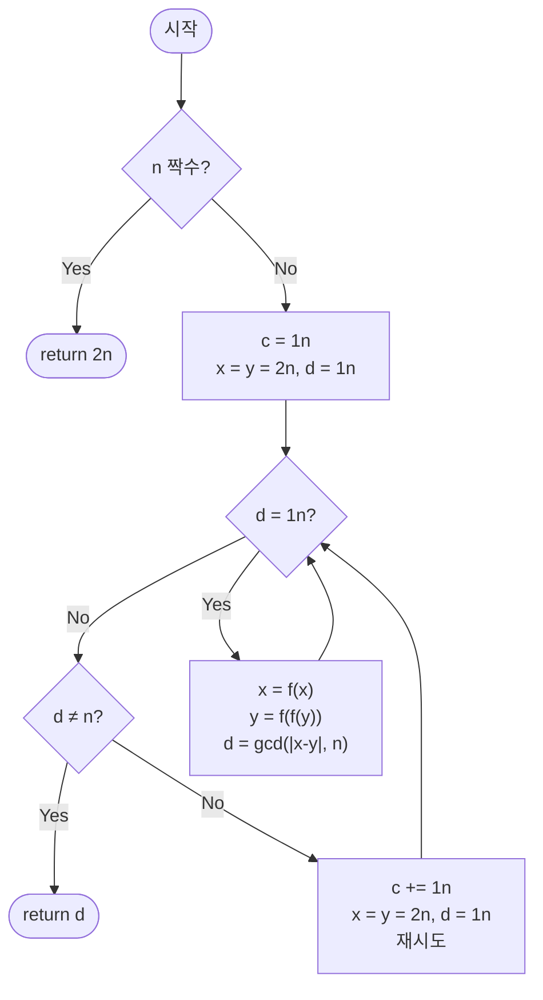

import { AlgorithmSimulation } from "#guide-sim";

# pollardRho — 폴라드 로 인수분해 해설

## 성능 목표 예측

| 항목 | 값 |
|------|-----|
| 입력 범위 | bigint $n \geq 2$, 합성수 권장 |
| 시간 복잡도 | 평균 $O(n^{1/4} \cdot \text{polylog}\, n)$ |
| 공간 복잡도 | $O(1)$ |

**naive 접근의 한계.** 시행 나눗셈은 $O(\sqrt{n})$이다. $n = 2^{64}$이면 $2^{32} \approx 4 \times 10^9$번의 나눗셈이 필요해 수십 초가 걸린다. 큰 수의 인수분해에는 더 영리한 방법이 필요하다.

**목표 복잡도와 근거.** 폴라드 로 알고리즘은 생일 역설을 활용한다. $n$의 소인수 $p$에 대해, 의사 난수 수열이 $\bmod p$ 상에서 충돌(사이클)을 형성하기까지 평균 $O(\sqrt{p})$ 단계가 걸린다. $p \leq \sqrt{n}$이므로 $\sqrt{p} \leq n^{1/4}$이다. 시행 나눗셈보다 지수적으로 빠르다.

**공간 트레이드오프.** Floyd 사이클 탐지 또는 Brent 변형을 사용하면 포인터 두 개만으로 $O(1)$ 공간에 동작한다.

---

## 목표 함수

```ts
function pollardRho(n: bigint): bigint
```

| 파라미터 | 의미 | 제약 |
|----------|------|------|
| `n` | 인수분해 대상 정수 | bigint, $n \geq 2$, 합성수 권장 |

**반환값**: $n$의 비자명한 약수 $d$ ($1 < d \leq n$). $n$이 소수인 경우 $n$ 자체를 반환할 수 있다. $n$이 짝수이면 즉시 $2$를 반환한다.

**엣지케이스**:
1. `n = 4n` → `2n` (짝수 처리)
2. `n = 15n` → `3n` 또는 `5n` (비결정적, 어느 쪽이든 비자명한 약수)
3. `n`이 소수이면 → `n` 자체 반환 (비자명한 약수 없음)
4. `n = 9n` → `3n`

---

## 핵심 아이디어

**핵심 아이디어**: "n의 소인수 p를 모르더라도, mod p 상의 수열이 √p 단계만에 충돌하므로 생일 역설로 비자명한 약수를 추출할 수 있다"

시행 나눗셈은 $O(\sqrt{n})$으로 $n \approx 2^{64}$이면 수십 초가 걸린다. 폴라드 로는 $p$를 직접 찾지 않고, 의사 난수 수열 $x_{i+1} = (x_i^2 + c) \bmod n$이 $\bmod p$ 상에서 생일 역설에 의해 $O(\sqrt{p}) \approx O(n^{1/4})$ 단계만에 충돌함을 이용한다. Floyd 사이클 탐지로 $\bmod n$이 아니라 $\bmod p$ 수준의 충돌 시점을 감지하면 $\gcd(|x - y|, n)$이 비자명한 약수가 된다.

**풀이 구조**
1. $n$이 짝수이면 즉시 2 반환
2. $c = 1$로 시작해 $f(x) = (x^2 + c) \bmod n$ 정의
3. Floyd 탐지: 느린 포인터 $x$는 한 칸, 빠른 포인터 $y$는 두 칸 이동하며 $d = \gcd(|x - y|, n)$ 계산
4. $1 < d < n$이면 $d$ 반환; $d = n$이면 $c$ 증가 후 재시도

**조건**: $n$이 합성수여야 비자명한 약수를 찾을 수 있다. 소수 입력에서는 반복 실패하므로 호출 전에 밀러-라빈으로 소수 여부를 확인하는 것이 표준 패턴이다.

**대표 예시**: $n = 8051$ 인수분해
$f(x) = (x^2 + 1) \bmod 8051$로 수열 시작. 느린/빠른 포인터가 각각 진행하다가 어느 단계에서 $\gcd(|x - y|, 8051) = 97$이 발견된다. $97 \times 83 = 8051$이므로 올바른 비자명 약수이다. $\sqrt{8051} \approx 90$에서 시행 나눗셈보다 훨씬 적은 단계로 찾았다.

**언제 쓰나**
$n > 10^{12}$이어서 시행 나눗셈이 느리고, 완전 소인수 분해가 필요할 때 밀러-라빈과 조합해 사용한다. `factorize(n): 소수면 [n] 반환, 아니면 pollardRho로 약수 d를 구해 factorize(d) + factorize(n/d)` 패턴이 표준이다.

---

### 원형 아이디어와 naive 접근

$n$의 약수를 찾는 가장 단순한 방법은 $2$부터 $\sqrt{n}$까지 시행 나눗셈이다. 이는 $O(\sqrt{n})$이며 큰 $n$에서 폭발한다. "$n$의 소인수 $p$를 직접 찾지 않고, $p$의 존재만 이용해서 약수를 추출할 수 없을까?"라는 발상이 출발점이다.

### 어떤 관찰이 돌파구가 되는가

- **핵심 관찰 1 (생일 역설)**: $\{0, 1, \ldots, p-1\}$에서 무작위로 수를 뽑을 때, 약 $\sqrt{p}$개를 뽑으면 충돌(같은 값)이 높은 확률로 발생한다. $p$를 모르더라도 $\bmod p$ 상의 수열이 사이클을 형성하는 시점을 탐지하면 $\gcd(\|x_i - x_j\|, n)$을 통해 $p$의 배수를 얻을 수 있다.
- **핵심 관찰 2**: $x_{i+1} = (x_i^2 + c) \bmod n$으로 생성된 수열은 $\bmod p$ 상에서도 동일한 함수로 동작하며, 훨씬 빠르게 사이클을 형성한다 ($\sqrt{p} \approx n^{1/4}$ 단계).
- **핵심 관찰 3**: $\bmod n$ 수준에서 $x_i \neq x_j$이어도 $\bmod p$ 수준에서 $x_i \equiv x_j$이면 $\gcd(\|x_i - x_j\|, n)$이 $p$의 배수(비자명한 약수)가 된다.

### 관찰을 형식화: 상태/구조 정의

의사 난수 함수 $f(x) = (x^2 + c) \bmod n$을 정의한다. 두 포인터 $x$ (느린, 한 칸 이동)와 $y$ (빠른, 두 칸 이동)를 사용하는 Floyd 사이클 탐지를 적용한다:

$$x_{k+1} = f(x_k), \quad y_{k+1} = f(f(y_k))$$

매 단계에서 $d = \gcd(\|x - y\|, n)$을 계산한다:
- $d = 1$: 아직 $\bmod p$ 충돌 없음, 계속 진행
- $1 < d < n$: 비자명한 약수 발견, 반환
- $d = n$: 루프 탐지 실패 ($c$ 변경 후 재시도)

이 형태여야 하는 이유: $\bmod p$ 상에서 $x \equiv y$가 되는 순간 $p \mid (x - y)$이므로 $\gcd(|x - y|, n)$이 $p$의 배수가 된다. $\bmod n$ 상에서는 $x \neq y$이어도 $\bmod p$ 수준에서는 사이클이 더 빨리 닫힌다.

### 점화식 또는 핵심 연산

$$f(x) = (x^2 + c) \bmod n$$

$$d = \gcd(\|x - y\|,\, n)$$

**유도 (생일 역설 분석)**: $p$를 $n$의 가장 작은 소인수라 하자. $\{0, \ldots, p-1\}$ 크기의 집합에서 무작위 수열이 충돌을 일으키기까지 기댓값 $O(\sqrt{p})$ 단계가 걸린다(생일 역설). $f$는 의사 난수 함수처럼 동작하므로 같은 분석이 적용된다. Floyd 탐지를 쓰면 상수 인자의 추가 비용으로 사이클 탐지가 가능하다.

### 정당성 — 왜 이것이 옳은가

**확률적 정확성**: 특정 $c$ 값에서 $d = n$이 나오는 경우(실패)는 드물다. $c$ 값을 변경하면 독립적인 수열이 생성되므로 빠르게 성공한다.

**올바른 약수**: $1 < d < n$이면 $d \mid n$이고 $d \neq 1$이며 $d \neq n$이므로 정의상 비자명한 약수이다.

**까다로운 케이스**: $n$이 소수이면 $p = n$이 되어 $d = n$만 나오고 비자명한 약수가 없다. 이 경우 $c$를 계속 바꿔도 반복 실패하므로, 호출 전에 밀러-라빈으로 소수 여부를 확인하거나 내부에서 탈출 조건을 두어야 한다.

### 구현 디테일과 최적화

- **Brent 변형**: Floyd 대신 Brent 알고리즘을 쓰면 $f$ 호출 횟수가 약 $25\%$ 줄어든다. 고정 포인터 $x$와 이동 포인터 $y$를 사용하며, 특정 간격마다 $x = y$로 업데이트한다.
- **gcd 배치 계산**: 매 단계 gcd를 계산하는 대신 여러 단계의 $|x - y|$ 곱을 누적한 뒤 gcd를 한 번만 계산하면 성능이 향상된다.
- **초기 짝수 처리**: `n % 2n === 0n`이면 즉시 `2n`을 반환한다.
- **함정**: $c = 0$이나 $c = n - 2$는 수열이 고정점에 빠질 수 있으므로 피한다. $d = n$이 나오면 $c$를 증가시켜 재시도한다.

---

## 시뮬레이션

고정 입력 `n = 8051n` (`= 83 * 97`)에 대해 `pollardRho`를 실행하는 과정이다. `c = 1`, `f(x) = (x^2 + 1) mod 8051`, Floyd 사이클 탐지(느린 포인터 `x` 한 칸, 빠른 포인터 `y` 두 칸)를 사용한다. `keyValue` 패널은 매 단계의 `x`, `y`, `|x-y|`, `d = gcd(|x-y|, n)`를 보여준다.

실제 반환값은 `97n` (`97 * 83 = 8051`의 비자명한 약수)이며, 시뮬레이션 마지막 프레임과 일치한다.

> 대화형 시뮬레이션은 MDX 런타임에서 표시됩니다.

export const steps = [
  {
    title: "초기화",
    detail: "n=8051 은 홀수. c=1, x=y=2, d=1. f(t)=(t*t+1) mod 8051.",
    entries: [
      { label: "n", value: 8051 },
      { label: "c", value: 1 },
      { label: "x = y", value: 2 },
      { label: "d", value: 1 },
    ],
  },
  {
    title: "1단계",
    detail: "x = f(2) = 5, y = f(f(2)) = f(5) = 26. |x-y| = 21, d = gcd(21, 8051) = 1 → 계속.",
    entries: [
      { label: "x", value: 5 },
      { label: "y", value: 26 },
      { label: "|x - y|", value: 21 },
      { label: "d = gcd(21, 8051)", value: 1 },
    ],
  },
  {
    title: "2단계",
    detail: "x = f(5) = 26, y = f(f(26)) = 7474. |x-y| = 7448, d = gcd(7448, 8051) = 1 → 계속.",
    entries: [
      { label: "x", value: 26 },
      { label: "y", value: 7474 },
      { label: "|x - y|", value: 7448 },
      { label: "d = gcd(7448, 8051)", value: 1 },
    ],
  },
  {
    title: "3단계: 충돌 감지",
    detail: "x = f(26) = 677, y = f(f(7474)) = 871. |x-y| = 194, d = gcd(194, 8051) = 97 → 1 < d < n.",
    entries: [
      { label: "x", value: 677 },
      { label: "y", value: 871 },
      { label: "|x - y|", value: 194 },
      { label: "d = gcd(194, 8051)", value: 97 },
    ],
  },
  {
    title: "완료: return 97n",
    detail: "1 < d=97 < n 이므로 비자명한 약수. mod p=97 상에서 x≡y 충돌이 √97≈10 단계 안에 발생했다. (97 * 83 = 8051)",
    entries: [
      { label: "결과 d", value: 97 },
      { label: "검증 97 * 83", value: 8051 },
    ],
  },
];

<AlgorithmSimulation view="keyValue" steps={steps} title="pollardRho: n=8051" />

## 수도 코드와 Activity Diagram

### 의사코드

```
function pollardRho(n):
    if n % 2n == 0n: return 2n          // 짝수 조기 처리

    c = 1n
    loop:
        x = 2n; y = 2n; d = 1n
        f = t => (t * t + c) % n        // 의사 난수 함수

        // 불변식: d = gcd(|x - y|, n)
        while d == 1n:
            x = f(x)                    // 느린 포인터: 한 칸
            y = f(f(y))                 // 빠른 포인터: 두 칸
            d = gcd(abs(x - y), n)      // 불변식 갱신

        if d != n: return d             // 비자명한 약수 발견
        c += 1n                         // 실패: 다른 c로 재시도
```

### Activity Diagram



**핵심 불변식**: 루프 매 반복 직전, $d = \gcd(\|x - y\|, n)$이 성립하며, $\bmod p$ 상에서 $x$와 $y$가 가까워지고 있다.

---

## 관련 알고리즘과 완전 인수분해 패턴

### 완전 인수분해

`pollardRho`는 비자명한 약수 하나를 반환한다. 완전 인수분해를 위해서는 재귀적으로 적용한다:

```
function factorize(n):
    if n == 1: return []
    if millerRabin(n): return [n]   // 소수이면 자신이 인수
    d = pollardRho(n)
    return factorize(d) + factorize(n / d)
```

이 재귀는 $O(n^{1/4} \cdot \text{polylog}\, n)$의 기댓값 복잡도로 완전 인수분해를 수행한다.

### Brent 변형과 gcd 배치 계산

실용 구현에서는 Floyd 대신 Brent 알고리즘과 gcd 배치 계산을 결합한다:

```
// 128개 차이의 곱을 누적 후 한 번에 gcd 계산
product = 1n
for i = 0 to 127:
    y = f(y)
    product = product * abs(x - y) % n
d = gcd(product, n)
```

gcd 호출 횟수를 128배 줄여 큰 $n$에서 실질적인 속도 향상이 있다. 단, $d = n$인 경우를 조심해야 한다.
