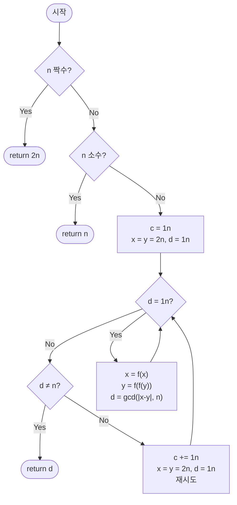

import { AlgorithmSimulation } from "#guide-sim";

# pollardRho — 소인수를 몰라도 mod p 위에서 사이클이 닫히는 순간을 잡아내는 이유

## 한눈에 보는 컨셉

합성수 `n`의 비자명한 약수를 찾을 때, 2부터 하나씩 나눠보는 대신 의사 난수 수열 하나를 굴려서 그 수열이 **`n`의 어떤 소인수 `p`를 법으로 했을 때만 먼저 사이클에 갇히는 순간**을 붙잡는 방법이에요. 생일 역설 덕분에 이 사이클은 평균적으로 `O(sqrt(p))` 단계 안에 닫히고, 가장 작은 소인수 `p`는 `sqrt(n)`을 넘지 않으니 기대 실행 시간은 `O(n^{1/4})` 수준이에요 — 무작위 함수를 가정한 휴리스틱 기대치이지 증명된 최악 시간 상한은 아니지만, 시행 나눗셈의 `O(sqrt(n))`보다 다항식 차수 하나를 그대로 줄이는 폭으로 빠릅니다. 포인터 두 개와 `gcd` 계산만 오가므로 공간은 `O(1)`이에요.

## 출발점: 가장 순진한 방법부터

문제를 먼저 정확히 잡을게요.

```ts
function pollardRho(n: bigint): bigint
```

| 파라미터 | 의미 | 제약 |
|----------|------|------|
| `n` | 약수를 찾을 대상 정수 | bigint, `n >= 2`, 합성수 권장 |

**반환값**: `n`의 약수 `d` (`1 < d <= n`). `n`이 짝수이면 `2`를 반환합니다. `n`이 소수이면 비자명한 약수가 존재하지 않으므로 `n` 자기 자신을 반환합니다. 합성수라면 `1 < d < n`을 만족하는 값을 반환해야 해요. 즉 반환값이 `n` 자신이라면 "약수를 못 찾은 실패"가 아니라 "`n`이 애초에 소수라서 비자명한 약수가 없다"는 뜻이고, `1 < d < n`이 나와야 실제 인수분해에 쓸 수 있는 약수를 찾은 것입니다.

합성수의 약수를 찾는 가장 정직한 방법은 뭘까요? 후보를 하나씩 확인하는 겁니다 — `2`부터 `sqrt(n)`까지 순서대로 나눠 보고, 나누어떨어지는 첫 값을 반환하면 됩니다.

```ts
function trialDivision(n: bigint): bigint {
  if (n % 2n === 0n) return 2n;
  for (let d = 3n; d * d <= n; d += 2n) {
    if (n % d === 0n) return d;
  }
  return n; // 어떤 d로도 나누어떨어지지 않으면 소수
}
```

이게 왜 정직한 방법이냐면, `n`의 가장 작은 소인수는 반드시 `sqrt(n)` 이하에 있기 때문이에요(그보다 크면 짝이 되는 다른 인수가 `sqrt(n)`보다 작아야 하는데, 그 인수를 더 먼저 만났을 겁니다). 그러니 `sqrt(n)`까지만 확인하면 충분합니다.

문제는 `sqrt(n)`이 너무 빨리 커진다는 거예요. 실제로 15자리 소수 하나를 시행 나눗셈으로 돌려 봤습니다.

```text
n = 1,000,000,000,000,037  (약 10^15, 소수)
sqrt(n) ≈ 3.16×10^7  →  홀수만 확인하므로 약 1.58×10^7번의 나눗셈

실측: 266.59ms

같은 처리 속도(약 16.9ns/회)로 자릿수를 늘려 추정해 보면
  n ≈ 10^18            →  약 8~9초
  n ≈ 2^64 (경쟁 프로그래밍에서 자주 쓰이는 64비트 정수 상한) →  수십 초 이상
```

암호 분석에 쓰이는 RSA 모듈러스는 보통 수백 자리입니다. 시행 나눗셈은 아예 시작도 못 하는 규모예요. **`n`의 소인수 `p`를 직접 찾아 나서지 않고, `p`의 존재만 이용해서 약수를 뽑아낼 수는 없을까?** 이것이 폴라드 로(Pollard's rho)가 출발하는 지점입니다.

## 아이디어 자세히 들여다보기

### mod p 위에서 먼저 갇히는 사이클 — 수식과 그림

의사 난수 함수 하나를 정의합니다.

$$f(x) = (x^2 + c) \bmod n$$

$c$는 상수(처음엔 $1$), $n$은 인수분해 대상입니다. 이 함수로 만든 수열 $x_0, x_1 = f(x_0), x_2 = f(x_1), \ldots$ 은 값의 범위가 $\{0, \ldots, n-1\}$로 유한하므로 **언젠가는 반드시 이전에 나온 값을 다시 만납니다** — 그 순간부터 수열은 사이클(원형 구조)을 이룹니다. 이 모양이 그리스 문자 $\rho$(로)를 닮아서 "로 알고리즘"이라는 이름이 붙었어요.

```text
x0 → x1 → x2 → x3 → x4 → x5 → x6
                ↑                ↓
                └──── 사이클 ─────┘
꼬리(rho의 막대) + 원(rho의 동그라미)
```

핵심은 이겁니다 — **mod `n`에서 값이 겹치길 기다리면 최악의 경우 `n`번 가까이 걸릴 수 있지만, mod `p`(`n`의 어떤 소인수)에서는 훨씬 적은 값만 오가므로 겹치는 일(충돌)이 훨씬 빨리 일어납니다.** `x_i \bmod p`도 똑같은 함수 `f`로 갱신되므로(모듈러 연산이 소인수 단위로도 똑같이 성립), `p`가 작으면 그만큼 빨리 $x_i \equiv x_j \pmod p$인 두 인덱스가 생겨요 — 이때 아직 $x_i \equiv x_j \pmod n$은 아닐 수 있다는 게 핵심입니다(그렇다면 $p \mid (x_i-x_j)$이지만 $n \nmid (x_i-x_j)$이므로 $\gcd(|x_i-x_j|, n)$이 $1$도 $n$도 아닌 값을 내놓습니다).

대표 예시로 확인해 볼게요. $n = 8051 = 83 \times 97$, $c = 1$, $x_0 = 2$로 시작해 두 포인터를 굴립니다 — 느린 포인터 $x$는 $f$를 한 번, 빠른 포인터 $y$는 $f$를 두 번(Floyd 사이클 탐지) 적용합니다.

| 단계 | $x$ | $y$ | $x \bmod 97$ | $y \bmod 97$ |
|------|-----|-----|--------------|--------------|
| 0 (초기) | 2 | 2 | 2 | 2 |
| 1 | 5 | 26 | 5 | 26 |
| 2 | 26 | 7474 | 26 | 5 |
| 3 | 677 | 871 | **95** | **95** |

3단계에서 $x \bmod 97$과 $y \bmod 97$이 **처음으로 같은 값(95)**이 됩니다 — Floyd의 두 포인터가 mod `97` 위에서 처음 같은 값으로 만나는(충돌하는) 순간이에요. 그런데 mod `8051`에서는 $x = 677$, $y = 871$로 여전히 다릅니다. 작은 소인수 `97` 아래에서는 이미 충돌했는데, 큰 수 `8051` 아래에서는 아직 충돌하지 않은 상태 — 바로 이 간극을 잡아내는 것이 알고리즘의 전부예요.

잠깐, 확인 하나만 해 볼까요? $x \equiv y \pmod{97}$이면 $97 \mid (x - y)$이고, $97 \mid n$이니 $\gcd(|x-y|, n)$을 계산하면 $97$의 배수가 나오겠죠? 실제로 $|677 - 871| = 194 = 2 \times 97$이고 $\gcd(194, 8051) = 97$입니다 — 정확히 맞아떨어져요.

정리하면 논리 사슬은 이렇습니다: **mod `p` 충돌이 mod `n` 충돌보다 먼저 일어날 수 있다(생일 역설 때문에 훨씬 빨리) → 그 시점엔 $p \mid (x-y)$이지만 $n \nmid (x-y)$일 수 있다 → 그러면 $\gcd(|x-y|, n)$이 $1$도 $n$도 아닌, $p$를 포함한 값을 그대로 드러낸다.** Floyd의 두 포인터 비교는 이 mod `p` 충돌을 "같은 시점에" 잡아내기 위한 장치일 뿐이고, 실제 비자명한 약수를 뽑아내는 것은 이 `gcd` 계산이에요.

### 단서를 설명해 주는 이론 — 생일 역설

"왜 하필 `sqrt(p)` 단계 만에 사이클이 닫힐까?"라는 질문에 답을 주는 것이 생일 역설(birthday paradox)입니다. 이 정리를 일반적인 형태로 먼저 짚고, 그다음 우리 문제에 대응시킬게요.

**생일 역설**: 크기 $m$인 집합에서 원소를 하나씩 무작위로(복원 추출로) 뽑을 때, 뽑은 값들 사이에 **충돌**(같은 값이 두 번 나오는 것)이 처음 발생하기까지 기대되는 시도 횟수는 $\Theta(\sqrt{m})$입니다. 직관적으로는 "$k$명이 모이면 그중 생일이 같은 두 사람이 나올 확률"과 같은 구조예요 — $m = 365$(1년의 날 수)일 때 $k \approx 23$명(대략 $\sqrt{365} \times 1.25 \approx 24$)만 모여도 충돌 확률이 50%를 넘는다는 그 정리입니다. 사람 수가 날짜 수보다 훨씬 적어도 충돌이 "의외로 빨리" 일어난다는 점이 역설이라 불리는 이유예요.

이제 이 정리를 우리 수열에 대응시켜 봅니다. $f(x) = (x^2+c) \bmod p$는 완전한 균일 난수는 아니지만(2차식이라 특정 패턴을 갖습니다), 실전에서는 **의사 난수처럼 $\{0, \ldots, p-1\}$ 위에서 골고루 값을 뽑는 것으로 취급**할 수 있다는 것이 폴라드 로의 핵심 발상(휴리스틱)입니다. 그렇다면 생일 역설에 따라 수열이 $\bmod p$ 상에서 충돌하기까지 기대 단계 수는 $\Theta(\sqrt{p})$예요.

실제로 위 예시에서 $p = 97$이라면 $\sqrt{97} \approx 9.85$ 정도의 자릿수를 기대할 수 있는데, 우리 예시는 느린 포인터 기준 3단계(원시 함수 호출로 치면 $x$ 3회 + $y$ 6회 = 9회)만에 충돌을 찾았습니다 — 같은 자릿수 안에 들어옵니다(생일 역설은 평균값에 대한 주장이라 개별 사례는 더 빠르거나 느릴 수 있어요).

이 이론을 나중에 다시 소환할 일이 있으니 기억해 두세요: **"$p$가 작을수록 충돌이 빨리 온다"**는 이 논증이, 왜 폴라드 로의 기대 실행 시간이 시행 나눗셈보다 짧은지를 뒷받침하는 근거의 전부입니다. `n`의 가장 작은 소인수 `p`는 $p \le \sqrt{n}$이므로, 충돌까지 기대 단계 수는 $O(\sqrt{p}) \le O(n^{1/4})$입니다.

이 개선을 "지수적으로 빠르다"고 부르면 과장이에요 — 입력 비트 길이 $d = \log_2 n$ 기준으로 보면 시행 나눗셈은 $O(2^{d/2})$, 폴라드 로는 $O(2^{d/4})$입니다. **둘 다 비트 길이에 대해서는 여전히 지수 시간**이고, 폴라드 로는 그 지수를 절반으로 줄이는 다항식 수준의 개선일 뿐이에요. 그리고 $O(n^{1/4})$ 자체도 $f$가 무작위 함수처럼 움직인다는 가정 위에서 성립하는 **기대값**이지, 특정 `c` 하나로 항상 이 안에 끝난다고 증명된 상한은 아닙니다 — 운이 나쁘게 $c$를 고르면 재시도가 필요합니다(재시도 로직은 바로 다음 절의 불변식과 함께 설명할게요).

### 왜 모순 없이 작동하는가

이 알고리즘의 핵심 불변식은 하나입니다.

> 루프의 매 반복 직후, $d = \gcd(|x - y|, n)$이 성립하고, $d$는 항상 $n$의 약수다.

여기서 진짜로 보존되는 성질은 "$d$는 항상 $n$의 약수"라는 사실이에요 — $d$ 자체는 이전 값을 들고 다니는 상태가 아니라, 그 시점의 $x, y$로 **매 반복 새로 계산**되는 값입니다. 그래도 이 정의를 매 반복 다시 적용해도 성질이 깨지지 않는다는 것을, 기저와 귀납으로 확인해 볼게요.

**기저**: 첫 반복 전에는 $x = y = x_0$이므로 아직 아무 정보가 없는 상태입니다. 이때는 실제로 `gcd`를 계산하지 않고 $d = 1$로 **강제로 초기화**해서 루프에 진입시켜야 해요(이유는 아래 "헷갈리기 쉬운 포인트"에서 바로 설명합니다).

**귀납 단계**: $k$번째 반복 후 $d_k = \gcd(|x_k - y_k|, n)$이 성립한다고 가정하면, $k+1$번째 반복에서 $x_{k+1} = f(x_k)$, $y_{k+1} = f(f(y_k))$를 계산한 뒤 정의 그대로 $d_{k+1} = \gcd(|x_{k+1} - y_{k+1}|, n)$을 다시 계산하므로 불변식이 그대로 유지됩니다. 이때 나올 수 있는 경우는 정확히 세 가지뿐이고(gcd 정의상 $d$는 항상 $n$의 약수이므로 $d \in \{1, \ldots, n\}$ 중 $n$의 약수만 가능), 이 셋이 전부를 덮습니다.

- $d = 1$: 아직 $\bmod p$ 충돌이 없다는 뜻. 계속 진행합니다.
- $1 < d < n$: $\gcd$가 만들어낸 값이 $n$의 진짜 약수이자 $1$도 $n$도 아니므로, 정의상 비자명한 약수입니다. 그대로 반환하면 끝입니다.
- $d = n$: $x_i \equiv y_i \pmod n$까지 완전히 일치해 버린 경우(또는 사이클이 나쁘게 걸린 경우)로, 이 $c$ 값으로는 정보를 더 못 얻습니다. $c$를 바꿔 완전히 다른 수열로 재시도합니다.

이 세 경우가 매 반복에서 나올 수 있는 전부이고, 각 경우의 처리(계속/반환/재시도)가 빠짐없이 정의돼 있습니다. 다만 이 알고리즘은 $f$가 의사 난수처럼 움직인다는 가정 위에 선 휴리스틱이라 **어떤 `c`로 항상 유한 시간 안에 끝난다는 증명된 상한은 없습니다** — 실전에서는 `c`를 바꿔가며 재시도하면 거의 항상 빠르게 비자명한 약수를 찾습니다.

여기서 **헷갈리기 쉬운 포인트**가 있습니다 — 방금 "기저"에서 언급한 그 초기화 문제예요. `d`를 강제로 `1`로 두지 않고, "어차피 $x_0 = y_0$이니 실제로 $\gcd(|x_0 - y_0|, n)$을 계산해서 넣자"라고 생각하면 어떻게 될까요?

```text
x0 = y0 = 2 이므로 |x0 - y0| = 0
gcd(0, n) 의 정의: gcd(0, k) = k  →  gcd(0, 8051) = 8051 (= n 자신!)

while (d === 1n) { ... } 로 루프를 짜 놓았다면
d가 이미 n이므로 루프 조건이 거짓 → 루프 본문이 단 한 번도 실행되지 않는다
바로 "d !== n" 검사로 넘어가는데 d === n이므로 c를 늘리고 처음부터 재시도
→ 매번 똑같은 상황이 반복되어 영원히 끝나지 않는다
```

`gcd(0, n) = n`이라는 사실을 놓치면, 실제로는 수열을 단 한 걸음도 전진시키지 못한 채 "실패"로 오판하고 무한히 `c`만 증가시키는 조용한 버그가 생깁니다. 그래서 `d`의 초기값은 계산된 것이 아니라 **의도적으로 박아 넣은 `1n`**이어야 해요.

엣지 케이스도 불변식 위에서 확인해 둘게요.

```text
n = 4  (= 2 × 2, 가장 작은 짝수 합성수) → 짝수 처리로 즉시 2 반환
n = 9  (= 3 × 3, 완전제곱수)           → 실측: d = 3 (반복 제곱 소인수도 정상 처리)
n = 15 (= 3 × 5)                       → 실측: d = 3
n = 2, n = 3 (소수)                    → 비자명한 약수가 없으므로 자기 자신 반환
```

`n = 9`가 잘 되는 이유도 불변식을 다시 보면 명확해요 — $\gcd(|x-y|, n)$이 비자명한 약수를 내려면 $x \equiv y \pmod p$인 어떤 소인수 $p$만 있으면 충분하고, $p$가 $n$을 몇 번 나누는지($p^1$이든 $p^2$이든)는 전혀 상관이 없습니다. $n = 9 = 3^2$이어도 `mod 3` 위에서 충돌이 일어나는 순간 $\gcd(|x-y|, 9)$는 그대로 $3$을 잡아냅니다 — 완전제곱수라고 알고리즘이 특별히 다르게 동작할 이유가 없는 거예요.

## 아이디어를 코드로 옮기기

먼저 두 가지 작은 도구가 필요합니다. `gcd`는 유클리드 호제법이고, `isPrime`은 밀러-라빈(Miller-Rabin) 소수 판정입니다. 일반적인 밀러-라빈은 밑수(witness)를 무작위로 뽑아 "합성수라는 증거가 없으면 소수로 간주"하는 **확률적** 판정법이에요 — 매 시도마다 오판 확률이 있고, witness 수를 늘릴수록 그 확률이 줄어듭니다. 다만 아래 코드가 쓰는 `[2, 3, 5, 7, ..., 37]` 12개 고정 witness 집합은 특별한 경우예요 — $n < 3.3 \times 10^{24}$ 범위에서는 이 고정 집합만으로 **오판이 전혀 없다는 것이 알려진 결과**(결정적 판정)입니다. 이 경계를 넘는 `n`에 이 함수를 그대로 쓰면 이론상 오판(실제로는 합성수인데 소수로 판정) 가능성이 생기니, 그런 범위까지 다루려면 무작위 witness를 섞는 일반형으로 바꿔야 해요. 폴라드 로 자체의 주제는 아니라서 세부 유도는 다루지 않고 도구로만 씁니다.

```ts
function gcd(a: bigint, b: bigint): bigint {
  a = a < 0n ? -a : a;
  b = b < 0n ? -b : b;
  while (b !== 0n) {
    [a, b] = [b, a % b];
  }
  return a;
}

function modPow(base: bigint, exp: bigint, mod: bigint): bigint {
  let result = 1n;
  base %= mod;
  while (exp > 0n) {
    if (exp & 1n) result = (result * base) % mod;
    base = (base * base) % mod;
    exp >>= 1n;
  }
  return result;
}

// n < 3.3 × 10^24 범위에서 정확한 것으로 알려진 고정 증인 집합
function isPrime(n: bigint): boolean {
  if (n < 2n) return false;
  const smallPrimes = [2n, 3n, 5n, 7n, 11n, 13n, 17n, 19n, 23n, 29n, 31n, 37n];
  for (const p of smallPrimes) {
    if (n === p) return true;
    if (n % p === 0n) return false;
  }
  let d = n - 1n;
  let r = 0n;
  while (d % 2n === 0n) {
    d /= 2n;
    r += 1n;
  }
  witnessLoop: for (const a of smallPrimes) {
    let x = modPow(a, d, n);
    if (x === 1n || x === n - 1n) continue;
    for (let i = 0n; i < r - 1n; i++) {
      x = (x * x) % n;
      if (x === n - 1n) continue witnessLoop;
    }
    return false;
  }
  return true;
}
```

이제 앞서 본 아이디어를 그대로 옮깁니다.

```ts
function pollardRhoBasic(n: bigint): bigint {
  if (n % 2n === 0n) return 2n;
  if (isPrime(n)) return n;

  let c = 1n;
  while (true) {
    let x = 2n;
    let y = 2n;
    let d = 1n; // 계산이 아니라 의도적인 초기화 — 위 "헷갈리기 쉬운 포인트" 참고
    const f = (t: bigint) => (t * t + c) % n;

    while (d === 1n) {
      x = f(x); // 느린 포인터: 한 칸
      y = f(f(y)); // 빠른 포인터: 두 칸
      d = gcd(x > y ? x - y : y - x, n);
    }

    if (d !== n) return d; // 비자명한 약수 발견
    c += 1n; // 실패: 다른 c로 재시도
  }
}
```

가장 실수가 잦은 줄은 `let d = 1n;`입니다. `x`, `y`와 나란히 놓여 있어서 "이것도 `x`, `y`처럼 초기 상태를 계산한 값"이라고 착각하기 쉬운데, 실제로는 위에서 짚었듯 계산값이 아니라 **루프에 진입시키기 위한 강제 초기화**예요. 그 외에 눈여겨볼 지점:

- `isPrime(n)`을 짝수 검사 다음, 메인 루프 진입 전에 미리 확인합니다. 이걸 빼먹으면 소수 입력에서 `c`를 영원히 증가시키며 끝나지 않는 루프에 빠집니다.
- `x = f(x)`가 `y = f(f(y))`보다 먼저 계산되어도 되고 나중이어도 상관없습니다(같은 반복 안에서 서로의 이전 값만 참조하므로) — 다만 **`y`는 반드시 `f`를 두 번** 적용해야 "두 배 빠른 포인터"라는 전제가 유지됩니다. 한 번만 적용하면 `y`가 `x`와 완전히 같은 값을 그대로 따라가게 되어(둘 다 매 반복 `f`를 한 번씩만 거치므로), `|x-y|`가 항상 `0`이 되고 `gcd(0, n) = n`만 반복해서 얻는 퇴화 상태에 빠집니다 — "만나지 않는다"가 아니라 "매 순간 이미 겹쳐 있어서 유의미한 정보를 전혀 못 만든다"는 뜻이에요.

## 더 빠르게 만들 단서 찾기

위 구현을 큰 수에 실제로 돌려서 무엇이 시간을 잡아먹는지 봤습니다. $n = 1{,}000{,}000{,}016{,}000{,}000{,}063$ ($= 1{,}000{,}000{,}007 \times 1{,}000{,}000{,}009$, 10자리 소수 두 개의 곱)을 넣으면:

```text
실측(basic): gcd 호출 27,573회, 총 19.97ms

매 반복마다 gcd(|x-y|, n)을 호출하는데
그중 27,572번은 결과가 1(정보 없음) — 마지막 1번만 진짜 답을 준다
→ "결과가 대부분 버려지는 계산"을 27,000번 넘게 반복하는 셈
```

큰 bigint 두 개의 `gcd`는 유클리드 호제법으로 나눗셈을 반복하는 연산이라 값이 커질수록 비용이 늘어납니다. 매번 호출해서 대부분 `1`만 돌려받는다면, **여러 단계를 모아서 한 번에 판정할 수는 없을까?**라는 것이 이번 단서입니다.

## 단서를 최적화로 연결하기

`gcd(|x_i - y_i|, n)`이 `1`보다 크다는 것은 "어떤 소인수 $p$에 대해 $p \mid (x_i - y_i)$"라는 뜻입니다. 그런데 $\gcd$에는 다음 성질이 있어요.

$$p \mid (x_i - y_i) \;\Rightarrow\; p \mid \Big(\prod_{j} (x_j - y_j) \bmod n\Big)$$

즉 여러 단계의 $(x_j - y_j)$를 **곱해서 mod n으로 누적**해 두어도, 그중 하나라도 $p$의 배수였다면 누적된 곱 전체가 $p$의 배수로 남습니다. 그러니 매 단계 `gcd`를 부르는 대신, 예를 들어 128단계마다 한 번만 `gcd`를 호출해도 됩니다 — 그 배치 안 어딘가에서 어떤 소인수 $p$에 대한 충돌이 있었다면, 누적 곱의 `gcd`에도 그 신호가 살아남습니다(다만 다른 소인수와 뒤섞여 정확히 어느 단계였는지는 알 수 없어요 — 이 한계는 바로 다음 절에서 다룹니다).

```text
Before: 매 단계마다 gcd 호출
  단계1 gcd  단계2 gcd  단계3 gcd  ...  단계128 gcd   → gcd 128회

After: 128단계 곱을 누적한 뒤 한 번만 gcd 호출
  단계1 곱누적 → 단계2 곱누적 → ... → 단계128 곱누적 → gcd 1회
                                                          (128배 절약)
```

여기에 두 번째 개선도 함께 넣습니다. Floyd 방식은 매 반복 `f`를 세 번(느린 포인터 1번 + 빠른 포인터 2번) 호출하는데, **Brent의 변형**은 배치 길이를 $1, 2, 4, 8, \ldots$로 두 배씩 늘려가며 포인터 하나만 계속 전진시키고, 배치 시작점만 별도로 기억해 두는 방식으로 `f` 호출 수 자체를 줄입니다.

왜 호출 수가 줄어들까요? Floyd는 한 반복마다 느린 포인터(1회)와 빠른 포인터(2회)를 **둘 다** 전진시켜야 하니 `f` 호출이 3번이에요. Brent는 다릅니다 — 체크포인트는 이미 지나간 이동 포인터의 값을 그대로 복사해 오는 것뿐이라 별도 `f` 호출이 필요 없고, 실제로 매 단계 전진하는 포인터는 하나뿐이에요. 그래서 같은 구간을 훑는 데 드는 `f` 호출이 반복당 3번에서 1번으로, 약 3배 줄어듭니다.

다만 배치 단위로 묶은 곱의 `gcd`가 `n`(= 유용한 정보 없음)으로 나오면, 그 배치 안 정확한 충돌 지점을 잃어버린 것이므로 그 구간만 한 칸씩 되짚어야 해요.

## 최적화 코드

바뀌는 것은 Floyd의 두 포인터 루프를, 배치 길이를 두 배씩 늘려가는 Brent 방식 + 누적곱 `gcd`로 바꾸는 부분입니다.

```ts
function brentRound(n: bigint, c: bigint): bigint {
  const f = (t: bigint) => (t * t + c) % n;
  const BATCH = 128n;

  let y = 2n; // 이동 포인터
  let x = 2n; // 현재 배치의 시작점(스냅샷)
  let xs = 2n; // 배치 안에서 되짚기용 체크포인트
  let g = 1n;
  let q = 1n; // 배치 안 (x-y) 곱의 mod n 누적값
  let l = 1n; // 배치 길이: 1, 2, 4, 8, ...로 두 배씩 증가

  while (g === 1n) {
    x = y; // 새 배치 시작: x를 이전 배치 끝 위치로 고정
    for (let i = 0n; i < l - 1n; i++) y = f(y);

    let k = 0n;
    while (k < l && g === 1n) {
      xs = y;
      const lim = BATCH < l - k ? BATCH : l - k;
      for (let i = 0n; i < lim; i++) {
        y = f(y);
        q = (q * (x > y ? x - y : y - x)) % n; // 누적곱
      }
      g = gcd(q, n); // 배치당 gcd 1회
      k += BATCH;
    }
    l *= 2n;
  }

  if (g === n) {
    // 배치 안에서 정확한 충돌 지점을 잃어버린 경우: 한 칸씩 되짚는다
    do {
      xs = f(xs);
      g = gcd(x > xs ? x - xs : xs - x, n);
    } while (g === 1n);
  }

  return g;
}

function pollardRho(n: bigint): bigint {
  if (n % 2n === 0n) return 2n;
  if (isPrime(n)) return n;

  let c = 1n;
  while (true) {
    const d = brentRound(n, c);
    if (d !== n && d !== 0n) return d;
    c += 1n;
  }
}
```

`for (let i = 0n; i < l - 1n; i++) y = f(y);`도 짚어볼 결정 지점이에요 — 매 바깥 반복 시작에서 `x = y`로 체크포인트를 직전 라운드가 끝난 위치에 고정한 다음, `y`를 그 자리에서 `l - 1`번 더 전진시켜 두고, 곧바로 이어지는 안쪽 이중 루프에서 나머지 `l`번을 마저 전진시킵니다 — 그래서 이 라운드 전체에서 `y`가 총 `(l - 1) + l = 2l - 1`걸음을 전진합니다. 실제로 `l = 1`인 첫 라운드에서는 `l - 1 = 0`이라 사전 전진이 아예 없고(체크포인트가 곧 현재 위치, 총 전진 `1`걸음), `l = 2`가 되는 두 번째 라운드부터는 사전 전진이 `1`걸음 들어갑니다(`n = 8051, c = 1`로 실측한 트레이스: 체크포인트 `x = 5`, 사전 전진 후 `y = 26`, 이 라운드 총 전진 `3`걸음) — 배치 길이가 두 배로 늘 때마다 라운드 전체 전진 폭도 그에 맞춰 커지도록 짜여 있는 거예요.

가장 중요한 줄은 `q = (q * (x > y ? x - y : y - x)) % n;`입니다 — 이 한 줄이 "매 단계 gcd" 대신 "곱을 누적"으로 바꾸는 전부예요. 그리고 `if (g === n) { ... }` 블록도 놓치면 안 됩니다. 배치 크기를 128로 묶었기 때문에, 실제 충돌이 배치 중간 정확히 어느 단계에서 일어났는지는 누적곱만으로는 알 수 없어요 — 곱 전체의 `gcd`가 `n`으로 나오는 원인은 두 가지예요. 배치 안 어딘가에서 진짜로 $x \equiv y \pmod n$까지 통째로 겹쳐버렸거나, 서로 다른 소인수에 대한 충돌 신호들이 뒤섞여 우연히 곱 전체가 `n`의 배수가 된 경우입니다. 어느 쪽이든 누적곱만으로는 정확한 위치를 구분할 수 없으므로, 배치를 통째로 버리고 한 칸씩 다시 확인해야 합니다. 이 되짚기를 빼먹으면, 배치 안에 진짜 약수가 있었는데도 "이 `c`는 실패"로 잘못 판단하고 다음 `c`로 넘어가 버리는 조용한 오답이 납니다.

실측으로 확인해 볼게요. 같은 $n = 1{,}000{,}000{,}016{,}000{,}000{,}063$에 대해:

```text
              gcd 호출 횟수     실행 시간
basic (Floyd)     27,573회        19.97ms
opt (Brent+배치)     144회         3.41ms

gcd 호출 약 191배 감소, 실행 시간 약 5.9배 단축
(측정 환경에 따라 배수는 달라질 수 있습니다 — 점근 복잡도 O(n^{1/4})은 그대로입니다)
```

> 기억법: **"매번 묻지 말고, 128번 모았다가 한 번만 물어본다."**

더 최적화할 여지가 있을까요? 배치 크기(128)를 환경에 맞춰 미세 조정하는 정도가 남아 있지만, 기대 복잡도 $O(n^{1/4})$ 자체는 이미 생일 역설이 정해 둔 (휴리스틱) 한계라 여기서 더 줄지 않습니다. 참고로 "매우 큰 합성수의 인수분해"라는 목표 자체에는 타원곡선법(ECM), 이차체(quadratic sieve), 일반 수체체(GNFS) 같은 훨씬 정교한 특화 알고리즘이 존재하고, 실전 RSA 크기(수백 자리)에서는 이들이 표준입니다. 그럼에도 폴라드 로(Brent 변형)를 배우는 이유는 **구현이 짧고 범용적**이라는 데 있어요 — 별도의 사전 지식(타원곡선, 매끄러운 수 체 등) 없이 포인터 두 개와 `gcd`만으로 $10^{18}$ 규모(경쟁적 프로그래밍에서 자주 등장하는 64비트 정수 범위)의 인수분해를 실용적인 시간 안에 해결할 수 있습니다.

## 실행 시각화

고정 입력 `n = 8051n` (`= 83 * 97`)에 대해 `pollardRho`를 실행하는 과정이에요. `c = 1`, `f(x) = (x^2 + 1) mod 8051`, Floyd 사이클 탐지(느린 포인터 `x` 한 칸, 빠른 포인터 `y` 두 칸)를 사용합니다. `keyValue` 패널은 매 단계의 `x`, `y`, `|x-y|`, `d = gcd(|x-y|, n)`을 보여줘요. 실제 반환값은 `97n` (`97 * 83 = 8051`의 비자명한 약수)이며, 위 "수식과 그림" 절에서 손으로 확인한 mod 97 충돌(3단계, 값 95)과 같은 지점에서 시뮬레이션이 끝납니다.

> 대화형 시뮬레이션은 MDX 런타임에서 표시됩니다.

export const steps = [
  {
    title: "초기화",
    detail: "n=8051 은 홀수. c=1, x=y=2, d=1. f(t)=(t*t+1) mod 8051.",
    entries: [
      { label: "n", value: 8051 },
      { label: "c", value: 1 },
      { label: "x = y", value: 2 },
      { label: "d", value: 1 },
    ],
  },
  {
    title: "1단계",
    detail: "x = f(2) = 5, y = f(f(2)) = f(5) = 26. |x-y| = 21, d = gcd(21, 8051) = 1 → 계속.",
    entries: [
      { label: "x", value: 5 },
      { label: "y", value: 26 },
      { label: "|x - y|", value: 21 },
      { label: "d = gcd(21, 8051)", value: 1 },
    ],
  },
  {
    title: "2단계",
    detail: "x = f(5) = 26, y = f(f(26)) = 7474. |x-y| = 7448, d = gcd(7448, 8051) = 1 → 계속.",
    entries: [
      { label: "x", value: 26 },
      { label: "y", value: 7474 },
      { label: "|x - y|", value: 7448 },
      { label: "d = gcd(7448, 8051)", value: 1 },
    ],
  },
  {
    title: "3단계: 충돌 감지",
    detail: "x = f(26) = 677, y = f(f(7474)) = 871. |x-y| = 194, d = gcd(194, 8051) = 97 → 1 < d < n.",
    entries: [
      { label: "x", value: 677 },
      { label: "y", value: 871 },
      { label: "|x - y|", value: 194 },
      { label: "d = gcd(194, 8051)", value: 97 },
    ],
  },
  {
    title: "완료: return 97n",
    detail: "1 < d=97 < n 이므로 비자명한 약수. mod p=97 상에서 x≡y 충돌이 √97≈10 단계 안에 발생했다. (97 * 83 = 8051)",
    entries: [
      { label: "결과 d", value: 97 },
      { label: "검증 97 * 83", value: 8051 },
    ],
  },
];

<AlgorithmSimulation view="keyValue" steps={steps} title="pollardRho: n=8051" />

## 흐름 한눈에 보기


```mermaid
flowchart TD
    A([시작]) --> B{"n 짝수?"}
    B -- Yes --> C(["return 2n"])
    B -- No --> Z{"n 소수?"}
    Z -- Yes --> Y(["return n"])
    Z -- No --> D["c = 1n<br/>x = y = 2n, d = 1n"]
    D --> E{"d = 1n?"}
    E -- No --> F{"d ≠ n?"}
    F -- Yes --> G(["return d"])
    F -- No --> H["c += 1n<br/>x = y = 2n, d = 1n<br/>재시도"]
    H --> E
    E -- Yes --> I["x = f(x)<br/>y = f(f(y))<br/>d = gcd(|x-y|, n)"]
    I --> E
```

## 스스로 점검하기

1. `n = 9`(`= 3 × 3`)에 대해 손으로 따라가 보세요. `c = 1`, `f(t) = (t*t+1) mod 9`, `x0 = y0 = 2`로 시작합니다. 몇 단계 만에 `1 < d < 9`가 나오는지, 그때 `d`가 얼마인지 구해 보세요. (힌트: 반복 제곱 소인수라도 알고리즘은 특별 취급 없이 동작합니다 — 실측으로도 `d = 3`이 나옵니다.)
2. 본문의 "헷갈리기 쉬운 포인트"를 다시 보세요. 만약 `d`의 초깃값을 `1n`으로 강제하는 대신 `gcd(|x0 - y0|, n)`으로 실제 계산해서 넣었다면, `n = 8051`에서 무슨 일이 벌어질까요? 루프가 몇 번째 반복에서 멈추는지, 아니면 아예 멈추지 않는지 설명해 보세요.
3. 최적화 코드의 `if (g === n) { ... }` 되짚기 블록을 통째로 지우면 어떻게 될까요? 배치(128단계) 중간에서 실제로 비자명한 약수가 존재하는 상황을 상상하며, 알고리즘이 그 약수를 놓치고 어떤 결과를 반환하게 되는지 짚어 보세요.
