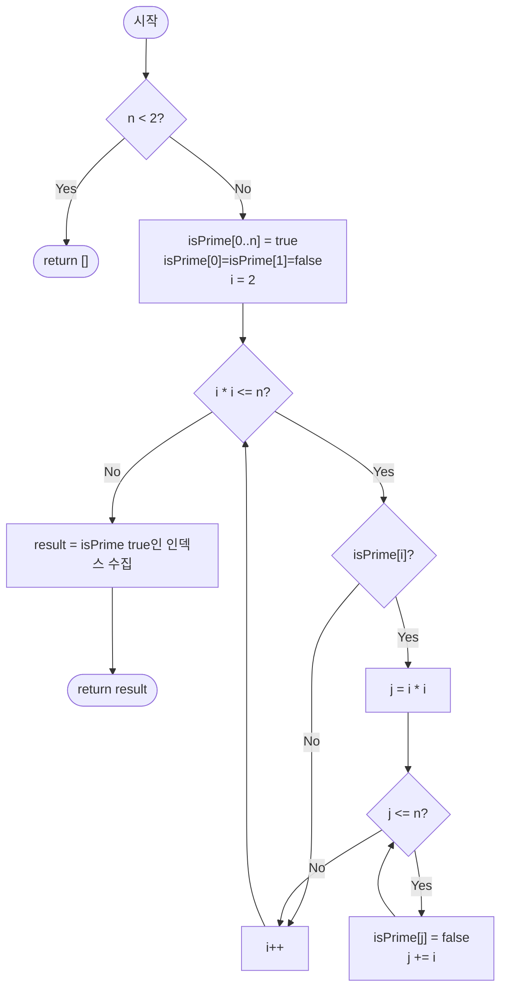

import { AlgorithmSimulation } from "#guide-sim";

# sieveOfEratosthenes — 소수를 하나씩 묻지 않고, 배수를 통째로 지우는 이유

## 한눈에 보는 컨셉

$n$ 이하의 소수를 전부 구해야 할 때, 숫자마다 "너 소수니?"라고 따로 묻는 대신 소수를 하나 찾을 때마다 **그 배수 전부를 한 번에 지워버리는** 방식이에요. 소수 $p$는 $p^2$부터 지우기 시작하면 충분하고, 소수의 역수 합이 $\log\log n$ 수준으로 아주 느리게 자라기 때문에 전체 지우기 작업량은 `O(n log log n)`에 그칩니다. 핵심 관찰은 하나입니다 — **"이미 합성수라고 밝혀진 수는 다시는 검사하지 않아도 된다."**

## 출발점: 가장 순진한 방법부터

문제를 정확히 잡고 갈게요.

```ts
function sieveOfEratosthenes(n: number): number[]
```

| 파라미터 | 의미 | 제약 |
|----------|------|------|
| `n` | 소수를 구할 상한 | 음이 아닌 정수. 일반적인 JS/TS 런타임(메모리 수백 MB, 시간 제한 1~2초) 기준으로 $n \leq 10^7$ 안팎이 흔히 통하는 실전 상한이지만, 정확한 한계는 언어·메모리·시간 제한에 따라 달라집니다 |

**반환값**: $n$ 이하의 모든 소수를 오름차순으로 담은 배열. $n < 2$이면 `[]`.

가장 정직한 방법은 $2$부터 $n$까지 수 하나하나에 대해 "이 수가 소수인가?"를 시행 나눗셈으로 판정하는 겁니다.

```ts
function isPrimeTrial(x: number): boolean {
  if (x < 2) return false;
  for (let d = 2; d * d <= x; d++) {
    if (x % d === 0) return false;
  }
  return true;
}

function sieveOfEratosthenesNaive(n: number): number[] {
  const result: number[] = [];
  for (let k = 2; k <= n; k++) {
    if (isPrimeTrial(k)) result.push(k);
  }
  return result;
}
```

판정 하나에 $O(\sqrt{x})$이고, $x$가 $2$부터 $n$까지 움직이므로 정확히 더하면 $\sum_{x=2}^{n} \sqrt{x} = \Theta(n^{3/2})$입니다. 판정마다 최악을 $\sqrt{n}$ 하나로 뭉뚱그려 "$\sqrt{n}$짜리 판정을 $n$번"이라 말하면 더 거친 상한 $O(n\sqrt{n})$을 얻는데, 차수(지수) 자체는 둘 다 $n^{1.5}$로 같습니다. $n = 10^6$이면 대략 $10^9$번의 나눗셈 연산이 필요해서 1초 안에 끝내기 빠듯합니다.

```text
n = 10^6 일 때:

  시행 나눗셈:  판정 1건 = O(√x) ≈ 최대 1000회 나눗셈
               1,000,000건 × 최대 1000회  ≈  10^9 회   →  느림 (수 초)
```

숫자를 하나씩 늘어놓고 판정 과정을 지켜보면 낌새가 하나 보여요. `12`를 판정할 때 `2`로 나눠보는 순간 이미 "12는 2의 배수다"라는 사실을 알아버립니다. 그런데 이 정보는 그 자리에서 버려지고, 나중에 `24`, `36`, `48`을 판정할 때 또다시 처음부터 나눗셈을 시도해요. **"어떤 수가 합성수라는 사실을 한 번 알아냈으면, 그 수의 배수들에 대해서도 재사용할 수 없을까?"** 이것이 에라토스테네스의 체로 가는 출발 단서입니다.

## 아이디어 자세히 들여다보기

### 배수를 한꺼번에 지우기 — 수식과 그림

시행 나눗셈은 "이 수가 소수인가?"를 매번 새로 묻습니다. 반대로 접근해 볼게요. 소수 $p$를 하나 찾으면, $p$의 배수 $2p, 3p, 4p, \ldots$는 전부 합성수라는 게 이미 확정됩니다. 그러니 $p$가 확정되는 순간 그 배수들을 한 번의 스캔으로 모두 "제거" 표시해 버리면, 이후 그 수들에 대해서는 다시 판정할 필요가 없어요.

상태를 불리언 배열 $\text{isPrime}[0..n]$으로 둡니다. 인덱스 $k$가 소수 후보로 아직 살아 있으면 `true`, 이미 합성수로 확정됐으면 `false`입니다.

```text
n = 10 초기 상태 (인덱스 0..10)

idx:    0    1    2    3    4    5    6    7    8    9   10
val: [ F  , F  , T  , T  , T  , T  , T  , T  , T  , T  , T  ]
        └0,1은 소수가 아니므로 처음부터 false로 고정┘
```

여기서 확인 질문 하나 — $i = 2$가 소수로 확정되면 지워야 할 배수는 몇 개일까요? $n = 10$이면 $4, 6, 8, 10$까지 4개입니다. 배수를 지운 뒤 그림은 이렇게 바뀝니다.

```text
Before (i=2 처리 전):  [ F, F, T, T, T, T, T, T, T, T, T ]
                                   2  3  4  5  6  7  8  9  10
After  (i=2 처리 후):  [ F, F, T, T, F, T, F, T, F, T, F  ]
                                   2  3  4✗ 5  6✗ 7  8✗ 9  10✗
```

**왜 하필 $p^2$부터 지우기 시작할까요?** $p$의 배수 중 $p^2$보다 작은 것들, 즉 $2p, 3p, \ldots, (p-1)p$는 전부 $p$보다 작은 수의 배수이기도 합니다. 이 수들은 그 작은 소수를 처리할 때 이미 지워졌어요. 그래서 $p^2$부터 시작해도 빠지는 게 없습니다. 이 관찰 덕분에 바깥 루프도 $i^2 \leq n$, 즉 $i \leq \sqrt{n}$까지만 돌리면 충분해집니다 — $\sqrt{n}$보다 큰 $i$는 애초에 처리할 배수(≤ n)가 $i^2$부터 시작해서 남아 있지 않거든요.

값 하나를 "지운 순간의 상태"로만 기록하는 이 불리언 배열 방식이 가장 단순합니다. 대안으로 각 수의 **최소 소인수**까지 기록하는 배열(`lpf[]`, least prime factor)을 쓸 수도 있는데, 그러면 메모리를 조금 더 쓰는 대신 이후 임의의 수를 $O(\log m)$에 소인수분해할 수 있어요. 이 가이드는 "소수 목록만 빠르게 뽑는" 목적에 집중하므로 불리언 배열을 씁니다.

### 단서를 설명해 주는 이론 — 메르텐스 정리

방금 "$p^2$부터 지우면 충분하다"는 관찰로 바깥 루프 범위는 줄였지만, 그래도 여전히 궁금한 게 남아요. 소수마다 배수를 지우는 안쪽 루프까지 다 합치면 총 몇 번을 지우는 걸까요? 이 질문에 답하는 것이 **메르텐스 제2정리(Mertens' second theorem)**입니다.

$$\sum_{p \leq n,\ p \text{ 소수}} \frac{1}{p} = \ln \ln n + M + o(1)$$

여기서 $M$은 상수(메르텐스 상수)입니다. 이 식이 말하는 건 "소수의 역수를 전부 더하면 $\ln \ln n$만큼만 자란다"는 것인데, $\ln \ln n$은 $n$이 아무리 커져도 극도로 천천히 증가해요. $n = 10^6$이어도 $\ln \ln n \approx 2.6$ 정도입니다.

이게 왜 중요할까요? 소수 $p$ 하나를 처리할 때 안쪽 루프가 도는 횟수는 $p^2$부터 $p$ 간격으로 $n$까지이므로 정확히 $\left\lfloor \frac{n - p^2}{p} \right\rfloor + 1 \leq \frac{n}{p}$번입니다. (이미 `false`로 지워진 칸을 또 `false`로 덮어써도 이 반복 횟수 상한은 변하지 않습니다 — 여기서 세는 건 "새로 지워지는 합성수의 개수"가 아니라 "안쪽 루프가 도는 횟수"이기 때문입니다.) 그러니 전체 지우기 횟수는

$$\sum_{p \leq \sqrt{n},\ p \text{ 소수}} \frac{n}{p} = n \sum_{p \leq \sqrt{n}} \frac{1}{p} \approx n \cdot \ln\ln \sqrt{n} = O(n \log \log n)$$

마지막 근사가 왜 $O(n \log \log n)$으로 정리되는지도 짚어 볼게요. $\ln \ln \sqrt{n} = \ln\left(\frac{1}{2}\ln n\right) = \ln \ln n - \ln 2$이므로, $\sqrt{n}$까지만 더한 것과 $n$까지 다 더한 것의 차이는 상수 $\ln 2$ 하나뿐입니다. 빅오 표기에서 상수항은 사라지므로 최종 점근 복잡도는 그대로 $O(n \log \log n)$입니다. 즉 메르텐스 정리가 "왜 하필 $\log \log n$인가"의 근거예요. 이 사실은 뒤에서 최적화의 점근 복잡도가 그대로 유지된다고 말할 때 다시 소환할 테니 기억해 두세요.

### 왜 모순 없이 작동하는가

이 알고리즘이 지키는 불변식은 하나입니다.

> 바깥 루프가 $i$에 도달했을 때, $2$ 이상 $i$ 미만인 모든 소수의 $n$ 이하 배수는 이미 `isPrime`에서 `false`로 표시되어 있다.

**기저**: $i = 2$에서는 아직 아무 소수도 처리되지 않았으니 공허하게 참입니다.

**귀납 단계**: $i$에서 불변식이 성립한다고 가정합니다. `isPrime[i]`를 확인하는 두 경우가 전부입니다(다른 경우가 없습니다 — `isPrime[i]`는 `true` 아니면 `false`이므로).

- `isPrime[i] = false`인 경우: $i$는 자신보다 작은 어떤 소수의 배수라는 뜻입니다. 그럼 $i$ 자신의 배수들($2i, 3i, \ldots$)도 이미 다 지워졌을까요? **예, 이미 지워졌습니다** — $i$가 합성수이면 $i$의 최소 소인수 $p$는 $p \leq \sqrt{i}$를 만족하므로 $i \geq p^2$이고, 따라서 $i$의 모든 배수는 $p$의 배수이기도 하면서 $p^2$ 이상이라 $p$를 처리할 때 이미 지워진 자리입니다. 그러니 $i$에서는 아무 작업도 하지 않고 다음 $i+1$로 넘어가도 불변식이 깨지지 않습니다. $i$가 소수가 아니므로 "$i$ 미만 소수"의 집합에 새로 추가할 것도 없습니다.
- `isPrime[i] = true`인 경우: 귀납 가정에 의해 $i$는 자신보다 작은 어떤 소수의 배수도 아니므로 $i$는 소수입니다. 이때 $i^2$부터 $n$까지 $i$ 간격으로 지우면, $i$의 모든 $n$ 이하 배수가 `false`가 됩니다(그보다 작은 배수는 앞서 본 것처럼 더 작은 소수가 이미 지웠습니다). 따라서 $i+1$에 도달할 때 "$i$ 이하 모든 소수의 배수가 지워짐"이 성립합니다.

두 경우를 모두 확인했으니 $i+1$에서도 불변식이 유지됩니다. 바깥 루프가 $i^2 > n$에서 멈추면, 그 시점의 `isPrime`은 $\sqrt{n}$ 이하 모든 소수의 배수가 지워진 상태이고, 이것이 정확히 $n$ 이하 소수의 완전한 집합과 일치합니다.

**완전성(소수가 안 지워짐)**: 소수 $p \leq n$은 자신보다 작은 어떤 소수의 배수도 아니므로 끝까지 `true`로 남습니다.

**건전성(합성수가 안 남음)**: 합성수 $m \leq n$을 $m = a \cdot b$ ($2 \leq a \leq b$)로 쓰면 $a \leq \sqrt{m} \leq \sqrt{n}$입니다(그렇지 않으면 바로 다음 문단에서 보이듯 $a \cdot b > m$이 되어 모순). $m$의 소인수 중 $a$ 이하인 것 하나를 $p$라 하면 $p \leq a \leq \sqrt{n}$이므로, 바깥 루프가 $p$에 도달할 때 $m$은 $p$의 배수로서 지워집니다.

여기서 **헷갈리기 쉬운 포인트**가 있습니다. "합성수의 두 인수가 둘 다 $\sqrt{n}$보다 크면 놓치는 거 아닌가?"라는 의심이에요. 실제로 그런 경우가 있을 수 있는지 반례를 찾아봅시다. $m = a \cdot b$이고 $a, b$가 모두 $\sqrt{m}$보다 크다고 가정하면 $a \cdot b > \sqrt{m} \cdot \sqrt{m} = m$이 되어 $m = a \cdot b$라는 전제와 모순됩니다. 즉 **합성수의 두 인수가 동시에 $\sqrt{m}$보다 클 수는 없습니다** — 적어도 하나는 반드시 $\sqrt{m}$ 이하이고, 바깥 루프가 그 지점까지는 반드시 돈다는 것이 건전성의 핵심입니다.

또 하나 헷갈리기 쉬운 점은 "$i^2$부터 지우는 게 정답을 바꾸는 최적화"라고 오해하는 것입니다. 사실 이건 **속도만 바꾸는 최적화**이고 정답 자체와는 무관해요. $n = 30$, $i = 5$일 때 만약 $2i = 10$부터 지운다고 해도 $10, 15, 20, 25, 30$ 중 $25$를 뺀 나머지($10, 15, 20, 30$)는 이미 $2$나 $3$이 지운 자리라 다시 지워도 결과가 달라지지 않습니다. $i^2$부터 시작하는 것은 "이미 지워진 자리를 또 방문하지 않기 위한" 효율화일 뿐, 빠뜨리면 안 되는 자리($25$)는 어느 쪽이든 지워집니다.

엣지 케이스도 짚어 볼게요.

```text
n = 0, 1   →  바깥 루프 조건 i*i <= n 이 i=2에서부터 거짓(4 <= 0/1)  →  루프 미실행  →  []
n = 2      →  i*i <= n 은 4 <= 2로 거짓  →  루프 미실행  →  isPrime[2]=true 그대로  →  [2]
n = 4      →  i=2: i*i=4<=4 참, isPrime[4]=false로 지움  →  [2, 3]
```

## 아이디어를 코드로 옮기기

```ts
function sieveOfEratosthenesBasic(n: number): number[] {
  if (n < 2) return [];
  const isPrime = new Array<boolean>(n + 1).fill(true);
  isPrime[0] = false;
  isPrime[1] = false;
  for (let i = 2; i * i <= n; i++) {
    if (isPrime[i]) {
      for (let j = i * i; j <= n; j += i) {
        isPrime[j] = false;
      }
    }
  }
  const result: number[] = [];
  for (let k = 0; k <= n; k++) {
    if (isPrime[k]) result.push(k);
  }
  return result;
}
```

결정 지점만 짚을게요. 배열은 `n + 1`칸으로 만들고(인덱스 $0$부터 $n$까지 직접 대응시키기 위해서), 바깥 루프 조건은 `i * i <= n`으로 둡니다(`Math.sqrt(n)`을 매번 계산하는 대신 곱셈 비교를 쓰면 부동소수점 오차 걱정이 없습니다). 안쪽 루프는 `j = i * i`에서 시작해 `j += i`로 진행합니다.

**가장 중요한 줄은 `isPrime[0] = false; isPrime[1] = false;`입니다.** 이 두 줄을 빼먹으면 어떻게 될까요? 실제로 지워보면 `n = 10`에서 결과가 `[0, 1, 2, 3, 5, 7]`로 나옵니다 — $0$과 $1$이 소수 자리에 끼어드는 조용한 버그예요. 루프는 $i = 2$부터 시작하니 $0$과 $1$을 스스로 지울 기회가 없고, 최종 수집 루프가 `k = 0`부터 돌기 때문에 이 둘을 그대로 주워 담습니다.

## 더 빠르게 만들 단서 찾기

방금 만든 기본 구현을 $n = 30$에서 관찰해 볼게요. $i = 2$를 처리하고 나면 모든 짝수($4, 6, 8, \ldots, 30$)가 이미 `false`입니다. 그다음 $i = 3$을 처리할 때는 어떤 자리들을 지울까요?

```text
i=3이 순회하는 배수 전체:            9, 12, 15, 18, 21, 24, 27, 30
이미 제거돼 있던 것(짝수 배수, 낭비): 12, 18, 24, 30   ← i=2가 이미 지운 자리
실제로 새로 지워지는 것(홀수 배수):   9, 15, 21, 27
```

8칸을 순회했는데 그중 절반은 이미 `false`인 자리를 또 `false`로 덮어쓰는 낭비였습니다. 짝수 자리는 $2$를 제외하면 애초에 소수가 될 수 없으므로, 배열의 절반(모든 짝수 인덱스)이 **처음부터 결과가 정해져 있는 저장 공간**이에요. 여기에 매번 접근하고 값을 쓰는 것 자체가 시간과 메모리의 낭비입니다.

## 단서를 최적화로 연결하기

짝수를 아예 배열에서 빼 버리면 어떨까요? $2$는 유일한 짝수 소수이니 따로 처리하고, 배열에는 **홀수만** 담습니다.

```text
Before: 인덱스 0..n 전체를 담는 배열, 크기 n+1
        [F, F, T, T, T, T, T, T, T, T, T]   (n=10, 짝수 자리도 모두 저장)

After:  홀수 3, 5, 7, 9, ... 만 담는 배열, 크기 약 n/2
        홀수 값:   3   5   7   9
        배열 idx:  0   1   2   3
        (2는 배열 밖에서 항상 소수로 취급)
```

홀수 값 $o$와 배열 인덱스 $i$ 사이의 대응은 다음과 같습니다.

$$\text{idx}(o) = \frac{o - 3}{2}, \qquad \text{val}(i) = 2i + 3$$

배열 크기는 $[3, n]$ 구간의 홀수 개수인 $\left\lfloor \frac{n-3}{2} \right\rfloor + 1$입니다. 홀수는 $3, 5, 7, \ldots, 2k+3 \leq n$ 형태로 나타나므로, 이 부등식을 만족하는 $k$는 $0, 1, \ldots, \left\lfloor \frac{n-3}{2} \right\rfloor$까지이고 그 개수가 바로 $\left\lfloor \frac{n-3}{2} \right\rfloor + 1$입니다 — 이게 곧 배열 크기예요. 배수를 지울 때도 홀수만 상대해야 하므로, 소수 $o$의 배수 중 홀수인 것만 골라야 해요. $o$가 홀수이므로 $o \times (\text{홀수})$는 홀수이고 $o \times (\text{짝수})$는 짝수입니다. 즉 $o^2, o^2 + 2o, o^2 + 4o, \ldots$처럼 **$2o$ 간격**으로 지우면 짝수 배수를 건너뛰고 홀수 배수만 정확히 지울 수 있습니다.

## 최적화 코드

```ts
function sieveOfEratosthenesOptimized(n: number): number[] {
  if (n < 2) return [];
  const result: number[] = [2];
  if (n < 3) return result;

  const size = Math.floor((n - 3) / 2) + 1; // [3, n] 범위의 홀수 개수
  const isPrimeOdd = new Array<boolean>(size).fill(true);
  const idx = (o: number) => (o - 3) / 2;

  for (let o = 3; o * o <= n; o += 2) {
    if (isPrimeOdd[idx(o)]) {
      for (let m = o * o; m <= n; m += 2 * o) {
        isPrimeOdd[idx(m)] = false;
      }
    }
  }

  for (let i = 0; i < size; i++) {
    if (isPrimeOdd[i]) result.push(2 * i + 3);
  }
  return result;
}
```

작은 경계값부터 짚어 볼게요. $n$이 홀수냐 짝수냐에 따라 `size`가 갈리는 지점이 핵심입니다.

```text
n = 3 (홀수 경계): size = ⌊(3-3)/2⌋+1 = 1  →  isPrimeOdd = [true]        →  [2, 3]
n = 4 (짝수 경계): size = ⌊(4-3)/2⌋+1 = 1  →  isPrimeOdd = [true]        →  [2, 3]
n = 5           : size = ⌊(5-3)/2⌋+1 = 2  →  isPrimeOdd = [true, true]  →  [2, 3, 5]
```

$n$이 홀수든 짝수든 `Math.floor`가 소수점을 다듬어 주므로 `size`는 항상 정수로 나오고, 세 경우 모두 `idx`/`val`이 어긋나지 않습니다.

**가장 중요한 줄은 안쪽 루프의 `m += 2 * o`입니다.** $o$가 홀수이므로 $o^2$도 홀수이고, 여기에 짝수인 $2o$를 계속 더하면 $m$은 항상 홀수로 유지됩니다 — 그래야 `idx(m) = (m - 3) / 2`가 매 단계 정수가 되어 배열 인덱스로 바로 쓸 수 있습니다.

혹시 `m += o`로 잘못 쓰면 결과가 깨지지 않을까 의심할 수 있어요. 그런데 직접 돌려 보면 $n = 10, 30, 50, 100$ 모두 **결과가 정확히 그대로** 나옵니다. 왜 그럴까요? $o$가 홀수이므로 `m += o`는 매 단계 $m$의 홀/짝을 번갈아 뒤집습니다. $m$이 홀수인 스텝은 원래(`m += 2 * o`) 버전과 똑같은 자리를 지우고, $m$이 짝수인 스텝에서는 `idx(m)`이 `4.5`처럼 정수가 아닌 값이 됩니다. 자바스크립트 배열에 `isPrimeOdd[4.5] = false`처럼 정수가 아닌 인덱스로 값을 대입하면, 기존 정수 칸은 전혀 건드리지 않고 `"4.5"`라는 **별도의 문자열 키 프로퍼티**가 배열 객체에 하나 더 붙을 뿐입니다(직접 실행해 확인한 결과입니다 — C/C++처럼 인덱스가 잘려서 엉뚱한 칸을 덮어쓰는 일은 일어나지 않습니다). 그러니 `m += o`는 정답을 틀리게 만드는 버그가 아니라, 매번 절반은 헛수고인 자리를 방문하느라 **안쪽 루프 반복 횟수가 두 배로 느는 효율 버그**입니다.

그럼 이 코드에서 실제로 눈에 보이게 틀린 답이 나오는 실수는 무엇일까요? 결과를 채우는 마지막 루프의 `val` 공식입니다. `2 * i + 3` 대신 `2 * i + 1`로 한 칸 밀리게 잘못 쓰면 $n = 10$에서 `[2, 1, 3, 5]`, $n = 30$에서 `[2, 1, 3, 5, 9, 11, 15, 17, 21, 27]`이 나옵니다 — 합성수 $1, 9, 15, 21, 27$이 소수 행세를 하고 진짜 소수 $7, 13, 19, 23, 29$가 통째로 빠집니다. `idx`와 `val`은 항상 서로의 역함수여야 하고, 이 둘이 어긋나는 순간 인덱스가 가리키는 자리와 그 자리가 나타내야 할 값이 어긋나 **엉뚱한 값**을 돌려주는 사고가 납니다.

하나 더 — `size` 계산에서 `Math.floor`를 빼먹으면 어떻게 될까요? $n = 9$(홀수)일 때는 우연히 `(9-3)/2 + 1 = 4`로 정수가 나와 정상 동작하지만, $n = 10$(짝수)일 때는 `(10-3)/2 + 1 = 4.5`가 되어 `new Array(4.5)`가 즉시 런타임 에러(`Array length must be a positive integer of safe magnitude`)를 던집니다. 홀수 입력에서는 통과하고 짝수 입력에서만 터지는 이런 버그는 테스트를 몇 개만 돌려서는 잡히지 않을 수 있으니 주의하세요.

> 기억법: 홀수 전용 체는 "짝은 짝끼리, 홀은 홀끼리" — 간격도 $2o$, 인덱스 변환도 항상 홀수 값만 오간다는 원칙을 지키면 됩니다.

이 최적화로 배열 크기가 $n+1$에서 약 $n/2$로 절반이 되고, 바깥/안쪽 루프가 순회하는 자리 수도 절반으로 줄어듭니다. 하지만 점근 복잡도는 여전히 $O(n \log \log n)$이에요 — 앞서 메르텐스 정리에서 본 것처럼, 남은 것도 결국 "소수의 역수 합"이 지배하는 구조라 상수만 대략 2배 줄어들 뿐 증가율 자체는 바뀌지 않습니다.

더 최적화할 여지가 있을까요? 이 알고리즘의 틀 안에서 상수를 더 줄이는 방법(휠 인수분해로 2,3,5의 배수까지 한꺼번에 건너뛰기, 비트 단위 배열 등)은 있지만 점근 복잡도 $O(n \log \log n)$ 자체를 깨지는 못합니다. 각 합성수를 정확히 한 번씩만 지워 $O(n)$을 달성하는 **선형 체(linear sieve)**나, 메모리를 $O(\sqrt{n})$으로 줄이는 **세그먼트 체**처럼 아예 다른 구조의 특화 해법도 존재합니다. 그럼에도 지금 이 형태를 배워 둘 가치가 있는 건, 구현이 짧고 이해하기 쉬우면서도 일반적인 메모리·시간 제한 환경에서 $n \leq 10^7$ 안팎까지는 충분히 빠르기 때문입니다(정확한 상한은 실행 환경에 따라 달라집니다).

## 실행 시각화

고정 입력 `n = 10`에 대해 최적화 이전의 기본 체 로직을 그대로 추적합니다. 홀수 전용 최적화는 **배열 인덱스 체계**만 바꿀 뿐, 어떤 수가 언제 합성수로 확정되는지의 순서는 기본 구현과 동일합니다 — 그래서 아래 시뮬레이션은 "무엇을 언제 지우는가"라는 알고리즘의 핵심 논리를 그대로 보여줍니다(홀수 배열의 idx/val 변환 자체는 앞의 코드 절에서 별도로 짚었습니다). 배열의 각 칸은 인덱스 $0$부터 $10$을 의미하고, 빨간색(`highlight`)은 현재 바깥 루프의 소수 `i`, 회색(`marked`)은 합성수로 제거된 인덱스입니다. $0$과 $1$은 처음부터 제거 상태로 시작합니다.

실제 반환값은 `[2, 3, 5, 7]`이며, 시뮬레이션 마지막 프레임에서 제거되지 않은 인덱스($2, 3, 5, 7$)와 정확히 일치합니다.

> 대화형 시뮬레이션은 MDX 런타임에서 표시됩니다.

export const arr = [0, 1, 2, 3, 4, 5, 6, 7, 8, 9, 10];

export const steps = [
  {
    title: "초기화",
    detail: "isPrime[0]=isPrime[1]=false로 제거. 나머지는 후보(true).",
    array: arr,
    marked: [0, 1],
  },
  {
    title: "i = 2 (소수): 배수 제거 시작",
    detail: "isPrime[2]=true. j = 2² = 4부터 j += 2로 제거: 4, 6, 8, 10.",
    array: arr,
    highlight: [2],
    marked: [0, 1, 4, 6, 8, 10],
  },
  {
    title: "i = 3 (소수): 배수 제거",
    detail: "isPrime[3]=true. j = 3² = 9부터 j += 3로 제거: 9. (12 > 10)",
    array: arr,
    highlight: [3],
    marked: [0, 1, 4, 6, 8, 9, 10],
  },
  {
    title: "외부 루프 종료",
    detail: "i = 4에서 4² = 16 > 10 이므로 종료. 남은 후보가 소수다.",
    array: arr,
    marked: [0, 1, 4, 6, 8, 9, 10],
  },
  {
    title: "소수 수집 (반환값)",
    detail: "제거되지 않은 인덱스 수집: 2, 3, 5, 7.",
    array: arr,
    highlight: [2, 3, 5, 7],
    marked: [0, 1, 4, 6, 8, 9, 10],
  },
];

<AlgorithmSimulation view="array" steps={steps} title="에라토스테네스의 체 (n = 10)" />

## 흐름 한눈에 보기



## 스스로 점검하기

1. `n = 20`에 대해 바깥 루프가 $i = 2, 3, 4$를 처리하는 과정을 손으로 따라가 보세요. $i = 4$는 `isPrime[4]`가 이미 `false`인데, 이때 안쪽 루프가 실행되지 않는 이유를 짚고, 최종 결과 `[2, 3, 5, 7, 11, 13, 17, 19]`가 맞는지 확인해 보세요.
2. 최적화 코드에서 값 계산을 `2 * i + 3` 대신 실수로 `2 * i + 1`로 썼다고 해 봅시다. `n = 10`일 때 결과가 왜 `[2, 1, 3, 5]`로 나오는지, 어떤 값이 잘못 끼어들고 어떤 값이 빠지는지 idx/val 대응표를 직접 그려 추적해 보세요.
3. 만약 이 함수가 "$n$ 이하 소수 목록"이 아니라 "$[L, R]$ 구간 안의 소수 목록"(단 $R$이 $10^9$처럼 아주 클 수 있는 경우)을 구해야 한다면, 지금의 배열 하나짜리 접근은 왜 그대로 못 쓸까요? 본문에서 짧게 언급한 세그먼트 체가 이 상황에서 어떤 역할을 할지 한 문단으로 설명해 보세요.
