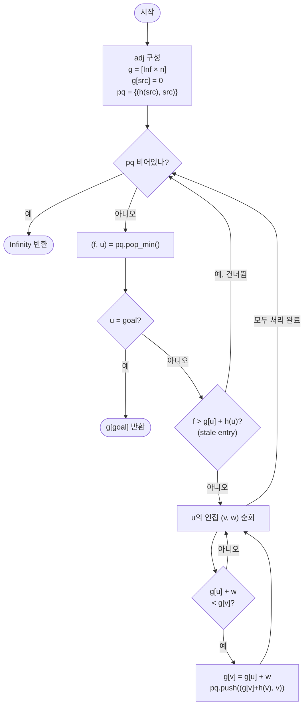

import { AlgorithmSimulation } from "#guide-sim";

# A* 탐색 해설

## 성능 목표 예측

| 항목 | 값 |
|------|-----|
| V (정점 수) | $1 \leq V \leq 10^5$ |
| E (간선 수) | $0 \leq E \leq 2 \times 10^5$ |
| 가중치 범위 | $0 \leq w(u, v) \leq 10^9$ |
| 휴리스틱 조건 | admissible: $h(v) \leq d(v, goal)$ |

### Naive 접근의 한계

목표 정점 $t$까지의 최단 경로만 필요하다면, Dijkstra로 모든 정점의 최단 거리를 계산하는 것은 불필요한 낭비다.

- Dijkstra: $O((V + E) \log V)$이지만, $t$와 전혀 관계없는 방향으로도 탐색을 확장한다
- 목표 정점 방향으로 탐색을 집중할 수 있다면 실제 확장 정점 수를 대폭 줄일 수 있다

그러나 "목표 방향으로 집중"하려면 방향 판단 기준이 필요하다. 이 기준이 바로 휴리스틱 $h(v)$이다.

### 목표 복잡도와 근거

**최악의 경우** ($h \equiv 0$): Dijkstra와 동일하게 동작하므로 $O((V + E) \log V)$.

**$h$가 좋을수록**: 실제 탐색 정점 수가 줄어들어 최악보다 훨씬 빠르게 동작한다. 완벽한 $h$ ($h(v) = d(v, goal)$)이면 최적 경로를 따라 직선으로 탐색한다.

**이론적 상한**: admissible $h$를 사용하면 $O((V + E) \log V)$ 이하이며, 목표에 도달하면 즉시 종료한다.

### 공간 복잡도

- 인접 리스트: $O(V + E)$
- $g$ 배열 (실제 거리): $O(V)$
- 힙: 최악의 경우 $O(E)$ 항목
- 전체: $O(V + E)$

## 목표 함수

```ts
function aStarSearch(
  n: number,
  edges: [number, number, number][],
  src: number,
  goal: number,
  h: (v: number) => number,
): number
```

| 파라미터 | 의미 | 제약 |
|---------|------|------|
| `n` | 정점의 개수 $V$ | $1 \leq n \leq 10^5$ |
| `edges` | 방향 간선 목록 `[u, v, w]` | $w \geq 0$ |
| `src` | 시작 정점 $s$ | $0 \leq src < n$ |
| `goal` | 목표 정점 $t$ | $0 \leq goal < n$ |
| `h` | 휴리스틱 함수 | admissible: $h(v) \leq d(v, goal)$ |

**반환값**: $s \to t$ 최단 경로 비용. 도달 불가능하면 `Infinity`.

**엣지케이스**:
1. `src === goal`: 즉시 0 반환 (목표가 시작점과 같음)
2. $h$가 admissible이 아니면: 최적성이 깨질 수 있음 (입력 조건에서 보장됨)
3. `goal`이 도달 불가능한 경우: 큐가 비었을 때 `Infinity` 반환
4. $h \equiv 0$: Dijkstra와 완전히 동일하게 동작하며, 모든 정점의 최단 거리를 탐색 후 `g[goal]` 반환

## 핵심 아이디어

**핵심 아이디어**: "목표까지 남은 거리를 미리 추정해서, 탐색 방향을 목표 쪽으로 집중한다."

Dijkstra는 출발점에서 현재까지의 실제 비용만 보고 탐색 순서를 정하기 때문에 목표와 반대 방향도 똑같이 확장한다. A*는 여기에 목표까지의 추정 비용 $h(v)$를 더한 $f(v) = g(v) + h(v)$를 우선순위로 삼아, 목표 방향으로 탐색을 유도한다. $h$가 실제 거리를 절대 과대 추정하지 않는다면(admissible) 목표를 처음 꺼내는 순간 최단 거리가 보장된다.

**풀이 구조**
1. 인접 리스트를 구성하고, $g[\text{src}] = 0$으로 초기화, min-heap에 $(h(\text{src}), \text{src})$ 삽입
2. 힙에서 $f$ 최소인 정점 $u$를 꺼냄. $u = \text{goal}$이면 $g[\text{goal}]$ 반환
3. stale 항목($f > g[u] + h(u)$)이면 건너뜀
4. $u$의 이웃 $v$마다 $g[u] + w < g[v]$이면 $g[v]$ 갱신 후 힙에 $(g[v] + h(v), v)$ 삽입
5. 힙이 빌 때까지 반복. 도달 불가면 Infinity 반환

**조건**: 휴리스틱 $h(v)$가 admissible이어야 함 ($h(v) \leq d(v, \text{goal})$). 음수 간선 없음.

**대표 예시**: 격자 지도에서 목적지까지의 최단 경로 탐색
격자 위의 현재 위치에서 목적지까지의 맨해튼 거리(또는 유클리드 거리)를 $h$로 사용한다. 이 추정값은 실제 거리를 넘지 않으므로 admissible하며, Dijkstra가 사방으로 퍼지는 것과 달리 A*는 목적지 방향의 정점을 우선 확장해 탐색 정점 수를 크게 줄인다.

**언제 쓰나**
단일 출발점에서 단일 목적지까지의 최단 경로가 필요하고, 목적지까지의 거리를 합리적으로 추정할 수 있는 경우(지도 탐색, 게임 경로 찾기 등)에 Dijkstra 대신 A*를 쓰면 탐색 범위를 크게 줄일 수 있다.

---

### 원형 아이디어와 naive 접근

$s$에서 $t$까지의 최단 경로를 찾는 가장 단순한 방법은 Dijkstra로 $s$에서 모든 정점까지의 최단 거리를 계산하고 `dist[goal]`을 반환하는 것이다.

```
// Dijkstra로 단일 출발 최단 거리 계산
dist = dijkstra(n, edges, src)
return dist[goal]
```

이 방법은 $t$와 전혀 무관한 반대 방향 정점들도 모두 확장한다. 예를 들어 그리드 맵에서 오른쪽에 있는 $t$를 찾는데, 왼쪽 절반을 모두 탐색하는 비효율이 발생한다.

Dijkstra가 탐색 방향을 정하는 기준은 `g(v)` (출발점에서 현재까지의 실제 비용)뿐이다. 목표 정점의 위치를 전혀 활용하지 않으므로 모든 방향으로 균등하게 퍼진다.

### 어떤 관찰이 돌파구가 되는가

- **관찰 1**: 탐색 순서를 결정할 때 "출발점에서 현재까지의 비용" $g(v)$만 보는 대신, "목표까지 남은 비용 추정" $h(v)$를 추가하면 목표 방향으로 탐색을 유도할 수 있다.

- **관찰 2**: $h(v)$가 실제 $d(v, goal)$보다 절대 크지 않으면 (admissible), 우선순위를 $f(v) = g(v) + h(v)$로 정했을 때 목표를 처음 확장하는 순간의 $g(goal)$이 진짜 최단 거리다.

- **관찰 3**: $h(v) = 0$ (아무 정보도 없음)으로 설정하면 $f(v) = g(v)$가 되어 Dijkstra와 완전히 동일해진다. $h$가 정보를 줄수록 A*는 Dijkstra를 능가한다. 즉, A*는 Dijkstra의 일반화다.

### 관찰을 형식화: 상태/구조 정의

**상태 정의**:
- $g(v)$: 현재까지 발견한 $s \to v$ 최단 경로 비용 (실제 비용)
- $h(v)$: $v$에서 $goal$까지의 추정 비용 (휴리스틱, 외부 제공)
- $f(v) = g(v) + h(v)$: $s$에서 $v$를 거쳐 $goal$까지 가는 경로의 추정 총 비용

min-heap에는 $(f(v), v)$ 쌍을 저장한다. $f$가 가장 작은 정점을 먼저 확장해 $goal$ 방향으로 탐색을 집중한다.

왜 $g$와 $h$를 분리해야 하는가: $g(v)$는 실제로 관찰된 값이고, $h(v)$는 추정값이다. 이 둘을 합산한 $f(v)$로 우선순위를 정하되, 완화(relaxation)에서는 $g(v)$ 값만 갱신한다. $h(v)$는 정점마다 고정된 추정값이므로, 완화 시 $h$를 다시 계산할 필요 없이 새 $g(v)$에 $h(v)$를 더해 힙에 삽입한다.

### 점화식 또는 핵심 연산

**완화 연산**: 정점 $u$를 힙에서 꺼낼 때, $u$의 모든 이웃 $v$에 대해

$$g(v) \leftarrow g(u) + w(u, v) \quad \text{if } g(u) + w(u, v) < g(v)$$

갱신이 발생하면 힙에 $(f(v), v) = (g(v) + h(v), v)$ 삽입.

**조기 종료 조건**: $goal$을 힙에서 꺼낸 순간 $g(goal)$이 확정이다. 이 시점에 반환한다.

**stale entry 처리**: 힙에서 꺼낸 $(f, u)$에 대해 $f > g(u) + h(u)$이면, 그 사이에 더 짧은 경로가 발견되어 $g(u)$가 줄어든 것이다. 이 낡은 항목은 건너뛴다.

### 정당성 — 왜 이것이 옳은가

**핵심 주장**: admissible $h$를 사용할 때, $goal$이 힙에서 처음 꺼내지는 순간 $g(goal)$은 진짜 최단 거리다.

**증명 스케치**: 최적 경로 $P^* = s \to \cdots \to x \to \cdots \to goal$ 위에 아직 확장되지 않은 정점 $x$가 있다고 하자. 그러면 힙에 $(f(x), x)$가 존재하며:

$$f(x) = g^*(x) + h(x) \leq g^*(x) + d(x, goal) = d(s, goal)$$

(admissible 조건 $h(x) \leq d(x, goal)$ 사용)

$goal$이 처음 꺼내질 때 $f(goal) \leq f(x) \leq d(s, goal)$. 동시에 $g(goal) \geq d(s, goal)$ (실제 경로 비용). 따라서 $g(goal) = d(s, goal)$.

**귀납적 정당성**: 힙에서 꺼낸 정점들의 $f$ 값은 단조 비감소(non-decreasing)이다. $goal$이 꺼내지기 전에 확장된 모든 정점 $u$는 $f(u) \leq f(goal)$을 만족하며, 이들은 최적 경로 탐색에 기여한다.

**까다로운 케이스**: $h$가 consistent(단조)하면 한 번 확장된 정점은 재확장이 불필요하다. 이를 활용해 closed set을 두고 이미 확장된 정점을 건너뛸 수 있다. consistent하지 않더라도 admissible하면 최적성은 보장된다.

### 구현 디테일과 최적화

**stale entry vs closed set**: consistent $h$를 사용하면 Dijkstra처럼 closed set(visited 배열)을 두어 이미 확장된 정점을 재확장하지 않을 수 있다. admissible하지만 consistent하지 않은 경우에는 재확장이 필요할 수 있다. 이 구현에서는 `f > g[u] + h(u)` 검사로 stale entry를 필터링하는 lazy deletion 방식을 쓴다.

**$h \equiv 0$ 특수 케이스**: $h(v) = 0$이면 $f(v) = g(v)$가 되어 Dijkstra와 완전히 동일한 순서로 동작한다. A*는 Dijkstra를 $h \equiv 0$으로 특수화한 것이므로, 같은 코드로 두 알고리즘을 통합할 수 있다.

**함정 — `g` vs `f` 기준 stale 검사**: 힙에서 꺼낸 `f` 값과 현재 `g[u] + h(u)` 값을 비교해야 한다. `f`만 저장하면 `h(u)`를 다시 계산해야 하므로, `h` 함수 호출 비용이 높은 경우 `g` 값을 별도로 추적해 `d > g[u]`로 비교하는 방식도 유효하다.

**함정 — admissible하지 않은 $h$**: $h$가 실제 거리를 과대 추정하면 최적 경로를 보장하지 않는다. 빠르게 도달은 하지만 최단이 아닐 수 있다. 이 문제에서는 admissible임이 보장된다.

## 시뮬레이션

예시 방향 그래프 `n = 5`, `edges = [[0,1,1], [0,2,4], [1,3,2], [1,2,1], [2,4,1], [3,4,3]]`, `src = 0`, `goal = 4`, 휴리스틱 `h = [2, 2, 1, 2, 0]` (admissible)에 대해 A*를 실행하는 과정이다. 노드 위 숫자는 현재 `g`(실제 비용, ∞는 미발견)이고, `priorityQueue` 패널은 우선순위 `f = g + h` 기준 힙이다. 빨간색은 막 꺼낸 정점(active), 노란색은 힙에 있는 정점(frontier), 회색은 확장 완료(visited)이다.

실제 반환값은 `3` (경로 `0 → 1 → 2 → 4`, 비용 1+1+1)이며, 시뮬레이션 마지막 프레임에서 goal을 꺼내는 순간의 `g[4]`와 일치한다.

> 대화형 시뮬레이션은 MDX 런타임에서 표시됩니다.

export const nodes = [
  { id: 0, label: "0", x: 12, y: 50 },
  { id: 1, label: "1", x: 38, y: 28 },
  { id: 2, label: "2", x: 38, y: 72 },
  { id: 3, label: "3", x: 64, y: 28 },
  { id: 4, label: "4", x: 88, y: 50 },
];

export const edges = [
  { from: 0, to: 1, weight: 1, directed: true },
  { from: 0, to: 2, weight: 4, directed: true },
  { from: 1, to: 3, weight: 2, directed: true },
  { from: 1, to: 2, weight: 1, directed: true },
  { from: 2, to: 4, weight: 1, directed: true },
  { from: 3, to: 4, weight: 3, directed: true },
];

export const steps = [
  {
    title: "초기화",
    detail: "g[0]=0, 나머지 ∞. 힙에 (f = h(0) = 2, 0) 삽입.",
    nodes, edges,
    nodeStatus: { 0: "frontier" },
    nodeValue: { 0: 0, 1: "∞", 2: "∞", 3: "∞", 4: "∞" },
    heap: [{ label: "0", key: 2 }],
  },
  {
    title: "0 확장 (f=2)",
    detail: "0→1: g[1]=1, f=1+2=3 삽입. 0→2: g[2]=4, f=4+1=5 삽입.",
    nodes, edges,
    nodeStatus: { 0: "active", 1: "frontier", 2: "frontier" },
    nodeValue: { 0: 0, 1: 1, 2: 4, 3: "∞", 4: "∞" },
    heap: [{ label: "1", key: 3 }, { label: "2", key: 5 }],
  },
  {
    title: "1 확장 (f=3)",
    detail: "1→2: g[2] 4→2, f=2+1=3 삽입. 1→3: g[3]=3, f=3+2=5 삽입. (목표 방향 우선)",
    nodes, edges,
    nodeStatus: { 0: "visited", 1: "active", 2: "frontier", 3: "frontier" },
    nodeValue: { 0: 0, 1: 1, 2: 2, 3: 3, 4: "∞" },
    activeEdge: { from: 1, to: 2 },
    heap: [{ label: "2", key: 3 }, { label: "3", key: 5 }, { label: "2", key: 5 }],
  },
  {
    title: "2 확장 (f=3)",
    detail: "f가 가장 작은 2를 꺼냄. 2→4: g[4]=3, f=3+0=3 삽입.",
    nodes, edges,
    nodeStatus: { 0: "visited", 1: "visited", 2: "active", 3: "frontier", 4: "frontier" },
    nodeValue: { 0: 0, 1: 1, 2: 2, 3: 3, 4: 3 },
    activeEdge: { from: 2, to: 4 },
    heap: [{ label: "4", key: 3 }, { label: "3", key: 5 }, { label: "2", key: 5 }],
  },
  {
    title: "goal(4) 꺼냄 → 종료",
    detail: "f=3으로 goal 4를 처음 꺼냈다. g[4]=3이 최단 거리로 확정. 3은 확장하지 않고 종료.",
    nodes, edges,
    nodeStatus: { 0: "visited", 1: "visited", 2: "visited", 4: "active" },
    nodeValue: { 0: 0, 1: 1, 2: 2, 3: 3, 4: 3 },
    heap: [{ label: "3", key: 5 }, { label: "2", key: 5 }],
  },
  {
    title: "완료: 반환 3",
    detail: "admissible h 덕분에 goal을 처음 꺼낸 순간이 최단. 정점 3은 끝내 확장되지 않았다.",
    nodes, edges,
    nodeStatus: { 0: "visited", 1: "visited", 2: "visited", 4: "visited" },
    nodeValue: { 0: 0, 1: 1, 2: 2, 3: 3, 4: 3 },
    heap: [],
  },
];

<AlgorithmSimulation view={["graph", "priorityQueue"]} steps={steps} title="A* 탐색 (f = g + h)" />

## 수도 코드와 Activity Diagram

### 의사코드

```
function aStarSearch(n, edges, src, goal, h):
  // 인접 리스트 구성
  adj ← array of empty lists, size n
  for (u, v, w) in edges:
    adj[u].append((v, w))

  // 초기화
  g ← [Infinity] * n             // 불변식: g[v]는 현재까지 발견한 s→v 최선값
  g[src] ← 0
  pq ← MinHeap()                 // (f = g + h, vertex) 쌍 저장
  pq.push((h(src), src))

  // 주 루프
  while pq is not empty:
    (f, u) ← pq.pop_min()

    if u = goal:
      return g[goal]             // 불변식: goal 첫 확장 시 g[goal]은 최단 거리

    if f > g[u] + h(u):          // stale entry: 이미 더 짧은 경로로 갱신됨
      continue

    // 불변식: g[u]는 현재까지 발견한 s→u 최선값 (확장 전 최솟값)
    for (v, w) in adj[u]:
      newG ← g[u] + w
      if newG < g[v]:
        g[v] ← newG              // 불변식 유지: g[v] 단조 감소
        pq.push((g[v] + h(v), v)) // f(v) = g(v) + h(v)

  return Infinity                // goal 도달 불가
```

**핵심 불변식**: admissible $h$ 하에서 $goal$이 힙에서 처음 꺼내지는 순간, $g[goal]$은 $s \to goal$ 진짜 최단 거리다.

### Activity Diagram



**핵심 불변식**: $f(v) = g(v) + h(v)$가 항상 삽입 시점의 추정 총 비용을 반영하며, admissible $h$ 조건이 최적성을 보장한다.
