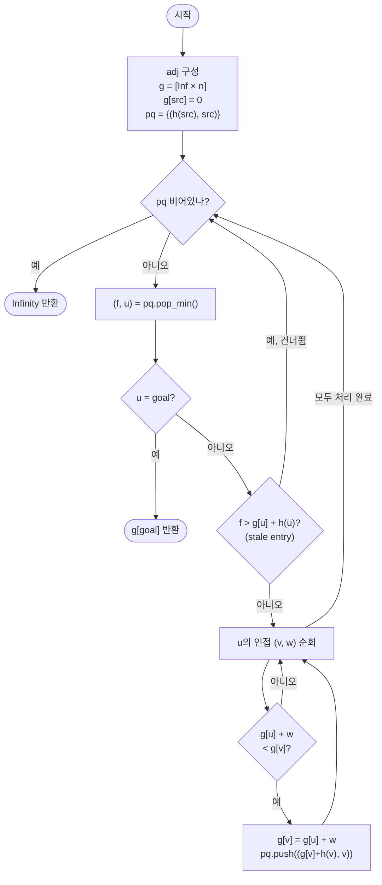

import { AlgorithmSimulation } from "#guide-sim";

# A* 탐색 — 목표까지 남은 거리를 더해 탐색을 그 방향으로 접는 이유

## 한눈에 보는 컨셉

단일 출발점에서 단일 목표점까지의 최단 경로만 필요하다면, 목표와 무관한 방향까지 균등하게 뒤지는 것은 낭비예요. A*는 "지금까지 온 거리 $g(v)$"에 "여기서 목표까지 남았을 것 같은 거리 $h(v)$"를 더한 $f(v) = g(v) + h(v)$를 우선순위로 삼아, 탐색을 목표 방향으로 유도합니다. $h$가 실제 거리를 절대 넘지 않는(admissible) 한, 목표를 처음 꺼내는 순간이 곧 최단 거리이고, 최악의 경우에도 `O((V+E) log V)`를 넘지 않습니다.

## 출발점: 가장 순진한 방법부터

먼저 무엇을 만들어야 하는지 정확히 잡을게요.

```ts
function aStarSearch(
  n: number,
  edges: [number, number, number][],
  src: number,
  goal: number,
  h: (v: number) => number,
): number
```

| 항목 | 의미 | 제약 |
|------|------|------|
| `n` | 정점 수 $V$ | $1 \leq n \leq 10^5$ |
| `edges` | 방향 간선 `[u, v, w]` | $0 \leq E \leq 2 \times 10^5$, $0 \leq w \leq 10^9$ |
| `src`, `goal` | 시작·목표 정점 | $0 \leq \text{src}, \text{goal} < n$ |
| `h` | 휴리스틱 함수 | admissible: $h(v) \leq d(v, \text{goal})$ |
| 반환값 | $\text{src} \to \text{goal}$ 최단 경로 비용 | 도달 불가능하면 `Infinity` |

시간 제한 1초에 $V \leq 10^5$, $E \leq 2 \times 10^5$까지 들어오니, 목표 복잡도는 로그 계수가 붙은 `O((V+E) log V)` 근방이어야 여유 있게 통과합니다.

**naive 아이디어는 어디서 나올까요?** "$\text{src}$에서 $\text{goal}$까지"라는 말을 지우고 보면, 이 문제는 결국 단일 출발점 최단 경로 문제와 똑같이 생겼어요. 그러니 가장 정직한 출발은 Dijkstra로 $\text{src}$에서 모든 정점까지의 거리를 구한 뒤, `dist[goal]`만 꺼내 쓰는 것입니다.

```ts
class MinHeap<T> {
  private items: { key: number; value: T }[] = [];

  get size(): number {
    return this.items.length;
  }

  push(key: number, value: T): void {
    this.items.push({ key, value });
    let i = this.items.length - 1;
    while (i > 0) {
      const parent = (i - 1) >> 1;
      if (this.items[parent]!.key <= this.items[i]!.key) break;
      [this.items[parent]!, this.items[i]!] = [this.items[i]!, this.items[parent]!];
      i = parent;
    }
  }

  pop(): { key: number; value: T } | undefined {
    if (this.items.length === 0) return undefined;
    const top = this.items[0]!;
    const last = this.items.pop()!;
    if (this.items.length > 0) {
      this.items[0] = last;
      let i = 0;
      const n = this.items.length;
      while (true) {
        const l = 2 * i + 1;
        const r = 2 * i + 2;
        let smallest = i;
        if (l < n && this.items[l]!.key < this.items[smallest]!.key) smallest = l;
        if (r < n && this.items[r]!.key < this.items[smallest]!.key) smallest = r;
        if (smallest === i) break;
        [this.items[smallest]!, this.items[i]!] = [this.items[i]!, this.items[smallest]!];
        i = smallest;
      }
    }
    return top;
  }
}

function shortestPathAll(
  n: number,
  edges: [number, number, number][],
  src: number,
): number[] {
  const adj: [number, number][][] = Array.from({ length: n }, () => []);
  for (const [u, v, w] of edges) adj[u]!.push([v, w]);

  const dist = new Array(n).fill(Infinity);
  dist[src] = 0;
  const heap = new MinHeap<number>();
  heap.push(0, src);

  while (heap.size > 0) {
    const { key: d, value: u } = heap.pop()!;
    if (d > dist[u]!) continue; // stale entry
    for (const [v, w] of adj[u]!) {
      const nd = d + w;
      if (nd < dist[v]!) {
        dist[v] = nd;
        heap.push(nd, v);
      }
    }
  }
  return dist;
}

function aStarNaive(
  n: number,
  edges: [number, number, number][],
  src: number,
  goal: number,
): number {
  return shortestPathAll(n, edges, src)[goal]!;
}
```

이 코드는 정확하고, 힙을 쓰므로 이미 `O((V+E) log V)`예요. 그런데도 낭비가 있습니다 — **목표의 위치를 전혀 모른 채로 사방을 뒤진다**는 점이요. 작은 그래프로 직접 확인해 봅시다.

```text
0(src) --5--> 1(goal)
0 --1--> 2 --1--> 3 --1--> 4 --1--> 5   (goal과 이어지지 않는 막다른 사슬)

Dijkstra pop 순서:  0, 2, 3, 4, 5, 1     ← goal(1)이 "제일 마지막"
                    ─┬──────────┘
              막다른 사슬 4개(2,3,4,5)를 전부 확정한 뒤에야 목표를 본다

이유: dist[2]=1, dist[3]=2, dist[4]=3, dist[5]=4 가 전부 dist[1]=5보다 작아서
      힙이 그것들을 먼저 꺼낸다 — 목표와 반대 방향인데도 "숫자가 작다"는 이유만으로.
```

(실측: 위 그래프에 `shortestPathAll`을 그대로 돌리면 pop 순서가 정확히 `[0, 2, 3, 4, 5, 1]`, `dist[1] = 5`로 나옵니다.)

Dijkstra가 순서를 정하는 기준은 `dist[v]`(지금까지 온 거리) 하나뿐이라, 목표와 얼마나 가까운지는 전혀 반영하지 않아요. **"목표 방향인지 아닌지"를 판단할 기준을 하나 더 섞을 수 있다면, 막다른 사슬을 아예 건드리지 않을 수 있지 않을까?** 이것이 다음 절의 출발 단서입니다.

## 아이디어 자세히 들여다보기

### 목표까지 남은 거리를 더해 우선순위를 다시 매기기 — 수식과 그림

핵심 관찰은 이거예요. 정점 $v$를 "얼마나 먼저 볼지" 정할 때, 지금까지 온 거리 $g(v)$만 보지 말고, **거기서 목표까지 남았을 것 같은 거리** $h(v)$까지 더해서 보자는 겁니다.

$$f(v) = g(v) + h(v)$$

```text
f(v) =        g(v)          +           h(v)
        "여기까지 실제로 온 거리"      "여기서 목표까지 남을 것 같은 거리"
           (확정/추정 중, 관측값)            (외부에서 주어지는 추정값)

f가 작다  =  "지금까지도 짧고, 앞으로도 짧을 것 같다"  →  먼저 꺼낸다
```

왜 $g$와 $h$를 따로 두고 더하기만 할까요? $g$는 매 간선 완화(relaxation)마다 값이 바뀌는 반면, $h(v)$는 $v$가 정해지면 끝까지 고정인 추정값이라서예요. 둘을 미리 하나의 상수로 합쳐 버리면 $g$가 갱신될 때마다 다시 계산해야 하지만, 분리해 두면 "새 $g(v)$에 고정된 $h(v)$를 더하기"만 하면 됩니다.

앞서 본 사슬 그래프로 직접 채워 봅시다. $h(1)=0$(목표 자신), 사슬 정점들은 목표와 이어지지 않으니(실제 거리가 무한대) 어떤 유한한 값을 줘도 admissible이에요. 여기서는 "목표에서 멀리 떨어진 방향"이라는 뜻으로 크게 $h=1000$을 줬다고 해봅시다.

| $v$ | $g(v)$ (src에서) | $h(v)$ | $f(v) = g+h$ |
|---|---|---|---|
| 0 (src) | 0 | 0 | 0 |
| 1 (goal, 직행) | 5 | 0 | 5 |
| 2 | 1 | 1000 | 1001 |
| 3 | 2 | 1000 | 1002 |

$f(1) = 5$가 $f(2) = 1001$보다 훨씬 작으니, 힙은 사슬 쪽을 단 한 번도 열어 보지 않고 목표부터 꺼냅니다. (실측: 이 그래프에 뒤에서 만들 `aStarSearch`를 돌리면 pop 순서가 `[0, 1]` 단 두 정점뿐입니다 — naive의 6정점 대비 확연한 차이예요.)

잠깐 확인 하나만 해 볼까요? $h(v) \equiv 0$으로 두면 $f(v) = g(v) + 0 = g(v)$가 되는데, 이건 어떤 알고리즘과 똑같아지나요? — 맞습니다, 바로 방금 본 naive Dijkstra예요. **A*는 Dijkstra에 "목표 방향 힌트" $h$를 얹은 일반화**입니다.

### 단서를 설명해 주는 이론 — Dijkstra의 그리디 확정 불변식

방금 "A*는 Dijkstra의 일반화"라고 했으니, 그 원천이 되는 Dijkstra의 핵심 원리를 정식으로 짚고 갈게요. 이 원리를 그대로 물려받는 것이 A* 정당성의 뼈대이기 때문입니다.

Dijkstra는 "아직 확정되지 않은 정점 중 `dist`가 최소인 정점은, 그 값 그대로 확정해도 안전하다"는 그리디 원리 위에서 동작해요. 이유를 부등식으로 보면:

미확정 정점 중 `dist[u]`가 최소라고 하자. 다른 미확정 정점 $x$를 거쳐 $u$로 가는 경로의 비용은

$$d(s, x) + w(x, \ldots, u) \;\geq\; \text{dist}[x] + 0 \;\geq\; \text{dist}[u]$$

(모든 간선 가중치가 0 이상이므로 경유는 절대 비용을 깎지 못합니다.) 즉 $u$를 우회하는 어떤 경로도 `dist[u]`보다 짧을 수 없으니, **`dist[u]`는 그 순간 확정**입니다. 힙에서 최솟값을 꺼내는 매 순간 이 논증이 반복되고, 그래서 Dijkstra가 최단 거리를 만들어 냅니다.

A*는 이 그리디 확정 원리를 정확히 그대로 씁니다. 다만 "미확정 정점 중 최솟값"을 고를 때 `dist[u]` = $g(u)$ 대신 $f(u) = g(u) + h(u)$를 기준으로 고른다는 점만 다릅니다. $h \equiv 0$이면 두 알고리즘은 완전히 같은 코드로 동작해요 — 뒤에서 이 사실을 코드 재사용에도 그대로 씁니다. 이 "그리디 확정 + $f$로 순서를 바꾼다"는 관계를 기억해 두세요, 바로 다음다음 절의 정당성 증명이 여기서 시작합니다.

### 셈을 맡는 자료구조 — 최소 힙

우선순위 $f(v)$가 가장 작은 정점을 매번 빠르게 꺼내야 하니, "넣고 빼기를 반복하면서 항상 최솟값만 즉시 꺼내는" 자료구조가 필요해요. 위에서 이미 `MinHeap<T>` 클래스로 직접 구현했습니다 — 이 구조 자체가 궁금하다면 이 프로젝트의 [minHeap 가이드](../../../data-structures/heap/minHeap/minHeap-guide.mdx)를 참고하세요. 여기서는 "삽입·추출이 각각 $O(\log n)$인 최솟값 우선 자료구조"로만 쓰면 충분합니다.

### 왜 모순 없이 작동하는가

이 알고리즘이 지키는 약속(핵심 불변식)은 하나입니다.

> admissible한 $h$를 쓸 때, $\text{goal}$이 힙에서 **처음** 꺼내지는 순간 $g(\text{goal})$은 진짜 최단 거리 $d(s, \text{goal})$이다.

**기저**: $\text{src} = \text{goal}$이면 초기 push가 $(h(\text{src}), \text{src})$ 하나뿐이고 이것이 곧바로 첫 pop이니, $g(\text{src}) = 0 = d(s,s)$로 자명하게 성립합니다.

**귀납 단계**: 최적 경로 $P^* = s \to \cdots \to x \to \cdots \to \text{goal}$ 위에, 아직 확장되지 않은 정점 $x$가 있다고 합시다. $x$가 아직 확장 안 됐다는 것은 힙 어딘가에 $x$를 향하는 항목이 남아 있다는 뜻이고(경로 $P^*$를 따라오다 보면 반드시 $x$가 한 번은 push됩니다), 그 항목의 최솟값은 최소

$$f(x) \leq g^*(x) + h(x) \leq g^*(x) + d(x, \text{goal}) = d(s, \text{goal})$$

여기서 $h(x) \leq d(x, \text{goal})$은 admissible 조건을 그대로 쓴 것입니다. $\text{goal}$이 처음 꺼내질 때 힙의 최솟값이었으니 $f(\text{goal}) \leq f(x) \leq d(s, \text{goal})$이고, 동시에 $g(\text{goal})$은 실제로 관측된 경로 비용이므로 $g(\text{goal}) \geq d(s, \text{goal})$입니다. 두 부등식을 합치면 $g(\text{goal}) = d(s, \text{goal})$ — 경우의 수는 "$P^*$ 위 모든 정점이 이미 확장됐다(그러면 $\text{goal}$도 이미 확장됐어야 함, 모순은 없고 그대로 성립)" 아니면 "아직 확장 안 된 정점 $x$가 있다(위 부등식)" 둘뿐이고, 두 경우 모두 결론이 성립하므로 증명이 끝납니다.

여기서 **헷갈리기 쉬운 포인트**는 "$h$가 그냥 대충 그럴듯한 추정값이면 되는 거 아닌가?"라는 생각입니다. 위 증명에서 $f(x) \leq d(s,\text{goal})$이 성립하는 유일한 근거가 $h(x) \leq d(x,\text{goal})$인데, 이 부등식이 깨지면 증명 전체가 무너집니다 — "대충 비슷하면 된다"가 아니라 **넘으면 안 되는 절대 상한**이라는 뜻이에요. 직접 반례로 확인해 봅시다.

```text
그래프:  0 --10--> 3(goal)          (직행, 비용 10)
         0 --1--> 2 --1--> 3        (진짜 최단, 비용 2)

admissible h ≡ 0 사용:        반환값 2   ✓ (실측 그대로)
h(2) = 100 로 과대 추정(위반): 반환값 10  ✗ (실측 그대로, 정답 2를 못 찾음)

위반 시 무슨 일이 생기나:
  f(3, 직행) = 10 + h(goal)=0     = 10
  f(2)       = 1  + h(2)=100      = 101   ← 진짜 최단 경로 방향인데 순위가 밀려난다
  → goal(직행, f=10)이 2(f=101)보다 먼저 꺼내져 곧장 반환 10, 진짜 최단 2는 영영 못 봄
```

`h(2) = 100`은 실제 거리 $d(2, \text{goal}) = 1$을 훌쩍 넘는 과대 추정입니다. 그 순간 "$x=2$가 아직 확장 안 됐어도 $f(2) \leq d(s,\text{goal})$"라는 증명의 핵심 부등식이 깨지고, goal이 먼저 뽑혀 버리는 사고가 납니다.

엣지 케이스도 확인해 두면:

```text
src === goal            → 초기 push가 곧 첫 pop이므로 별도 분기 없이 g=0 반환
간선이 아예 없음 (E=0)   → 힙이 곧 비고 goal 도달 불가 → Infinity
같은 정점쌍 다중 간선     → 각각 별도로 relax되어 자동으로 가장 짧은 것이 채택됨
h ≡ 0                   → Dijkstra와 완전히 동일한 pop 순서로 동작
```

## 아이디어를 코드로 옮기기

```ts
function aStarSearchBasic(
  n: number,
  edges: [number, number, number][],
  src: number,
  goal: number,
  h: (v: number) => number,
): number {
  const adj: [number, number][][] = Array.from({ length: n }, () => []);
  for (const [u, v, w] of edges) adj[u]!.push([v, w]);

  const g = new Array(n).fill(Infinity);
  g[src] = 0;

  const heap = new MinHeap<number>();
  heap.push(h(src), src); // f(src) = g(src) + h(src) = 0 + h(src)

  while (heap.size > 0) {
    const { key: f, value: u } = heap.pop()!;

    if (u === goal) return g[u]!; // 처음 꺼내는 순간이 곧 최단 거리

    if (f > g[u]! + h(u)) continue; // stale entry: h(u)를 다시 계산해 비교

    for (const [v, w] of adj[u]!) {
      const newG = g[u]! + w;
      if (newG < g[v]!) {
        g[v] = newG;
        heap.push(newG + h(v), v);
      }
    }
  }

  return Infinity; // 힙이 비도록 goal에 못 닿음
}
```

**가장 실수가 잦은 부분은 `if (u === goal) return g[u]!;`을 stale 검사보다 먼저 두는 순서입니다.** stale 검사를 먼저 하면, goal이 stale로 판정돼 건너뛰어질 수 있고(사실 goal도 여러 번 push될 수 있으니까요), 그러면 goal을 놓치고 계속 도는 대신 다음번 더 못한 항목을 잘못 반환하게 됩니다. 그 외에 눈여겨볼 지점:

- 초기 push는 `(h(src), src)`입니다 — $g(\text{src})=0$이니 $f(\text{src}) = 0 + h(\text{src})$가 됩니다. `push(0, src)`로 잘못 넣으면 $h$를 무시한 순서가 되어 목표 방향 유도가 사라집니다.
- `f > g[u]! + h(u)` 비교에서 `g[u]`는 **지금 시점**의 값입니다. 이 항목이 push된 뒤에 더 짧은 경로가 발견돼 `g[u]`가 줄었다면 `f`(push 당시 값)가 더 커서 걸러집니다.

## 더 빠르게 만들 단서 찾기

위 코드를 자세히 보면, $h(u)$가 두 번 계산되는 자리가 있습니다 — 한 번은 push할 때(`newG + h(v)`로 키를 만들 때), 한 번은 그 항목을 pop할 때(`g[u]! + h(u)`로 stale 여부를 검사할 때). $h$는 정점 번호만 보는 순수 함수라서, 같은 정점에 대해 두 번 계산해도 값은 똑같습니다 — **완전히 같은 계산을 두 번 하는 셈**이에요.

작은 그래프로 실제 호출 횟수를 세어 봤습니다.

```text
그래프:  0 --5--> 1
         0 --1--> 2 --1--> 1   (1을 더 싸게 갱신)
         1 --100--> 3(goal)

기본 구현 h() 호출 횟수:  9회   (push 5회 + pop-stale 검사 4회)
                                            ─┬─
                                 이 중 1은 push 시점에 이미 계산했던 값의 재계산
```

(실측: 위 그래프에 `h`를 호출 카운터로 감싸 `aStarSearchBasic`을 돌리면 정확히 9번 호출됩니다.) $h$가 실제로는 좌표 간 유클리드 거리 계산처럼 비용이 있는 함수라면, 이 재계산은 그대로 낭비되는 시간입니다. **pop 시점에 굳이 $h(u)$를 다시 부르지 않고, push했을 때 이미 알고 있던 정보만으로 stale 여부를 판단할 수 없을까?**

## 단서를 최적화로 연결하기

pop 시점에 필요한 건 사실 "이 항목이 push된 뒤로 $g[u]$가 더 줄었는가"뿐입니다. 그렇다면 **push할 때의 $g$ 값을 항목에 같이 실어 두면**, pop할 때는 그 값과 지금 $g[u]$를 비교하기만 하면 돼요 — $h$를 다시 부를 필요가 없습니다.

```text
Before: 힙 항목 = (f,        u)         →  pop 시점에 g[u]+h(u) 재계산해서 f와 비교
After:  힙 항목 = (f, {g_당시, u})       →  pop 시점에 g_당시 와 g[u] 를 O(1) 비교

불변식: g_당시 는 "이 항목이 push되던 순간의 g[u] 값"으로 고정된다.
        만약 g[u]가 그 뒤로 더 줄었다면 g_당시 > g[u] → stale.
        줄지 않았다면 g_당시 === g[u] → 아직 유효.
```

정렬 우선순위 자체는 여전히 $f = g+h$를 써야 하니(그래야 목표 방향 유도가 유지됩니다), **정렬 키는 그대로 두고 payload에만 $g$ 당시 값을 추가로 실어 두는 것**이 핵심입니다.

## 최적화 코드

바뀌는 곳은 힙에 담는 값의 타입과, stale 검사 한 줄뿐입니다.

```ts
function aStarSearch(
  n: number,
  edges: [number, number, number][],
  src: number,
  goal: number,
  h: (v: number) => number,
): number {
  const adj: [number, number][][] = Array.from({ length: n }, () => []);
  for (const [u, v, w] of edges) adj[u]!.push([v, w]);

  const g = new Array(n).fill(Infinity);
  g[src] = 0;

  const heap = new MinHeap<{ g: number; u: number }>();
  heap.push(h(src), { g: 0, u: src });

  while (heap.size > 0) {
    const { value: entry } = heap.pop()!;
    const { g: gAtPush, u } = entry;

    if (u === goal) return g[u]!;

    if (gAtPush > g[u]!) continue; // O(1) 비교, h(u) 재호출 없음

    for (const [v, w] of adj[u]!) {
      const newG = g[u]! + w;
      if (newG < g[v]!) {
        g[v] = newG;
        heap.push(newG + h(v), { g: newG, u: v });
      }
    }
  }

  return Infinity;
}
```

**가장 중요한 줄은 `if (gAtPush > g[u]!) continue;`입니다.** 기본 구현의 `f > g[u]! + h(u)`를 대체하면서 $h$ 호출을 완전히 제거했어요. 같은 검증 그래프에 이 버전을 돌리면 $h$ 호출이 9회에서 **5회**로 줄어듭니다(딱 push한 횟수만큼만 — 더는 줄지 않습니다, push마다 한 번은 반드시 필요하니까요). 순서를 바꿔 `g[u]! > gAtPush`로 뒤집으면 부등호가 반대라 stale 항목을 오히려 유효하다고 통과시키는 조용한 버그가 됩니다 — 실행은 되지만 이미 낡은 경로로 불필요한 재확장을 계속하게 돼요.

> $g$는 관측값이니 다시 잴 필요가 없고, $h$는 계산값이니 다시 부를 필요가 없다 — push 시점에 이미 아는 것은 pop 시점에 다시 묻지 않는다.

여기서 점근 복잡도 자체는 바뀌지 않습니다 — 힙에 쌓이는 항목 수는 두 버전 모두 최악 $O(E)$개로 같고, `O((V+E) log V)`라는 상한도 그대로예요. 이 최적화는 **상수항**을 줄이는 것이고, $h$ 호출 비용이 클수록(좌표 계산, 캐시 미스가 있는 조회 등) 효과가 커집니다. $h$가 배열 조회 하나 정도로 저렴하다면 체감 차이는 작을 수 있습니다.

더 밀어붙일 여지가 있을까요? $h$가 consistent(단조, $h(u) \leq w(u,v) + h(v)$)하기까지 하다면 한 번 확정된 정점을 아예 재확장하지 않는 closed set을 둘 수 있어, pop 자체의 횟수를 줄일 여지가 있습니다. 다만 이 문제는 admissible만 보장하고 consistent는 보장하지 않으므로, closed set을 섣불리 추가하면(재확장을 아예 막아 버리면) 최적성이 깨질 위험이 있어 이 가이드에서는 다루지 않습니다. 그리드 맵처럼 특수한 구조에는 Jump Point Search 같은 더 빠른 특화 해법도 있지만, A*의 가치는 **admissible한 $h$ 하나만 있으면 그래프 구조에 상관없이 그대로 적용된다는 범용성**에 있습니다.

## 실행 시각화

예시 방향 그래프 `n = 5`, `edges = [[0,1,1], [0,2,4], [1,3,2], [1,2,1], [2,4,1], [3,4,3]]`, `src = 0`, `goal = 4`, 휴리스틱 `h = [2, 2, 1, 2, 0]` (admissible)에 대해 A*를 실행하는 과정입니다. 노드 위 숫자는 현재 `g`(실제 비용, ∞는 미발견)이고, `priorityQueue` 패널은 우선순위 `f = g + h` 기준 힙입니다. 빨간색은 막 꺼낸 정점(active), 노란색은 힙에 있는 정점(frontier), 회색은 확장 완료(visited)입니다.

실제 반환값은 `3`(경로 `0 → 1 → 2 → 4`, 비용 1+1+1)이며, 위 최적화 코드를 그대로 이 입력에 돌려 pop 순서 `[0(f=2), 1(f=3), 2(f=3), 4(f=3)]`와 최종 `g = [0,1,2,3,3]`을 실측으로 확인했고, 시뮬레이션 마지막 프레임에서 goal을 꺼내는 순간의 `g[4]`와 정확히 일치합니다.

> 대화형 시뮬레이션은 MDX 런타임에서 표시됩니다.

export const nodes = [
  { id: 0, label: "0", x: 12, y: 50 },
  { id: 1, label: "1", x: 38, y: 28 },
  { id: 2, label: "2", x: 38, y: 72 },
  { id: 3, label: "3", x: 64, y: 28 },
  { id: 4, label: "4", x: 88, y: 50 },
];

export const edges = [
  { from: 0, to: 1, weight: 1, directed: true },
  { from: 0, to: 2, weight: 4, directed: true },
  { from: 1, to: 3, weight: 2, directed: true },
  { from: 1, to: 2, weight: 1, directed: true },
  { from: 2, to: 4, weight: 1, directed: true },
  { from: 3, to: 4, weight: 3, directed: true },
];

export const steps = [
  {
    title: "초기화",
    detail: "g[0]=0, 나머지 ∞. 힙에 (f = h(0) = 2, 0) 삽입.",
    nodes, edges,
    nodeStatus: { 0: "frontier" },
    nodeValue: { 0: 0, 1: "∞", 2: "∞", 3: "∞", 4: "∞" },
    heap: [{ label: "0", key: 2 }],
  },
  {
    title: "0 확장 (f=2)",
    detail: "0→1: g[1]=1, f=1+2=3 삽입. 0→2: g[2]=4, f=4+1=5 삽입.",
    nodes, edges,
    nodeStatus: { 0: "active", 1: "frontier", 2: "frontier" },
    nodeValue: { 0: 0, 1: 1, 2: 4, 3: "∞", 4: "∞" },
    heap: [{ label: "1", key: 3 }, { label: "2", key: 5 }],
  },
  {
    title: "1 확장 (f=3)",
    detail: "1→2: g[2] 4→2, f=2+1=3 삽입. 1→3: g[3]=3, f=3+2=5 삽입. (목표 방향 우선)",
    nodes, edges,
    nodeStatus: { 0: "visited", 1: "active", 2: "frontier", 3: "frontier" },
    nodeValue: { 0: 0, 1: 1, 2: 2, 3: 3, 4: "∞" },
    activeEdge: { from: 1, to: 2 },
    heap: [{ label: "2", key: 3 }, { label: "3", key: 5 }, { label: "2", key: 5 }],
  },
  {
    title: "2 확장 (f=3)",
    detail: "f가 가장 작은 2를 꺼냄. 2→4: g[4]=3, f=3+0=3 삽입.",
    nodes, edges,
    nodeStatus: { 0: "visited", 1: "visited", 2: "active", 3: "frontier", 4: "frontier" },
    nodeValue: { 0: 0, 1: 1, 2: 2, 3: 3, 4: 3 },
    activeEdge: { from: 2, to: 4 },
    heap: [{ label: "4", key: 3 }, { label: "3", key: 5 }, { label: "2", key: 5 }],
  },
  {
    title: "goal(4) 꺼냄 → 종료",
    detail: "f=3으로 goal 4를 처음 꺼냈다. g[4]=3이 최단 거리로 확정. 3은 확장하지 않고 종료.",
    nodes, edges,
    nodeStatus: { 0: "visited", 1: "visited", 2: "visited", 4: "active" },
    nodeValue: { 0: 0, 1: 1, 2: 2, 3: 3, 4: 3 },
    heap: [{ label: "3", key: 5 }, { label: "2", key: 5 }],
  },
  {
    title: "완료: 반환 3",
    detail: "admissible h 덕분에 goal을 처음 꺼낸 순간이 최단. 정점 3은 끝내 확장되지 않았다.",
    nodes, edges,
    nodeStatus: { 0: "visited", 1: "visited", 2: "visited", 4: "visited" },
    nodeValue: { 0: 0, 1: 1, 2: 2, 3: 3, 4: 3 },
    heap: [],
  },
];

<AlgorithmSimulation view={["graph", "priorityQueue"]} steps={steps} title="A* 탐색 (f = g + h)" />

## 흐름 한눈에 보기


```mermaid
flowchart TD
    A([시작]) --> B["adj 구성\ng = [Inf × n]\ng[src] = 0\npq = {(h(src), src)}"]
    B --> C{pq 비어있나?}
    C -- 예 --> Z1([Infinity 반환])
    C -- 아니오 --> D["(f, u) = pq.pop_min()"]
    D --> E{u = goal?}
    E -- 예 --> Z2(["g[goal] 반환"])
    E -- 아니오 --> F{"f > g[u] + h(u)?\n(stale entry)"}
    F -- 예, 건너뜀 --> C
    F -- 아니오 --> G["u의 인접 (v, w) 순회"]
    G --> H{"g[u] + w\n< g[v]?"}
    H -- 아니오 --> G
    H -- 예 --> I["g[v] = g[u] + w\npq.push((g[v]+h(v), v))"]
    I --> G
    G -- 모두 처리 완료 --> C
```

## 스스로 점검하기

1. `n=4`, `edges = [[0,1,5],[0,2,1],[2,1,1],[1,3,100]]`, `src=0`, `goal=3`, `h ≡ 0`일 때, 최적화 코드 기준으로 힙에서 정점이 pop되는 순서를 손으로 따라가 보세요. (힌트: `g[1]`이 두 번 갱신됩니다 — 처음 `0→1`로 5, 그다음 `0→2→1`로 2. `1`을 향한 힙 항목이 두 개 생기고, `g_당시=5`짜리가 나중에 stale로 걸러집니다. 최종 pop 순서는 `0, 2, 1, 1(stale), 3` 이고 반환값은 `102`예요.)
2. "왜 모순 없이 작동하는가" 절의 반례를 변형해 봅시다. `edges = [[0,1,3],[0,2,1],[2,1,1]]`, `goal=1`에서 admissible한 `h ≡ 0`을 쓰면 정답이 얼마인지, 그리고 `h(2) = 50`으로 과대 추정하면 어떤 잘못된 값이 나오는지 각각 계산해 보세요. 어느 부등식이 정확히 깨지는지도 짚어 보세요.
3. 만약 목표가 하나가 아니라 "후보 목표 집합 `goals` 중 아무 곳이나 먼저 도달하면 되는" 문제로 바뀐다면, `h(v)`를 어떻게 재정의해야 여전히 admissible을 유지하면서 다중 목표를 지원할 수 있을까요? (힌트: 각 후보까지의 추정값 중 무엇을 취해야 "절대 넘지 않는다"는 성질이 유지될까요?)
