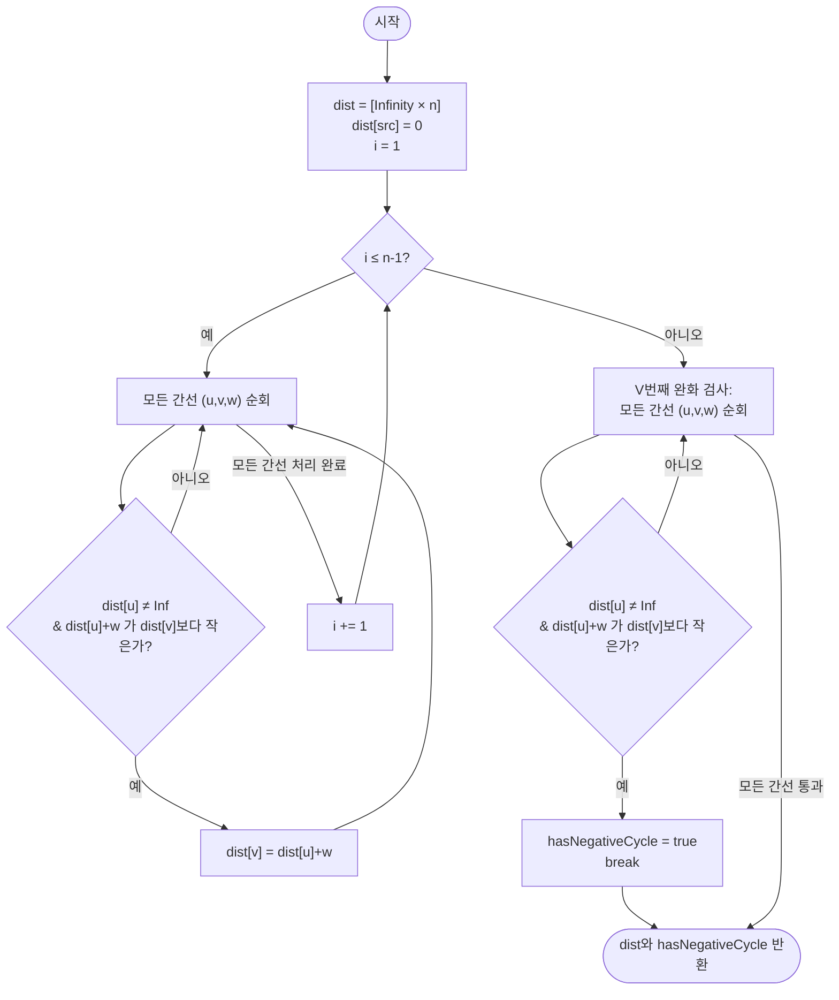

import { AlgorithmSimulation } from "#guide-sim";

# Bellman-Ford 최단 경로 — 그리디가 무너진 자리에서, 반복 횟수를 증명으로 못박는 법

## 한눈에 보는 컨셉

음수 가중치 간선이 하나라도 있으면 Dijkstra의 "한 번 확정한 거리는 다시 안 본다"는 그리디 전제가 깨져요. Bellman-Ford는 대신 모든 간선을 여러 번 반복해서 완화(relax)하는데, **"음수 사이클이 없다면 최단 단순 경로는 간선을 최대 `V-1`개만 쓴다"**는 사실을 증명으로 확보해 반복 횟수를 정확히 `V-1`번으로 못박습니다. 그리고 덤으로 하나 더 얻어요 — `V`번째 라운드에서도 여전히 완화가 일어난다면, 그건 음수 사이클이 있다는 확실한 증거입니다. 시간 복잡도는 `O(V·E)`예요.

## 출발점: 가장 순진한 방법부터

문제를 먼저 정확히 잡고 갈게요.

```ts
function bellmanFord(
  n: number,
  edges: [number, number, number][],
  src: number,
): { dist: number[]; hasNegativeCycle: boolean }
```

| 항목 | 의미 | 제약 |
|------|------|------|
| `n` | 정점 수 `V` | `1 ≤ n ≤ 500` |
| `edges` | 방향 간선 `[u, v, w]` 목록 | `0 ≤ E ≤ V(V-1)`, `w`는 음수 허용(`-10^9 ≤ w ≤ 10^9`) |
| `src` | 시작 정점 | `0 ≤ src < n` |
| 반환 `dist[v]` | `src → v` 최단 거리 | 도달 불가능하면 `Infinity` |
| 반환 `hasNegativeCycle` | `src`에서 도달 가능한 음수 사이클 존재 여부 | 도달 불가능한 음수 사이클은 `false` |

`n ≤ 500`, `E ≤ 500 × 499 = 249{,}500`이니, 목표로 삼을 수 있는 복잡도가 대략 나옵니다. `O(V·E) ≈ 500 × 249{,}500 ≈ 1.25 × 10^8`이면 1초 안에 통과할 수 있는 범위고, 만약 여기에 `V`가 한 번 더 곱해진 `O(V²·E)`였다면 `6 × 10^{10}`으로 불가능해요. 그러니 "정점 수만큼(`V`번 정도) 전체 간선을 훑는" 수준의 반복이 우리가 노려야 할 자리라는 감이 미리 잡힙니다.

**왜 Dijkstra를 그대로 못 쓰나요?** Dijkstra는 "아직 확정 안 된 정점 중 거리가 가장 짧은 정점을 뽑아 영구 확정한다"는 그리디 규칙을 씁니다. 이 규칙은 **모든 간선이 음수가 아닐 때만** 안전해요. 작은 반례로 직접 확인해 봅시다.

```text
그래프:  0 --(1)--> 1
         0 --(2)--> 2
         2 --(-5)--> 1

Dijkstra 진행:
  dist = {0:0, 1:∞, 2:∞}
  0을 확정 → 완화: dist[1]=1, dist[2]=2
  미확정 정점 중 최솟값은 1(거리 1) → 1을 "영구 확정"하고 다시는 안 봄
  이어서 2를 확정 → 2→1 간선 완화 시도: 2 + (-5) = -3 < 1
                    이지만 1은 이미 확정돼 갱신 대상에서 빠짐

Dijkstra가 내놓는 답: dist[1] = 1        ✗
실제 최단 거리:      dist[1] = -3 (0→2→1)
```

`dist[1] = -3`이 진짜 정답이라는 건 이 그래프를 Bellman-Ford로 직접 돌려 확인한 값입니다(`[0, -3, 2]`). 즉 "한 번 확정하면 끝"이라는 전제 자체가 음수 간선 앞에서 무너지는 거예요.

그럼 확정을 아예 안 하면 어떨까요? 가장 정직한 대안은 **모든 간선을 순서 없이 계속 완화하다가, 더 이상 아무것도 안 바뀌면 멈추는 것**입니다.

```ts
function bellmanFordNaiveCapped(
  n: number,
  edges: [number, number, number][],
  src: number,
  maxRounds: number, // 몇 번 반복할지 "추측"해서 넘겨야 함
): { dist: number[]; stillChanging: boolean } {
  const dist = new Array<number>(n).fill(Infinity);
  dist[src] = 0;

  let round = 0;
  let changed = true;
  while (changed && round < maxRounds) {
    changed = false;
    for (const [u, v, w] of edges) {
      if (dist[u] !== Infinity && dist[u] + w < dist[v]) {
        dist[v] = dist[u] + w;
        changed = true;
      }
    }
    round++;
  }
  return { dist, stillChanging: changed };
}
```

문제는 `maxRounds`를 뭘로 잡아야 하냐는 겁니다. 5개 정점짜리 체인 그래프로 직접 확인해 볼게요. 간선을 일부러 "거꾸로" 순서로 넣었습니다(`(3→4), (2→3), (1→2), (0→1)`) — 이렇게 하면 한 라운드에 한 정점씩만 겨우 확정되는 최악의 순서가 됩니다.

```text
실제 최단 거리(0→1→2→3→4, 가중치 모두 1): dist = [0, 1, 2, 3, 4]

maxRounds를 3으로 "추측"해서 돌리면:
  라운드1: dist = [0, 1, ∞, ∞, ∞]
  라운드2: dist = [0, 1, 2, ∞, ∞]
  라운드3: dist = [0, 1, 2, 3, ∞]   ← 여기서 멈춤. dist[4]가 아직 ∞  ✗

라운드를 4까지 돌려야 비로소 dist[4] = 4로 확정된다.
```

`maxRounds`를 하나만 작게 잡아도 조용히 틀린 답을 냅니다. 게다가 음수 사이클이 있으면 상황이 더 나빠져요. `0→1(1), 1→2(-1), 2→0(-1)` 그래프(사이클 총합 `-1`)를 `maxRounds`만 계속 키워 가며 돌리면:

```text
maxRounds= 3 → dist = [-3, -1, -2]
maxRounds= 6 → dist = [-6, -4, -5]
maxRounds= 9 → dist = [-9, -7, -8]
maxRounds=20 → dist = [-20, -18, -19]
maxRounds=50 → dist = [-50, -48, -49]
   ...
```

`maxRounds`를 아무리 키워도 `stillChanging`이 절대 `false`가 되지 않습니다 — 사이클을 돌 때마다 이득이 생기니 무한히 작아지는 거예요. **"몇 번 반복하면 충분한가"를 추측이 아니라 증명으로 확정해야 한다** — 이것이 이번 알고리즘의 출발 단서입니다.

## 아이디어 자세히 들여다보기

### 간선을 몇 개 썼는지로 상태를 나누기 — 수식과 그림

핵심 관찰은 이겁니다. **"라운드 수"를 "지금까지 쓴 간선 개수의 상한"으로 재정의하면, 반복 횟수의 의미가 분명해집니다.**

$dp[i][v]$를 "간선을 **최대 `i`개**만 사용하는 `src → v` 경로 중 최단 거리"로 정의합니다.

$$dp[i][v] = \min\Bigl(dp[i-1][v],\;\; \min_{(u,v,w) \in E} \bigl(dp[i-1][u] + w\bigr)\Bigr)$$

- 첫 번째 항: `v`에 도착하는 마지막(=`i`번째) 간선을 **아예 안 씀** → `i-1`개일 때와 같음
- 두 번째 항: 어떤 간선 `(u, v, w)`를 `i`번째 간선으로 골라 `u`에서 넘어옴

대표 예시 `n = 4`, `edges = [[0,1,4], [0,2,1], [2,1,-2], [1,3,3], [2,3,5]]`, `src = 0`으로 `dp[0]`을 직접 채워 봅시다. 간선 0개로 갈 수 있는 곳은 `src` 자신뿐이니:

```text
dp[0] = [0, ∞, ∞, ∞]   (정점 0,1,2,3 순서)
```

여기서 라운드를 한 번 진행하면(모든 간선을 완화 연산으로 훑으면) `dp[1]`이 나옵니다. 완화 연산은 정확히 이겁니다.

$$dist[v] \leftarrow \min\bigl(dist[v],\; dist[u] + w(u,v)\bigr) \quad \text{if } dist[u] \neq \infty$$

**확인 질문 하나** — `dp[1][2]`는 얼마일까요? 간선 하나로 `0`에서 `2`까지 가는 최단 방법은 `0 →(1)→ 2` 하나뿐이니 `dp[1][2] = 1`이에요. `dp[1][1]`은 어떨까요? 간선 하나로 가는 `0→(4)→1`(값 4)과, 간선 두 개가 필요한 `0→2→1` 경로는 아직 후보가 아니므로 `dp[1][1] = 4`입니다.

이 정의가 "왜 하필 간선 개수 기준이어야 하는지"도 짚고 갈게요. 만약 상태를 "비용 기준"으로("비용이 `c` 이하일 때 도달 가능한 정점 집합" 같은 식으로) 잡으면, 음수 간선 때문에 비용이 줄었다 늘었다 해서 **몇 단계를 진행해야 답이 안정되는지 알 수 없습니다**. 반면 간선 개수는 정수라서 "최대 몇 개"라는 상한을 잡을 수 있고, 그 상한을 다음 절의 비둘기집 원리로 정확히 증명할 수 있어요.

경계가 뚜렷하게 드러나는 다른 예시로, 5개 정점짜리 체인 그래프(`(3→4,1), (2→3,1), (1→2,1), (0→1,1)`, `src=0`)의 `dp[i]`를 라운드별로 전부 채워 보면 이렇습니다.

```text
i=0: [0, ∞, ∞, ∞, ∞]
i=1: [0, 1, ∞, ∞, ∞]
i=2: [0, 1, 2, ∞, ∞]
i=3: [0, 1, 2, 3, ∞]
i=4: [0, 1, 2, 3, 4]
```

앞서 출발점 절에서 `maxRounds=3`이 왜 부족했는지 이 표로 정확히 설명됩니다 — `dp[3][4]`가 아직 `∞`이고, `dp[4][4]`에서 처음으로 `4`가 확정되기 때문이에요.

### 단서를 설명해 주는 이론 — 벨만 최적성 원리와 비둘기집 원리

방금 세운 `dp[i][v]` 재귀식이 왜 정당한지, 그리고 `i`를 어디까지 키우면 충분한지를 설명하는 이론이 이미 있습니다.

**벨만 최적성 원리(Bellman's principle of optimality)**: 최적해는 그 부분해도 최적이어야 한다는 원리입니다. `src`에서 `v`까지의 최단 경로가 마지막 간선으로 `(u, v, w)`를 쓴다면, 그 경로의 앞부분(`src → u`)도 반드시 `u`까지의 최단 경로여야 해요. 만약 그렇지 않다면, 더 짧은 `src → u` 경로로 바꿔치기해서 전체를 더 짧게 만들 수 있으니 애초에 최단이라는 가정과 모순입니다. 이 원리가 바로 `dp[i][v] = min(dp[i-1][v], min(dp[i-1][u] + w))` 재귀식의 근거예요 — 사실 이 재귀식 자체를 **벨만 방정식(Bellman equation)**이라고 부르고, Bellman-Ford라는 이름의 "Bellman"이 바로 이 원리를 만든 리처드 벨만입니다.

**비둘기집 원리(pigeonhole principle)**: 정점을 반복하지 않는 단순 경로는 정점을 최대 `V`개까지만 지날 수 있고, 따라서 간선은 최대 `V-1`개까지만 씁니다. 만약 간선을 `V`개 이상 쓰는 경로가 있다면, 지나는 정점이 `V+1`개 이상인데 그래프에는 정점이 `V`개뿐이니 어떤 정점을 두 번 이상 지나야 해요 — 그러면 그 사이에 사이클이 생깁니다. **음수 사이클이 없다면** 사이클을 도는 비용은 `0` 이상이므로, 사이클을 통째로 잘라내도 경로 비용이 늘어나지 않습니다. 즉 사이클을 포함한 경로가 최단일 이유가 없다는 뜻이고, 최단 경로는 항상 간선 `V-1`개 이내로 잡을 수 있습니다.

두 원리를 합치면: `dp[i]`가 `i`번 완화 라운드 후의 진짜 `dp[i][v]`를 정확히 계산한다(벨만 최적성)는 것과, `i = V-1`이면 모든 최단 경로가 이미 커버된다(비둘기집)는 것이 함께 성립합니다. **이 `V-1` 상한은 뒤에서 최적화를 정당화할 때 다시 소환할 거니 기억해 두세요.**

### 왜 모순 없이 작동하는가

**귀납적 정당화**: "`i`번째 완화 라운드가 끝나면 `dist[v]`는 간선을 최대 `i`개 쓰는 `src → v` 경로 중 최솟값과 같다"는 것이 지켜야 할 불변식입니다.

- **기저 (`i = 0`)**: `dist[src] = 0`(간선 0개로 자기 자신에 도달), 나머지는 `Infinity`. 간선을 0개 쓰고 갈 수 있는 곳은 `src`뿐이므로 정확히 일치합니다.
- **귀납 단계**: `i-1`번째 라운드 후 불변식이 성립한다고 가정합니다. `i`번째 라운드에서 정점 `v`로 들어오는 간선 `i`개짜리 경로는 두 경우뿐입니다 — (a) `v`에 아예 마지막으로 도착하는 간선을 안 쓰는 경우(= 여전히 `i-1`개 이하로 도달, 이미 `dist[v]`에 반영), (b) 어떤 간선 `(u, v, w)`를 마지막으로 쓰는 경우(= `dist[u] + w`, `u`는 최대 `i-1`개 간선으로 도달). 이 두 경우 밖에는 `v`에 도착하는 다른 방법이 없으므로(경우의 완전성), 둘 중 최솟값을 취하면 정확히 `i`개 이하를 쓰는 최단값이 됩니다(각 경우의 최적성은 귀납 가정이 보장). 완화 연산이 정확히 이 두 값의 `min`을 계산하니, `i`번째 불변식도 성립합니다.
- **음수 사이클이 없을 때**: 비둘기집 원리로 단순 최단 경로는 간선 `V-1`개 이내이므로, `i = V-1`에서 `dist`가 실제 최단 거리로 완전히 수렴합니다.

여기서 **헷갈리기 쉬운 포인트**가 세 가지 있습니다.

- **"항상 `V-1`번을 다 돌아야 한다"는 오해입니다.** 위 대표 예시(`n=4`)를 실제로 돌려 보면 라운드 1에서 이미 `dist = [0, -1, 1, 2]`로 수렴하고, 라운드 2에서는 `updated=false`로 아무것도 안 바뀝니다(실측 확인). `V-1 = 3`은 **최악의 경우** 필요한 상한이지, 항상 그만큼 걸린다는 뜻이 아니에요. 반대로 앞서 본 체인 그래프처럼 간선 순서가 나쁘면 정말 `V-1`번을 다 써야 합니다.
- **같은 라운드 안에서 방금 갱신한 `dist[u]`를 써도 되나?** 네, 그래도 됩니다. 완화 연산은 "더 짧은 값으로만" 갱신하므로, 오히려 더 빨리 수렴할 뿐 정확성은 그대로예요(위 대표 예시가 이론상 3라운드 걸릴 자리를 1라운드 만에 끝낸 것도 이 덕분입니다).
- **`Infinity` 가드가 정말 필요한가?** `dist[u] !== Infinity` 조건을 빼고 돌려 봐도 TypeScript에서는 (실측 확인 결과) 결과가 똑같습니다. IEEE754 부동소수점에서 `Infinity + 유한값 = Infinity`이고, `Infinity < X`는 `X`가 `Infinity`가 아닌 한 항상 거짓이라 자연스럽게 걸러지기 때문이에요. 그럼에도 가드를 유지하는 이유는 이식성(다른 언어의 정수 오버플로우 위험)과, "아직 도달 못 한 정점에서는 애초에 완화를 시도하지 않는다"는 불변식을 코드로 명시하기 위해서입니다.

엣지 케이스도 실제로 돌려 확인해 봤습니다.

```text
간선 없음, n=3, src=1:                    dist=[∞, 0, ∞],  hasNegativeCycle=false
정점 1개, 간선 없음:                        dist=[0],        hasNegativeCycle=false
도달 불가능한 음수 사이클(1↔2, src=0):       dist=[0, ∞, ∞],  hasNegativeCycle=false
음수 셀프 루프(0→0, w=-1), n=1:             dist=[0],        hasNegativeCycle=true
```

세 번째 줄이 특히 중요해요 — `1↔2` 사이클(`1+(-5) = -4`, 음수)이 실제로 존재하지만 `src=0`에서 도달할 수 없으므로, `dist[u] !== Infinity` 가드가 애초에 완화 시도 자체를 막아 `hasNegativeCycle`이 `false`로 정확히 나옵니다.

## 아이디어를 코드로 옮기기

```ts
function bellmanFordBasic(
  n: number,
  edges: [number, number, number][],
  src: number,
): { dist: number[]; hasNegativeCycle: boolean } {
  const dist = new Array<number>(n).fill(Infinity);
  dist[src] = 0;

  // V-1번의 완화 라운드 — 여기서 실제 최단 거리를 확정한다
  for (let i = 1; i <= n - 1; i++) {
    for (const [u, v, w] of edges) {
      if (dist[u] !== Infinity && dist[u] + w < dist[v]) {
        dist[v] = dist[u] + w;
      }
    }
  }

  // V번째 라운드 — 갱신을 적용하지 않고 "여전히 완화가 가능한가"만 검사
  let hasNegativeCycle = false;
  for (const [u, v, w] of edges) {
    if (dist[u] !== Infinity && dist[u] + w < dist[v]) {
      hasNegativeCycle = true;
      break;
    }
  }

  return { dist, hasNegativeCycle };
}
```

**가장 실수가 잦은 부분은 `V-1`번 갱신 라운드와 `V`번째 검출 라운드를 분리하는 것입니다.** 둘을 합쳐서 그냥 `n`번(또는 그 이상) 무조건 완화만 반복하고 별도 검출 단계 없이 끝내면 어떤 일이 벌어질까요? 음수 사이클 그래프 `0→1(1), 1→2(-1), 2→0(-1)`(`n=3`)로 직접 확인해 보면:

```text
라운드1 종료 후 dist = [-1, 1, 0]
라운드2 종료 후 dist = [-2, 0, -1]

여기서 검출 단계 없이 그대로 반환하면:
  { dist: [-2, 0, -1], hasNegativeCycle: false }   ✗

실제로는 0→1→2→0 사이클의 합이 -1(음수)이라 진짜 최단 거리는
정의조차 안 되는데, 위 결과는 멀쩡한 유한 값처럼 보인다.
```

`dist` 값 자체는 그럴싸해 보이지만 완전히 의미 없는 숫자입니다 — 이게 바로 검출 단계를 따로 두지 않으면 안 되는 이유예요. 그 외에 놓치기 쉬운 지점:

- `for (let i = 1; i <= n - 1; i++)` — `n = 1`이면 이 루프는 한 번도 안 돕니다(`1 ≤ 0`이 거짓). 그래도 문제없는 게, 정점이 하나뿐이면 완화할 다른 정점이 없으니까요. 음수 셀프 루프(`n=1`, `edges=[[0,0,-1]]`)조차 이 루프를 거치지 않고 바로 아래 검출 단계에서 `dist[0] + (-1) = -1 < dist[0] = 0`으로 정확히 잡힙니다(실측: `hasNegativeCycle=true`).
- `dist[u] !== Infinity` 가드는 앞 절에서 본 것처럼 TS에서는 결과에 영향이 없지만, 습관적으로 넣어 두는 게 안전합니다.

## 더 빠르게 만들 단서 찾기

기본 구현은 `n`이 얼마든 상관없이 무조건 `V-1`번을 다 돕니다. 그런데 대표 예시(`n=4`)를 라운드별로 관찰해 보면 이렇습니다.

```text
n=4 → V-1 = 3라운드를 무조건 다 돈다

라운드1: updated=true   dist=[0, -1, 1, 2]   ← 이미 정답에 도달
라운드2: updated=false  dist=[0, -1, 1, 2]   ← 아무것도 안 바뀜, 간선 5개를 헛수고로 훑음
라운드3: updated=false  dist=[0, -1, 1, 2]   ← 역시 헛수고
```

3라운드 중 2라운드가 완전히 낭비됩니다. 앞서 3.2절에서 다진 벨만 최적성 원리를 다시 불러오면, 이 낭비가 왜 생기는지도 설명돼요 — 어떤 라운드에서 `dist` 벡터 전체가 이전 라운드와 완전히 같다면, 재귀식 `dp[i][v] = min(dp[i-1][v], ...)`이 오직 `dp[i-1]` 값에만 의존하므로 다음 라운드도 똑같은 입력으로 똑같은 계산을 반복할 뿐입니다. **"이번 라운드에 아무것도 안 바뀌었다"는 신호를 잡아내기만 하면, 남은 라운드를 통째로 건너뛸 수 있다** — 이게 이번 최적화의 단서입니다.

## 단서를 최적화로 연결하기

라운드마다 갱신이 하나라도 있었는지 `updated` 플래그로 추적하고, 없었으면 즉시 반복을 멈춥니다.

```text
Before (기본 구현):  라운드 1 → 2 → 3 → ... → V-1   (무조건 전부)
After  (최적화):     라운드 1 → 2 (updated=false) → 즉시 종료
```

이게 안전한 이유를 F3식으로 짚어 볼게요. 라운드 `i`에서 `updated=false`라는 건 `dist`가 라운드 `i-1`과 완전히 같다는 뜻입니다. 재귀식이 오직 바로 이전 라운드 값만 참조하므로(`dp[i][v]`는 `dp[i-1][\cdot]`에만 의존), `dp[i] = dp[i-1]`이면 `dp[i+1] = dp[i]`도 자동으로 성립하고, 이 상태는 귀납적으로 영원히 이어집니다. 즉 한 번 "변화 없음"이 관측되면 그 뒤로는 절대 아무것도 안 바뀌므로, 멈춰도 정답을 잃지 않습니다.

## 최적화 코드

기본 구현에서 바뀌는 곳은 갱신 라운드 안에 `updated` 플래그와 `if (!updated) break;` 한 줄이 추가되는 것뿐입니다.

```ts
function bellmanFord(
  n: number,
  edges: [number, number, number][],
  src: number,
): { dist: number[]; hasNegativeCycle: boolean } {
  const dist = new Array<number>(n).fill(Infinity);
  dist[src] = 0;

  for (let i = 1; i <= n - 1; i++) {
    let updated = false; // 라운드마다 새로 초기화
    for (const [u, v, w] of edges) {
      if (dist[u] !== Infinity && dist[u] + w < dist[v]) {
        dist[v] = dist[u] + w;
        updated = true;
      }
    }
    if (!updated) break; // 이번 라운드 전체를 다 훑고도 변화가 없으면 이미 수렴
  }

  let hasNegativeCycle = false;
  for (const [u, v, w] of edges) {
    if (dist[u] !== Infinity && dist[u] + w < dist[v]) {
      hasNegativeCycle = true;
      break;
    }
  }

  return { dist, hasNegativeCycle };
}
```

**가장 중요한 줄은 `if (!updated) break;`가 안쪽 `for (const [u, v, w] of edges)` 루프의 *바깥*, 즉 간선을 전부 다 훑은 *뒤*에 있다는 것입니다.** 만약 실수로 이 검사를 간선 하나하나마다("이 간선이 갱신 안 됐으니 바로 중단") 하도록 안쪽에 넣으면 어떻게 될까요? 대표 예시의 간선 순서를 `[[2,3,5], [0,1,4], [0,2,1], [2,1,-2], [1,3,3]]`로 바꿔서(같은 그래프, 순서만 다름) 그 버그 버전을 실제로 돌려 보면:

```text
버그 버전(간선 단위로 조기 종료) 결과: dist = [0, ∞, ∞, ∞]
올바른 최적화 코드 결과:            dist = [0, -1, 1, 2]
```

첫 번째 간선 `2→3`을 볼 때 `dist[2]`가 아직 `∞`라 완화가 안 일어나는데, 이걸 "더 볼 것 없다"고 오판해 그 자리에서 멈춰 버립니다. **조기 종료는 반드시 "라운드 전체를 다 훑은 결과"를 보고 판단해야지, 개별 간선 하나로 판단하면 안 됩니다.**

> 기억법: 조기 종료는 "한 바퀴를 다 돌고 나서" 판단한다 — 도는 도중에 판단하지 않는다.

여기서 더 최적화할 여지가 있을까요? 점근 복잡도 `O(V·E)` 자체는 낮추기 어렵습니다. 최악의 경우(체인 그래프처럼 간선 순서가 나쁜 그래프)는 여전히 `V-1`라운드를 다 써야 한다는 걸 앞서 직접 확인했고, 정보가 그래프 위에서 최대 `V-1`홉까지 전파돼야 하는 이상 매 홉마다 전체 간선을 살펴봐야 한다는 사실은 바뀌지 않기 때문이에요. 실무에서는 "방금 거리가 갱신된 정점에서 나가는 간선만" 큐에 넣어 처리하는 **SPFA(Shortest Path Faster Algorithm)**라는 휴리스틱이 존재해서 희소 그래프에서 실측 속도를 크게 줄이기도 하지만, 최악의 경우 복잡도는 여전히 `O(V·E)`이고 적대적인 그래프에서는 오히려 더 느려질 수 있어 이 가이드에서는 존재만 짚고 넘어갑니다. Bellman-Ford를 배우는 진짜 이유는 속도가 아니라 **음수 간선을 견디는 범용성**이에요 — 이 성질 덕분에 Johnson's algorithm처럼 "Bellman-Ford로 먼저 음수 간선을 없애도록 재가중치를 매긴 뒤 Dijkstra를 여러 번 돌리는" 조합 알고리즘의 토대로도 쓰입니다.

## 실행 시각화

예시 그래프 `n = 4`, `edges = [[0, 1, 4], [0, 2, 1], [2, 1, -2], [1, 3, 3], [2, 3, 5]]`, `src = 0`에 대해 `bellmanFord`를 실행하는 과정입니다. 노드 위 숫자는 현재 `dist` 값이며, `keyValue` 패널은 현재 라운드 정보와 갱신 여부를 나타냅니다. 노란색은 최근 갱신된 정점(frontier), 빨간색은 현재 검사 중인 간선의 출발 정점(active), 회색은 최종 확정된 상태(visited)를 뜻해요.

실제 반환값은 `{ dist: [0, -1, 1, 2], hasNegativeCycle: false }`이며, 시뮬레이션 마지막 프레임의 결과 상태와 일치합니다(위 "왜 모순 없이 작동하는가" 절에서 확인한 것과 같은 그래프·같은 결과예요 — 라운드 1에서 이미 수렴하고 라운드 2에서 조기 종료됩니다).

> 대화형 시뮬레이션은 MDX 런타임에서 표시됩니다.

export const nodes = [
  { id: 0, label: "0", x: 24, y: 50 },
  { id: 1, label: "1", x: 50, y: 24 },
  { id: 2, label: "2", x: 50, y: 76 },
  { id: 3, label: "3", x: 76, y: 50 },
];

export const edges = [
  { from: 0, to: 1, weight: 4, directed: true },
  { from: 0, to: 2, weight: 1, directed: true },
  { from: 2, to: 1, weight: -2, directed: true },
  { from: 1, to: 3, weight: 3, directed: true },
  { from: 2, to: 3, weight: 5, directed: true },
];

export const steps = [
  {
    title: "초기화",
    detail: "dist[0] = 0, 다른 모든 정점의 거리는 ∞로 초기화합니다.",
    nodes, edges,
    nodeStatus: { 0: "frontier", 1: "default", 2: "default", 3: "default" },
    nodeValue: { 0: 0, 1: "∞", 2: "∞", 3: "∞" },
    entries: [
      { label: "라운드 (i)", value: "0" },
      { label: "갱신 여부 (updated)", value: "false" },
      { label: "음수 사이클", value: "false" }
    ]
  },
  {
    title: "라운드 1: 0 → 1 완화",
    detail: "dist[0]이 0이므로 dist[0] + 4 = 4 이고, 이는 dist[1](∞)보다 작으므로 dist[1]을 4로 갱신합니다.",
    nodes, edges,
    nodeStatus: { 0: "active", 1: "frontier", 2: "default", 3: "default" },
    nodeValue: { 0: 0, 1: 4, 2: "∞", 3: "∞" },
    activeEdge: { from: 0, to: 1 },
    entries: [
      { label: "라운드 (i)", value: "1" },
      { label: "갱신 여부 (updated)", value: "true" },
      { label: "검사 중인 간선", value: "0 → 1 (가중치 4)" }
    ]
  },
  {
    title: "라운드 1: 0 → 2 완화",
    detail: "dist[0]이 0이므로 dist[0] + 1 = 1 이고, 이는 dist[2](∞)보다 작으므로 dist[2]을 1로 갱신합니다.",
    nodes, edges,
    nodeStatus: { 0: "active", 1: "default", 2: "frontier", 3: "default" },
    nodeValue: { 0: 0, 1: 4, 2: 1, 3: "∞" },
    activeEdge: { from: 0, to: 2 },
    entries: [
      { label: "라운드 (i)", value: "1" },
      { label: "갱신 여부 (updated)", value: "true" },
      { label: "검사 중인 간선", value: "0 → 2 (가중치 1)" }
    ]
  },
  {
    title: "라운드 1: 2 → 1 완화",
    detail: "dist[2]가 1이므로 dist[2] + (-2) = -1 이고, 이는 현재 dist[1](4)보다 작으므로 dist[1]을 -1로 갱신합니다.",
    nodes, edges,
    nodeStatus: { 0: "default", 1: "frontier", 2: "active", 3: "default" },
    nodeValue: { 0: 0, 1: -1, 2: 1, 3: "∞" },
    activeEdge: { from: 2, to: 1 },
    entries: [
      { label: "라운드 (i)", value: "1" },
      { label: "갱신 여부 (updated)", value: "true" },
      { label: "검사 중인 간선", value: "2 → 1 (가중치 -2)" }
    ]
  },
  {
    title: "라운드 1: 1 → 3 완화",
    detail: "dist[1]이 -1이므로 dist[1] + 3 = 2 이고, 이는 dist[3](∞)보다 작으므로 dist[3]을 2로 갱신합니다.",
    nodes, edges,
    nodeStatus: { 0: "default", 1: "active", 2: "default", 3: "frontier" },
    nodeValue: { 0: 0, 1: -1, 2: 1, 3: 2 },
    activeEdge: { from: 1, to: 3 },
    entries: [
      { label: "라운드 (i)", value: "1" },
      { label: "갱신 여부 (updated)", value: "true" },
      { label: "검사 중인 간선", value: "1 → 3 (가중치 3)" }
    ]
  },
  {
    title: "라운드 1: 2 → 3 검사",
    detail: "dist[2] + 5 = 6 이며, 이는 현재 dist[3](2)보다 크므로 갱신되지 않습니다.",
    nodes, edges,
    nodeStatus: { 0: "default", 1: "default", 2: "active", 3: "default" },
    nodeValue: { 0: 0, 1: -1, 2: 1, 3: 2 },
    activeEdge: { from: 2, to: 3 },
    entries: [
      { label: "라운드 (i)", value: "1" },
      { label: "갱신 여부 (updated)", value: "true" },
      { label: "검사 중인 간선", value: "2 → 3 (가중치 5)" }
    ]
  },
  {
    title: "라운드 2: 변화 없음",
    detail: "라운드 2에서 모든 간선을 검사했으나 어떠한 값도 갱신되지 않습니다. (updated = false)",
    nodes, edges,
    nodeStatus: { 0: "default", 1: "default", 2: "default", 3: "default" },
    nodeValue: { 0: 0, 1: -1, 2: 1, 3: 2 },
    entries: [
      { label: "라운드 (i)", value: "2" },
      { label: "갱신 여부 (updated)", value: "false" }
    ]
  },
  {
    title: "완료",
    detail: "갱신이 발생하지 않았으므로 조기 종료 조건을 만족합니다. 검출된 음수 사이클이 없으며, 최단 경로 비용이 확정됩니다.",
    nodes, edges,
    nodeStatus: { 0: "visited", 1: "visited", 2: "visited", 3: "visited" },
    nodeValue: { 0: 0, 1: -1, 2: 1, 3: 2 },
    entries: [
      { label: "최종 결과", value: "성공 (음수 사이클 없음)" },
      { label: "hasNegativeCycle", value: "false" }
    ]
  }
];

<AlgorithmSimulation view={["graph", "keyValue"]} steps={steps} title="Bellman-Ford: src=0" />

## 흐름 한눈에 보기



## 스스로 점검하기

1. 5개 정점짜리 체인 그래프(`edges = [[3,4,1], [2,3,1], [1,2,1], [0,1,1]]`, `src=0`)에서, 라운드 2가 끝난 직후 `dist` 배열을 손으로 구해 보세요. (힌트: 간선이 `(3→4), (2→3), (1→2), (0→1)` 순서로 처리됩니다. 정답: `[0, 1, 2, ∞, ∞]` — `dp[i][v]` 표의 `i=2` 행과 같습니다.)
2. 최적화 코드에서 `if (!updated) break;`를 안쪽 `for (const [u, v, w] of edges)` 루프 안으로 옮기면, 간선 순서를 `[[2,3,5], [0,1,4], [0,2,1], [2,1,-2], [1,3,3]]`으로 바꾼 대표 예시(`n=4`)에서 정확히 어느 간선을 처리하다가, 왜 잘못된 결과(`[0, ∞, ∞, ∞]`)로 멈추는지 짚어 보세요.
3. 만약 문제에서 모든 간선의 가중치가 항상 `0` 이상이라고 보장된다면, 이 알고리즘을 어떤 알고리즘으로 바꿔 더 빠르게 만들 수 있을까요? (힌트: 그리디 확정이 다시 안전해지는 조건이 뭐였는지 "출발점" 절을 다시 떠올려 보세요.)
