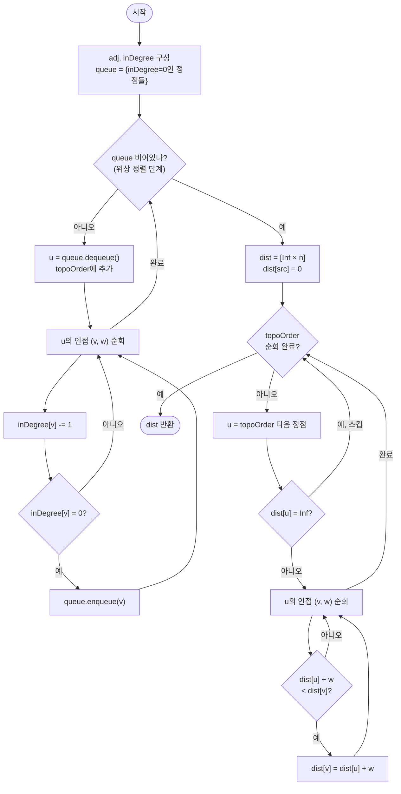

import { AlgorithmSimulation } from "#guide-sim";

# DAG 최단 경로 — 사이클이 없으면 위상 순서대로 한 번만 훑어도 최단 거리가 확정되는 이유

## 한눈에 보는 컨셉

DAG(사이클 없는 방향 그래프)는 음수 가중치 간선이 있어도 절대 음수 사이클이 생기지 않아요. 이 구조적 사실 덕분에, 정점을 위상 순서(topological order)대로 딱 한 번씩만 처리하면서 나가는 간선을 완화(relax)하는 것만으로 모든 정점까지의 최단 거리가 확정됩니다. Bellman-Ford의 `O(V·E)` 반복도, Dijkstra의 우선순위 큐도 필요 없이 `O(V+E)`로 끝나는 이유가 바로 이 "역방향 간선이 없다"는 DAG의 정의 자체에 있어요.

## 출발점: 가장 순진한 방법부터

소프트웨어 빌드 시스템을 설계하는 나영을 떠올려 볼게요. 작업 사이의 의존 관계를 그래프로 그렸더니 순환이 없는 DAG가 나왔고, 어떤 전환에는 캐시 재사용 덕분에 비용이 오히려 줄어드는(음수인) 구간도 있습니다. 나영은 시작 작업에서 각 작업까지 최소 누적 비용이 얼마인지 알고 싶어요. 이 요구를 함수로 고정하면 다음과 같습니다.

```ts
function dagShortestPath(
  n: number,
  edges: [number, number, number][],
  src: number,
): number[]
```

| 파라미터 | 의미 | 제약 |
|---------|------|------|
| `n` | 정점 개수 $V$ | $1 \leq n \leq 10^5$ |
| `edges` | 방향 간선 목록, 각 원소 $[u, v, w]$ | $0 \leq E \leq 2\times10^5$, $-10^9 \leq w \leq 10^9$ |
| `src` | 시작 정점 | $0 \leq src < n$ |

**반환값**: 길이 $n$의 배열 `dist`. `dist[v]`는 `src`에서 `v`까지의 최단 거리이고, 도달할 수 없으면 `Infinity`입니다. 입력 그래프는 항상 DAG(사이클 없음)라고 보장됩니다.

가장 정직한 접근은 뭘까요? "최단 경로"라는 말은 결국 "가능한 모든 경로 중 최솟값"이니, 시작점에서 목표까지 모든 경로를 DFS로 열거하고 비용을 다 비교하면 됩니다.

```ts
function naiveAllPaths(
  n: number,
  edges: [number, number, number][],
  src: number,
): number[] {
  const adj: [number, number][][] = Array.from({ length: n }, () => []);
  for (const [u, v, w] of edges) adj[u].push([v, w]);

  function best(u: number, target: number, cost: number): number {
    if (u === target) return cost;
    let b = Infinity;
    for (const [v, w] of adj[u]) {
      b = Math.min(b, best(v, target, cost + w)); // 모든 경로를 끝까지 내려가 비교
    }
    return b;
  }

  const dist = new Array(n).fill(Infinity);
  for (let v = 0; v < n; v++) dist[v] = v === src ? 0 : best(src, v, 0);
  return dist;
}
```

DAG이니 무한 루프에 빠질 걱정은 없지만, 분기가 있으면 경로 수가 갈래마다 곱해집니다. "다이아몬드"(한 정점에서 둘로 갈라졌다가 다시 합쳐지는 구조)를 사슬처럼 이어 붙이면 이렇게 폭발해요(직접 실행해 호출 횟수를 센 값입니다).

```text
다이아몬드 1개 (정점 4개)   →  DFS 호출  5회
다이아몬드 2개 (정점 7개)   →  DFS 호출  13회
다이아몬드 4개 (정점 13개)  →  DFS 호출  61회
다이아몬드 6개 (정점 19개)  →  DFS 호출  253회

정점 19개에서 이미 253회 — 정점이 늘어날 때마다 대략 2배씩 불어난다
```

정점이 $10^5$개인 이번 문제에서 이 방식은 상상할 수 없을 만큼 느립니다. 그런데 나열하다 보면 낌새가 하나 보여요. `best(u, ...)`는 `u`가 같으면 항상 같은 값을 돌려줍니다 — 같은 부분 문제를 몇 번이고 다시 계산하고 있는 거죠. **"한 번 계산한 정점의 답을 버리지 않고 재사용할 수 없을까?"** 이것이 이번 알고리즘의 출발 단서입니다.

## 아이디어 자세히 들여다보기

### 위상 순서대로 한 번만 완화하기 — 수식과 그림

상태를 하나로 정의합니다.

$$\text{dist}[v] = \text{src에서 } v\text{까지의 최단 경로 비용 (도달 불가면 } \infty \text{)}$$

그리고 간선 $(u, v, w)$ 하나를 "완화(relax)"하는 연산을 정의해요.

$$\text{relax}(u, v, w):\quad \text{dist}[v] \leftarrow \min\bigl(\text{dist}[v],\; \text{dist}[u] + w\bigr)$$

핵심 질문은 "이 완화를 **어떤 순서**로 적용해야 한 번만 하고도 답이 확정되는가"입니다. 정점 $u$를 완화하려면 $u$로 들어오는 모든 간선의 출발점이 먼저 확정돼 있어야 하죠. DAG에서는 이 "먼저 확정돼야 하는 순서"가 바로 **위상 순서**(topological order) — 모든 간선 $(u,v)$에 대해 $u$가 $v$보다 앞에 오는 정점 나열 — 와 정확히 일치합니다.

작은 그래프로 손을 움직여 볼게요. 정점 3개, 간선 $0\to1\,(5)$, $0\to2\,(1)$, $1\to2\,(-10)$이고 `src = 0`입니다.

```text
0 --5--> 1
0 --1--> 2
1 --(-10)--> 2

위상 순서: 0 → 1 → 2   (모든 간선이 앞에서 뒤로만 향한다)
```

| 처리 정점 $u$ | 완화하는 간선 | dist 변화 |
|---|---|---|
| 초기화 | — | `[0, ∞, ∞]` |
| $0$ | $0\to1(5)$, $0\to2(1)$ | `[0, 5, 1]` |
| $1$ | $1\to2(-10)$: $5-10=-5 < 1$ | `[0, 5, -5]` |
| $2$ | 나가는 간선 없음 | `[0, 5, -5]` (최종) |

잠깐 확인해 볼까요? 위 표에서 정점 $2$의 dist가 두 번 바뀝니다 — 처음엔 $0\to2$ 직접 간선으로 $1$이 됐다가, $1$이 처리되면서 $-5$로 다시 줄어들어요. 만약 위상 순서가 아니라 "정점 번호 순서"($0,1,2$)였다면 우연히 같은 결과가 나왔겠지만, 그건 이 예시가 마침 번호 순서와 위상 순서가 같아서일 뿐입니다. 왜 굳이 "위상 순서"라는 별도 개념이 필요한지는, 간선 입력이 $2\to3, 1\to2, 0\to1$처럼 뒤죽박죽 주어지는 경우를 떠올리면 분명해져요 — 정점 번호나 입력 순서가 아니라 그래프의 **의존 관계**를 따라야 합니다.

### 단서를 설명해 주는 이론 — 위상 정렬(Kahn's Algorithm)

방금 "먼저 확정돼야 하는 순서"라고 말한 것을 정확한 절차로 만들어야 완화를 실행할 수 있습니다. 그 절차가 **Kahn's Algorithm**이에요.

각 정점의 **진입 차수(in-degree)** — 그 정점으로 들어오는 간선의 개수 — 를 세는 것부터 시작합니다. 진입 차수가 $0$인 정점은 "아무에게도 의존하지 않는" 정점이니 가장 먼저 처리해도 안전해요. 그런 정점들을 큐에 넣고, 하나씩 꺼낼 때마다 그 정점의 이웃들의 진입 차수를 1씩 줄입니다 — "이 이웃이 의존하던 대상 하나가 방금 해결됐다"는 뜻이죠. 줄인 결과 진입 차수가 $0$이 된 이웃은 이제 더 이상 아무것도 기다릴 필요가 없으니 큐에 추가합니다.

```text
그래프: 0→1, 0→2, 1→2

inDegree:  0:0   1:1   2:2

step1: queue=[0] 꺼냄 → topoOrder=[0]
       0의 이웃 1,2의 inDegree 각 1 감소 → 1:0, 2:1
       inDegree 0이 된 1을 queue에 추가 → queue=[1]

step2: queue=[1] 꺼냄 → topoOrder=[0,1]
       1의 이웃 2의 inDegree 1 감소 → 2:0
       queue=[2]

step3: queue=[2] 꺼냄 → topoOrder=[0,1,2]  ← 완성된 위상 순서
```

큐에서 꺼내는 순서가 곧 위상 순서입니다. 이 순서대로 정점을 처리하면, 각 정점을 처리하는 시점에 그 정점으로 들어오는 모든 간선의 출발점이 이미 큐에서 나갔다는 것이 보장돼요 — 앞서 완화 절에서 필요하다고 짚었던 바로 그 조건입니다. 이 대응 관계를 기억해 두세요, 뒤에서 최종 코드를 쓸 때 이 두 절차(위상 정렬 + 완화)가 그대로 한 함수 안에 이어 붙습니다.

### 왜 모순 없이 작동하는가

**귀납적 정당화**로 "위상 순서에서 $u$를 처리하는 시점에 `dist[u]`가 이미 진짜 최단 거리다"를 보입니다.

- **기저**: `dist[src] = 0`이고, 이는 자명하게 참인 최단 거리입니다. 위상 순서에서 `src`보다 앞선 정점들은 (있다면) `src`로 들어오는 간선이 없다는 뜻이므로 — 만약 있었다면 그 정점이 `src`보다 앞설 수 없죠 — `dist` 값이 계속 `Infinity`로 남아 있어도 모순이 없습니다.
- **귀납 단계**: 위상 순서에서 $u$ 앞의 모든 정점의 `dist`가 확정됐다고 가정합니다. $u$로 들어오는 간선은 $(w_1, u), (w_2, u), \ldots$ 형태인데, DAG의 정의상 $w_1, w_2, \ldots$는 모두 위상 순서에서 $u$보다 앞입니다(**경우의 완전성**: $u$로 들어오는 간선의 출발점은 이 집합 바깥에 있을 수 없습니다 — 있다면 위상 순서의 정의를 어깁니다). 가정에 의해 이 출발점들의 `dist`는 이미 확정돼 있고, $u$를 처리하는 시점에 이 정점들을 모두 처리해 뒀으므로 $u$로 들어오는 모든 경로의 후보가 완화식에 한 번씩 반영됩니다(**각 경우의 최적성**: `min`을 취하는 완화식이 후보 전체 중 최솟값을 고르므로 최적입니다). 따라서 `dist[u]`도 확정됩니다.

**여기서 헷갈리기 쉬운 포인트는 "dist가 작은 정점부터 확정하면 되지 않나"라는 Dijkstra식 직관입니다.** 구체적으로 왜 틀리는지 숫자로 보겠습니다. 위에서 쓴 그래프(`0→1(5)`, `0→2(1)`, `1→2(-10)`)에 Dijkstra처럼 "지금까지 tentative dist가 가장 작은 정점을 확정하고 다시 건드리지 않는다"는 규칙을 적용하면:

```text
dist 초기화: [0, ∞, ∞]
0 확정 → 이웃 완화 → [0, 5, 1]
아직 미확정 중 dist 최소 = 정점 2 (dist=1) → 2를 확정! (더 이상 갱신 안 함)
1 확정 → 1→2(-10) 완화 시도하지만 2는 이미 확정이라 무시

Dijkstra식 결과: [0, 5, 1]   ← 오답
정답(위상 순서 완화):  [0, 5, -5]
```

정점 $2$가 정점 $1$보다 **먼저** "가장 작은 tentative dist"를 갖는다는 이유로 확정돼 버리는 바람에, 나중에 $1\to2$의 음수 간선이 만드는 더 짧은 경로($-5$)를 영영 반영하지 못합니다. DAG 알고리즘은 이런 "지금 제일 작으니 확정"이라는 그리디 가정에 전혀 의존하지 않고, 대신 위상 순서라는 **구조적 보장**만 사용하기 때문에 음수 간선이 있어도 안전합니다.

엣지 케이스도 짚어 둘게요.

```text
V=1, 간선 없음         → dist = [0]  (src 자기 자신만 존재)
src가 위상 순서 맨 뒤   → src로 들어오는 간선의 출발점들이 dist=Infinity라면
                          src 자신은 dist[src]=0으로 강제 초기화되므로 문제 없음
src에서 도달 불가       → dist[v] = Infinity 유지, 그 정점에서 나가는 완화는 스킵
다중 간선 (u,v)가 두 번  → 두 완화 모두 적용되며 min이 자동으로 더 작은 쪽을 선택
```

## 아이디어를 코드로 옮기기

출발점에서 본 naive DFS가 느린 이유는 같은 정점을 몇 번이고 다시 계산하기 때문이었죠. 가장 직접적인 개선은 **메모이제이션**입니다 — 정점 `v`의 답을 한 번 계산하면 저장해 두고 재사용합니다.

```ts
function dagShortestPathMemo(
  n: number,
  edges: [number, number, number][],
  src: number,
): number[] {
  const rev: [number, number][][] = Array.from({ length: n }, () => []); // v로 들어오는 (u, w) 목록
  for (const [u, v, w] of edges) rev[v].push([u, w]);

  const memo = new Array<number | undefined>(n).fill(undefined);

  function dp(v: number): number {
    if (memo[v] !== undefined) return memo[v]!;
    if (v === src) return (memo[v] = 0);
    let best = Infinity;
    for (const [u, w] of rev[v]) {
      const du = dp(u);
      if (du !== Infinity) best = Math.min(best, du + w);
    }
    return (memo[v] = best);
  }

  const dist = new Array(n).fill(Infinity);
  for (let v = 0; v < n; v++) dist[v] = dp(v);
  return dist;
}
```

이 코드는 옳고, 실제로 `O(V+E)`입니다 — 각 정점의 `dp`는 딱 한 번만 실제로 계산되고 나머지는 캐시를 반환하니까요. 재귀 호출이 파고드는 순서를 보면, `dp(v)`가 `dp(u)`를 먼저 요구하는 것이 곧 "의존 관계를 따라가는 것"이라, 위상 순서를 명시적으로 계산하지 않고도 암묵적으로 그 순서를 따르고 있는 셈입니다.

그런데 이 문제의 제약을 다시 보면 정점 수가 최대 $10^5$입니다. 체인 형태의 DAG라면 재귀 깊이도 $10^5$까지 쌓일 수 있는데, 대부분의 JS 런타임 스택은 이 정도 깊이를 감당하지 못하고 `RangeError: Maximum call stack size exceeded`로 죽습니다. **정답의 원리는 맞지만, 재귀라는 실행 방식이 규모를 못 버티는 것**이 다음 단계로 넘어가는 이유예요. 재귀 호출 순서가 암묵적으로 따르던 그 "의존 관계 순서"를 명시적인 배열로 미리 뽑아내면, 재귀 없이 반복문으로 같은 일을 할 수 있습니다 — 그 명시적 순서가 바로 앞 절에서 다룬 위상 정렬입니다.

```ts
function dagShortestPath(
  n: number,
  edges: [number, number, number][],
  src: number,
): number[] {
  const adj: [number, number][][] = Array.from({ length: n }, () => []);
  const inDegree = new Array(n).fill(0);
  for (const [u, v, w] of edges) {
    adj[u].push([v, w]);
    inDegree[v]++;
  }

  // Kahn's 위상 정렬 — 배열 + head 포인터로 큐를 흉내낸다
  const queue: number[] = [];
  for (let v = 0; v < n; v++) if (inDegree[v] === 0) queue.push(v);

  const topoOrder: number[] = [];
  let head = 0;
  while (head < queue.length) {
    const u = queue[head++]!;
    topoOrder.push(u);
    for (const [v] of adj[u]) {
      inDegree[v]--;
      if (inDegree[v] === 0) queue.push(v);
    }
  }

  // 위상 순서대로 완화
  const dist = new Array(n).fill(Infinity);
  dist[src] = 0;
  for (const u of topoOrder) {
    if (dist[u] === Infinity) continue;
    for (const [v, w] of adj[u]) {
      if (dist[u] + w < dist[v]) dist[v] = dist[u] + w;
    }
  }

  return dist;
}
```

**가장 중요한 줄은 `while (head < queue.length)`와 `const u = queue[head++]!`의 조합입니다.** 배열에서 원소를 꺼낼 때 `Array.prototype.shift()`를 쓰면 매번 나머지 원소를 한 칸씩 당기느라 `O(n)`이 걸려, 전체 위상 정렬이 `O(V^2)`로 느려집니다 — 점근 복잡도표에는 안 잡히지만 실측에서는 확실히 느려지는 함정이에요. `head` 포인터로 "꺼낸 척"만 하고 실제로는 배열을 건드리지 않으면 꺼내기가 진짜 `O(1)`이 됩니다.

그 외에 짚어 둘 지점:

- `dist[u] === Infinity` 스킵은 사실 이 문제의 가중치 범위($-10^9 \leq w \leq 10^9$, 항상 유한)에서는 없어도 오답이 나지 않습니다 — IEEE754 부동소수점에서 `Infinity + 유한값`은 그대로 `Infinity`이고 `Infinity < Infinity`는 항상 `false`라서, 스킵하지 않아도 조건문이 자동으로 갱신을 막아 줍니다(직접 실행해 확인한 사실입니다). 그래도 스킵을 남겨 두는 이유는 코드의 의도를 분명히 하고, 다른 언어로 옮길 때(예: 정수 오버플로가 있는 언어)도 안전하게 만들기 위해서예요.
- 완화 조건은 반드시 `dist[u] + w < dist[v]`처럼 **더 작을 때만** 갱신해야 합니다. 부등호를 `<=`로 바꾸면 틀리진 않지만 같은 값을 계속 덮어써 무의미한 쓰기가 늘어납니다.

앞서 위상 정렬 절에서 예고했던 대로, 이 함수는 위상 정렬 절차와 완화 절차를 그대로 이어 붙인 것입니다 — 각각 `O(V+E)`이므로 합쳐도 `O(V+E)`입니다.

이 이상 더 줄일 여지가 있을까요? 정답은 최단 거리를 구하려면 모든 간선을 적어도 한 번은 들여다봐야 하고(그래야 그 간선이 만드는 경로 후보를 놓치지 않습니다), 모든 정점도 적어도 한 번은 방문해야 합니다(그래야 도달 가능 여부를 판정할 수 있습니다). 즉 $\Omega(V+E)$가 이 문제의 하한이고, 위 알고리즘은 정확히 그 하한을 달성했으므로 여기서 최적화 사다리는 끝입니다. (참고로 그래프가 DAG가 아니라 일반 그래프이고 음수 간선까지 있다면 Bellman-Ford의 $O(VE)$가 필요하고, 음수 간선이 없다면 Dijkstra의 $O(E\log V)$로 충분합니다 — DAG라는 구조 정보 자체가 이번 알고리즘이 그 두 알고리즘보다 빠를 수 있는 근거입니다.)

## 실행 시각화

`n = 5`, `edges = [[0,1,2], [0,2,6], [1,2,-4], [1,3,1], [2,3,3], [3,4,2]]`, `src = 0`에 위 최종 코드를 그대로 실행한 과정입니다. 위상 순서는 `[0, 1, 2, 3, 4]`이고, 실제 반환값은 `[0, 2, -2, 1, 3]`입니다(스크래치 코드로 직접 실행해 확인했습니다). graph 패널의 노드 위 숫자는 그 시점의 `dist`(`∞`는 아직 미도달)이고, 빨간색(active)은 지금 처리 중인 정점, 회색(visited)은 완화가 끝난 정점입니다. keyValue 패널에는 처리 중인 정점과 그 순간의 `dist` 배열 전체가 함께 나옵니다. 세 번째 프레임에서 음수 간선 `1→2 (-4)` 덕분에 `dist[2]`가 `6`에서 `-2`로 갱신되는 순간이 이 알고리즘의 핵심을 보여줍니다.

> 대화형 시뮬레이션은 MDX 런타임에서 표시됩니다.

export const nodes = [
  { id: 0, label: "0", x: 12, y: 50 },
  { id: 1, label: "1", x: 36, y: 24 },
  { id: 2, label: "2", x: 36, y: 76 },
  { id: 3, label: "3", x: 66, y: 50 },
  { id: 4, label: "4", x: 90, y: 50 },
];

export const edges = [
  { from: 0, to: 1, weight: 2, directed: true },
  { from: 0, to: 2, weight: 6, directed: true },
  { from: 1, to: 2, weight: -4, directed: true },
  { from: 1, to: 3, weight: 1, directed: true },
  { from: 2, to: 3, weight: 3, directed: true },
  { from: 3, to: 4, weight: 2, directed: true },
];

export const steps = [
  {
    title: "초기화",
    detail: "위상 정렬 완료: [0,1,2,3,4]. dist[0]=0, 나머지 ∞.",
    nodes, edges,
    nodeStatus: {},
    nodeValue: { 0: 0, 1: "∞", 2: "∞", 3: "∞", 4: "∞" },
    entries: [
      { label: "위상 순서", value: "[0, 1, 2, 3, 4]" },
      { label: "dist", value: "[0, ∞, ∞, ∞, ∞]" },
    ],
  },
  {
    title: "0 처리",
    detail: "0→1: dist[1]=2. 0→2: dist[2]=6.",
    nodes, edges,
    nodeStatus: { 0: "active" },
    nodeValue: { 0: 0, 1: 2, 2: 6, 3: "∞", 4: "∞" },
    activeEdge: { from: 0, to: 2 },
    entries: [
      { label: "처리 중", value: "u = 0" },
      { label: "dist", value: "[0, 2, 6, ∞, ∞]" },
    ],
  },
  {
    title: "1 처리 (음수 간선)",
    detail: "1→2: 2 + (-4) = -2 < 6 → dist[2]=-2 로 갱신! 1→3: 2+1=3 → dist[3]=3.",
    nodes, edges,
    nodeStatus: { 0: "visited", 1: "active" },
    nodeValue: { 0: 0, 1: 2, 2: -2, 3: 3, 4: "∞" },
    activeEdge: { from: 1, to: 2 },
    entries: [
      { label: "처리 중", value: "u = 1" },
      { label: "dist", value: "[0, 2, -2, 3, ∞]" },
    ],
  },
  {
    title: "2 처리",
    detail: "2→3: -2 + 3 = 1 < 3 → dist[3]=1 로 갱신.",
    nodes, edges,
    nodeStatus: { 0: "visited", 1: "visited", 2: "active" },
    nodeValue: { 0: 0, 1: 2, 2: -2, 3: 1, 4: "∞" },
    activeEdge: { from: 2, to: 3 },
    entries: [
      { label: "처리 중", value: "u = 2" },
      { label: "dist", value: "[0, 2, -2, 1, ∞]" },
    ],
  },
  {
    title: "3 처리",
    detail: "3→4: 1 + 2 = 3 → dist[4]=3.",
    nodes, edges,
    nodeStatus: { 0: "visited", 1: "visited", 2: "visited", 3: "active" },
    nodeValue: { 0: 0, 1: 2, 2: -2, 3: 1, 4: 3 },
    activeEdge: { from: 3, to: 4 },
    entries: [
      { label: "처리 중", value: "u = 3" },
      { label: "dist", value: "[0, 2, -2, 1, 3]" },
    ],
  },
  {
    title: "4 처리",
    detail: "4는 나가는 간선이 없다. 위상 순서를 모두 처리했다.",
    nodes, edges,
    nodeStatus: { 0: "visited", 1: "visited", 2: "visited", 3: "visited", 4: "active" },
    nodeValue: { 0: 0, 1: 2, 2: -2, 3: 1, 4: 3 },
    entries: [
      { label: "처리 중", value: "u = 4" },
      { label: "dist", value: "[0, 2, -2, 1, 3]" },
    ],
  },
  {
    title: "완료: [0, 2, -2, 1, 3]",
    detail: "위상 순서로 한 번씩만 완화해 음수 간선에도 올바른 최단 거리를 얻었다.",
    nodes, edges,
    nodeStatus: { 0: "visited", 1: "visited", 2: "visited", 3: "visited", 4: "visited" },
    nodeValue: { 0: 0, 1: 2, 2: -2, 3: 1, 4: 3 },
    entries: [
      { label: "반환값", value: "[0, 2, -2, 1, 3]" },
      { label: "dist", value: "[0, 2, -2, 1, 3]" },
    ],
  },
];

<AlgorithmSimulation view={["graph", "keyValue"]} steps={steps} title="DAG 최단 경로 (위상 순서 완화)" />

## 흐름 한눈에 보기



**핵심 불변식**: 위상 순서로 처리된 정점의 `dist`는 그 이후 다시 변하지 않습니다. 역방향 간선이 없는 DAG 구조가 이를 보장합니다.

## 스스로 점검하기

1. `n = 4`, `edges = [[0,1,3], [0,2,-2], [1,3,4], [2,3,6]]`, `src = 0`일 때 `dist`를 손으로 구해 보세요. (힌트: 위상 순서 `[0,1,2,3]`으로 처리하면 `dist[1]=3`, `dist[2]=-2`이고, `dist[3]`은 `1→3`과 `2→3` 두 후보 중 더 작은 쪽입니다. 정답: `[0, 3, -2, 4]`)
2. 만약 위상 정렬을 생략하고, 완화를 **간선이 입력된 순서 그대로** 딱 한 번씩만 훑으면 어떻게 될까요? `edges = [[2,3,1], [1,2,1], [0,1,1]]`, `src = 0`으로 직접 따라가 보세요. (정답은 `[0,1,2,3]`이어야 하지만, 입력 순서 그대로 한 번만 훑으면 `[0,1,∞,∞]`가 나옵니다 — `2→3`과 `1→2` 간선을 처리하는 시점에 아직 `dist[1]`, `dist[2]`가 확정되지 않았기 때문입니다.)
3. 이 알고리즘을 "최단" 대신 "최장" 경로(예: PERT/CPM의 임계 경로)를 구하도록 바꾸려면 코드의 어디가 바뀌어야 할까요? `dist`의 초기값과 완화식의 부등호, 두 곳을 짚어 보세요.
