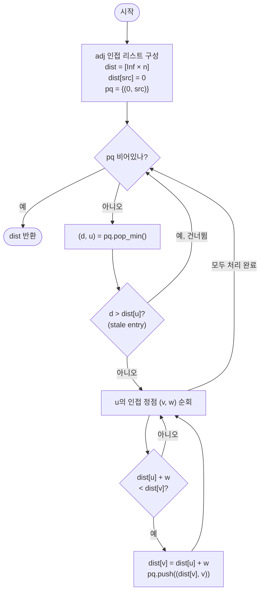

import { AlgorithmSimulation } from "#guide-sim";

# Dijkstra 최단 경로 — 가장 가까운 정점부터 확정하면 다시는 번복되지 않는 이유

## 한눈에 보는 컨셉

Dijkstra는 아직 확정되지 않은 정점 중 지금까지 발견한 거리가 가장 짧은 정점을 하나씩 확정해 나가는 그리디 알고리즘이에요. 가중치가 모두 0 이상이라면, 이렇게 확정한 거리는 이후 어떤 경로로도 다시는 줄어들 수 없다는 것이 핵심 관찰입니다. "지금 가장 가까운 정점 고르기"를 배열 선형 탐색 대신 이진 힙에 맡기면, 전체 비용이 `O(V²)`에서 `O((V+E) log V)`로 줄어들어요.

## 출발점: 가장 순진한 방법부터

먼저 풀어야 할 함수를 정확히 고정할게요.

```ts
function dijkstra(
  n: number,
  edges: [number, number, number][],
  src: number,
): number[]
```

- `n` — 정점 개수. 정점 번호는 `0`부터 `n-1`.
- `edges` — 방향 간선 목록. 각 원소 `[u, v, w]`는 가중치 `w`인 방향 간선 `u → v`.
- `src` — 시작 정점.
- 반환값 — 길이 `n`인 배열 `dist`. `dist[v]`는 `src → v`의 최단 거리, 도달 불가능하면 `Infinity`.

제약은 `1 ≤ n ≤ 10^5`, `0 ≤ E ≤ 2×10^5`, `0 ≤ w ≤ 10^9`(음수 가중치 없음), 시간 제한 1초예요. 이 규모를 기억해 두고, 어떤 접근이 통과할 수 있는지 가늠하면서 읽어봅시다.

가장 정직한 생각은 "모든 경로를 다 나열해서 그중 최소 비용을 고르면 되지 않을까?"입니다.

```text
탐색(현재 정점, 지금까지의 비용):
  목표 정점이면 비용 기록
  현재 정점의 각 이웃으로 가지를 쳐서 재귀 호출

단순 경로(같은 정점을 두 번 지나지 않는 경로)의 수는 최악의 경우
V=4  → 경로 후보 최대 4! = 24가지
V=10 → 경로 후보 최대 10! = 3,628,800가지
V=10^5 → V! 은 자릿수를 셀 수도 없는 규모

→ 전면 열거는 애초에 후보가 될 수 없다
```

이 방법은 시작조차 못 할 만큼 느리니 기각합니다. 그런데 나열하다 보면 낌새가 하나 보여요 — 굳이 경로 전체를 기억할 필요는 없고, **각 정점까지의 "지금까지 발견한 최선의 비용"만 갱신해 나가면 충분하지 않을까**라는 겁니다. 다음 절에서 이 낌새를 정식으로 다듬어 봅시다.

## 아이디어 자세히 들여다보기

### 가장 가까운 정점부터 확정하기 — 수식과 그림

상태를 하나만 정의합니다.

$$\text{dist}[v] = \text{지금까지 발견한 } s \to v \text{ 경로 비용 중 최솟값}$$

그리고 간선 하나를 따라 이 값을 갱신하는 연산을 **완화(relaxation)**라고 부릅니다.

$$\text{relax}(u, v, w):\quad \text{dist}[v] \leftarrow \min\bigl(\text{dist}[v],\; \text{dist}[u] + w\bigr)$$

`n=4`, `edges = [[0,1,4], [0,2,1], [2,1,2], [1,3,1], [2,3,5]]`, `src=0`인 작은 그래프로 손을 움직여 볼게요. 시작은 `dist = [0, ∞, ∞, ∞]`이고, `v0`을 확정한 뒤 이웃 `v1`, `v2`를 완화합니다.

```text
확정 전:  dist = [0, ∞, ∞, ∞]

0→1 완화(w=4):  dist[1] = min(∞, 0+4) = 4   →  dist = [0, 4, ∞, ∞]
0→2 완화(w=1):  dist[2] = min(∞, 0+1) = 1   →  dist = [0, 4, 1, ∞]
```

잠깐, 확인 하나만 해 볼까요? 이 시점에서 다음에 확정할 정점은 어디일까요 — `dist` 값이 `[0, 4, 1, ∞]`이고 `v0`은 이미 확정됐으니, 미확정 정점 중 `dist`가 가장 작은 `v2`(`dist=1`)가 다음 차례예요.

**왜 dist를 "확정값"이 아니라 "지금까지 발견한 최선값"으로 정의해야 할까요?** 만약 `dist[v]`를 정점을 처음 발견하는 순간 곧바로 "확정"으로 표시해 버리면, 나중에 다른 경로로 더 짧게 도달할 가능성을 원천 차단하게 됩니다. 위 예시에서 `v1`은 `0→1`로 먼저 발견돼 `dist[1]=4`가 되지만, 진짜 최단 거리는 `0→2→1`을 거친 `3`이에요. "발견 = 확정"이었다면 이 개선을 놓칩니다. 그래서 `dist`는 "아직 갱신될 수 있는 최선값"으로 두고, **어떤 조건에서 그 값이 더 이상 줄어들 수 없는지**를 별도로 증명해야 합니다 — 그게 다음 절의 역할이에요.

### 단서를 설명해 주는 이론 — 그리디 선택의 정당성과 음수 간선

"미확정 정점 중 `dist`가 최소인 정점을 고르면, 그 값은 이미 최종 확정이다"라는 주장을 그리디의 언어로 정리하면 **교환 논증(exchange argument)**입니다. 미확정 집합 중 `dist[u]`가 최소인 정점 `u`를 골랐다고 합시다. `u`를 우회해 다른 미확정 정점 `x`를 거쳐 도달하는 어떤 경로든 비용은 다음을 만족해요.

$$d(s, x) + w(x, \ldots, u) \;\geq\; \text{dist}[x] + 0 \;\geq\; \text{dist}[u]$$

첫 부등식은 "이미 확정된 부분 경로 비용은 `dist[x]` 이상이고, 나머지 구간의 가중치 합은 `0` 이상"이라는 사실에서 나오고(**여기서 $w \geq 0$이 쓰입니다**), 두 번째 부등식은 `u`가 미확정 정점 중 `dist`가 최소라는 선택 조건에서 나옵니다. 즉 **`u`를 거치지 않는 어떤 경로도 `dist[u]`보다 짧을 수 없다** — 그래서 `u`를 지금 확정해도 안전합니다.

**이 논증이 음수 간선에서 왜 깨지는지** 정확히 짚어볼게요. 첫 부등식 `w(x, …, u) ≥ 0`이 성립하지 않으면(음수 간선이 있으면), `x`를 거쳐 `u`에 도달하는 비용이 `dist[x]`보다 작아질 수 있고, 그러면 전체 부등식 체인이 무너집니다. 구체적으로 봅시다.

```text
그래프: 0→1(비용 1), 0→2(비용 5), 2→1(비용 -10)

그리디가 보는 순서:  dist[1]=1, dist[2]=5  →  dist가 작은 v1을 먼저 "확정"
                      하지만 실제 최단 거리는 0→2→1 = 5 + (-10) = -5

v1을 1로 확정해 버리면, 이후 v2를 통해 v1이 더 줄어드는 사실을 반영할
방법이 없다 (혹은 반영하더라도 "확정 순서" 자체가 이미 틀렸다)
```

`dist[2]=5 > dist[1]=1`이므로 그리디는 `v1`을 먼저 고르지만, 진짜 최단 거리 `-5`는 `v1`보다 **나중에 처리되는 `v2`를 거쳐야만** 나옵니다. "먼저 확정한 것은 다시 줄지 않는다"는 보장 자체가 음수 간선 앞에서 무너지는 거예요. 이 반례는 뒤에서 실제 실행값으로 다시 확인합니다.

### 셈을 맡는 자료구조 — 우선순위 큐

매 단계 "미확정 정점 중 `dist`가 최소인 것"을 뽑는 연산을 누가 맡을지가 관건입니다. 이 역할을 우선순위 큐가 맡아요 — `(dist값, 정점)` 쌍을 넣고, 그중 `dist`가 가장 작은 쌍을 꺼내는 것만 하면 됩니다. 우선순위 큐 자체의 내부 구조(완전 이진 트리, 힙 속성, `O(log n)` 삽입·추출)가 궁금하다면 이 프로젝트의 [priorityQueue 가이드](../../../data-structures/heap/priorityQueue/priorityQueue-guide.mdx)를 참고하세요 — 여기서는 "`dist`가 최소인 쌍을 `O(log n)`에 뽑아 주는 상자"로만 쓰면 충분합니다. 다음 절에서 "이 상자를 어떻게 구현하느냐"에 따라 전체 복잡도가 크게 갈린다는 것을 볼 거예요.

### 왜 모순 없이 작동하는가

지금까지의 논증을 귀납으로 정리하면 다음과 같습니다.

> **주장**: 우선순위 큐에서 `(d, u)`를 꺼낸 순간, `d`가 그 시점의 `dist[u]`와 같다면(= stale 항목이 아니라면) `dist[u]`는 `s → u`의 진짜 최단 거리다.

**기저**: `u = s`일 때 `dist[s] = 0`이 최단 거리라는 것은 자명합니다(자기 자신까지 비용은 0, 더 짧을 수 없음).

**귀납 단계**: 지금까지 확정된 정점 집합 `S`(=이미 큐에서 꺼내 처리한 정점들)의 `dist`가 모두 진짜 최단 거리라고 가정합시다. 큐에서 다음으로 꺼낸 `u ∉ S`를 봅시다.
- **경우의 완전성**: `s → u`의 최단 경로는 반드시 어느 시점에 `S`를 벗어나 `S` 밖의 첫 정점을 지납니다(그 정점이 `u` 자신일 수도 있음) — `S` 안에만 머물며 `u`에 도달할 수는 없으니(그랬다면 `u ∈ S`), 이 경우 밖의 가능성은 없습니다.
- **최적성**: `S` 밖에서 처음 만나는 정점을 `x`라 하면, `x`까지의 부분 경로 비용은 `dist[x]` 이상이고(귀납 가정 + 완화 연산의 정의), 나머지 구간은 `w ≥ 0`이므로 `0` 이상입니다. 앞 절의 부등식 체인 `d(s,x) + w(x,\ldots,u) \geq \text{dist}[x] \geq \text{dist}[u]`(`x`가 `u`와 같아도 등호로 성립, `dist[u]`가 큐에서 최소였으므로)가 그대로 적용되어, `u`를 우회하는 어떤 경로도 `dist[u]`보다 짧을 수 없습니다.

따라서 `dist[u]`는 확정입니다. `S`에 `u`를 추가하고 다음 반복으로 넘어가면 귀납이 이어집니다.

**여기서 헷갈리기 쉬운 포인트가 둘 있습니다.**

- **"한 번 큐에서 꺼내면 그걸로 끝"이라고 착각하기 쉽습니다.** 실제로는 같은 정점이 여러 번 큐에 들어갈 수 있고(완화될 때마다 새로 삽입), 꺼낼 때 `d > dist[u]`이면 이미 더 짧은 경로가 발견된 **낡은(stale) 항목**이므로 버려야 합니다. 이 검사를 빼먹으면 낡은 값으로 이웃을 다시 완화하는 헛수고가 생깁니다(정답 자체는 유지되지만 불필요한 재작업이 발생합니다).
- **음수 간선이 있으면 위 귀납의 최적성 단계가 무너집니다.** 앞 절 반례를 이 가이드의 두 가지 구현 방식으로 실제 돌려 보면 차이가 드러납니다. 그래프 `0→1(1), 0→2(5), 2→1(-10), 1→3(100)`, `src=0`에서 진짜 최단 거리는 `dist[1] = min(1, 5-10) = -5`, `dist[3] = -5+100 = 95`입니다.

  ```text
  "한 번 확정하면 다시 안 본다"(visited 잠금) 버전 실행 결과: [0, -5, 5, 101]
    → v1이 d=1일 때 조기 확정되어 1→3을 101로만 완화하고,
      이후 dist[1]이 -5로 갱신돼도 v1이 잠겨 있어 재확장하지 못한다

  이 가이드가 쓰는 lazy 버전(stale 검사만, 잠금 없음) 실행 결과: [0, -5, 5, 95]
    → 이 예시에서는 재푸시 덕분에 우연히 정답을 회복했지만,
      이는 일반적인 보장이 아니다 — 음수 사이클이 있으면 애초에 종료조차 보장되지 않는다
  ```

  즉 "확정 후 잠금" 방식은 음수 간선에서 눈에 보이는 값 자체가 틀리고, "잠금 없는 lazy" 방식조차 이 예시에서만 우연히 회복될 뿐 음수 간선 일반에 대한 정답을 보장하지 않습니다. **Dijkstra는 애초에 `w ≥ 0`을 전제로 하는 알고리즘**이라는 것이 결론이에요.

엣지 케이스도 확인해 둘게요.

```text
src 자기 자신              → dist[src] = 0 (초기화로 자동 처리)
고립된 정점(들어오는 간선 없음) → dist는 끝까지 Infinity 유지
간선이 아예 없는 그래프(E=0)  → dist[src]=0, 나머지 전부 Infinity
같은 정점 쌍에 다중 간선      → 완화가 여러 번 일어나며 자동으로 최솟값만 남는다
셀프 루프(자기 자신을 향한 간선) → dist[u]+w ≥ dist[u] (w≥0)이므로 갱신에 영향 없음
```

## 아이디어를 코드로 옮기기

앞 절의 아이디어를 그대로 옮기되, "우선순위 큐" 역할을 가장 단순하게 — 배열을 매번 선형 탐색해서 — 구현해 봅니다.

```ts
function dijkstraArrayScan(
  n: number,
  edges: [number, number, number][],
  src: number,
): number[] {
  const adj: [number, number][][] = Array.from({ length: n }, () => []);
  for (const [u, v, w] of edges) adj[u].push([v, w]);

  const dist = new Array<number>(n).fill(Infinity);
  const visited = new Array<boolean>(n).fill(false);
  dist[src] = 0;

  for (let round = 0; round < n; round++) {
    let u = -1;
    let best = Infinity;
    for (let v = 0; v < n; v++) {
      if (!visited[v] && dist[v] < best) {
        best = dist[v];
        u = v;
      }
    }
    if (u === -1) break; // 남은 정점이 전부 도달 불가 → 더 확정할 것이 없다
    visited[u] = true;
    for (const [v, w] of adj[u]) {
      if (dist[u] + w < dist[v]) dist[v] = dist[u] + w;
    }
  }
  return dist;
}
```

`n=4`, `edges=[[0,1,4],[0,2,1],[2,1,2],[1,3,1],[2,3,5]]`, `src=0`을 넣으면 `[0, 3, 1, 4]`가 나옵니다 — 최단 경로 `0→2→1→3`, 비용 `4`와 일치해요(실측 확인 완료).

**가장 실수가 잦은 부분은 `if (u === -1) break;` 가드입니다.** 그래프에 도달 불가능한 정점이 있으면, 어느 라운드부터는 미확정 정점 전부가 `dist=Infinity`라 `dist[v] < best`(`best`도 `Infinity`) 조건이 절대 참이 되지 않아 `u`가 `-1`로 남습니다. 이 가드가 없으면 `visited[-1]`은 실제 정점을 표시하지 못한 채 `adj[-1]`(존재하지 않는 인덱스)을 순회하려다 런타임 에러가 납니다. 그 외 결정 지점은 두 가지예요.

- `visited[v]`가 `false`인 것만 후보로 삼는 이유 — 이미 확정된 정점은 `dist`가 최종값이라 다시 뽑을 필요가 없습니다(뽑아도 해가 되진 않지만 라운드를 낭비합니다).
- 완화 조건은 반드시 `<`(엄격한 부등호)입니다. `≤`로 쓰면 같은 값으로도 계속 갱신·재삽입이 일어나 불필요한 반복이 늘어나요.

## 더 빠르게 만들 단서 찾기

이 구현의 실행을 관찰해 봅시다. 매 라운드 `for (let v = 0; v < n; v++)` 루프가 **확정 여부와 무관하게 `n`칸 전부**를 훑습니다. 체인 그래프(`i → i+1`)로 스캔 횟수를 실제로 세어 보면 이렇습니다.

```text
V = 5        스캔 횟수 =         25   (실측, = V²)
V = 10       스캔 횟수 =        100   (실측, = V²)
V = 100      스캔 횟수 =     10,000   (실측, = V²)
V = 1,000    스캔 횟수 =  1,000,000   (실측, = V²)
V = 100,000 (문제 제약 상한)  →  V² = 10,000,000,000  ← 시간 제한 1초 안에 불가능
```

라운드가 진행될수록 확정된 정점은 늘어나는데도, 매번 `n`칸을 처음부터 다시 훑어요 — **이미 확정돼 더 볼 필요 없는 칸까지 매번 검사하는 것이 낭비**입니다. 앞서 "셈을 맡는 자료구조" 절에서 예고했던 "우선순위 큐를 어떻게 구현하느냐"가 바로 이 지점을 좌우합니다.

## 단서를 최적화로 연결하기

"최솟값 하나만 빠르게 뽑는" 자료구조가 있다면 매 라운드의 `O(n)` 스캔을 줄일 수 있습니다. 그런데 아무 자료구조나 되는 건 아니에요 — "정렬 상태를 유지하는 배열"을 떠올려 볼 수 있는데, 이것도 매번 전체를 다시 정렬해야 한다면 이득이 없습니다. 실제로 재정렬 방식과 이진 힙을 같은 그래프에 돌려 총 작업량을 비교하면 이렇습니다.

```text
"정렬 유지 배열" 방식: pop마다 전체를 다시 정렬해 맨 앞을 꺼낸다 (push O(1), pop O(k log k))
이진 힙 방식:          push/pop 모두 트리 높이만큼만 건드린다 (push, pop 모두 O(log k))

n=50,   E=150  : 재정렬 방식 총 작업량(정렬한 원소 수 합) = 780    /  힙 sift 총 횟수 = 168
n=200,  E=600  : 재정렬 방식 총 작업량                     = 11,936 /  힙 sift 총 횟수 = 1,103
n=1000, E=3000 : 재정렬 방식 총 작업량                     = 284,932 / 힙 sift 총 횟수 = 7,833
```

(실측: `push`는 그냥 뒤에 붙이고 `pop`마다 전체를 재정렬하는 `SortedArrayPQ`와 이진 힙을 같은 무작위 그래프에 돌려 확인. 그래프가 커질수록 격차가 벌어집니다.)

이진 힙을 쓰기로 했다면 한 가지 걸림돌이 남아요 — 표준 Dijkstra 교과서 설명은 "`dist[v]`가 갱신되면 힙 안의 해당 항목을 즉시 더 작은 값으로 낮추는" **decrease-key** 연산을 가정하는데, 우리가 쓸 우선순위 큐는 `push`/`pop`만 제공합니다(이미 들어간 항목을 찾아 값을 낮추는 연산이 없어요). 그래서 다음과 같이 우회합니다.

```text
Before(이상): dist[v]가 줄어들 때, 힙 안의 (예전 dist[v], v) 항목을 찾아 직접 낮춘다
After(실제): 힙 안의 예전 항목은 그대로 두고, (새 dist[v], v)를 힙에 새로 하나 더 push한다
             → 나중에 pop할 때 d > dist[u]이면 "이미 낡은 값"이니 그냥 버린다(lazy deletion)
```

> 넣을 때는 의심하지 않고, 꺼낼 때만 의심한다 — lazy deletion의 전부입니다.

낡은 항목이 최악의 경우 간선 수만큼(`O(E)`) 쌓일 수 있지만, 그래도 각 항목의 push/pop이 `O(log(V+E)) = O(log V)`(`E`가 `V`의 다항 배수라 로그 안에서는 상수 차이)이므로 전체 복잡도에는 영향을 주지 않습니다.

## 최적화 코드

바뀌는 곳은 "최솟값 뽑기"를 담당하는 자료구조뿐입니다. 배열 선형 탐색을 이진 힙으로 교체합니다.

```ts
class MinHeap {
  private items: [number, number][] = []; // [dist값, 정점]

  get size() {
    return this.items.length;
  }

  push(item: [number, number]) {
    this.items.push(item);
    let i = this.items.length - 1;
    while (i > 0) {
      const parent = (i - 1) >> 1;
      if (this.items[parent][0] <= this.items[i][0]) break;
      [this.items[parent], this.items[i]] = [this.items[i], this.items[parent]];
      i = parent;
    }
  }

  pop(): [number, number] | undefined {
    if (this.items.length === 0) return undefined;
    const top = this.items[0];
    const last = this.items.pop()!;
    if (this.items.length > 0) {
      this.items[0] = last;
      let i = 0;
      while (true) {
        const l = i * 2 + 1;
        const r = i * 2 + 2;
        let smallest = i;
        if (l < this.items.length && this.items[l][0] < this.items[smallest][0]) smallest = l;
        if (r < this.items.length && this.items[r][0] < this.items[smallest][0]) smallest = r;
        if (smallest === i) break;
        [this.items[smallest], this.items[i]] = [this.items[i], this.items[smallest]];
        i = smallest;
      }
    }
    return top;
  }
}

function dijkstra(
  n: number,
  edges: [number, number, number][],
  src: number,
): number[] {
  const adj: [number, number][][] = Array.from({ length: n }, () => []);
  for (const [u, v, w] of edges) adj[u].push([v, w]);

  const dist = new Array<number>(n).fill(Infinity);
  dist[src] = 0;

  const heap = new MinHeap();
  heap.push([0, src]);

  while (heap.size > 0) {
    const [d, u] = heap.pop()!;
    if (d > dist[u]) continue; // stale entry: 이미 더 짧은 경로를 발견한 낡은 항목
    for (const [v, w] of adj[u]) {
      const nd = d + w;
      if (nd < dist[v]) {
        dist[v] = nd;
        heap.push([nd, v]);
      }
    }
  }
  return dist;
}
```

`n=4` 예시에서 `dijkstra(4, [[0,1,4],[0,2,1],[2,1,2],[1,3,1],[2,3,5]], 0)`은 배열 버전과 똑같이 `[0, 3, 1, 4]`를 반환합니다(실측 확인 완료, 무작위 200회 교차 검증에서도 `dijkstraArrayScan`과 `dijkstra` 두 구현이 전부 일치했습니다).

**가장 중요한 줄은 `if (d > dist[u]) continue;`입니다.** 이 부등호를 `>=`로 잘못 쓰면 어떻게 되는지 실제로 돌려 봤습니다.

```text
정상(> 사용):  dijkstra(4, mainEdges, 0) = [0, 3, 1, 4]
버그(>= 사용): 같은 입력에서                  [0, Infinity, Infinity, Infinity]
```

`(0, src)`를 처음 꺼낼 때 `d=0`, `dist[src]=0`이라 `d >= dist[u]`가 참이 되어 **시작 정점부터 continue로 건너뛰어 버립니다.** 그래서 어떤 이웃도 완화되지 않고 나머지가 전부 `Infinity`로 남는 거예요. `>`와 `>=`는 한 글자 차이지만 결과는 이렇게 극적으로 갈립니다.

여기서 더 최적화할 여지가 있을까요? 이론적으로는 decrease-key를 진짜로 지원하는 피보나치 힙을 쓰면 `O(E + V log V)`까지 줄일 수 있습니다. 하지만 피보나치 힙은 상수 계수가 크고 구현이 복잡해 실무에서 거의 쓰이지 않아요. 지금 얻은 `O((V+E) log V)`로 `V=10^5`, `E=2×10^5`를 계산하면 `(V+E) log₂V ≈ 3×10^5 × 16.6 ≈ 498만` 회 수준이라 1초 제한에 여유 있게 통과합니다. 이 규모에서는 이진 힙이면 충분하고, 범용성(어떤 우선순위 큐 구현에도 그대로 얹을 수 있다는 점)까지 고려하면 실무 기본값으로 손색이 없습니다.

## 실행 시각화

예시 그래프 `n = 4`, `edges = [[0,1,4], [0,2,1], [2,1,2], [1,3,1], [2,3,5]]`, `src = 0`에 대해 `dijkstra`를 실행하는 과정이다. 노드 위 숫자는 현재 `dist` 값(∞는 미발견), 아래 PQ 패널은 min-heap의 내용이다. 노란색은 힙에 있는 후보(frontier), 빨강은 현재 처리 중(active), 회색은 확정(visited)을 뜻한다.

실제 반환값은 `[0, 3, 1, 4]` (경로 `0 → 2 → 1 → 3`, 비용 4)이며, 시뮬레이션 마지막 프레임의 거리 라벨과 일치한다.

> 대화형 시뮬레이션은 MDX 런타임에서 표시됩니다.

export const nodes = [
  { id: 0, label: "0", x: 24, y: 24 },
  { id: 1, label: "1", x: 76, y: 24 },
  { id: 2, label: "2", x: 24, y: 76 },
  { id: 3, label: "3", x: 76, y: 76 },
];

export const edges = [
  { from: 0, to: 1, weight: 4, directed: true },
  { from: 0, to: 2, weight: 1, directed: true },
  { from: 2, to: 1, weight: 2, directed: true },
  { from: 1, to: 3, weight: 1, directed: true },
  { from: 2, to: 3, weight: 5, directed: true },
];

export const steps = [
  {
    title: "초기화",
    detail: "인접 리스트 구성, dist[0]=0 나머지 ∞. PQ에 (0, v0) 삽입.",
    nodes, edges,
    nodeStatus: { 0: "frontier" },
    nodeValue: { 0: 0, 1: "∞", 2: "∞", 3: "∞" },
    heap: [{ label: "v0", key: 0 }],
  },
  {
    title: "v0 추출 (d=0)",
    detail: "dist[0]=0, stale 아님 → 확정. 이웃 완화를 시작한다.",
    nodes, edges,
    nodeStatus: { 0: "active" },
    nodeValue: { 0: 0, 1: "∞", 2: "∞", 3: "∞" },
    heap: [],
  },
  {
    title: "0→1 완화",
    detail: "dist[1]=∞ > 0+4=4 → dist[1]=4, PQ에 (4, v1) 삽입.",
    nodes, edges,
    nodeStatus: { 0: "active", 1: "frontier" },
    nodeValue: { 0: 0, 1: 4, 2: "∞", 3: "∞" },
    activeEdge: { from: 0, to: 1 },
    heap: [{ label: "v1", key: 4 }],
  },
  {
    title: "0→2 완화",
    detail: "dist[2]=∞ > 0+1=1 → dist[2]=1, PQ에 (1, v2) 삽입.",
    nodes, edges,
    nodeStatus: { 0: "active", 1: "frontier", 2: "frontier" },
    nodeValue: { 0: 0, 1: 4, 2: 1, 3: "∞" },
    activeEdge: { from: 0, to: 2 },
    heap: [{ label: "v2", key: 1 }, { label: "v1", key: 4 }],
  },
  {
    title: "v0 확정",
    detail: "v0의 모든 이웃 처리 완료 → visited.",
    nodes, edges,
    nodeStatus: { 0: "visited", 1: "frontier", 2: "frontier" },
    nodeValue: { 0: 0, 1: 4, 2: 1, 3: "∞" },
    heap: [{ label: "v2", key: 1 }, { label: "v1", key: 4 }],
  },
  {
    title: "v2 추출 (d=1)",
    detail: "PQ 최소값 (1, v2). dist[2]=1, stale 아님 → 확정. 이웃 완화.",
    nodes, edges,
    nodeStatus: { 0: "visited", 1: "frontier", 2: "active" },
    nodeValue: { 0: 0, 1: 4, 2: 1, 3: "∞" },
    heap: [{ label: "v1", key: 4 }],
  },
  {
    title: "2→1 완화",
    detail: "dist[1]=4 > 1+2=3 → dist[1]=3, PQ에 (3, v1) 삽입.",
    nodes, edges,
    nodeStatus: { 0: "visited", 1: "frontier", 2: "active" },
    nodeValue: { 0: 0, 1: 3, 2: 1, 3: "∞" },
    activeEdge: { from: 2, to: 1 },
    heap: [{ label: "v1", key: 3 }, { label: "v1", key: 4 }],
  },
  {
    title: "2→3 완화",
    detail: "dist[3]=∞ > 1+5=6 → dist[3]=6, PQ에 (6, v3) 삽입.",
    nodes, edges,
    nodeStatus: { 0: "visited", 1: "frontier", 2: "active", 3: "frontier" },
    nodeValue: { 0: 0, 1: 3, 2: 1, 3: 6 },
    activeEdge: { from: 2, to: 3 },
    heap: [{ label: "v1", key: 3 }, { label: "v1", key: 4 }, { label: "v3", key: 6 }],
  },
  {
    title: "v2 확정",
    detail: "v2 처리 완료 → visited.",
    nodes, edges,
    nodeStatus: { 0: "visited", 1: "frontier", 2: "visited", 3: "frontier" },
    nodeValue: { 0: 0, 1: 3, 2: 1, 3: 6 },
    heap: [{ label: "v1", key: 3 }, { label: "v1", key: 4 }, { label: "v3", key: 6 }],
  },
  {
    title: "v1 추출 (d=3)",
    detail: "PQ 최소값 (3, v1). dist[1]=3, stale 아님 → 확정. 이웃 완화.",
    nodes, edges,
    nodeStatus: { 0: "visited", 1: "active", 2: "visited", 3: "frontier" },
    nodeValue: { 0: 0, 1: 3, 2: 1, 3: 6 },
    heap: [{ label: "v1", key: 4 }, { label: "v3", key: 6 }],
  },
  {
    title: "1→3 완화",
    detail: "dist[3]=6 > 3+1=4 → dist[3]=4, PQ에 (4, v3) 삽입.",
    nodes, edges,
    nodeStatus: { 0: "visited", 1: "active", 2: "visited", 3: "frontier" },
    nodeValue: { 0: 0, 1: 3, 2: 1, 3: 4 },
    activeEdge: { from: 1, to: 3 },
    heap: [{ label: "v1", key: 4 }, { label: "v3", key: 4 }, { label: "v3", key: 6 }],
  },
  {
    title: "v1 확정",
    detail: "v1 처리 완료 → visited.",
    nodes, edges,
    nodeStatus: { 0: "visited", 1: "visited", 2: "visited", 3: "frontier" },
    nodeValue: { 0: 0, 1: 3, 2: 1, 3: 4 },
    heap: [{ label: "v1", key: 4 }, { label: "v3", key: 4 }, { label: "v3", key: 6 }],
  },
  {
    title: "v1 추출 (d=4) → stale",
    detail: "PQ에서 (4, v1)이 나오지만 d=4 > dist[1]=3 → 낡은 항목, 건너뛴다.",
    nodes, edges,
    nodeStatus: { 0: "visited", 1: "visited", 2: "visited", 3: "frontier" },
    nodeValue: { 0: 0, 1: 3, 2: 1, 3: 4 },
    heap: [{ label: "v3", key: 4 }, { label: "v3", key: 6 }],
  },
  {
    title: "v3 추출 (d=4)",
    detail: "dist[3]=4, stale 아님 → 확정. v3은 이웃이 없다.",
    nodes, edges,
    nodeStatus: { 0: "visited", 1: "visited", 2: "visited", 3: "active" },
    nodeValue: { 0: 0, 1: 3, 2: 1, 3: 4 },
    heap: [{ label: "v3", key: 6 }],
  },
  {
    title: "v3 추출 (d=6) → stale",
    detail: "PQ에서 (6, v3)이 나오지만 d=6 > dist[3]=4 → 건너뛴다. PQ가 비었다.",
    nodes, edges,
    nodeStatus: { 0: "visited", 1: "visited", 2: "visited", 3: "visited" },
    nodeValue: { 0: 0, 1: 3, 2: 1, 3: 4 },
    heap: [],
  },
  {
    title: "완료: dist = [0, 3, 1, 4]",
    detail: "PQ가 비어 종료. 최단 경로 0→2→1→3 의 비용 4가 v3에 반영됐다.",
    nodes, edges,
    nodeStatus: { 0: "visited", 1: "visited", 2: "visited", 3: "visited" },
    nodeValue: { 0: 0, 1: 3, 2: 1, 3: 4 },
    heap: [],
  },
];

<AlgorithmSimulation view={["graph", "priorityQueue"]} steps={steps} title="Dijkstra: src=0" />

## 흐름 한눈에 보기



## 스스로 점검하기

1. `n=5`, `edges = [[0,1,2],[0,2,4],[1,2,1],[1,3,7],[2,3,3],[3,4,1]]`, `src=0`에 대해 손으로 `dist`를 구해 보세요. (힌트: `0→1→2→3→4` 경로를 따라가 보면 `dist = [0, 2, 3, 6, 7]`이 나옵니다 — `0→2` 직접 간선(비용 4)보다 `0→1→2`(비용 3)가 더 짧다는 점을 확인하세요.)
2. 이 가이드의 `dijkstra` 함수(잠금 없는 lazy 버전)에 "한 번 큐에서 꺼낸 정점은 다시 처리하지 않는다"는 `visited` 배열을 추가해 음수 간선 그래프 `edges=[[0,1,1],[0,2,5],[2,1,-10],[1,3,100]]`, `src=0`에 돌리면 어느 시점에 무엇이 잘못될까요? (본문의 "헷갈리기 쉬운 포인트"를 다시 훑으며, `v1`이 언제 `d=1`로 확정되고 `1→3` 완화가 언제 `101`로 굳어 버리는지 순서를 짚어 보세요.)
3. 최단 거리 배열 전체가 아니라 **특정 목표 정점 `t`까지의 거리만** 필요하다면, 최적화 코드의 `while` 루프를 어떻게 바꿀 수 있을까요? (힌트: `u === t`인 순간이 왜 이미 최종 확정인지는 "왜 모순 없이 작동하는가" 절의 귀납 주장이 그대로 보장합니다.)
