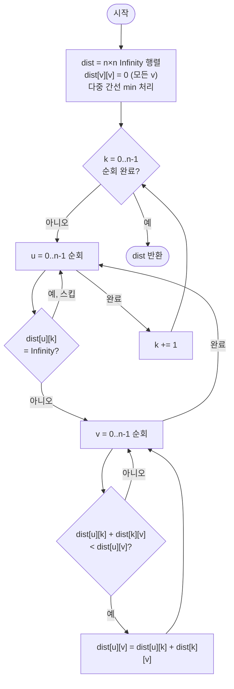

import { AlgorithmSimulation } from "#guide-sim";

# Floyd-Warshall 모든 쌍 최단 경로 해설

## 성능 목표 예측

| 항목 | 값 |
|------|-----|
| V (정점 수) | $1 \leq V \leq 500$ |
| E (간선 수) | $0 \leq E \leq V(V-1)$ |
| 가중치 범위 | $-10^6 \leq w(u, v) \leq 10^6$ |

### Naive 접근의 한계

"모든 쌍" 최단 경로가 필요하므로, 가장 단순한 접근은 각 정점에서 Dijkstra 또는 Bellman-Ford를 실행하는 것이다.

- 음수 간선이 없다면 Dijkstra를 $V$번: $O(V(V + E) \log V)$. $V = 500$, $E \approx V^2$이면 $O(V^3 \log V) \approx 500^3 \times 9 \approx 10^9$ → 위험
- 음수 간선을 위해 Bellman-Ford를 $V$번: $O(V^2 \cdot E) = O(V^4) = 500^4 \approx 6 \times 10^{10}$ → 시간 초과

그러나 이 문제는 음수 간선도 허용하며 "모든 쌍"이 필요하다. 세 정점 $(u, k, v)$ 사이의 관계를 DP로 활용하면 $O(V^3)$으로 해결할 수 있다.

### 목표 복잡도와 근거

$$O(V^3) = 500^3 = 1.25 \times 10^8$$

3중 루프 내 연산이 덧셈·비교뿐이고, 메모리 접근이 순차적이어서 캐시 효율이 높다. $V > 1000$이면 $10^9$을 초과해 위험해지므로 $V \leq 500$ 제약이 임계점이다.

### 공간 복잡도

$V \times V$ 거리 행렬: $O(V^2) = 500^2 = 25\text{만}$ 원소 → 메모리 여유.

3D 배열 $dp[k][u][v]$를 쓰면 $O(V^3)$ 공간이 필요하지만, in-place 갱신으로 $O(V^2)$으로 축소 가능하다 (이유는 핵심 아이디어 섹션에서 설명).

## 목표 함수

```ts
function floydWarshall(
  n: number,
  edges: [number, number, number][],
): number[][]
```

| 파라미터 | 의미 | 제약 |
|---------|------|------|
| `n` | 정점의 개수 $V$ | $1 \leq n \leq 500$ |
| `edges` | 방향 간선 목록 `[u, v, w]` | 가중치 음수 허용, 다중 간선 가능 |

**반환값**: $V \times V$ 거리 행렬 `dist`. `dist[u][v]`는 $u \to v$ 최단 경로 비용이며, 도달 불가능하면 `Infinity`.

**엣지케이스**:
1. 자기 자신: `dist[v][v] = 0` (초기화로 보장)
2. 도달 불가능한 쌍: `Infinity` 유지
3. 동일 정점 쌍에 다중 간선: 초기화 시 `min`으로 더 작은 쪽을 선택해야 함
4. 음수 간선 있으나 음수 사이클 없음: 가정됨 (`dist[v][v] < 0`이 되지 않음)
5. $V = 1$: 간선 없음, `dist[0][0] = 0`만 반환

## 핵심 아이디어

**핵심 아이디어**: "중간 정점을 하나씩 추가하며 모든 쌍의 최단 경로를 점진적으로 갱신한다."

모든 쌍 최단 경로를 각 출발점마다 별도 알고리즘으로 구하면 음수 간선 처리가 어렵고 비용이 크다. Floyd-Warshall은 "경유할 수 있는 중간 정점 집합"을 기준으로 DP 상태를 정의해, 중간 정점을 0번 정점부터 V-1번 정점까지 순서대로 허용하면서 3중 루프로 모든 쌍을 동시에 갱신한다.

**풀이 구조**
1. V×V 거리 행렬 `dist` 초기화: 자기 자신은 0, 직접 간선은 가중치, 나머지는 Infinity
2. 다중 간선은 초기화 시 min으로 처리
3. 3중 루프: 바깥부터 중간 정점 k, 출발 u, 도착 v 순서로 순회
4. `dist[u][k] + dist[k][v] < dist[u][v]`이면 갱신
5. 완성된 `dist` 행렬 반환

**조건**: 음수 간선 허용. 음수 사이클 없어야 결과가 유효함 (`dist[v][v] < 0` 체크로 감지 가능). 정점 수 V가 수백~500 수준이어야 $O(V^3)$이 현실적.

**대표 예시**: 소셜 네트워크에서 모든 사용자 쌍 사이의 최단 연결 거리 계산
V가 수백 명 규모의 소규모 네트워크에서 모든 쌍의 거리를 한 번에 계산해야 할 때, 출발점마다 Dijkstra를 실행하는 대신 Floyd-Warshall 한 번으로 전체 테이블을 완성할 수 있다.

**언제 쓰나**
V가 500 이하이고 모든 쌍의 최단 거리가 필요하거나, 음수 간선이 있어서 Dijkstra를 직접 쓰기 어려울 때 선택한다. 코드가 매우 간결하여 구현 실수가 적다는 장점도 있다.

---

### 원형 아이디어와 naive 접근

모든 쌍 최단 거리를 구하는 가장 단순한 방법은 출발 정점마다 BFS/DFS를 수행하는 것이다. 그러나 이는 가중치 그래프에서 최단 경로를 보장하지 않고, 시간복잡도도 높다.

다음으로 단순한 방법은 각 출발점에서 Bellman-Ford를 수행하는 것이다.

```
for s in 0..n-1:
    dist[s] = bellmanFord(n, edges, s)
```

이 방법의 시간복잡도는 $O(V \cdot V \cdot E) = O(V^2 E)$다. 밀집 그래프($E = O(V^2)$)에서는 $O(V^4)$으로 너무 느리다.

핵심 질문: **"모든 쌍"이라는 요구를 한꺼번에 처리하는 방법은 없는가?** 세 정점 사이의 관계를 이용하면 가능하다.

### 어떤 관찰이 돌파구가 되는가

- **관찰 1**: 최단 경로 $u \to v$는 어떤 중간 정점 집합을 경유한다. 경유할 수 있는 중간 정점의 집합을 점진적으로 확장하면, 각 단계에서 필요한 정보를 이전 단계에서 얻을 수 있다.

- **관찰 2**: 정점 $k$를 중간 정점으로 새로 허용할 때, $u \to v$ 최단 경로는 "$k$를 경유하지 않는 경우"와 "$k$를 경유하는 경우" 중 더 짧은 것이다. 후자는 $u \to k \to v$ 형태이며, $u \to k$와 $k \to v$ 각각은 이미 이전 단계에서 계산된 값이다.

- **관찰 3**: 3중 루프로 모든 $(u, k, v)$ 조합을 처리하면 $V$개 정점을 순차적으로 중간 정점으로 추가하는 DP가 완성된다. 전체 시간복잡도 $O(V^3)$.

### 관찰을 형식화: 상태/구조 정의

**DP 상태 정의**:

$$d^{(k)}(u, v) = \text{중간 정점이 } \{0, 1, \ldots, k\} \text{ 중에서만 선택될 때, } u \to v \text{ 최단 경로 비용}$$

- $k = -1$ (기저): 중간 정점을 전혀 쓸 수 없으므로, $u \to v$ 직접 간선만 사용
- $k = V-1$ (최종): 모든 정점을 중간 정점으로 쓸 수 있으므로, 진정한 최단 거리

왜 이 상태여야 하는가: "중간 정점 집합"을 기준으로 상태를 정의해야만 $k$를 하나씩 추가하는 점화식이 성립한다. 간선 수 기준(Bellman-Ford 방식)으로는 모든 쌍을 동시에 처리하기 어렵다.

### 점화식 또는 핵심 연산

**점화식**:

$$d^{(k)}(u, v) = \min\!\bigl(d^{(k-1)}(u, v),\;\; d^{(k-1)}(u, k) + d^{(k-1)}(k, v)\bigr)$$

각 항의 의미:
- $d^{(k-1)}(u, v)$: $k$를 경유하지 않는 경우. 허용 집합이 $\{0, \ldots, k-1\}$으로 이전 단계와 동일하다.
- $d^{(k-1)}(u, k)$: $k$를 경유하되, $u$에서 $k$까지의 최단 경로. 이 경로의 중간 정점은 $\{0, \ldots, k-1\}$ 안에서 선택된다.
- $d^{(k-1)}(k, v)$: $k$에서 $v$까지의 최단 경로. 마찬가지로 중간 정점은 $\{0, \ldots, k-1\}$.
- "$k$를 경유하는" 최적 경로는 $k$를 정확히 한 번 방문한다 (음수 사이클 없으므로).

**초기값**:

$$d^{(-1)}(u, v) = \begin{cases} 0 & u = v \\ w(u, v) & (u, v) \in E \\ \infty & \text{otherwise} \end{cases}$$

다중 간선이 있으면 $w(u, v) = \min$ (모든 $u \to v$ 간선의 가중치).

### 정당성 — 왜 이것이 옳은가

**귀납적 정당화**: $k$ 단계가 끝날 때 $d^{(k)}(u, v)$는 중간 정점이 $\{0, \ldots, k\}$ 중에서 선택된 $u \to v$ 최단 경로 비용임을 귀납으로 보인다.

**기저**: $k = -1$일 때 중간 정점이 없으므로 직접 간선만 사용. 초기화가 이를 반영한다.

**귀납 단계**: $k-1$까지 성립한다고 가정하자. $k$를 추가할 때 최적 경로는 $k$를 경유하거나 경유하지 않는다. 두 경우 모두 점화식의 두 항에 대응되며, 이전 단계 값으로 정확하게 계산된다.

**in-place 갱신이 가능한 이유**: $k$를 처리할 때 $d^{(k-1)}(u, k)$와 $d^{(k-1)}(k, v)$ 값이 이미 현재 단계에서 변경되었는지 확인해야 한다. $d^{(k)}(u, k) = \min(d^{(k-1)}(u, k),\; d^{(k-1)}(u, k) + \underbrace{d^{(k-1)}(k, k)}_{=0}) = d^{(k-1)}(u, k)$이므로, $k$행과 $k$열은 $k$ 단계에서 변하지 않는다. 따라서 2D 배열을 in-place로 갱신해도 정확하다.

**까다로운 케이스**: 음수 간선 존재 시 - 음수 사이클이 없다는 가정 하에 $u \to k$와 $k \to v$ 경로가 올바르게 계산되어 있으므로 문제 없다. 만약 음수 사이클이 있으면 `dist[v][v] < 0`이 되어 감지할 수 있다.

### 구현 디테일과 최적화

**루프 순서**: 반드시 중간 정점 $k$를 가장 바깥 루프로 둔다. $u$나 $v$를 바깥에 두면 점화식의 의미가 깨진다.

**최적화**: `dist[u][k] === Infinity`이면 $k$를 경유하는 경로가 없으므로 $v$ 루프를 건너뛸 수 있다. 희소 그래프에서 유효한 가지치기다.

**다중 간선 처리 함정**: Floyd-Warshall 자체는 다중 간선을 처리하지 않는다. 초기화 단계에서 같은 $(u, v)$ 쌍에 대해 `dist[u][v] = min(dist[u][v], w)`로 명시적으로 처리해야 한다. 이를 빠뜨리면 임의의 간선 하나만 사용되어 잘못된 결과가 나온다.

**수치 오버플로우 함정**: `dist[u][k] + dist[k][v]`에서 두 값이 모두 `Infinity`이면 `Infinity + Infinity`가 의도하지 않은 값이 된다. `dist[u][k] !== Infinity` 조건 확인이 필요하다.

## 시뮬레이션

예시 방향 그래프 `n = 4`, `edges = [[0,1,4], [0,2,11], [1,2,2], [2,3,3], [1,3,10]]`에 대해 Floyd-Warshall을 실행하는 과정이다. 표는 거리 행렬 `dist[u][v]`(행 u, 열 v)이며, 중간 정점 `k`를 0부터 3까지 차례로 허용하면서 갱신된다. 빨간 셀은 그 단계에서 새로 갱신된 칸이다.

실제 반환값(최종 행렬)은 다음과 같으며 시뮬레이션 마지막 프레임과 일치한다.

```
[ [0, 4, 6, 9],
  [∞, 0, 2, 5],
  [∞, ∞, 0, 3],
  [∞, ∞, ∞, 0] ]
```

> 대화형 시뮬레이션은 MDX 런타임에서 표시됩니다.

export const labels = [0, 1, 2, 3];

export const steps = [
  {
    title: "초기화 (k = -1)",
    detail: "대각선 0, 직접 간선은 가중치, 나머지는 ∞.",
    rowLabels: labels, colLabels: labels,
    matrix: [
      [0, 4, 11, "∞"],
      ["∞", 0, 2, 10],
      ["∞", "∞", 0, 3],
      ["∞", "∞", "∞", 0],
    ],
    entries: [{ label: "중간 정점 k", value: "없음" }],
  },
  {
    title: "k = 0 경유 허용",
    detail: "0으로 들어오는 경로가 없어(dist[u][0] 모두 ∞) 갱신이 일어나지 않는다.",
    rowLabels: labels, colLabels: labels,
    matrix: [
      [0, 4, 11, "∞"],
      ["∞", 0, 2, 10],
      ["∞", "∞", 0, 3],
      ["∞", "∞", "∞", 0],
    ],
    entries: [{ label: "중간 정점 k", value: "0 (갱신 0건)" }],
  },
  {
    title: "k = 1 경유 허용",
    detail: "dist[0][2]: 0→1→2 = 4+2 = 6 < 11. dist[0][3]: 0→1→3 = 4+10 = 14 < ∞.",
    rowLabels: labels, colLabels: labels,
    matrix: [
      [0, 4, 6, 14],
      ["∞", 0, 2, 10],
      ["∞", "∞", 0, 3],
      ["∞", "∞", "∞", 0],
    ],
    cells: [[0, 2], [0, 3]],
    entries: [{ label: "중간 정점 k", value: "1 (2건 갱신)" }],
  },
  {
    title: "k = 2 경유 허용",
    detail: "dist[0][3]: 0→2→3 = 6+3 = 9 < 14. dist[1][3]: 1→2→3 = 2+3 = 5 < 10.",
    rowLabels: labels, colLabels: labels,
    matrix: [
      [0, 4, 6, 9],
      ["∞", 0, 2, 5],
      ["∞", "∞", 0, 3],
      ["∞", "∞", "∞", 0],
    ],
    cells: [[0, 3], [1, 3]],
    entries: [{ label: "중간 정점 k", value: "2 (2건 갱신)" }],
  },
  {
    title: "k = 3 경유 허용",
    detail: "3에서 나가는 경로가 없어(dist[3][v] 모두 ∞) 갱신이 없다.",
    rowLabels: labels, colLabels: labels,
    matrix: [
      [0, 4, 6, 9],
      ["∞", 0, 2, 5],
      ["∞", "∞", 0, 3],
      ["∞", "∞", "∞", 0],
    ],
    entries: [{ label: "중간 정점 k", value: "3 (갱신 0건)" }],
  },
  {
    title: "완료",
    detail: "k = 0..3을 모두 허용 완료. 모든 쌍 최단 거리가 확정됐다.",
    rowLabels: labels, colLabels: labels,
    matrix: [
      [0, 4, 6, 9],
      ["∞", 0, 2, 5],
      ["∞", "∞", 0, 3],
      ["∞", "∞", "∞", 0],
    ],
    entries: [{ label: "중간 정점 k", value: "완료" }],
  },
];

<AlgorithmSimulation view={["matrix", "keyValue"]} steps={steps} title="Floyd-Warshall 거리 행렬" />

## 수도 코드와 Activity Diagram

### 의사코드

```
function floydWarshall(n, edges):
  // 초기화
  dist ← n×n 배열, 모두 Infinity
  for v in 0..n-1:
    dist[v][v] ← 0                        // 불변식: 자기 자신까지 거리는 항상 0
  for (u, v, w) in edges:
    dist[u][v] ← min(dist[u][v], w)       // 다중 간선: 더 작은 가중치 선택

  // Floyd-Warshall 3중 루프
  // 불변식: k 단계 완료 후 dist[u][v]는 중간 정점이 {0..k}인 최단 경로
  for k in 0..n-1:                         // k: 새로 허용하는 중간 정점
    if dist[u][k] = Infinity: continue     // u→k 불가이면 k 경유 불가 → 스킵
    for u in 0..n-1:
      for v in 0..n-1:
        via_k ← dist[u][k] + dist[k][v]   // k를 경유하는 경로 비용
        if via_k < dist[u][v]:
          dist[u][v] ← via_k              // 불변식 유지: 더 짧은 경로 발견 시 갱신

  return dist
```

**핵심 불변식**: $k$번째 외부 루프 종료 시, `dist[u][v]`는 중간 정점을 $\{0, \ldots, k\}$에서만 선택할 수 있을 때 $u \to v$ 최단 경로 비용이다.

### Activity Diagram



**핵심 불변식**: 중간 정점 $k$를 순서대로 추가하며 `dist[u][v]`를 갱신하면, $k = V-1$ 완료 시 모든 쌍의 최단 거리가 확정된다.
