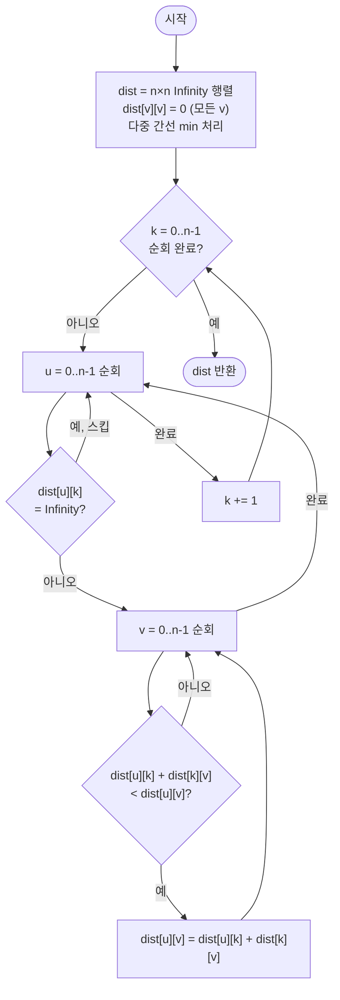

import { AlgorithmSimulation } from "#guide-sim";

# Floyd-Warshall 모든 쌍 최단 경로 — 중간 정점을 하나씩 허용하며 V³에 모든 쌍을 동시에 푸는 이유

## 한눈에 보는 컨셉

모든 정점 쌍의 최단 거리를 한 번에 구해야 하는 문제예요. 정점마다 따로 최단 경로 알고리즘을 돌리는 대신, "경유해도 되는 중간 정점의 집합"을 0번부터 하나씩 넓혀가며 3중 루프 한 번으로 거리 행렬 전체를 갱신합니다. 이 관찰 덕분에 음수 간선이 있어도(음수 사이클만 없다면) `O(V³)`에 모든 쌍의 답이 동시에 완성돼요.

## 출발점: 가장 순진한 방법부터

먼저 문제를 정확히 잡을게요.

```ts
function floydWarshall(
  n: number,
  edges: [number, number, number][],
): number[][]
```

| 파라미터 | 의미 | 제약 |
|---|---|---|
| `n` | 정점 수 $V$, 번호는 $0 \ldots n-1$ | $1 \leq n \leq 500$ |
| `edges` | 방향 간선 목록 `[u, v, w]` | $0 \leq E \leq V(V-1)$, $-10^6 \leq w \leq 10^6$, 다중 간선 가능 |

**반환값**: $V \times V$ 거리 행렬 `dist`. `dist[u][v]`는 $u \to v$ 최단 경로 비용이고, 도달 불가능하면 `Infinity`입니다. 음수 간선은 허용하지만 음수 사이클은 없다고 가정해요(있다면 `dist[v][v] < 0`으로 드러납니다).

**엣지 케이스**
- 자기 자신: `dist[v][v] = 0`
- 도달 불가능한 쌍: `Infinity` 유지
- 다중 간선: 더 작은 가중치를 선택
- $V = 1$: 간선 없이 `dist[0][0] = 0`만 반환

"모든 쌍"이 필요하니, 가장 정직한 접근은 정점마다 단일 출발점 최단 경로 알고리즘을 한 번씩 돌리는 거예요. 그런데 음수 간선이 있으므로(사이클만 없다면 허용) Dijkstra는 못 씁니다 — Dijkstra는 "이미 방문 확정한 정점의 거리는 더 줄어들 수 없다"는 가정 위에서 동작하는데, 음수 간선이 있으면 나중에 더 짧은 경로가 나타날 수 있어 그 가정이 깨지거든요. 그래서 Bellman-Ford를 정점 수만큼 돌리는 게 자연스러운 출발점입니다.

```ts
function bellmanFordFrom(
  n: number,
  edges: [number, number, number][],
  src: number,
): number[] {
  const dist = new Array(n).fill(Infinity);
  dist[src] = 0;
  for (let i = 0; i < n - 1; i++) {
    for (const [u, v, w] of edges) {
      if (dist[u] !== Infinity && dist[u] + w < dist[v]) {
        dist[v] = dist[u] + w;
      }
    }
  }
  return dist;
}

function floydWarshallNaive(
  n: number,
  edges: [number, number, number][],
): number[][] {
  const dist: number[][] = [];
  for (let s = 0; s < n; s++) {
    dist.push(bellmanFordFrom(n, edges, s)); // 매 출발점마다 처음부터 다시 계산
  }
  return dist;
}
```

비용을 따져 봅시다. Bellman-Ford 한 번은 $O(V \cdot E)$이고, 이걸 $V$번(모든 출발점) 반복하니 $O(V^2 \cdot E)$입니다. 문제 제약대로 $V=500$, 조밀한 그래프라 $E \approx V^2$이면:

```text
Bellman-Ford 1회:  O(V · E) ≈ 500 × 250,000 = 1.25 × 10^8
V번 반복:          O(V² · E) = O(V⁴) ≈ 500⁴  = 6.25 × 10^10   → 1초 안에 절대 불가능
```

정점마다 처음부터 다시 계산하는 게 낭비처럼 느껴지지 않나요? 출발점 $s_1$에서 이미 계산해 둔 "$u \to v$" 후보 거리가, 출발점 $s_2$를 계산할 때도 부분적으로 재사용될 여지가 있어 보입니다. **모든 쌍을 동시에, 서로 도와가며 계산하는 방법은 없을까요?** 세 정점 사이의 관계를 들여다보면 실마리가 보입니다.

## 아이디어 자세히 들여다보기

### 중간 정점을 하나씩 허용하기 — 수식과 그림

핵심 관찰은 이겁니다. $u \to v$ 최단 경로는 어떤 정점들을 "중간에" 거쳐 갑니다. 이 "경유 가능한 중간 정점의 집합"을 처음엔 텅 비워 두고, $0$번 정점부터 $V-1$번 정점까지 하나씩 허용 범위에 추가해 봅시다. 중간 정점을 하나 추가할 때마다 "그 정점을 거치면 더 짧아지는 쌍이 있는가"만 확인하면 됩니다.

**상태 정의**

$$d^{(k)}(u, v) = \text{중간 정점을 } \{0, 1, \ldots, k\} \text{ 중에서만 골라 쓸 수 있을 때, } u \to v \text{ 최단 경로 비용}$$

$k = -1$이면 중간 정점을 하나도 못 쓰니 직접 간선만 남고, $k = V-1$이면 모든 정점을 다 쓸 수 있으니 진짜 최단 거리가 됩니다.

작은 예로 확인해 봅시다. `n=4`, 간선 `[0,1,4], [0,2,11], [1,2,2], [2,3,3], [1,3,10]`인 그래프예요.

```text
초기 (k=-1, 직접 간선만):
        0    1    2    3
   0  [ 0    4   11    ∞ ]
   1  [ ∞    0    2   10 ]
   2  [ ∞    ∞    0    3 ]
   3  [ ∞    ∞    ∞    0 ]
```

$k=1$을 허용해 봅시다(정점 1을 경유할 수 있게 됨). $d^{(0)}(0,2) = 11$이지만, $d^{(0)}(0,1) + d^{(0)}(1,2) = 4 + 2 = 6$이 더 작으니 갱신됩니다.

```text
k=1 허용, Before → After:
  dist[0][2]:  11  →  6    (0→1→2 = 4+2)
  dist[0][3]:   ∞  →  14   (0→1→3 = 4+10)
```

확인 질문 하나 — $k=2$를 허용하면 `dist[0][3]`이 한 번 더 줄어들 수 있을까요? $d^{(1)}(0,2) + d^{(1)}(2,3) = 6 + 3 = 9 < 14$이니, 네, $9$로 다시 갱신됩니다.

**왜 하필 "중간 정점 집합"으로 상태를 잡을까요?** 대안으로 "간선 수"를 기준으로 상태를 잡는 방법도 있어요(Bellman-Ford가 바로 이 방식입니다 — $i$번째 반복 후 "간선 $i$개 이하로 갈 수 있는 최단 거리"가 확정됩니다). 하지만 이 기준은 출발점 하나에 대해서만 의미가 있어요. 모든 쌍을 "동시에" 다루려면, 정점 하나를 새로 허용할 때 그 정점을 지나는 모든 $(u,v)$ 쌍을 한꺼번에 갱신할 수 있어야 하는데, 그러려면 상태가 "정점 집합" 기준이어야 합니다. 정점 $k$ 하나를 허용 집합에 추가하는 사건은 최대 $V^2$개의 $(u,v)$ 쌍에 영향을 줄 수 있고, 그 영향은 정확히 "$u \to k \to v$가 더 짧아지는가"로 요약됩니다.

### 단서를 설명해 주는 이론 — 벨만의 최적성 원리

방금 쓴 갱신이 성립하는 근거는 일반적인 이름을 가진 원리예요. **벨만의 최적성 원리(Bellman's Principle of Optimality)**: 어떤 결정 열이 전체 문제에 대해 최적이라면, 그 안에 포함된 모든 부분 결정 열 역시 자신이 놓인 하위 문제에 대해 최적이어야 한다는 원리입니다.

최단 경로에 대입하면 이렇습니다 — $u \to v$ 최단 경로가 정점 $k$를 지난다면, 그 경로의 앞부분($u \to k$)과 뒷부분($k \to v$) 각각도 반드시 최단 경로여야 합니다. 만약 $u \to k$ 구간에 더 짧은 대체 경로가 있다면, 그걸로 갈아 끼워서 전체 경로를 더 줄일 수 있으니 애초의 경로가 최단이라는 가정에 모순이거든요.

```text
u → k → v 가 최단이라면:

   u ─────최단─────▶ k ─────최단─────▶ v
        (더 짧은 대체 경로가 있다면 갈아끼워서 전체를 더 줄일 수 있음 → 모순)
```

이 원리 덕분에 "$u \to k$ 최단 거리 + $k \to v$ 최단 거리"만 알면 "$u \to v$가 $k$를 거치는 최단 거리"를 그대로 조립할 수 있어요. 이 조립이 안전하다는 보장이 바로 갱신식 $d^{(k)}(u,v) = \min(d^{(k-1)}(u,v),\; d^{(k-1)}(u,k)+d^{(k-1)}(k,v))$의 정확성 근거입니다. 이 원리는 뒤에서 "2차원 배열 하나로 갱신해도 안전한 이유"를 증명할 때 다시 소환하니 기억해 두세요.

### 왜 모순 없이 작동하는가

**불변식**: $k$번째 바깥 루프가 끝나는 시점에, `dist[u][v]`는 중간 정점을 $\{0, \ldots, k\}$ 안에서만 골라 쓸 수 있을 때의 $u \to v$ 최단 경로 비용과 같다.

**기저 ($k=-1$, 즉 루프 진입 전)**: 중간 정점을 하나도 쓸 수 없으니 직접 간선(또는 자기 자신 0)만 남습니다. 초기화 코드가 정확히 이 값을 채웁니다.

**귀납 단계**: $k-1$까지 불변식이 성립한다고 가정합니다. $k$를 새로 허용할 때, $u \to v$ 최단 경로는 두 가지 경우 중 하나입니다 — **$k$를 지나거나, 지나지 않거나.** 경로가 $k$를 지나는지 여부는 이분법이므로 이 두 경우 외에는 없습니다(경우의 완전성).

- $k$를 지나지 않는 경우: 허용 집합이 $\{0,\ldots,k-1\}$일 때와 값이 같습니다 — $d^{(k-1)}(u,v)$.
- $k$를 지나는 경우: 벨만의 최적성 원리에 의해 $u \to k$ 구간과 $k \to v$ 구간이 각각 최단이어야 하고, 이 구간들의 중간 정점은 $\{0,\ldots,k-1\}$ 안에서만 골라집니다. $k$를 정확히 한 번만 지난다는 사실은 음수 사이클이 없다는 가정에서 나옵니다 — $k$를 두 번 이상 지나면 그 사이 구간이 사이클인데, 최단 경로라면 이 사이클의 비용이 0 이상이어야 하니(그렇지 않으면 음수 사이클) 사이클을 제거해도 손해가 없습니다. 그러므로 이 경우의 값은 $d^{(k-1)}(u,k) + d^{(k-1)}(k,v)$.

두 경우 중 더 작은 쪽이 진짜 최단값이므로 $d^{(k)}(u,v) = \min(\cdots)$이 성립하고, 코드의 `if (viaK < dist[u][v])` 갱신이 정확히 이 min을 계산합니다.

**여기서 헷갈리기 쉬운 포인트가 두 가지 있습니다.**

첫째, **루프 순서 — $k$가 반드시 가장 바깥이어야 합니다.** $u, v$를 바깥에 두고 $k$를 안쪽으로 넣으면 어떻게 될까요? 직접 반례로 확인해 봅시다. `n=4`, 간선 `[1,0,-1], [2,3,2], [1,2,-2], [3,1,4]`인 그래프에서:

```text
정답(k 바깥):        dist[2][0] = 5     (2→3→1→0 = 2+4+(-1) = 5)
k를 안쪽에 둔 버전:   dist[2][0] = ∞    (틀림!)
```

왜 틀릴까요? $k$가 가장 안쪽이면, 고정된 $(u,v)$ 쌍 하나를 처리하는 동안 각 $k$에 대해 `dist[u][k]`와 `dist[k][v]`를 참조합니다. 그런데 이 값들 자체가 "다른 중간 정점을 여러 개 거친" 최신 값으로 아직 갱신되지 않았을 수 있어요. 이 예시에서 `dist[2][0]`이 최단이 되려면 $2 \to 3$과 $3 \to 1$이 먼저 합쳐져 `dist[2][1]`이 갱신된 다음에야, 그 값을 `dist[1][0]`과 다시 합칠 수 있는데 — $k$가 안쪽이면 $(u,v)=(2,0)$을 처리하는 그 순간 `dist[2][1]`이 아직 두 구간 합산을 못 거친 상태입니다. **정점을 "완전히 허용 완료"한 다음에 그 정점을 경유로 쓰는 것**이 핵심인데, $k$를 바깥에 둬야만 이 순서가 보장됩니다.

둘째, **"2차원 배열 하나로 갱신해도 정말 안전한가?"** — $k$ 단계에서 `dist[u][v]`를 갱신하며 같은 배열의 `dist[u][k]`, `dist[k][v]`를 계속 참조하는데, 이 값들이 $k$ 단계 도중에 바뀌어서 아직 정의되지 않은 미래의 값을 실수로 읽어버리는 건 아닐까요? 벨만의 최적성 원리를 다시 씁니다 — $k$행과 $k$열 자체는 $k$ 단계에서 변하지 않는다는 걸 보이면 됩니다.

$$d^{(k)}(u, k) = \min\bigl(d^{(k-1)}(u,k),\; d^{(k-1)}(u,k) + \underbrace{d^{(k-1)}(k,k)}_{=0}\bigr) = d^{(k-1)}(u,k)$$

$d^{(k-1)}(k,k) = 0$이므로 뒤 항은 앞 항과 같거나 커서 min이 항상 앞 항을 고릅니다. 즉 $k$행·$k$열은 $k$ 단계 내내 그대로 유지돼요. 그래서 $k$ 단계 안에서 `dist[u][k]`나 `dist[k][v]`를 읽는 순간이 언제든, 그 값은 항상 $d^{(k-1)}$(믿을 수 있는 이전 단계 값)과 같습니다. 3차원 배열 `dp[k][u][v]`를 안 쓰고 2차원 하나로 in-place 갱신해도 정확한 이유가 바로 이거예요.

엣지 케이스도 점검해 둡시다.

```text
V = 1, 간선 없음        → k 루프가 0..0 한 번 돌지만 dist[0][0]=0뿐, 갱신 없음 → [[0]]
간선이 하나도 없음      → 모든 dist[u][v] (u≠v) 가 ∞로 유지
음수 간선, 사이클 없음  → 위 귀납이 그대로 성립 (음수 사이클 없다는 가정을 씀)
음수 사이클이 있다면    → dist[v][v] < 0 이 나타나 감지 가능 (전제 위반 신호)
```

## 아이디어를 코드로 옮기기

```ts
function floydWarshall(
  n: number,
  edges: [number, number, number][],
): number[][] {
  const dist: number[][] = Array.from({ length: n }, () =>
    new Array(n).fill(Infinity),
  );
  for (let v = 0; v < n; v++) dist[v][v] = 0;
  for (const [u, v, w] of edges) {
    if (w < dist[u][v]) dist[u][v] = w; // 다중 간선: 더 작은 쪽만 남긴다
  }

  for (let k = 0; k < n; k++) {
    for (let u = 0; u < n; u++) {
      for (let v = 0; v < n; v++) {
        const viaK = dist[u][k] + dist[k][v];
        if (viaK < dist[u][v]) dist[u][v] = viaK;
      }
    }
  }
  return dist;
}
```

가장 실수가 잦은 줄은 초기화의 `if (w < dist[u][v]) dist[u][v] = w;`입니다. 같은 $(u,v)$ 쌍에 간선이 여러 개 있을 때, 이 비교 없이 그냥 `dist[u][v] = w`로 마지막 간선을 대입해 버리면 어떻게 될까요? 간선이 `[0,1,3], [0,1,9]` 순서로 주어졌다면 대입 방식은 나중 값 `9`로 덮어써 최종 `dist[0][1] = 9`가 되지만, 정답은 `min(3, 9) = 3`입니다. 간선 순서가 바뀌면 답도 바뀌는 셈이니 `min` 비교는 절대 생략할 수 없습니다.

그다음으로 중요한 줄은 세 겹 루프의 순서 `for k { for u { for v { ... } } }`입니다 — 바로 앞 절에서 본 것처럼 $k$가 가장 바깥이어야 각 단계에서 참조하는 `dist[u][k]`, `dist[k][v]`가 신뢰할 수 있는 이전 단계 값입니다.

## 더 빠르게 만들 단서 찾기

지금 구현을 관찰해 봅시다. `u`를 고정하고 특정 `k`를 볼 때, `dist[u][k]`가 `Infinity`라면 — 즉 $u$에서 $k$로 가는 길이 아예 없다면 — 그 안쪽의 `v` 루프 전체가 무슨 일을 할까요? `viaK = Infinity + dist[k][v]`는 `dist[k][v]`가 무엇이든 결과가 `Infinity`이므로 `viaK < dist[u][v]` 비교가 항상 거짓입니다. **`v` 루프를 $n$번 통째로 도는데 갱신은 단 한 번도 안 일어나는 거예요.**

희소한 그래프에서 이 낭비가 얼마나 되는지 실측해 봅시다. `n=6`인 사슬형 그래프(`0→1→2→3→4→5`, 역방향 간선 없음)에서 `v` 루프에 진입한 횟수를 세면:

```text
가지치기 없음:  v 루프 진입 216회   (= n³ = 6³)
가지치기 적용:  v 루프 진입 126회, 스킵 15회
                (스킵마다 v 루프 n=6회씩 절약 → 15×6=90회 절약, 216-90=126)
```

역방향 간선이 없는 그래프라 `dist[u][k] = Infinity`인 $(u,k)$ 쌍이 많고, 그만큼 낭비도 큽니다. 조밀한 그래프에서는 이 가지치기 효과가 작아지지만(대부분 `dist[u][k]`가 유한값), 희소 그래프에서는 실측 시간을 확실히 줄여 줍니다.

## 단서를 최적화로 연결하기

`dist[u][k] === Infinity`인 순간 `v` 루프 진입 자체를 건너뛰면 됩니다. 결과는 정확히 같습니다 — 어차피 갱신이 하나도 안 일어날 루프를 안 도는 것뿐이니까요.

```text
Before: for u { for v { viaK 계산, 비교 } }               ← k로 못 가면 이 v 루프 전체가 헛일
After:  for u { if dist[u][k]==∞ then skip; for v {...} } ← 헛일 자체를 건너뜀
```

불변식은 그대로 유지됩니다. 건너뛴 $(u, k)$ 쌍은 어차피 어떤 갱신도 만들지 않았을 쌍이므로, 스킵해도 최종 `dist` 값은 스킵하지 않았을 때와 완전히 같습니다.

## 최적화 코드

바뀌는 곳은 `u` 루프 안, `v` 루프 진입 직전 가드 한 줄뿐입니다.

```ts
for (let k = 0; k < n; k++) {
  for (let u = 0; u < n; u++) {
    if (dist[u][k] === Infinity) continue; // u→k 불가면 k 경유 전부 스킵
    for (let v = 0; v < n; v++) {
      const viaK = dist[u][k] + dist[k][v];
      if (viaK < dist[u][v]) dist[u][v] = viaK;
    }
  }
}
```

**가장 중요한 줄은 가드 조건의 방향, `dist[u][k]`입니다.** 방향 그래프라 `dist[u][k]`와 `dist[k][u]`는 서로 다른 값이에요. 실수로 `dist[k][u] === Infinity`를 검사하면 어떻게 될까요? 앞서 쓴 `n=4` 예시(`[0,1,4],[0,2,11],[1,2,2],[2,3,3],[1,3,10]`)로 확인해 봅시다.

```text
올바른 가드 dist[u][k]:        dist[0][2]=6,  dist[0][3]=9,  dist[1][3]=5   (정답)
방향이 뒤집힌 가드 dist[k][u]:  dist[0][2]=11, dist[0][3]=∞,  dist[1][3]=10  (틀림)
```

`u=1, k=2`를 볼 때, 정답은 `dist[1][2]=2`(유한)라 v 루프를 돌아야 하는데, 뒤집힌 가드는 `dist[2][1]`( $2$에서 $1$로 가는 간선이 없어 `Infinity`)을 검사해 버려 필요한 갱신을 통째로 건너뜁니다.

> 가드는 항상 "경유 정점으로 가는 길"을 봅니다 — `dist[u][k]`, 반대가 아니에요.

더 최적화할 여지가 있을까요? 점근 복잡도는 최악의 경우(조밀한 그래프)에서 여전히 $O(V^3)$이고, 이건 $V \leq 500$ 제약에서 애초에 목표했던 $500^3 = 1.25 \times 10^8$ 그대로입니다 — 처음 세운 naive 접근의 $O(V^4) \approx 6.25 \times 10^{10}$과 비교하면 확실한 개선이고, 가지치기는 희소 그래프의 상수항을 줄일 뿐 점근 복잡도 자체를 바꾸지는 않습니다. 참고로 "모든 쌍 최단 거리"라는 이 특정 문제에서 그래프가 매우 희소하다면, 정점마다 재가중치(reweighting) 후 Dijkstra + 우선순위 큐를 쓰는 Johnson's algorithm이 $O(VE\log V)$로 더 빠를 수 있습니다. 그럼에도 Floyd-Warshall을 쓰는 이유는 **구현이 극도로 간결하고(3중 루프 하나), 음수 간선을 특별 취급 없이 그대로 받아들이기 때문**이에요.

## 실행 시각화

예시 방향 그래프 `n = 4`, `edges = [[0,1,4], [0,2,11], [1,2,2], [2,3,3], [1,3,10]]`에 대해 Floyd-Warshall을 실행하는 과정입니다. 표는 거리 행렬 `dist[u][v]`(행 `u`, 열 `v`)이고, 중간 정점 `k`를 0부터 3까지 차례로 허용하며 갱신됩니다. 빨간 셀은 그 단계에서 새로 갱신된 칸이에요. 실제 반환값(최종 행렬)은 다음과 같으며 시뮬레이션 마지막 프레임과 일치합니다.

```
[ [0, 4, 6, 9],
  [∞, 0, 2, 5],
  [∞, ∞, 0, 3],
  [∞, ∞, ∞, 0] ]
```

> 대화형 시뮬레이션은 MDX 런타임에서 표시됩니다.

export const labels = [0, 1, 2, 3];

export const steps = [
  {
    title: "초기화 (k = -1)",
    detail: "대각선 0, 직접 간선은 가중치, 나머지는 ∞.",
    rowLabels: labels, colLabels: labels,
    matrix: [
      [0, 4, 11, "∞"],
      ["∞", 0, 2, 10],
      ["∞", "∞", 0, 3],
      ["∞", "∞", "∞", 0],
    ],
    entries: [{ label: "중간 정점 k", value: "없음" }],
  },
  {
    title: "k = 0 경유 허용",
    detail: "0으로 들어오는 경로가 없어(dist[u][0] 모두 ∞) 갱신이 일어나지 않는다.",
    rowLabels: labels, colLabels: labels,
    matrix: [
      [0, 4, 11, "∞"],
      ["∞", 0, 2, 10],
      ["∞", "∞", 0, 3],
      ["∞", "∞", "∞", 0],
    ],
    entries: [{ label: "중간 정점 k", value: "0 (갱신 0건)" }],
  },
  {
    title: "k = 1 경유 허용",
    detail: "dist[0][2]: 0→1→2 = 4+2 = 6 < 11. dist[0][3]: 0→1→3 = 4+10 = 14 < ∞.",
    rowLabels: labels, colLabels: labels,
    matrix: [
      [0, 4, 6, 14],
      ["∞", 0, 2, 10],
      ["∞", "∞", 0, 3],
      ["∞", "∞", "∞", 0],
    ],
    cells: [[0, 2], [0, 3]],
    entries: [{ label: "중간 정점 k", value: "1 (2건 갱신)" }],
  },
  {
    title: "k = 2 경유 허용",
    detail: "dist[0][3]: 0→2→3 = 6+3 = 9 < 14. dist[1][3]: 1→2→3 = 2+3 = 5 < 10.",
    rowLabels: labels, colLabels: labels,
    matrix: [
      [0, 4, 6, 9],
      ["∞", 0, 2, 5],
      ["∞", "∞", 0, 3],
      ["∞", "∞", "∞", 0],
    ],
    cells: [[0, 3], [1, 3]],
    entries: [{ label: "중간 정점 k", value: "2 (2건 갱신)" }],
  },
  {
    title: "k = 3 경유 허용",
    detail: "3에서 나가는 경로가 없어(dist[3][v] 모두 ∞) 갱신이 없다.",
    rowLabels: labels, colLabels: labels,
    matrix: [
      [0, 4, 6, 9],
      ["∞", 0, 2, 5],
      ["∞", "∞", 0, 3],
      ["∞", "∞", "∞", 0],
    ],
    entries: [{ label: "중간 정점 k", value: "3 (갱신 0건)" }],
  },
  {
    title: "완료",
    detail: "k = 0..3을 모두 허용 완료. 모든 쌍 최단 거리가 확정됐다.",
    rowLabels: labels, colLabels: labels,
    matrix: [
      [0, 4, 6, 9],
      ["∞", 0, 2, 5],
      ["∞", "∞", 0, 3],
      ["∞", "∞", "∞", 0],
    ],
    entries: [{ label: "중간 정점 k", value: "완료" }],
  },
];

<AlgorithmSimulation view={["matrix", "keyValue"]} steps={steps} title="Floyd-Warshall 거리 행렬" />

## 흐름 한눈에 보기


```mermaid
flowchart TD
    A([시작]) --> B["dist = n×n Infinity 행렬<br/>dist[v][v] = 0 (모든 v)<br/>다중 간선 min 처리"]
    B --> C{"k = 0..n-1<br/>순회 완료?"}
    C -- 아니오 --> D["u = 0..n-1 순회"]
    D --> E{"dist[u][k]<br/>= Infinity?"}
    E -- 예, 스킵 --> D
    E -- 아니오 --> F["v = 0..n-1 순회"]
    F --> G{"dist[u][k] + dist[k][v]<br/>< dist[u][v]?"}
    G -- 아니오 --> F
    G -- 예 --> H["dist[u][v] = dist[u][k] + dist[k][v]"]
    H --> F
    F -- 완료 --> D
    D -- 완료 --> I["k += 1"]
    I --> C
    C -- 예 --> Z([dist 반환])
```

## 스스로 점검하기

1. `n=3`, `edges = [[0,1,2], [1,2,2], [0,2,10]]`에 대해 `k=0,1,2`를 순서대로 허용하며 `dist` 행렬이 어떻게 바뀌는지 손으로 따라가 보세요. (힌트: `k=1` 단계에서 `dist[0][2]`가 `0→1→2 = 2+2 = 4`로 갱신됩니다. 최종 행렬은 `[[0,2,4],[∞,0,2],[∞,∞,0]]`이에요.)
2. 최적화 코드의 가드를 `dist[k][u] === Infinity`로 바꾸면(방향을 뒤집으면) 본문의 `n=4` 예시에서 어떤 칸들이 갱신되지 않고 남는지, 그리고 왜 하필 그 칸들인지 짚어 보세요.
3. "최단 거리"뿐 아니라 "최단 경로 자체(정점 나열)"도 복원해야 한다면, 어떤 보조 상태를 두고 갱신 시점에 무엇을 함께 기록해야 할까요? (힌트: `next[u][v]` 배열을 두고, `dist[u][v]`가 `viaK`로 갱신될 때 `next[u][v] = next[u][k]`로 같이 갱신합니다.)
