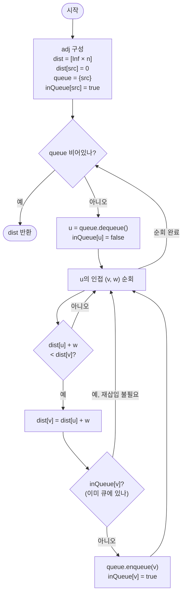

import { AlgorithmSimulation } from "#guide-sim";

# SPFA (Shortest Path Faster Algorithm) — 방금 거리가 줄어든 정점만 다시 확인하면 되는 이유

## 한눈에 보는 컨셉

음수 간선이 있어 Dijkstra를 쓸 수 없는 그래프에서, Bellman-Ford의 "매 라운드 모든 간선 검사"를 뜯어보면 대부분이 헛수고라는 낌새가 보여요. 실제로 이웃이 개선되려면 출발 정점의 `dist`가 방금 줄어들어 있어야 하므로, "방금 줄어든 정점"만 FIFO 큐로 추적해 그 이웃만 확인하면 됩니다. 이 관찰 하나로 평균 성능이 `O(k·E)`(작은 상수 `k`)까지 떨어지는데, 최악의 경우엔 여전히 `O(VE)`라는 대가가 남아 있다는 점도 함께 기억해 둘게요.

## 출발점: 가장 순진한 방법부터

문제를 먼저 정확히 잡을게요.

```ts
function spfa(
  n: number,
  edges: [number, number, number][],
  src: number,
): number[]
```

- `n` — 정점 수. 정점 번호는 `0`부터 `n - 1`.
- `edges` — 방향 간선 목록. 각 원소 `[u, v, w]`는 가중치 `w`(음수 허용)인 방향 간선 `u → v`.
- `src` — 시작 정점.
- 반환값 — 길이 `n`인 배열 `dist`. `dist[v]`는 `src → v` 최단 거리이고, 도달 불가능하면 `Infinity`, `dist[src]`는 항상 `0`.

제약은 이렇습니다.

| 항목 | 값 |
|------|-----|
| 정점 수 $V$ | $1 \leq V \leq 10^5$ |
| 간선 수 $E$ | $0 \leq E \leq 2 \times 10^5$ |
| 가중치 $w(u,v)$ | $-10^9 \leq w \leq 10^9$ |
| 구조 제약 | $src$에서 도달 가능한 음수 사이클 없음 |

음수 간선이 있으니 Dijkstra는 애초에 후보에서 빠집니다(확정한 정점을 다시 갱신해야 하는 상황이 생길 수 있어서예요). 음수 간선을 다루는 가장 정직한 방법은 Bellman-Ford예요 — "최단 경로는 최대 $V-1$개의 간선만 사용한다"는 사실에 기대어, 모든 간선을 $V-1$번 반복해서 완화(relax)합니다.

```ts
function bellmanFordNaive(
  n: number,
  edges: [number, number, number][],
  src: number,
): number[] {
  const dist = new Array(n).fill(Infinity);
  dist[src] = 0;
  for (let i = 1; i <= n - 1; i++) {
    for (const [u, v, w] of edges) {
      if (dist[u] !== Infinity && dist[u] + w < dist[v]) {
        dist[v] = dist[u] + w;
      }
    }
  }
  return dist;
}
```

이게 왜 느린지 체감해 봅시다. 정점 6개짜리 선형 체인 `0→1→2→3→4→5`(간선 5개, 가중치 전부 1)에 이 함수를 그대로 돌리면 이렇게 됩니다.

```text
라운드 1: dist[1]만 0→1로 갱신.  나머지 4개 간선 검사는 전부 허탕.
라운드 2: dist[2]만 1→2로 갱신.  나머지 4개 간선 검사는 전부 허탕.
라운드 3: dist[3]만 갱신 ...    (이하 동일 패턴)
라운드 4: dist[4]만 갱신
라운드 5: dist[5]만 갱신

실측: 총 간선 검사 25회 (= (V-1)×E = 5×5), 그중 실제로 값이 바뀐 건 5회뿐
→ 20회(80%)가 "바뀔 리 없는 정점에서 출발한" 헛검사
```

$V = 10^5$, $E = 2\times10^5$ 규모로 그대로 올리면 $O(VE) = 10^5 \times 2\times10^5 = 2\times10^{10}$이 되어 1초 제한에 명백히 걸립니다. 그런데 위 체인 예시를 보면 낭비의 패턴이 뚜렷해요 — **`dist[u]`가 이전 라운드에서 바뀌지 않았다면, `u`에서 나가는 간선을 다시 검사해 봐야 결과가 달라질 리 없습니다.** "바뀐 정점만 골라서 그 이웃만 다시 보면 되지 않을까?"가 다음 절의 출발 단서예요.

## 아이디어 자세히 들여다보기

### 완화 연산과 갱신 전파 — 수식과 그림

완화(relax) 연산 자체는 Bellman-Ford와 다르지 않습니다.

$$\text{relax}(u, v, w):\quad \text{dist}[v] \leftarrow \min\big(\text{dist}[v],\; \text{dist}[u] + w\big)$$

핵심은 "이 연산을 언제 호출할 가치가 있는가"예요. $\text{dist}[u]$가 직전 확인 이후 전혀 바뀌지 않았다면, $\text{dist}[u] + w$ 값도 그대로이므로 $\text{relax}(u, v, w)$는 다시 호출해도 개선을 만들 수 없습니다. 즉 아래 명제가 성립해요.

$$\text{dist}[v]\text{가 갱신됨} \;\Longrightarrow\; \text{직전에 어떤 이웃 } u\text{의 } \text{dist}[u]\text{가 갱신되었음}$$

역으로 읽으면: **갱신되지 않은 정점에서 출발하는 완화는 통째로 건너뛸 수 있습니다.** 그림으로 그려보면 체인 예시가 이렇게 바뀌어요.

```text
Bellman-Ford: 매 라운드 전체 간선 [0-1][1-2][2-3][3-4][4-5]를 처음부터 끝까지 검사
              (0→1)(1→2)(2→3)(3→4)(4→5)   ← 라운드 1: 앞 1개만 유효
              (0→1)(1→2)(2→3)(3→4)(4→5)   ← 라운드 2: 앞 2개만 유효, 나머진 여전히 허탕
              ...

갱신 전파 방식: "방금 바뀐 정점"만 표시해 그 이웃만 검사
              0 갱신 → 0의 이웃(1)만 검사 → 1 갱신 → 1의 이웃(2)만 검사 → ...
              검사 횟수: 정확히 5회 (허탕 없음)
```

여기서 확인 질문 하나 — 어떤 정점을 "다시 검사해야 할 정점 무더기"로 들고 다니려면, 그 무더기에 담을 자료구조는 어떤 성질을 갖춰야 할까요? 잠깐 생각해 보면, 순서는 크게 안 가리지만(어차피 나중에 다시 갱신될 수도 있으니) "지금 무더기에 이미 들어 있는 정점을 중복해서 넣지 않는" 성질이 있으면 편하겠다는 답이 나옵니다. 다음 절에서 이 무더기를 정식 이론으로 승격해 볼게요.

**왜 하필 "갱신된 정점의 집합"이어야 할까요?** 대안으로 "이번 라운드에 뭔가 하나라도 바뀌었는가"라는 boolean 플래그 하나만 두고, 바뀌었으면 Bellman-Ford처럼 전체 간선을 한 번 더 도는 방법도 있습니다(이것도 실무에서 쓰이는 조기 종료 최적화예요). 하지만 이 방법은 "무엇이 바뀌었는지"는 버리고 "바뀌었다는 사실"만 남기므로, 여전히 매 라운드 $E$개 간선을 전부 훑어야 합니다. **"어떤 정점이 바뀌었는지"까지 기억해야** 그 정점의 이웃만 골라 보는 절약이 가능해요 — 이게 집합(정확히는 큐)이 필요한 이유입니다.

### 단서를 설명해 주는 이론 — 워크리스트(worklist)와 고정점 반복

앞 절에서 얻은 단서 — "바뀐 항목만 다시 처리한다" — 는 이미 일반 이론으로 정리되어 있습니다. **워크리스트 알고리즘(worklist algorithm)**, 또는 **고정점 반복(fixpoint iteration)**이라고 불러요.

일반형은 이렇습니다. 상태 공간에 원소마다 값이 있고, 갱신 함수 $f$가 각 원소의 값을 "단조 방향으로만" 바꿀 수 있다고 합시다(SPFA에서는 $\text{dist}$가 단조 감소). 값이 유한한 하한(또는 상한)에 도달하면 더 이상 바뀌지 않는데, 이 최종 상태를 **고정점(fixpoint)**이라 부릅니다. 워크리스트 알고리즘은 "값이 방금 바뀐 원소"만 무더기(worklist)에 넣어 두고, 무더기에서 하나씩 꺼내 그 원소에 의존하는 다른 원소들을 갱신하며, 갱신이 일어나면 그 대상도 무더기에 다시 넣습니다. 무더기가 비면 고정점에 도달했다는 뜻이에요.

$$\text{worklist} = \varnothing \;\Longleftrightarrow\; \forall (u,v,w) \in E:\; \text{dist}[u] + w \geq \text{dist}[v]$$

이 패턴은 SPFA만의 것이 아니라 컴파일러의 데이터흐름 분석(도달 정의, 활성 변수 분석), 제약 전파, 논리 프로그래밍의 세미-나이브 평가 등 "전역 상태가 지역적 갱신들의 반복으로 수렴하는" 문제 전반에서 재사용되는 뼈대입니다. SPFA는 이 워크리스트 뼈대에 "$\text{dist}$ 배열"과 "간선 완화"를 끼워 넣은 특수 사례예요. 이 대응 관계는 뒤에서 "왜 큐가 비면 끝인가"를 정당화할 때 다시 씁니다 — 기억해 두세요.

### 셈을 맡는 자료구조 — FIFO 큐

워크리스트 역할을 실제로 맡는 자료구조가 FIFO 큐입니다. 여기서 큐가 하는 일은 딱 두 가지예요 — "방금 갱신된 정점을 뒤에 기록해 두기"(enqueue)와 "가장 오래전에 기록된 정점부터 꺼내 처리하기"(dequeue). 순서 자체(먼저 들어온 게 먼저 나가는 것)가 정확성에 필수는 아니지만(어차피 늦게 처리해도 최신 `dist`로 처리되므로), 구현이 가장 단순하고 무더기 관리 비용이 상각 `O(1)`이라는 점에서 기본 선택지가 됩니다. 큐 자체의 동작 원리(내부 배열과 `head` 포인터로 상각 O(1) enqueue/dequeue를 구현하는 방식)가 궁금하다면 이 프로젝트의 [Queue 가이드](../../../data-structures/linear/queue/queue-guide.mdx)를 참고하세요 — 여기서는 "중복 없이 상각 O(1)로 넣고 뺄 수 있는 무더기"로만 쓰면 충분합니다.

### 왜 모순 없이 작동하는가

SPFA가 지키는 불변식은 하나예요.

> 어느 시점이든 `dist[v]`는 "`src`에서 `v`로 가는 어떤 실제 경로의 비용"이며, 큐가 비었다면 그 값은 진짜 최단 거리다.

**귀납적으로 확인해 봅시다.**

기저: 초기화 직후 `dist[src] = 0`은 자기 자신에게 머무는 길이 0인 경로의 비용이므로 참입니다. 나머지 `dist[v] = Infinity`는 "아직 발견한 경로가 없다"는 뜻의 상한이므로 거짓이 아니에요(위반이 아니라 미확정 상태).

귀납 단계: 어느 시점에 모든 `dist`가 불변식을 만족한다고 가정하고, 완화 연산 하나가 실행된다고 합시다. `dist[u] + w < dist[v]`일 때만 `dist[v]`를 갱신하는데, `dist[u]`가 이미 "src→u의 실제 경로 비용"이었으므로 `dist[u] + w`는 "그 경로에 간선 `(u,v)`를 이어 붙인 src→v 실제 경로의 비용"입니다. 따라서 갱신 후에도 `dist[v]`는 여전히 실제 경로 비용이에요. 이 경우 말고 다른 경우(갱신이 일어나지 않는 경우)는 값이 그대로이므로 자명히 불변식 유지 — 완화가 일어나든 안 일어나든 두 경우가 전부이므로 경우의 수는 이걸로 완전합니다.

**큐가 비면 왜 최단 거리로 확정되는가**: 앞 절의 워크리스트 대응을 다시 쓰면, 큐가 비었다는 것은 모든 간선 $(u,v,w)$에 대해 $\text{dist}[u] + w \geq \text{dist}[v]$(더 이상 개선 불가)라는 뜻입니다. 이건 정확히 최단 거리가 만족해야 하는 삼각부등식이에요. 만약 개선 가능한 간선이 남아 있었다면 그 정점은 큐 안에 있어야 했을 텐데(정의상 갱신된 정점은 반드시 큐에 들어가므로), 큐가 비었다는 가정과 모순됩니다. 음수 사이클이 없다는 전제 덕분에 이 수렴이 유한 시간 안에 일어난다는 것도 같이 보장돼요 — 각 정점의 `dist`는 진짜 최단 거리라는 유한한 하한 아래로는 내려갈 수 없으니까요.

여기서 **헷갈리기 쉬운 포인트는 `inQueue` 플래그를 언제 내리느냐**입니다. 정답은 "큐에서 꺼낸 직후, 이웃을 처리하기 전"이에요. 만약 이 해제를 깜빡하면(또는 이웃 처리 다음으로 미루면) 어떤 일이 생기는지 실제 값으로 확인해 볼게요.

```text
그래프: 0→1(10), 0→2(1), 2→1(1), 1→3(100), src=0
정답:   dist = [0, 2, 1, 102]   (0→2→1 = 2가 0→1 직접(10)보다 짧음, 이후 1→3 = 2+100 = 102)

버그: 꺼낸 직후 inQueue[u]=false를 빼먹으면 —
  0 처리 → dist[1]=10(inQueue[1]=true), dist[2]=1(inQueue[2]=true)
  1 처리 → dist[3]=10+100=110 (아직 잘못된 dist[1]=10 기준)
  2 처리 → dist[2]+1=2 < dist[1]=10 → dist[1]=2로 갱신은 되지만,
           inQueue[1]이 여전히 true로 남아 있어 "이미 큐에 있다"고 오판 → 재삽입 안 됨
  → dist[1]은 2로 올바르게 고쳐지지만, dist[3]은 갱신된 dist[1]=2를 반영할 기회를 영영 잃음

실측 결과: dist = [0, 2, 1, 110]   ← 정답 102가 아니라 110으로 조용히 틀림
```

`dist[1]` 자체는 우연히 맞아떨어지지만, `dist[1]`에 의존하는 `dist[3]`이 전파를 못 받아 틀린 값으로 굳어 버립니다. 겉보기엔 "일부 값은 맞으니 그럭저럭 동작하는 것처럼" 보이는 게 이 버그의 무서운 점이에요.

엣지 케이스도 불변식 위에서 점검해 둘게요.

```text
n = 1, edges = []            → 큐에 src만 들어갔다 바로 빠짐 → dist = [0]
도달 불가능한 정점            → 큐에 한 번도 들어가지 않음 → Infinity 그대로 유지
같은 두 정점 사이 다중 간선   → 각각 독립적으로 완화되므로 가장 작은 가중치가 결국 채택됨
음수 간선 + 사이클 없음       → 여러 번 재삽입되며 값이 계속 줄다가 유한 하한에서 멈춤
```

## 아이디어를 코드로 옮기기

```ts
function spfa(
  n: number,
  edges: [number, number, number][],
  src: number,
): number[] {
  const adj: Array<Array<[number, number]>> = Array.from({ length: n }, () => []);
  for (const [u, v, w] of edges) {
    adj[u].push([v, w]);
  }

  const dist = new Array(n).fill(Infinity);
  dist[src] = 0;
  const inQueue = new Array(n).fill(false);
  const queue: number[] = [src];
  inQueue[src] = true;

  while (queue.length > 0) {
    const u = queue.shift()!;
    inQueue[u] = false; // ① 꺼낸 직후, 이웃 처리 전에 해제

    for (const [v, w] of adj[u]) {
      if (dist[u] + w < dist[v]) {
        dist[v] = dist[u] + w;
        if (!inQueue[v]) {
          queue.push(v);
          inQueue[v] = true;
        }
      }
    }
  }

  return dist;
}
```

**가장 실수가 잦은 줄은 `inQueue[u] = false`(①)의 위치입니다.** 앞 절에서 실측으로 확인했듯, 이 줄이 이웃 처리 뒤로 밀리거나 아예 빠지면 `dist`가 조용히 틀린 값(위 예시에서 `102`가 아니라 `110`)으로 굳어 버립니다. 그 외에 짚어 둘 지점은 두 가지예요.

- `queue.shift()`는 배열 기반이라 실제로는 `O(n)`입니다(내부적으로 앞 원소를 지우고 나머지를 당김). 이 절에서는 "아이디어를 그대로 옮긴 기본 구현"이라는 목적에 집중해 배열 큐를 그대로 씁니다 — 진짜 서비스 코드라면 [Queue 가이드](../../../data-structures/linear/queue/queue-guide.mdx)의 헤드 포인터 방식으로 상각 `O(1)`을 만들어야 해요.
- `if (!inQueue[v])` 검사는 "이미 큐에 있으면 넣지 않는다"는 중복 방지입니다. 이 검사를 빼도 정확성은 유지되지만(같은 정점이 여러 번 들어갈 뿐), 큐 크기가 불필요하게 커져 성능이 나빠질 수 있어요.

## 더 빠르게 만들 단서 찾기

기본 구현을 그대로 관찰해 봅시다. 큐는 FIFO라서 **먼저 발견된 정점이 먼저 처리되는데, "먼저 발견됨"과 "`dist` 값이 작음"은 서로 다른 이야기**입니다. 아래 그래프로 확인해 볼게요.

```text
0 → 1 (100)
0 → 2 (1)
2 → 1 (1)
1 → 3 (1) → 4 (1) → 5 (1) → 6 (1)   (긴 체인)
```

`0`을 처리하면 `1`이 먼저 큐에 들어가고(`dist[1]=100`), 그다음 `2`가 들어갑니다(`dist[2]=1`). FIFO는 들어온 순서대로 꺼내므로 **`dist=100`인 `1`이 `dist=1`인 `2`보다 먼저 처리**됩니다.

```text
실측 처리 순서(기본 구현): 0 → 1 → 2 → 3 → 1 → 4 → 3 → 5 → 4 → 6 → 5 → 6   (총 12번 pop)

무슨 일이 있었냐면:
  1(dist=100) 처리 → 체인 3,4,5,6이 100대 값으로 먼저 쭉 밀려나감
  그 다음에야 2 처리 → dist[1]이 100→2로 정정
  이미 100대로 밀려난 3,4,5,6이 2를 반영하며 한 번씩 더 처리됨 (재작업!)
```

`dist=1`인 `2`가 `dist=100`인 `1`보다 먼저 처리됐다면, 체인 전체가 애초에 작은 값으로만 한 번씩 계산되고 끝났을 거예요. **"큐 안에서 `dist`가 더 작은 정점을 먼저 꺼내면 재작업을 줄일 수 있다"**가 이번 단서입니다.

## 단서를 최적화로 연결하기

이 단서를 그대로 규칙으로 만든 것이 **SLF(Shortest Label First)**예요. 큐를 양쪽에서 넣고 뺄 수 있는 **덱(deque)**으로 바꾸고, 새로 갱신된 정점 `v`를 넣을 때 규칙을 하나 추가합니다.

$$\text{dist}[v] < \text{dist}[\text{deque의 맨 앞}] \implies \text{앞에 삽입}, \quad \text{아니면} \implies \text{뒤에 삽입}$$

```text
Before (FIFO만):        큐 뒤에 항상 추가 → dist=100인 1이 dist=1인 2보다 먼저 처리됨
After (SLF 규칙 추가):   dist[2]=1 < dist[deque 맨 앞]=100(=dist[1]) → 2를 앞에 삽입
                        deque = [2, 1] → 2가 먼저 처리되어 재작업 없이 한 번에 끝남
```

주의할 점 — SLF는 **점근 복잡도를 바꾸지 않는 휴리스틱**입니다. 최악의 경우(그런 입력을 의도적으로 만들 수 있음)에는 여전히 `O(VE)`예요. 다만 "작은 `dist`를 우선 처리"라는 규칙이 실전 그래프에서 재작업을 크게 줄여 주는 경우가 많습니다.

> 작은 걸 먼저 본다 — 앞에 꽂아 큰 값의 재작업을 막는다.

## 최적화 코드

바뀌는 부분은 큐에 넣는 지점 하나뿐입니다.

```ts
// Before (기본 구현)
if (!inQueue[v]) {
  queue.push(v);
  inQueue[v] = true;
}

// After (SLF 적용)
if (!inQueue[v]) {
  if (deque.length > 0 && dist[v] < dist[deque[0]]) {
    deque.unshift(v); // dist가 더 작으면 앞에 삽입
  } else {
    deque.push(v);
  }
  inQueue[v] = true;
}
```

앞 절 그래프(`0→1(100)`, `0→2(1)`, `2→1(1)`, 체인 `1→3→4→5→6` 가중치 전부 1)로 두 버전을 실제로 돌려 비교한 결과입니다.

| 구현 | 최종 `dist` | pop 횟수 |
|------|------------|----------|
| 기본(FIFO) | `[0, 2, 1, 3, 4, 5, 6]` | 12 |
| SLF | `[0, 2, 1, 3, 4, 5, 6]` | 7 |

최종 답은 동일하지만(둘 다 진짜 최단 거리), SLF는 재작업이 없어 pop 횟수가 정확히 정점 수(7개)만큼만 발생했습니다. **가장 중요한 줄은 `dist[v] < dist[deque[0]]` 비교**입니다 — 이 비교를 빼먹고 항상 뒤에만 넣으면 기본 구현과 동일해지고(성능 이득 소실), 반대로 항상 앞에만 넣으면 LIFO에 가까워져 오히려 특정 그래프에서 큐가 과도하게 깊어질 수 있습니다.

여기서 더 최적화할 여지가 있을까요? SLF 위에 "덱 맨 뒤 값이 맨 앞보다 크면 맨 뒤로 순환시키는" LLL(Large Label Last) 같은 변형이 추가로 존재하지만, 점근 복잡도 `O(VE)`는 그대로예요 — SPFA 계열은 여기가 실질적인 종착점입니다. 참고로 **가중치가 전부 음수가 아니라는 걸 아는 경우**라면 Dijkstra + 이진 힙으로 `O((V+E)\log V)`를 보장받을 수 있는 특화 해법이 존재합니다. 그럼에도 SPFA/Bellman-Ford 계열을 쓰는 이유는 **음수 간선을 다룰 수 있는 범용성**이에요 — 부스터 구간처럼 비용을 깎아 주는 간선이 섞인 그래프에서는 Dijkstra 자체가 원천적으로 정답을 보장하지 못합니다.

## 실행 시각화

예시 방향 그래프 `n = 4`, `edges = [[0,1,4], [0,2,1], [2,1,-2], [1,3,3]]`, `src = 0`에 기본(FIFO) 구현을 실행한 과정입니다. 노드 위 숫자는 현재 `dist`(∞는 미도달)이고, 빨간색은 큐에서 막 꺼낸 정점(active), 노란색은 큐에 든 정점(frontier, `inQueue=true`)입니다. 음수 간선 `2→1 (-2)` 때문에 정점 1이 다시 큐에 들어가 재완화되는 장면이 핵심이에요. 실제 반환값은 `[0, -1, 1, 2]`이며, 시뮬레이션 마지막 프레임의 거리 라벨과 정확히 일치합니다.

> 대화형 시뮬레이션은 MDX 런타임에서 표시됩니다.

export const nodes = [
  { id: 0, label: "0", x: 14, y: 50 },
  { id: 1, label: "1", x: 50, y: 20 },
  { id: 2, label: "2", x: 50, y: 80 },
  { id: 3, label: "3", x: 86, y: 50 },
];

export const edges = [
  { from: 0, to: 1, weight: 4, directed: true },
  { from: 0, to: 2, weight: 1, directed: true },
  { from: 2, to: 1, weight: -2, directed: true },
  { from: 1, to: 3, weight: 3, directed: true },
];

export const steps = [
  {
    title: "초기화",
    detail: "dist[0]=0, 나머지 ∞. 큐에 0을 넣고 inQueue[0]=true.",
    nodes, edges,
    nodeStatus: { 0: "frontier" },
    nodeValue: { 0: 0, 1: "∞", 2: "∞", 3: "∞" },
    entries: [
      { label: "큐", value: "[0]" },
      { label: "dist", value: "[0, ∞, ∞, ∞]" },
    ],
  },
  {
    title: "0 처리",
    detail: "0→1: dist[1]=4, 큐 삽입. 0→2: dist[2]=1, 큐 삽입.",
    nodes, edges,
    nodeStatus: { 0: "active", 1: "frontier", 2: "frontier" },
    nodeValue: { 0: 0, 1: 4, 2: 1, 3: "∞" },
    entries: [
      { label: "큐", value: "[1, 2]" },
      { label: "dist", value: "[0, 4, 1, ∞]" },
    ],
  },
  {
    title: "1 처리",
    detail: "1→3: 4+3=7 < ∞ → dist[3]=7, 큐 삽입.",
    nodes, edges,
    nodeStatus: { 1: "active", 2: "frontier", 3: "frontier" },
    nodeValue: { 0: 0, 1: 4, 2: 1, 3: 7 },
    activeEdge: { from: 1, to: 3 },
    entries: [
      { label: "큐", value: "[2, 3]" },
      { label: "dist", value: "[0, 4, 1, 7]" },
    ],
  },
  {
    title: "2 처리 (음수 간선 → 재삽입)",
    detail: "2→1: 1 + (-2) = -1 < dist[1]=4 → dist[1]=-1. 1은 큐에 없으므로 다시 삽입.",
    nodes, edges,
    nodeStatus: { 2: "active", 3: "frontier", 1: "frontier" },
    nodeValue: { 0: 0, 1: -1, 2: 1, 3: 7 },
    activeEdge: { from: 2, to: 1 },
    entries: [
      { label: "큐", value: "[3, 1]" },
      { label: "dist", value: "[0, -1, 1, 7]" },
    ],
  },
  {
    title: "3 처리",
    detail: "3은 나가는 간선이 없다. 갱신 없음.",
    nodes, edges,
    nodeStatus: { 3: "active", 1: "frontier" },
    nodeValue: { 0: 0, 1: -1, 2: 1, 3: 7 },
    entries: [
      { label: "큐", value: "[1]" },
      { label: "dist", value: "[0, -1, 1, 7]" },
    ],
  },
  {
    title: "1 재처리",
    detail: "다시 꺼낸 1로 완화: 1→3: -1+3=2 < dist[3]=7 → dist[3]=2, 큐 삽입.",
    nodes, edges,
    nodeStatus: { 1: "active", 3: "frontier" },
    nodeValue: { 0: 0, 1: -1, 2: 1, 3: 2 },
    activeEdge: { from: 1, to: 3 },
    entries: [
      { label: "큐", value: "[3]" },
      { label: "dist", value: "[0, -1, 1, 2]" },
    ],
  },
  {
    title: "3 처리 → 큐 빔",
    detail: "3은 이웃이 없어 갱신 없음. 큐가 비어 종료.",
    nodes, edges,
    nodeStatus: { 3: "active" },
    nodeValue: { 0: 0, 1: -1, 2: 1, 3: 2 },
    entries: [
      { label: "큐", value: "[]" },
      { label: "dist", value: "[0, -1, 1, 2]" },
    ],
  },
  {
    title: "완료: [0, -1, 1, 2]",
    detail: "갱신된 정점만 큐로 추적해 Bellman-Ford와 같은 결과를 더 적은 검사로 얻었다.",
    nodes, edges,
    nodeStatus: {},
    nodeValue: { 0: 0, 1: -1, 2: 1, 3: 2 },
    entries: [
      { label: "반환값", value: "[0, -1, 1, 2]" },
      { label: "dist", value: "[0, -1, 1, 2]" },
    ],
  },
];

<AlgorithmSimulation view={["graph", "keyValue"]} steps={steps} title="SPFA (큐 기반 Bellman-Ford)" />

## 흐름 한눈에 보기



## 스스로 점검하기

1. `n = 3`, `edges = [[0,1,10], [0,2,1], [2,1,1]]`, `src = 0`에 기본(FIFO) SPFA를 손으로 돌려 보세요. 큐 상태 변화와 최종 `dist`를 적어 보면 어떻게 될까요? (힌트: `1`이 두 번 큐에 들어갑니다. 정답은 `[0, 2, 1]`이에요.)
2. 본문의 `inQueue[u] = false`를 "이웃 처리가 끝난 뒤"로 옮기면 어떤 그래프에서, 어느 정점의 `dist`가 왜 잘못된 값에 멈추는지 추적해 보세요. (힌트: 본문의 `dist=[0,2,1,110]` 예시를 다시 짚어 보세요 — 어떤 간선의 정보가 전파되지 못했나요?)
3. 그래프의 모든 가중치가 음수가 아니라는 사실이 미리 보장된다면, SPFA 대신 어떤 알고리즘을 쓰는 게 더 유리할까요? 그 알고리즘이 SPFA보다 나은 점과, SPFA가 그 알고리즘보다 나은 점을 각각 한 줄로 정리해 보세요.
