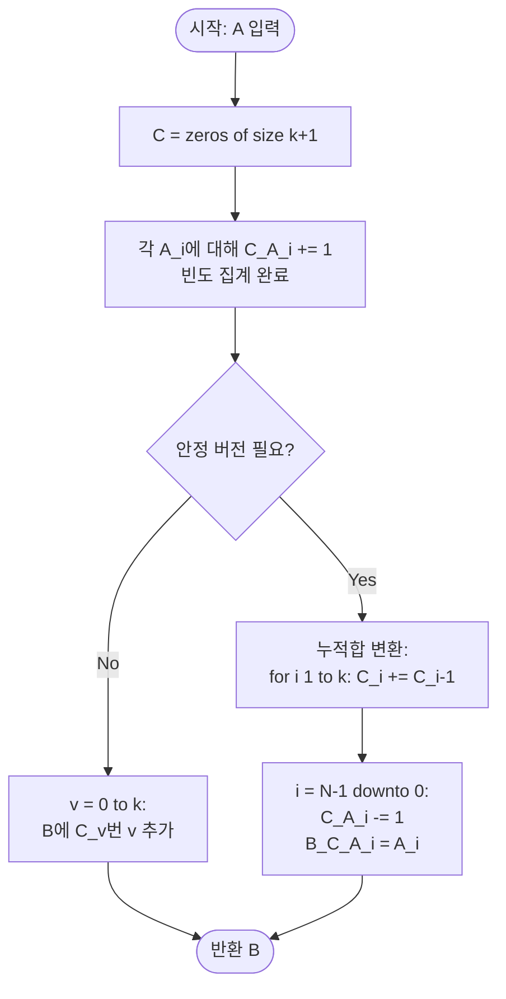

import { AlgorithmSimulation } from "#guide-sim";

# Counting Sort — 비교 없이 빈도만 세어도 정렬이 끝나는 이유

## 한눈에 보는 컨셉

원소가 정수이고 그 값의 범위가 좁게 제한돼 있다면, 두 원소를 직접 비교하지 않고도 "각 값이 몇 번 나왔는지"만 세어서 정렬 순서를 그대로 만들어낼 수 있어요. 정렬된 배열은 결국 "0이 몇 개, 1이 몇 개, …"를 값이 커지는 순서대로 풀어놓은 것과 같기 때문입니다. 이 관찰 하나로 비교 기반 정렬의 `O(N log N)` 하한을 완전히 우회해 `O(N + k)`에 정렬을 끝낼 수 있습니다.

## 출발점: 가장 순진한 방법부터

먼저 풀어야 할 문제를 정확히 고정할게요.

```ts
function countingSort(A: number[]): number[]
```

| 파라미터 | 의미 | 제약 |
|---------|------|------|
| `A` | 정렬할 비음 정수 배열 | $1 \leq N \leq 100{,}000$ (N은 `A.length`) |
| `A[i]` | 각 원소의 값 | $0 \leq A[i] \leq 1{,}000$ |

**반환값**: `A`의 모든 원소를 오름차순으로 정렬한 새 배열입니다. 원본 `A`는 건드리지 않습니다.

정렬 문제를 처음 마주치면 가장 정직한 방법은 두 원소를 직접 비교해서 큰 쪽을 뒤로 보내는 겁니다. 인접한 두 칸을 비교해 필요하면 자리를 바꾸는 일을 배열 전체에 반복하는 버블 정렬이 그 전형이에요.

```ts
function countingSortNaive(A: number[]): number[] {
  const B = [...A];
  for (let i = 0; i < B.length; i++) {
    for (let j = 0; j < B.length - 1 - i; j++) {
      if (B[j] > B[j + 1]) {
        [B[j], B[j + 1]] = [B[j + 1], B[j]];
      }
    }
  }
  return B;
}
```

작은 예로 비용을 체감해 볼게요.

```text
A = [3, 0, 1, 3, 1, 0]   (N = 6)

버블 정렬: 인접한 두 칸을 비교해 큰 값을 뒤로 보내는 일을 반복
비교 횟수 = N(N-1)/2 = 6·5/2 = 15번   (실제 실행: comparisons = 15, 일치)

N = 100,000이면:
N(N-1)/2 = 100,000 · 99,999 / 2 = 4,999,950,000 ≈ 5×10^9번 비교  →  1초 안에 불가능
```

퀵소트·머지소트로 바꿔도 비교 기반 정렬은 $\Omega(N \log N)$ 아래로는 못 내려갑니다. 그런데 이 문제에는 버블 정렬이 전혀 활용하지 않은 정보가 하나 있습니다 — 원소가 항상 $[0, 1{,}000]$ 범위의 정수라는 제약이에요. 값의 종류가 유한하다면, 비교하지 않고도 순서를 알아낼 방법이 있지 않을까요? 이것이 이번 절이 쫓아갈 단서입니다.

## 아이디어 자세히 들여다보기

### 등장 횟수만 세면 순서가 보인다 — 수식과 그림

작은 관찰 세 가지를 모아볼게요.

- **관찰 1 (값의 종류가 유한하다)**: 원소가 $[0, 1{,}000]$ 정수로 제한되어 있으니 가능한 값은 딱 1,001가지뿐입니다. 이 유한한 집합을 그대로 배열의 인덱스로 쓸 수 있어요.
- **관찰 2 (빈도만으로 순서가 정해진다)**: 정렬된 배열은 "0이 몇 개, 1이 몇 개, …, 1000이 몇 개"를 값이 커지는 순서대로 나열한 것과 똑같습니다. 각 값을 몇 번 반복해서 찍어낼지만 알면 비교 없이 출력을 만들 수 있어요.
- **관찰 3 (같은 값끼리 비교가 낭비다)**: 비교 기반 정렬은 값이 같은 원소끼리도 계속 비교합니다. 빈도만 세면 같은 값은 딱 한 번만 처리하면 됩니다.

이 관찰을 정식으로 적으면 **빈도 배열** $C$가 됩니다.

$$C[v] = \big|\{\, i \mid A[i] = v \,\}\big|, \qquad v \in [0, k]$$

$C[v]$는 값 $v$가 입력에 나타난 횟수예요. 작은 예로 직접 채워봅시다.

```text
A = [3, 0, 1, 3, 1, 0]

값별로 등장 횟수 세기:
  0 → 2번 (인덱스 1, 5)
  1 → 2번 (인덱스 2, 4)
  2 → 0번
  3 → 2번 (인덱스 0, 3)

C = [2, 2, 0, 2]
     0  1  2  3   ← 인덱스 자체가 값
```

잠깐, 손으로 한 번 확인해 볼까요? `A[0] = 3`이니 `C[3]`을 1 올려야겠죠 — 맞습니다, 위 표에 이미 반영돼 있어요. 나머지 다섯 개도 같은 방식으로 세면 `C = [2, 2, 0, 2]`가 나옵니다.

**왜 하필 배열이어야 할까요?** 값 $v$를 그대로 배열 인덱스로 쓰기 때문에 접근이 $O(1)$이고 해시 충돌 걱정도 없습니다. 만약 값의 범위를 미리 알 수 없었다면 해시맵을 써야 했겠지만, $k = 1{,}000$으로 고정돼 있으니 배열 하나가 더 가볍고 빠릅니다.

### 왜 모순 없이 작동하는가

이 알고리즘이 지키는 불변식은 이렇습니다.

> 루프가 $v = 0$부터 $t$까지 진행됐다면, 출력 배열 $B$는 $\sum_{v=0}^{t} C[v]$개의 원소를 오름차순으로 담고 있고, 그 다중집합은 $A$에서 값이 $t$ 이하인 원소들의 다중집합과 정확히 같다.

**기저(t = -1, 루프 시작 전)**: $B$는 비어 있고, "값이 -1 이하인 원소"는 존재하지 않으니 조건은 공허하게 참입니다.

**귀납 단계**: $v = 0, \ldots, t$까지 처리한 뒤 위 불변식이 성립한다고 가정합니다. $v = t+1$을 처리하면 $C[t+1]$개의 $(t+1)$을 $B$ 뒤에 이어붙입니다. $(t+1)$은 지금까지 넣은 모든 값(≤ $t$)보다 크므로 오름차순이 깨지지 않고, 정확히 $C[t+1]$개만 추가하니 원소 개수도 정확히 맞습니다. $v$는 $0$부터 $k$까지 반복문 정의상 딱 한 번씩만 방문되므로 경우가 완전합니다 — $A[i]$가 $[0,k]$를 벗어나는 경우는 제약상 아예 존재하지 않습니다.

**종료(t = k)**: 불변식이 곧 "$B$가 $A$ 전체의 정렬 결과"라는 뜻이 됩니다.

여기서 **헷갈리기 쉬운 포인트**가 둘 있습니다.

- **"정렬이면 항상 안정적이어야 하는 거 아닌가?"** 하는 오해입니다. 안정 정렬은 "같은 값의 원소들이 입력에서의 상대 순서를 유지"하는 걸 말해요. 그런데 이 문제는 순수한 정수만 정렬하므로, 값이 같으면 어느 인스턴스인지 애초에 구별할 수 없습니다.

  ```text
  A = [3a, 0, 1, 3b, 1, 0]   (3a, 3b는 같은 값 3의 서로 다른 인스턴스라고 표시만 해본 것)

  단순 버전 출력: [0, 0, 1, 1, 3, 3]  ← 3a와 3b 중 누가 먼저인지 값만으로는 구분 불가능
  값만 놓고 보면 완전히 올바른 정렬 결과입니다
  ```

  다만 각 값에 이름표(예: 학생 이름) 같은 부가 정보가 함께 붙어 있어서 그 상대 순서까지 지켜야 한다면 이야기가 달라집니다 — 이건 다음 절에서 안정 버전으로 다룹니다.

- **값 범위를 벗어나면 어떻게 될까요?** 제약대로라면 생기지 않지만, 만약 `A[i] = 1001`이 섞여 있었다면 `C[1001]`에 접근하려다 배열 경계를 넘습니다. 그래서 $k = 1{,}000$이라는 고정 범위를 코드에 명시해 두는 게 중요합니다.

엣지 케이스도 불변식 위에서 짚어 둘게요(모두 실제 실행으로 확인된 값입니다).

```text
빈 배열 []          → C가 전부 0 → 루프가 아무것도 추가하지 않음 → B = []
단일 원소 [5]        → C[5]=1, 나머지 0                        → B = [5]
전부 동일 [3,3,3]    → C[3]=3, 나머지 0                         → B = [3, 3, 3]
경계값 [0,1000,500] → C[0]=C[500]=C[1000]=1                   → B = [0, 500, 1000]
```

## 아이디어를 코드로 옮기기

방금 본 아이디어를 그대로 옮긴 코드입니다. 아직 안정성은 신경 쓰지 않은 **단순 버전**이에요.

```ts
function countingSortSimple(A: number[]): number[] {
  const k = 1000;
  const C = new Array(k + 1).fill(0); // 값 0..k, 그래서 크기는 k+1

  for (const v of A) {
    C[v]++;
  }

  const B: number[] = [];
  for (let v = 0; v <= k; v++) {
    for (let c = 0; c < C[v]; c++) {
      B.push(v);
    }
  }
  return B;
}
```

**가장 실수가 잦은 줄은 `for (let v = 0; v <= k; v++)`의 `<=`입니다.** `v < k`로 잘못 쓰면 `C[1000]`이 통째로 빠져서 값이 1000인 원소가 결과에서 사라져요. 더 위험한 건, 이때 반환 배열의 길이가 `N`보다 작아지는데도 에러 없이 조용히 통과해 버린다는 점입니다. 그다음으로 조심할 지점은 `new Array(k + 1)`의 크기예요 — 값이 $0$부터 $k$까지 $k+1$개이므로 배열 크기도 반드시 $k+1$이어야 합니다.

이 단순 버전은 이미 목표였던 `O(N + k)`를 만족합니다. 그런데 교과서에서 "counting sort"라고 하면 보통 **안정 정렬** 버전을 가리켜요. 값 자체만 정렬할 땐 안정성이 결과에 영향을 주지 않지만, radix sort의 부속 루틴으로 쓰이거나 (점수, 학생 이름)처럼 부가 정보를 함께 옮겨야 하는 상황에서는 안정성이 정확성 자체를 좌우합니다. 그래서 최종 구현은 누적합을 이용한 안정 버전으로 완성해 둘게요.

```ts
function countingSortStable(A: number[]): number[] {
  if (A.length === 0) return [];
  const k = Math.max(...A);           // 실제 최댓값으로 범위를 한정
  const C = new Array(k + 1).fill(0);

  for (const v of A) {
    C[v]++;
  }

  for (let i = 1; i <= k; i++) {
    C[i] += C[i - 1];                 // 누적합: C[v] = v 이하 원소의 총 개수
  }

  const B = new Array(A.length);
  for (let i = A.length - 1; i >= 0; i--) {
    const v = A[i];
    C[v]--;
    B[C[v]] = v;
  }
  return B;
}
```

**가장 중요한 두 줄은 `for (let i = 1; i <= k; i++) C[i] += C[i - 1];`와 `for (let i = A.length - 1; i >= 0; i--)`입니다.** 이 두 줄의 방향을 하나라도 바꾸면 조용히 틀립니다.

- **누적합을 반대 방향(오른쪽→왼쪽)으로 계산하면**: `A = [3, 0, 1, 3, 1, 0]`에서 정상 결과는 `[0, 0, 1, 1, 3, 3]`인데, 방향을 뒤집으면 `[3, 3, 1, 1, 0, 0]`이 나옵니다 — 정렬 방향 자체가 내림차순으로 뒤집혀 버려요. (실제로 뒤집어 실행해 확인한 값입니다.)
- **배치를 뒤에서 앞이 아니라 앞에서 뒤로 하면**: 같은 값 여러 개의 상대 순서가 뒤집힙니다. `A = [1, 1, 1]`의 누적합은 `C = [0, 3]`인데, 뒤에서 앞으로(`i = 2, 1, 0`) 배치하면 원본 인덱스 `[0, 1, 2]`가 최종 위치 `[0, 1, 2]`에 그대로 대응해 순서가 보존됩니다. 반대로 앞에서 뒤로(`i = 0, 1, 2`) 배치하면 최종 위치가 `[2, 1, 0]`으로 뒤집혀, 원본에서 첫 번째였던 원소가 결과에서는 오히려 마지막 자리로 밀려납니다. (실제 실행으로 확인된 값입니다.)

> 기억법: "누적합은 왼쪽부터, 배치는 오른쪽부터" — 두 방향이 서로 반대라는 점을 한 문장으로 기억해 두세요.

여기서 더 빠르게 만들 여지가 있을까요? **없습니다 — 그리고 이유가 명확합니다.** 어떤 정렬 알고리즘이든 입력 $N$개를 최소 한 번은 읽어야 하니 $\Omega(N)$은 피할 수 없는 하한이고, 이 문제는 $k = 1{,}000$이 고정된 상수이므로 $O(N+k) = O(N)$입니다. 즉 이미 이 문제가 허용하는 최선의 점근 복잡도에 도달해 있어서, 더 "빠른" 버전은 존재할 수 없습니다. 참고로 값 범위 $k$가 $N$보다 훨씬 큰 상황이라면 이야기가 달라져서, radix sort처럼 자릿수 단위로 counting sort를 여러 번 적용하는 확장이 쓰이지만, 이 문제의 $k \leq 1{,}000$ 조건에서는 그럴 필요가 없습니다.

## 실행 시각화

고정 입력 `A = [3, 0, 1, 3, 1, 0]`에 대해 **단순 버전**(`countingSortSimple`)을 실행하는 과정입니다. 위 array 패널은 출력 배열 `B`가 채워지는 모습(빨강은 방금 추가된 원소), 아래 keyValue 패널은 빈도 배열 `C[0..3]`의 스냅샷이에요. 실제 반환값은 `[0, 0, 1, 1, 3, 3]`이며, 시뮬레이션 마지막 프레임의 array와 정확히 일치합니다(스크래치 실행 결과와도 일치 확인됨).

> 대화형 시뮬레이션은 MDX 런타임에서 표시됩니다.

export const steps = [
  { title: "초기화", detail: "C 전체 0, B 비어 있음.", array: [], entries: [{ label: "C[0]", value: 0 }, { label: "C[1]", value: 0 }, { label: "C[2]", value: 0 }, { label: "C[3]", value: 0 }] },
  { title: "집계: 3", detail: "A[0]=3 → C[3]++", array: [], entries: [{ label: "C[0]", value: 0 }, { label: "C[1]", value: 0 }, { label: "C[2]", value: 0 }, { label: "C[3]", value: 1 }] },
  { title: "집계: 0", detail: "A[1]=0 → C[0]++", array: [], entries: [{ label: "C[0]", value: 1 }, { label: "C[1]", value: 0 }, { label: "C[2]", value: 0 }, { label: "C[3]", value: 1 }] },
  { title: "집계: 1", detail: "A[2]=1 → C[1]++", array: [], entries: [{ label: "C[0]", value: 1 }, { label: "C[1]", value: 1 }, { label: "C[2]", value: 0 }, { label: "C[3]", value: 1 }] },
  { title: "집계: 3, 1, 0", detail: "남은 원소까지 집계. C = [2, 2, 0, 2].", array: [], entries: [{ label: "C[0]", value: 2 }, { label: "C[1]", value: 2 }, { label: "C[2]", value: 0 }, { label: "C[3]", value: 2 }] },
  { title: "출력 v=0", detail: "C[0]=2 → 0을 2개 추가.", array: [0, 0], highlight: [0, 1], entries: [{ label: "C[0]", value: 2 }, { label: "C[1]", value: 2 }, { label: "C[2]", value: 0 }, { label: "C[3]", value: 2 }] },
  { title: "출력 v=1", detail: "C[1]=2 → 1을 2개 추가.", array: [0, 0, 1, 1], highlight: [2, 3], entries: [{ label: "C[0]", value: 2 }, { label: "C[1]", value: 2 }, { label: "C[2]", value: 0 }, { label: "C[3]", value: 2 }] },
  { title: "출력 v=2", detail: "C[2]=0 → 추가 없음.", array: [0, 0, 1, 1], entries: [{ label: "C[0]", value: 2 }, { label: "C[1]", value: 2 }, { label: "C[2]", value: 0 }, { label: "C[3]", value: 2 }] },
  { title: "출력 v=3", detail: "C[3]=2 → 3을 2개 추가.", array: [0, 0, 1, 1, 3, 3], highlight: [4, 5], entries: [{ label: "C[0]", value: 2 }, { label: "C[1]", value: 2 }, { label: "C[2]", value: 0 }, { label: "C[3]", value: 2 }] },
  { title: "완료: [0, 0, 1, 1, 3, 3]", detail: "모든 값 출력 완료. 오름차순 정렬됨.", array: [0, 0, 1, 1, 3, 3], marked: [0, 1, 2, 3, 4, 5], entries: [{ label: "C[0]", value: 2 }, { label: "C[1]", value: 2 }, { label: "C[2]", value: 0 }, { label: "C[3]", value: 2 }] },
];

<AlgorithmSimulation view={["array", "keyValue"]} steps={steps} title="계수 정렬: A = [3, 0, 1, 3, 1, 0]" />

## 흐름 한눈에 보기



## 스스로 점검하기

1. `A = [2, 0, 2, 1]`에 대해 빈도 배열 `C[0..2]`를 손으로 채우고, 최종 정렬 결과를 구해 보세요. (정답: `C = [1, 1, 2]`, 결과는 `[0, 1, 2, 2]`입니다.)
2. 누적합을 `for (let i = k - 1; i >= 0; i--) C[i] += C[i + 1];`처럼 반대 방향으로 계산하는 버그가 있다고 합시다. `A = [3, 0, 1, 3, 1, 0]`을 이 버그 있는 코드에 넣으면 어떤 배열이 나올지 먼저 예측해 보고, 본문의 실측값과 맞는지 확인해 보세요. 왜 하필 그 순서로 뒤집히는지도 설명해 보세요.
3. 값의 범위가 $[0, 10^9]$처럼 확 넓어진다면(단, $N$은 여전히 최대 $10^5$), 지금 이 알고리즘을 그대로 쓸 수 있을까요? `O(N+k)`에서 어느 항이 문제가 되는지 짚고, 어떤 대안을 떠올릴 수 있는지 생각해 보세요.
