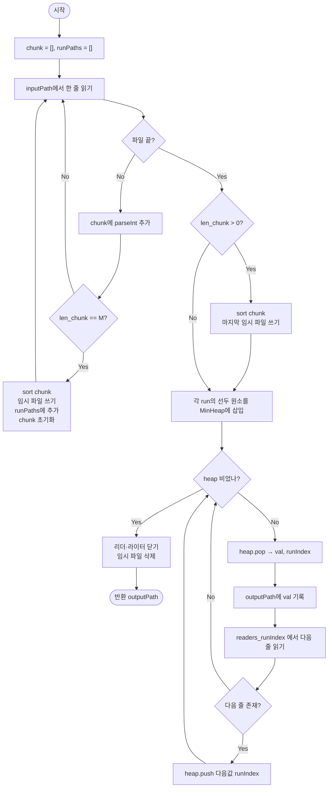

import { AlgorithmSimulation } from "#guide-sim";

# External Merge Sort — 메모리에 다 못 올리는 데이터를 "나눠서 정렬하고 병합만" 하면 되는 이유

## 한눈에 보는 컨셉

파일 하나가 메모리보다 훨씬 클 때, 통째로 올려 정렬하는 건 애초에 선택지가 아니에요. 대신 메모리에 들어갈 만큼씩 잘라 각각 정렬해 디스크에 저장해 두고(run), 그 정렬된 run들을 한 번에 하나씩만 들여다보며 병합하면 전체를 정렬할 수 있습니다. 핵심 관찰은 "R개의 정렬된 run을 병합할 때 다음에 나올 값은 항상 각 run의 맨 앞 원소 중 하나"라는 것이고, 이 맨 앞 원소들 중 최솟값을 빠르게 찾는 도구가 min-heap이에요. 이렇게 하면 메모리는 `O(M + R)`만 쓰면서 전체는 `O(N log N)`에, 디스크는 `O(N)`번만 읽고 씁니다.

## 출발점: 가장 순진한 방법부터

문제를 정확히 잡을게요.

```ts
async function externalMergeSort(
  inputPath: string,
  outputPath: string,
  memoryLimit: number,
): Promise<string>
```

| 파라미터 | 의미 | 제약 |
|---------|------|------|
| `inputPath` | 한 줄에 정수 하나씩 저장된 입력 파일 경로 | 파일이 존재해야 함 |
| `outputPath` | 정렬 결과를 기록할 출력 파일 경로 | 쓰기 권한 필요 |
| `memoryLimit`($M$) | 동시에 메모리에 올릴 수 있는 정수 개수 | $1 \leq M \leq N$ |

반환값은 `outputPath`와 동일한 문자열이고(비동기라서 `Promise`로 감싸 반환), 입력 정수 개수 $N$은 $1 \leq N \leq 10^7$, 각 정수는 $-10^9 \leq v \leq 10^9$ 범위입니다.

가장 정직한 방법은 "일단 다 읽고 한 번에 정렬"입니다.

```ts
async function externalMergeSortNaive(inputPath: string, outputPath: string): Promise<string> {
  const text = await Bun.file(inputPath).text();
  const nums = text.trim().split("\n").map((line) => parseInt(line, 10));
  nums.sort((a, b) => a - b);           // O(N log N), 하지만 N개 전부 메모리에
  await Bun.write(outputPath, nums.map(String).join("\n") + "\n");
  return outputPath;
}
```

시간만 보면 `O(N log N)`으로 이미 목표치예요. 문제는 메모리입니다.

```text
N = 10,000,000개 정수, 4바이트 기준 ≈ 40MB
서버가 허용하는 동시 적재량 M = 1,000,000개 (≈ 4MB)

nums.sort() 를 호출하는 순간 필요한 메모리: 40MB
서버가 허용하는 한도:                        4MB
40MB > 4MB → 프로세스가 메모리 한도를 넘겨 죽는다
```

$M$이 $N$보다 훨씬 작으면 `nums` 배열 자체를 만드는 순간 이미 한도를 넘습니다. 알고리즘을 아무리 잘 짜도 "N개를 동시에 들고 있는 자료구조"가 코드 어딘가에 있으면 이 접근은 살아남지 못해요. **메모리에 못 올리는 게 확정이라면, 디스크를 작업 공간으로 써야 한다**는 낌새가 여기서 나옵니다.

## 아이디어 자세히 들여다보기

### 잘라서 정렬하고, 머리만 보며 병합하기 — 수식과 그림

메모리에 한 번에 $M$개까지만 올릴 수 있다면, 입력을 $M$개씩 끊어서 그 조각만 정렬하면 됩니다. 이 정렬된 조각을 **run**이라고 불러요. run 개수는

$$R = \left\lceil \frac{N}{M} \right\rceil$$

작은 예로 확인해 봅시다. $N=9$, $M=3$, 데이터 `5 1 8 3 7 2 9 4 6`이면 $R = \lceil 9/3 \rceil = 3$이고,

```text
청크1: [5, 1, 8] → 정렬 → Run1 = [1, 5, 8]
청크2: [3, 7, 2] → 정렬 → Run2 = [2, 3, 7]
청크3: [9, 4, 6] → 정렬 → Run3 = [4, 6, 9]
```

이제 3개의 정렬된 run을 병합해서 최종 정렬 결과를 만들어야 해요. 여기서 중요한 사실 하나 — **전체에서 지금까지 아직 안 뽑은 값 중 가장 작은 값은, 반드시 어느 run이든 그 run의 "아직 안 뽑은 부분 중 맨 앞"에 있습니다.** run 내부는 이미 오름차순이니, run의 중간이나 끝에 있는 값이 맨 앞 값보다 작을 수는 없거든요.

```text
Run1 남음: [1, 5, 8]   맨 앞 = 1
Run2 남음: [2, 3, 7]   맨 앞 = 2
Run3 남음: [4, 6, 9]   맨 앞 = 4

전체 최솟값 후보 = {1, 2, 4} 중 최솟값 = 1  ← Run1에서 나온다
1을 뽑아 출력하고, Run1의 다음 값 5를 새 후보로 올린다
```

즉 병합은 "각 run의 맨 앞 원소들(후보 $R$개) 중 최솟값을 뽑고, 뽑힌 run의 다음 원소로 후보를 교체하는" 과정을 반복하는 일이에요. 이 후보 집합을 $H = \{h_1, \dots, h_R\}$이라 하면, 매 단계는

$$v = \min(H), \quad \text{write}(v), \quad H \leftarrow (H \setminus \{v\}) \cup \{\text{next element of the run that produced } v\}$$

여기서 확인 질문 하나 — 왜 "각 run의 맨 앞"만 보면 충분하고, run의 두 번째·세 번째 원소까지 같이 비교할 필요가 없을까요? 답은 위 관찰 그대로예요. run이 오름차순이므로 맨 앞보다 작은 값은 그 run 안에 이미 없고, 맨 앞이 뽑히기 전까지 두 번째 원소가 전체 최솟값 후보가 될 일이 없습니다.

### 단서를 설명해 주는 이론 — K-way 병합과 최솟값 선택

이 "후보 중 최솟값을 뽑고 교체한다"는 패턴은 사실 새로운 게 아니라, 일반 merge sort의 병합 단계를 일반화한 것입니다.

일반 merge sort의 병합은 정확히 **2-way**예요. 정렬된 두 배열을 병합할 때 각 배열에 포인터를 하나씩 두고, 두 포인터가 가리키는 값 중 작은 쪽을 내보내는 식이죠. 후보가 딱 2개뿐이니 "둘 중 작은 쪽"은 비교 한 번(`O(1)`)으로 끝납니다.

우리 문제는 이걸 **R-way**로 확장한 것이에요 — 후보가 2개가 아니라 $R$개입니다. 후보가 2개일 땐 비교 1회로 충분했지만, $R$개가 되는 순간 "이 $R$개 중 최솟값을 어떻게 빨리 찾을까"라는 새로운 질문이 생겨요. 이것이 바로 **반복적으로 최솟값을 뽑고, 그 자리에 새 원소를 채워 넣는** 동작을 최적화하는 문제 — 즉 **선택(selection)을 반복하는 자료구조**가 필요한 상황입니다. 이 역할을 정확히 수행하도록 설계된 자료구조가 다음 절에서 볼 min-heap(우선순위 큐)이에요.

여기서 미리 예고해 둘 게 하나 있어요. "$R$개 중 최솟값 찾기"를 매번 $R$개를 전부 훑어서 찾을 수도 있고(선형 탐색), heap으로 찾을 수도 있습니다. 결과는 같지만 **속도가 다릅니다** — 이 차이를 뒤에서 "더 빠르게 만들 단서 찾기"에서 직접 실측해 볼게요.

### 셈을 맡는 자료구조 — min-heap

$R$개 후보 중 최솟값을 뽑고 새 값을 채워 넣는 연산을 각각 `O(log R)`에 해내는 자료구조가 min-heap입니다. 이 문제에서 min-heap이 맡는 역할은 딱 하나예요 — "현재 각 run의 맨 앞 원소들 중 최솟값이 무엇인지"를 항상 빠르게 답해 주는 것. heap 자체의 내부 동작(sift-up/sift-down)이 궁금하다면 이 프로젝트의 [minHeap 가이드](../../../data-structures/heap/minHeap/minHeap-guide.mdx)를 참고하세요 — 여기서는 "삽입·최솟값 추출을 각각 `O(log R)`에 해내는 상자"로만 쓰면 충분합니다.

heap에 넣는 원소는 값만이 아니라 `(값, 어느 run에서 왔는지)` 쌍입니다. 값이 같은 원소가 여러 run에 걸쳐 있을 수 있으므로, run 인덱스까지 같이 넣어야 "이 값을 뽑은 뒤 어느 run에서 다음 값을 읽어야 하는지"를 알 수 있어요.

### 왜 모순 없이 작동하는가

이 알고리즘이 항상 지키는 불변식은 하나입니다.

> heap은 **아직 소진되지 않은 각 run의 현재 맨 앞 원소**를 정확히 1개씩 보유한다.

**기저(Phase 1 종료 직후):** 각 run에서 첫 번째 원소를 heap에 넣습니다. run이 $R$개이므로 heap에는 정확히 $R$개(또는 그보다 적을 수 없이 각 run당 1개)의 원소가 들어갑니다 — 불변식이 성립합니다.

**귀납 단계:** 어느 시점에 불변식이 성립한다고 가정해 봅시다. heap에서 최솟값 $v$(run $r$에서 옴)를 뽑으면, 이 시점에서 나올 수 있는 경우는 정확히 두 가지뿐입니다.

- **(경우 1) run $r$에 다음 원소가 있다.** 그 다음 원소를 heap에 넣으면, run $r$은 여전히 정확히 1개의 원소를 heap에 갖습니다 — 불변식 유지.
- **(경우 2) run $r$이 소진됐다.** heap에 아무것도 넣지 않으면, run $r$은 "소진된 run"이 되어 애초에 불변식이 요구하는 대상(소진되지 않은 run)에서 빠집니다 — 불변식은 나머지 run들에 대해 그대로 유지.

이 두 경우가 전부입니다 — run $r$은 다음 원소가 있거나 없거나 둘 중 하나이므로, 세 번째 경우는 없어요.

이제 $v$가 왜 "아직 출력 안 된 값 중 전체 최솟값"인지 봅시다. $v$는 뽑히는 순간 heap에 있는 모든 후보(각 활성 run의 맨 앞)보다 작거나 같습니다(heap의 정의). 그리고 각 run은 오름차순이므로, 아직 출력되지 않은 값 중 활성 run의 맨 앞이 아닌 값은 전부 그 run의 맨 앞보다 크거나 같습니다. 즉 $v$보다 작은 값은 어디에도 남아 있지 않습니다 — $v$가 전체 최솟값이라는 뜻이에요. 이 논증이 매 pop마다 성립하므로, 출력 순서는 귀납적으로 전체 정렬 순서와 일치합니다.

**종료:** 각 원소는 정확히 한 번 heap에 들어가고 정확히 한 번 나옵니다(run에 남은 원소가 없으면 더 넣지 않으므로). 총 $N$번 pop한 뒤 heap이 비고, 이때 모든 원소가 출력 파일에 기록된 상태입니다.

여기서 **헷갈리기 쉬운 포인트**가 둘 있습니다.

- **run 소진 처리를 빠뜨리면 어떻게 될까요?** "다음 원소가 있는지 확인하지 않고 무조건 heap에 넣는다"고 해 봅시다. run이 소진된 뒤에도 계속 읽기를 시도하면 `null`을 돌려받는데, 이걸 그대로 `parseInt(null)`에 넣으면 `NaN`이 됩니다. 실제로 재현해 보면:

```text
Run1=[1,5,8], Run2=[2,3,7], Run3=[4,6,9] 병합 중
소진 확인 없이 계속 push 하면:

정상 구간: 1, 2, 3, 4, 5, 6, 7, 8   (여기까지는 맞음)
그 다음:   NaN, NaN, NaN, NaN, ...  (모든 run이 소진된 뒤에도 계속 push)

NaN은 어떤 값과 비교해도 "크다/작다"가 전부 false이므로
heap의 정렬 불변식이 깨지고, 루프가 정상 종료되지 않는다
```

  (위 수치는 소진 확인을 뺀 코드를 실제로 실행해 확인한 값입니다.) 그래서 "다음 원소가 있는가"를 매번 확인하고, 없으면 heap에 아무것도 넣지 않는 분기가 반드시 있어야 해요.

- **마지막 불완전 청크를 빠뜨리면 어떻게 될까요?** $N=7$, $M=3$이라면 청크는 `[크기3][크기3][크기1]`로 나뉘는데, 마지막 청크는 3개를 채우지 못해 루프 안의 "$M$개가 찼을 때" 조건에 걸리지 않습니다. 루프가 끝난 뒤 "남은 게 있으면 flush" 처리를 빠뜨리면:

```text
입력: 5 1 8 3 7 2 9   (N=7, M=3)

flush 있음: Run1=[1,5,8], Run2=[2,3,7], Run3=[9]      → 병합 결과 [1,2,3,5,7,8,9]  (정답)
flush 없음: Run1=[1,5,8], Run2=[2,3,7]                → 병합 결과 [1,2,3,5,7,8]    (9가 사라짐!)
```

  (두 결과 모두 실제로 실행해 확인했습니다.) 원소 하나가 통째로 유실되는데, 겉으로는 에러가 나지 않고 그냥 "짧은" 정답처럼 보여서 알아채기 어렵습니다.

엣지 케이스도 같은 불변식 위에서 확인해 둘게요.

```text
N = 0 (빈 파일)         → run이 0개, heap도 처음부터 비어 있음 → 빈 출력 파일 반환
N ≤ M                    → run이 1개 → heap에 원소 1개로 시작 → 그 run을 그대로 순서대로 출력
M = 1                    → run이 N개, heap 크기 최대 N → 여전히 불변식 그대로 성립
동일 값 다수             → heap의 tie-break(run 인덱스)로 결정론적 순서만 정해질 뿐, 정확성은 그대로
```

## 아이디어를 코드로 옮기기

앞 절의 아이디어를 그대로 옮기되, "$R$개 중 최솟값 찾기"를 가장 쉬운 방법 — **매번 $R$개를 전부 훑는 선형 탐색**으로 구현해 봅니다. 파일을 한 줄씩 읽는 스트리밍 리더가 필요하니 그것부터 준비해요.

```ts
import { unlink } from "node:fs/promises";

class LineReader {
  private stream: ReadableStreamDefaultReader<Uint8Array>;
  private decoder = new TextDecoder();
  private buffer = "";
  private streamDone = false;

  constructor(path: string) {
    this.stream = Bun.file(path).stream().getReader();
  }

  private async fill(): Promise<void> {
    if (this.streamDone) return;
    const { value, done } = await this.stream.read();
    if (done) { this.streamDone = true; return; }
    this.buffer += this.decoder.decode(value, { stream: true });
  }

  async readLine(): Promise<string | null> {
    for (;;) {
      const idx = this.buffer.indexOf("\n");
      if (idx >= 0) {
        const line = this.buffer.slice(0, idx);
        this.buffer = this.buffer.slice(idx + 1);
        return line;
      }
      if (this.streamDone) {
        if (this.buffer.length > 0) { const line = this.buffer; this.buffer = ""; return line; }
        return null;
      }
      await this.fill();
    }
  }
}

async function writeIntLines(path: string, nums: number[]): Promise<void> {
  await Bun.write(path, nums.length > 0 ? nums.map(String).join("\n") + "\n" : "");
}

// Phase 1: 입력을 M개씩 읽어 정렬 후 run 파일로 저장 (chunk 하나만 메모리에 유지)
async function generateRuns(inputPath: string, M: number, tmpPrefix: string): Promise<string[]> {
  const reader = new LineReader(inputPath);
  const runPaths: string[] = [];
  let chunk: number[] = [];
  let runIndex = 0;

  for (;;) {
    const line = await reader.readLine();
    if (line === null) break;
    chunk.push(parseInt(line, 10));
    if (chunk.length === M) {
      chunk.sort((a, b) => a - b);
      const p = `${tmpPrefix}_${runIndex++}.txt`;
      await writeIntLines(p, chunk);
      runPaths.push(p);
      chunk = [];
    }
  }
  if (chunk.length > 0) {                        // 마지막 불완전 청크 flush
    chunk.sort((a, b) => a - b);
    const p = `${tmpPrefix}_${runIndex++}.txt`;
    await writeIntLines(p, chunk);
    runPaths.push(p);
  }
  return runPaths;
}

// Phase 2: 각 run의 맨 앞 원소를 배열에 두고, 매번 선형 탐색으로 최솟값을 찾는다
async function externalMergeSortLinearScan(
  inputPath: string,
  outputPath: string,
  memoryLimit: number,
): Promise<string> {
  const runPaths = await generateRuns(inputPath, memoryLimit, `${outputPath}.run`);
  if (runPaths.length === 0) { await Bun.write(outputPath, ""); return outputPath; }

  const readers = runPaths.map((p) => new LineReader(p));
  const heads: (number | null)[] = new Array(readers.length).fill(null);
  for (let i = 0; i < readers.length; i++) {
    const line = await readers[i]!.readLine();
    heads[i] = line === null ? null : parseInt(line, 10);
  }

  const outLines: string[] = [];
  for (;;) {
    let minIdx = -1;
    for (let i = 0; i < heads.length; i++) {                       // R개를 전부 훑는다
      const v = heads[i];
      if (v === null) continue;
      if (minIdx === -1 || v < (heads[minIdx] as number)) minIdx = i;
    }
    if (minIdx === -1) break;                                      // 모든 run 소진
    outLines.push(String(heads[minIdx]));
    const nextLine = await readers[minIdx]!.readLine();
    heads[minIdx] = nextLine === null ? null : parseInt(nextLine, 10); // 소진 확인 후 교체
  }

  await Bun.write(outputPath, outLines.length > 0 ? outLines.join("\n") + "\n" : "");
  for (const p of runPaths) await unlink(p);
  return outputPath;
}
```

가장 중요한 부분은 **`for (;;)` 안의 선형 탐색 루프**입니다 — `heads` 배열을 처음부터 끝까지 훑어 `null`이 아닌 값 중 최솟값을 찾아요. 그리고 `heads[minIdx] = nextLine === null ? null : ...` 이 줄이 앞 절에서 본 "run 소진 확인"을 정확히 구현한 부분입니다 — `nextLine`이 `null`이면 그 run 자리를 `null`로 남겨 두어("이 run은 이제 후보가 아니다"), 다음 선형 탐색에서 자연스럽게 건너뛰게 만들어요.

## 더 빠르게 만들 단서 찾기

방금 구현을 그대로 두면 얼마나 느릴까요? `heads` 배열 훑기는 매번 $R$번의 비교가 필요하고, 이걸 $N$번(전체 원소 수만큼) 반복하므로 총 비교 횟수는 $O(N \cdot R)$입니다. run이 몇 개 안 되면($R$이 작으면) 별문제 없지만, $M$이 작아 $R$이 커지면 얘기가 달라져요.

```text
N = 10,000, M = 10  →  R = 1,000

선형 탐색 비교 횟수 상한:  N × R = 10,000 × 1,000 = 10,000,000회
힙 사용 시 비교 횟수 상한:  약 2N·log₂R ≈ 2 × 10,000 × log₂1000 ≈ 199,316회

같은 입력인데 약 50배 차이
```

(위 두 수치는 실제 계산식으로 산출한 상한값입니다.) $R$이 커질수록 매번 "R개를 전부 훑는" 비용이 그대로 배로 늘어나는데, 정작 우리가 필요한 건 "R개 중 최솟값 1개"뿐이에요. **R개 전부를 매번 다시 보는 대신, 최솟값을 더 빨리 찾아낼 구조가 없을까?** — 이게 이번 단서이고, 앞서 이론 절에서 예고했던 바로 그 지점입니다.

## 단서를 최적화로 연결하기

정답은 이미 3.3절에서 준비해 뒀습니다 — min-heap을 씁니다. `heads` 배열을 통째로 훑는 대신, "현재 후보들"을 min-heap에 넣어 두면 최솟값 조회와 교체가 각각 `O(log R)`로 끝나요.

```text
Before (선형 탐색):  heads = [null, 3, 7]  →  매번 배열 전체를 훑어 최솟값을 찾는다
After  (min-heap):   heap  = [(3,idx1), (7,idx2)]  →  루트만 보면 최솟값, pop/push는 O(log R)
```

바뀌는 불변식은 없습니다 — "활성 run마다 맨 앞 원소를 정확히 1개씩 보유"라는 3.4절의 불변식은 그대로고, 그 원소들을 **어디에 보관하느냐**(배열 vs heap)만 달라집니다.

## 최적화 코드

바뀌는 곳은 "현재 후보들을 보관하는 자료구조"와 그걸 다루는 부분뿐입니다. `generateRuns`, `LineReader`, `writeIntLines`는 그대로 재사용해요.

```ts
import { unlink } from "node:fs/promises";

type HeapEntry = { value: number; runIndex: number };

class MinHeap {
  private items: HeapEntry[] = [];
  get size(): number { return this.items.length; }

  private less(a: HeapEntry, b: HeapEntry): boolean {
    if (a.value !== b.value) return a.value < b.value;
    return a.runIndex < b.runIndex;              // 값이 같을 때 결정론적 tie-break
  }

  push(e: HeapEntry): void {
    const items = this.items;
    items.push(e);
    let i = items.length - 1;
    while (i > 0) {
      const parent = (i - 1) >> 1;
      if (this.less(items[i]!, items[parent]!)) {
        [items[i], items[parent]] = [items[parent]!, items[i]!];
        i = parent;
      } else break;
    }
  }

  pop(): HeapEntry | undefined {
    const items = this.items;
    if (items.length === 0) return undefined;
    const top = items[0]!;
    const last = items.pop()!;
    if (items.length > 0) {
      items[0] = last;
      let i = 0;
      for (;;) {
        const l = 2 * i + 1, r = 2 * i + 2;
        let smallest = i;
        if (l < items.length && this.less(items[l]!, items[smallest]!)) smallest = l;
        if (r < items.length && this.less(items[r]!, items[smallest]!)) smallest = r;
        if (smallest === i) break;
        [items[i], items[smallest]] = [items[smallest]!, items[i]!];
        i = smallest;
      }
    }
    return top;
  }
}

export async function externalMergeSort(
  inputPath: string,
  outputPath: string,
  memoryLimit: number,
): Promise<string> {
  const runPaths = await generateRuns(inputPath, memoryLimit, `${outputPath}.run`);
  if (runPaths.length === 0) { await Bun.write(outputPath, ""); return outputPath; }

  const readers = runPaths.map((p) => new LineReader(p));
  const heap = new MinHeap();
  for (let i = 0; i < readers.length; i++) {
    const line = await readers[i]!.readLine();
    if (line !== null) heap.push({ value: parseInt(line, 10), runIndex: i }); // 소진 확인
  }

  const outLines: string[] = [];
  while (heap.size > 0) {
    const { value, runIndex } = heap.pop()!;           // O(log R) 최솟값 추출
    outLines.push(String(value));
    const nextLine = await readers[runIndex]!.readLine();
    if (nextLine !== null) {                           // 소진 확인 후에만 재삽입
      heap.push({ value: parseInt(nextLine, 10), runIndex });
    }
  }

  await Bun.write(outputPath, outLines.length > 0 ? outLines.join("\n") + "\n" : "");
  for (const p of runPaths) await unlink(p);
  return outputPath;
}
```

**가장 중요한 줄은 `if (nextLine !== null)` 두 곳입니다.** 이 확인이 바로 3.4절에서 본 "run 소진 처리"를 정확히 구현한 부분이에요 — 이 확인을 빼먹으면 `parseInt(null)`이 `NaN`이 되어 heap에 들어가고, 위에서 실측한 대로 정상 종료되지 않습니다. 순서를 바꿔서 "pop 먼저, 소진 확인 없이 무조건 push"로 쓰면 겉보기엔 코드가 짧아 보이지만 조용히 무한 루프에 빠져요.

> 확장을 먼저 채우고, 소진은 반드시 확인한 뒤에만 다시 채운다.

여기서 더 최적화할 여지가 있을까요? 지금 시간 복잡도는 Phase 1의 `O(N log M)`(청크 정렬)과 Phase 2의 `O(N log R)`(heap 연산)을 더한 `O(N log M + N log R)`인데, $M \cdot R \approx N$이므로 $\log M + \log R \approx \log N$이 되어 목표였던 `O(N log N)`과 정확히 일치합니다. 디스크 I/O도 입력을 Phase 1에서 한 번 읽고 쓰고, Phase 2에서 각 run을 한 번씩 읽어 출력에 한 번 쓰므로 `O(N)`이에요. 두 목표 모두 달성했고, 비교 기반 정렬은 결정 트리 논증으로 `Ω(N log N)`번의 비교가 필요하다는 하한이 있으므로(어떤 비교 기반 정렬도 이보다 빠를 수 없습니다) 시간 쪽은 점근적으로 더 줄일 여지가 없습니다. 디스크 I/O도 모든 원소를 최소 한 번은 읽고 써야 하므로 `Ω(N)`이 자명한 하한이고, 이미 그 하한에 닿아 있어요.

참고로 실무에서는 run 개수 $R$이 아주 커지면 **다단계 병합(multi-pass merge)** — run들을 한 번에 다 병합하지 않고 여러 라운드에 걸쳐 병합하는 방식 — 을 쓰기도 하지만, 이는 "한 번에 열 수 있는 파일 디스크립터 수" 같은 운영체제 제약을 우회하기 위한 것이지 점근 복잡도를 더 줄이는 최적화는 아닙니다. 이 알고리즘의 가치는 어떤 비교 가능한 데이터에도 그대로 적용되는 **범용성**에 있어요.

## 실행 시각화

고정 입력 `N = 9`, `M = 3`, 데이터 `5 1 8 3 7 2 9 4 6`에 대한 진행 과정입니다. Phase 1에서 3개씩 잘라 정렬해 Run 3개(R1=[1,5,8], R2=[2,3,7], R3=[4,6,9])를 만들고, Phase 2에서 각 run의 맨 앞 원소만 min-heap에 유지하며 병합합니다. `priorityQueue` 패널은 현재 heap(라벨=값·run), `keyValue` 패널은 각 run에 남은 원소와 출력 파일 내용을 보여줘요. 실제로 위 최적화 코드를 이 입력에 실행한 결과 파일 내용은 `[1, 2, 3, 4, 5, 6, 7, 8, 9]`이며, 아래 시뮬레이션의 마지막 프레임과 일치합니다.

> 대화형 시뮬레이션은 MDX 런타임에서 표시됩니다.

export const steps = [
  {
    title: "Phase 1: Run 생성",
    detail: "3개씩 잘라 정렬 → R1=[1,5,8], R2=[2,3,7], R3=[4,6,9].",
    heap: [],
    entries: [
      { label: "R1", value: "[1, 5, 8]" },
      { label: "R2", value: "[2, 3, 7]" },
      { label: "R3", value: "[4, 6, 9]" },
      { label: "output", value: "[]" },
    ],
  },
  {
    title: "Phase 2: 힙 초기화",
    detail: "각 Run의 선두 원소를 힙에 삽입: 1(R1), 2(R2), 4(R3).",
    heap: [{ label: "1·R1", key: 1 }, { label: "2·R2", key: 2 }, { label: "4·R3", key: 4 }],
    entries: [
      { label: "R1 남음", value: "[5, 8]" },
      { label: "R2 남음", value: "[3, 7]" },
      { label: "R3 남음", value: "[6, 9]" },
      { label: "output", value: "[]" },
    ],
  },
  {
    title: "pop 1 (R1)",
    detail: "최솟값 1 출력. R1의 다음 5를 힙에 삽입.",
    heap: [{ label: "2·R2", key: 2 }, { label: "4·R3", key: 4 }, { label: "5·R1", key: 5 }],
    entries: [
      { label: "R1 남음", value: "[8]" },
      { label: "output", value: "[1]" },
    ],
  },
  {
    title: "pop 2 (R2)",
    detail: "최솟값 2 출력. R2의 다음 3을 힙에 삽입.",
    heap: [{ label: "3·R2", key: 3 }, { label: "4·R3", key: 4 }, { label: "5·R1", key: 5 }],
    entries: [
      { label: "R2 남음", value: "[7]" },
      { label: "output", value: "[1, 2]" },
    ],
  },
  {
    title: "pop 3 (R2)",
    detail: "최솟값 3 출력. R2의 다음 7을 힙에 삽입.",
    heap: [{ label: "4·R3", key: 4 }, { label: "5·R1", key: 5 }, { label: "7·R2", key: 7 }],
    entries: [
      { label: "R2 남음", value: "[]" },
      { label: "output", value: "[1, 2, 3]" },
    ],
  },
  {
    title: "pop 4 (R3)",
    detail: "최솟값 4 출력. R3의 다음 6을 힙에 삽입.",
    heap: [{ label: "5·R1", key: 5 }, { label: "6·R3", key: 6 }, { label: "7·R2", key: 7 }],
    entries: [
      { label: "R3 남음", value: "[9]" },
      { label: "output", value: "[1, 2, 3, 4]" },
    ],
  },
  {
    title: "pop 5 (R1)",
    detail: "최솟값 5 출력. R1의 다음 8을 힙에 삽입.",
    heap: [{ label: "6·R3", key: 6 }, { label: "7·R2", key: 7 }, { label: "8·R1", key: 8 }],
    entries: [
      { label: "R1 남음", value: "[]" },
      { label: "output", value: "[1, 2, 3, 4, 5]" },
    ],
  },
  {
    title: "pop 6 (R3)",
    detail: "최솟값 6 출력. R3의 다음 9를 힙에 삽입.",
    heap: [{ label: "7·R2", key: 7 }, { label: "8·R1", key: 8 }, { label: "9·R3", key: 9 }],
    entries: [
      { label: "R3 남음", value: "[]" },
      { label: "output", value: "[1, 2, 3, 4, 5, 6]" },
    ],
  },
  {
    title: "pop 7 (R2) → R2 소진",
    detail: "최솟값 7 출력. R2는 다음 원소가 없어 삽입하지 않음.",
    heap: [{ label: "8·R1", key: 8 }, { label: "9·R3", key: 9 }],
    entries: [
      { label: "output", value: "[1, 2, 3, 4, 5, 6, 7]" },
    ],
  },
  {
    title: "pop 8 (R1) → R1 소진",
    detail: "최솟값 8 출력. R1 소진.",
    heap: [{ label: "9·R3", key: 9 }],
    entries: [
      { label: "output", value: "[1, 2, 3, 4, 5, 6, 7, 8]" },
    ],
  },
  {
    title: "pop 9 (R3) → 힙 빔",
    detail: "최솟값 9 출력. R3 소진, 힙이 비어 종료.",
    heap: [],
    entries: [
      { label: "output", value: "[1, 2, 3, 4, 5, 6, 7, 8, 9]" },
    ],
  },
  {
    title: "완료: 임시 파일 삭제 후 반환",
    detail: "출력 파일에 [1..9] 기록. Run 임시 파일 삭제, outputPath 반환.",
    heap: [],
    entries: [
      { label: "반환 파일 내용", value: "[1, 2, 3, 4, 5, 6, 7, 8, 9]" },
    ],
  },
];

<AlgorithmSimulation view={["priorityQueue", "keyValue"]} steps={steps} title="External Merge Sort: N=9, M=3" />

## 흐름 한눈에 보기



## 스스로 점검하기

1. `N = 7`, `M = 3`, 입력 `5 1 8 3 7 2 9`에 대해 Phase 1이 만드는 run들을 직접 적어 보세요. (힌트: 마지막 청크는 원소가 1개뿐이라 `M`을 채우지 못합니다. 정답: Run1=[1,5,8], Run2=[2,3,7], Run3=[9] — 이 세 run을 병합하면 `[1,2,3,5,7,8,9]`가 나옵니다.)
2. 최적화 코드에서 `if (nextLine !== null)` 확인을 지우고 무조건 `heap.push`하도록 바꾸면 어떤 일이 벌어질지, 본문의 실측 수치(`1, 2, ..., 8` 다음에 무엇이 이어지는지)를 참고해 설명해 보세요.
3. 만약 `memoryLimit`이 1개가 아니라 정수 **2개를 저장할 배열 슬롯**이 아니라 **바이트 수**로 주어진다면(예: "동시에 4KB까지만 사용 가능"), Phase 1의 청크 크기 결정 로직을 어떻게 바꿔야 할까요? (힌트: 정수 하나당 바이트 수를 알아야 청크에 넣을 수 있는 개수를 계산할 수 있습니다.)
