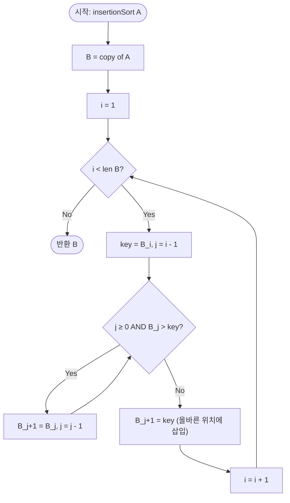

import { AlgorithmSimulation } from "#guide-sim";

# Insertion Sort — 왼쪽을 정렬된 상태로 유지하며 카드를 끼워 넣는 이유

## 한눈에 보는 컨셉

왼쪽 부분이 항상 정렬된 상태라는 약속만 지키면, 새 원소 하나를 넣는 일은 "이미 정렬된 줄에서 내 자리를 찾아 끼우는" 문제로 줄어들어요. 자리를 찾을 때 왼쪽으로 한 칸씩 훑으며 큰 값을 오른쪽으로 밀어내면 되는데, 이 밀어내는 횟수가 정확히 배열의 역순쌍(inversion) 수와 같아서 입력이 거의 정렬되어 있을수록 `O(N)`에 가깝게 빨라집니다. 최악에는 `O(N^2)`이지만, "거의 정렬된 입력"이라는 이 문제의 전제 아래에서는 이 적응성(adaptivity)이 핵심 무기예요.

**역순쌍(inversion)의 정의**: 인덱스 쌍 $(i, j)$가 $i < j$이고 $A[i] > A[j]$를 만족하면, 이 쌍을 역순쌍이라 부릅니다 — "먼저 나온 원소가 나중 원소보다 더 크게" 순서가 뒤집힌 쌍이에요. 작은 배열로 직접 세어 보면 이렇습니다.

```text
A = [3, 1, 2]        인덱스:  0→3, 1→1, 2→2

(i=0,j=1): A[0]=3 > A[1]=1  →  역순쌍 O
(i=0,j=2): A[0]=3 > A[2]=2  →  역순쌍 O
(i=1,j=2): A[1]=1 > A[2]=2? →  1 > 2 는 거짓  →  역순쌍 X

역순쌍 수 I(A) = 2   ( (0,1)과 (0,2) )
```

## 출발점: 가장 순진한 방법부터

문제를 먼저 정확히 고정할게요.

```ts
function insertionSort(A: number[]): number[]
```

| 파라미터 | 의미 | 제약 |
|---------|------|------|
| `A` | 정렬할 정수 배열 | $1 \leq N \leq 10{,}000$, $-10^9 \leq A[i] \leq 10^9$ |

**계약**: 오름차순으로 정렬된 **새 배열**을 반환합니다. 원본 `A`는 절대 변경하지 않고, 반환 배열의 다중집합(multiset)은 `A`와 같아야 하며, 같은 값이 여럿이면 원래 순서를 유지하는 안정 정렬(stable sort)이어야 합니다.

가장 정직하게 접근하면 "아무 두 자리나 잡아서 순서가 틀렸으면 맞바꾼다"는 방법이 떠올라요.

```ts
function insertionSortNaive(A: number[]): number[] {
  const B = [...A];
  for (let i = 0; i < B.length; i++) {
    for (let j = i + 1; j < B.length; j++) {
      if (B[i] > B[j]) {
        const tmp = B[i];
        B[i] = B[j];
        B[j] = tmp;
      }
    }
  }
  return B;
}
```

이 코드를 `A = [3, 1, 4, 1, 2]`(원소 5개)에 그대로 돌리면, 바깥 `i`마다 안쪽 `j`를 끝까지 훑으니 비교 횟수가 $4+3+2+1 = 10$번 나옵니다. 실제로 실행해도 정확히 10번이에요.

```text
i=0: j=1,2,3,4 → 비교 4번
i=1: j=2,3,4   → 비교 3번
i=2: j=3,4     → 비교 2번
i=3: j=4       → 비교 1번
                  ─────────
                  총 10번  =  N(N-1)/2  (N=5)
```

$N = 10{,}000$으로 키우면 $\frac{10^4 \times (10^4 - 1)}{2} \approx 5 \times 10^7$번, 시간 제한 1초 안에서는 아슬아슬하게 버티는 수준이에요. 그런데 더 큰 문제는 따로 있습니다. 이 코드는 입력이 **이미 거의 정렬돼 있어도** 똑같이 10번을 다 비교해요. `i`가 가리키는 원소가 이미 제자리에 있는지 미리 알 방법이 없기 때문이죠. 왼쪽 부분이 이미 정렬돼 있다는 사실을 활용할 수 있다면, 이 낭비를 줄일 수 있지 않을까요? — 이것이 다음 절로 이어지는 단서입니다.

## 아이디어 자세히 들여다보기

### 왼쪽을 정렬된 상태로 유지하기 — 수식과 그림

핵심 아이디어는 이겁니다. **"왼쪽 $i$개가 항상 정렬된 상태를 유지하고, 새로 오는 원소 하나를 그 안의 올바른 자리에 끼워 넣는다."** 카드 게임을 떠올려 보면 쉬워요. 손에 카드를 한 장씩 받을 때마다, 이미 순서대로 쥐고 있는 패 사이에 새 카드를 슥 끼워 넣잖아요. 그 순간 손 전체를 다시 정리할 필요는 없습니다 — 끼워 넣을 자리 하나만 찾으면 되니까요.

이걸 정식으로 쓰면, 배열 $B$에 대해 바깥 루프 변수 $i$가 진행되는 동안 다음 불변식이 항상 성립합니다.

$$\text{불변식: } B[0] \leq B[1] \leq \cdots \leq B[i-1]$$

$i$번째 원소(`key = B[i]`)를 삽입할 때는, 포인터 $j$를 $i-1$에서 시작해 왼쪽으로 옮기며 `key`보다 큰 원소를 한 칸씩 오른쪽으로 밉니다.

$$j \leftarrow j - 1 \quad \text{while } j \geq 0 \text{ and } B[j] > \text{key}, \qquad B[j+1] \leftarrow B[j]$$

멈춘 자리 $j+1$이 바로 `key`의 삽입 위치예요: $B[j+1] \leftarrow \text{key}$.

작은 예로 직접 손을 움직여 봅시다. `B = [3, 1, 4, 1, 2]`에서 `i=3` 순간(왼쪽 `B[0..2] = [1,3,4]`가 이미 정렬된 상태)을 그려 보면 이렇습니다.

```text
i=3 시작:  B = [1, 3, 4, 1, 2]     정렬된 접두사: [1, 3, 4]
                        ^key=1

j=2: B[2]=4 > 1 → 이동     B = [1, 3, 4, 4, 2]   j=1
j=1: B[1]=3 > 1 → 이동     B = [1, 3, 3, 4, 2]   j=0
j=0: B[0]=1 ≤ 1 → 멈춤

삽입: B[1] = 1             B = [1, 1, 3, 4, 2]   정렬된 접두사: [1, 1, 3, 4]
```

잠깐, 확인 하나만 해 볼까요? 왜 하필 "왼쪽 접두사가 정렬됨"을 불변식으로 잡을까요 — "오른쪽 접미사가 정렬됨"으로 잡으면 안 될까요? 안 되는 건 아니지만(선택 정렬이 그 반대쪽 전략이에요), 삽입 정렬은 **아직 처리 안 한 원소를 원래 순서 그대로 오른쪽에 남겨 둔 채** 왼쪽부터 하나씩 흡수해 가는 방식이라서, "왼쪽이 정렬됨"이 자연스러운 진행 방향과 맞아떨어집니다. 매 단계 새로 들어오는 원소는 항상 정렬된 영역의 바로 오른쪽 옆(`B[i]`)에 있으니, 탐색을 시작할 지점이 명확해지는 것도 이 정의 덕분이에요.

### 단서를 설명해 주는 이론 — 사전 정렬도와 적응형 정렬

방금 본 "거의 정렬돼 있으면 이동이 적다"는 관찰은 사실 독립된 이론으로 정리돼 있습니다.

비교 기반 정렬은 일반적으로 최악의 경우 $\Omega(N \log N)$번의 비교가 필요하다는 하한이 있어요. 정렬 알고리즘의 판단 과정을 이진 결정 트리(decision tree)로 그리면, $N$개 원소의 가능한 순열이 $N!$가지이므로 트리의 리프가 최소 $N!$개, 따라서 깊이(비교 횟수)가 최소 $\log_2(N!) = \Theta(N \log N)$이어야 한다는 논증이에요.

작은 $N=3$(원소 $x, y, z$, 가능한 순열 $3! = 6$가지)으로 이 결정 트리를 직접 그려 보면 이렇습니다.

```text
결정 트리 (N=3, 원소 x,y,z 정렬 — 각 노드는 "두 값 비교", 리프는 확정된 순서)

                        x : y ?
                    ┌──────┴──────┐
                 x<y│             │x>y
                    │             │
                  y : z ?        x : z ?
               ┌────┴────┐   ┌────┴────┐
            y<z│         │  x<z│       │x>z
               │       x:z?    │      y:z?
             [xyz]   ┌──┴──┐ [yxz]  ┌──┴──┐
                   x<z│    │x>z   y<z│    │y>z
                     [xzy][zxy]    [yzx][zyx]

리프 개수 = 6 = 3!  (6가지 순열이 각각 정확히 하나의 리프에 대응)
최대 깊이 = 3       (⌈log2 6⌉ = 3 → 최소 3번은 비교해야 확정됨)

일반화:  N=2 → 순열 2개,  최소 깊이 ⌈log2 2⌉ = 1
         N=3 → 순열 6개,  최소 깊이 ⌈log2 6⌉ = 3
         N=4 → 순열 24개, 최소 깊이 ⌈log2 24⌉ = 5   →  Θ(N log N) 하한으로 수렴
```

여기서 **헷갈리기 쉬운 포인트**가 하나 있습니다. 이 하한은 "모든 가능한 입력 중 최악"을 기준으로 한 것이지, "이 특정 입력 하나"에 대한 하한이 아니에요. 입력이 이미 거의 정렬되어 있다는 **추가 정보**가 있다면, 그 정보를 활용하는 알고리즘은 이 최악 하한보다 훨씬 빠르게 끝낼 수 있습니다. 이런 성질을 정리한 것이 **사전 정렬도(presortedness) 이론**이에요 — 입력이 "얼마나 이미 정렬돼 있는지"를 역순쌍 수 $I(A)$ 같은 지표로 재고, 그 지표에 따라 성능이 좋아지는 알고리즘을 **적응형(adaptive) 정렬**이라 부릅니다.

삽입 정렬은 바로 이 $I(A)$ 지표에 대해 최적으로 적응합니다. 왜냐하면 위에서 본 이동 1회는 역순쌍 하나를 정확히 제거하는 연산이기 때문이에요 — 총 이동 횟수는 정확히 $I(A)$이고, 이는 "역순쌍을 남김없이 없애야 정렬이 끝난다"는 사실 자체에서 나오는 하한이기도 합니다. 즉 삽입 정렬은 이 지표 기준으로 **낭비가 없는** 알고리즘이에요. 이 사실을 기억해 두세요 — 뒤에서 "더 빠른 최적화"를 검토할 때 다시 소환합니다.

### 왜 모순 없이 작동하는가

**귀납법으로 정당성을 봅시다.**

- **기저 ($i=1$):** $B[0..0]$은 원소가 하나뿐이므로 자명하게 정렬돼 있습니다.
- **귀납 단계:** $B[0..i-1]$이 정렬돼 있다고 가정할게요. `key = B[i]`를 삽입할 위치 $j+1$은 내부 루프가 멈춘 자리, 즉 $B[j] \leq \text{key}$(또는 $j = -1$)이고 아직 밀리지 않은 $B[j+2..i]$는 전부 `key`보다 큽니다. 삽입 후 왼쪽은 $B[0..j] \leq \text{key}$, 오른쪽은 $\text{key} < B[j+2..i]$이므로 두 구간과 `key`를 이어 붙이면 $B[0..i]$ 전체가 오름차순입니다. 이때 경우는 딱 둘뿐이에요 — "$j$가 음수가 될 때까지 밀림" 또는 "$B[j] \leq \text{key}$를 만나 멈춤" — 둘 다 위 논증이 그대로 적용되므로 빠지는 경우가 없습니다.

두 경우를 작은 예로 직접 트레이스해 보면 이렇습니다.

```text
기저 (i=1):  B[0..0] = [B0]                       →  원소 1개, 자명하게 정렬 ✓

귀납 단계 (i=k, 가정: B[0..k-1] 정렬됨) — 두 가지 멈춤 경우:

  case 1) B[j] ≤ key 를 만나 멈춤   (예: [1, 3, 4], key=2)
      [1, 3, 4]   key=2
       ↑     j=0에서 멈춤 (B[0]=1 ≤ 2)
      삽입 후 → [1, 2, 3, 4]
      왼쪽 B[0..j]=[1] ≤ key,  key=2 < 오른쪽 B[j+2..]=[3,4]  →  전체 오름차순 ✓

  case 2) j = -1 까지 끝까지 밀림   (예: [3, 4, 5], key=1)
      [3, 4, 5]   key=1
      j=2→1→0→-1 전부 이동
      삽입 후 → [1, 3, 4, 5]
      왼쪽 B[0..j]= (빈 구간, j=-1) ≤ key,  key=1 < 오른쪽 B[j+2..]=[3,4,5]  →  전체 오름차순 ✓

두 경우 모두 "왼쪽 ≤ key ≤ 오른쪽" 배치가 성립 → B[0..k] 전체 정렬 → 귀납 가정이 다음 단계로 그대로 이어짐
```

**헷갈리기 쉬운 포인트 1 — 원본을 복사하지 않으면 계약을 어깁니다.** `B = A`처럼 참조만 복사하면, 함수가 끝난 뒤 **원본 배열 자체가 바뀌어** 버립니다. 실제로 확인해 보면:

```text
원본 A = [3, 1, 2]   (호출 전)

B = A 로 잘못 시작한 뒤 정렬 진행 →

호출 후 원본 A = [1, 2, 3]   ✗  (원본이 정렬돼 버림 — 계약 위반)
```

`B = [...A]`로 반드시 새 배열을 만들어야 원본이 보존됩니다.

**헷갈리기 쉬운 포인트 2 — 이동 방향을 거꾸로 쓰면 조용히 틀립니다.** `B[j+1] = B[j]`(큰 값을 오른쪽으로 밀기)를 실수로 `B[j] = B[j+1]`이라고 반대로 쓰면 어떻게 될까요? 겉보기엔 비슷해 보이지만, `A = [3, 1, 4, 1, 2]`를 실제로 이 버그 코드에 돌리면:

```text
정상:        [1, 1, 2, 3, 4]
반대 방향:   [1, 1, 1, 1, 2]   ✗  (값이 실제로 사라지고 뒤섞임)
```

값 자체가 틀어져서 원소가 사라진 것처럼 보이는 결과가 나와요. `B[j+1]`이 `B[j]`를 "덮어써서 오른쪽으로 미는" 것이지, 그 반대가 아니라는 점이 여기서 가장 중요한 줄입니다.

**엣지 케이스 점검:**

```text
N = 0 (빈 배열)     → 바깥 루프가 i=1부터 시작하지만 B.length=0이라 즉시 종료 → [] 반환
N = 1 (원소 1개)    → 바깥 루프가 아예 돌지 않음(i=1 조건 불충족) → 그대로 반환
전부 동일값 [5,5,5]  → B[j] > key(등호 미포함)라 이동 없이 멈춤 → 원래 순서 그대로, 안정 정렬 성립
음수 포함           → 비교 연산자는 부호와 무관하게 정확히 동작 → 문제 없음
```

## 아이디어를 코드로 옮기기

```ts
function insertionSortBase(A: number[]): number[] {
  const B = [...A];
  for (let i = 1; i < B.length; i++) {
    const key = B[i];
    let j = i - 1;
    while (j >= 0 && B[j] > key) {
      B[j + 1] = B[j];
      j--;
    }
    B[j + 1] = key;
  }
  return B;
}
```

**가장 중요한 줄은 `while (j >= 0 && B[j] > key)`의 조건 순서입니다.** `j >= 0`을 반드시 먼저 평가해야 해요 — JS/TS는 `&&`를 왼쪽부터 평가하는 단락 평가(short-circuit)라서, `j`가 음수가 되는 순간 오른쪽의 `B[j] > key`는 아예 실행되지 않고 루프가 안전하게 멈춥니다. 그 외에 결정 지점은 두 가지입니다 — 바깥 루프는 `i=1`부터 시작합니다(`B[0..0]`은 항상 자명하게 정렬돼 있으니 `i=0`을 처리할 필요가 없어요), 그리고 `B = [...A]`로 복사한 뒤에만 원본이 보존됩니다(위에서 본 함정 1).

## 더 빠르게 만들 단서 찾기

지금 구현을 실측해 봅시다. 원소 1,000개를 이미 정렬된 배열과 완전히 뒤집힌 배열 각각에 돌리면, 비교 횟수가 이렇게 나옵니다.

```text
N=1000, 이미 정렬됨:  비교 999회     (각 삽입마다 1번 비교하고 바로 멈춤 → O(N))
N=1000, 완전 역순:    비교 499,500회  (각 삽입마다 끝까지 밀림 → O(N^2))
```

앞 절 이론에서 본 대로, 이 비교 횟수(그리고 이동 횟수)는 정확히 역순쌍 수 $I(A)$에 비례합니다. 문제는 **"입력이 나쁘면"**(역순 정렬처럼 $I(A)$가 클 때) 최악 $O(N^2)$ 비교가 그대로 발생한다는 점이에요.

```text
key=1을 삽입할 때 (역순 입력 [4,3,2,1]의 마지막 자리라면):
  B[j] > key 를 j=i-1, i-2, ..., 0 까지 전부 확인해야 멈춘다
  → 이미 정렬된 왼쪽 구간 전체를 "한 칸씩" 훑어 내려가는 것과 같다
```

그런데 왼쪽 구간은 **이미 정렬돼 있습니다.** 정렬된 배열에서 "key가 들어갈 위치"를 찾는 일은 굳이 한 칸씩 훑을 필요 없이, 이진 탐색으로 $O(\log i)$에 끝낼 수 있는 문제 아닌가요? — 이것이 두 번째 단서입니다.

## 단서를 최적화로 연결하기

정렬된 접두사 $B[0..i-1]$에서 `key`가 들어갈 위치를 선형으로 훑는 대신, 이진 탐색으로 좁혀 갑니다. 탐색 구간을 $[\text{lo}, \text{hi})$로 두고, "이 구간 왼쪽은 전부 `key` 이하, 오른쪽은 전부 `key` 초과"라는 불변식을 유지하며 좁혀요.

```text
Before (선형 스캔):  j를 하나씩 왼쪽으로 이동하며 매번 비교
                     B[j] > key?  →  한 칸씩, 최악 O(i)번 비교

After (이진 탐색):   구간을 절반씩 접어 가며 비교
                     [lo, hi) → mid → [lo,mid) 또는 [mid+1,hi)
                     최악 O(log i)번 비교로 위치 확정
```

동일한 값이 여럿일 때 안정성을 지키려면, `B[mid] <= key`인 동안은 `lo`를 오른쪽으로 밀어야 합니다 — 그래야 같은 값의 기존 원소들 **뒤에** 새 `key`가 꽂혀서 원래 순서가 보존돼요. 단, 위치를 찾은 뒤에도 실제로 자리를 비켜 주는 **이동(shift) 자체는 여전히 필요**하다는 점은 그대로예요 — 바뀌는 건 "위치를 찾는 방법"뿐입니다.

## 최적화 코드

바뀌는 부분은 위치를 찾는 로직뿐이고, 이동(shift)은 그대로입니다.

```ts
function insertionSortOptimized(A: number[]): number[] {
  const B = [...A];
  for (let i = 1; i < B.length; i++) {
    const key = B[i];
    let lo = 0;
    let hi = i;
    while (lo < hi) {
      const mid = (lo + hi) >> 1;
      if (B[mid] <= key) lo = mid + 1;
      else hi = mid;
    }
    for (let k = i; k > lo; k--) {
      B[k] = B[k - 1];
    }
    B[lo] = key;
  }
  return B;
}
```

**가장 실수가 잦은 줄은 `let hi = i;`입니다.** 삽입 가능한 위치는 $0$부터 $i$까지(접두사 길이가 $i$이므로 맨 끝에 꽂힐 수도 있음) 총 $i+1$가지인데, 이걸 `hi = i - 1`로 한 칸 좁혀 버리면 탐색 구간에서 맨 끝 자리가 아예 빠집니다. 실제로 이 버그를 `[3, 1, 4, 1, 2]`에 돌리면:

```text
정상:            [1, 1, 2, 3, 4]
hi = i - 1 버그:  [1, 1, 2, 4, 3]   ✗  (마지막 자리 후보가 통째로 누락돼 4와 3이 안 바뀜)
```

> 탐색 구간은 항상 "닫힌 시작, 열린 끝" `[lo, hi)` — 접두사 길이가 `i`이니 `hi`도 `i`.

이제 이 최적화가 실제로 무엇을 얻고 무엇을 잃는지 짚어 봐야 합니다. 방금 실측한 두 극단을 다시 이진 탐색 버전으로 돌려 보면 이렇습니다.

```text
N=1000, 완전 역순:    선형 비교 499,500회  →  이진 비교 8,977회   (크게 개선)
N=1000, 이미 정렬됨:  선형 비교    999회  →  이진 비교 7,987회   (오히려 나빠짐!)
```

여기서 **헷갈리기 쉬운 포인트**가 있습니다. "이진 탐색이 더 빠른 방법"이라고 무조건 믿기 쉬운데, 이미 정렬된 입력에서는 선형 스캔이 단 한 번 비교하고 바로 멈추는 반면(`B[j] > key`가 곧바로 거짓), 이진 탐색은 입력이 정렬돼 있다는 사실을 활용하지 못하고 **매번 $\log i$번을 꼬박꼬박 비교**합니다. 즉 이진 탐색은 최악 비교 횟수를 $O(N^2) \to O(N \log N)$으로 낮추지만, 이 문제가 정의한 목표(적응형 성능 — 거의 정렬된 입력에서 $O(N)$에 가깝게)의 관점에서는 오히려 손해예요.

게다가 **이동(shift) 횟수는 두 버전에서 완전히 같습니다** — 실측으로도 `[3,1,4,1,2]`, `[4,3,2,1]`, `[1,2,3,4]`, `[5,2,4,6,1,3]` 전부 선형·이진 버전의 이동 횟수가 각각 5, 6, 0, 9로 일치합니다. 위치를 어떻게 찾든 "key를 최종 자리까지 밀어 넣는 물리적 이동"은 똑같이 필요하기 때문이에요. 이 이동 비용이 $O(N + I(A))$로 여전히 지배적이므로, 비교 방법을 바꿔도 **총 복잡도의 점근적 목표 자체는 달라지지 않습니다.**

**최적화 사다리는 여기서 멈춥니다.** 배열 기반 삽입 정렬은 "자리를 물리적으로 밀어야 한다"는 제약을 벗어날 수 없고, 이 이동 비용은 이미 이론절에서 본 것처럼 $I(A)$ 지표에 대해 최적입니다(더 줄일 수 없는 하한). 이동 비용 자체를 없애려면 배열이 아닌 다른 자료구조(예: 균형 이진 탐색 트리, 연결 리스트 기반 구조)로 갈아타야 하는데, 그러면 임의 접근이 느려지는 등 다른 비용이 새로 붙습니다. Timsort처럼 여러 정렬 기법을 섞은 하이브리드 알고리즘이 대규모 입력에서 더 나은 실전 성능을 내지만, 삽입 정렬의 가치는 **구현이 단순하고, 추가 메모리·자료구조 없이, 거의 정렬된 데이터에 한해 즉시 적응한다**는 데 있습니다. 그래서 이 가이드는 최종 코드로 **선형 스캔 버전**(이 문제의 목표 복잡도 $O(N+I(A))$를 정확히 달성하고, 어떤 정렬 상태에서도 손해를 보지 않는 버전)을 권장하고, 이진 탐색 버전은 "최악 비교 횟수가 걱정될 때"의 대안으로 소개합니다.

## 실행 시각화

고정 입력 `A = [3, 1, 4, 1, 2]`에 대해 선형 스캔 버전 `insertionSort`를 실행하는 과정입니다. 빨강(`highlight`)은 현재 비교 중인 인덱스, 회색(`marked`)은 이미 정렬이 확정된 왼쪽 접두사, 포인터 `i`는 삽입할 원소의 원래 위치, `j`는 왼쪽으로 탐색 중인 위치를 가리킵니다. 실제 반환값은 `[1, 1, 2, 3, 4]`이며, 시뮬레이션 마지막 프레임과 일치합니다(위 "아이디어를 코드로 옮기기" 절의 코드를 그대로 추출해 실행한 값입니다).

> 대화형 시뮬레이션은 MDX 런타임에서 표시됩니다.

export const steps = [
  { title: "초기 상태", detail: "B = A 복사. B[0]은 자명하게 정렬된 접두사.", array: [3, 1, 4, 1, 2], marked: [0] },
  { title: "i=1: key=1", detail: "key=1, j=0. B[0]=3 > 1 → 비교.", array: [3, 1, 4, 1, 2], marked: [0], highlight: [0], pointers: { i: 1, j: 0 } },
  { title: "3을 오른쪽으로 이동", detail: "B[1]=B[0]=3, j=-1. 멈춤.", array: [3, 3, 4, 1, 2], marked: [0], pointers: { i: 1, j: -1 } },
  { title: "key=1 삽입", detail: "B[0]=1. 접두사 [1,3] 정렬됨.", array: [1, 3, 4, 1, 2], marked: [0, 1] },
  { title: "i=2: key=4", detail: "key=4, j=1. B[1]=3 ≤ 4 → 즉시 멈춤(이동 0회).", array: [1, 3, 4, 1, 2], marked: [0, 1], highlight: [1], pointers: { i: 2, j: 1 } },
  { title: "key=4 삽입", detail: "B[2]=4 제자리. 접두사 [1,3,4] 정렬됨.", array: [1, 3, 4, 1, 2], marked: [0, 1, 2] },
  { title: "i=3: key=1", detail: "key=1, j=2. B[2]=4 > 1 → 이동.", array: [1, 3, 4, 1, 2], marked: [0, 1, 2], highlight: [2], pointers: { i: 3, j: 2 } },
  { title: "4를 오른쪽으로 이동", detail: "B[3]=B[2]=4, j=1. B[1]=3 > 1 → 계속.", array: [1, 3, 4, 4, 2], marked: [0, 1, 2], highlight: [1], pointers: { i: 3, j: 1 } },
  { title: "3을 오른쪽으로 이동", detail: "B[2]=B[1]=3, j=0. B[0]=1 ≤ 1 → 멈춤.", array: [1, 3, 3, 4, 2], marked: [0, 1, 2], pointers: { i: 3, j: 0 } },
  { title: "key=1 삽입", detail: "B[1]=1. 접두사 [1,1,3,4] 정렬됨.", array: [1, 1, 3, 4, 2], marked: [0, 1, 2, 3] },
  { title: "i=4: key=2", detail: "key=2, j=3. B[3]=4 > 2 → 이동.", array: [1, 1, 3, 4, 2], marked: [0, 1, 2, 3], highlight: [3], pointers: { i: 4, j: 3 } },
  { title: "4를 오른쪽으로 이동", detail: "B[4]=B[3]=4, j=2. B[2]=3 > 2 → 계속.", array: [1, 1, 3, 4, 4], marked: [0, 1, 2, 3], highlight: [2], pointers: { i: 4, j: 2 } },
  { title: "3을 오른쪽으로 이동", detail: "B[3]=B[2]=3, j=1. B[1]=1 ≤ 2 → 멈춤.", array: [1, 1, 3, 3, 4], marked: [0, 1, 2, 3], pointers: { i: 4, j: 1 } },
  { title: "key=2 삽입", detail: "B[2]=2. 전체 정렬 완료.", array: [1, 1, 2, 3, 4], marked: [0, 1, 2, 3, 4] },
  { title: "완료: [1, 1, 2, 3, 4]", detail: "총 이동 5회 = 역순쌍 수 I(A).", array: [1, 1, 2, 3, 4], marked: [0, 1, 2, 3, 4] },
];

<AlgorithmSimulation view="array" steps={steps} title="삽입 정렬: A = [3, 1, 4, 1, 2]" />

## 흐름 한눈에 보기

아래 흐름도는 삽입 정렬의 핵심 메커니즘 — 바깥 루프에서 `key`를 뽑고, 안쪽에서 자리를 찾아 밀어 넣는 과정 — 을 선형 스캔 기준으로 나타냅니다. 이진 탐색 버전은 "자리를 찾는 방법"(`F` 블록)만 이진 탐색으로 바뀔 뿐, 나머지 흐름(밀어 넣기·삽입)은 동일합니다.



## 스스로 점검하기

1. `A = [2, 4, 1, 3]`에 선형 스캔 버전을 손으로 따라가며 각 `i`에서의 이동 횟수를 적어 보세요. 총 이동 횟수가 이 배열의 역순쌍 수 $I(A)$와 같은지 확인해 보세요. (역순쌍: $(2,1),(4,1),(4,3)$ 총 3개 — 총 이동 3회가 나와야 정상입니다.)
2. "아이디어를 코드로 옮기기" 절의 `while (j >= 0 && B[j] > key)`에서 조건 순서를 `while (B[j] > key && j >= 0)`으로 바꾸면 어떻게 될지 예상해 보고, 왜 그런 결과가 나오는지 짚어 보세요. (힌트: TypeScript에서 배열 밖 인덱스는 `undefined`를 반환하고, `undefined > key`는 항상 `false`로 평가됩니다 — 크래시는 나지 않지만, 다른 언어라면 안전하지 않은 습관입니다.)
3. 이 배열이 **원형 배열**이어서 마지막 원소 다음이 다시 첫 원소로 이어진다면("회전된 정렬 배열"), 지금의 "왼쪽 접두사가 정렬됨" 불변식이 그대로 통할까요? 어떤 부분을 바꿔야 할지 한 문장으로 적어 보세요.
