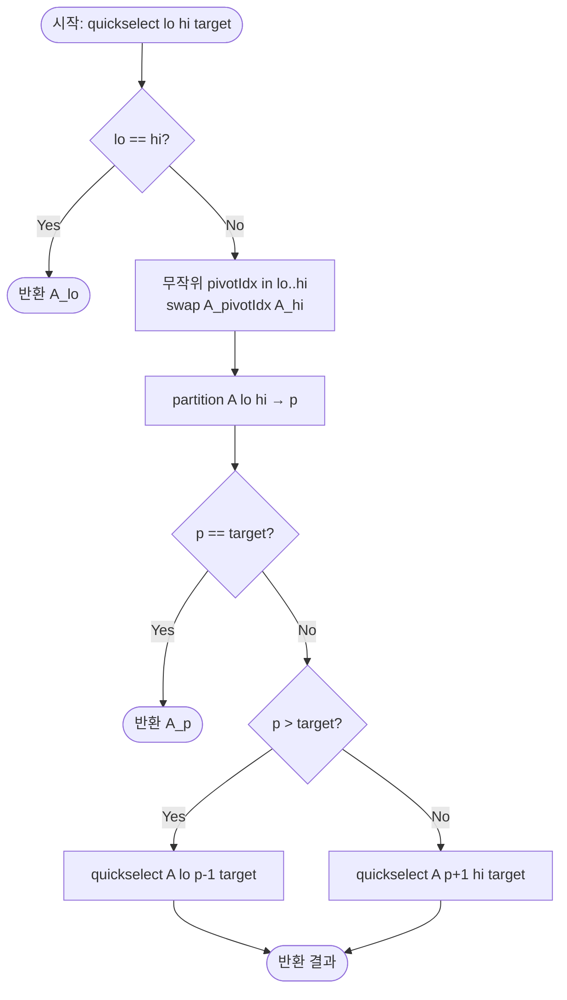

import { AlgorithmSimulation } from "#guide-sim";

# Kth Smallest Element — 해설

## 성능 목표 예측

| 항목 | 값 |
|------|----|
| 입력 크기 N | 1 ≤ N ≤ 100,000 |
| 값 범위 | −10⁹ ≤ A[i] ≤ 10⁹ |
| k 범위 | 1 ≤ k ≤ N |
| 목표 시간 복잡도 | **평균 O(N)** (Quickselect) |
| 최악 복잡도 | O(N²) (무작위 피벗 사용 시 극히 희박) |
| 공간 복잡도 | O(log N) 재귀 스택 (평균) |

**naive 접근의 복잡도와 한계:**
가장 단순한 접근은 배열 전체를 정렬한 뒤 $k-1$번째 원소를 반환하는 것이다.

```
sort(A)      // O(N log N)
return A[k-1]
```

$N = 10^5$에서 $O(N \log N) \approx 1.7 \times 10^6$ 연산으로 통과는 가능하다. 그러나 $k$번째 원소만 필요한데 전체를 정렬하는 것은 필요 이상의 작업이다. $k$번째를 찾기 위해 나머지 $N - k$개의 순서까지 결정할 이유가 없으며, 이 낭비를 제거하는 것이 Quickselect의 핵심이다.

**목표 복잡도의 근거:**
Quickselect는 partition 후 한쪽 절반만 재귀하므로, 기대 비용이 등비급수로 합산된다:

$$T(N) = T(N/2) + O(N) \Rightarrow T(N) = O(N)$$

무작위 피벗을 사용하면 최악 $O(N^2)$이 되는 확률이 기하급수적으로 낮아 실용적으로 안전하다.

---

## 목표 함수

```ts
function kthSmallest(A: number[], k: number): number
```

| 파라미터 | 의미 | 제약 |
|---------|------|------|
| `A` | 정수 배열 | $1 \leq N \leq 100{,}000$ |
| `A[i]` | 각 원소의 값 | $-10^9 \leq A[i] \leq 10^9$ |
| `k` | 1-based 순위 | $1 \leq k \leq N$ |

**반환값:** 배열 $A$를 오름차순 정렬했을 때 $k$번째 원소 (= `sort(A)[k-1]`).

**엣지케이스:**

| 케이스 | 입력 | 기대 출력 | 비고 |
|--------|------|----------|------|
| 최솟값 | `A = [3,1,4,1,5]`, `k=1` | `1` | 항상 최솟값 |
| 최댓값 | `A = [3,1,4,1,5]`, `k=5` | `5` | 항상 최댓값 |
| 단일 원소 | `A = [7]`, `k=1` | `7` | N=1 |
| 중앙값 | `A = [3,1,4,1,5,9,2,6]`, `k=4` | `3` | 정렬: [1,1,2,3,4,5,6,9] |
| 중복 포함 | `A = [2,2,2]`, `k=2` | `2` | 중복 값 정상 처리 |

---

## 핵심 아이디어

**핵심 아이디어**: "pivot을 기준으로 절반을 나눠, k번째 원소가 있는 쪽만 재귀하면 된다."

전체 정렬 없이 k번째 원소만 찾고 싶다면, 나머지 원소들의 순서를 결정할 필요가 없다. Quickselect는 pivot을 기준으로 배열을 분할한 뒤 pivot의 최종 위치가 target이면 바로 반환하고, 아니면 target이 있는 절반만 재귀한다. 정렬($O(N \log N)$)과 달리 평균 $O(N)$에 끝난다.

**풀이 구조**
1. 배열 복사. `target = k - 1` (0-based 변환)
2. 탐색 구간 `[lo, hi]`에서 무작위 pivot 선택 후 끝으로 이동
3. Lomuto partition으로 pivot의 최종 위치 $p$ 확정
4. `p == target`이면 `A[p]` 반환
5. `p > target`이면 `[lo, p-1]` 재귀. `p < target`이면 `[p+1, hi]` 재귀

**조건**: 1-based $k$가 $[1, N]$ 범위여야 함. 원본 배열을 수정하지 않으려면 복사본에서 실행. 무작위 pivot 사용 시 최악 케이스 확률이 기하급수적으로 낮아짐.

**대표 예시**: 대용량 데이터에서 중앙값(N/2번째) 찾기
$10^6$개 원소에서 중앙값을 구할 때 전체 정렬($O(N \log N)$) 대신 Quickselect($O(N)$ 평균)를 쓰면 이론상 수십 배 빠르다.

**언제 쓰나**
전체 정렬 없이 k번째 원소(최솟값, 최댓값, 중앙값, 백분위수 등)만 필요할 때 선택한다. 정렬이 필요 없는 "순위 선택" 문제에서 Quickselect가 기본 선택지다.

---

### 원형 아이디어와 naive 접근

가장 직관적인 접근: $k$번을 반복해서 최솟값을 찾는다.

```
for i from 1 to k:
    minVal = A[0]
    minIdx = 0
    for j from 1 to len(A)-1:
        if A[j] < minVal:
            minVal = A[j]
            minIdx = j
    remove A[minIdx]   // 또는 무한대로 표시
return minVal
```

이 방법은 $O(k \cdot N)$이며, $k = N/2$이면 $O(N^2/2)$이 되어 $N = 10^5$에서 $2.5 \times 10^9$ 연산으로 시간 초과다. 핵심 낭비: $k$번째를 찾기 위해 앞의 $k-1$개 최솟값을 매번 선형 탐색으로 찾는다.

### 어떤 관찰이 돌파구가 되는가

- **관찰 1 (Partition의 핵심 성질):** 배열에서 임의의 값 `pivot`을 기준으로 "pivot보다 작은 것, pivot, pivot보다 큰 것"으로 분할하면, pivot의 최종 위치 $p$가 결정된다. 이때 $p + 1 = k$이면 pivot이 정답이다.
- **관찰 2 (한쪽 절반만 재귀):** partition 후 $p + 1 \neq k$이면, $k$번째 원소가 속한 절반만 탐색하면 된다. 정렬과 달리 나머지 절반은 순서를 결정할 필요가 없다.
- **관찰 3 (기대 크기 감소):** 무작위 피벗을 사용하면 partition 후 탐색 범위가 평균적으로 절반이 된다. 이 기대 감소율이 선형 기대 시간의 근거다.

### 관찰을 형식화: 상태/구조 정의

**핵심 상태:** 현재 탐색 구간 `[lo, hi]`와 목표 인덱스 `target` (0-based).

$$\text{불변식: 정답은 반드시 } A[\text{lo}..\text{hi}] \text{ 안에 있다}$$

`target = k - 1` (1-based를 0-based로 변환)으로 시작한다.

**Partition 후 상태:**

$$A[\text{lo}..\text{p}-1] \leq A[p] \leq A[\text{p}+1..\text{hi}]$$

- `p == target`: $A[p]$가 정답
- `p > target`: 정답은 왼쪽 구간 $[\text{lo}, \text{p}-1]$에 있음
- `p < target`: 정답은 오른쪽 구간 $[\text{p}+1, \text{hi}]$에 있음

이 정의가 왜 이 형태여야 하는가: `target`을 0-based 절대 인덱스로 고정하면 재귀 호출 간 $k$를 조정할 필요 없이 구간만 변경하면 된다. 상대 인덱스로 관리하면 오른쪽 재귀 시 `k - (p - lo + 1)`로 조정해야 하는 오류 가능성이 높아진다.

### 점화식 또는 핵심 연산

**Lomuto Partition의 과정:**

```
pivot = A[hi]                           // 피벗을 끝 원소로 설정
i = lo - 1                              // i: pivot보다 작은 영역의 끝 포인터
for j from lo to hi-1:
    if A[j] <= pivot:
        i += 1
        swap(A[i], A[j])                // 작은 원소를 왼쪽으로 모음
swap(A[i+1], A[hi])                     // 피벗을 최종 위치로
return i + 1                            // 피벗의 최종 인덱스 = p
```

**기대 비용 분석:**

partition 후 탐색 범위 크기를 $S$라 하면, 무작위 피벗의 기대 크기:

$$E[S] \leq \frac{3}{4} \cdot N \quad \text{(평균적으로 구간이 3/4 이하로 감소)}$$

$$T(N) = O(N) + T\left(\frac{3N}{4}\right) = O(N) \cdot \frac{1}{1 - 3/4} = O(4N) = O(N)$$

- $O(N)$: 현재 구간에서의 partition 비용
- $T(3N/4)$: 기대 탐색 범위에서의 재귀 비용

### 정당성 — 왜 이것이 옳은가

partition의 정확성: Lomuto partition 종료 후 $A[\text{lo}..\text{p}-1] \leq A[\text{p}] \leq A[\text{p}+1..\text{hi}]$가 항상 성립함을 루프 불변식으로 증명할 수 있다. 이 성질이 보장되면, `p == target`일 때 $A[p]$가 전체 배열에서 정확히 `target`번째 원소임이 따라온다.

재귀의 정확성: 탐색 구간을 줄이는 각 단계에서 "정답은 현재 구간 내에 있다"는 불변식이 유지된다. `lo == hi`가 되면 해당 원소가 유일한 후보이므로 반환한다.

**중복 값 처리:** 중복이 있어도 partition은 정확히 작동한다. `A[j] <= pivot` 조건이므로 피벗과 같은 값의 원소들은 피벗의 왼쪽에 모인다. 이는 최종 위치 계산에 영향을 주지 않는다.

### 구현 디테일과 최적화

- **원본 보존:** `kthSmallest`가 배열을 수정하면 안 되는 경우, 복사본에서 Quickselect를 실행한다: `B = [...A]`.
- **무작위 피벗의 중요성:** 고정 피벗(항상 첫 원소 또는 끝 원소)을 사용하면 이미 정렬된 입력에서 최악 $O(N^2)$이 확정적으로 발생한다. `Math.random()`으로 피벗을 무작위 선택하면 이를 방지한다.
- **tail recursion으로 스택 절감:** Quickselect는 한쪽만 재귀하므로 반복문으로 변환 가능하다. `lo`와 `hi`를 갱신하며 루프를 돌면 스택 깊이가 $O(1)$이 된다.
- **흔한 함정 — partition 경계 처리:** `j`가 `lo`부터 `hi-1`까지 실행되고, 마지막에 `i+1`과 `hi`를 교환한다. `hi`를 포함하거나 경계를 1 잘못 설정하면 피벗이 두 번 비교되거나 무한 루프가 발생한다.
- **흔한 함정 — target 0-based 변환:** `k`는 1-based이므로 `target = k - 1`로 변환해야 한다. 변환을 빠뜨리면 k=1이 최솟값 대신 두 번째 원소를 반환하는 오류가 생긴다.

---

## 시뮬레이션

고정 입력 `A = [3, 1, 4, 1, 5, 9, 2, 6]`, `k = 3` (target = k-1 = 2, 0-based)에 Quickselect를 실행한다. 각 단계는 Lomuto partition으로 pivot의 최종 위치 `p`를 확정한 뒤, `p`와 target을 비교해 한쪽 구간만 재귀한다. 빨간색(`highlight`)은 현재 pivot, 회색(`marked`)은 탐색에서 제외된(확정 분할) 구간, 포인터 `lo`/`hi`/`p`/`target`은 현재 구간 경계와 목표를 가리킨다.

실제 반환값은 `2` (정렬하면 [1, 1, 2, 3, 4, 5, 6, 9]의 3번째) 이며, 시뮬레이션 마지막 프레임에서 반환되는 값과 일치한다.

> 대화형 시뮬레이션은 MDX 런타임에서 표시됩니다.

export const steps = [
  {
    title: "초기화",
    detail: "B = [3, 1, 4, 1, 5, 9, 2, 6], target = 2. quickselect(0, 7).",
    array: [3, 1, 4, 1, 5, 9, 2, 6],
    pointers: { lo: 0, hi: 7, target: 2 },
  },
  {
    title: "Partition 1: pivot = 6",
    detail: "pivot=A[7]=6. 6 이하 원소를 왼쪽으로 모은다.",
    array: [3, 1, 4, 1, 5, 9, 2, 6],
    highlight: [7],
    pointers: { lo: 0, hi: 7, target: 2 },
  },
  {
    title: "Partition 1 결과: p = 6",
    detail: "9만 6보다 큼 → [3,1,4,1,5,2,6,9]. pivot 6은 인덱스 6에 확정.",
    array: [3, 1, 4, 1, 5, 2, 6, 9],
    highlight: [6],
    pointers: { lo: 0, hi: 7, p: 6, target: 2 },
  },
  {
    title: "비교: p=6 > target=2",
    detail: "정답은 왼쪽 구간 [0, 5]에 있다. 오른쪽 [6, 7] 제외.",
    array: [3, 1, 4, 1, 5, 2, 6, 9],
    marked: [6, 7],
    pointers: { lo: 0, hi: 5, target: 2 },
  },
  {
    title: "Partition 2: pivot = 2",
    detail: "구간 [0,5]에서 pivot=A[5]=2. 2 이하 원소를 왼쪽으로 모은다.",
    array: [3, 1, 4, 1, 5, 2, 6, 9],
    highlight: [5],
    marked: [6, 7],
    pointers: { lo: 0, hi: 5, target: 2 },
  },
  {
    title: "Partition 2 결과: p = 2",
    detail: "1, 1을 왼쪽으로 → [1,1,2,3,5,4]. pivot 2는 인덱스 2에 확정.",
    array: [1, 1, 2, 3, 5, 4, 6, 9],
    highlight: [2],
    marked: [6, 7],
    pointers: { lo: 0, hi: 5, p: 2, target: 2 },
  },
  {
    title: "비교: p=2 == target=2 → 정답",
    detail: "pivot의 위치가 target과 일치. A[2]=2를 반환한다.",
    array: [1, 1, 2, 3, 5, 4, 6, 9],
    marked: [2],
    pointers: { p: 2, target: 2 },
  },
  {
    title: "완료: 반환값 = 2",
    detail: "k=3번째로 작은 원소는 2.",
    array: [1, 1, 2, 3, 5, 4, 6, 9],
    marked: [2],
  },
];

<AlgorithmSimulation view="array" steps={steps} title="Quickselect: k=3 in [3,1,4,1,5,9,2,6]" />

## 수도 코드와 Activity Diagram

### 의사코드

```
function kthSmallest(A, k):
    B = copy of A                          // 불변식: multiset(B) = multiset(A)
    return quickselect(B, 0, len(B)-1, k-1)  // 0-based target

function quickselect(A, lo, hi, target):
    // 불변식: 정답은 A[lo..hi] 안에 있다
    if lo == hi:
        return A[lo]                       // 유일한 후보

    pivotIdx = randomInt(lo, hi)           // 무작위 피벗 선택
    swap(A[pivotIdx], A[hi])               // 피벗을 끝으로 이동
    p = partition(A, lo, hi)               // 피벗 최종 위치

    // 불변식 확인: A[lo..p-1] ≤ A[p] ≤ A[p+1..hi]
    if p == target:
        return A[p]                        // 피벗이 정답
    elif p > target:
        return quickselect(A, lo, p-1, target)    // 왼쪽 재귀
    else:
        return quickselect(A, p+1, hi, target)    // 오른쪽 재귀

function partition(A, lo, hi):
    pivot = A[hi]                          // 피벗값
    i = lo - 1                             // 작은 영역의 끝 포인터
    for j from lo to hi-1:
        if A[j] <= pivot:
            i += 1
            swap(A[i], A[j])               // 불변식: A[lo..i] ≤ pivot
    swap(A[i+1], A[hi])                    // 피벗을 최종 위치로
    return i + 1
```

### Activity Diagram



**핵심 불변식:** partition 종료 후 `A[lo..p-1] ≤ A[p] ≤ A[p+1..hi]`. 각 재귀 호출 진입 시 정답은 반드시 `A[lo..hi]` 구간 내에 존재한다.

---

**예시:** $A = [3, 1, 4, 1, 5, 9, 2, 6]$, $k = 3$

```
정렬하면: [1, 1, 2, 3, 4, 5, 6, 9]
정답: 2 (0-based index 2, target = 2)

quickselect(A, 0, 7, 2):
  pivot = A[4] = 5 (가정), partition 후 p = 4
  p=4 > target=2 → quickselect(A, 0, 3, 2)

quickselect(A, 0, 3, 2):
  해당 구간 [3,1,4,1], pivot = A[1] = 1, partition 후 p = 1
  p=1 < target=2 → quickselect(A, 2, 3, 2)

quickselect(A, 2, 3, 2):
  해당 구간 [1,4], pivot = A[2] = 1, partition 후 p = 2
  p=2 == target=2 → 반환 A[2] = 2
```
