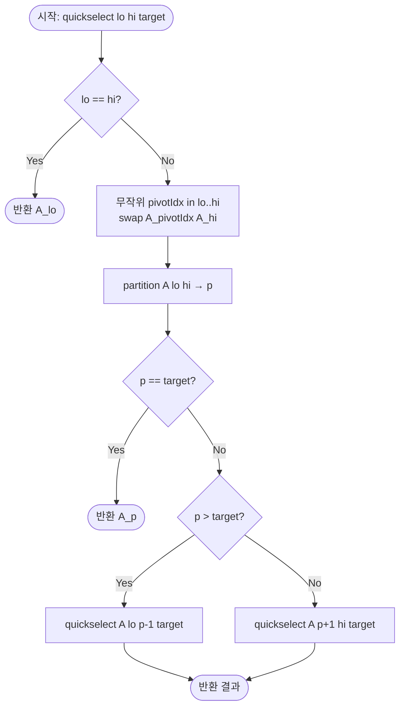

import { AlgorithmSimulation } from "#guide-sim";

# Kth Smallest Element — pivot 위치 하나만 확정하면 나머지 절반은 볼 필요가 없다는 관찰

## 한눈에 보는 컨셉

정수 배열에서 `k`번째로 작은 값을 찾을 때, 배열 전체를 정렬할 필요는 없어요. 배열을 pivot 기준으로 "작은 것 | pivot | 큰 것"으로 나누면 pivot의 최종 위치 자체가 하나의 순위 정보가 되고, 그 위치가 목표 순위와 다르면 목표가 속한 절반만 다시 나누면 됩니다. 이 관찰 하나로 정렬의 `O(N log N)` 대신 평균 `O(N)`에 답을 구할 수 있어요.

## 출발점: 가장 순진한 방법부터

문제를 정확히 잡고 시작할게요.

```ts
function kthSmallest(A: number[], k: number): number
```

| 항목 | 의미 | 제약 |
|------|------|------|
| `A` | 정수 배열 | $1 \leq N \leq 100{,}000$ (N = `A.length`) |
| `A[i]` | 각 원소 값 | $-10^9 \leq A[i] \leq 10^9$ |
| `k` | 1-based 순위 | $1 \leq k \leq N$ |
| 반환값 | `A`를 오름차순 정렬했을 때 `k`번째(1-based) 원소 | `sort(A)[k-1]`과 동일 |

"`k`번째로 작은 값을 찾으라"는 요청을 받으면 가장 순진하게는 이렇게 생각할 수 있어요 — "정렬 같은 건 몰라도, 그냥 가장 작은 값을 `k`번 반복해서 뽑으면 되지 않나?" 매번 전체를 훑어 최솟값을 찾고, 그 값을 후보에서 제외한 뒤 다시 훑는 방식입니다.

```ts
function kthSmallestNaive(A: number[], k: number): number {
  const arr = [...A];
  let result = -Infinity;
  for (let step = 0; step < k; step++) {
    let minVal = Infinity;
    let minIdx = -1;
    for (let j = 0; j < arr.length; j++) {
      if (arr[j] < minVal) {
        minVal = arr[j];
        minIdx = j;
      }
    }
    result = minVal;
    arr[minIdx] = Infinity; // 뽑은 원소는 다음 탐색에서 제외
  }
  return result;
}
```

작은 예로 직접 따라가 볼게요. `A = [3, 1, 4, 1, 5]`, `k = 3`이라면:

```text
1회차: 최솟값 탐색 → 1 (idx 1)  →  [3, ∞, 4, 1, 5]
2회차: 최솟값 탐색 → 1 (idx 3)  →  [3, ∞, 4, ∞, 5]
3회차: 최솟값 탐색 → 3 (idx 0)  →  3번째로 작은 값 = 3

검산: sort([3,1,4,1,5]) = [1,1,3,4,5], 3번째(1-based) = 3  ✓
```

문제는 비용이에요. 바깥 루프가 `k`번, 안쪽 최솟값 탐색이 매번 `O(N)`이라 총 `O(k·N)`입니다. `k`가 배열 중앙 근처(`k ≈ N/2`)일 때가 최악인데, `N = 10^5`로 계산해 보면:

```text
k = 50,000, N = 100,000
비용 ≈ k × N = 50,000 × 100,000 = 5,000,000,000 (50억)
```

시간 제한 1초·CPU가 초당 약 `10^8`번 연산한다는 기준을 대면 50배 초과, 시간 초과예요.

"그럼 그냥 정렬해서 `A[k-1]`을 읽으면 되지 않나?"가 자연스러운 다음 생각입니다. `sort(A)` 후 인덱싱하면 $N\log_2 N \approx 100{,}000 \times 16.6 \approx 1.66 \times 10^6$으로 충분히 통과해요. 그런데 여기서 낭비가 하나 보입니다 — **우리가 알고 싶은 건 딱 `k`번째 자리 하나인데, 정렬은 나머지 `N-1`개 원소의 순서까지 전부 확정해 버립니다.** `k`번째 원소의 값을 고정하는 데 필요한 정보보다 훨씬 많은 일을 하는 셈이죠. 이 낭비를 걷어낼 수 있을까요 — 이게 이번 절 전체를 관통하는 단서입니다.

## 아이디어 자세히 들여다보기

### pivot이 나누는 두 세계 — 수식과 그림

핵심 관찰은 이렇습니다. 배열에서 값 하나를 pivot으로 고르고, 배열을 "pivot보다 작거나 같은 것들 | pivot | pivot보다 큰 것들"로 재배열(partition)하면, **pivot이 정렬됐을 때 몇 번째 자리에 오는지가 그 자리에서 확정됩니다.** 정렬을 끝까지 하지 않아도, pivot 하나의 순위는 partition 한 번으로 압니다.

탐색 구간을 `[lo, hi]`(0-based, 양 끝 포함), 목표 인덱스를 `target = k - 1`(1-based `k`를 0-based로 변환)이라 하면, partition 직후 다음이 성립합니다.

$$A[\text{lo}..\,p-1] \;\le\; A[p] \;\le\; A[p+1..\,\text{hi}]$$

여기서 $p$는 partition이 끝난 뒤 pivot이 자리 잡은 인덱스예요. 이 식이 말하는 건 "pivot보다 왼쪽에 있는 원소는 전부 pivot 이하, 오른쪽은 전부 pivot 이상"이라는 것뿐이고, **왼쪽·오른쪽 내부의 순서는 전혀 결정하지 않습니다** — 바로 이 부분이 정렬 대비 아끼는 지점이에요.

`A = [3, 1, 4, 1, 5, 9, 2, 6]`에서 pivot을 맨 끝 원소 `6`으로 잡아 봅시다.

```text
Before:  [3, 1, 4, 1, 5, 9, 2, 6]           lo=0, hi=7, pivot=A[7]=6
                                  ↑pivot

partition: 6 이하인 원소를 왼쪽으로 몬다 (9만 6보다 큼)

After:   [3, 1, 4, 1, 5, 2, 6, 9]           p=6
                              ↑pivot 확정 위치
          A[0..5] ≤ A[6]=6 ≤ A[7..7]        불변식 성립
```

`target = k - 1`이 이 $p$와 어떤 관계인지에 따라 다음 행동이 갈립니다.

- `p == target` → pivot 자체가 정답, `A[p]` 반환.
- `p > target` → 정답은 pivot보다 작은 쪽, 즉 `[lo, p-1]`에 있음.
- `p < target` → 정답은 pivot보다 큰 쪽, 즉 `[p+1, hi]`에 있음.

잠깐 확인해 볼까요? 위 그림에서 `p = 6`이고 `k = 3`(`target = 2`)이라면, 다음에 봐야 할 구간은 어디일까요? — `target(2) < p(6)`이므로 정답은 pivot보다 작은 그룹, 즉 `[0, 5]`에 있습니다. 오른쪽 `[6, 7]`은 이제 두 번 다시 볼 필요가 없어요(이 부분이 정렬과 결정적으로 다른 점입니다).

**왜 하필 `target`을 절대 인덱스(0-based, 배열 전체 기준)로 고정할까요?** 재귀할 때마다 `k`를 상대적으로 조정하는 방식(`k - (지금까지 제외된 개수)`)도 가능하지만, 조정을 빠뜨리는 오류가 나기 쉽습니다. `target`을 처음 한 번만 `k - 1`로 정하고 이후 구간 `[lo, hi]`만 좁혀 가면, 비교식이 항상 `p`와 `target`(둘 다 절대 인덱스)의 대소 비교 하나로 끝나 실수가 줄어듭니다.

### 단서를 설명해 주는 이론 — 무작위 분할의 기대 비용(기하급수 감소)

앞 절에서 "정렬 없이 절반만 본다"는 아이디어는 얻었지만, pivot을 어떻게 고르느냐에 따라 절반이 실제로 줄어들지 않을 수도 있다는 문제가 남아 있어요(이 문제는 바로 뒤 "더 빠르게 만들 단서 찾기"에서 구체적으로 확인합니다). 그 단서를 해소하는 재료는 이미 이론화되어 있습니다 — **무작위로 나눈 문제의 기대 비용을 기하급수로 묶는 논증**이에요. 나중에 최적화 단계에서 그대로 소환할 것이니 기억해 두세요.

pivot을 배열에서 균등 무작위로 뽑는다고 합시다. pivot의 (정렬 기준) 순위가 전체 구간 크기 $N$의 가운데 절반, 즉 순위가 $[N/4,\, 3N/4]$ 사이에 들어오면 이를 "좋은 pivot"이라고 부를게요. 순위가 균등 분포이므로,

$$P(\text{좋은 pivot}) \;\ge\; \frac{1}{2}$$

좋은 pivot을 뽑으면 partition 후 남는 구간(target이 속한 쪽)의 크기는 최대 $\frac{3}{4}N$입니다. 나쁜 pivot을 뽑아도 최악의 경우 구간이 $N$ 그대로일 뿐, 더 나빠지지는 않아요. 기대 비용 $E[T(N)]$에 대해 다음 부등식이 성립합니다(partition 자체는 항상 $O(N)$이 든다고 하면):

$$E[T(N)] \;\le\; cN \;+\; \frac{1}{2}E\!\left[T\!\left(\tfrac{3}{4}N\right)\right] \;+\; \frac{1}{2}E[T(N)]$$

양변에서 $\frac{1}{2}E[T(N)]$을 넘기면,

$$\frac{1}{2}E[T(N)] \;\le\; cN + \frac{1}{2}E\!\left[T\!\left(\tfrac{3}{4}N\right)\right] \;\;\Longrightarrow\;\; E[T(N)] \;\le\; 2cN + E\!\left[T\!\left(\tfrac{3}{4}N\right)\right]$$

이제 이 부등식을 계속 펼치면(구간이 매번 $3/4$씩 줄어드는 등비수열),

$$E[T(N)] \;\le\; 2cN\Big(1 + \tfrac{3}{4} + \big(\tfrac{3}{4}\big)^2 + \cdots\Big) \;=\; 2cN \cdot \frac{1}{1 - 3/4} \;=\; 8cN \;=\; O(N)$$

등비급수의 합이 유한($\frac{1}{1-3/4}=4$)하기 때문에 재귀가 몇 단계를 거치든 총 기대 비용은 상수 배의 $N$으로 묶입니다. 이 논증이 정확히 무작위 Quickselect의 평균 `O(N)` 시간 증명이에요.

이 이론은 이 문제만의 특수 성질이 아니라, "매번 한쪽만 재귀하는 무작위 분할 알고리즘"이면 어디에나 적용되는 일반 논증입니다. 참고로 Quicksort는 양쪽을 모두 재귀하기 때문에 같은 스타일의 논증이 $O(N \log N)$으로 귀결되고, Quickselect는 한쪽만 재귀하기 때문에 로그가 사라지고 $O(N)$이 됩니다 — "한쪽만 본다"는 이번 문제의 관찰이 복잡도에 로그 하나를 통째로 지워 주는 셈이에요.

### 왜 모순 없이 작동하는가

**기저**: `lo == hi`이면 그 구간에 원소가 하나뿐이므로 유일한 후보이고, 그게 곧 정답입니다.

**귀납 단계**: `lo < hi`인 구간에서 partition이 끝나면 $A[\text{lo}..p-1] \le A[p] \le A[p+1..\text{hi}]$가 성립한다고 가정할게요(이 불변식 자체는 Lomuto partition 루프가 "왼쪽 영역은 항상 pivot 이하"를 유지하며 진행된다는 사실로 증명됩니다 — 매 반복에서 `A[j] <= pivot`인 원소만 왼쪽 경계 `i`로 옮기므로, 루프가 끝난 시점에 `A[lo..i]`는 전부 pivot 이하입니다). `target`은 `[lo, hi]` 범위의 정수이고 `p`도 마찬가지이므로, 다음 세 경우는 **서로 배타적이면서 이 범위를 빠짐없이 덮습니다**(완전성): `p == target`, `p > target`, `p < target`.

- `p == target`: 불변식에 의해 `A[p]`는 이 구간 안에서 정확히 `target`번째(0-based)로 작은 값이므로, 정답 그 자체입니다.
- `p > target`: `target < p`이므로 정답은 pivot보다 작은 그룹, 즉 인덱스 `[lo, p-1]`에 있습니다(불변식이 이 그룹 전체가 `A[p]` 이하임을 보장하므로, `target`번째로 작은 값이 이 안에 있다는 것은 그 그룹 크기가 정확히 `target - lo + 1`개 이상이라는 사실과 일치합니다). 재귀 호출이 이 구간을 그대로 물려받으므로 "정답은 현재 구간 안에 있다"는 불변식이 유지됩니다.
- `p < target`: 대칭적으로 정답은 `[p+1, hi]`에 있습니다.

즉 매 재귀 호출 진입 시 "정답은 `A[lo..hi]` 안에 있다"는 불변식이 유지되고, 구간은 매번 최소 1(pivot 자신) 이상 줄어드므로 유한 번 안에 `lo == hi`에 도달해 종료합니다.

**중복 값 처리**: `A[j] <= pivot` 조건이므로 pivot과 같은 값들은 모두 pivot의 왼쪽에 모입니다. 이는 최종 위치 계산에 전혀 영향을 주지 않아요 — 값이 같아도 배열 상의 위치(인덱스)는 서로 다르기 때문에 partition은 항상 잘 정의됩니다.

여기서 **헷갈리기 쉬운 포인트**가 둘 있습니다.

- **`target`은 0-based, `k`는 1-based라는 변환을 빠뜨리는 경우.** `target = k - 1`을 빠뜨리고 `target = k`를 그대로 쓰면 어떻게 될까요? `A = [3, 1, 4, 1, 5, 9, 2, 6]`, `k = 3`으로 실측해 보면, 정상 구현은 `2`(정렬 `[1,1,2,3,4,5,6,9]`의 3번째)를 반환하는데, 변환을 빠뜨린 버전은 `3`을 반환합니다 — 조용히 한 칸 밀린 값이 나와요.

  ```text
  정상:              target = k - 1 = 2  →  반환 2
  변환 누락:          target = k     = 3  →  반환 3   (틀림, 4번째 값)
  ```

- **Lomuto partition의 루프 경계.** 루프는 `j = lo`부터 `hi - 1`까지만 돌아야 하는데, `hi`까지 포함시키면(`j <= hi`) pivot이 자기 자신과도 비교(`pivot <= pivot`은 항상 참)되어 `i`가 한 번 더 증가합니다. 같은 배열 `[3, 1, 4, 1, 5, 9, 2, 6]`의 첫 partition(`pivot = A[7] = 6`)으로 실측하면, 정상은 `p = 6`인데 경계를 잘못 잡은 버전은 `p = 7`이 나옵니다 — pivot의 확정 위치 자체가 한 칸 밀려, 이후 "어느 쪽을 재귀할지" 판단이 통째로 틀어집니다.

엣지 케이스도 확인해 둘게요.

```text
N = 1              → lo == hi가 즉시 성립, partition 없이 그 원소 반환
모든 원소 동일       → 어떤 pivot을 골라도 partition 결과는 항상 p = hi(또는 그 근방), 값은 항상 같으므로 어떤 k든 그 값이 정답
k = 1               → target = 0, 최솟값 방향으로만 재귀
k = N               → target = N-1, 최댓값 방향으로만 재귀
음수 포함            → 비교 연산자 <=, > 는 부호와 무관하게 정상 동작
```

## 아이디어를 코드로 옮기기

앞 절의 아이디어를 그대로 옮긴 기본 구현입니다. pivot은 아직 "현재 구간의 마지막 원소"로 고정합니다(무작위화는 다음 단계에서 추가합니다).

```ts
function kthSmallestBasic(A: number[], k: number): number {
  const B = [...A]; // 원본 보존
  const target = k - 1;

  function partition(lo: number, hi: number): number {
    const pivot = B[hi];
    let i = lo - 1;
    for (let j = lo; j < hi; j++) {
      if (B[j] <= pivot) {
        i++;
        [B[i], B[j]] = [B[j], B[i]];
      }
    }
    [B[i + 1], B[hi]] = [B[hi], B[i + 1]];
    return i + 1;
  }

  function quickselect(lo: number, hi: number): number {
    if (lo === hi) return B[lo];
    const p = partition(lo, hi);
    if (p === target) return B[p];
    if (p > target) return quickselect(lo, p - 1);
    return quickselect(p + 1, hi);
  }

  return quickselect(0, B.length - 1);
}
```

**가장 실수가 잦은 줄은 `for (let j = lo; j < hi; j++)`의 경계와 `const target = k - 1;`입니다.** 둘 다 바로 앞 절의 "헷갈리기 쉬운 포인트"에서 실측으로 확인한 그 지점이에요 — `j < hi`를 `j <= hi`로, `k - 1`을 `k`로 잘못 쓰는 순간 조용히 틀린 값을 반환합니다. `B = [...A]`로 복사본을 만드는 것도 놓치기 쉬운데, 이걸 빠뜨리면 호출자의 원본 배열 순서가 뒤섞입니다.

## 더 빠르게 만들 단서 찾기

기본 구현은 pivot을 항상 "현재 구간의 마지막 원소"로 고정합니다. 이 결정성 자체가 문제를 일으키는 입력이 존재해요. 이미 오름차순으로 정렬된 배열에서 최솟값(`k = 1`)을 찾는다고 해봅시다.

```text
A = [1, 2, 3, 4, 5, 6, 7, 8], k = 1 → target = 0

pivot은 항상 구간의 마지막 = 그 구간의 최댓값 → 전부 pivot보다 작거나 같아 p = hi로 확정
→ target(0)과 다르므로 매번 왼쪽으로 재귀하되, 구간은 딱 1칸만 줄어듦

구간 크기 추이:  [0,7]→8   [0,6]→7   [0,5]→6   [0,4]→5   [0,3]→4   [0,2]→3   [0,1]→2   (→ [0,0] 종료)
partition 비용 합: 8+7+6+5+4+3+2 = 35 ≈ N(N-1)/2
```

실측으로 규모를 키워 보면, `N = 2,000`인 정렬된 배열에서 같은 패턴을 재현했을 때 총 partition 비교 횟수가 `2,000,999`(≈ $N^2/2$)회였습니다. 이 비율 그대로 `N = 10^5`까지 밀어 보면 총 비용은 대략 $N^2/2 = 5 \times 10^9$ — 앞서 본 naive 반복 최솟값 추출과 다를 바 없는 최악 케이스가 그대로 재현되는 거예요.

**pivot을 고정된 위치(구간의 끝)에서 고르는 것 자체가, "이미 정렬됨"이라는 흔하고 예측 가능한 입력에 매번 걸려 넘어지는 원인**입니다. 입력이 어떤 순서로 오든 이런 함정에 걸리지 않게 하려면, pivot의 선택 자체를 예측 불가능하게 만들어야 해요.

## 단서를 최적화로 연결하기

앞서 3.2에서 준비해 둔 이론을 지금 소환할게요. pivot을 매번 균등 무작위로 고르면, "이미 정렬됨" 같은 특정 구조를 가진 입력이라 해도 **그 입력을 미리 알고 있는 공격자조차 특정 pivot이 뽑히도록 강제할 수 없습니다.** 그러면 매 partition마다 절반 이상의 확률로 "좋은 pivot"(구간이 최대 3/4로 줄어드는 pivot)을 뽑게 되고, 기하급수 논증에 따라 기대 비용이 $O(N)$으로 묶입니다.

```text
Before(결정적 pivot = A[hi]):  정렬된 입력 → 매번 p = hi → 구간이 1칸씩만 축소 → O(N²)
After(무작위 pivot):           pivot 위치가 매번 예측 불가 → 기대상 구간이 상수 비율(≤3/4)로 축소 → O(N) 기대
```

구현 방식은 간단합니다 — partition을 호출하기 **직전**에 `[lo, hi]` 범위에서 무작위 인덱스를 하나 뽑아 `hi`와 자리를 바꿔 두면, 이후 partition 로직(pivot = `B[hi]`)은 손댈 필요가 없습니다.

## 최적화 코드

바뀌는 곳은 pivot을 고르기 전 무작위 선택과 swap 한 줄, 그리고 재귀를 반복문으로 바꾼 부분입니다(quickselect는 항상 한쪽만 재귀하는 꼬리재귀이므로, 반복문으로 바꾸면 스택 깊이가 $O(\log N)$ 안팎에서 $O(1)$로 줄어듭니다).

```ts
function kthSmallest(A: number[], k: number): number {
  const B = [...A];
  const target = k - 1;

  function partition(lo: number, hi: number): number {
    const pivot = B[hi];
    let i = lo - 1;
    for (let j = lo; j < hi; j++) {
      if (B[j] <= pivot) {
        i++;
        [B[i], B[j]] = [B[j], B[i]];
      }
    }
    [B[i + 1], B[hi]] = [B[hi], B[i + 1]];
    return i + 1;
  }

  let lo = 0;
  let hi = B.length - 1;
  while (lo < hi) {
    const pivotIdx = lo + Math.floor(Math.random() * (hi - lo + 1));
    [B[pivotIdx], B[hi]] = [B[hi], B[pivotIdx]]; // ★ 무작위로 고른 값을 hi로 옮긴 뒤에 partition
    const p = partition(lo, hi);
    if (p === target) return B[p];
    if (p > target) hi = p - 1;
    else lo = p + 1;
  }
  return B[lo];
}
```

**가장 중요한 줄은 `[B[pivotIdx], B[hi]] = [B[hi], B[pivotIdx]];`입니다.** 이 swap을 빠뜨리면 `pivotIdx`를 아무리 무작위로 계산해도 partition은 여전히 `B[hi]`(원래 있던 마지막 원소)를 pivot으로 사용합니다 — 무작위성이 코드에는 존재하지만 실행에는 전혀 반영되지 않는, 겉보기엔 멀쩡한데 조용히 원래의 결정적 최악 케이스가 그대로 재현되는 실수예요.

> 기억법: "무작위는 계산해서 끝이 아니라, hi 자리로 옮겨야 진짜로 반영된다."

이제 평균 `O(N)`이라는 목표를 달성했고, 최악 케이스(모든 partition에서 나쁜 pivot만 뽑힐 확률)는 무작위 선택 덕분에 재귀 깊이에 따라 지수적으로 낮아져 실용적으로 무시할 수 있습니다. 더 최적화할 여지가 있을까요? Quickselect 자체로는 사실상 여기가 끝입니다(중복이 아주 많은 입력에서 3-way partition으로 상수를 개선하는 정도는 남아 있습니다). 최악 케이스에서도 확정적으로 `O(N)`을 보장하고 싶다면 median-of-medians(BFPRT) 알고리즘이 존재하지만, 상수 인자가 커서 실전에서는 오히려 무작위 Quickselect보다 느린 경우가 많습니다. 이 가이드가 무작위 Quickselect를 쓰는 이유는 **구현이 단순하면서 평균적으로 최고 성능**을 내기 때문이에요.

## 실행 시각화

고정 입력 `A = [3, 1, 4, 1, 5, 9, 2, 6]`, `k = 3`(`target = k - 1 = 2`, 0-based)에 대한 실행 과정입니다. 이 트레이스는 pivot이 매번 "현재 구간의 마지막 원소"로 뽑혔다고 가정한 구체적인 한 경로예요 — 방금 본 기본 구현 코드와 정확히 일치하며, 무작위 최적화 버전도 pivot 선택이 우연히 이 값을 고르면 동일하게 동작합니다. 빨간색(`highlight`)은 현재 pivot, 회색(`marked`)은 이미 확정되어 더 이상 보지 않는 구간, `pointers`는 `lo`/`hi`/`p`/`target`을 가리킵니다.

실제 반환값은 `2`(정렬하면 `[1, 1, 2, 3, 4, 5, 6, 9]`의 3번째)이며, 시뮬레이션 마지막 프레임과 일치합니다.

> 대화형 시뮬레이션은 MDX 런타임에서 표시됩니다.

export const steps = [
  {
    title: "초기화",
    detail: "B = [3, 1, 4, 1, 5, 9, 2, 6], target = 2. quickselect(0, 7).",
    array: [3, 1, 4, 1, 5, 9, 2, 6],
    pointers: { lo: 0, hi: 7, target: 2 },
  },
  {
    title: "Partition 1: pivot = 6",
    detail: "pivot=A[7]=6. 6 이하 원소를 왼쪽으로 모은다.",
    array: [3, 1, 4, 1, 5, 9, 2, 6],
    highlight: [7],
    pointers: { lo: 0, hi: 7, target: 2 },
  },
  {
    title: "Partition 1 결과: p = 6",
    detail: "9만 6보다 큼 → [3,1,4,1,5,2,6,9]. pivot 6은 인덱스 6에 확정.",
    array: [3, 1, 4, 1, 5, 2, 6, 9],
    highlight: [6],
    pointers: { lo: 0, hi: 7, p: 6, target: 2 },
  },
  {
    title: "비교: p=6 > target=2",
    detail: "정답은 왼쪽 구간 [0, 5]에 있다. 오른쪽 [6, 7] 제외.",
    array: [3, 1, 4, 1, 5, 2, 6, 9],
    marked: [6, 7],
    pointers: { lo: 0, hi: 5, target: 2 },
  },
  {
    title: "Partition 2: pivot = 2",
    detail: "구간 [0,5]에서 pivot=A[5]=2. 2 이하 원소를 왼쪽으로 모은다.",
    array: [3, 1, 4, 1, 5, 2, 6, 9],
    highlight: [5],
    marked: [6, 7],
    pointers: { lo: 0, hi: 5, target: 2 },
  },
  {
    title: "Partition 2 결과: p = 2",
    detail: "1, 1을 왼쪽으로 → [1,1,2,3,5,4]. pivot 2는 인덱스 2에 확정.",
    array: [1, 1, 2, 3, 5, 4, 6, 9],
    highlight: [2],
    marked: [6, 7],
    pointers: { lo: 0, hi: 5, p: 2, target: 2 },
  },
  {
    title: "비교: p=2 == target=2 → 정답",
    detail: "pivot의 위치가 target과 일치. A[2]=2를 반환한다.",
    array: [1, 1, 2, 3, 5, 4, 6, 9],
    marked: [2],
    pointers: { p: 2, target: 2 },
  },
  {
    title: "완료: 반환값 = 2",
    detail: "k=3번째로 작은 원소는 2.",
    array: [1, 1, 2, 3, 5, 4, 6, 9],
    marked: [2],
  },
];

<AlgorithmSimulation view="array" steps={steps} title="Quickselect: k=3 in [3,1,4,1,5,9,2,6]" />

## 흐름 한눈에 보기


```mermaid
flowchart TD
    A(["시작: quickselect lo hi target"]) --> B{"lo == hi?"}
    B -- Yes --> Z(["반환 A_lo"])
    B -- No --> C["무작위 pivotIdx in lo..hi<br/>swap A_pivotIdx A_hi"]
    C --> D["partition A lo hi → p"]
    D --> E{"p == target?"}
    E -- Yes --> Z2(["반환 A_p"])
    E -- No --> F{"p > target?"}
    F -- Yes --> G["quickselect A lo p-1 target"]
    F -- No --> H["quickselect A p+1 hi target"]
    G --> Z3(["반환 결과"])
    H --> Z3
```

## 스스로 점검하기

1. `A = [5, 3, 8, 1]`, `k = 2`에서 pivot을 항상 마지막 원소로 고르는 기본 구현을 손으로 따라가 보세요. 첫 partition의 결과 배열과 `p` 값, 그리고 최종 반환값을 적어 보세요. (힌트: 정렬하면 `[1,3,5,8]`이므로 2번째는 `3`입니다.)
2. `target = k - 1` 변환을 빼먹고 `target = k`로 짠 코드를, 배열 `[3, 1, 4, 1, 5, 9, 2, 6]`, `k = 1`에 돌리면 어떤 값이 나올지, 왜 그런지 짚어 보세요.
3. 이 배열에 **똑같은 값이 아주 많이 중복**되어 있다면(예: `[4, 4, 4, 4, 4, 4, 4, 4]`), 무작위 pivot을 써도 partition이 항상 거의 같은 위치(`p`)로 나뉘는 이유를 설명해 보세요. 이런 입력에서 성능을 더 끌어올리려면 partition을 어떻게 바꿔야 할까요? (힌트: "pivot보다 작음 / 같음 / 큼" 3분할)
