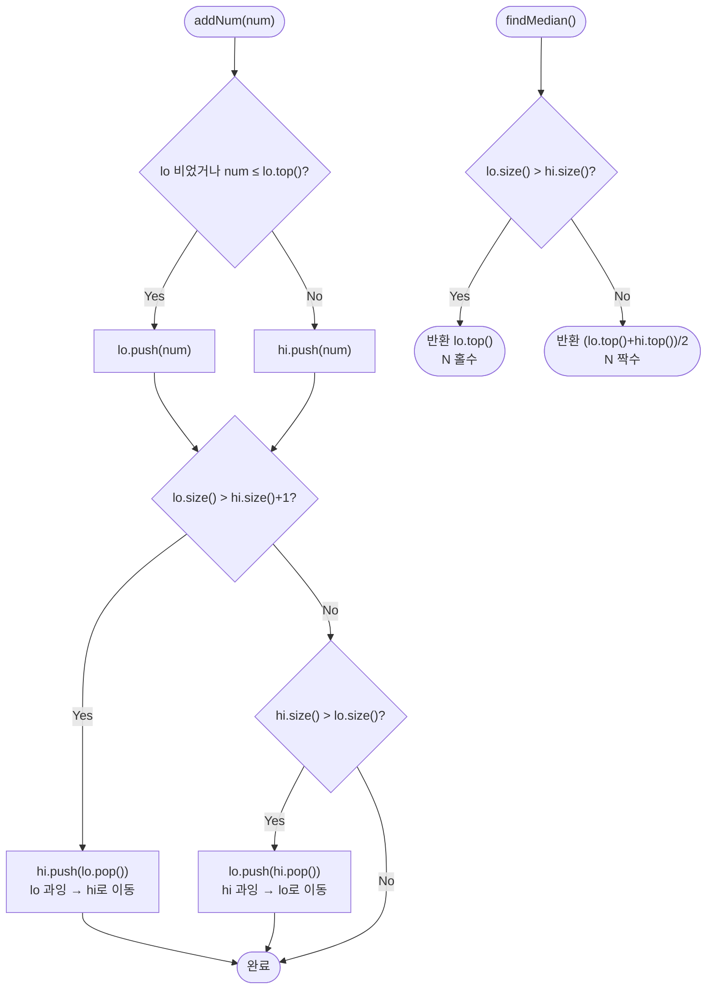

import { AlgorithmSimulation } from "#guide-sim";

# Find Median from Data Stream — 정렬 절반을 두 힙에 나눠 얹는 이유

## 한눈에 보는 컨셉

수가 스트림으로 하나씩 들어올 때마다 중앙값을 물어보는 문제예요. 전체를 매번 다시 정렬할 필요는 없습니다 — 정렬된 배열을 반으로 갈랐을 때 중앙값은 딱 그 경계에 있는 값(하위 절반의 최댓값, 상위 절반의 최솟값)만으로 결정되거든요. 하위 절반을 max-heap, 상위 절반을 min-heap으로 각각 유지하면 삽입은 `O(log N)`, 중앙값 조회는 두 힙의 루트를 보기만 하면 되니 `O(1)`입니다.

## 출발점: 가장 순진한 방법부터

먼저 풀어야 할 함수를 정확히 잡을게요.

```ts
class MedianFinder {
  addNum(num: number): void;   // 스트림에 정수 num을 추가한다
  findMedian(): number;        // 지금까지 추가된 수들의 중앙값을 반환한다
}
```

- 제약: 총 호출 횟수 `1 ≤ Q ≤ 100,000`, 값 범위 `-10^9 ≤ num ≤ 10^9`, `findMedian`은 `addNum`이 최소 1회 호출된 뒤에만 불립니다.
- 목표: `addNum` `O(log N)`, `findMedian` `O(1)` — 합쳐서 `Q`번 호출에 총 `O(Q log Q)`.

"중앙값을 구하려면 정렬된 상태가 있어야 한다"는 생각이 제일 먼저 듭니다. 그러니 가장 정직한 방법은 원소를 계속 쌓아 두다가, 물어볼 때마다 정렬해서 가운데를 짚는 거예요.

```ts
class MedianFinderNaive {
  private arr: number[] = [];
  addNum(num: number): void {
    this.arr.push(num);          // O(1)
  }
  findMedian(): number {
    const sorted = [...this.arr].sort((a, b) => a - b); // O(N log N)
    const n = sorted.length;
    if (n % 2 === 1) return sorted[(n - 1) / 2]!;
    return (sorted[n / 2 - 1]! + sorted[n / 2]!) / 2;
  }
}
```

작은 예로 감을 잡아 볼게요. `1, 2, 3, 4`를 순서대로 넣으면서 매번 `findMedian`을 부르면:

```text
addNum(1) → 정렬 [1]        → median 1
addNum(2) → 정렬 [1,2]      → median 1.5
addNum(3) → 정렬 [1,2,3]    → median 2
addNum(4) → 정렬 [1,2,3,4]  → median 2.5
```

(실측: 위 네 줄은 이 코드를 그대로 실행해 나온 값입니다.) 원소가 몇 개 안 될 땐 멀쩡해 보이지만, 이제 규모를 문제의 제약대로 키워 볼게요. `findMedian`이 매 호출마다 `O(N log N)` 정렬을 다시 하는데, 최악의 경우 `addNum`과 `findMedian`이 번갈아 `Q`번 불리면 `N`이 `1`부터 `Q`까지 커지면서 총 비용은

$$\sum_{i=1}^{Q} O(i \log i) = O(Q^2 \log Q)$$

`Q = 10^5`이면 `Q^2 = 10^{10}`이고 `log₂(10^5) ≈ 17`이니 약 `1.7 × 10^{11}` 연산 — 1초 안에 절대 못 끝냅니다. "그럼 삽입할 때마다 정렬 상태를 유지하면 되지 않나?"라는 생각도 자연스러운데, 이번엔 배열 중간에 값을 끼워 넣는 비용(뒤 원소를 밀어야 하는 삽입) 자체가 `O(N)`이라서 `addNum`이 `Q`번이면 총 `O(Q^2) = 10^{10}`으로 여전히 시간 초과예요.

두 시도 모두 걸리는 지점은 같습니다. **"중앙값 하나 알자고 매번 전체 순서를 다 갖추는 것"**이 낭비라는 거예요. 정렬된 배열 전체가 필요한 게 아니라, 그 경계값 두 개만 알면 충분하다는 낌새가 여기서 보입니다.

## 아이디어 자세히 들여다보기

### 정렬 배열의 경계만 알면 충분하다 — 수식과 그림

다중집합 `S`, `N = |S|`일 때 정렬된 `S`를 정확히 반으로 나눠 봅시다.

```text
sort(S) = [ ... 하위 절반 S_L ... | ... 상위 절반 S_R ... ]
                          ↑                    ↑
                    max(S_L)              min(S_R)
                     (경계 왼쪽)            (경계 오른쪽)
```

$N$이 홀수면 `S_L`이 한 개 더 많도록(`⌈N/2⌉`개) 나누고, 그러면 중앙값은 정확히 `max(S_L)`입니다. $N$이 짝수면 두 절반이 같은 크기(`N/2`개씩)이고 중앙값은 `(max(S_L) + min(S_R)) / 2`예요. 즉 **정렬 배열 전체가 아니라 경계에 있는 두 값, `max(S_L)`과 `min(S_R)`만 알면 중앙값이 정해집니다.**

이걸 자료구조 이름으로 옮기면: `S_L`을 최댓값에 빠르게 접근해야 하는 **max-heap** `lo`로, `S_R`을 최솟값에 빠르게 접근해야 하는 **min-heap** `hi`로 관리합니다.

$$\text{lo (max-heap)}: |\text{lo}| = \lceil N/2 \rceil, \qquad \text{hi (min-heap)}: |\text{hi}| = \lfloor N/2 \rfloor$$

$$\text{값 불변식: } \text{lo.top()} \leq \text{hi.top()} \qquad \text{크기 불변식: } |\text{lo}| - |\text{hi}| \in \{0, 1\}$$

**왜 하필 이 형태여야 하는가?** 두 힙 크기를 항상 똑같이 맞추는 대안도 생각해 볼 수 있는데, 그러면 $N$이 홀수일 때 "남는 한 개"를 어디에 둘지 매번 따로 분기해야 합니다. 반대로 `hi`가 한 개 더 많도록 정의할 수도 있지만, 그러면 중앙값이 `hi.top()`이 되는데 `lo`가 max-heap이라 `lo.top()`을 기준으로 코드를 짜는 쪽이 더 자연스러워요. "홀수일 때 여분은 lo가 갖는다"는 이 비대칭 설계 하나로 파리티 분기가 사라집니다.

작은 예로 직접 채워 볼게요. `1, 2, 3, 4, 5`를 순서대로 넣었을 때 최종 상태는 `sort(S) = [1,2,3,4,5]`, $N=5$(홀수)이므로 `lo = {1,2,3}` (크기 3), `hi = {4,5}` (크기 2)입니다.

```text
sort(S):   1   2   3  |  4   5
           └─ lo ────┘  └─ hi ┘
           top=3          top=4        중앙값 = lo.top() = 3
```

확인 질문 하나 해 볼까요? $N=4$일 때 `lo`와 `hi`는 각각 몇 개씩 담아야 할까요? — 답: 짝수이므로 `⌈4/2⌉ = 2`, `⌊4/2⌋ = 2`로 똑같이 2개씩입니다.

### 셈을 맡는 자료구조 — 힙

`lo`와 `hi`에 요구되는 연산은 "최댓값/최솟값을 `O(1)`에 읽고, 새 원소를 `O(log N)`에 넣는 것"입니다. 이 조건을 정확히 만족하는 자료구조가 힙(heap)이에요 — 최솟값을 다루는 쪽은 min-heap, 최댓값을 다루는 쪽은 max-heap입니다. 힙 자체의 내부 동작(sift-up/sift-down, 배열 기반 구현)이 궁금하다면 이 프로젝트의 [minHeap 가이드](../../../data-structures/heap/minHeap/minHeap-guide.mdx)와 [maxHeap 가이드](../../../data-structures/heap/maxHeap/maxHeap-guide.mdx)를 참고하세요 — 여기서는 "삽입 `O(log N)`, 최상단 조회 `O(1)`인 상자"로만 쓰면 충분합니다.

### 왜 모순 없이 작동하는가

두 불변식(값 불변식, 크기 불변식)이 매 `addNum` 호출 뒤에도 유지된다는 걸 귀납으로 보일게요.

**기저.** 첫 원소를 넣으면 `lo = {x}`, `hi = {}`. `hi`가 비어 있으니 값 불변식은 공허하게 성립하고, 크기 차이는 `1 - 0 = 1`로 크기 불변식도 성립합니다.

**귀납 단계.** 삽입 직전에 두 불변식이 성립한다고 가정하고, `num`이 들어올 때 벌어질 수 있는 경우를 전부 나눠 봅니다. 삽입 규칙은 "`lo`가 비었거나 `num ≤ lo.top()`이면 `lo`에, 아니면 `hi`에"인데, 이 두 조건(`num ≤ lo.top()` 또는 `lo`가 비어 있음 / 그 반대)은 정확히 상호 배타적이면서 모든 경우를 덮습니다 — `lo`가 비어 있지 않다면 `num`은 `lo.top()`보다 크거나 작거나 같거나 둘 중 하나이기 때문이에요.

- `num`이 `lo`에 들어간 경우: `lo`의 최댓값이 `num` 또는 기존 `lo.top()`으로 바뀌는데, 어느 쪽이든 `num ≤ (\text{삽입 전 } lo.top())\leq \text{기존 } hi.top()`이었으므로(귀납 가정) 새 `lo.top()`도 `hi.top()` 이하입니다.
- `num`이 `hi`에 들어간 경우(`num > lo.top()`): `hi`의 새 최솟값은 `min(num, \text{기존 } hi.top())`인데, `lo.top() < num`이고 귀납 가정으로 `lo.top() ≤ \text{기존 } hi.top()`이니 `lo.top() < \min(num, \text{기존 } hi.top())`, 즉 값 불변식이 그대로 유지됩니다.

크기 불변식은 삽입 직후 두 힙의 크기 차이가 `{-2,-1,0,1,2}` 중 하나가 되는데(직전엔 `{0,1}`이었고 한쪽만 1 늘었으므로), 코드의 두 조정 분기 `lo.size() > hi.size()+1`과 `hi.size() > lo.size()`가 이 다섯 가지를 정확히 나눠 처리해서 `{0,1}`로 복원합니다. 두 조건은 동시에 참일 수 없으므로(하나가 참이면 다른 쪽 부등식이 성립하지 않음) 매 호출에서 최대 한 번의 이동만 일어나요.

`findMedian`의 정확성: 크기 불변식이 성립하는 상태에서 `lo`가 더 많다면 그 여분 1개가 바로 정중앙 원소(홀수 `N`)이고, 크기가 같다면 짝수 `N`이므로 두 경계값의 평균이 중앙값의 정의 그대로입니다.

여기서 **헷갈리기 쉬운 포인트**가 하나 있습니다 — "여분을 어느 힙에 둘지"와 "`findMedian`이 어느 힙을 우선하는지"가 서로 어긋나면 안 됩니다. 다음은 삽입/재조정 방향을 통째로 반대로(여분을 `hi`가 갖도록) 짠 버그 버전인데, `findMedian`은 그대로 "`lo`가 많으면 `lo.top()`"만 남겨 둔 경우예요.

```text
입력 1, 2, 3 (N=3, 홀수) — 정답은 2(가운데 원소)여야 합니다.

정상 버전: lo={2,1}(여분), hi={3}       → lo.size()>hi.size() → lo.top()=2   ✓
버그 버전: lo={1}, hi={3,2}(여분이 hi로 감) → lo.size()>hi.size() 거짓
           → 평균 분기로 빠짐 → (lo.top()+hi.top())/2 = (1+2)/2 = 1.5        ✗ (실측값)
```

정답 `2`가 나와야 하는데 버그 버전은 `1.5`를 반환합니다 — 여분을 담는 쪽과 `findMedian`이 우선하는 쪽이 어긋나면, 홀수 개인데도 조용히 평균 분기로 빠져 버립니다.

엣지 케이스도 짚어 둘게요.

```text
원소 1개    addNum(5)                       → median = 5           (홀수, lo만 존재)
원소 2개    addNum(1), addNum(3)            → median = 2.0         (짝수, 평균)
음수 포함   addNum(-1), addNum(0)           → median = -0.5        (음수도 동일 규칙)
동일 값     addNum(5), addNum(5)            → median = 5           (중복도 정상)
경계값      addNum(-10^9), addNum(10^9)     → median = 0           (합산 2×10^9, JS number 범위 내 안전)
```

(모두 실측값입니다.)

## 아이디어를 코드로 옮기기

JavaScript/TypeScript에는 내장 힙이 없으니 배열 기반 min-heap을 하나 만들고, max-heap은 값의 부호를 뒤집어 min-heap을 재사용하는 방식으로 구현합니다.

```ts
class MinHeap {
  private data: number[] = [];
  size(): number { return this.data.length; }
  top(): number { return this.data[0]!; }
  push(x: number): void {
    this.data.push(x);
    let i = this.data.length - 1;
    while (i > 0) {
      const parent = (i - 1) >> 1;
      if (this.data[parent]! <= this.data[i]!) break;
      [this.data[parent]!, this.data[i]!] = [this.data[i]!, this.data[parent]!];
      i = parent;
    }
  }
  pop(): number {
    const top = this.data[0]!;
    const last = this.data.pop()!;
    if (this.data.length > 0) {
      this.data[0] = last;
      let i = 0;
      const n = this.data.length;
      while (true) {
        const l = 2 * i + 1, r = 2 * i + 2;
        let smallest = i;
        if (l < n && this.data[l]! < this.data[smallest]!) smallest = l;
        if (r < n && this.data[r]! < this.data[smallest]!) smallest = r;
        if (smallest === i) break;
        [this.data[smallest]!, this.data[i]!] = [this.data[i]!, this.data[smallest]!];
        i = smallest;
      }
    }
    return top;
  }
}

class MaxHeap {
  private inner = new MinHeap();
  size(): number { return this.inner.size(); }
  top(): number { return -this.inner.top(); }
  push(x: number): void { this.inner.push(-x); }
  pop(): number { return -this.inner.pop(); }
}

class MedianFinderBase {
  private lo = new MaxHeap(); // 하위 절반
  private hi = new MinHeap(); // 상위 절반

  addNum(num: number): void {
    if (this.lo.size() === 0 || num <= this.lo.top()) {
      this.lo.push(num);
    } else {
      this.hi.push(num);
    }
    if (this.lo.size() > this.hi.size() + 1) {
      this.hi.push(this.lo.pop());
    } else if (this.hi.size() > this.lo.size()) {
      this.lo.push(this.hi.pop());
    }
  }

  findMedian(): number {
    if (this.lo.size() > this.hi.size()) return this.lo.top();
    return (this.lo.top() + this.hi.top()) / 2;
  }
}
```

결정 지점만 짚을게요. `lo.size() === 0` 가드는 첫 삽입에서 `lo.top()`을 호출해 빈 배열에 접근하는 사고를 막습니다. 비교에 `num < lo.top()`이 아니라 `num <= lo.top()`을 쓴 것도 의도적이에요 — 같은 값이 반복될 때 `<`만 쓰면 동률인 값이 계속 `hi`로만 몰려 크기 불변식 복원 횟수가 늘 뿐 정확성 자체가 깨지진 않지만, `<=`를 쓰면 값 불변식 조건(`lo.top() ≤ hi.top()`)의 등호 허용과 그대로 맞아떨어져 코드와 불변식 정의가 일치합니다. **가장 실수가 잦은 부분은 재조정의 두 분기 `if / else if` 순서와 조건**입니다 — 두 조건이 상호 배타적이라 순서를 바꿔도 결과는 같지만, 조건의 방향(`lo`가 과잉일 때 `hi`로, `hi`가 과잉일 때 `lo`로)을 반대로 적으면 앞서 본 버그 버전처럼 조용히 틀린 값을 냅니다.

## 더 빠르게 만들 단서 찾기

`addNum`이 매번 거치는 분기를 세어 봅시다.

```text
1. lo.isEmpty()?             ← 가드 1회
2. num <= lo.top()?          ← 값 비교 1회 (어느 힙에 넣을지 결정)
3. lo.size() > hi.size()+1?  ← 크기 비교 1회
4. (3이 거짓이면) hi.size() > lo.size()?  ← 크기 비교 1회 더

→ 값이 어디로 갈지 매번 "판단"한 다음에야 push가 시작된다
```

두 힙 모두 이미 `O(log N)`이라 점근 복잡도는 더 줄어들 여지가 없습니다. 다만 실제로 실행되는 코드 경로를 보면, 매 삽입마다 "이 값이 어느 절반에 속하는지"를 값으로 직접 판단(`isEmpty` 가드 + 비교)한 뒤에야 정확한 힙에 넣깁니다. 그런데 **힙 구조 자체가 이미 "최댓값을 뽑는" 연산을 갖고 있다**는 걸 떠올리면, 값 비교를 코드가 직접 하지 않고 힙에 위임할 수 있지 않을까요?

## 단서를 최적화로 연결하기

값을 미리 판단해서 넣는 대신, **일단 아무 값이나 `lo`에 넣고, `lo`의 최댓값(힙이 알아서 골라 줌)을 곧바로 `hi`로 넘기면** 어떨까요. `lo`가 max-heap이니 `pop()`은 항상 "지금 이 시점 최댓값"을 돌려주고, 그 값을 `hi`로 옮기면 결과적으로 값 불변식이 자동으로 세워집니다. 그다음엔 크기만 확인해서 한쪽이 넘치면 되돌리면 됩니다.

```text
Before (분기형): num을 먼저 비교해서 lo/hi 중 하나를 "판단"해 넣음
After (위임형):  일단 lo에 넣고 → lo.pop()(최댓값)을 hi로 넘김 → 크기만 확인

값 비교(2번)와 isEmpty 가드(1번)가 통째로 사라지고, "누가 더 큰가"는
힙의 pop()이 구조적으로 대신 판단해 준다.
```

이렇게 하면 `num`과 `lo.top()`을 코드에서 직접 비교하는 지점이 사라지고, 힙 연산 자체가 그 역할을 떠맡습니다. 점근 복잡도는 그대로 `O(log N)`이지만(둘 다 힙 연산 1~2회), 분기 수가 줄어 코드 경로가 단순해집니다.

## 최적화 코드

바뀌는 부분은 `addNum` 하나뿐입니다.

```ts
class MedianFinder {
  private lo = new MaxHeap();
  private hi = new MinHeap();

  addNum(num: number): void {
    this.lo.push(num);
    this.hi.push(this.lo.pop());       // lo의 현재 최댓값을 hi로 넘김 → 값 불변식 자동 성립
    if (this.hi.size() > this.lo.size()) {
      this.lo.push(this.hi.pop());     // hi가 넘치면 되돌림 → 크기 불변식 복원
    }
  }

  findMedian(): number {
    if (this.lo.size() > this.hi.size()) return this.lo.top();
    return (this.lo.top() + this.hi.top()) / 2;
  }
}
```

**가장 중요한 줄은 `this.hi.push(this.lo.pop())`입니다.** `lo`가 max-heap이므로 `pop()`은 "방금 넣은 `num`을 포함한 `lo` 전체의 현재 최댓값"을 정확히 골라 돌려줍니다 — 이 한 줄이 예전의 `if (num <= lo.top())` 분기 전체를 대신합니다. 만약 이 줄의 순서를 바꿔 `hi`에 먼저 넣고 `hi.pop()`(최솟값)을 `lo`로 넘기는 식으로 좌우를 반대로 짜면, 값 불변식이 반대 방향으로 세워져 위에서 본 버그 버전과 똑같은 증상(홀수 `N`인데 평균 분기로 빠지는 문제)이 재현됩니다.

> 일단 lo에 넣고, 넘치는 최댓값은 곧장 hi로 넘긴다.

더 최적화할 여지가 있을까요? `addNum`은 이미 힙 연산 2~3회로 `O(log N)`이고, 비교 기반 자료구조로 원소를 정렬된 상태에 유지하는 한 삽입마다 최소 `O(log N)`번의 비교가 필요하다는 것은 비교 정렬의 하한(결정 트리 논증)과 같은 이유로 더 줄이기 어렵습니다. `findMedian`도 이미 `O(1)`이라 여기서 점근적으로 끝입니다. 참고로 슬라이딩 윈도우 중앙값(오래된 원소를 빼야 하는 변형)처럼 **임의 원소 삭제**가 필요한 문제에는 지연 삭제(lazy deletion)를 얹은 인덱스형 힙이나 균형 이진 탐색 트리 기반의 order-statistics 자료구조가 쓰이는데, 그건 이 문제의 범위를 넘어서는 특화 해법입니다. 지금 이 두 힙 구조의 가치는 **구현이 단순하면서도(자체 균형 트리 불필요) 점근적으로 최선**이라는 데 있습니다.

## 실행 시각화

수 `1, 2, 3, 4, 5`를 순서대로 `addNum`으로 삽입하며 두 힙의 상태와 중앙값 변화를 추적합니다(위 "기본 구현"의 분기 로직을 그대로 따라간 진행이며, 최적화 버전으로 넣어도 각 단계의 `lo`/`hi` 최상단 값과 최종 중앙값은 동일합니다 — 실측으로 교차 검증했습니다). `lo`는 하위 절반을 담는 max-heap(top=최댓값), `hi`는 상위 절반을 담는 min-heap(top=최솟값)입니다. `priorityQueue` 패널은 `hi`(min-heap) 내부 상태를, `keyValue` 패널은 `lo` 내용과 현재 `findMedian()` 값을 보여줍니다. 크기 불변식 `|lo|-|hi| ∈ {0,1}`과 값 불변식 `lo.top() ≤ hi.top()`이 매 삽입 후 유지됩니다. 마지막 `findMedian()` 반환값은 `3`(N=5, 홀수 → `lo.top()`)이며 시뮬레이션 마지막 프레임과 일치합니다.

> 대화형 시뮬레이션은 MDX 런타임에서 표시됩니다.

export const steps = [
  {
    title: "addNum(1)",
    detail: "lo 비어있어 lo에 삽입. N=1 홀수 → median = lo.top() = 1.",
    heap: [],
    entries: [
      { label: "lo (max-heap)", value: "[1]" },
      { label: "median", value: 1 },
    ],
  },
  {
    title: "addNum(2)",
    detail: "2 > lo.top()=1 → hi에 삽입. 크기 같음 → median = (1+2)/2.",
    heap: [{ label: "2", key: 2 }],
    entries: [
      { label: "lo (max-heap)", value: "[1]" },
      { label: "median", value: 1.5 },
    ],
  },
  {
    title: "addNum(3)",
    detail: "3 > lo.top()=1 → hi에 삽입 후 hi가 커짐 → hi.top()=2를 lo로 이동. N=3 홀수 → median = lo.top() = 2.",
    heap: [{ label: "3", key: 3 }],
    entries: [
      { label: "lo (max-heap)", value: "[2, 1]" },
      { label: "median", value: 2 },
    ],
  },
  {
    title: "addNum(4)",
    detail: "4 > lo.top()=2 → hi에 삽입. 크기 같음 → median = (2+3)/2.",
    heap: [{ label: "3", key: 3 }, { label: "4", key: 4 }],
    entries: [
      { label: "lo (max-heap)", value: "[2, 1]" },
      { label: "median", value: 2.5 },
    ],
  },
  {
    title: "addNum(5)",
    detail: "5 > lo.top()=2 → hi에 삽입 후 hi가 커짐 → hi.top()=3을 lo로 이동. N=5 홀수 → median = lo.top() = 3.",
    heap: [{ label: "4", key: 4 }, { label: "5", key: 5 }],
    entries: [
      { label: "lo (max-heap)", value: "[3, 2, 1]" },
      { label: "median", value: 3 },
    ],
  },
  {
    title: "완료: findMedian() = 3",
    detail: "lo=[3,2,1], hi=[4,5]. lo가 1개 더 많아 median = lo.top() = 3.",
    heap: [{ label: "4", key: 4 }, { label: "5", key: 5 }],
    highlight: [0],
    entries: [
      { label: "lo (max-heap)", value: "[3, 2, 1]" },
      { label: "반환값", value: 3 },
    ],
  },
];

<AlgorithmSimulation view={["priorityQueue", "keyValue"]} steps={steps} title="MedianFinder: 1,2,3,4,5 삽입" />

## 흐름 한눈에 보기



## 스스로 점검하기

1. `7, 2, 9, 4`를 순서대로 `addNum`에 넣으면서 매 단계 `findMedian()` 값을 손으로 구해 보세요. (답: `7 → 4.5 → 7 → 5.5`. 세 번째 값에서 `lo={7,4}, hi={9}`가 되어 `lo.size()>hi.size()`이므로 `lo.top()=7`이 나오는지 확인해 보세요.)
2. 본문의 버그 버전(여분을 `hi`가 갖도록 방향을 반대로 짠 버전)이 `1, 2, 3`을 넣었을 때 `1.5`를 반환하는 이유를 `lo`/`hi`의 실제 내용물을 적어 가며 추적해 보세요.
3. 만약 "최근 `k`개 원소만 유지하는" 슬라이딩 윈도우 중앙값으로 문제가 바뀐다면, 지금의 두 힙 구조에서 어떤 연산이 새로 필요해질까요? (힌트: 힙은 임의 위치의 원소를 바로 지우는 연산을 기본으로 제공하지 않습니다.)
