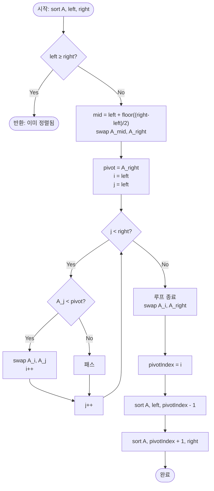

import { AlgorithmSimulation } from "#guide-sim";

# Quicksort — 피벗 하나의 위치를 확정지으면 그 원소는 다시 볼 필요가 없는 이유

## 한눈에 보는 컨셉

배열 안에서 기준값(피벗) 하나를 고르고, 그 값보다 작은 원소는 왼쪽으로 큰 원소는 오른쪽으로 몰아붙이면 피벗은 정렬된 최종 위치에 **그 자리에서 확정**됩니다. 확정된 피벗은 이후 다시 비교할 필요가 없으므로, 왼쪽 구간과 오른쪽 구간을 똑같은 방식으로 재귀 처리하면 전체가 정렬됩니다. 분할이 균형 잡히면 재귀 깊이가 `O(log N)`으로 줄어, 평균 `O(N log N)`에 정렬이 끝납니다.

## 출발점: 가장 순진한 방법부터

풀어야 할 함수부터 정확히 고정할게요.

```ts
function quickSort(nums: number[]): number[]
```

| 항목 | 내용 |
|------|------|
| 입력 `nums` | 정렬할 정수 배열 |
| 제약 | $1 \leq N \leq 50{,}000$, $-50{,}000 \leq \text{nums}[i] \leq 50{,}000$ |
| 반환 | `nums`를 오름차순으로 정렬한 배열(제자리에서 바꿔도 됨) |
| 보존 규칙 | 반환된 배열의 다중집합(multiset)은 입력과 같아야 함(중복 개수까지 보존) |

가장 정직하게 접근하면 이렇습니다 — **"가장 작은 원소를 하나씩 확정해 앞으로 보내자."** 배열 전체를 훑어 최솟값을 찾고, 그걸 맨 앞과 바꾸고, 다음 칸부터 같은 일을 반복하는 겁니다.

```ts
function selectionSortNaive(nums: number[]): number[] {
  const n = nums.length;
  for (let i = 0; i < n; i++) {
    let minIdx = i;
    for (let j = i + 1; j < n; j++) {
      if (nums[j]! < nums[minIdx]!) minIdx = j; // 아직 못 확정한 구간에서 최솟값 탐색
    }
    [nums[i], nums[minIdx]] = [nums[minIdx]!, nums[i]!];
  }
  return nums;
}
```

`selectionSortNaive([5, 2, 3, 1])`을 실행하면 `[1, 2, 3, 5]`가 나옵니다 — 정답은 맞습니다. 문제는 **속도**예요. 바깥 루프가 `i`를 한 칸 옮길 때마다 안쪽 루프가 남은 구간 전체를 다시 훑으므로, 입력이 이미 정렬돼 있든 뒤죽박죽이든 상관없이 항상 같은 양의 비교가 일어납니다.

```text
N = 50,000

비교 횟수 ≈ N(N-1)/2 ≈ 1.25 × 10^9

시간 제한 1초, 초당 처리 가능한 연산 ≈ 10^8~10^9  → 시간 초과 위험이 큼
```

여기서 낌새 하나가 보입니다. 배열 전체를 매번 다시 훑을 필요 없이, **"이 값보다 작은 건 왼쪽, 큰 건 오른쪽"** 이라는 기준 하나로 배열을 단번에 갈라 버리면 어떨까요? 이 갈라내기(파티셔닝)를 한 번 하는 데는 배열을 한 번만 훑으면 되니 `O(N)`이고, 그 뒤로는 문제 크기가 절반 가까이로 줄어들 수 있습니다. 이 아이디어를 다음 절에서 정식으로 다듬어 봅니다.

## 아이디어 자세히 들여다보기

### 피벗으로 배열을 가르기 — 수식과 그림

구간 `[left, right]`를 처리한다고 합시다. 피벗 값 하나를 고르고, 배열을 한 번 훑으면서 피벗보다 작은 값들을 왼쪽에, 크거나 같은 값들을 오른쪽에 모으는 연산을 **파티션(partition)**이라 부릅니다.

파티션이 끝난 뒤의 상태를 정식으로 쓰면 다음과 같습니다. 파티션이 반환하는 인덱스를 $p$라 할 때,

$$\forall k \in [\text{left}, p-1]:\ A[k] < A[p], \qquad \forall k \in [p+1, \text{right}]:\ A[k] \geq A[p]$$

즉 $A[p]$는 **이 구간을 오름차순으로 정렬했을 때 있어야 할 바로 그 자리**에 놓입니다. 왜 이 정의를 쓸까요? "완전히 정렬한다" 대신 "피벗 하나만 정위치에 놓는다"로 목표를 낮췄기 때문에 `O(N)` 한 번의 훑기로 끝낼 수 있다는 게 핵심입니다 — 만약 파티션이 전체를 정렬해 버리는 정의였다면 애초에 재귀가 필요 없었겠죠.

작은 예로 손을 움직여 봅시다. `A = [5, 2, 4, 1]`에서 인덱스 `1`(값 `2`)을 피벗으로 고른다고 하면,

```text
피벗 = 2

A = [5, 2, 4, 1]
     ↑작다? 아니오(5≥2)   2=피벗 자신   4≥2  1<2

파티션 후 기대 모양:  [1] | 2 | [5, 4]   (순서는 안 중요, 좌우 소속만 중요)
```

왼쪽 칸에는 `2`보다 작은 `1`만, 오른쪽 칸에는 `2` 이상인 `5, 4`만 남아야 합니다. 잠깐 확인 질문 하나 — 만약 피벗이 배열에서 가장 작은 값이라면, 왼쪽 칸에는 몇 개의 원소가 남을까요? 정답은 **0개**입니다. 왼쪽 구간이 통째로 비어 버리는 극단적인 경우도 파티션 정의 자체는 문제없이 다룹니다(이 극단이 성능에 어떤 영향을 주는지는 곧 다룹니다).

### 단서를 설명해 주는 이론 — 분할 정복과 마스터 정리

파티션이 피벗 하나를 정위치에 놓아 준다는 사실은, 남은 두 구간 `[left, p-1]`과 `[p+1, right]`가 **서로 완전히 독립**이라는 것도 말해 줍니다. 왼쪽 구간의 어떤 값도 오른쪽 구간의 어떤 값보다 크지 않으므로, 두 구간을 각각 정렬해 이어 붙이기만 하면 전체가 정렬됩니다. 이것이 분할 정복(Divide and Conquer)의 전형적인 모양이고, 재귀 호출의 비용은 다음 점화식으로 정리됩니다.

$$T(N) = T(k) + T(N-1-k) + O(N)$$

여기서 $k$는 왼쪽 구간의 크기, $O(N)$은 파티션 한 번의 비용입니다. **분할이 항상 균형 잡혀** $k \approx N/2$이면,

$$T(N) = 2T(N/2) + O(N)$$

마스터 정리(Master Theorem)의 $a=2, b=2, f(N)=O(N)$ 경우($f(N) = O(N^{\log_b a}) = O(N)$)에 해당하고, 이때 $T(N) = O(N \log N)$이 성립합니다. 재귀 트리를 그려 보면 이유가 보입니다.

```text
깊이 0:  N              (파티션 비용 N)
깊이 1:  N/2 + N/2       (파티션 비용 합 N)
깊이 2:  N/4×4개         (파티션 비용 합 N)
  ...
깊이 log N: 크기 1인 조각 N개   (기저 케이스)

깊이마다 파티션 비용의 합이 항상 O(N)이고, 깊이가 log N개 있으므로 총 O(N log N)
```

반대로 **분할이 항상 불균형**해서 한쪽이 `0`, 다른 쪽이 `N-1`이면 $T(N) = T(N-1) + O(N)$이 되어 등차수열의 합, 즉 $O(N^2)$이 됩니다. 이 "균형이 곧 속도"라는 관계를 뒤에서 피벗 선택 전략을 개선할 때 다시 소환할 것이니 기억해 두세요.

이 문제에서는 파티셔닝을 배열 안에서 원소를 맞바꾸는 것만으로 처리하므로, 별도의 보조 자료구조(해시맵, 트리 등) 없이 원본 배열과 재귀 호출 스택만으로 충분합니다.

### 왜 모순 없이 작동하는가

퀵 정렬이 항상 올바른 결과를 낸다는 것을 귀납으로 확인해 봅시다.

- **기저**: 구간 크기가 `0`이거나 `1`(`left >= right`)이면 이미 정렬된 상태이므로 아무 일도 하지 않아도 됩니다.
- **귀납 단계**: 구간 크기가 `2` 이상이면, 파티션이 피벗을 정위치 `p`에 놓고 `A[left..p-1] < A[p] ≤ A[p+1..right]`를 만들어 준다고 가정합시다(파티션 자체의 정당성은 아래에서 별도로 봅니다). 두 하위 구간 `[left, p-1]`, `[p+1, right]`는 항상 원래 구간보다 **엄밀히 더 작으므로**(피벗 자신이 최소 하나 빠지므로), 귀납 가정에 의해 재귀 호출 이후 두 구간이 각각 오름차순으로 정렬됩니다. 왼쪽 구간의 모든 값 `< A[p] ≤` 오른쪽 구간의 모든 값이므로, 세 조각을 이어 붙인 전체 `A[left..right]`도 오름차순입니다. 크기가 계속 줄어드는 재귀는 유한 번 안에 기저에 도달하므로 반드시 종료합니다.

파티션 내부의 정당성도 짚어야 합니다. 루프 불변식은 "$j$번째까지 훑었을 때, $A[\text{left}..i-1]$은 모두 피벗보다 작고 $A[i..j-1]$은 모두 피벗 이상"입니다. 매 반복에서 `A[j] < pivot`이면 `A[i]`와 `A[j]`를 바꾸고 `i`를 늘려 불변식을 유지하고, 아니면 그대로 두어도 `A[j]`가 이미 "피벗 이상" 구간에 속하니 불변식이 깨지지 않습니다. 이 두 경우가 `A[j]`와 피벗을 비교했을 때 나올 수 있는 전부이므로(작다/작지 않다), 경우가 빠짐없이 다뤄집니다.

여기서 **헷갈리기 쉬운 포인트**는 "피벗보다 작은 값을 왼쪽으로 옮긴다"는 말을 "정렬까지 끝낸다"는 뜻으로 오해하는 것입니다. 아닙니다 — 왼쪽 구간 안에서는 순서가 뒤죽박죽이어도 됩니다. 오직 **왼쪽 전체 < 피벗 ≤ 오른쪽 전체**라는 소속 관계만 보장됩니다.

```text
A = [5, 2, 4, 1], 피벗 = 2

파티션 직후 가능한 모양: [1, 5, 4, 2]   ← 5와 4가 왼쪽/오른쪽 내부에서 순서 안 맞아도 정상
                          [1]는 왼쪽(< 2), [5,4]는 오른쪽(≥ 2) 이라는 소속만 확정
```

엣지 케이스도 점검해 둘게요.

```text
빈 배열 []          → left(0) >= right(-1) → 즉시 반환, 정렬 완료
단일 원소 [5]        → left(0) >= right(0)  → 즉시 반환, 정렬 완료
전부 같은 값 [2,2,2]  → 모든 A[j]가 pivot과 "작지 않음" → i가 늘지 않고 파티션은 맨 끝을 가리킴
                       (왼쪽 구간 크기 0, 오른쪽 구간 크기 N-1 — 아래에서 이 경우의 비용을 따로 다룸)
```

## 아이디어를 코드로 옮기기

가장 단순한 형태부터 옮겨 보겠습니다. 피벗은 **구간의 마지막 원소**로 고정하고, 위에서 정의한 불변식 그대로 파티션을 구현합니다(Lomuto 파티션).

```ts
function swap(a: number[], i: number, j: number): void {
  const tmp = a[i]!;
  a[i] = a[j]!;
  a[j] = tmp;
}

function partitionLast(a: number[], left: number, right: number): number {
  const pivot = a[right]!; // 마지막 원소를 피벗으로 고정
  let i = left;
  for (let j = left; j < right; j++) {
    if (a[j]! < pivot) {
      swap(a, i, j);
      i++;
    }
  }
  swap(a, i, right); // 피벗을 최종 위치 i로 이동
  return i;
}

function sortLast(a: number[], left: number, right: number): void {
  if (left >= right) return; // 기저 케이스
  const p = partitionLast(a, left, right);
  sortLast(a, left, p - 1);
  sortLast(a, p + 1, right);
}

function quickSortBasic(nums: number[]): number[] {
  sortLast(nums, 0, nums.length - 1);
  return nums;
}
```

가장 실수가 잦은 줄은 `if (left >= right) return;` 입니다. `left > right`(빈 구간)만 걸러내고 `left === right`(원소 하나)를 빠뜨리면, 크기 1짜리 구간에서도 파티션을 시도하다가 `a[right]!`와 `a[left]!`가 같은 칸을 가리키는 등 불필요한 재귀가 무한히 반복될 위험이 생깁니다. 그다음으로 중요한 지점은 `swap(a, i, right)`입니다 — 루프 안에서는 피벗이 `a[right]`에 그대로 남아 있다가, 루프가 끝난 순간에야 `i` 위치로 옮겨져 정위치가 확정됩니다.

## 더 빠르게 만들 단서 찾기

이 기본 구현을 이미 오름차순으로 정렬된 배열에 돌려 보면 무슨 일이 벌어질까요? 마지막 원소가 항상 그 구간의 **최댓값**이므로, 파티션을 한 번 할 때마다 왼쪽 구간에는 `N-1`개, 오른쪽(피벗 자신 제외)에는 `0`개가 남습니다.

```text
정렬된 배열 [0, 1, 2, ..., N-1] 에서 partitionLast:

구간 크기 N   → 피벗은 항상 그 구간의 최댓값 → 왼쪽 N-1개, 오른쪽 0개
구간 크기 N-1 → 다시 왼쪽 N-2개, 오른쪽 0개
  ...
재귀 깊이 ≈ N,  각 깊이마다 파티션 비용 O(구간 크기)  →  O(N + (N-1) + ... + 1) = O(N^2)
```

실제로 측정해 보면 `N = 2000`짜리 정렬된 배열에서 `quickSortBasic`은 파티션 호출이 `1999`번, 최대 재귀 깊이가 `1998`에 달합니다 — 앞서 이론 절에서 본 "분할이 불균형하면 `T(N) = T(N-1) + O(N)`" 이 그대로 실측에서 재현된 것입니다. 이미 정렬됐거나 역순인 입력은 드문 경우가 아니라 실무에서 자주 마주치는 입력이므로, 이 약점은 반드시 손봐야 합니다.

## 단서를 최적화로 연결하기

문제는 "피벗을 항상 구간의 끝"에서 고르기 때문에, 정렬된/역순 입력에서 피벗이 매번 극값(최댓값 또는 최솟값)이 되어 버린다는 점입니다. 극값을 피하는 가장 손쉬운 방법은 **구간의 중간 위치**를 피벗으로 고르는 것입니다.

```text
Before (마지막 원소 피벗):
  정렬된 배열 [0,1,2,...,N-1]  →  피벗은 항상 오른쪽 끝 = 최댓값  →  N-1 / 0 분할

After (중간 원소 피벗):
  정렬된 배열 [0,1,2,...,N-1]  →  피벗은 항상 중앙값  →  대략 N/2 / N/2 분할
```

중간 원소를 고른 뒤, 기존 파티션 로직을 그대로 재사용하기 위해 그 값을 맨 끝(`right`)으로 옮겨 두기만 하면 나머지 파티션 코드는 손댈 필요가 없습니다. **정렬된 입력이든 역순 입력이든** 중간 인덱스의 값은 그 구간의 중앙값에 가까우므로 균형 잡힌 분할이 만들어집니다 — 앞선 마스터 정리 절에서 본 "균형이 곧 `O(N log N)`"이라는 관계가 바로 이 지점에서 힘을 발휘합니다.

> 끝만 믿지 말고 가운데를 보라 — 정렬돼 있을수록 끝은 극값이고, 가운데는 중앙값에 가깝다.

## 최적화 코드

바뀌는 부분은 파티션 맨 앞의 **피벗 선택 두 줄**뿐입니다.

```ts
function partitionMid(a: number[], left: number, right: number): number {
  const mid = left + Math.floor((right - left) / 2);
  swap(a, mid, right); // 중간 원소를 피벗으로 골라 맨 끝으로 이동
  const pivot = a[right]!;
  let i = left;
  for (let j = left; j < right; j++) {
    if (a[j]! < pivot) {
      swap(a, i, j);
      i++;
    }
  }
  swap(a, i, right);
  return i;
}

function sortMid(a: number[], left: number, right: number): void {
  if (left >= right) return;
  const p = partitionMid(a, left, right);
  sortMid(a, left, p - 1);
  sortMid(a, p + 1, right);
}

function quickSort(nums: number[]): number[] {
  sortMid(nums, 0, nums.length - 1);
  return nums;
}
```

가장 중요한 줄은 `const mid = left + Math.floor((right - left) / 2);` 입니다. `(left + right) / 2`처럼 흔히 쓰는 형태 대신 `left + (right - left) / 2`로 쓴 이유는, 두 인덱스가 모두 매우 큰 값일 때(이 문제의 제약상 `N ≤ 50{,}000`이라 실제로는 오버플로가 나지 않지만) `left + right`가 먼저 계산되는 형태를 피하는 안전한 관용구이기 때문입니다. 실제로 같은 `N = 2000` 정렬된 배열에 `quickSort`(중간 피벗)를 돌리면 파티션 호출 `1023`번, 최대 재귀 깊이 `9`로 — 기본 구현의 깊이 `1998`에서 로그 스케일로 줄어듭니다.

이걸로 끝일까요? 아직 한 가지 약점이 남아 있습니다. **모든 원소가 같은 값**인 배열에서는 어느 원소를 피벗으로 고르든 `A[j] < pivot`이 단 한 번도 참이 되지 않으므로, `i`가 전혀 늘지 않고 파티션은 항상 `[left, right-1]` / `[]`로 극단적으로 나뉩니다. 실제로 `N = 500`짜리 전부 같은 값 배열에서 측정하면 마지막 원소 피벗이든 중간 원소 피벗이든 **똑같이** 파티션 호출 `499`번, 재귀 깊이 `498`이 나옵니다 — 피벗 선택 전략을 바꿔도 전혀 개선되지 않는다는 뜻입니다. 이 약점은 "작다/크거나 같다" 두 갈래로만 나누는 Lomuto 파티션의 근본적인 한계이고, 이를 해소하려면 "작다/같다/크다" 세 갈래로 나누는 3-way 파티셔닝(Dutch National Flag)이나 무작위 피벗·Median-of-Three 같은 별도 기법이 필요합니다. 이 가이드에서는 그 존재만 짚고 더 구현하지 않습니다 — 이미 이번 최적화로 "정렬됨/역순"이라는 흔한 입력 패턴에서 평균 목표였던 `O(N log N)`을 달성했고(이론 절의 마스터 정리가 그대로 실측과 일치), 중복이 극단적으로 많은 입력에 대한 방어는 이 가이드의 범위를 넘는 별도 개선 축이기 때문입니다.

## 실행 시각화

고정 입력 `A = [5, 2, 4, 1]`에 대해 `quickSort`(중간 원소 피벗)의 첫 파티셔닝 과정을 추적합니다. 위 "최적화 코드"의 `partitionMid(a, 0, 3)`을 그대로 실행한 값이며, `mid = 0 + floor((3-0)/2) = 1`이므로 인덱스 `1`의 값 `2`가 피벗으로 선택되고, 실행 결과 반환 인덱스는 `1`, 배열은 `[1, 2, 4, 5]`로 바뀝니다(스크래치 코드로 직접 실행해 확인한 값입니다). 패널에서 빨간색(`highlight`)은 이번 단계에서 교환(swap)될 대상, 회색(`marked`)은 피벗이 보관 중이거나 이미 확정된 위치를 뜻하고, `i`는 "피벗보다 작은 값들이 모일 다음 칸", `j`는 "현재 검사 중인 칸"입니다.

> 대화형 시뮬레이션은 MDX 런타임에서 표시됩니다.

export const steps = [
  { title: "파티션 시작", detail: "초기 배열 [5, 2, 4, 1], mid=1, 값 2를 피벗으로 지정.", array: [5, 2, 4, 1] },
  { title: "피벗 이동", detail: "안전한 파티셔닝을 위해 피벗(2)을 맨 끝(1)과 스왑하여 치워둔다.", array: [5, 1, 4, 2], marked: [3], highlight: [1, 3] },
  { title: "초기 포인터 (j=0)", detail: "피벗=2. i=0, j=0. A[0]=5 는 2보다 작지 않다. i는 제자리 유지.", array: [5, 1, 4, 2], marked: [3], pointers: { i: 0, j: 0 } },
  { title: "포인터 전진 (j=1)", detail: "A[1]=1 은 피벗 2보다 작다. A[i]와 A[j] 스왑을 지시.", array: [5, 1, 4, 2], marked: [3], highlight: [0, 1], pointers: { i: 0, j: 1 } },
  { title: "스왑 완료 및 i 증가", detail: "A[0]과 A[1] 스왑됨. i를 1로 전진. 작은 값 구간은 A[0..0]이 됨.", array: [1, 5, 4, 2], marked: [3], pointers: { i: 1, j: 1 } },
  { title: "포인터 전진 (j=2)", detail: "A[2]=4 는 피벗 2보다 작지 않다. i 유지.", array: [1, 5, 4, 2], marked: [3], pointers: { i: 1, j: 2 } },
  { title: "탐색 종료, 피벗 복귀 준비", detail: "루프 종료. i=1 위치가 피벗이 들어갈 최종 자리. A[i]와 끝에 둔 피벗을 스왑.", array: [1, 5, 4, 2], highlight: [1, 3], pointers: { i: 1 } },
  { title: "파티션(분할) 완료", detail: "피벗(2)의 위치가 인덱스 1로 영구 확정됨. [1] < 2 < [5, 4].", array: [1, 2, 4, 5], marked: [1], pointers: { i: 1 } }
];

<AlgorithmSimulation view="array" steps={steps} title="Quicksort 파티셔닝: [5, 2, 4, 1]" />

## 흐름 한눈에 보기



## 스스로 점검하기

1. `A = [3, 3, 3, 3]`(전부 같은 값, `N=4`)에 `quickSort`(중간 원소 피벗)를 손으로 따라가 보세요. 몇 번의 파티션 호출이 일어나고, 왼쪽/오른쪽 구간의 크기는 매번 각각 몇으로 나뉘나요? (힌트: "최적화 코드" 절에서 다룬 전부-동일 값의 약점이 그대로 재현됩니다.)
2. `sortLast`(기본 구현, 마지막 원소 피벗)를 `A = [1, 2, 3, 4, 5]`(이미 정렬된 배열)에 돌리면 첫 파티션에서 왼쪽 구간과 오른쪽 구간의 크기가 각각 몇이 되는지, 그리고 그 이유가 어떤 줄에서 비롯되는지 짚어 보세요.
3. 만약 배열이 **원형(circular)**이어서 마지막 다음이 다시 처음으로 이어진다면(즉 "정렬"이라는 개념 자체가 회전에 대해 불변이어야 한다면), 지금의 파티션·재귀 틀을 그대로 쓸 수 있을까요? 어느 지점(피벗 비교 기준, 구간 경계 `[left, right]`의 의미)을 다시 정의해야 하는지 생각해 보세요.
