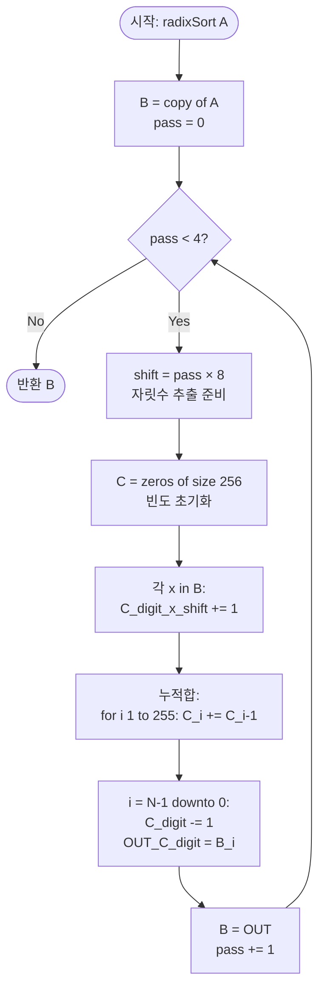

import { AlgorithmSimulation } from "#guide-sim";

# Radix Sort — 해설

## 성능 목표 예측

| 항목 | 값 |
|------|----|
| 입력 크기 N | 1 ≤ N ≤ 100,000 |
| 값 범위 | 0 ≤ A[i] ≤ 10⁹ |
| 진법 k | 256 (8비트 단위, 권장) |
| 자릿수 d | $\lceil \log_{256}(10^9 + 1) \rceil = 4$ |
| 목표 시간 복잡도 | **O(d · (N + k)) = O(4 · (N + 256)) = O(N)** |
| 공간 복잡도 | **O(N + k)** |

**naive 접근의 복잡도와 한계:**
비교 기반 정렬(퀵소트, 머지소트)은 $\Omega(N \log N)$ 정보-이론적 하한을 가진다. $N = 10^5$에서 $O(N \log N) \approx 1.7 \times 10^6$ 연산으로 통과 가능하다. 그러나 값이 $[0, 10^9]$ 정수로 제한되는 경우, 비교 없이 자릿수 분해를 이용해 이 하한을 우회할 수 있다.

**목표 복잡도의 근거:**
$10^9 < 2^{32}$이므로 모든 입력이 32비트 정수 범위다. 8비트씩 끊으면 $d = \lceil 32/8 \rceil = 4$ 패스로 충분하다. 각 패스는 $k = 2^8 = 256$ 버킷에 대한 Counting Sort로 $O(N + 256)$이며, 4번 반복하면 $O(4(N + 256)) = O(N)$이다.

**진법 선택의 트레이드오프:**

| 진법 k | 패스 수 d | 패스당 비용 | 총 비용 |
|--------|----------|-----------|--------|
| 10 | 10 | O(N + 10) | O(10N) |
| 256 | 4 | O(N + 256) | O(4N) |
| 65536 | 2 | O(N + 65536) | O(2N + 131072) |

$k = 256$이 속도와 메모리의 균형이 가장 좋다. $k$가 너무 크면 Counting Sort의 배열 초기화 비용이 커진다.

---

## 목표 함수

```ts
function radixSort(A: number[]): number[]
```

| 파라미터 | 의미 | 제약 |
|---------|------|------|
| `A` | 비음 정수 배열 | $1 \leq N \leq 100{,}000$ |
| `A[i]` | 각 원소의 값 | $0 \leq A[i] \leq 10^9$ |

**반환값:** 오름차순으로 정렬된 새 배열. 원본 배열 `A`는 변경하지 않는다.

**엣지케이스:**

| 케이스 | 입력 예시 | 기대 출력 | 비고 |
|--------|----------|----------|------|
| 빈 입력 | `[]` | `[]` | 패스 없이 반환 |
| 단일 원소 | `[42]` | `[42]` | 정렬 결과 동일 |
| 모두 0 | `[0, 0, 0]` | `[0, 0, 0]` | 모든 자릿수가 0 |
| 최댓값 | `[1000000000, 0]` | `[0, 1000000000]` | 4패스 모두 사용 |
| 이미 정렬 | `[1, 2, 3]` | `[1, 2, 3]` | 안정 정렬로 순서 유지 |

---

## 핵심 아이디어

**핵심 아이디어**: "낮은 자릿수부터 안정 정렬을 반복하면, 마지막 패스 이후 전체가 올바르게 정렬된다."

정수를 통째로 비교하는 대신 자릿수별로 분류하면 각 패스를 $O(N + k)$의 Counting Sort로 처리할 수 있다. 핵심은 낮은 자릿수(LSD) 순서로 처리하되 각 패스가 반드시 안정 정렬이어야 한다는 것이다. 안정성이 있어야 이전 패스에서 확정된 낮은 자릿수 순서가 보존된다.

**풀이 구조**
1. 배열 복사. $k = 256$($2^8$, 8비트 단위), 패스 수 $d = 4$(32비트 정수 기준)
2. pass 0~3 반복:
   - 빈도 배열 $C$ 초기화 후 `(x >> (pass*8)) & 0xFF`로 자릿수 집계
   - 누적합 변환으로 각 자릿수의 출력 위치 계산
   - 뒤에서 앞으로(역방향) 훑어 안정 배치 → 출력 배열 `OUT`
   - `B = OUT`으로 교체
3. 최종 배열 반환

**조건**: 비음 정수여야 함. 음수는 부호 비트 처리가 복잡해짐. 값의 범위가 $[0, 10^9]$ 이내이면 32비트 4패스로 충분.

**대표 예시**: IP 주소(32비트 정수) 목록 정렬
IP 주소는 32비트 정수로 표현되므로 Radix Sort를 직접 적용할 수 있다. $10^6$개 IP 주소를 4패스만에 $O(N)$으로 정렬할 수 있어, 비교 기반 정렬 대비 빠르다.

**언제 쓰나**
정수 데이터가 고정 범위($[0, 10^9]$ 이하)이고 $N$이 커서 $O(N)$이 필요할 때, 또는 Counting Sort의 값 범위가 너무 넓어 버킷이 너무 클 때 Radix Sort로 자릿수를 분해해 처리한다.

---

### 원형 아이디어와 naive 접근

가장 단순한 접근: 두 수를 전체적으로 비교해서 정렬한다.

```
A.sort((a, b) => a - b)
```

이는 $O(N \log N)$이며 정상적으로 작동한다. 그러나 정수 비교가 "크다/작다" 하나의 정보만 반환한다는 점에서 낭비가 있다. 정수의 각 자릿수는 $[0, k-1]$ 범위의 독립적인 값이므로, 전체 수를 비교하는 대신 **자릿수별로 분류하는** 방식이 더 빠를 수 있다.

### 어떤 관찰이 돌파구가 되는가

- **관찰 1 (정수의 자릿수 분해):** 어떤 정수든 $k$진법으로 표현하면 유한한 자릿수 $d$개로 나눌 수 있다. 각 자릿수는 $[0, k-1]$ 범위이며, 자릿수별 Counting Sort가 $O(N + k)$에 가능하다.
- **관찰 2 (LSD 순서로 처리 가능):** 낮은 자릿수부터 높은 자릿수 순으로 안정 정렬을 반복하면, 마지막 패스(가장 높은 자릿수)의 정렬 결과가 전체 순서를 결정한다. 이전 패스 결과는 같은 높은 자릿수를 가진 원소들 간의 순서(타이브레이킹)로 작용한다.
- **관찰 3 (안정 정렬의 필수성):** LSD 방식이 올바르게 작동하려면 각 패스의 정렬이 **안정(stable)**해야 한다. 안정하지 않으면 이전 패스에서 결정된 순서가 파괴된다.

### 관찰을 형식화: 상태/구조 정의

**자릿수 추출 연산:**
$k = 256 = 2^8$이면 `pass`번째 자릿수(0부터 시작):

$$\text{digit}(x, \text{pass}) = \left\lfloor \frac{x}{k^{\text{pass}}} \right\rfloor \bmod k = (x \gg (8 \cdot \text{pass})) \mathbin{\&} (k - 1)$$

비트 연산으로 표현하면 빠르고 간결하다.

**각 패스의 상태:**
- 입력: 배열 $B$ (이전 패스 결과 또는 초기 복사본)
- 빈도 배열 $C[0..k-1]$: $C[v] = B$에서 자릿수가 $v$인 원소 수
- 누적합 변환: $C[v] \leftarrow \sum_{u \leq v} C[u]$ → $C[v] =$ 자릿수가 $v$ 이하인 원소의 총 수
- 안정 배치: 뒤에서 앞으로 훑으며 출력 배열에 배치

**핵심 불변식:**
$$\text{pass번째 패스 종료 후: } B\text{는 하위 }(pass+1) \times 8\text{비트 기준으로 안정 오름차순}$$

이 정의가 왜 이 형태여야 하는가: "pass번째 패스까지 올바르다"는 불변식이 귀납적으로 유지되면, 마지막 패스($d-1$) 종료 후 전체 32비트가 올바르게 정렬됨이 보장된다. 안정성이 없으면 이 귀납 단계가 무너진다.

### 점화식 또는 핵심 연산

**Counting Sort의 자릿수 버전 (핵심 연산):**

1. **빈도 집계:**
$$C[v] \leftarrow C[v] + 1 \quad \text{for each } x \in B \text{ where } v = \text{digit}(x, \text{pass})$$

2. **누적합 (출력 위치 계산):**
$$C[v] \leftarrow C[v] + C[v-1], \quad v = 1, 2, \ldots, k-1$$

3. **안정 배치 (뒤에서 앞으로):**
$$v = \text{digit}(B[i], \text{pass}), \quad C[v] \mathrel{-}= 1, \quad \text{OUT}[C[v]] = B[i], \quad i = N-1 \text{ downto } 0$$

- $C[v] - 1$: 자릿수 $v$인 원소들 중 아직 배치되지 않은 마지막 위치
- 뒤에서 앞으로 처리: 동일 자릿수 원소들의 입력 순서(이전 패스 결과)를 보존

**LSD 처리의 귀납적 정당성:**

- 기저: pass 0 종료 후, $B$의 최하위 8비트 기준 오름차순 ✓ (Counting Sort의 정확성)
- 귀납: pass $p$ 종료 후 하위 $8(p+1)$비트 기준 정렬됨 → pass $p+1$에서 $8(p+1)$번째 자릿수로 안정 정렬하면, 같은 새 자릿수끼리는 이전 정렬 순서(하위 $8(p+1)$비트)가 보존 → 하위 $8(p+2)$비트 기준 정렬됨 ✓

### 정당성 — 왜 이것이 옳은가

각 패스가 안정 정렬임을 전제로 귀납 증명을 완성한다. 두 수 $a < b$가 가장 높은 자릿수(pass $d-1$)에서 다르면, 마지막 패스에서 $a$가 $b$ 앞에 놓인다. 가장 높은 자릿수가 같으면, 이전 패스들의 안정성에 의해 그 다음 높은 자릿수로 비교된 결과가 보존된다. 이 귀납적 논리가 $d$개 패스 전체에 적용되어 전체 정렬이 올바르다.

**중복 값 처리:** 동일한 값은 모든 자릿수가 같으므로 각 패스에서 안정 정렬에 의해 원래 순서가 유지된다.

**비음 정수 전제:** 음수가 포함되면 비트 연산 시 부호 비트 처리가 복잡해진다. 이 문제는 $A[i] \geq 0$이 보장되므로 해당 없다.

### 구현 디테일과 최적화

- **비트 연산 활용:** `(x >> (pass * 8)) & 0xFF`는 나눗셈(`Math.floor(x / Math.pow(256, pass)) % 256`)보다 훨씬 빠르다.
- **빈도 배열 재초기화:** 각 패스마다 $C$를 `new Array(256).fill(0)`으로 초기화한다. 이전 패스의 $C$를 재사용하면 틀린 결과가 나온다.
- **in-place vs. 새 배열:** 안정 배치 단계에서는 입력 배열을 직접 수정할 수 없으므로 출력 배열 `OUT`이 필요하다. 패스마다 $B$와 `OUT`을 교체하면 추가 복사를 줄일 수 있다.
- **흔한 함정 — 뒤에서 앞으로 처리하지 않음:** 앞에서 뒤로 배치하면 동일 자릿수 원소들의 상대 순서가 역전되어 이전 패스의 결과가 파괴된다. 반드시 `i = N-1 downto 0`으로 처리해야 한다.
- **흔한 함정 — 누적합 방향:** `C[i] += C[i-1]`을 왼쪽에서 오른쪽으로 계산해야 한다. 반대 방향이면 위치 정보가 뒤집힌다.
- **공간 최적화:** 두 배열을 번갈아 사용(ping-pong)하면 `O(N)`의 추가 공간으로 4패스를 처리할 수 있다.

---

## 시뮬레이션

설명을 위해 BASE=10, 2자리 입력 `A = [170, 45, 75, 90, 2, 24]`에 LSD Radix Sort를 적용한다(실제 구현은 BASE=256, 4패스이나 원리는 동일하다). 패스 0은 1의 자리, 패스 1은 10의 자리 기준으로 안정 Counting Sort를 수행한다. 빨간색(`highlight`)은 현재 패스에서 분류 기준이 되는 자릿수를 가진 원소, 회색(`marked`)은 마지막 패스 종료 후 정렬이 확정된 상태를 뜻한다.

실제 반환값은 `[2, 24, 45, 75, 90, 170]` 이며, 시뮬레이션 마지막 프레임의 배열과 일치한다.

> 대화형 시뮬레이션은 MDX 런타임에서 표시됩니다.

export const steps = [
  {
    title: "초기 상태",
    detail: "정렬 전 배열. 패스 0(1의 자리)부터 시작한다.",
    array: [170, 45, 75, 90, 2, 24],
  },
  {
    title: "패스 0: 1의 자리 추출",
    detail: "각 원소의 1의 자리: [0, 5, 5, 0, 2, 4].",
    array: [170, 45, 75, 90, 2, 24],
    highlight: [0, 1, 2, 3, 4, 5],
  },
  {
    title: "패스 0: 버킷 분류",
    detail: "0->[170,90], 2->[2], 4->[24], 5->[45,75]. 안정성으로 170이 90보다 앞.",
    array: [170, 45, 75, 90, 2, 24],
    highlight: [0, 3],
  },
  {
    title: "패스 0 결과",
    detail: "1의 자리 기준 안정 정렬: [170, 90, 2, 24, 45, 75].",
    array: [170, 90, 2, 24, 45, 75],
  },
  {
    title: "패스 1: 10의 자리 추출",
    detail: "각 원소의 10의 자리: [7, 9, 0, 2, 4, 7].",
    array: [170, 90, 2, 24, 45, 75],
    highlight: [0, 1, 2, 3, 4, 5],
  },
  {
    title: "패스 1: 버킷 분류",
    detail: "0->[2], 2->[24], 4->[45], 7->[170,75], 9->[90]. 170이 75보다 앞(이전 패스 순서 보존).",
    array: [170, 90, 2, 24, 45, 75],
    highlight: [0, 5],
  },
  {
    title: "패스 1 결과: 정렬 완료",
    detail: "10의 자리 기준 안정 정렬로 전체 정렬 완료: [2, 24, 45, 75, 90, 170].",
    array: [2, 24, 45, 75, 90, 170],
    marked: [0, 1, 2, 3, 4, 5],
  },
];

<AlgorithmSimulation view="array" steps={steps} title="Radix Sort (LSD): [170, 45, 75, 90, 2, 24]" />

## 수도 코드와 Activity Diagram

### 의사코드

```
function radixSort(A):
    BASE = 256                         // k = 2^8
    DIGITS = 4                         // d = 4 패스 (32비트 / 8비트)
    B = copy of A                      // 불변식: multiset(B) = multiset(A)

    for pass from 0 to DIGITS-1:
        shift = pass * 8               // 처리할 비트 위치
        // 불변식: B는 하위 (pass * 8)비트 기준 안정 오름차순
        B = countingSortByDigit(B, shift, BASE)
        // 불변식: B는 하위 ((pass+1) * 8)비트 기준 안정 오름차순

    return B

function countingSortByDigit(A, shift, BASE):
    N = len(A)
    C = zeros of size BASE             // 불변식 초기: C[v] = 0

    // 1단계: 빈도 집계
    for x in A:
        digit = (x >> shift) & (BASE - 1)
        C[digit] += 1                  // 불변식: C[v] = 해당 자릿수가 v인 원소 수

    // 2단계: 누적합 (출력 위치 계산)
    for i from 1 to BASE-1:
        C[i] += C[i-1]                 // 불변식: C[v] = 자릿수 ≤ v인 원소의 총 수

    // 3단계: 안정 배치 (뒤에서 앞으로 — 안정성 보장)
    OUT = array of size N
    for i from N-1 downto 0:
        digit = (A[i] >> shift) & (BASE - 1)
        C[digit] -= 1
        OUT[C[digit]] = A[i]           // 불변식: OUT은 처리된 원소들의 안정 정렬 위치 보유

    return OUT
```

### Activity Diagram



**핵심 불변식:** `pass`번째 패스 종료 직후, 배열 $B$는 하위 `(pass+1) × 8`비트를 기준으로 오름차순 안정 정렬된 상태다. 4번의 패스 후 전체 32비트 기준으로 오름차순이 된다.

---

**예시** (BASE=10, 2자리):

```
A = [170, 45, 75, 90, 2, 24]

패스 0 (1의 자리):
  자릿수: [0, 5, 5, 0, 2, 4]
  버킷:   0→[170,90], 2→[2], 4→[24], 5→[45,75]
  출력:   [170, 90, 2, 24, 45, 75]

패스 1 (10의 자리):
  자릿수: [1, 9, 0, 2, 4, 7]
  버킷:   0→[2], 1→[170], 2→[24], 4→[45], 7→[75], 9→[90]
  출력:   [2, 170, 24, 45, 75, 90]
  → 오름차순 완료

실제 (BASE=256, 4패스): 동일 원리, 8비트씩 처리
```
