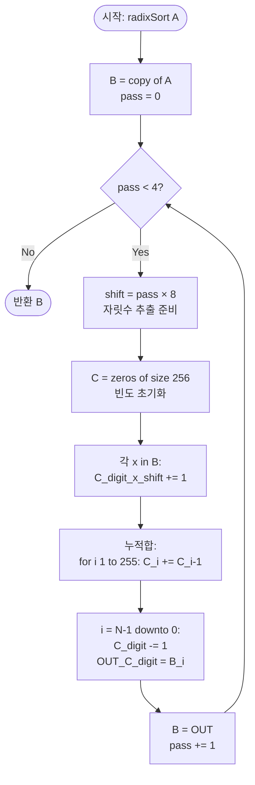

import { AlgorithmSimulation } from "#guide-sim";

# Radix Sort — 자릿수 하나씩만 보면 비교가 필요 없어지는 이유

## 한눈에 보는 컨셉

정수를 통째로 비교하는 대신, 자릿수 하나씩만 보고 안정적으로(stable) 분류하는 과정을 낮은 자릿수부터 높은 자릿수까지 반복하면 전체가 정렬됩니다. 각 자릿수 분류는 Counting Sort로 `O(N + k)`에 끝나고, 자릿수 개수 `d`는 값의 범위가 고정이면 상수이므로 전체는 `O(d(N + k)) = O(N)`이에요. 핵심 관찰은 하나입니다 — **"비교"가 주는 정보(크다/작다 한 비트)보다 "자릿수"가 주는 정보(0~k-1 중 어떤 값인가)가 훨씬 많다는 것**입니다.

## 출발점: 가장 순진한 방법부터

문제를 먼저 정확히 잡을게요.

```ts
function radixSort(A: number[]): number[]
```

- `A` — 정렬할 비음 정수 배열, $1 \leq N \leq 100{,}000$, $0 \leq A[i] \leq 10^9$
- 반환값 — `A`를 오름차순으로 정렬한 **새 배열** (원본 `A`는 변경하지 않음)
- 원소 집합(multiset) 보존, 중복 허용, 빈 배열이면 빈 배열 반환

가장 정직한 방법은 두 수를 통째로 비교하는 겁니다.

```ts
function radixSortNaive(A: number[]): number[] {
  return A.slice().sort((a, b) => a - b); // 두 수를 통째로 비교
}
```

이건 항상 정답을 냅니다. 비교 기반 정렬(퀵소트, 병합정렬 등)은 원소를 둘씩 비교해 순서를 알아내는데, 정렬을 마치려면 이론적으로 최소 $N \log_2 N$번의 비교가 필요합니다. 작은 예시 6개 `[170, 45, 75, 90, 2, 24]`로 감을 잡아 보고, 이 감을 큰 `N`으로 확장해 봅시다.

```text
비교 기반 정렬에 필요한 비교 횟수 ≈ N log₂N

N = 6        →   6 × log₂6   ≈  15~16회      (지금 이 예시 크기)
N = 10^5     →   10^5 × log₂(10^5) ≈ 1.7×10^6회   (이 문제의 최대 N)
N = 10^7     →   10^7 × log₂(10^7) ≈ 2.3×10^8회   (IP 주소 목록 같은 대용량)
```

$N = 10^5$까지는 비교 기반 정렬로도 통과할 수 있습니다. 그런데 값이 $[0, 10^9]$ 정수로 제한된다는 사실을 눈여겨보면 이상한 점이 있어요. 두 수를 비교해서 얻는 정보는 "크다/작다" 딱 하나뿐인데, 정수는 애초에 자릿수마다 $0$부터 $k-1$까지 값을 담고 있는 훨씬 풍부한 구조입니다. **"이 구조를 그냥 버리고 있는 게 아닐까?"** — 이것이 이번 알고리즘의 출발 단서예요.

## 아이디어 자세히 들여다보기

### 자릿수 하나만 뽑아내기 — 수식과 그림

$k$진법으로 표현했을 때 `pass`번째 자릿수(0부터 시작, 최하위가 0)를 뽑는 연산을 정의합니다.

$$\text{digit}(x, \text{pass}, k) = \left\lfloor \frac{x}{k^{\text{pass}}} \right\rfloor \bmod k$$

왜 하필 나눗셈-나머지 형태로 정의할까요? 자릿수를 뽑는 방법은 사실 두 가지 후보가 있습니다. 하나는 "수를 문자열로 바꿔서 문자 하나씩 읽기"인데, 이건 $k=10$일 때는 직관적이지만 $k=256$처럼 사람이 안 쓰는 진법에는 아예 적용할 수 없고, 자릿수에 접근할 때마다 문자열 변환 비용이 붙습니다. 반면 나눗셈-나머지 정의는 정수 연산만으로 **어떤 $k$에도 동일하게** 적용됩니다. 뒤에서 $k=256$을 고르더라도(4절에서 이 정의를 다시 씁니다) 정의 자체는 바꿀 필요가 없다는 뜻이에요.

$x = 1{,}000{,}000{,}000$, $k = 256$일 때 자릿수를 직접 뽑아 봅시다.

```text
x = 1,000,000,000

pass=0 (shift=0)  : digit = 0
pass=1 (shift=8)  : digit = 202
pass=2 (shift=16) : digit = 154
pass=3 (shift=24) : digit = 59

각 자리는 0~255 범위 안에 있고, 4자리면 32비트 정수 전체를 표현할 수 있다
(10^9 < 2^30 < 2^32이므로 4패스로 충분)
```

확인 질문 하나만 해 볼까요? $x = 356$, $k = 10$이면 pass 0과 pass 1의 자릿수는 각각 무엇일까요? 손으로 계산해 보면 $356 \bmod 10 = 6$(pass 0), $\lfloor 356/10 \rfloor \bmod 10 = 35 \bmod 10 = 5$(pass 1)입니다 — 흔히 아는 "1의 자리, 10의 자리"가 정확히 이 공식의 $k=10$ 버전이에요.

진법 $k$는 아무렇게나 고를 수 없습니다. $k$가 커지면 패스 수 $d$가 줄지만 패스당 빈도 배열 크기가 커집니다.

| 진법 $k$ | 패스 수 $d$ | 패스당 비용 | 총 비용 |
|--------|----------|-----------|--------|
| 10 | 10 | $O(N + 10)$ | $O(10N)$ |
| 256 | 4 | $O(N + 256)$ | $O(4N)$ |
| 65536 | 2 | $O(N + 65536)$ | $O(2N + 131072)$ |

$k = 256 = 2^8$은 바이트 단위로 딱 떨어져 구현이 간단하고, 속도와 메모리의 균형도 좋습니다. 이 가이드는 이후 계속 $k = 256$, $d = 4$를 씁니다.

### 단서를 설명해 주는 이론 — Counting Sort

자릿수 하나를 기준으로 "분류"하는 작업 자체는 이미 이론화된 알고리즘입니다 — **Counting Sort**예요.

Counting Sort는 값이 $[0, k-1]$ 범위의 정수일 때, 비교 없이 빈도만 세어 정렬하는 알고리즘입니다. 세 단계로 이루어집니다.

1. **빈도 집계**: 크기 $k$의 배열 $C$를 만들어 $C[v]$ = 값이 $v$인 원소 수를 센다.
2. **누적합**: $C[v] \leftarrow C[v] + C[v-1]$로 바꾸면, $C[v]$는 "값이 $v$ 이하인 원소의 총 개수" — 즉 값 $v$인 원소들이 최종적으로 놓일 위치의 오른쪽 경계가 된다.
3. **안정 배치**: 입력을 뒤에서 앞으로 훑으며 $C[v]$를 하나씩 줄여가며 그 자리에 배치한다. 뒤에서 훑기 때문에, 같은 값을 가진 원소들 사이에서는 원래 입력에 먼저 나온 원소가 더 앞자리를 차지합니다(안정성).

```text
입력:  [3, 1, 3, 0]     (k=4, 값 범위 0~3)

빈도:      C = [1, 1, 0, 2]   (0이 1개, 1이 1개, 2가 0개, 3이 2개)
누적합:    C = [1, 2, 2, 4]   (값 ≤ v인 원소의 총 개수)

뒤에서 앞으로 배치:
  i=3, x=0: C[0]=1→0, output[0]=0
  i=2, x=3: C[3]=4→3, output[3]=3
  i=1, x=1: C[1]=2→1, output[1]=1
  i=0, x=3: C[3]=3→2, output[2]=3

결과: [0, 1, 3, 3]   (두 개의 3 중 입력에서 먼저 나온 i=0 쪽이 output[2]에, 나중에 나온 i=2 쪽이 output[3]에 — 원래 순서 보존)
```

Counting Sort 혼자서는 $k$가 매우 크면(이 문제처럼 $10^9$) 빈도 배열 자체가 감당이 안 됩니다. 하지만 자릿수 하나(0~255)에 대해서만 적용하면 $k=256$으로 고정되니 문제가 없어요. **Radix Sort는 이 Counting Sort를 자릿수마다 반복 적용하는 알고리즘**입니다 — 이 "패스당 $O(N+k)$" 비용이 다음 절 코드에서 그대로 재사용되니 기억해 두세요.

> 참고로 이 프로젝트에는 Counting Sort만 다루는 별도 가이드도 있습니다([countingSort 가이드](../countingSort/countingSort-guide.mdx)) — 값 범위 $k$가 작을 때는 굳이 자릿수로 쪼개지 않고 이 알고리즘 하나로 충분한 경우를 다룹니다.

### 왜 모순 없이 작동하는가

이 알고리즘이 지키는 불변식은 하나입니다.

> `pass`번째 패스가 끝나면, 배열은 **하위 $(pass+1)$개 자릿수** 기준으로 안정 오름차순 정렬되어 있다.

**기저**: pass 0이 끝나면, 최하위 자릿수 기준으로 안정 정렬되어 있습니다 — 이는 Counting Sort의 정확성 그 자체입니다.

**귀납 단계**: pass $p$가 끝난 뒤 하위 $(p+1)$자릿수 기준 정렬되어 있다고 가정합니다. pass $p+1$은 $(p+1)$번째 자릿수로 안정 정렬을 한 번 더 적용합니다. 이때 두 원소의 $(p+1)$번째 자릿수가 다르면 그 자릿수 순서대로 배치되고, 같으면 안정성 덕분에 이전 순서(하위 $(p+1)$자릿수 기준 순서)가 그대로 보존됩니다. 따라서 pass $p+1$이 끝나면 하위 $(p+2)$자릿수 기준으로 정렬됩니다. 두 수의 대소 관계는 반드시 "가장 높은 자릿수부터 비교해 처음 다른 자리"에서 결정되므로, 이 경우 분류에 빠지는 경우는 없습니다 — 완전히 같은 수이거나, 어딘가 자릿수가 다르거나 둘 중 하나뿐이니까요. $d$번 반복하면 32비트 전체, 즉 이 문제의 값 범위($0 \leq A[i] \leq 10^9 < 2^{32}$) 전체가 정렬됩니다.

여기서 **헷갈리기 쉬운 포인트**가 둘 있습니다.

**첫째, 패스 수를 값의 실제 자릿수에 맞춰 충분히 돌려야 합니다.** 자릿수 개수가 다른 수들이 섞여 있으면, 짧게 끊으면 큰 수의 상위 자릿수가 아예 반영되지 않은 채 끝나 버립니다. 실제로 확인해 봅시다 — $k=10$, 입력 `[170, 45, 75, 90, 2, 24]`에 2패스(1의 자리, 10의 자리)만 돌리면 어떻게 될까요?

```text
pass0(1의 자리) 결과: [170, 90, 2, 24, 45, 75]   (정상)
pass1(10의 자리) 결과: [2, 24, 45, 170, 75, 90]   ← 아직 안 끝났다!

170은 3자리 수인데 2패스로는 백의 자리(1)를 한 번도 보지 않았다.
그 결과 170이 75, 90보다 작다고 잘못 배치된 채 끝난다 — 실제로는 170이 가장 커야 한다.
```

이 배열의 최댓값 `170`은 3자리 수이므로 **반드시 3패스**(1의 자리, 10의 자리, 100의 자리)가 필요합니다. pass 2(100의 자리)까지 마저 돌리면 그제서야 올바르게 끝납니다 — 이 트레이스는 아래 실행 시각화 절에서 그대로 확인할 수 있어요. 이 프로젝트의 실제 구현은 $k=256$, $d=4$(32비트 고정)를 쓰므로 이 문제는 애초에 생기지 않습니다 — $10^9$ 이하 모든 값이 4패스 안에 들어가니까요. 다만 "패스 수가 값의 최대 자릿수를 덮는지"는 Radix Sort를 직접 설계할 때 항상 확인해야 할 지점입니다.

**둘째, 안정 배치는 반드시 뒤에서 앞으로 훑어야 합니다.** 같은 자릿수를 가진 원소가 여럿일 때, 앞에서 뒤로 훑으면 그 안에서 순서가 뒤집힙니다. pass 0 결과 `[170, 90, 2, 24, 45, 75]`에 10의 자리 기준 pass 1을 앞에서 뒤로(잘못) 돌리면:

```text
올바른 방향(뒤→앞): [2, 24, 45, 170, 75, 90]   (170이 75보다 앞 — pass0에서의 순서 보존)
잘못된 방향(앞→뒤): [2, 24, 45, 75, 170, 90]   (170과 75의 순서가 뒤바뀜!)
```

숫자 하나(`170`↔`75`)의 순서가 바뀌는 정도라 눈치채기 어렵지만, 이렇게 한 번 순서가 깨지면 다음 패스부터는 이전 패스의 정렬을 전제로 한 귀납이 무너져 최종 결과가 조용히 틀립니다.

엣지 케이스도 짚어 봅시다.

```text
A = []                          → 패스 없이 [] 반환 (N=0)
A = [42]                        → 원소 1개, 모든 패스에서 자기 자신만 있는 버킷 → [42]
A = [0, 0, 0]                   → 모든 자릿수가 항상 0, 안정성으로 원래 순서 그대로 유지 → [0,0,0]
A = [1000000000, 0]             → 10^9 < 2^30, 4패스 모두 사용해도 안전하게 정렬 → [0, 1000000000]
```

## 아이디어를 코드로 옮기기

방금 정의한 자릿수 공식과 Counting Sort를 그대로 옮기면 이렇습니다.

```ts
const BASE = 256; // k = 2^8
const DIGITS = 4; // d = 4패스 (32비트 정수 / 8비트)

function digitOf(x: number, pass: number, base: number): number {
  return Math.floor(x / base ** pass) % base;
}

function countingSortByDigit(input: number[], pass: number, base: number): number[] {
  const n = input.length;
  const count = new Array(base).fill(0);

  for (const x of input) {
    count[digitOf(x, pass, base)]++;
  }
  for (let i = 1; i < base; i++) {
    count[i] += count[i - 1];
  }

  const output = new Array(n);
  for (let i = n - 1; i >= 0; i--) {
    const d = digitOf(input[i], pass, base);
    count[d]--;
    output[count[d]] = input[i];
  }
  return output;
}

function radixSortBasic(A: number[]): number[] {
  let B = A.slice();
  for (let pass = 0; pass < DIGITS; pass++) {
    B = countingSortByDigit(B, pass, BASE);
  }
  return B;
}
```

`digitOf`는 앞서 3.1의 수식을 그대로 옮긴 것이고, `countingSortByDigit`은 3.2의 Counting Sort 세 단계(집계 → 누적합 → 역방향 배치)를 그대로 옮긴 것입니다. **가장 중요한 줄은 `for (let i = n - 1; i >= 0; i--)`입니다** — 역방향으로 훑어야 안정성이 보장된다는 것을 앞 절에서 실측으로 확인했죠. 누적합 방향(`count[i] += count[i - 1]`, 왼쪽에서 오른쪽으로)도 순서가 중요합니다. 반대로 돌리면 위치 계산 자체가 뒤집혀 인덱스가 어긋납니다.

## 더 빠르게 만들 단서 찾기

`radixSortBasic`을 4번(패스마다) 실행하는 과정을 관찰해 봅시다.

```text
pass 0: count = new Array(256).fill(0)   ← 매번 새로 할당
        output = new Array(n)            ← 매번 새로 할당
pass 1: count = new Array(256).fill(0)   ← 또 새로 할당 (재사용 안 함)
        output = new Array(n)            ← 또 새로 할당
pass 2: ... (반복)
pass 3: ... (반복)

4패스 동안 크기-256 배열 4번, 크기-n 배열 4번 = 총 8번의 새 배열 할당과 가비지 컬렉션 부담
```

또 하나, `digitOf` 안의 `base ** pass`는 같은 패스 안에서 모든 원소에 대해 **항상 같은 값**인데, 원소마다 매번 다시 거듭제곱을 계산합니다. `pass`가 바뀌기 전까지는 상수인데도 매번 다시 계산하는 셈이에요. 게다가 나눗셈·나머지 연산은 CPU 입장에서 비트 시프트·마스크 연산보다 비쌉니다 — $k=256=2^8$이라는 특수한 진법을 골랐으니, 나눗셈 대신 비트 연산을 쓸 여지가 있습니다.

## 단서를 최적화로 연결하기

두 가지 낭비를 각각 없앱니다.

**(1) 나눗셈 → 비트 연산.** $k = 256 = 2^8$이면 $x / 256^{\text{pass}}$는 $x$를 오른쪽으로 $8 \times \text{pass}$비트 시프트한 것과 같고, `% 256`은 하위 8비트만 남기는 `& 0xFF`와 같습니다.

```text
Before: digit = Math.floor(x / base**pass) % base     (나눗셈 + 나머지, base가 상수여도 매번 계산)
After : shift = pass * 8 (패스당 한 번만)
        digit = (x >>> shift) & 0xFF                    (시프트 + 마스크)
```

실제로 같은 값을 내는지 $x = 1{,}000{,}000{,}000$으로 확인했습니다 — 두 방식 모두 pass 0~3에서 각각 `0, 202, 154, 59`로 정확히 일치합니다.

여기서 `>>`(부호 있는 시프트) 대신 `>>>`(부호 없는 시프트)를 쓰는 이유도 짚고 갈게요. 이 문제의 값은 $A[i] \leq 10^9 < 2^{31}$이라 `>>`를 써도 지금 당장은 안전하지만, 자바스크립트의 `>>`는 피연산자를 부호 있는 32비트 정수로 해석합니다. $2^{31}$ 이상의 값에서는 최상위 비트가 부호 비트로 읽혀 결과가 음수로 뒤집혀요.

```text
big = 2^31 = 2147483648
big >> 0   = -2147483648   (부호 있는 해석 → 최상위 비트가 부호로 읽혀 음수)
big >>> 0  =  2147483648   (부호 없는 해석 → 값 그대로)
```

지금 제약에서는 문제가 되지 않지만, 값 범위가 언제 바뀔지 모르니 자릿수 추출에는 항상 `>>>`를 쓰는 습관을 들이는 편이 안전합니다.

**(2) 배열 재할당 → 버퍼 재사용(ping-pong).** 매 패스 새 배열을 만드는 대신, 두 개의 버퍼를 미리 만들어 두고 패스가 끝날 때마다 역할만 맞바꿉니다.

```text
Before: 패스마다 count, output을 새로 할당 (4패스 × 2 = 8번 할당)
After : src, dst 버퍼 두 개를 한 번만 만들고, 매 패스 끝에 [src, dst] = [dst, src]로 교체
        count 배열도 재할당 없이 count.fill(0)으로 초기화만
```

## 최적화 코드

```ts
function radixSort(A: number[]): number[] {
  const n = A.length;
  if (n === 0) return [];

  const BASE = 256;
  const DIGITS = 4;
  const MASK = BASE - 1; // 0xFF

  let src = Uint32Array.from(A);
  let dst = new Uint32Array(n);
  const count = new Uint32Array(BASE);

  for (let pass = 0; pass < DIGITS; pass++) {
    const shift = pass * 8; // 패스마다 한 번만 계산
    count.fill(0);          // 재할당 없이 초기화만

    for (let i = 0; i < n; i++) {
      count[(src[i] >>> shift) & MASK]++;
    }
    for (let v = 1; v < BASE; v++) {
      count[v] += count[v - 1];
    }
    for (let i = n - 1; i >= 0; i--) {
      const d = (src[i] >>> shift) & MASK;
      count[d]--;
      dst[count[d]] = src[i];
    }

    [src, dst] = [dst, src]; // ping-pong 버퍼 교체 (복사 없이 참조만 바꿈)
  }

  return Array.from(src);
}
```

**가장 중요한 줄은 `[src, dst] = [dst, src]`입니다.** 이 한 줄 덕분에 4패스 내내 새 배열을 만들지 않고 두 버퍼만 번갈아 씁니다. 순서를 하나만 놓쳐도(예: 이 줄을 빼먹고 `dst`에 계속 쓰기만 하면) 다음 패스가 방금 쓴 결과를 다시 읽지 못해 원본 `src`만 반복해서 정렬하는 꼴이 됩니다.

> 기억법: 시프트는 부호 없이(`>>>`), 배치는 뒤에서 앞으로, 버퍼는 만들지 말고 맞바꾼다.

**더 최적화할 여지가 있을까요?** 지금 비용은 $O(d(N+k)) = O(4(N+256)) = O(N)$으로, 배열의 모든 원소를 최소 한 번은 읽어야 하니 어떤 정렬 알고리즘도 $\Omega(N)$ 아래로는 내려갈 수 없습니다. 즉 지금 이미 점근적으로 최적입니다. 진법 $k$를 더 키우면(예: $k=65536$) 패스 수가 2로 줄지만 빈도 배열이 $65{,}536$칸으로 커져 작은 $N$에서는 오히려 배열 초기화 비용이 이득을 상쇄합니다 — 이미 앞서 확인한 트레이드오프 표 그대로예요. 가장 빠른 특화 해법을 원한다면 SIMD 병렬화나 멀티스레드 버킷 분산 같은 하드웨어 특화 구현도 있지만, 이는 이식성과 구현 복잡도를 희생합니다. Radix Sort의 진짜 가치는 **범용성**입니다 — 값이 고정 비트 폭 정수이기만 하면 $k$와 $d$만 바꿔서 어떤 정수 범위에도 같은 틀을 그대로 적용할 수 있으니까요.

## 실행 시각화

$k=10$(1의 자리·10의 자리·100의 자리), 입력 `A = [170, 45, 75, 90, 2, 24]`로 LSD Radix Sort를 손으로 따라갑니다(실제 구현은 $k=256$, 4패스이나 원리는 동일합니다). 이 예시가 3패스인 이유는 앞서 확인했듯 최댓값 `170`이 3자리 수라 100의 자리까지 봐야 하기 때문이에요 — 만약 2패스에서 멈췄다면 위에서 실측한 대로 `[2, 24, 45, 170, 75, 90]`이라는 틀린 결과로 끝났을 겁니다. 빨간색(`highlight`)은 현재 패스에서 분류 기준이 되는 자릿수를 가진 원소, 회색(`marked`)은 마지막 패스 종료 후 정렬이 확정된 상태를 뜻합니다. 실제 반환값은 `[2, 24, 45, 75, 90, 170]`이며, 시뮬레이션 마지막 프레임의 배열과 일치합니다.

> 대화형 시뮬레이션은 MDX 런타임에서 표시됩니다.

export const steps = [
  {
    title: "초기 상태",
    detail: "정렬 전 배열. 패스 0(1의 자리)부터 시작한다.",
    array: [170, 45, 75, 90, 2, 24],
  },
  {
    title: "패스 0: 1의 자리 추출",
    detail: "각 원소의 1의 자리: [0, 5, 5, 0, 2, 4].",
    array: [170, 45, 75, 90, 2, 24],
    highlight: [0, 1, 2, 3, 4, 5],
  },
  {
    title: "패스 0: 버킷 분류",
    detail: "0->[170,90], 2->[2], 4->[24], 5->[45,75]. 안정성으로 170이 90보다 앞.",
    array: [170, 45, 75, 90, 2, 24],
    highlight: [0, 3],
  },
  {
    title: "패스 0 결과",
    detail: "1의 자리 기준 안정 정렬: [170, 90, 2, 24, 45, 75].",
    array: [170, 90, 2, 24, 45, 75],
  },
  {
    title: "패스 1: 10의 자리 추출",
    detail: "각 원소의 10의 자리: [7, 9, 0, 2, 4, 7].",
    array: [170, 90, 2, 24, 45, 75],
    highlight: [0, 1, 2, 3, 4, 5],
  },
  {
    title: "패스 1: 버킷 분류",
    detail: "0->[2], 2->[24], 4->[45], 7->[170,75], 9->[90]. 170이 75보다 앞(이전 패스 순서 보존).",
    array: [170, 90, 2, 24, 45, 75],
    highlight: [0, 5],
  },
  {
    title: "패스 1 결과: 아직 미완",
    detail: "10의 자리까지 반영한 결과: [2, 24, 45, 170, 75, 90]. 170은 3자리 수라 100의 자리가 남아 아직 정렬 완료가 아니다.",
    array: [2, 24, 45, 170, 75, 90],
  },
  {
    title: "패스 2: 100의 자리 추출",
    detail: "각 원소의 100의 자리: [0, 0, 0, 1, 0, 0].",
    array: [2, 24, 45, 170, 75, 90],
    highlight: [0, 1, 2, 3, 4, 5],
  },
  {
    title: "패스 2: 버킷 분류",
    detail: "0->[2,24,45,75,90], 1->[170]. 170만 별도 버킷이라 맨 뒤로 이동.",
    array: [2, 24, 45, 170, 75, 90],
    highlight: [3],
  },
  {
    title: "패스 2 결과: 정렬 완료",
    detail: "100의 자리까지 반영해 전체 정렬 완료: [2, 24, 45, 75, 90, 170].",
    array: [2, 24, 45, 75, 90, 170],
    marked: [0, 1, 2, 3, 4, 5],
  },
];

<AlgorithmSimulation view="array" steps={steps} title="Radix Sort (LSD): [170, 45, 75, 90, 2, 24]" />

## 흐름 한눈에 보기


```mermaid
flowchart TD
    A([시작: radixSort A]) --> B["B = copy of A<br/>pass = 0"]
    B --> C{"pass < 4?"}
    C -- No --> Z([반환 B])
    C -- Yes --> D["shift = pass × 8<br/>자릿수 추출 준비"]
    D --> E["C = zeros of size 256<br/>빈도 초기화"]
    E --> F["각 x in B:<br/>C_digit_x_shift += 1"]
    F --> G["누적합:<br/>for i 1 to 255: C_i += C_i-1"]
    G --> H["i = N-1 downto 0:<br/>C_digit -= 1<br/>OUT_C_digit = B_i"]
    H --> I["B = OUT<br/>pass += 1"]
    I --> C
```

**핵심 불변식**: `pass`번째 패스 종료 직후, 배열 `B`는 하위 `(pass+1) × 8`비트를 기준으로 오름차순 안정 정렬된 상태입니다. 4번의 패스 후 전체 32비트 기준으로 오름차순이 됩니다 — `O(4(N+256)) = O(N)`이라는 목표 복잡도를 그대로 달성한 것입니다.

## 스스로 점검하기

1. `[58, 3, 121, 9]`를 $k=10$ LSD Radix Sort로 손으로 정렬해 보세요. 최댓값 `121`이 3자리 수이니 몇 패스가 필요할까요? (힌트: pass0 결과는 `[121, 3, 58, 9]`, pass1 결과는 `[3, 9, 121, 58]`, pass2 결과는 `[3, 9, 58, 121]`입니다 — 3패스가 필요합니다.)
2. 본문에서 `[170, 45, 75, 90, 2, 24]`를 2패스만 돌리면 `[2, 24, 45, 170, 75, 90]`이라는 잘못된 결과가 나온다는 걸 확인했습니다. 왜 하필 `170`만 잘못된 위치에 남았을까요? 다른 원소들은 왜 문제가 없었을까요?
3. 만약 입력에 음수가 섞여 있다면(`$-10^9 \leq A[i] \leq 10^9$`) 지금의 비트 시프트 방식을 그대로 쓸 수 없습니다. 어떻게 바꾸면 이 알고리즘의 틀을 재사용할 수 있을까요? (힌트: 모든 값에 $10^9$를 더해 비음 정수로 바꾼 뒤 정렬하고, 마지막에 다시 빼는 "오프셋" 트릭을 생각해 보세요.)
