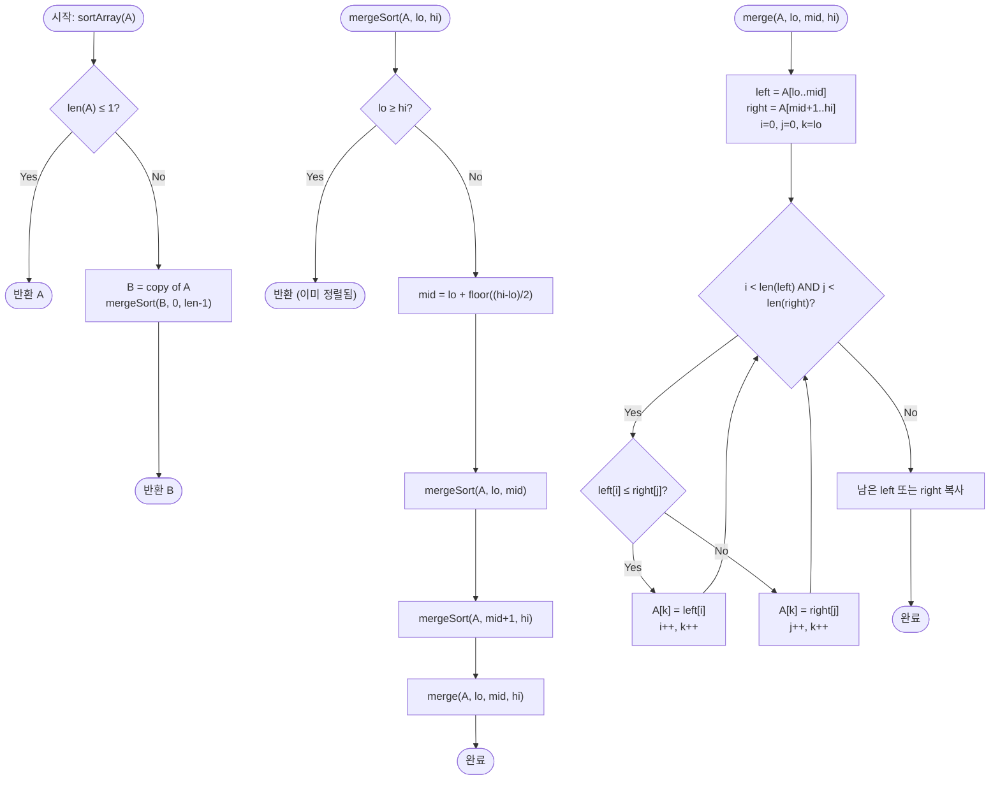

import { AlgorithmSimulation } from "#guide-sim";

# Sort Array — 절반씩 나눠 정렬한 뒤 지퍼처럼 합치기

## 한눈에 보는 컨셉

배열을 반으로 계속 쪼개다 보면 결국 크기 1짜리 조각들이 남는데, **크기 1인 배열은 그 자체로 이미 정렬돼 있어요.** 여기서부터 거꾸로, **이미 정렬된 두 조각을 지퍼 채우듯 하나로 병합(merge)** 하면서 위로 합쳐 올라가면 전체가 정렬됩니다. 쪼개는 깊이가 `O(log N)`, 각 층의 병합 비용이 `O(N)`이라 전체가 `O(N log N)`에 끝나요.

## 출발점: 가장 순진한 방법부터

먼저 풀어야 할 문제를 정확히 고정할게요.

```ts
function sortArray(A: number[]): number[]
```

정수 배열 `A`를 받아 **오름차순으로 정렬한 새 배열**을 반환합니다. 입력 `A`는 건드리지 않아야 하고(원본 불변), 같은 값이 여럿이면 그 개수만큼 전부 결과에 담기며, 음수도 들어올 수 있어요. `N`은 최대 `100,000`입니다.

가장 정직한 방법은 **선택 정렬**입니다. "남은 것 중 가장 작은 값을 찾아 맨 앞에 놓기"를 반복하는 거예요.

```ts
function sortArrayNaive(A: number[]): number[] {
  const B = A.slice();
  for (let i = 0; i < B.length; i++) {
    let min = i;
    for (let j = i + 1; j < B.length; j++) if (B[j] < B[min]) min = j;
    [B[i], B[min]] = [B[min], B[i]];
  }
  return B;
}
```

정직하지만, 매번 남은 구간 전체를 훑어 최솟값을 찾으니 비교 횟수가 이렇게 쌓입니다.

```text
i=0: N-1 번 비교
i=1: N-2 번 비교
...
합계 ≈ N²/2   →  N=100,000 이면 약 5,000,000,000 번
```

1초 안에 처리하기엔(현대 CPU가 대략 초당 `10^8`번 연산) **50배쯤 초과**라 시간 초과입니다. 그런데 선택 정렬은 한 가지 정보를 통째로 버리고 있어요 — **부분적으로 정렬해 둔 결과를 다음 단계에서 재활용하지 못한다**는 점이죠. 이 낌새가 다음 절의 출발점입니다.

## 아이디어 자세히 들여다보기

### 절반씩 쪼갠 뒤 병합하기 — 수식과 그림

핵심 관찰은 이겁니다: **이미 정렬된 두 배열은 아주 싸게(선형 시간에) 하나로 합칠 수 있다.** 두 배열의 맨 앞만 비교해 작은 쪽을 꺼내는 걸 반복하면 되니까요.

그렇다면 전략은 자연스럽게 정해집니다 — 배열을 반으로 나눠 **각각을 정렬한 뒤**, 그 둘을 병합하는 거예요. "각각을 정렬"하는 일은 다시 같은 방법(반으로 나눠 정렬 후 병합)으로 하면 되고요. 이 재귀는 크기 1에서 멈춥니다.

우리가 세우려는 불변식은 이것입니다.

$$\texttt{mergeSort}(A, \text{lo}, \text{hi}) \text{ 종료 후 } A[\text{lo}\,..\,\text{hi}] \text{ 는 오름차순}$$

작은 예 `[3, 1, 3, 2]`로 쪼개고 합치는 모양을 그려 볼게요.

```text
분할(내려가며)                병합(올라오며)
[3, 1, 3, 2]                   [1, 2, 3, 3]
  /       \                     /       \
[3, 1]   [3, 2]      →      [1, 3]     [2, 3]
 / \      / \                 / \       / \
[3][1]  [3][2]              [3][1]... 각 크기1은 이미 정렬
```

> 잠깐, 확인 하나만 해 볼까요? `[3, 1]`을 병합하면 `[1, 3]`, `[3, 2]`를 병합하면 `[2, 3]`이 됩니다. 그럼 마지막에 `[1, 3]`과 `[2, 3]`을 병합하면? 맨 앞부터 `1, 2, 3, 3` 순서로 뽑혀 나와 `[1, 2, 3, 3]`이 돼요.

병합(merge) 자체는 지퍼를 채우는 그림이 정확합니다.

```text
left  = [1, 3]      right = [2, 3]
        i                    j
비교: 1 ≤ 2 → 1 출력.  i→   left=[_,3]
비교: 3 > 2 → 2 출력.  j→   right=[_,3]
비교: 3 ≤ 3 → 왼쪽 3 먼저 출력(핵심!).  i→
남은 오른쪽 3 복사.
결과: [1, 2, 3, 3]
```

### 단서를 설명해 주는 이론 — 비교 정렬 하한과 마스터 정리

"반으로 쪼갠다"는 이 선택이 왜 최선급인지는 두 가지 이론이 받쳐 줍니다. 뒤에서 다시 소환할 테니 기억해 두세요.

첫째, **비교 기반 정렬의 하한은 $\Omega(N \log N)$** 입니다. 원소들의 순서를 오직 비교로만 알아낸다면, 가능한 정렬 결과는 $N!$가지이고 비교 한 번은 답을 최대 절반으로 좁힙니다. 그래서 최소 $\log_2(N!) \approx N \log_2 N$번의 비교가 필요해요. merge sort의 $O(N \log N)$은 이 하한에 상수 배 안으로 붙어 있습니다.

둘째, 재귀 비용은 **마스터 정리**로 정확히 나옵니다. 크기 $N$을 절반씩 두 조각으로 나누고($2$개의 $T(N/2)$), 병합에 $O(N)$이 드니

$$T(N) = 2\,T(N/2) + O(N) = O(N \log N)$$

입니다. 여기서 "왜 하필 절반인가"가 드러나요. 세 조각($k$-way)으로 나누면 층수는 $\log_3 N$으로 줄지만 각 층의 병합이 $k$-방향이라 비교 비용에 $k$ 상수가 붙어, 총량은 크게 이득이 없습니다. 절반이 균형점이에요.

### 왜 모순 없이 작동하는가

정확성은 재귀 크기에 대한 귀납으로 보입니다.

- **기저**: 크기 $N \le 1$인 구간은 원소가 없거나 하나뿐이라 이미 정렬돼 있습니다.
- **귀납 단계**: 크기 $k$ 미만의 모든 입력에서 `mergeSort`가 올바르게 정렬한다고 가정합니다. 크기 $k$ 입력은 두 절반($\le k/2$)으로 나뉘고, 귀납 가정에 의해 각각 올바르게 정렬됩니다. 남은 건 **병합의 정확성**인데, 두 포인터 알고리즘은 매 단계에서 "두 배열의 현재 맨 앞 중 더 작은(같으면 왼쪽) 값"을 출력하므로 (a) 출력이 항상 비내림차순이고 (b) 어느 원소도 빠뜨리지 않습니다.

**여기서 헷갈리기 쉬운 포인트는 병합의 비교 조건이 `<`가 아니라 `<=`여야 한다**는 겁니다. 같은 값일 때 **왼쪽(먼저 있던) 원소를 먼저 내보내야** 원래 순서가 보존되는 **안정 정렬(stable sort)** 이 됩니다.

```text
left=[3a, 3b] (같은 값, 원래 순서 a→b)   right=[3c]
'left[i] <= right[j]' 이면 3a 먼저 → 안정
'left[i] <  right[j]' 이면 3c 먼저 → 원래 왼쪽에 있던 3a·3b가 3c 뒤로 밀림 (불안정)
```

원시 정수만 정렬할 땐 값이 같으면 티가 안 나지만, "이름으로 1차 정렬한 뒤 점수로 2차 정렬" 같은 다단계 정렬에서 이 차이가 결과를 바꿔요.

엣지 케이스도 점검해 둡니다.

```text
크기 1 [5]        → 병합 없이 그대로 [5]
전부 같음 [3,3,3] → 매 비교가 <= 라 순서 보존, [3,3,3]
음수 섞임 [-5,10,-9] → 비교가 부호를 그대로 처리, [-9,-5,10]
```

## 아이디어를 코드로 옮기기

아이디어를 그대로 옮긴 기본 구현입니다. **입력 `A`를 건드리지 않고 새 배열을 반환**해야 하므로, 각 단계에서 새 배열을 만들어 돌려주는 방식으로 씁니다.

```ts
function merge(left: number[], right: number[]): number[] {
  const out: number[] = [];
  let i = 0, j = 0;
  while (i < left.length && j < right.length) {
    if (left[i] <= right[j]) out.push(left[i++]); // <= : 안정성의 핵심
    else out.push(right[j++]);
  }
  while (i < left.length) out.push(left[i++]);   // 남은 왼쪽 복사
  while (j < right.length) out.push(right[j++]);  // 남은 오른쪽 복사
  return out;
}

function sortArray(A: number[]): number[] {
  if (A.length <= 1) return A.slice(); // 기저: 새 배열로 반환(원본 불변)
  const mid = A.length >> 1;
  const left = sortArray(A.slice(0, mid));
  const right = sortArray(A.slice(mid));
  return merge(left, right);
}
```

가장 중요한 줄은 `if (left[i] <= right[j])`의 **`<=`**, 그리고 두 개의 "남은 것 복사" while 문입니다. **가장 실수가 잦은 곳은 이 복사 두 줄을 빼먹는 것**이에요 — 한쪽이 먼저 소진되면 다른 쪽에 남은 원소들(이미 정렬돼 있음)을 통째로 뒤에 붙여야 하는데, 이걸 잊으면 결과에서 원소가 사라집니다.

> 기억법: **"작은 쪽을 뽑고, 남은 건 통째로 이어 붙인다."**

## 더 빠르게 만들 단서 찾기

기본 구현은 이미 `O(N log N)`이라 점근적으로는 하한에 닿아 있습니다. 하지만 실행을 들여다보면 **낭비 지점**이 하나 보여요 — 재귀가 크기 1까지 내려가는 동안, **아주 작은 구간마다 함수 호출·배열 슬라이스·새 배열 할당**이 반복됩니다.

```text
크기 4 → 2+2 → 1+1+1+1
   작은 조각일수록 '실제 정렬 일'보다 '호출/할당 오버헤드'가 더 큼
```

작은 배열에서는 오버헤드가 큰 분할정복보다, 캐시 친화적이고 상수가 작은 **삽입 정렬**이 실제로 더 빠릅니다.

## 단서를 최적화로 연결하기

그래서 흔한 실무 최적화는 **컷오프(cutoff)**: 구간 크기가 작은 임계값(예: 16) 이하로 내려가면 재귀를 멈추고 그 구간을 삽입 정렬로 처리합니다. 점근 복잡도 `O(N log N)`은 그대로지만 **상수 인자가 줄어** 실측 속도가 빨라져요.

```text
Before: ...→[2]→[1]→[1]→[1]  (크기 1까지 재귀, 호출 폭증)
After : 크기 ≤ 16 구간은 재귀 대신 삽입정렬 한 방  (호출 수 대폭 감소)
```

덤으로, 병합용 임시 버퍼를 **매번 새로 할당하지 않고 하나를 재사용**(핑퐁)하면 할당 비용도 줄일 수 있습니다.

## 최적화 코드

컷오프 + 버퍼 재사용을 적용한 버전입니다. 인덱스 기반으로 제자리 병합하되, 최종 결과는 입력을 복사한 `R` 위에서 만들어 **원본 `A`는 그대로** 둡니다.

```ts
function insertionRange(B: number[], lo: number, hi: number): void {
  for (let i = lo + 1; i <= hi; i++) {
    const key = B[i]; let j = i - 1;
    while (j >= lo && B[j] > key) { B[j + 1] = B[j]; j--; }
    B[j + 1] = key;
  }
}

function sortArray(A: number[]): number[] {
  const CUTOFF = 16;
  const R = A.slice();            // 원본 불변: 복사본 위에서 작업
  const buf = new Array(R.length); // 병합 버퍼 하나를 재사용
  const rec = (lo: number, hi: number): void => {
    if (hi - lo + 1 <= CUTOFF) { insertionRange(R, lo, hi); return; }
    const mid = lo + ((hi - lo) >> 1);
    rec(lo, mid); rec(mid + 1, hi);
    let i = lo, j = mid + 1, k = lo;
    while (i <= mid && j <= hi) buf[k++] = R[i] <= R[j] ? R[i++] : R[j++];
    while (i <= mid) buf[k++] = R[i++];
    while (j <= hi) buf[k++] = R[j++];
    for (let t = lo; t <= hi; t++) R[t] = buf[t];
  };
  if (R.length > 1) rec(0, R.length - 1);
  return R;
}
```

가장 중요한 줄은 `buf[k++] = R[i] <= R[j] ? ...`의 **`<=`**(안정성 유지)와, 병합 결과를 다시 `R`로 되쓰는 마지막 `for`입니다. **이 되쓰기를 빼먹으면** `buf`에만 정렬 결과가 담기고 `R`은 갱신되지 않아, 상위 병합이 옛 값을 읽어 **조용히 틀린 답**을 냅니다.

**여기서 더 빠르게 만들 여지가 있을까요?** 점근적으로는 없습니다. 비교 정렬의 하한 $\Omega(N \log N)$에 이미 도달했고, 위 최적화는 상수 인자만 깎을 뿐이에요. (값의 범위가 작고 정수라면 counting/radix sort로 `O(N)`도 가능하지만, 그건 비교 정렬이 아닌 특화 해법입니다. merge sort의 가치는 **비교만 가능한 임의의 데이터에 통하고 안정 정렬**이라는 범용성에 있습니다.)

## 실행 시각화

입력 `[3, 1, 3, 2]`를 병합 정렬로 오름차순 정렬하는 과정입니다. `array` 패널에서 `highlight`(빨강)는 현재 다루는 구간, `marked`(회색)는 정렬이 확정된 구간, `pointers`는 병합 중인 두 포인터 `i`(왼쪽)·`j`(오른쪽)입니다. 실제 반환값은 `[1, 2, 3, 3]`이며(같은 값 `3`이 둘이라 안정성이 드러납니다), 시뮬레이션 마지막 프레임과 일치합니다.

> 대화형 시뮬레이션은 MDX 런타임에서 표시됩니다.

export const steps = [
  {
    title: "초기 상태",
    detail: "정렬 전 배열 [3, 1, 3, 2]. mergeSort(0, 3) 호출.",
    array: [3, 1, 3, 2],
  },
  {
    title: "분할: 좌반부 [3, 1]",
    detail: "mid=1. 왼쪽 구간 [0..1]을 먼저 재귀 정렬한다.",
    array: [3, 1, 3, 2],
    highlight: [0, 1],
  },
  {
    title: "병합 [3] + [1]",
    detail: "left=[3], right=[1]. 1 <= 3 이므로 오른쪽 1을 먼저 출력.",
    array: [3, 1, 3, 2],
    highlight: [0, 1],
    pointers: { i: 0, j: 1 },
  },
  {
    title: "좌반부 정렬 완료 [1, 3]",
    detail: "A[0..1] = [1, 3] 오름차순 확정.",
    array: [1, 3, 3, 2],
    marked: [0, 1],
  },
  {
    title: "분할: 우반부 [3, 2]",
    detail: "오른쪽 구간 [2..3]을 재귀 정렬한다.",
    array: [1, 3, 3, 2],
    marked: [0, 1],
    highlight: [2, 3],
  },
  {
    title: "병합 [3] + [2]",
    detail: "left=[3], right=[2]. 2 < 3 이므로 오른쪽 2를 먼저 출력.",
    array: [1, 3, 3, 2],
    marked: [0, 1],
    highlight: [2, 3],
    pointers: { i: 2, j: 3 },
  },
  {
    title: "우반부 정렬 완료 [2, 3]",
    detail: "A[2..3] = [2, 3] 오름차순 확정.",
    array: [1, 3, 2, 3],
    marked: [2, 3],
  },
  {
    title: "최종 병합 시작",
    detail: "left=[1, 3], right=[2, 3]. i=0, j=0. 1 <= 2 → 1 출력.",
    array: [1, 3, 2, 3],
    highlight: [0, 2],
    pointers: { i: 0, j: 0 },
  },
  {
    title: "병합: 3 vs 2",
    detail: "left[1]=3, right[0]=2. 3 > 2 → 오른쪽 2 출력.",
    array: [1, 3, 2, 3],
    highlight: [1, 2],
    marked: [0],
    pointers: { i: 1, j: 0 },
  },
  {
    title: "병합: 3 vs 3",
    detail: "left[1]=3, right[1]=3. 3 <= 3 → 왼쪽 3 먼저 출력(안정 정렬).",
    array: [1, 3, 2, 3],
    highlight: [1, 3],
    marked: [0, 1],
    pointers: { i: 1, j: 1 },
  },
  {
    title: "남은 원소 복사",
    detail: "왼쪽 소진. 오른쪽의 마지막 3을 복사한다.",
    array: [1, 2, 3, 3],
    marked: [0, 1, 2],
    pointers: { j: 1 },
  },
  {
    title: "정렬 완료: [1, 2, 3, 3]",
    detail: "최종 병합 완료. 전체 구간 오름차순 확정.",
    array: [1, 2, 3, 3],
    marked: [0, 1, 2, 3],
  },
];

<AlgorithmSimulation view="array" steps={steps} title="Merge Sort: [3, 1, 3, 2]" />

## 흐름 한눈에 보기



## 스스로 점검하기

1. `[5, 2, 8, 1]`을 병합 정렬로 손으로 정렬해 보세요. 분할 트리를 그리고, 각 병합 단계의 출력을 순서대로 적어 보면 됩니다. (답: 최종 `[1, 2, 5, 8]`.)
2. 병합의 비교 조건을 `left[i] <= right[j]`에서 `left[i] < right[j]`로 바꾸면 정렬 **결과 배열의 값 자체**는 바뀌지 않습니다. 그런데도 이 변경이 문제가 되는 경우는 언제일까요? (힌트: 값은 같지만 "출처"가 다른 원소를 다단계로 정렬할 때.)
3. `sortArray`가 입력 `A`를 직접 정렬(제자리 수정)하도록 잘못 구현하면, 어떤 호출 패턴에서 버그가 드러날까요? 예를 들어 `const a = [3,1,2]; const b = sortArray(a);` 이후 `a`의 상태를 예상해 보세요. (제약: 반환은 새 배열이어야 하고 원본은 불변이어야 합니다.)
