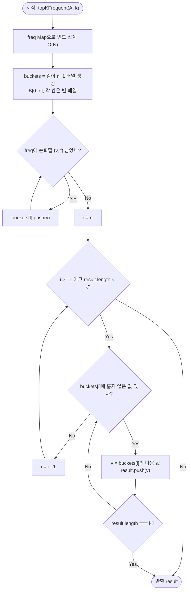

import { AlgorithmSimulation } from "#guide-sim";

# Top K Frequent Elements — 빈도가 N을 넘을 수 없다는 사실이 정렬을 통째로 없애는 이유

## 한눈에 보는 컨셉

전체 고유값 $M$개를 빈도 기준으로 몽땅 정렬하면 상위 $k$개를 뽑는 데 필요 이상의 일을 하게 돼요. 크기 $k$짜리 "현재까지의 상위 후보"만 힙으로 들고 있으면 `O(N log k)`로 줄고, 한 걸음 더 나아가 **"어떤 값의 빈도도 배열 길이 $N$을 넘을 수 없다"**는 사실을 이용하면 비교 연산 자체를 없애고 `O(N)`까지 줄일 수 있습니다. 이 가이드는 정렬 → 힙 → 버킷, 세 단계가 서로 어떤 낭비를 없애며 이어지는지 하나씩 따라갑니다.

## 출발점: 가장 순진한 방법부터

먼저 문제를 정확히 고정할게요.

```ts
function topKFrequent(A: number[], k: number): number[]
```

| 파라미터 | 의미 | 제약 |
|---------|------|------|
| `A` | 정수 배열 | $1 \leq N \leq 100{,}000$, $-10^9 \leq A[i] \leq 10^9$ |
| `k` | 반환할 상위 빈도 원소 수 | $1 \leq k \leq$ 고유값 개수 |

반환값은 빈도 내림차순으로 정렬된 상위 $k$개 원소이고(동률 시 순서 임의), 원소 $v$의 빈도는 $f(v) = \bigl|\{ i \mid A[i] = v \}\bigr|$로 정의합니다.

"상위 $k$개가 필요하다"는 요구를 그대로 옮기면 가장 정직한 방법은 이렇습니다 — **일단 전부 세고, 전부 줄 세운 다음, 앞에서 $k$개만 자른다.**

```ts
function topKFrequentNaive(A: number[], k: number): number[] {
  const freq = new Map<number, number>();
  for (const v of A) freq.set(v, (freq.get(v) ?? 0) + 1); // O(N): 빈도 집계

  const entries = [...freq.entries()];
  entries.sort((a, b) => b[1] - a[1]); // O(M log M): 빈도 내림차순 전체 정렬
  return entries.slice(0, k).map(([v]) => v); // 상위 k개만 자름
}
```

빈도 집계는 $O(N)$, 정렬은 $O(M \log M)$ ($M \leq N$은 고유값 개수)이므로 전체는 $O(N + M \log M)$이고, $N = 10^5$에서는 통과할 수 있는 크기예요. 그런데 작은 예로 낭비를 체감해 봅시다.

```text
M = 100,000개의 서로 다른 값, k = 1 인 경우

전체 정렬 비용:  M log M ≈ 100,000 × 17 ≈ 1,700,000번 비교

그런데 필요한 건 "빈도가 가장 높은 값 1개" 뿐입니다.
최댓값 1개를 찾는 데는 배열을 한 번 훑는 M번이면 충분해요 (O(M)).
k=1인데 10만 개를 통째로 줄 세우는 건 필요 이상의 낭비입니다.
```

$k$가 $M$보다 훨씬 작다면, 전체를 줄 세울 필요 없이 **"지금까지 본 것 중 상위 $k$개"만 손에 쥐고 있으면** 되지 않을까요? 이것이 다음 절의 출발 단서입니다.

## 아이디어 자세히 들여다보기

### 상위 k 후보만 들고 있기 — 수식과 그림

현재까지 훑은 고유값 중 "상위 $k$개 후보"의 집합 $H$를 유지한다고 해봅시다. 새 고유값 $v$(빈도 $f$)가 들어올 때:

- $|H| < k$이면 무조건 $H$에 넣는다.
- $|H| = k$이고 $f$가 $H$의 최소 빈도보다 크면, 최소 빈도 원소를 빼고 $v$를 넣는다.
- 그렇지 않으면 $v$는 후보 자격이 없으니 버린다.

이 규칙이 성립하려면 $H$에서 "지금 가장 약한 후보"(최소 빈도)를 빠르게 찾아 교체할 수 있어야 해요. 그래서 $H$를 최소 힙으로 관리합니다. 불변식은 이렇습니다.

$$|H| \leq k, \qquad \min_{(f, v) \in H} f = \text{현재 후보군 중 최소 빈도}$$

작은 예로 손을 움직여 볼게요. 값 1(빈도 3), 2(빈도 2), 3(빈도 1)이 이 순서로 들어오고 $k = 2$라고 합시다.

```text
초기 H = {}

v=1, f=3:  |H|=0 < k=2  →  그냥 삽입      H = {(3,1)}
v=2, f=2:  |H|=1 < k=2  →  그냥 삽입      H = {(3,1), (2,2)}
v=3, f=1:  |H|=2 = k    →  H의 최소 빈도는 2인데 f=1 ≤ 2  →  버림
                                          H = {(3,1), (2,2)}  (변화 없음)

최종 H = {(값1,빈도3), (값2,빈도2)}  →  상위 2개 = {1, 2}
```

잠깐, 확인 하나만 해볼까요? 만약 위 순서에서 마지막에 (값4, 빈도5)가 하나 더 들어온다면 어떻게 될까요? — $H$의 최소 빈도(2)보다 5가 크니, 빈도 2인 원소(값 2)를 빼고 값 4를 넣습니다. `H = {(값1,빈도3), (값4,빈도5)}`가 됩니다.

**왜 하필 최소 힙이어야 할까요?** 대안으로 "정렬된 배열"을 $H$로 유지하는 방법도 있어요. 하지만 정렬된 배열은 새 원소가 들어올 자리를 찾고 뒤 원소들을 밀어야 하니 삽입에 $O(k)$가 듭니다. 최소 힙은 "지금 가장 약한 후보"가 항상 루트에 있어서 조회가 $O(1)$이고, 삽입·교체가 트리 높이만큼인 $O(\log k)$로 끝나요. $k$가 클수록 이 차이가 커집니다.

### 단서를 설명해 주는 이론 — 비교 기반 정렬의 하한을 넘어서는 법

방금 만든 힙 방식은 $M$개 고유값 각각에 $O(\log k)$ 비용을 지불하므로 총 $O(M \log k)$입니다. 여기서 $\log k$가 어디서 왔는지 잘 보면, "두 빈도 중 뭐가 더 큰가"를 비교하는 비용이에요. 그런데 **비교 기반 정렬은 일반적으로 $\Omega(M \log M)$ 아래로 내려갈 수 없다는 하한**이 있습니다(정렬 결과가 $M!$가지이고, 비교 한 번은 결과를 최대 반으로만 줄이므로 $\log_2(M!) = \Theta(M \log M)$번의 비교가 필요하다는 정보이론적 논증이에요).

이 하한을 넘어서려면 "비교"라는 연산 자체를 버려야 합니다. 그게 가능한 이유는 우리가 정렬하려는 키(빈도)가 **정수이고 범위가 뻔히 정해져 있기 때문**이에요. 어떤 원소의 빈도도 $[0, N]$ 범위를 벗어날 수 없습니다(배열 전체 길이가 $N$이니까요). 값의 범위가 미리 정해져 있으면, 그 범위 크기만큼 칸을 미리 파 두고(버킷) 각 값을 자기 칸에 바로 넣으면 됩니다 — "이 값이 저 값보다 큰가"를 비교할 필요 없이, 인덱스 자체가 순서를 대신하는 거예요. 이것이 **카운팅/버킷 정렬**의 핵심 이론이고, 나중에 최적화 코드에서 이 이론을 다시 소환할 거예요. 기억해 두세요 — **"키의 범위가 좁고 정수면, 비교 없이 인덱스로 직행할 수 있다."**

### 셈을 맡는 자료구조 — 최소 힙

앞 절에서 상위 $k$개 후보를 관리할 때 쓴 최소 힙은, "지금까지 본 것 중 가장 약한 후보를 $O(1)$에 찾고 $O(\log k)$에 교체"하는 역할만 하면 충분합니다. 힙 내부 구현(배열로 접은 완전 이진 트리, sift-up/sift-down)이 궁금하다면 이 프로젝트의 [MinHeap 가이드](../../../data-structures/heap/minHeap/minHeap-guide.mdx)를 참고하세요 — 여기서는 "삽입·최솟값 교체가 $O(\log k)$인 상자"로만 다룹니다.

### 왜 모순 없이 작동하는가

힙 방식이 정말 상위 $k$개를 정확히 골라내는지 귀납적으로 확인해 봅시다.

**기저**: 아직 아무 고유값도 처리하지 않았을 때 $H = \emptyset$이고, "지금까지 본 것 중 상위 0개"는 공집합이므로 자명하게 성립합니다.

**귀납 단계**: $H$가 "지금까지 처리한 고유값 중 상위 $\min(\text{처리한 개수}, k)$개"라는 불변식을 만족한다고 가정하고, 새 고유값 $v$(빈도 $f$)를 처리한 뒤에도 성립함을 봅니다. 이때 가능한 경우는 정확히 둘뿐이에요(비교 결과는 "크다/그렇지 않다" 둘로 완전히 나뉘므로 다른 경우가 없습니다).

- **$|H| < k$인 경우**: 아직 $k$개를 채우지 못했으니 $v$를 넣는 게 항상 옳습니다. 넣지 않으면 $|H|$가 $k$보다 작은 채로 남아 불변식(상위 $\min(\cdot, k)$개를 모두 담아야 함)이 깨집니다.
- **$|H| = k$이고 $f > \min(H)$인 경우**: $H$의 최소 빈도 원소는 이제 전체 후보 중 최소 $k+1$번째 이하로 밀려났으니(자신보다 빈도 큰 원소가 $H$ 안에 $k-1$개, 그리고 새로 온 $v$까지 $k$개 존재) 상위 $k$에 들 수 없고, 교체가 옳습니다.
- **$|H| = k$이고 $f \leq \min(H)$인 경우**: $v$의 빈도가 $H$의 모든 원소보다 작거나 같으니, $v$는 상위 $k$에 들 수 없고 버리는 게 옳습니다.

세 경우 모두 "옳은 선택 = 유일한 선택"이 증명되므로, 모든 $M$개 고유값을 처리한 후 $H$의 $k$개가 정확히 전체 상위 $k$개임이 귀납적으로 성립합니다.

여기서 **헷갈리기 쉬운 포인트**는 힙의 비교 기준입니다. 힙은 반드시 **빈도**를 기준으로 비교해야지, 값 자체를 기준으로 비교하면 안 돼요.

```text
값 100(빈도 1), 값 2(빈도 50)이 있다고 합시다. k=1.

값 기준으로 비교하면: 100 > 2 이므로 값 100이 "더 크다"고 착각해 100을 남김
  → 실제로는 값 2가 압도적으로 더 자주 등장(빈도 50)했는데 오답 [100] 반환  ✗

빈도 기준으로 비교하면: f(2)=50 > f(100)=1 이므로 값 2를 남김  → 정답 [2]  ✓
```

엣지 케이스도 점검해 둡시다.

```text
k = 1, 고유값 1개(A=[7,7,7,7])   → H = {(4,7)} 하나만 채워지고 그대로 반환 [7]
k = 고유값 개수(A=[1,2,3], k=3) → 모든 원소가 |H|<k 조건으로 전부 삽입, 버려지는 원소 없음
모두 동빈도(A=[1,2,3], k=2)     → 세 번째 원소에서 f = min(H)로 "같음" → 버림 분기, 동률 임의 허용과 일치
음수 포함(A=[-1,-1,2])          → Map 키로 음수를 그대로 쓰므로 비교/삽입 로직에 영향 없음
```

## 아이디어를 코드로 옮기기

앞 절의 규칙을 그대로 옮기면 됩니다. JavaScript/TypeScript에는 내장 힙이 없으니, 배열 하나에 완전 이진 트리를 접어 넣는 최소 힙을 직접 만듭니다.

```ts
type Entry = [freq: number, value: number];

function siftUp(heap: Entry[], i: number): void {
  while (i > 0) {
    const parent = (i - 1) >> 1;
    if (heap[parent]![0] <= heap[i]![0]) break;
    [heap[parent]!, heap[i]!] = [heap[i]!, heap[parent]!];
    i = parent;
  }
}

function siftDown(heap: Entry[], i: number): void {
  const n = heap.length;
  while (true) {
    const l = 2 * i + 1;
    const r = 2 * i + 2;
    let smallest = i;
    if (l < n && heap[l]![0] < heap[smallest]![0]) smallest = l;
    if (r < n && heap[r]![0] < heap[smallest]![0]) smallest = r;
    if (smallest === i) break;
    [heap[i]!, heap[smallest]!] = [heap[smallest]!, heap[i]!];
    i = smallest;
  }
}

function heapPush(heap: Entry[], entry: Entry): void {
  heap.push(entry);
  siftUp(heap, heap.length - 1);
}

function heapPop(heap: Entry[]): Entry {
  const top = heap[0]!;
  const last = heap.pop()!;
  if (heap.length > 0) {
    heap[0] = last;
    siftDown(heap, 0);
  }
  return top;
}

function topKFrequentHeap(A: number[], k: number): number[] {
  const freq = new Map<number, number>();
  for (const v of A) freq.set(v, (freq.get(v) ?? 0) + 1);

  const heap: Entry[] = []; // (빈도, 값) 최소 힙, 크기 <= k
  for (const [v, f] of freq) {
    if (heap.length < k) {
      heapPush(heap, [f, v]);
    } else if (f > heap[0]![0]) {
      heapPop(heap);
      heapPush(heap, [f, v]);
    }
  }

  const result: number[] = new Array(heap.length);
  for (let i = heap.length - 1; i >= 0; i--) {
    result[i] = heapPop(heap)[1]; // pop은 오름차순 → 뒤에서부터 채워 내림차순으로
  }
  return result;
}
```

가장 실수가 잦은 부분은 `siftUp`/`siftDown`의 비교식 `heap[...]![0]`입니다. 인덱스 `[0]`은 튜플의 첫 원소인 **빈도**를 가리켜요 — 여기를 `[1]`(값)로 잘못 짚으면 힙이 값 기준으로 재배열되어 앞서 본 반례처럼 조용히 틀립니다. 그 외 결정 지점:

- `heap.length < k`: 아직 채워지지 않았으면 조건 없이 삽입.
- `f > heap[0]![0]`: 루트(최소 빈도)보다 커야만 교체. `>=`로 쓰면 동률일 때도 불필요하게 교체·재삽입 연산을 반복하지만 결과 자체가 틀리지는 않아요 — 다만 낭비이므로 `>`가 맞습니다.
- 결과 추출을 `result[i]` 역순 채우기로 한 이유: `heapPop`은 항상 최솟값부터 꺼내므로(오름차순), 그대로 앞에서부터 채우면 빈도 오름차순이 돼요. 문제가 요구하는 건 내림차순이므로 뒤 인덱스부터 채웁니다.

## 더 빠르게 만들 단서 찾기

힙 방식을 실행하면서 실제로 어디에 시간이 쓰이는지 보죠. $M$개 고유값 각각에 대해 `siftUp`/`siftDown`이 도는데, 이 두 함수가 하는 일은 결국 **"이 빈도가 저 빈도보다 큰가"를 반복 비교**하는 것뿐이에요.

```text
M = 100,000 (전부 다른 값), k = 10

힙 방식 비용: M × O(log k) ≈ 100,000 × log2(10) ≈ 100,000 × 3.3 ≈ 330,000번의 비교/스왑

그런데 3.2절에서 확인했듯, 빈도는 정수이고 범위가 [0, N]으로 이미 정해져 있습니다.
"비교해서 순서를 알아내는" 대신, 빈도 값 자체를 배열의 인덱스로 써서
곧바로 그 자리에 놓으면 비교가 통째로 필요 없어집니다.
```

이 33만 번의 비교/스왑은 전부 "빈도끼리 크기를 비교하는" 데 쓰였는데, 애초에 빈도의 범위가 뻔하다면 비교 없이 바로 제자리를 찾을 수 있다는 게 3.2절 이론이 말해주는 낌새입니다.

## 단서를 최적화로 연결하기

빈도 $f$를 인덱스로 쓰는 버킷 배열 $B[0..N]$을 만들어 봅시다. 빈도가 $f$인 고유값을 $B[f]$에 그대로 넣습니다.

```text
Before (힙 방식):
  각 고유값마다 "지금 후보군에서 내가 몇 등인가"를 비교로 알아냄  →  O(log k) × M

After (버킷 방식):
  각 고유값을 자기 빈도값 위치에 그냥 놓기만 함(비교 없음)  →  O(1) × M
  꺼낼 때는 인덱스가 큰 칸(높은 빈도)부터 역순으로 훑으면 이미 내림차순  →  O(N)
```

불변식은 이렇습니다.

$$B[f(v)]\text{에 } v\text{가 포함됨} \quad \forall v \in \text{고유값}$$

**왜 이것으로 충분한가**: $B[i]$에는 정확히 빈도가 $i$인 고유값들만 들어 있으므로, $i = N$부터 $0$까지 역순으로 훑으면 고유값들이 빈도 내림차순으로 나옵니다. 처음 $k$개를 모으면 그게 바로 상위 $k$개예요 — 별도의 비교나 정렬 없이, 인덱스 순회 자체가 이미 정렬된 순서를 대신합니다. 동률(같은 버킷 안 여러 값)은 임의 순서로 나오는데, 문제가 동률 시 순서를 임의로 허용하므로 문제없습니다.

## 최적화 코드

```ts
function topKFrequent(A: number[], k: number): number[] {
  const n = A.length;
  const freq = new Map<number, number>();
  for (const v of A) freq.set(v, (freq.get(v) ?? 0) + 1);

  const buckets: number[][] = Array.from({ length: n + 1 }, () => []); // B[0..n]
  for (const [v, f] of freq) buckets[f]!.push(v);

  const result: number[] = [];
  for (let i = n; i >= 1 && result.length < k; i--) {
    for (const v of buckets[i]!) {
      result.push(v);
      if (result.length === k) break;
    }
  }
  return result;
}
```

힙 코드와 비교하면 바뀐 곳은 명확합니다 — `heap.push`/`heap.pop` 자리가 `buckets[f].push(v)` 한 줄로 줄었어요. **가장 중요한 줄은 `Array.from({ length: n + 1 }, ...)`의 `n + 1`입니다.** 빈도의 최댓값은 배열 전체가 한 값으로 채워진 경우인 $f = n$이므로, 버킷 크기를 `n`으로 잡으면 인덱스 `n`이 배열 범위를 벗어납니다.

```text
A = [7, 7, 7, 7]  →  n = 4, freq(7) = 4

버킷 크기를 n(=4)으로 잘못 잡으면: 인덱스 0..3만 존재
  buckets[f].push(7)  (f=4)  →  buckets[4]는 undefined
  → TypeError: undefined is not an object (evaluating 'buckets[f].push')

버킷 크기를 n+1(=5)로 잡으면: 인덱스 0..4까지 존재  →  buckets[4]에 정상적으로 7이 들어감
```

> 버킷 크기는 항상 N+1 — 빈도가 N인(전부 같은 값인) 경우까지 담아야 하니까요.

이제 더 최적화할 여지가 있을까요? $O(N)$은 배열 $A$의 모든 원소를 최소 한 번씩은 읽어야 빈도를 알 수 있다는 사실에서 나오는 하한 $\Omega(N)$과 정확히 맞닿아 있습니다. 즉 입력을 훑는 비용 자체를 피할 수 없으므로, 이 문제에서는 $O(N)$이 점근적으로 더 줄일 수 없는 바닥입니다. (참고로 "빈도들의 중앙값류 통계"를 Quickselect로 구해 특화하는 접근도 존재하지만, 기대 $O(M)$일 뿐 최악의 경우 $O(M^2)$로 나빠질 수 있어 이 버킷 방식만큼 최악의 경우까지 안전하지는 않습니다.) 여기서 멈추는 게 타당해요 — 버킷 방식은 최악의 경우까지 $O(N)$을 보장하면서 구현도 힙보다 단순합니다.

## 실행 시각화

고정 입력 `A = [1, 1, 1, 2, 2, 3]`, `k = 2`에 최종 버킷 방식을 적용합니다. `n = 6`이므로 버킷 배열은 `B[0..6]`, 총 7칸입니다. 빈도를 집계하면 `freq = {1:3, 2:2, 3:1}`이고, 버킷 배열 `B`(인덱스 = 빈도)에 고유값을 분류한 뒤 인덱스가 큰 쪽(`i = 6`)부터 역순으로 훑습니다. `B[6], B[5], B[4]`는 어떤 값의 빈도도 4 이상이 아니므로 비어 있어 그냥 건너뛰고, `B[3]`(값 1)과 `B[2]`(값 2)에서 `k = 2`개를 채우는 즉시 멈춥니다. 아래 array 패널은 버킷 배열 `B`를 인덱스(빈도)별로 보여주며, 빨간색(`highlight`)은 현재 수집 중인 버킷 인덱스, 회색(`marked`)은 이미 다 훑은(또는 건너뛴) 버킷, 아래 keyValue 패널은 빈도 맵과 현재 결과 스냅샷이에요. 실제 반환값은 `[1, 2]`(빈도 1은 3회, 2는 2회)이며, 시뮬레이션 마지막 프레임의 result와 일치합니다.

> 대화형 시뮬레이션은 MDX 런타임에서 표시됩니다.

export const steps = [
  {
    title: "초기화",
    detail: "입력 A = [1, 1, 1, 2, 2, 3]. n=6이므로 버킷 배열은 B[0..6], 총 7칸. 빈도 집계 시작.",
    array: ["B0", "B1", "B2", "B3", "B4", "B5", "B6"],
    entries: [
      { label: "freq", value: "{}" },
      { label: "result", value: "[]" },
    ],
  },
  {
    title: "빈도 집계 완료",
    detail: "freq = {1:3, 2:2, 3:1}.",
    array: ["B0:[]", "B1:[]", "B2:[]", "B3:[]", "B4:[]", "B5:[]", "B6:[]"],
    entries: [
      { label: "freq", value: "1->3, 2->2, 3->1" },
      { label: "result", value: "[]" },
    ],
  },
  {
    title: "버킷 분류",
    detail: "값 1(빈도3)->B[3], 2(빈도2)->B[2], 3(빈도1)->B[1]. B4,B5,B6은 빈도 4 이상인 값이 없어 계속 빈 채로 남음.",
    array: ["B0:[]", "B1:[3]", "B2:[2]", "B3:[1]", "B4:[]", "B5:[]", "B6:[]"],
    entries: [
      { label: "freq", value: "1->3, 2->2, 3->1" },
      { label: "result", value: "[]" },
    ],
  },
  {
    title: "역순 훑기 i=6,5,4 (빈 버킷 건너뜀)",
    detail: "i=n(6)부터 역순 순회 시작. B[6], B[5], B[4]는 모두 비어 있어 result에 추가되는 값 없이 건너뜀.",
    array: ["B0:[]", "B1:[3]", "B2:[2]", "B3:[1]", "B4:[]", "B5:[]", "B6:[]"],
    marked: [4, 5, 6],
    entries: [
      { label: "result", value: "[]" },
      { label: "남은 수집 수", value: 2 },
    ],
  },
  {
    title: "수집 i=3",
    detail: "B[3]=[1] 수집. result=[1], 아직 k=2 미만.",
    array: ["B0:[]", "B1:[3]", "B2:[2]", "B3:[1]", "B4:[]", "B5:[]", "B6:[]"],
    highlight: [3],
    marked: [4, 5, 6],
    entries: [
      { label: "result", value: "[1]" },
      { label: "남은 수집 수", value: 1 },
    ],
  },
  {
    title: "수집 i=2",
    detail: "B[2]=[2] 수집. result=[1, 2], k=2 달성 → 즉시 반환(B[1]은 훑지 않음).",
    array: ["B0:[]", "B1:[3]", "B2:[2]", "B3:[1]", "B4:[]", "B5:[]", "B6:[]"],
    highlight: [2],
    marked: [3, 4, 5, 6],
    entries: [
      { label: "result", value: "[1, 2]" },
      { label: "남은 수집 수", value: 0 },
    ],
  },
  {
    title: "완료: [1, 2]",
    detail: "빈도 상위 2개 = [1, 2] 반환.",
    array: ["B0:[]", "B1:[3]", "B2:[2]", "B3:[1]", "B4:[]", "B5:[]", "B6:[]"],
    marked: [2, 3, 4, 5, 6],
    entries: [
      { label: "반환값", value: "[1, 2]" },
    ],
  },
];

<AlgorithmSimulation view={["array", "keyValue"]} steps={steps} title="Top-K Frequent (Bucket Sort): k=2" />

## 흐름 한눈에 보기

최종 버킷 방식의 처리 흐름을 다이어그램으로 정리하면 이렇습니다 — 빈도를 집계하고, 각 고유값을 자기 빈도 인덱스의 버킷에 던져 넣은 뒤, 버킷을 인덱스 큰 쪽(높은 빈도)부터 역순으로 훑으며 `k`개가 찰 때까지 값을 모읍니다. 비교나 힙 연산은 등장하지 않습니다.



## 스스로 점검하기

1. `A = [5, 5, 3, 3, 3, 9]`, `k = 2`에 대해 힙 방식을 손으로 따라가 보세요. 빈도는 `5→2, 3→3, 9→1`입니다. 최종 힙에 남는 두 원소는 무엇이고, 반환값은 어떤 순서로 나올까요? (힌트: `heapPop`은 항상 최솟값부터 꺼내고, 결과는 뒤 인덱스부터 채웁니다. 정답: 최종 힙은 `{(2,5), (3,3)}`이고, `pop` 순서는 `(2,5) → (3,3)`이므로 `result = [3, 5]`입니다.)
2. 버킷 배열 크기를 `n + 1`이 아니라 `n`으로 잡으면 어떤 입력에서 무엇이 깨질까요? 구체적인 배열과 실제로 나는 오류 메시지까지 적어 보세요. (힌트: 모든 원소가 같은 값인 배열을 떠올려 보세요.)
3. 만약 "빈도가 아니라 값 자체가 큰 순서로 상위 $k$개"를 뽑아야 한다면, 버킷 방식의 인덱스는 무엇을 기준으로 바뀌어야 할까요? 그리고 그 방식이 여전히 $O(N)$을 유지하려면 값의 범위에 어떤 조건이 필요할까요?
