# ahoCorasick — 패턴 여럿을 트라이 하나에 담고 실패 링크를 달면 텍스트를 한 번만 읽어도 되는 이유

## 파트 1 — 아이디어에서 동작하는 코드까지

이 파트에서는 전체 그림을 먼저 보고, 그 그림을 읽는 데 필요한 지식을 확인합니다. 그다음 패턴마다 텍스트를
따로 대조하는 방법에서 출발해 트라이 위의 실패 링크까지 가고, 그 방법을 준비되는 차례대로 값으로 푼 뒤, 실제로
동작하는 코드를 한 조각씩 만듭니다.

### 전체 컨셉

텍스트 하나와 패턴 여럿을 받아 **각 패턴이 텍스트의 어느 자리에서 시작하는지 전부** 찾는 과제입니다. 겹쳐
등장하는 자리도 빠뜨리지 않고, 짧은 패턴이 긴 패턴 안에 숨어 있어도 찾아야 해요. 텍스트 `ushers` 에서 패턴
`he` · `she` · `hers` 를 찾으면 이렇습니다.

<!--fig:concept-matches-->


`she` 안에 `he` 가 들어 있고, `he` 와 `hers` 는 같은 자리에서 시작합니다. 이 글은 이 과제를
**아호–코라식 자동자**(Aho–Corasick automaton)라는 구조 하나로 풉니다. 아호–코라식 자동자는 **패턴 전부를 담은 트라이의
노드마다, 그 노드의 이름에서 앞 글자를 떼어 낸 조각 가운데 트라이에 노드로 있는 가장 긴 것을 가리키는 화살표
하나를 더 단 구조**예요. 그 화살표를 **실패 링크**라고 부릅니다. 트라이의 노드 이름은 뿌리에서 그 노드까지
간선의 글자를 이은 문자열, 곧 **경로 문자열**입니다. 세 패턴의 아호–코라식 자동자를 그리면 이렇게 생겼어요.

<!--fig:concept-automaton-->


굵은 실선이 트라이의 간선이고, 대시가 실패 링크예요. 노드 `she` 에서 나간 대시는 `he` 로 갑니다. `she` 에서 앞
글자 `s` 를 떼면 `he` 이고, `he` 가 트라이에 노드로 있기 때문이에요. 짧은 점선은 **출력 링크**로, 실패 링크를
따라가다 처음 만나는 「패턴이 끝나는 노드」를 곧바로 가리킵니다. 노드 안의 「끝 0 번」은 그 노드에서 0 번 패턴이
끝난다는 뜻입니다.

아호–코라식 자동자는 텍스트를 앞에서부터 한 글자씩 읽으며 노드 하나에 서 있습니다. 그 노드의 경로 문자열은 **지금까지 읽은
텍스트의 끝부분 가운데 어떤 패턴의 앞부분이기도 한 가장 긴 것**이에요. 글자를 읽을 때마다 서 있는 노드와 그
자리에서 끝나는 패턴을 적으면 이렇습니다.

<!--proof:concept-states-->

| 읽은 것 | 서 있는 노드 | 그 자리에서 끝나는 패턴 |
| --- | --- | --- |
| "u" | 뿌리 | 없음 |
| "us" | s | 없음 |
| "ush" | sh | 없음 |
| "ushe" | she | she · he |
| "usher" | her | 없음 |
| "ushers" | hers | hers |

여섯 글자를 한 번씩 읽는 동안 되돌아가 다시 읽은 글자는 0 개이고, 자리 3 에서는 패턴 2 개가 함께 끝납니다.

<!--/proof-->

글자 `r` 을 읽을 때는 노드 `she` 에 `r` 로 가는 자식이 없습니다. 그래도 텍스트를 되돌려 읽지 않아요. `she` 의
실패 링크 `he` 에서 `r` 로 가면 `her` 이고, 그 결과를 미리 표에 적어 두었기 때문입니다. 자리 3 에서는 `she` 에
서 있다가 출력 링크를 따라 `he` 까지 거둬, 패턴 둘을 함께 찾아요. 그래서 텍스트를 읽는 일은 **패턴이 몇 개든
글자 수만큼**이고, 비용을 결과만 적으면 `O(Σ·L + n + z)` 입니다. `Σ` 는 문자 집합의 크기, `L` 은 패턴 길이의
합, `n` 은 텍스트 길이, `z` 는 찾은 매칭의 개수예요.

### 시작하기 전에 — 이미 알고 있어야 하는 것

- **접두사 · 접미사 · 진 조각.** 앞에서 잘라 낸 조각이 접두사, 끝에서 잘라 낸 조각이 접미사이고, 자기 자신을 뺀
  조각을 진 조각이라고 부릅니다. `she` 의 진 접미사는 `he` · `e` · 빈 문자열이에요.
- **트라이.** 여러 문자열의 접두사마다 노드를 하나씩 두고, 글자 하나를 붙인 접두사를 자식으로 잇는 나무입니다.
  노드의 이름은 경로 문자열이고, 글자는 간선에 붙어요. 모르면
  [`trie`](../trie/trie-guide.md) 를 먼저 읽으세요.
- **실패 함수.** 패턴 하나를 찾다가 어긋나면 텍스트 자리는 그대로 두고, 맞은 길이만 「맞은 조각의 앞부분이자
  뒷부분인 가장 긴 진 조각의 길이」로 줄이는 방법입니다. 모르면
  [`findAllOccurrences`](../findAllOccurrences/findAllOccurrences-guide.md) 를 먼저 읽으세요. 이 글의 실패 링크가
  그 착상을 패턴 여럿으로 넓힌 것이에요.
- **큐로 하는 너비 우선 순회.** 뿌리에서 가까운 노드부터 차례로 꺼내는 순회입니다. 실패 링크를 매기는 차례가
  여기에 달려 있어요. 모르면 [`bfsShortestPath`](../../graph/bfsShortestPath/bfsShortestPath-guide.md) 를 보세요.

이름이 비슷한 과제를 나란히 두면 이 글이 다루는 범위가 갈립니다.

| 과제 | 다루는 가이드 |
| --- | --- |
| 패턴 하나의 시작 자리를 전부 찾는다 | [`findAllOccurrences`](../findAllOccurrences/findAllOccurrences-guide.md) |
| 담긴 단어인지, 담긴 단어의 접두사인지 묻는다 | [`trie`](../trie/trie-guide.md) |
| 패턴 여럿의 시작 자리를 텍스트 한 번의 읽기로 전부 찾는다 | 이 글 |
| 고정된 텍스트 가운데의 조각을 여러 번 묻는다 | [`suffixArray`](../suffixArray/suffixArray-guide.md) |

### 아이디어를 떠올리는 과정 — 패턴마다 대조에서 트라이 위의 실패 링크까지

아이디어를 찾기 전에 무엇을 만들어야 하는지부터 정해 둡시다.

```ts
function ahoCorasick(
  text: string,
  patterns: string[],
): Array<{ patternIndex: number; position: number }>;
```

- 입력: 소문자 영문(`a`–`z`)으로 된 텍스트 하나와 패턴 배열 하나. 패턴은 0 번부터 번호가 붙습니다.
- 출력: `{ 패턴 번호, 시작 자리 }` 의 배열. 겹쳐 등장하는 자리도 전부 담고, `position` 오름차순 · 같으면
  `patternIndex` 오름차순이에요. 이 글은 매칭 하나를 `패턴 번호@시작 자리` 로 적습니다 — `1@1` 은 1 번 패턴이
  자리 1 에서 시작한다는 뜻이에요.
- 규모: 텍스트 길이 `n` 과 패턴 길이의 합 `L` 이 각각 10 만 이하입니다. 비용은 흔한 채점 환경의 예산인 1 초
  (단순 연산 1 초에 1 억 번)와 256 MB 에 대어 잽니다.

이 글이 쓰는 기호는 여섯이에요. 여기서 정하고 끝까지 같은 뜻으로 씁니다.

| 기호 | 뜻 | 이 과제에서 |
| --- | --- | --- |
| `n` | 텍스트의 길이 | `1 ≤ n ≤ 100,000` |
| `k` | 패턴의 개수 | `1 ≤ k` |
| `L` | 패턴 길이의 합 | `L ≤ 100,000` |
| `V` | 아호–코라식 자동자의 노드 개수. 뿌리를 포함합니다 | `V ≤ L + 1` |
| `Σ` | 문자 집합의 크기. 전이표의 한 줄이 이만큼입니다 | 소문자 영문이라 26 |
| `z` | 찾은 매칭의 개수. 반환 배열의 길이입니다 | 따로 정해지지 않습니다 |

비용은 글 전체에서 **자료 접근** 하나로 셉니다. 배열 칸을 읽거나 쓴 횟수와 문자열 글자를 읽은 횟수의 합이고,
글자 비교 한 번은 글자 둘을 읽어요. 칸을 잡으며 채우는 일과 반환 직전의 정렬은 세지 않습니다. 정렬은 어느
방법이든 같은 매칭 `z` 개에 똑같이 하기 때문이에요. 접미사 배열 · 카사이 LCP 가이드와 같은 기준입니다.

가장 먼저 떠오르는 방법은 패턴을 하나씩 꺼내 텍스트의 **모든 시작 자리**에서 글자를 비교하는 것입니다.

```ts
for (const [index, p] of patterns.entries()) {
  for (let j = 0; j + p.length <= text.length; j++) {
    let t = 0;
    while (t < p.length && text[j + t] === p[t]) t++; // 어긋나는 글자까지 비교한다
    if (t === p.length) found.push({ patternIndex: index, position: j });
  }
}
```

패턴들이 앞부분을 길게 함께 가진 입력에서 이 방법과, 이 글이 만들 아호–코라식 자동자의 자료 접근을 세었습니다.

<!--proof:origin-cost-->

| 텍스트 길이 n | 패턴마다 대조 | 시간 | 아호–코라식 자동자 | 시간 |
| ---: | ---: | ---: | ---: | ---: |
| 1,000 | 176,597,000 | 1.8 초 | 405,145 | 0.004 초 |
| 10,000 | 1,940,597,000 | 19.4 초 | 441,145 | 0.004 초 |
| 100,000 | 19,580,597,000 | 195.8 초 | 801,145 | 0.008 초 |

텍스트는 a 를 n 번 이어 붙인 것이고, 패턴은 앞 97 글자가 a 이고 뒤 세 글자가 a 가 아닌 길이 100 짜리 1,000 개(길이 합 100,000)입니다. 시간은 자료 접근을 초당 1 억 번으로 나눈 값입니다. 패턴 1,000 개가 모양이 같아 패턴마다 대조는 패턴 하나를 센 값에 1,000 을 곱했고, 앞 10 개를 직접 센 값이 하나를 센 값의 10 배와 같습니다.

<!--/proof-->

과제 규모 `n = 100,000` 에서 패턴마다 대조는 195.8 초가 걸려 예산 1 초를 한참 넘기고, 아호–코라식 자동자는 0.008 초입니다. 차이가 어디서 나오는지 보려면 이 방법이 무엇을 되풀이하는지부터 세어 봐야 해요. 전개에서 끝까지 쓸
작은 입력을 여기서 잡겠습니다. 텍스트 `ushers` 와 패턴 `he` · `she` · `hers` 예요. 텍스트의 자리마다 그 글자를
몇 번 읽었는지 세었습니다.

<!--proof:origin-reread-->

| 자리 | 글자 | 패턴마다 대조가 읽은 횟수 | 아호–코라식 자동자가 읽은 횟수 |
| ---: | --- | ---: | ---: |
| 0 | u | 3 | 1 |
| 1 | s | 3 | 1 |
| 2 | h | 4 | 1 |
| 3 | e | 5 | 1 |
| 4 | r | 2 | 1 |
| 5 | s | 1 | 1 |

패턴마다 대조는 텍스트 글자를 모두 18 번 읽었고, 아호–코라식 자동자는 6 번 읽었습니다. 두 방법이 찾은 매칭은 1@1 0@2 2@2 로 같습니다.

<!--/proof-->

자리 3 의 `e` 를 패턴마다 대조는 5 번 읽었습니다. 패턴 셋이 각자 시작 자리 1 · 2 · 3 에서 대조를 새로 시작하며
그 글자에 이르렀기 때문이에요. 되풀이는 두 층입니다. 하나는
**패턴들이 앞부분을 함께 가졌는데 패턴마다 따로 읽는 것**이고, 다른 하나는 **시작 자리를 옮길 때마다 앞 자리에서
읽은 것을 버리는 것**이에요. 비용이 무엇에 달렸는지 보려고 같은 입력을 두 방법으로 처리하며 텍스트를 길게
늘렸습니다.

<!--proof:origin-two-ways-->

| 텍스트 길이 n | 패턴마다 대조 | n 으로 나눈 값 | 아호–코라식 자동자 전체 | 그중 읽는 몫 | n 으로 나눈 값 |
| ---: | ---: | ---: | ---: | ---: | ---: |
| 6 | 42 | 7.00 | 728 | 35 | 5.83 |
| 60 | 519 | 8.65 | 1,043 | 350 | 5.83 |
| 600 | 5,289 | 8.81 | 4,193 | 3,500 | 5.83 |
| 6,000 | 52,989 | 8.83 | 35,693 | 35,000 | 5.83 |

텍스트는 "ushers" 를 되풀이한 것이고 패턴은 he · she · hers 셋입니다. 아호–코라식 자동자 전체에서 읽는 몫을 뺀 693 은 트라이를 만들고 링크를 채우는 몫이라 텍스트 길이와 상관없이 같습니다.

<!--/proof-->

패턴마다 대조의 자료 접근은 텍스트 한 글자당 8.83 까지 늘고, 그 배수를 정하는 것은 패턴의 개수와 모양이에요.
아호–코라식 자동자는 읽는 몫이 텍스트 한 글자당 늘 5.83 입니다. 여기서 관찰할 것은 하나예요. **텍스트를 한 번만 읽으면
패턴이 몇 개든 읽는 몫이 텍스트 길이만 따라갑니다.**

그 관찰을 구조로 세우기 전에 가장 단순한 후보부터 시험합니다. 「패턴들을 트라이 하나에 담아 두고, 텍스트의 **시작
자리마다** 뿌리에서 내려가면 되지 않나」예요. 패턴들이 함께 가진 앞부분은 트라이에서 한 번만 적히니 첫째 되풀이가
사라집니다.

```ts
for (let j = 0; j < text.length; j++) {
  let s = 0; // 시작 자리마다 뿌리에서 새로 내려간다
  for (let t = j; t < text.length && child(s, text[t]) !== -1; t++) {
    s = child(s, text[t]);
    // s 에서 끝나는 패턴이 있으면 시작 자리 j 로 적는다
  }
}
```

전개 입력에서 시작 자리마다 내려간 노드를 적으면 이렇습니다.

<!--proof:origin-restart-->

| 시작 자리 | 내려간 노드 | 읽은 글자 | 찾은 매칭 |
| ---: | --- | ---: | --- |
| 0 | 없음 | 1 | 없음 |
| 1 | s → sh → she | 4 | 1@1 |
| 2 | h → he → her → hers | 4 | 0@2 2@2 |
| 3 | 없음 | 1 | 없음 |
| 4 | 없음 | 1 | 없음 |
| 5 | s | 1 | 없음 |

시작 자리 여섯에서 텍스트 글자를 모두 12 번 읽었습니다. 찾은 매칭은 1@1 0@2 2@2 로 정본과 같습니다.

<!--/proof-->

시작 자리 1 에서 `she` 까지 내려갔으면 그 안에 시작 자리 2 에서 볼 `he` 가 이미 들어 있는데, 뿌리로 돌아가
`h` · `e` 를 다시 읽어요. 둘째 되풀이는 그대로 남았습니다. 패턴이 하나뿐이라면 실패 함수가 이 되풀이를 막아
주니, 「패턴마다 실패 함수를 만들어 텍스트를 한 번씩 읽는다」도 후보예요. 앞의 입력(입력 가)과, 긴 패턴이 텍스트
안에서 끝까지 맞아 드는 입력(입력 나)에서 네 방법을 나란히 세었습니다.

<!--proof:origin-candidates-->

| 방법 | 입력 가 | 시간 | 입력 나 | 시간 |
| --- | ---: | ---: | ---: | ---: |
| 패턴마다 대조 | 19,580,597,000 | 195.8 초 | 5,000,150,002 | 50.0 초 |
| 시작 자리마다 트라이를 내려가기 | 29,591,255 | 0.296 초 | 11,250,525,003 | 112.5 초 |
| 패턴마다 실패 함수 | 700,483,000 | 7.0 초 | 749,994 | 0.007 초 |
| 아호–코라식 자동자 | 801,145 | 0.008 초 | 5,050,057 | 0.051 초 |

입력 가는 앞 절의 것(텍스트 a × 100,000 · 앞 97 글자가 같은 패턴 1,000 개)이고, 입력 나는 텍스트 a × 100,000 에 패턴 a × 50,000 하나입니다. 시작 자리마다 내려가기와 패턴마다 대조의 입력 나 값은 식으로 냈고, 그 식은 (n, m) = (300, 100) · (1,000, 400) · (2,000, 999) 의 3 가지에서 직접 센 값과 같습니다.

<!--/proof-->

**두 후보가 서로 다른 입력에서 막힙니다.** 시작 자리마다 내려가기는 입력 가에서는 예산 안이지만, 입력 나에서
시작 자리마다 패턴 길이만큼 다시 내려가 112.5 초가 걸려요. 패턴마다 실패 함수는 입력 나에서는 빠르지만, 입력
가에서 텍스트를 패턴 수만큼 다시 읽어 7.0 초가 됩니다. 지금까지 해 본 방법을 차례로 놓으면 이렇습니다.

<!--fig:origin-approaches-->


남은 방법에 이름을 붙이면 **트라이 위의 실패 링크**입니다. 패턴 전부를 트라이 하나에 담아 앞부분을 한 번만 적고,
실패 함수가 「맞은 길이」를 줄이던 일을 트라이의 **노드에서 노드로** 옮기는 화살표로 바꿔요. 그러면 텍스트를
되돌리지 않고 한 번만 읽으면서 모든 패턴을 함께 찾습니다. 이 화살표가 어떻게 생겼는지, 어떻게 매기는지, 읽을
때 어떻게 쓰는지는 다음 절에서 실현하는 순서대로 확인합니다.

### 아이디어 상세 — 트라이 위의 실패 링크

이 아이디어를 한 문장으로 줄이면 이렇습니다. **패턴 전부를 트라이 하나에 담고, 노드마다 실패 링크를 얕은 노드부터
매겨 전이표의 빈 칸을 채운 뒤, 텍스트를 한 번 읽으며 서 있는 노드에서 출력 링크를 따라 매칭을 거둡니다.** 실패
링크는 처음 보는 사람에게 낯선 구조라 먼저 따로 설명하고, 그다음 실현하는 순서대로 다섯 단계를 설명합니다. 앞
단계에서 만든 것을 뒤 단계에서 쓰는 순서예요.

| 언제 | 단계 | 하는 일 | 앞 단계에서 받아 쓰는 것 |
| --- | --- | --- | --- |
| 패턴을 받았을 때 한 번 | 1단계 패턴을 트라이 하나에 담기 | 패턴마다 없는 노드만 만들고, 끝난 노드에 패턴 번호를 적는다 | — |
| 패턴을 받았을 때 한 번 | 2단계 실패 링크를 얕은 노드부터 매기기 | 노드마다 가장 긴 진 접미사 노드를 정한다 | 1단계의 트라이 |
| 패턴을 받았을 때 한 번 | 3단계 빈 칸을 물려받아 전이표 채우기 | 자식이 없는 칸에 실패 링크의 같은 칸을 적는다 | 2단계의 실패 링크 |
| 패턴을 받았을 때 한 번 | 4단계 출력 링크 잇기 | 실패 링크를 따라 처음 만나는 「패턴이 끝나는 노드」를 적는다 | 2단계의 실패 링크 |
| 텍스트 글자마다 | 5단계 한 번 읽으며 거두기 | 전이표 한 칸으로 옮기고 출력 링크 사슬에서 매칭을 거둔다 | 3단계의 전이표 · 4단계의 출력 링크 |

#### 먼저 알아 둘 개념 — 실패 링크

실패 링크는 **노드마다, 그 노드의 경로 문자열의 진 접미사 가운데 트라이에 노드로 있는 가장 긴 것을 가리키는
화살표**입니다. 그런 것이 빈 문자열뿐이면 뿌리를 가리켜요. 트라이의 노드는 곧 어떤 패턴의 접두사이므로, 「어떤
패턴의 접두사이기도 한 가장 긴 진 접미사」라고 말해도 같습니다.

##### 트라이 위의 실패 링크

전개 입력의 노드 여덟에 실패 링크를 모두 그렸습니다. 노드 안의 값은 깊이, 곧 경로 문자열의 길이예요. 트라이의
간선은 흐리게 두었습니다.

<!--fig:build-fail-links-->


대시는 모두 위쪽, 더 얕은 노드로 갑니다. `sh` 는 `h` 로, `she` 는 `he` 로, `hers` 는 `s` 로 가고 나머지 넷은
뿌리로 가요. 셋은 **다른 패턴의 가지로 건너갑니다** — `she` 는 `s` 가지에 있는데 링크는 `h` 가지의 `he` 를
가리켜요.

##### 링크 하나를 읽는 법

노드 `she` 를 골라 읽어 보겠습니다. 경로 문자열 `she` 의 진 접미사를 긴 것부터 늘어놓고, 그 이름의 노드가
트라이에 있는지 봐요.

<!--fig:build-read-one-->


<!--proof:build-read-one-->

| 진 접미사 | 길이 | 그 이름의 노드 |
| --- | ---: | --- |
| he | 2 | 있다 |
| e | 1 | 없다 |
| 빈 문자열 | 0 | 있다 |

노드가 있는 진 접미사 가운데 가장 긴 것은 길이 2 짜리 he 입니다. 그래서 노드 she 의 실패 링크는 he 노드이고, 정본이 만든 아호–코라식 자동자의 실패 링크도 he 노드입니다.

<!--/proof-->

텍스트를 읽다 노드 `she` 에 서 있다는 것은 「읽은 것의 끝 세 글자가 `she` 」라는 뜻입니다. 그 끝 두 글자는
그대로 `he` 이고, `he` 는 패턴 `he` · `hers` 의 앞부분이에요. 그러니 `she` 에서 더 나아갈 수 없을 때 `he` 에서
이어 가면 확인한 두 글자를 버리지 않습니다.

##### 링크끼리의 관계

실패 링크는 두 가지로 이어져 있습니다. 하나는 **자식의 실패 링크가 부모의 실패 링크에서 한 글자 간 자리**라는
것이고, 다른 하나는 **실패 링크를 거듭 따라가면 노드가 있는 진 접미사가 긴 것부터 빠짐없이 나온다**는 것이에요.
여덟 노드를 모두 적었습니다.

<!--proof:build-relations-->

| 노드 | 깊이 | 부모 | 부모의 실패 링크 | 실패 링크 | 실패 링크의 깊이 |
| --- | ---: | --- | --- | --- | ---: |
| 뿌리 | 0 | 없음 | - | - | - |
| h | 1 | 뿌리 | 뿌리 | 뿌리 | 0 |
| he | 2 | h | 뿌리 | 뿌리 | 0 |
| s | 1 | 뿌리 | 뿌리 | 뿌리 | 0 |
| sh | 2 | s | 뿌리 | h | 1 |
| she | 3 | sh | h | he | 2 |
| her | 3 | he | 뿌리 | 뿌리 | 0 |
| hers | 4 | her | 뿌리 | s | 1 |

뿌리를 뺀 노드 7 개 가운데 7 개에서 실패 링크의 깊이가 자기 깊이보다 작습니다. she 에서 실패 링크를 거듭 따라가면 she → he → 뿌리 입니다.

<!--/proof-->

`she` 의 부모는 `sh` 이고 `sh` 의 실패 링크는 `h` 입니다. `h` 에서 `she` 의 마지막 글자 `e` 로 가면 `he` 이고,
그것이 `she` 의 실패 링크예요. 첫째 관계는 이렇게 생깁니다. `she` 의 진 접미사가 노드라면 그 끝 글자를 뗀 것은
`sh` 의 진 접미사이면서 노드이고, 그중 가장 긴 것이 `sh` 의 실패 링크이기 때문이에요. 표의 마지막 열이 늘 자기
깊이보다 작다는 것은 둘째 관계의 바탕입니다. 진 접미사는 자기보다 짧으니 따라갈 때마다 깊이가 줄고, 결국 뿌리에서
멈춰요.

##### 한 패턴 안에서만 찾은 링크와의 차이

실패 함수를 아는 사람은 「패턴마다 실패 함수를 따로 만들어 트라이의 노드에 얹으면 되지 않나」로 읽기 쉽습니다.
노드마다 링크를 **그 노드를 앞부분으로 가진 패턴 안에서만** 찾으면 이런 모양이 돼요.

<!--fig:build-in-pattern-->


<!--proof:build-in-pattern-->

| 노드 | 한 패턴 안에서만 찾은 링크 | 실패 링크 | 두 링크 |
| --- | --- | --- | --- |
| h | 뿌리 | 뿌리 | 같다 |
| he | 뿌리 | 뿌리 | 같다 |
| s | 뿌리 | 뿌리 | 같다 |
| sh | 뿌리 | h | 다르다 |
| she | 뿌리 | he | 다르다 |
| her | 뿌리 | 뿌리 | 같다 |
| hers | 뿌리 | s | 다르다 |

두 링크가 다른 노드는 sh · she · hers 3 개입니다. 한 패턴 안에서만 찾은 링크로 "ushers" 를 읽으면 1@1 만 나오고, 실패 링크로 읽으면 1@1 0@2 2@2 가 나옵니다.

<!--/proof-->

`she` 안에서만 찾으면 `she` 의 진 접미사 가운데 `she` 의 앞부분인 것이 빈 문자열뿐이라 뿌리로 갑니다. 그런데
`he` 는 **다른 패턴**의 앞부분이에요. 한 패턴 안에서만 찾은 링크로는 `she` 에서 `r` 을 읽을 때 뿌리로 떨어져
`hers` 를 놓치고, `she` 안에 숨은 `he` 도 거두지 못합니다.

##### 트라이 전체에서 가장 긴 것을 가리키는 까닭

텍스트의 한 자리에서 끝나는 조각이 어느 패턴의 앞부분일지는 미리 알 수 없습니다. 그래서 링크는 트라이 **전체**에서
찾아야 해요. **가장 긴 것**을 가리키는 까닭은 둘째 관계에 있습니다. 가장 긴 것 하나만 적어 두면 나머지 후보는
링크를 거듭 따라가 긴 것부터 모두 얻을 수 있어서, 노드 하나에 화살표 하나만 두어도 후보를 놓치지 않아요. 모든
노드에 링크가 있는 것은 어긋나는 자리가 트라이의 어느 노드든 될 수 있기 때문입니다.

| 요구 | 모양에서 채우는 것 |
| --- | --- |
| 어떤 패턴의 앞부분이든 이어 받을 수 있다 | 링크를 트라이 전체에서 찾는다 |
| 이어 받을 후보를 하나도 놓치지 않는다 | 가장 긴 것을 가리키고, 나머지는 링크를 거듭 따라가 얻는다 |
| 어느 노드에서 막혀도 갈 곳이 있다 | 뿌리를 뺀 모든 노드에 링크가 하나씩 있다 |

#### 1단계 — 패턴을 트라이 하나에 담기

패턴마다 뿌리에서 출발해 글자를 하나씩 읽고, 그 글자의 자식이 없을 때만 노드를 만들어 옮깁니다. 트라이
가이드와 같은 일이고, 다른 점은 패턴이 끝난 노드에 **패턴 번호**를 적는다는 것뿐이에요. 같은 패턴을 두 벌 담으면
한 노드에 번호가 둘 적힙니다. 세 패턴을 담은 뒤의 노드는 이렇습니다.

<!--proof:build-trie-->

| 노드 | 깊이 | 자식 | 여기서 끝나는 패턴 |
| --- | ---: | --- | --- |
| 뿌리 | 0 | h → h · s → s | - |
| h | 1 | e → he | - |
| he | 2 | r → her | 0 번 he |
| s | 1 | h → sh | - |
| sh | 2 | e → she | - |
| she | 3 | 없음 | 1 번 she |
| her | 3 | s → hers | - |
| hers | 4 | 없음 | 2 번 hers |

패턴 길이의 합은 9 이고 노드는 뿌리를 포함해 8 개입니다. 패턴이 끝나는 노드는 3 개입니다.

<!--/proof-->

`he` 를 담은 뒤 `hers` 를 담으면 앞 두 글자는 이미 있는 노드라 이어 쓰고 뒤 두 글자만 만들어요. 그래서 노드 수가
패턴 길이의 합보다 적습니다. 노드는 패턴의 서로 다른 접두사마다 하나라 `V ≤ L + 1` 이에요. 노드마다 드는 것은
전이표 한 줄(`Σ` 칸) · 실패 링크 · 출력 링크 · 깊이 · 끝나는 패턴 번호 목록입니다.

#### 2단계 — 실패 링크를 얕은 노드부터 매기기

실패 링크는 링크끼리의 첫째 관계로 매깁니다. 노드 `u` 가 부모 `v` 에 글자 `c` 를 붙인 것이면, `v` 의 실패 링크에서
출발해 `c` 자식이 있는 첫 노드를 찾을 때까지 실패 링크를 따라가요. 찾으면 그 `c` 자식이 `u` 의 실패 링크이고,
뿌리에서도 없으면 뿌리입니다. 이 방법은 부모의 실패 링크가 먼저 정해져 있어야 하니 **깊이가 얕은 노드부터** 큐로
꺼내며 매깁니다.

<!--proof:build-bfs-->

| 차례 | 깊이 | 노드 | 부모 | 들어오는 글자 | 부모의 실패 링크부터 찾은 자리 | 실패 링크 |
| ---: | ---: | --- | --- | --- | --- | --- |
| 1 | 1 | h | 뿌리 | h | 뿌리의 자식이라 뿌리 | 뿌리 |
| 2 | 1 | s | 뿌리 | s | 뿌리의 자식이라 뿌리 | 뿌리 |
| 3 | 2 | he | h | e | 뿌리의 e 자식 없다 | 뿌리 |
| 4 | 2 | sh | s | h | 뿌리의 h 자식 있다 | h |
| 5 | 3 | she | sh | e | h 의 e 자식 있다 | he |
| 6 | 3 | her | he | r | 뿌리의 r 자식 없다 | 뿌리 |
| 7 | 4 | hers | her | s | 뿌리의 s 자식 있다 | s |

노드 7 개를 깊이 1 부터 4 까지 차례로 정했고, 어느 노드든 찾은 자리는 이미 정해진 얕은 노드입니다.

<!--/proof-->

가장 쉬운 경우는 뿌리의 자식입니다. 진 접미사가 빈 문자열뿐이라 늘 뿌리예요. 전개 입력의 나머지는 모두 부모의
실패 링크에서 한 번 만에 정해졌습니다. 불안한 경우는 **부모의 실패 링크에도 그 글자의 자식이 없을 때**예요. 그때는
실패 링크를 한 번 더 따라갑니다. 패턴을 바꿔 그 경우를 만들었어요.

<!--fig:build-two-hop-->


<!--proof:build-two-hop-->

| 따라간 차례 | 선 노드 | 찾는 노드 | 트라이에 |
| ---: | --- | --- | --- |
| 1 | bc | bcd | 없다 |
| 2 | c | cd | 있다 |

패턴이 abcd · bcx · cd 일 때 노드 abcd 의 부모 abc 의 실패 링크는 bc 노드이고, 거기서 2 번째 자리에서 노드를 찾아 실패 링크가 cd 노드가 됩니다. 정의대로 고른 가장 긴 진 접미사도 cd 입니다.

<!--/proof-->

따라가기는 그 글자의 자식을 찾거나 뿌리에 이르면 끝나고, 그 사이 노드가 있는 진 접미사를 긴 것부터 하나씩 봤으므로
놓친 후보가 없어요. 따라갈 때마다 깊이가 줄기 때문에 끝나지 않는 일도 없습니다.

#### 3단계 — 빈 칸을 실패 링크에서 물려받아 전이표 채우기

텍스트를 읽을 때 노드 `v` 에서 글자 `c` 를 읽으면, `c` 자식이 있으면 그리로 가고 없으면 2단계와 같은 따라가기를
해야 합니다. 이 따라가기를 읽을 때마다 하지 않고 **미리 해서 표에 적어 둡니다.** 노드마다 `Σ` 칸짜리 줄을 두고,
자식이 있는 칸에는 자식을, 없는 칸에는 **실패 링크가 가리키는 노드의 같은 칸**을 적어요. 실패 링크는 더 얕으니
그 줄은 이미 채워져 있습니다. 이 표를 **전이표**라고 부릅니다. 여덟 노드의 줄에서 트라이에 나오는 글자 넷의 칸을
옮겼습니다.

<!--proof:build-table-->

| 노드 | e | h | r | s | 그 밖의 22 글자 |
| --- | --- | --- | --- | --- | --- |
| 뿌리 | 뿌리 | **h** | 뿌리 | **s** | 뿌리 |
| h | **he** | h | 뿌리 | s | 뿌리 |
| he | 뿌리 | h | **her** | s | 뿌리 |
| s | 뿌리 | **sh** | 뿌리 | s | 뿌리 |
| sh | **she** | h | 뿌리 | s | 뿌리 |
| she | 뿌리 | h | her | s | 뿌리 |
| her | 뿌리 | h | 뿌리 | **hers** | 뿌리 |
| hers | 뿌리 | sh | 뿌리 | s | 뿌리 |

굵게 적은 칸은 트라이의 자식이고, 나머지는 실패 링크가 가리키는 노드의 같은 칸을 물려받은 값입니다. 글자 넷의 칸 32 개 가운데 자식이 7 칸, 물려받은 칸이 25 칸입니다.

<!--/proof-->

`she` 줄의 `r` 칸이 `her` 인 것이 요점이에요. `she` 에는 `r` 자식이 없지만, 실패 링크 `he` 의 `r` 칸이 `her` 라서
그것을 물려받았습니다. 전이표가 있으면 2단계의 따라가기도 표 한 칸이 됩니다. 부모 `v` 의 실패 링크 `f` 에서 `c`
칸을 읽으면 그 값이 곧 `u` 의 실패 링크예요. 정본 코드는 2단계와 3단계를 이 방식으로 한 차례 순회 안에서 함께
합니다. 칸은 모두 `Σ·V` 개이고, 빈 칸은 하나도 남지 않아요.

#### 4단계 — 출력 링크 잇기

노드에 서면 그 노드에서 끝나는 패턴만 거두면 안 됩니다. `she` 에 서 있을 때 그 끝부분 `he` 도 패턴이라 **같은
자리에서 함께 끝나요.** 함께 끝나는 패턴은 실패 링크를 따라가며 만나는 노드에 있습니다. 그런데 그 길에는 패턴이
안 끝나는 노드도 끼어 있으니, 노드마다 실패 링크를 따라가다 **처음 만나는 「패턴이 끝나는 노드」** 를 따로 적어
둡니다. 이것이 출력 링크예요. 실패 링크가 가리키는 노드에서 패턴이 끝나면 그 노드이고, 아니면 그 노드의 출력
링크를 물려받습니다.

<!--proof:build-outlink-->

| 노드 | 실패 링크 | 실패 링크에서 패턴이 | 출력 링크 |
| --- | --- | --- | --- |
| h | 뿌리 | 안 끝난다 | 없음 |
| he | 뿌리 | 안 끝난다 | 없음 |
| s | 뿌리 | 안 끝난다 | 없음 |
| sh | h | 안 끝난다 | 없음 |
| she | he | 끝난다 | he |
| her | 뿌리 | 안 끝난다 | 없음 |
| hers | s | 안 끝난다 | 없음 |

출력 링크가 있는 노드는 she 1 개입니다.

<!--/proof-->

전개 입력에서는 실패 링크가 가리키는 노드에서 바로 패턴이 끝나는 경우뿐이라, 출력 링크가 실패 링크와 같아요.
두 링크가 갈리는 것은 중간에 패턴이 안 끝나는 노드가 끼어 있을 때입니다. 패턴을 바꿔 그 경우를 만들었어요.

<!--fig:build-outlink-skip-->


<!--proof:build-outlink-skip-->

| 노드 | 실패 링크 | 실패 링크에서 패턴이 | 출력 링크 |
| --- | --- | --- | --- |
| a | 뿌리 | 안 끝난다 | 없음 |
| b | 뿌리 | 안 끝난다 | 없음 |
| ba | a | 끝난다 | a |
| bax | 뿌리 | 안 끝난다 | 없음 |
| c | 뿌리 | 안 끝난다 | 없음 |
| cb | b | 안 끝난다 | 없음 |
| cba | ba | 안 끝난다 | a |

패턴은 a · bax · cba 입니다. 노드 cba 의 실패 링크 ba 에서는 패턴이 끝나지 않고, 출력 링크는 ba 를 건너뛰어 a 노드를 가리킵니다. 텍스트 "cba" 를 읽으면 2@0 0@2 가 나옵니다.

<!--/proof-->

`cba` 의 출력 링크는 실패 링크 `ba` 에서 물려받은 값이에요. `ba` 는 패턴이 끝나지 않아 자기 출력 링크 `a` 를
넘겼습니다. 얕은 노드부터 매기므로 `ba` 의 출력 링크는 `cba` 보다 먼저 정해져 있어요.

#### 5단계 — 텍스트를 한 번 읽으며 매칭 거두기

이제 뿌리에서 출발해 텍스트를 한 글자씩 읽습니다. 글자 하나에 전이표 한 칸을 읽어 옮기고, 옮긴 노드에서 시작해
출력 링크를 끝까지 따라가며 들른 노드마다 끝나는 패턴을 거둬요. 노드의 깊이가 그 노드에서 끝나는 패턴의
길이이므로, 끝 자리 `pos` 에서 시작 자리는 `pos − 깊이 + 1` 입니다. 자리 3 의 사슬을 펼쳤어요.

<!--proof:build-collect-->

| 사슬의 노드 | 깊이 | 끝나는 패턴 | 시작 자리 pos − 깊이 + 1 |
| --- | ---: | --- | --- |
| she | 3 | 1 번 | 3 − 3 + 1 = 1 |
| he | 2 | 0 번 | 3 − 2 + 1 = 2 |

자리 3 의 글자 e 를 읽고 she 노드에 서면 사슬에 노드가 2 개 있고, 매칭 1@1 0@2 가 나옵니다.

<!--/proof-->

출력 링크 사슬에서 들르는 노드는 옮긴 노드 하나를 빼면 모두 패턴이 끝나는 노드라, 들른 만큼 매칭이 나옵니다.
글자를 끝까지 읽으면 찾은 매칭은 **끝난 자리의 차례**로 쌓여 있어요. 반환 규약은 시작 자리의 차례이므로 마지막에
한 번 정렬합니다.

#### 이 방법이 기대는 전제

트라이 위의 실패 링크는 아래 세 전제가 있어야 성립합니다.

| 전제 | 쓰이는 곳 | 없을 때 |
| --- | --- | --- |
| 패턴이 읽기 전에 다 주어진다 | 1단계~4단계를 한 번만 한다 | 패턴이 하나 늘 때마다 링크와 전이표를 다시 매겨야 한다 |
| 글자 비교가 「같다 / 다르다」 둘로 갈린다 | 노드 하나가 텍스트의 끝부분 하나를 뜻한다 | 아무 글자와 같은 자리가 있으면 한 끝부분이 여러 노드에 걸친다 |
| 문자 집합이 작다 | 3단계가 노드마다 `Σ` 칸을 잡는다 | 전이표가 메모리를 먼저 다 쓴다 |

셋째 전제가 깨지는 모양을 값으로 봅시다. 패턴 길이의 합이 과제 규모의 최댓값일 때 전이표의 칸 수는 `Σ(L + 1)`
이에요.

<!--proof:build-premise-sigma-->

| 문자 집합 | Σ | 전이표 칸 Σ(L + 1) | 칸마다 4 바이트 | 256 MB 에 |
| --- | ---: | ---: | ---: | --- |
| 소문자 영문 | 26 | 2,600,026 | 10.4 MB | 든다 |
| 바이트 | 256 | 25,600,256 | 102.4 MB | 든다 |
| 유니코드 기본 평면 | 65,536 | 6,553,665,536 | 26,214.7 MB | 넘는다 |

L = 100,000 에서 정본의 전이표는 2,600,026 칸이고, Σ 를 바꾼 두 줄은 같은 식 Σ(L + 1) 에 넣은 값입니다.

<!--/proof-->

바이트 단위까지는 256 MB 안에 들지만, 유니코드 기본 평면을 그대로 칸으로 잡으면 수십 GB 가 됩니다. 그때는 실제로
있는 전이만 맵에 담고 나머지는 읽을 때 실패 링크를 따라가는 쪽으로 돌아가야 해요. 그 대가는 바로 다음 절이 잽니다.

#### 전이표를 전부 채우는 까닭

3단계는 모든 노드의 모든 칸을 채웠습니다. 채우지 않고 읽을 때마다 실패 링크를 따라가도 답은 같아요. 둘 사이에
**얕은 노드만 채우는** 방법도 있습니다. 깊이 `d` 이하 노드의 줄만 채우고, 더 깊은 노드는 실제 자식만 들고 있다가
없으면 실패 링크로 옮겨 다시 찾는 방식이에요. `d` 를 여덟 가지로 바꿔 실제로 실행했습니다. 전개 입력은 가장 깊은
노드가 4 라서 이 축을 네 칸밖에 못 움직이므로, 가장 깊은 노드가 64 인 패턴을 여기서만 따로 잡았어요.

<!--proof:build-expand-->

| 펼친 깊이 d | 추가 칸 | 읽는 몫의 자료 접근 | 한 글자에 든 가장 많은 자료 접근 |
| ---: | ---: | ---: | ---: |
| 0 | 284 | 1,548 | 195 |
| 1 | 309 | 1,536 | 192 |
| 2 | 334 | 1,524 | 189 |
| 4 | 384 | 1,500 | 183 |
| 8 | 484 | 1,452 | 171 |
| 16 | 684 | 1,356 | 147 |
| 32 | 1,084 | 1,164 | 99 |
| 64 | 1,885 | 780 | 3 |

패턴은 a 를 64 번 이어 붙인 하나이고, 텍스트는 a × 64 다음 b 를 4 번 이어 붙인 260 글자입니다. 여덟 줄 모두 매칭 4 개로 답이 같습니다.

<!--/proof-->

값이 한쪽으로 곧게 갑니다. 깊게 채울수록 추가 칸이 늘고, 읽는 몫이 줄며, 한 글자에 드는 자료 접근의 최댓값이
줄어요. 중간 어딘가가 가장 적은 모양이 아니라 두 축을 맞바꾸는 모양이라 기준은 예산입니다. 앞 절의 표에서 소문자
영문의 전이표는 과제 규모에서도 256 MB 에 넉넉히 들었으므로 **전부 채웁니다.** 칸을 내주고 「한 글자에 전이표
한 칸」이라는 최악 보장을 얻어요.

#### 다섯 단계를 이은 절차

다섯 단계를 코드의 순서로 다시 적으면 이렇게 됩니다. 이렇게 하면 패턴이 몇 개든 텍스트를 한 번만 읽어요.

1. 패턴마다 뿌리에서 글자를 따라 내려가며 없는 노드만 만들고, 끝난 노드에 패턴 번호를 적는다
2. 뿌리의 줄에서 자식이 없는 칸은 뿌리로 두고, 뿌리의 자식은 실패 링크를 뿌리로 두고 큐에 넣는다
3. 큐에서 노드 `v` 를 꺼내 출력 링크를 실패 링크 `f` 에서 물려받는다
4. 글자마다 `v` 의 칸이 비었으면 `f` 의 같은 칸을 적고, 자식 `u` 가 있으면 `u` 의 실패 링크를 `f` 의 그 칸으로 두고 `u` 를 큐에 넣는다
5. 텍스트를 한 글자씩 읽으며 전이표 한 칸으로 옮기고, 출력 링크 사슬에서 매칭을 거둔다
6. 시작 자리의 차례로 정렬해 돌려준다

### 수행으로 알아보는 알고리즘 — 여섯 글자를 한 번 읽어 매칭 셋을 찾는다

아이디어를 세웠으니 **실제로 동작하는 코드**로 옮겨 봅시다. 입력 하나를 잡고 끝까지 가되, 조각마다 그 조각만
실행해서 나온 값을 확인하고 넘어갑니다.

```ts
ahoCorasick("ushers", ["he", "she", "hers"]);
```

왜 하필 이 텍스트와 이 패턴 셋일까요? 갈래가 전부 실행되기 때문이에요. 뿌리에서 아무 데도 못 가는 글자(`u`),
자식을 그대로 따라가는 글자(`s` · `h` · `e`), 자식이 없어 물려받은 칸으로 옮기는 글자(`r`), 그리고 **긴 패턴 안에
짧은 패턴이 끝부분으로 숨어 있는 자리**(`she` 안의 `he`)가 모두 나옵니다.

```text
절차 전체를 한 장으로 — 라벨 여덟이 어디에 붙는가
  T1       패턴 셋을 트라이에 담는다
             글자마다 자식이 없을 때만 노드를 만든다   ① 없을 때만 만든다
             패턴이 끝난 노드에 번호를 적는다          ② 패턴 끝 표시
  T2       실패 링크 · 전이표 · 출력 링크를 얕은 노드부터 채운다
             뿌리에 없는 글자는 뿌리로                 ③ 뿌리의 빈 칸
             출력 링크는 실패 링크에서 물려받는다      ④ 출력 링크
             자식 없는 칸은 실패 링크에서 물려받는다   ⑤ 전이표의 빈 칸
  T3~T8    텍스트를 한 글자씩 읽는다
             표를 한 번 조회해 노드를 옮긴다           ⑥ 글자 하나에 조회 한 번
             출력 링크를 따라가며 전부 거둔다          ⑦ 겹쳐 끝나는 패턴
  T9       시작 자리 순서로 맞춰 돌려준다              ⑧ 반환 규약의 순서
```

#### 1. 패턴 셋을 트라이에 담는다

첫 조각은 트라이입니다. 노드를 번호로 두고, 전이표 `next` 한 벌에 「노드 번호 × 26 + 글자 번호」로 접근해요. 아직
채우지 않은 칸은 `-1` 입니다.

```ts
for (let i = 0; i < patterns.length; i++) {
  const pattern = patterns[i] as string;
  if (pattern.length === 0) continue;
  let s = 0;
  for (const ch of pattern) {
    const c = codeOf(ch);
    // ① 그 글자로 가는 자식이 없을 때만 노드를 새로 만든다.
    if (next[s * SIGMA + c] === -1) {
      next[s * SIGMA + c] = size;
      depth[size] = (depth[s] as number) + 1;
      size += 1;
    }
    s = next[s * SIGMA + c] as number;
  }
  // ② 패턴이 끝난 노드에 그 패턴의 번호를 적는다.
  (endOf[s] as number[]).push(i);
}
```

이 조각만 실행한 뒤 노드 수와 번호가 적힌 칸을 열어 보면 이렇습니다.

<!--proof:walk-trie-->

```text
노드 수    8
endOf[2]   [0]   노드 he
endOf[5]   [1]   노드 she
endOf[7]   [2]   노드 hers
```

<!--/proof-->

`①` 이 앞부분을 함께 쓰게 하는 자리예요. 노드 번호는 만든 차례라 `he` 가 2 번, `she` 가 5 번, `hers` 가 7 번이고,
그 셋의 `endOf` 칸에만 패턴 번호가 들었습니다. 노드 하나는 자기 글자를 들지 않아요. 글자는 부모의 전이표 칸에서
이 노드를 찾는 번호로만 있습니다.

#### 2. 실패 링크 · 전이표 · 출력 링크를 얕은 노드부터 채운다

둘째 조각은 링크입니다. 뿌리의 줄을 먼저 정리하고, 큐에서 노드를 얕은 차례로 꺼내며 세 가지를 함께 채워요.

```ts
const queue = new Int32Array(size);
let head = 0;
let tail = 0;
for (let c = 0; c < SIGMA; c++) {
  const child = next[c] as number;
  if (child === -1) {
    // ③ 뿌리에 그 글자로 가는 자식이 없으면 그 칸은 뿌리 자신이다.
    next[c] = 0;
  } else {
    link[child] = 0;
    queue[tail] = child;
    tail += 1;
  }
}

while (head < tail) {
  const v = queue[head] as number;
  head += 1;
  const f = link[v] as number;
  // ④ 출력 링크는 실패 링크가 가리키는 노드에서 물려받는다. 그 노드에서 패턴이 끝나면
  //    그 노드 자신이고, 아니면 그 노드의 출력 링크다.
  outLink[v] = (endOf[f] as number[]).length > 0 ? f : (outLink[f] as number);
  for (let c = 0; c < SIGMA; c++) {
    const u = next[v * SIGMA + c] as number;
    if (u === -1) {
      // ⑤ 자식이 없는 칸은 실패 링크가 가리키는 노드의 같은 칸을 그대로 물려받는다.
      next[v * SIGMA + c] = next[f * SIGMA + c] as number;
    } else {
      link[u] = next[f * SIGMA + c] as number;
      queue[tail] = u;
      tail += 1;
    }
  }
}
```

여기서 가장 중요한 줄은 `link[u] = next[f * SIGMA + c]` 입니다. 「아이디어 상세」의 2단계가 따라가기로 찾던 것을
전이표 한 칸으로 읽어요. `f` 는 `v` 보다 얕으니 그 줄은 큐에서 먼저 꺼내 이미 채웠습니다. 이 조각만 실행한 결과는
이렇습니다.

<!--proof:walk-links-->

```text
큐에서 꺼낸 차례   h s he sh she her hers
실패 링크          h→뿌리 s→뿌리 he→뿌리 sh→h she→he her→뿌리 hers→s
출력 링크          she→he
```

<!--/proof-->

큐에서 꺼낸 차례가 깊이 순서이고, 실패 링크와 출력 링크가 「아이디어 상세」의 표와 같아요.

#### 짚고 가기 — 자식이 없는 칸을 뿌리로 두면 긴 패턴이 사라진다

여기서 헷갈리기 쉬운 포인트는 `⑤` 입니다. 「어차피 맞는 자식이 없으니 처음부터 다시 시작하면 되지 않나」로 읽기
쉬워요. 그 생각대로 물려받는 줄을 뿌리 대입으로 바꿔 봅시다.

```ts
if (u === -1) {
  next[v * SIGMA + c] = 0;   // ← 물려받지 않고 뿌리를 적는다. 원래는 next[f * SIGMA + c] 다
}
```

실패 링크와 출력 링크는 그대로이고, 갈리는 것은 자식이 없는 칸의 값이에요.

<!--proof:pauseEmptyCell-->

| 텍스트 | 패턴 | 정본이 낸 매칭 | 빈 칸을 뿌리로 둔 답 | 판정 |
| --- | --- | --- | --- | --- |
| "ushers" | "he" "she" "hers" | 1@1 0@2 2@2 | 1@1 0@2 | 어긋난다 |
| "ahishers" | "he" "she" "his" "hers" | 2@1 1@3 0@4 3@4 | 2@1 | 어긋난다 |
| "aaaa" | "aa" | 0@0 0@1 0@2 | 0@0 | 어긋난다 |

입력 3 개 가운데 3 개에서 답이 어긋납니다.

<!--/proof-->

첫 줄에서 `hers` 가 사라집니다. `she` 에서 `r` 을 읽을 때 정본은 물려받은 칸의 `her` 로 옮겨 다음 `s` 로 `hers` 를
끝내요. 뿌리로 둔 쪽은 `r` 을 읽고 뿌리로 갔으므로, 다음 `s` 를 읽어도 노드 `s` 에 있을 뿐 `hers` 를 끝낼 자리가
없습니다. 이 한 칸이 정하는 것은 **지금까지 읽은 것의 끝부분을 얼마나 남길 것인가**이고, 뿌리로 두는 것은 읽은
것을 통째로 버리는 것이에요. 셋째 줄 `aaaa` 에서도 같은 일이 일어나 겹친 등장을 하나 건너 하나만 찾습니다.

#### 3. 텍스트를 한 글자씩 읽으며 출력 링크로 거둔다

셋째 조각은 읽기입니다. 전이표에 빈 칸이 없으니 글자 하나에 조회 한 번이고, 되돌아가는 반복문이 없어요.

```ts
let s = 0;
for (let pos = 0; pos < text.length; pos++) {
  // ⑥ 글자 하나에 표를 한 번 조회해 다음 노드로 옮긴다. 되돌아가는 반복문이 없다.
  s = auto.next[s * SIGMA + codeOf(text[pos] as string)] as number;
  // ⑦ 지금 노드에서 끝나는 패턴부터 출력 링크를 따라가며 전부 거둔다. 짧은 패턴이
  //    긴 패턴의 접미사로 숨어 있는 자리가 여기서 나온다.
  for (let t = s; t !== -1; t = auto.outLink[t] as number) {
    for (const i of auto.endOf[t] as number[]) {
      const length = auto.depth[t] as number;
      found.push({ patternIndex: i, position: pos - length + 1 });
    }
  }
}
```

정렬 전까지만 실행하면 자리마다 이렇게 나옵니다.

<!--proof:walk-scan-->

```text
pos   글자   옮긴 뒤의 노드   거둔 매칭
0     u      뿌리             -
1     s      s                -
2     h      sh               -
3     e      she              1@1 0@2
4     r      her              -
5     s      hers             2@2
```

<!--/proof-->

자리 3 에서 `she` 에 서자 `⑦` 의 반복이 두 바퀴를 돌아 매칭 둘을 거뒀어요. 자리 4 에서는 `she` 에 `r` 자식이 없는데
한 번의 조회로 `her` 에 섰습니다.

#### 짚고 가기 — 출력 링크 대신 실패 링크를 따라가도 답은 같다

여기서 헷갈리기 쉬운 포인트는 **링크가 왜 두 종류나 필요한가**입니다. 실패 링크도 끝부분을 가리키니 그것을
뿌리까지 따라가며 거두면 될 것 같아요. 그렇게 바꿔 봅시다.

```ts
for (let t = s; ; t = auto.link[t] as number) {
  for (const i of auto.endOf[t] as number[]) { /* 거둔다 */ }
  if (t === 0) break;   // 출력 링크 대신 실패 링크를 뿌리까지 따라간다
}
```

**답은 틀리지 않습니다.** 실패 링크를 뿌리까지 따라가면 노드가 있는 끝부분을 전부 지나가므로, 패턴이 끝나는 노드를
하나도 빠뜨리지 않아요. 갈리는 것은 들르는 노드의 수입니다.

<!--proof:pauseOutputLink-->

| 입력 | 출력 링크로 들른 노드 | 실패 링크로 들른 노드 | 매칭 수 | 답 |
| --- | ---: | ---: | ---: | --- |
| "ushers" · 패턴 3 개 | 7 | 14 | 3 | 같다 |
| "cba" · 패턴 a · bax · cba | 4 | 9 | 2 | 같다 |
| a × 1,000 · 패턴 a × 64 하나 | 1,000 | 62,984 | 937 | 같다 |

세 입력 모두 답이 같고, 들른 노드 수는 마지막 줄에서 63.0 배 갈립니다.

<!--/proof-->

작은 입력만 시험하면 이 차이를 알아채기 어렵습니다. 마지막 줄이 그 차이를 확인할 수 있는 모양이에요. 패턴이 `a` 를
64 번 이어 붙인 하나뿐일 때, 가장 깊은 노드의 끝부분 노드들은 **어느 것도 패턴이 끝나지 않는데** 실패 링크는
글자마다 그것들을 뿌리까지 다 들릅니다. 출력 링크는 패턴이 끝나는 노드만 이어 둔 사슬이라, 들르는 노드가 곧
거두는 매칭이에요. 그래서 거두는 몫을 매칭 수에 묶어 두려고 출력 링크를 따로 둡니다.

#### 4. 아홉 걸음을 끝까지 실행해 매칭 셋을 낸다

세 조각을 이어 고정 입력에 실행하면 아홉 걸음이 나옵니다. T1 이 트라이, T2 가 링크와 전이표, T3 부터 T8 까지가
여섯 글자, T9 가 반환이에요. 무대는 아호–코라식 자동자 전체를 처음부터 두고, 아직 안 매긴 링크를 흐리게 그립니다. 굵은 테가
이번 걸음에 옮겨 간 노드, 옅게 채운 노드와 굵은 간선이 이번 걸음에 거친 자리이고, 무대 아래 띠가 텍스트와 찾은
매칭이에요.

<!--viz:acScan-->
<!--fig:walk-ac-scan-->


<!--result:acScan=[{1,1},{0,2},{2,2}]-->

걸음마다 무엇이 일어났는지 값과 함께 펼치면 이렇습니다.

<!--proof:walkTrace-->

| 걸음 | 하는 일 | 옮긴 길 | 옮긴 뒤의 노드 | 출력 링크 사슬 | 이 걸음의 매칭 |
| --- | --- | --- | --- | --- | --- |
| T1 | 패턴 셋을 트라이에 담는다 | - | 뿌리 | - | - |
| T2 | 실패 링크 · 전이표 · 출력 링크를 채운다 | - | 뿌리 | - | - |
| T3 | 자리 0 의 글자 u | 뿌리의 u 칸이 뿌리 | 뿌리 | 뿌리 | - |
| T4 | 자리 1 의 글자 s | 뿌리의 s 자식 | s | s | - |
| T5 | 자리 2 의 글자 h | s 의 h 자식 | sh | sh | - |
| T6 | 자리 3 의 글자 e | sh 의 e 자식 | she | she → he | 1@1 0@2 |
| T7 | 자리 4 의 글자 r | she 의 r 칸을 he 에서 물려받음 | her | her | - |
| T8 | 자리 5 의 글자 s | her 의 s 자식 | hers | hers | 2@2 |
| T9 | 시작 자리 순서로 맞춰 돌려준다 | - | - | - | 1@1 0@2 2@2 |

매칭은 패턴 번호@시작 자리 입니다. T6 한 걸음이 매칭 2 개를 내고, T7 은 자식이 없어 물려받은 칸으로 옮긴 걸음입니다.

<!--/proof-->

T3 은 뿌리의 `u` 칸이 `③` 이 적은 뿌리라서 제자리예요. T6 은 `she` 에 서서 출력 링크를 따라 `he` 까지 들렀고,
T7 은 `⑤` 가 T2 에서 적어 둔 칸을 읽은 걸음입니다. 갈래마다 실행된 걸음을 세면 이렇습니다.

<!--proof:branchCoverage-->

| 라벨 | 하는 일 | 실행된 걸음 | 횟수 |
| --- | --- | --- | --- |
| ① | 자식이 없을 때만 노드를 만든다 | T1 | 노드 7 개를 만든다 |
| ② | 패턴이 끝난 노드에 번호를 적는다 | T1 | 3 번 |
| ③ | 뿌리에 없는 글자는 뿌리 자신으로 | T2 | 24 칸을 적는다 |
| ④ | 출력 링크를 실패 링크에서 물려받는다 | T2 | 7 노드 |
| ⑤ | 자식 없는 칸을 실패 링크에서 물려받는다 | T2 | 177 칸을 적는다 |
| ⑥ | 글자 하나에 표를 한 번 조회한다 | T3 · T4 · T5 · T6 · T7 · T8 | 6 번 |
| ⑦ | 출력 링크를 따라가며 거둔다 | T6 · T8 | 매칭 3 개 |
| ⑧ | 시작 자리 순서로 맞춘다 | T9 | 1 번 |

라벨 8 개가 모두 한 번 이상 실행됐습니다. 전이표에서 ③ 이 읽힌 걸음은 T3 이고, ⑤ 가 읽힌 걸음은 T7 입니다.

<!--/proof-->

**여덟 갈래가 모두 실행됐습니다.** `③` 과 `⑤` 는 T2 에서 적히고 T3 · T7 에서 읽혔어요.

#### 짚고 가기 — 찾은 차례는 끝난 자리의 차례다

여기서 헷갈리기 쉬운 포인트는 `⑧` 입니다. 텍스트를 왼쪽에서 오른쪽으로 읽었으니 찾은 차례가 곧 시작 자리의
차례일 것 같아요. 그 생각대로 마지막 정렬을 빼 봅시다.

```ts
// found.sort(byPosition);   ← 이 줄을 뺐다
return found;
```

**전개 입력에서는 답이 그대로입니다.** 그런데 긴 패턴이 짧은 패턴보다 먼저 시작하고 나중에 끝나는 입력을 넣으면
갈려요.

<!--proof:pauseSort-->

| 텍스트 | 패턴 | 정본이 낸 순서 | 순서를 안 맞춘 답 | 판정 |
| --- | --- | --- | --- | --- |
| "xaby" | "ab" "xaby" | 1@0 0@1 | 0@1 1@0 | 어긋난다 |
| "ushers" | "he" "she" "hers" | 1@1 0@2 2@2 | 1@1 0@2 2@2 | 같다 |

첫 줄은 담긴 매칭이 같고 순서만 다릅니다. 둘째 줄은 전개 입력이고 두 순서가 같습니다.

<!--/proof-->

거두는 시점은 **패턴이 끝난 자리**이고 반환 규약이 요구하는 것은 **시작한 자리**입니다. `xaby` 에서 `ab` 는 자리
1 에서 시작해 자리 2 에서 끝나고, `xaby` 는 자리 0 에서 시작해 자리 3 에서 끝나요. 길이가 다른 두 패턴은 끝난
차례와 시작한 차례가 뒤집힐 수 있고, 전개 입력만 시험하면 이 실패를 못 만납니다.

#### 5. 전체 코드

조각을 하나로 잇습니다. 위에서 확인한 것 말고 새로 들어간 것은 넷이에요. 자료의 모양을 적은 인터페이스 둘, 배열의
크기를 잡는 몇 줄, 반환 차례를 정하는 비교 함수 하나, 그리고 길이 0 인 패턴을 걸러 내는 한 줄입니다. 마지막 것은
뿌리에 패턴 끝이 붙으면 글자를 하나도 읽지 않은 자리까지 매칭이 되어 `position` 의 범위를 벗어나기 때문이에요.

```ts
/** 문자 집합의 크기. 과제가 소문자 영문 `a`–`z` 로 정했다. */
const SIGMA = 26;

/** 소문자 한 글자를 0..25 의 번호로 바꾼다. */
const codeOf = (ch: string): number => ch.charCodeAt(0) - 97;

/** 매칭 하나 — 몇 번 패턴이 텍스트의 어느 자리에서 시작하는가. */
export interface Match {
  patternIndex: number;
  position: number;
}

export interface Automaton {
  /** `next[s * SIGMA + c]` — 노드 `s` 에서 글자 `c` 를 읽었을 때 갈 노드. 빈 칸이 없다. */
  next: Int32Array;
  /** `link[s]` — `s` 의 경로 문자열의 진 접미사이면서 어떤 패턴의 접두사인 것 중 가장 긴 노드. */
  link: Int32Array;
  /** `outLink[s]` — `s` 의 진 접미사 중 패턴이 끝나는 가장 가까운 노드. 없으면 `-1`. */
  outLink: Int32Array;
  /** `endOf[s]` — 노드 `s` 에서 끝나는 패턴의 번호들. */
  endOf: number[][];
  /** `depth[s]` — 뿌리에서 `s` 까지의 글자 수. `s` 에서 끝나는 패턴의 길이이기도 하다. */
  depth: Int32Array;
  /** 노드 수. 뿌리를 포함한다. */
  size: number;
}

/** 반환 규약의 순서 — `position` 오름차순, 같으면 `patternIndex` 오름차순. */
const byPosition = (a: Match, b: Match): number =>
  a.position - b.position || a.patternIndex - b.patternIndex;

export function buildAutomaton(patterns: readonly string[]): Automaton {
  // 노드 수의 상한은 패턴 길이의 합에 뿌리 하나를 더한 것이다.
  let cap = 1;
  for (const p of patterns) cap += p.length;

  const next = new Int32Array(cap * SIGMA).fill(-1);
  const link = new Int32Array(cap);
  const outLink = new Int32Array(cap).fill(-1);
  const depth = new Int32Array(cap);
  const endOf: number[][] = Array.from({ length: cap }, () => [] as number[]);
  let size = 1;

  for (let i = 0; i < patterns.length; i++) {
    const pattern = patterns[i] as string;
    if (pattern.length === 0) continue;
    let s = 0;
    for (const ch of pattern) {
      const c = codeOf(ch);
      // ① 그 글자로 가는 자식이 없을 때만 노드를 새로 만든다.
      if (next[s * SIGMA + c] === -1) {
        next[s * SIGMA + c] = size;
        depth[size] = (depth[s] as number) + 1;
        size += 1;
      }
      s = next[s * SIGMA + c] as number;
    }
    // ② 패턴이 끝난 노드에 그 패턴의 번호를 적는다.
    (endOf[s] as number[]).push(i);
  }

  // 실패 링크와 전이표를 깊이가 얕은 노드부터 채운다. 큐에 담는 순서가 곧 그 순서다.
  const queue = new Int32Array(size);
  let head = 0;
  let tail = 0;
  for (let c = 0; c < SIGMA; c++) {
    const child = next[c] as number;
    if (child === -1) {
      // ③ 뿌리에 그 글자로 가는 자식이 없으면 그 칸은 뿌리 자신이다.
      next[c] = 0;
    } else {
      link[child] = 0;
      queue[tail] = child;
      tail += 1;
    }
  }

  while (head < tail) {
    const v = queue[head] as number;
    head += 1;
    const f = link[v] as number;
    // ④ 출력 링크는 실패 링크가 가리키는 노드에서 물려받는다. 그 노드에서 패턴이 끝나면
    //    그 노드 자신이고, 아니면 그 노드의 출력 링크다.
    outLink[v] = (endOf[f] as number[]).length > 0 ? f : (outLink[f] as number);
    for (let c = 0; c < SIGMA; c++) {
      const u = next[v * SIGMA + c] as number;
      if (u === -1) {
        // ⑤ 자식이 없는 칸은 실패 링크가 가리키는 노드의 같은 칸을 그대로 물려받는다.
        next[v * SIGMA + c] = next[f * SIGMA + c] as number;
      } else {
        link[u] = next[f * SIGMA + c] as number;
        queue[tail] = u;
        tail += 1;
      }
    }
  }

  return { next, link, outLink, endOf, depth, size };
}

export function ahoCorasick(text: string, patterns: string[]): Match[] {
  const auto = buildAutomaton(patterns);
  const found: Match[] = [];
  let s = 0;
  for (let pos = 0; pos < text.length; pos++) {
    // ⑥ 글자 하나에 표를 한 번 조회해 다음 노드로 옮긴다. 되돌아가는 반복문이 없다.
    s = auto.next[s * SIGMA + codeOf(text[pos] as string)] as number;
    // ⑦ 지금 노드에서 끝나는 패턴부터 출력 링크를 따라가며 전부 거둔다. 짧은 패턴이
    //    긴 패턴의 접미사로 숨어 있는 자리가 여기서 나온다.
    for (let t = s; t !== -1; t = auto.outLink[t] as number) {
      for (const i of auto.endOf[t] as number[]) {
        const length = auto.depth[t] as number;
        found.push({ patternIndex: i, position: pos - length + 1 });
      }
    }
  }
  // ⑧ 찾은 순서는 패턴이 끝난 자리의 순서다. 반환 규약이 요구하는 시작 자리 순서로 다시 맞춘다.
  found.sort(byPosition);
  return found;
}
```

<!--proof:finalRun-->

```text
ahoCorasick("ushers", ["he", "she", "hers"])            →  1@1 0@2 2@2
ahoCorasick("ahishers", ["he", "she", "his", "hers"])   →  2@1 1@3 0@4 3@4
ahoCorasick("aaaa", ["aa"])                             →  0@0 0@1 0@2
ahoCorasick("abc", ["abc", "bc"])                       →  0@0 1@1
ahoCorasick("abcdef", ["xyz", "qrs"])                   →  없음
ahoCorasick("ab", ["abcdef"])                           →  없음
ahoCorasick("abab", ["ab", "ab"])                       →  0@0 1@0 0@2 1@2
ahoCorasick("a", ["a"])                                 →  0@0
```

<!--/proof-->

아래 일곱 줄은 전개에서 안 나온 자리입니다. 짧은 패턴이 긴 패턴의 끝에 숨은 경우, 겹쳐 등장하는 경우, 매칭이 없는
경우, 패턴이 텍스트보다 긴 경우, 같은 패턴 두 벌, 길이 1 이에요.

### 알아 두면 좋은 개념 — 위상 순서

2단계가 노드를 꺼낸 차례에는 이름이 붙어 있습니다. 값 하나를 정하려면 다른 값이 먼저 정해져 있어야 할 때, **먼저
정해져야 하는 것이 늘 앞에 오도록 늘어놓은 순서**를 위상 순서라고 불러요. 여기서는 깊이가 그 순서를 만들었습니다.
전개 입력에서 실패 링크 하나가 기대는 칸을 모두 적었어요.

<!--proof:related-order-->

| 정하려는 값 | 먼저 정해져 있어야 하는 값 | 노드의 깊이 | 기대는 노드의 깊이 |
| --- | --- | ---: | ---: |
| link[he] | 뿌리 줄의 e 칸 | 2 | 0 |
| link[sh] | 뿌리 줄의 h 칸 | 2 | 0 |
| link[she] | h 줄의 e 칸 | 3 | 1 |
| link[her] | 뿌리 줄의 r 칸 | 3 | 0 |
| link[hers] | 뿌리 줄의 s 칸 | 4 | 0 |

5 줄 모두 기대는 노드가 더 얕고, 깊이 차는 가장 작은 것이 2 입니다.

<!--/proof-->

T2 의 큐가 그 순서를 값으로 보인 자리입니다. 깊이 3 의 `she` 를 꺼낼 때 필요한 `h` 줄은 깊이 1 이라 이미 채워져
있었어요. 실패 링크가 늘 더 얕은 노드를 가리키므로 「기대는 것」을 따라가면 깊이가 줄기만 하고, 그래서 순환이 생길
수 없습니다. 같은 순서가 다른 자리에서도 같은 이름으로 나와요.

| 다시 나오는 자리 | 먼저 정해져야 하는 것 |
| --- | --- |
| 위상 정렬([`topologicalSort`](../../graph/topologicalSort/topologicalSort-guide.md)) | 앞선 작업 |
| 표를 채우는 계산 | 그 칸이 기대는 왼쪽 칸 · 윗 칸 |
| 빌드 시스템 | 모듈이 기대는 모듈 |

## 파트 2 — 적용 조건 · 보장 · 비용

파트 1 에서 만든 것을 따져 봅니다. 어떤 문제에 이것을 쓰는지, 매칭 수를 식으로 어떻게 닫는지, 무엇이 매 걸음 참으로
남는지, 그리고 자료 접근이 몇 번인지 순서로 봅니다.

### 이 알고리즘이 최적의 솔루션인 경우

#### 최적인 문제의 모양

네 조건이 함께 맞을 때입니다. 조건마다 그 조건이 코드의 어느 모양으로 나타나는지 함께 적었어요.

| 조건 | 풀어 쓴 뜻 | 코드에 나타나는 모양 |
| --- | --- | --- |
| 패턴이 여럿이고 미리 다 주어진다 | 아호–코라식 자동자를 한 번 만들고 텍스트에 한 번 건다 | 1단계~4단계가 읽기 앞에 한 번 |
| 텍스트를 한 번만 읽고 싶다 | 텍스트가 이어서 들어오거나 너무 커서 되돌려 읽을 수 없다 | 되돌아가는 반복문이 없다 |
| 겹치는 등장을 전부 찾는다 | 짧은 패턴이 긴 패턴의 끝에 숨어 있어도 놓치면 안 된다 | 출력 링크 사슬을 따라간다 |
| 문자 집합이 작다 | 노드마다 `Σ` 칸을 잡아도 메모리에 든다 | 전이표를 전부 채운다 |

넷째 줄이 이 구조의 경계입니다. 문자 집합이 커지면 실제로 쓰이는 전이만 맵에 담고 읽을 때 실패 링크를 따라가는
쪽으로 돌아가고, 한 글자에 전이표 한 칸이라는 보장을 내줘요.

| 찾는 것 | 쓰는 구조 | 까닭 |
| --- | --- | --- |
| 패턴 여럿의 모든 등장 | 아호–코라식 자동자 | 텍스트 한 번으로 끝난다 |
| 패턴 하나의 모든 등장 | 실패 함수 하나 | 전이표를 만드는 비용이 없다 |
| 텍스트는 고정이고 패턴이 계속 들어온다 | 접미사 구조 | 전처리를 텍스트 쪽에 둔다 |

#### 문제에서 이것을 떠올리게 하는 단서

| 지문의 말 | 가리키는 것 |
| --- | --- |
| 「패턴 수백 개」 「금칙어 목록」 「시그니처 집합」 | 패턴이 여럿이고 미리 주어진다 |
| 「한 번의 순회로」 「스트리밍」 「로그를 흘려보내며」 | 텍스트를 되돌려 읽을 수 없다 |
| 「겹치는 등장도 모두」 「모든 (패턴, 위치) 쌍」 | 출력 링크가 필요하다 |
| 「패턴 수와 상관없이 텍스트 길이에 비례」 | 패턴마다 다시 읽는 방식을 막는다 |

반대로 아래 말이 보이면 다른 구조를 먼저 봅니다.

| 지문의 말 | 가리키는 것 |
| --- | --- |
| 「패턴이 하나」 | 실패 함수 하나로 충분하다 |
| 「와일드카드」 「정규식」 | 한 글자에 갈 곳이 하나로 정해지지 않는다 |
| 「텍스트가 고정이고 질의가 계속 들어온다」 | 전처리를 텍스트 쪽에 두는 편이 낫다 |

패턴이 하나면 [`findAllOccurrences`](../findAllOccurrences/findAllOccurrences-guide.md) 쪽이고, 텍스트가 고정이고
질의가 계속 들어오면 [`suffixArray`](../suffixArray/suffixArray-guide.md) 쪽이에요.

#### 실제로 쓰이는 곳

- **Suricata 침입 탐지 엔진의 다중 패턴 매칭 `src/util-mpm-ac.c`.** 파일 첫머리가
  *"First iteration of aho-corasick MPM from -"* 로 시작해 원 논문의 제목
  *"Efficient String Matching: An Aid to Bibliographic Search"* 와 저자
  *"Alfred V. Aho and Margaret J. Corasick"* 를 그대로 적어 둡니다. 같은 주석이 이 글이 고른 설계까지 밝혀
  둬요 — *"Uses the delta table for calculating transitions, instead of having separate goto and failure
  transitions."* 이 글의 전이표가 그 「델타 표」이고, 같은 주석의 *"This version of the MPM is heavy on memory,
  but it performs well"* 이 이 글이 내주기로 한 축과 같은 것을 가리킵니다.
  ([`src/util-mpm-ac.c`](https://github.com/OISF/suricata/blob/master/src/util-mpm-ac.c), 조회 2026-09-04)
- **Rust 의 `aho-corasick` 크레이트.** 크레이트 문서가 *"A library for finding occurrences of many patterns at
  once. This library provides multiple pattern search principally through an implementation of the
  Aho-Corasick algorithm, which builds a fast finite state machine for executing searches in linear time."* 로
  시작합니다. `regex` 크레이트가 `perf-literal` 기능에서 이것을 의존성으로 가져가요 — `Cargo.toml` 에
  `[dependencies.aho-corasick]` 이 있습니다.
  ([`src/lib.rs`](https://github.com/BurntSushi/aho-corasick/blob/master/src/lib.rs),
  [`regex` 의 `Cargo.toml`](https://github.com/rust-lang/regex/blob/master/Cargo.toml), 조회 2026-09-04)

두 구현이 이 글과 갈리는 자리는 이렇습니다.

| 구현 | 전이를 정하는 방식 | 이 글과의 차이 |
| --- | --- | --- |
| Suricata | 델타 표 하나로 전이를 계산한다 | 같다. 노드가 많으면 칸 크기를 넓히는 것만 다르다 |
| `aho-corasick` 크레이트 | 실패 링크를 따라가는 방식과 표를 다 채운 방식을 골라 쓴다 | 이 글은 표를 다 채운 쪽만 만든다 |

갈림점은 둘 다 「표를 얼마나 채울 것인가」이고, 그것이 「아이디어 상세」에서 값으로 고른 축이에요.

**ClamAV 의 `libclamav/matcher-ac.c` 도 같은 구조로 보이지만 1 차 출처로 확인하지 못했습니다.** 구조체가
`struct cli_ac_node { struct cli_ac_list *list; struct cli_ac_node **trans, *fail; }` 로 전이표와 실패 링크를 들고
있고 파일 이름과 함수 이름이 `ac` 인데, 주석이 알고리즘 이름을 적지 않아 소스만으로는 단정할 수 없어요.

#### 경쟁 설계와의 대조

같은 목표(패턴 여럿의 모든 등장 자리를 찾는 것)를 노리는 다른 절차로 **패턴마다 실패 함수를 따로 만들어 텍스트를
그만큼 다시 읽는 방식**이 있습니다. 패턴 하나짜리 절차를 `k` 번 부르는 것이고, 만드는 비용이 아주 작은 대신
텍스트를 `k` 번 읽어요.

| 설계 | 만드는 것 | 텍스트를 읽는 횟수 |
| --- | --- | --- |
| 아호–코라식 자동자 | 노드마다 `Σ` 칸을 채운다 | 한 번 |
| 패턴마다 실패 함수 | 패턴 하나의 실패 함수만 만든다 | 패턴 수만큼 |

같은 입력 · 같은 잣대로 두 설계의 **자료 접근**(배열 칸 읽기·쓰기와 문자열 글자 읽기의 합. 칸을 잡으며 `-1` 이나 0 으로
채우는 초기화 쓰기는 넣지 않았어요)을 셌습니다. 텍스트는 과제 규모의 최댓값인 100,000 글자이고 패턴
길이의 합도 최댓값인 100,000 으로 고정한 채 **패턴 수만** 바꿨어요. 텍스트는 mulberry32 난수(씨앗 `0x9e3779b9`)로
만든 소문자 26 글자짜리이고, 패턴은 길이 합을 `k` 개로 똑같이 나눈 길이로 그 텍스트에서 잘라 냈습니다(자르는
자리를 4,099 씩 건너뜀). **전개 입력을 그대로 쓰지 않은 이유**는 그 크기에서 경계를 볼 수 없기 때문이에요. 전개
입력은 패턴 길이의 합이 9 라 패턴을 아홉 개보다 많이 만들 수 없는데, 순서가 뒤집히는 자리는 그보다 훨씬 뒤입니다.

<!--proof:altCounts-->

| 패턴 수 k | 패턴 하나의 길이 | 아호–코라식 자동자 | 패턴마다 실패 함수 | 적은 쪽 |
| ---: | ---: | ---: | ---: | --- |
| 1 | 100,000 | 9,400,057 | 711,578 | 패턴마다 실패 함수 |
| 41 | 2,439 | 9,398,427 | 9,185,071 | 패턴마다 실패 함수 |
| 42 | 2,380 | 9,394,574 | 9,396,606 | 아호–코라식 자동자 |
| 1,000 | 100 | 9,276,814 | 212,342,239 | 아호–코라식 자동자 |

텍스트 100,000 글자와 패턴 길이의 합 100,000 을 고정하고 패턴 수만 바꿨습니다. 네 줄 모두 두 설계의 답이 정본과 같습니다. 패턴 1 개에서는 패턴마다 실패 함수가 13.2 배 적고, 1,000 개에서는 아호–코라식 자동자가 22.9 배 적습니다.

<!--/proof-->

**경계는 패턴 수 41 과 42 사이입니다.** 아호–코라식 자동자 쪽은 패턴 수를 바꿔도 네 줄의 값이 거의 같아요. 값의 대부분이 노드
마다 `Σ` 칸씩 채우는 데 들고, 노드 수는 패턴 길이의 합이 정하기 때문입니다. 패턴마다 실패 함수 쪽은 패턴이 하나
늘 때마다 텍스트를 한 번 더 읽으므로 패턴 수를 따라 오릅니다.

**추가 칸**(입력 텍스트 · 패턴과 반환 배열을 빼고 절차가 새로 잡는 배열 칸 가운데 동시에 살아 있는 것의 최댓값)은
갈리지 않습니다. 패턴 수를 바꿔도 아호–코라식 자동자가 언제나 더 많이 써요.

<!--proof:altCells-->

| 패턴 수 k | 아호–코라식 자동자 | 패턴마다 실패 함수 | 적은 쪽 |
| ---: | ---: | ---: | --- |
| 1 | 3,100,032 | 100,000 | 패턴마다 실패 함수 |
| 1,000 | 3,099,557 | 100 | 패턴마다 실패 함수 |

두 줄 모두 패턴마다 실패 함수 쪽이 적습니다.

<!--/proof-->

**이 절차가 내주는 것은 추가 칸입니다.** 패턴 1,000 개일 때 3,099,557 칸 대 100 칸이에요. 그 대신 얻는 것이
둘입니다.

| 축 | 아호–코라식 자동자 | 패턴마다 실패 함수 |
| --- | --- | --- |
| 텍스트를 읽는 횟수 | 패턴이 몇 개든 한 번 | 패턴 수만큼 |
| 텍스트를 되돌릴 수 없을 때 | 이어서 들어오는 입력에 그대로 건다 | 패턴마다 텍스트를 다시 받아야 한다 |
| 추가 칸 | 노드마다 `Σ` 칸 | 가장 긴 패턴의 길이 |

패턴 수에 상한이 없고 길이의 합만 정해진 과제라면 첫 줄이 답이라 아호–코라식 자동자를 씁니다. **패턴이 41 개 이하이고
메모리가 빠듯하며 텍스트를 여러 번 읽을 수 있는 경우**라면 패턴마다 실패 함수 쪽으로 다시 판단해야 해요.

### 수식 정의와 유도

텍스트 `T` 와 패턴 집합 `P` 에 대해 **매칭 집합**을 정의합니다. `T[j..j+ℓ)` 는 `T` 의 자리 `j` 에서 `ℓ` 글자를
잘라 낸 것이고, `i` 는 패턴 번호예요.

$$
\operatorname{Occ}(T, P) = \{\, (i, j) \;:\; p_i \in P,\ 0 \le j \le |T| - |p_i|,\ T[j..j+|p_i|) = p_i \,\} \qquad z = |\operatorname{Occ}(T, P)|
$$

| 기호 | 뜻 |
| --- | --- |
| $T$ | 텍스트 |
| $p_i$ | $i$ 번 패턴 |
| $(i, j)$ | $i$ 번 패턴이 자리 $j$ 에서 시작한다는 것. 코드가 돌려주는 매칭 하나다 |
| $z$ | 그 쌍의 개수. 반환 배열의 길이다 |

이 `z` 가 얼마나 커질 수 있는지가 이 절의 물음입니다. 본문이 값으로 본 매칭은 셋뿐인데, 과제 규모에서 이 수가 몇
자리가 되는지는 그 셋으로 나오지 않아요. 먼저 한 자리에서 몇 개가 함께 끝날 수 있는지 봅시다. 끝 자리가 같은 서로
다른 패턴들은 모두 그 자리까지 읽은 것의 접미사이고, 같은 길이의 서로 다른 두 접미사는 없으니 길이가 서로 달라요.
그래서 한 자리에서 끝나는 서로 다른 패턴의 개수는 **패턴 길이의 가짓수**를 넘지 못합니다.

길이의 가짓수를 `m` 이라 두면, 서로 다른 길이 `m` 개의 합이 가장 작은 경우는 `1, 2, …, m` 이에요. 그 합이 `L` 안에
들어야 하고, 길이 `t` 인 패턴은 자리 `t − 1` 부터 `n − 1` 까지 많아야 `n − t + 1` 번 끝납니다.

$$
\sum_{t=1}^{m} t = \frac{m(m+1)}{2} \le L \qquad\Longrightarrow\qquad z \le \sum_{t=1}^{m} (n - t + 1) = m(n+1) - \frac{m(m+1)}{2}
$$

| 항 | 식 | 까닭 |
| --- | --- | --- |
| 왼쪽 | $m(m+1)/2 \le L$ | 서로 다른 길이 $m$ 개의 합은 $1, 2, \dots, m$ 일 때 가장 작다 |
| 오른쪽 | $\sum_{t=1}^{m} (n - t + 1)$ | 길이 $t$ 인 패턴이 끝날 수 있는 자리의 수를 더한다 |

오른쪽 등호는 항을 둘로 나눈 것입니다. `n + 1` 을 `m` 번 더하면 `m(n+1)` 이고, `t` 를 `1` 부터 `m` 까지 더하면
`m(m+1)/2` 예요. **정의를 작은 값에 넣어 검산해 봅시다.** 패턴을 `a` · `aa` · `aaa` … 로 두고 텍스트를 `a` 로만
채우면 위 부등식이 등호가 되고, 그때 실행이 낸 매칭 수와 식이 낸 값이 같아야 합니다.

<!--proof:mathCheck-->

| 텍스트 길이 n | 길이 가짓수 m | 길이 합 | 식이 낸 값 | 실행이 낸 매칭 수 | 두 값 |
| ---: | ---: | ---: | ---: | ---: | --- |
| 20 | 5 | 15 | 90 | 90 | 같다 |
| 50 | 9 | 45 | 414 | 414 | 같다 |
| 200 | 9 | 45 | 1,764 | 1,764 | 같다 |
| 200 | 19 | 190 | 3,629 | 3,629 | 같다 |

패턴은 a · aa · aaa … 를 m 개까지이고, 텍스트는 a 를 n 번 이어 붙인 것입니다. 네 줄 모두 식과 실행이 같습니다.

<!--/proof-->

식을 그대로 옮긴 조각은 이렇습니다.

```ts
// 식을 그대로 옮긴 조각. 길이 t 인 패턴은 자리 t-1 부터 n-1 까지 n-t+1 번 끝난다.
const zMax = (n: number, m: number): number => m * (n + 1) - (m * (m + 1)) / 2;
```

과제 규모를 두 식에 넣으면 이렇게 나옵니다. `m` 은 `m(m+1)/2 ≤ 100,000` 을 만족하는 가장 큰 수예요.

<!--proof:mathBound-->

| 길이 가짓수 m | 길이 합 m(m+1)/2 | L = 100,000 안에 | 매칭 수 상한 |
| ---: | ---: | --- | ---: |
| 445 | 99,235 | 든다 | 44,401,210 |
| 446 | 99,681 | 든다 | 44,500,765 |
| 447 | 100,128 | 넘는다 | 44,600,319 |

서로 다른 패턴만 담으면 매칭 수는 많아야 44,500,765 개입니다. 같은 패턴을 여러 벌 담을 수 있으면 길이 1 짜리 패턴 100,000 벌이 텍스트 100,000 자리에서 모두 끝나 10,000,000,000 개가 됩니다.

<!--/proof-->

**여기서 본문의 값만으로는 안 나오는 것이 둘 나옵니다.** 하나는 서로 다른 패턴만 담을 때 매칭이 44,500,765 개
까지 간다는 것이고, 다른 하나는 **같은 패턴을 여러 벌 담을 수 있으면 상한이 10,000,000,000 으로 뛴다**는
것이에요.
길이가 같아도 번호가 다르면 다른 매칭이라, 한 자리에서 끝나는 개수가 길이의 가짓수로 막히지 않습니다. 반환 배열의
길이가 곧 `z` 이므로 이 수가 절차의 비용에 그대로 들어가요.

### 불변식 — 글자를 하나 읽을 때마다 서 있는 노드는 읽은 것의 끝부분 가운데 어떤 패턴의 앞부분인 가장 긴 것이다

파트 1 에서 코드가 동작하는 것을 아홉 걸음으로 봤습니다. 그건 입력 하나에서 맞았다는 뜻이지 언제나 맞는다는 뜻은
아니에요. 무엇이 **글자를 하나 읽을 때마다 참으로 남는지**를 문장으로 세우고 그것이 실제로 유지되는지 확인해
봅시다.

> 텍스트를 자리 `pos` 까지 읽은 직후, 서 있는 노드의 경로 문자열은 `T[0..pos]` 의 접미사이면서 어떤 패턴의
> 접두사이기도 한 것 가운데 **가장 긴 것**입니다. 그리고 그 노드에서 출력 링크를 따라 들른 노드들에서 끝나는
> 패턴이, 자리 `pos` 에서 끝나는 패턴의 전부입니다.

| 문장 | 참인 것 | 기대는 것 |
| --- | --- | --- |
| 앞 문장 | 서 있는 노드가 읽은 것의 가장 긴 「끝부분이자 앞부분」이다 | 텍스트를 되돌려 읽지 않아도 된다 |
| 뒤 문장 | 출력 링크 사슬이 이 자리에서 끝나는 패턴 전부를 지난다 | 겹친 등장도 다 찾는다 |

**출발점부터 봅시다.** 아무 글자도 읽지 않았을 때 뿌리에 서 있고, 뿌리의 경로 문자열은 빈 문자열입니다. 읽은 것이
없으니 그보다 긴 후보가 없어 앞 문장이 참이고, 뿌리에서 끝나는 패턴이 없으니 뒤 문장도 참이에요. 그다음 글자
하나는 아래 셋 중 하나로 처리됩니다.

| 걸음 | 노드의 이동 | 앞 문장이 유지되는 근거 | 뒤 문장이 유지되는 근거 |
| --- | --- | --- | --- |
| 자식이 있다 | 그 자식으로 옮긴다 | 앞의 가장 긴 것에 글자를 붙인 것이 노드로 있으니 그것이 가장 길다 | 새 노드의 출력 링크 사슬을 따라간다 |
| 자식이 없다 | 물려받은 칸으로 옮긴다 | 그 칸은 실패 링크를 긴 것부터 따라가 글자를 붙일 수 있는 첫 노드다 | 같다 |
| 어디에도 없다 | 뿌리로 옮긴다 | 어떤 끝부분에 글자를 붙여도 패턴의 앞부분이 아니다 | 뿌리에서 끝나는 패턴이 없다 |

둘째 줄이 이 논증의 핵심입니다. 앞 걸음의 가장 긴 것을 `X`, 이번 글자를 `c` 라 하면 이번 걸음의 후보는 `Xc` 의
접미사들이에요. `X` 보다 긴 끝부분은 앞 걸음에서 이미 노드가 아니었으므로 거기에 `c` 를 붙인 것도 노드가 아닙니다.
그러니 후보는 `X` 와 그 진 접미사 가운데 노드인 것에 `c` 를 붙인 것뿐이고, 링크끼리의 둘째 관계대로 실패 링크를
따라가면 그것들이 긴 것부터 모두 나와요. 물려받은 칸에는 그 가운데 `c` 자식이 있는 첫 것이 이미 적혀 있습니다.
뒤 문장은 앞 문장에서 나와요. 이 자리에서 끝나는 패턴은 서 있는 노드의 경로 문자열의 접미사이고, 그 접미사 가운데
노드인 것은 실패 링크 사슬에 모두 있으며, 출력 링크는 그 사슬에서 패턴이 끝나는 노드만 이어 둔 것입니다.

전개 입력에서 이것을 값으로 확인해 봅시다.

<!--proof:invariantStates-->

| 걸음 | 자리 | 여기까지 읽은 것 | 정의대로 고른 가장 긴 것 | 서 있는 노드 | 두 값 |
| --- | ---: | --- | --- | --- | --- |
| T3 | 0 | "u" | 뿌리 | 뿌리 | 같다 |
| T4 | 1 | "us" | s | s | 같다 |
| T5 | 2 | "ush" | sh | sh | 같다 |
| T6 | 3 | "ushe" | she | she | 같다 |
| T7 | 4 | "usher" | her | her | 같다 |
| T8 | 5 | "ushers" | hers | hers | 같다 |

넷째 열은 읽은 것의 접미사를 긴 것부터 전부 만들어 패턴의 접두사인 첫 것을 고른 값이고, 6 걸음 가운데 6 걸음에서 서 있는 노드와 같습니다.

<!--/proof-->

경계에 있는 입력도 확인하고 갑니다.

<!--proof:invariantEdges-->

| 경우 | 텍스트 | 패턴 | 매칭 | 개수 |
| --- | --- | --- | --- | ---: |
| 텍스트 한 글자 | "a" | "a" | 0@0 | 1 |
| 패턴이 텍스트보다 길다 | "ab" | "abcdef" | 없음 | 0 |
| 패턴이 텍스트 그 자체 | "abc" | "abc" | 0@0 | 1 |
| 첫 글자부터 어긋난다 | "zzz" | "a" "b" | 없음 | 0 |
| 한 자리에서 여럿이 끝난다 | "aaaa" | "a" "aa" "aaa" | 0@0 1@0 2@0 0@1 1@1 2@1 0@2 1@2 0@3 | 9 |
| 같은 패턴 두 벌 | "ab" | "ab" "ab" | 0@0 1@0 | 2 |

6 줄 가운데 6 줄이 패턴마다 모든 시작 자리에서 대조한 답과 같습니다.

<!--/proof-->

한 자리에서 여럿이 끝나는 줄은 자리마다 매칭이 여럿 나오는 경우이고, 같은 패턴 두 벌은 한 노드에 번호가 둘 적혀
같은 자리가 두 번 나오는 경우예요.

**이제 깨뜨려 봅시다.** 앞 문장을 지키던 줄은 실패 링크를 정하는 한 줄이에요. 「어차피 어긋나면 처음부터 다시
하니 실패 링크를 전부 뿌리로 두면 되지 않나」라는 생각으로 그 줄을 바꿔 봅니다.

```ts
link[u] = 0;      // ← 부모의 실패 링크에서 찾지 않고 뿌리를 적는다. 원래는 next[f * SIGMA + c] 다
```

정본과 나란히 실행하면 이렇게 나옵니다.

<!--proof:mutantLinkRoot-->

| 텍스트 | 패턴 | 정본이 낸 매칭 | 실패 링크를 뿌리로 둔 답 | 판정 |
| --- | --- | --- | --- | --- |
| "ushers" | "he" "she" "hers" | 1@1 0@2 2@2 | 1@1 | 어긋난다 |
| "ahishers" | "he" "she" "his" "hers" | 2@1 1@3 0@4 3@4 | 2@1 0@4 3@4 | 어긋난다 |
| "aaaa" | "aa" | 0@0 0@1 0@2 | 0@0 0@2 | 어긋난다 |

전개 입력의 아호–코라식 자동자에서 실패 링크가 바뀐 노드는 sh (h → 뿌리) · she (he → 뿌리) · hers (s → 뿌리) 3 개입니다.

<!--/proof-->

바꾼 코드가 만든 아호–코라식 자동자를 그리면 이렇습니다.

<!--fig:invariant-mutant-->


실패 링크가 바뀌면 3단계의 물려받기와 4단계의 출력 링크가 함께 바뀝니다. `she` 의 실패 링크가 뿌리가 되어 `she`
의 `r` 칸이 뿌리의 `r` 칸, 곧 뿌리를 물려받고, 출력 링크도 `he` 를 받지 못해요. 그래서 첫 줄에서 `he` 와 `hers`
가 함께 사라집니다. 서 있는 노드가 「가장 긴 것」이 아니게 되면서 앞 문장이 깨졌고, 사슬이 짧아져 뒤 문장도 함께
깨졌어요.

### 비용 계산

#### 비용을 세는 과정

한 번의 실행이 하는 일은 세 무리입니다. 패턴을 트라이에 담는 것(T1), 링크와 전이표를 채우는 것(T2), 텍스트를
읽고 거두는 것(T3~T8)이에요. 무리마다 코드의 줄을 따라 자료 접근을 식으로 세우고, 전개 입력에 넣은 값과 실제로
센 값을 나란히 놓았습니다.

<!--proof:perfCount-->

| 무리 | 걸음 | 식 | 식에 넣은 값 | 센 값 |
| --- | --- | --- | --- | ---: |
| 패턴을 담는다 | T1 | 2k + 3L + 3(V − 1) | 6 + 27 + 21 | 54 |
| 링크와 전이표를 채운다 | T2 | 2Σ + (3Σ + 5)(V − 1) + e | 52 + 581 + 6 | 639 |
| 텍스트를 읽고 거둔다 | T3~T8 | 2n + 2w + 3z | 12 + 14 + 9 | 35 |
| 합계 | - | - | - | 728 |

k = 3 · L = 9 · V = 8 · n = 6 · z = 3 이고, e = 6 은 실패 링크가 가리키는 노드에서 패턴이 안 끝나 그 노드의 출력 링크를 읽은 노드 수, w = 7 은 출력 링크 사슬에서 들른 노드 수입니다. 세 무리 모두 식과 센 값이 같습니다.

<!--/proof-->

식은 코드의 줄마다 센 것을 모은 것입니다. 줄마다 한 번에 드는 자료 접근과 그 줄이 실행되는 횟수는 이렇습니다.

| 무리 | 한 번에 드는 자료 접근 | 실행 횟수 |
| --- | --- | --- |
| 담기 | 패턴 칸 읽기와 끝 목록 쓰기로 2 | `k` |
| 담기 | 패턴 글자 읽기 · 칸 확인 · 칸 다시 읽기로 3 | `L` |
| 담기 | 새 노드의 칸 쓰기 · 깊이 읽기 · 깊이 쓰기로 3 | `V − 1` |
| 채우기 | 뿌리 줄의 칸 읽기와 쓰기로 2 | `Σ` |
| 채우기 | 노드의 큐 · 실패 링크 · 끝 목록 읽기와 출력 링크 쓰기로 4 | `V − 1` |
| 채우기 | 노드의 칸마다 읽기 둘과 쓰기 하나로 3 | `Σ(V − 1)` |
| 채우기 | 자식 칸마다 큐 쓰기로 1 | 뿌리를 포함한 모든 노드의 자식 수를 합해 `V − 1` |
| 채우기 | 실패 링크에서 패턴이 안 끝나 출력 링크를 읽는 1 | `e` |
| 읽기 | 텍스트 글자 읽기와 칸 읽기로 2 | `n` |
| 읽기 | 사슬의 노드마다 끝 목록과 출력 링크 읽기로 2 | `w` |
| 읽기 | 매칭마다 번호 · 깊이 읽기와 매칭 쓰기로 3 | `z` |

채우기의 넷째 줄까지를 더하면 `2Σ + 4(V − 1) + 3Σ(V − 1) + (V − 1)` 이고, 이것이 `2Σ + (3Σ + 5)(V − 1)` 입니다.

**전개 입력에서는 채우는 무리가 거의 전부입니다.** 증명 표의 둘째 줄이 합계의 대부분이고, 텍스트를 읽는 무리는 여섯
걸음에 그쳐요. 그런데 채우는 무리는 텍스트 길이를 보지 않습니다. 텍스트가 10 만 글자가 되면 늘어나는 것은 셋째
줄뿐이에요. 그리고 어느 줄에도 「패턴 수 × 텍스트 길이」 자리가 없습니다. 그것이 처음에 없애려던 항입니다. 사슬에서 들른 노드 수 `w` 는 `n + z` 를 넘지 않습니다. 글자마다 서 있는 노드 하나를 들르고, 그 밖에 들르는 노드는
모두 패턴이 끝나는 노드라 매칭을 하나 이상 내기 때문이에요. `e` 는 `V − 1` 을 넘지 않습니다.

#### 케이스별 비용과 그 경계

**케이스**(어떤 입력인가)와 **경계**(어떤 종류의 값인가)는 다른 축입니다. 섞어서 짝지으면 안 돼요.

| 케이스 | 상한 `O` | 타이트 `Θ` |
| --- | --- | --- |
| **최선의 경우** (매칭이 하나도 없다) | `O(Σ·V + L + n)` | `Θ(Σ·V + L + n)` — 전이표를 다 채우고 글자를 다 읽는다 |
| **평균적인 경우** (입력 분포를 정하지 않았다) | `O(Σ·V + L + n + z log z)` | 정의되지 않는다 |
| **최악의 경우** (매칭이 상한까지 나온다) | `O(Σ·V + L + n + z log z)` | `Θ(Σ·V + L + n + z log z)` |

가운데 줄의 타이트한 값이 정의되지 않는 것은 **입력 분포가 없기 때문**입니다. 매칭이 몇 개 나오는지는 텍스트와
패턴이 함께 정하는 것이라, 분포를 가정하지 않으면 기댓값을 쓸 수 없어요. 전이표를 채우는 항과 글자를 읽는 항은
어떤 입력에서도 정확히 식의 값만큼이라 타이트한 값으로 적을 수 있습니다.

**총식을 한 번은 정확히 적습니다.** 앞에서 센 세 무리에 반환 직전의 정렬이 붙어요.

| 무엇 | 총식 | 항 |
| --- | --- | --- |
| 만들기 | `2k + 3L + 3(V − 1) + 2Σ + (3Σ + 5)(V − 1) + e` 자료 접근 | `e ≤ V − 1`, `V ≤ L + 1` |
| 읽기 | `2n + 2w + 3z` 자료 접근 | `w ≤ n + z` 라서 많아야 `4n + 5z` |
| 정렬 | `O(z log z)` 비교 | 반환 규약이 시작 자리 차례를 요구한다 |
| 메모리 | `Θ(Σ·L)` 칸 | 전이표가 `Σ(L + 1)` 칸이다 |

정본은 전이표를 노드 수 `V` 가 아니라 그 상한 `L + 1` 로 잡으므로 메모리는 `L` 을 따라갑니다. 좌표 압축이나 사전
정렬 같은 다른 전처리 항은 없어요.

**보장의 종류를 밝혀 둡니다.** 만들기와 읽기는 **최악 보장**이에요. 해시가 없고 전부 배열 인덱싱이라, 같은 입력이면
실행마다 같은 값이 나옵니다. 정렬 한 줄만 언어 런타임이 정해요.

| 보장하는 것 | 보장의 종류 | 정하는 것 |
| --- | --- | --- |
| 만들기의 자료 접근 | 최악 보장 — 위 식 그대로 | 패턴 수 · 길이 합 · 노드 수 |
| 글자마다의 전이표 조회 | 최악 보장 — 정확히 한 번 | 전이표에 빈 칸이 없다 |
| 출력 링크 사슬 | 최악 보장 — 글자마다 1 + 그 자리의 매칭 수 | 사슬의 노드가 곧 매칭이다 |
| 반환 직전의 정렬 | 언어 런타임이 정한다 | 명세는 비교 함수만 받고 최악 비용을 정하지 않는다 |

반환 차례를 따로 요구하지 않는다면 정렬 항이 통째로 없어지고, 그때 총식은 `Θ(Σ·V + L + n + z)` 가 돼요.

#### 최악을 만드는 입력

재는 축이 셋이고 그 셋의 최악을 만드는 입력이 서로 다릅니다. 텍스트를 `a` 1,000 개로 고정하고 패턴의 모양만 넷으로
바꿔 실행했어요.

<!--proof:worstShape-->

| 패턴의 모양 | 길이 합 | 노드 수 | 만드는 몫 | 읽는 몫 | 매칭 수 |
| --- | ---: | ---: | ---: | ---: | ---: |
| 첫 글자부터 서로 다른 패턴 20 개 | 1,000 | 1,001 | 90,092 | 6,853 | 951 |
| 앞 49 글자가 같은 패턴 20 개 | 1,000 | 70 | 9,095 | 6,853 | 951 |
| 길이 1,000 짜리 패턴 하나 | 1,000 | 1,001 | 90,054 | 4,003 | 1 |
| a · aa · aaa … 44 개 | 990 | 45 | 6,895 | 217,270 | 43,054 |

텍스트는 네 줄 모두 a 를 1,000 번 이어 붙인 것이고, 셋째 열부터 다섯째 열까지는 자료 접근입니다.

<!--/proof-->

**「패턴이 많으면 읽기가 느려진다」는 이 절차에서 성립하지 않습니다.** 첫 두 줄은 패턴이 스무 개로 같고 매칭 수도
같아서 읽는 몫이 같아요. 읽는 몫을 바꾸는 것은 패턴 수가 아니라 매칭 수이고, 넷째 줄처럼 한 자리에서 여럿이 끝나는
모양이 그것을 키웁니다. 만드는 몫은 노드 수를 따라가서, 길이 합이 같아도 앞부분을 함께 쓰는 둘째 줄이 첫째 줄보다
훨씬 적어요.

| 최악으로 만들 축 | 입력의 모양 | 까닭 |
| --- | --- | --- |
| 노드 수 · 만드는 몫 · 추가 칸 | 앞부분을 하나도 함께 쓰지 않는 패턴 | 노드가 상한 `L + 1` 에 이른다 |
| 매칭 수 · 읽는 몫 | `a` · `aa` · `aaa` … 를 길이 합까지 | 한 자리에서 길이의 가짓수만큼 끝난다 |
| 글자마다의 전이표 조회 | 어떤 입력이든 | 늘 한 번이라 최악을 만들 여지가 없다 |

과제 규모에서 축마다의 최악을 실제로 만들면 이렇습니다.

<!--proof:worstScale-->

| 최악으로 만들 축 | 입력 | 과제 규모에서의 값 |
| --- | --- | ---: |
| 노드 수 | 길이 100,000 짜리 패턴 하나 | 100,001 |
| 만드는 몫의 자료 접근 | 같은 입력 | 9,000,054 |
| 추가 칸 | 같은 입력 | 3,100,032 |
| 매칭 수(서로 다른 패턴) | a 부터 a × 446 까지 446 개 · 텍스트 a × 100,000 | 44,500,765 |
| 읽는 몫에서 글자마다 표 조회 | 어떤 입력이든 | 글자마다 1 번, 모두 100,000 번 |

첫 세 줄은 텍스트 a × 100,000 에 실제로 실행한 값이고, 넷째 줄은 「수식 정의와 유도」의 상한 식에 넣은 값입니다.

<!--/proof-->

소문자 영문은 스물여섯 글자뿐이라 패턴을 27 개 넘게 담으면 반드시 어느 둘이 첫 글자를 함께 쓰지만, 그래도 노드
수는 상한 `L + 1` 에 이를 수 있어요. 첫 줄처럼 긴 패턴 하나를 담으면 그 하나가 노드를 혼자 다 만듭니다.

### 스스로 점검하기

여기까지 다룬 것을 한 줄로 정리하면 이렇습니다. 패턴 전부를 **트라이 하나에 담고** 노드마다 「경로 문자열의 가장
긴 진 접미사 노드」를 가리키는 **실패 링크**를 얕은 노드부터 매겨 전이표의 빈 칸을 채우면, 텍스트를 되돌리지 않고
글자 하나에 한 칸씩 옮기며, **출력 링크**가 한 자리에서 함께 끝나는 패턴을 전부 거둡니다.

| 단계 | 하는 일 | 얻는 것 |
| --- | --- | --- |
| 트라이 | 패턴 전부의 접두사를 노드 하나씩 | 같은 앞부분을 한 번만 적는다 |
| 실패 링크 | 가장 긴 진 접미사 노드를 가리킨다 | 텍스트 자리를 되돌리지 않는다 |
| 전이표 | 빈 칸을 실패 링크에서 물려받는다 | 글자 하나에 조회 정확히 한 번 |
| 출력 링크 | 패턴이 끝나는 노드만 잇는다 | 겹친 패턴을 매칭 수만큼의 걸음으로 거둔다 |

먼저 답이 붙는 문제 하나입니다. 전개의 T7 은 `she` 에서 글자 `r` 을 읽고 `her` 로 옮긴 걸음이었어요.

<!--proof:selfcheck-t7-->

```text
T7   자리 4 의 글자 r   she(깊이 3) → her(깊이 3)
```

<!--/proof-->

두 노드의 깊이가 같습니다. 깊이가 안 줄었는데 이것을 「실패 링크를 따라간 것」이라고 부를 수 있을까요?

<!--check:whyDepthSame-->
따라간 것은 **실패 링크가 아니라 그 링크에서 물려받은 칸**이기 때문입니다. `she` 의 `r` 칸에 적힌 값은 「`she` 의
실패 링크 `he` 에서 `r` 로 간 자리」인 `her` 이고, 그 계산에서 깊이는 한 번 줄었다가(`she` → `he`) 한 번 늘어납니다
(`he` → `her`). 결과만 남기고 중간을 지운 것이 전이표를 미리 채운다는 것의 뜻이에요. 그래서 글자 하나에 깊이는
그대로일 수도, 줄 수도, 딱 하나 늘 수도 있습니다. 하나보다 많이 늘 수는 없어요. 글자를 하나 읽었는데 「가장 긴
것」이 둘 이상 길어졌다면, 그 하나 짧은 것이 앞 걸음에서 이미 더 긴 후보였어야 하기 때문입니다.

| 물려받은 칸이 접어 둔 걸음 | 하는 일 | 깊이 |
| --- | --- | --- |
| 줄어드는 걸음 | `she` 에서 실패 링크를 따라 `he` 로 | 하나 준다 |
| 늘어나는 걸음 | `he` 에서 글자 `r` 을 읽어 `her` 로 | 하나 는다 |
| 표에 적힌 것 | `she` 의 `r` 칸이 `her` | 두 걸음의 결과만 남는다 |
<!--/check-->

아래 셋은 답을 싣지 않았습니다. 막히면 차례대로 「불변식」, 「아이디어 상세」, 「경쟁 설계와의 대조」를 다시
보세요.

- 전개의 T6 은 한 걸음에 매칭을 둘 냈습니다. 한 걸음이 매칭을 **셋** 내게 하려면 패턴 셋을 어떻게 잡아야 할까요?
  그런 패턴 셋과 텍스트를 하나 적고, 그 자리에서 출력 링크 사슬에 노드가 몇 개인지 세어 보세요. 불변식의 뒤
  문장이 무엇을 요구하는지가 실마리입니다.
- 새 패턴 하나를 이미 만든 아호–코라식 자동자에 더하려면 무엇을 다시 매겨야 할까요? 전개 입력에 패턴 `e` 를 더한다고 두고,
  실패 링크 · 출력 링크 · 전이표에서 값이 바뀌는 노드를 모두 적어 보세요.
- 반환 배열을 시작 자리 차례로 정렬하지 않아도 된다면 총식에서 어느 항이 사라질까요? 그리고 패턴마다 실패 함수를
  쓰는 설계와의 경계 41 · 42 는 어느 쪽으로 움직일까요? T3 부터 T8 까지의 읽는 몫이 그대로인지부터 따져 보세요.

## 실습 — 직접 풀어 보기

이 글의 알고리즘으로 풀어 볼 문제입니다. 스텁을 채운 뒤 테스트로 확인하세요.

### 다중 패턴 검색

풀 파일: [`ahoCorasick.ts`](./ahoCorasick.ts) · 테스트: [`ahoCorasick.test.ts`](./ahoCorasick.test.ts) · 실행: `bun test src/algorithms/string/ahoCorasick/ahoCorasick.test.ts`

#### 한 줄 요약

> `ahoCorasick(text, patterns)`은 텍스트와 패턴 배열을 받아, 각 패턴이 텍스트 내에서 등장하는 모든 (패턴 인덱스, 시작 위치) 쌍을 반환한다.

#### 스토리

바이러스 분석 연구실의 미나는 수십만 염기서열 중에서 알려진 위험 패턴 수백 개를 동시에 찾아야 한다. 패턴마다 텍스트 전체를 따로 훑으면 퇴근도 못 한다. 그녀는 모든 패턴을 한 번의 텍스트 순회만으로 처리할 수 있는 방법이 필요하다.

단순한 반복 검색은 패턴이 늘어날수록 시간이 선형으로 불어난다. 미나에게는 패턴 수와 무관하게 텍스트 길이에 비례하는 시간 안에 결과를 내놓는 도구가 필요하다.

#### 함수 인터페이스

```ts
export function ahoCorasick(
  text: string,
  patterns: string[],
): Array<{ patternIndex: number; position: number }>;
```

- `text` — 검색 대상 텍스트 문자열
- `patterns` — 검색할 패턴 문자열 배열 (인덱스 0부터 시작)
- 반환 — `{ patternIndex, position }` 매칭 결과 배열. `position`은 텍스트 내 패턴 시작 인덱스(0-based). 결과는 `position` 오름차순, 동률 시 `patternIndex` 오름차순으로 정렬된다.

#### 제약 조건

- $1 \leq |text| \leq 10^5$
- $1 \leq |\text{patterns}|$
- 모든 패턴 길이의 합 $\sum |p_i| \leq 10^5$
- 문자 집합: 소문자 영문 알파벳 (`a`–`z`)
- 시간 제한: 1초, 메모리 제한: 256 MB

#### 문제 상세

텍스트 $T$와 패턴 집합 $P = \{p_0, p_1, \ldots, p_{k-1}\}$가 주어질 때, 각 패턴이 $T$ 안에서 등장하는 모든 (패턴 인덱스, 시작 위치) 쌍을 반환한다.

반환 집합의 정의:

$$\text{result} = \{\, (i, j) \mid 0 \leq i < k,\; 0 \leq j \leq |T| - |p_i|,\; T[j \ldots j + |p_i| - 1] = p_i \,\}$$

겹치는 등장도 모두 포함한다. 결과는 `position` 오름차순으로 정렬하며, 같은 위치에 여러 패턴이 매칭되면 `patternIndex` 오름차순으로 정렬한다.

패턴이 하나도 매칭되지 않으면 빈 배열을 반환한다.

#### 예시

```ts
// text = "ahishers" = a h i s h e r s (자리 0..7)
ahoCorasick("ahishers", ["he", "she", "his", "hers"]);
// [
//   { patternIndex: 2, position: 1 },  // "his"  at 1
//   { patternIndex: 1, position: 3 },  // "she"  at 3
//   { patternIndex: 0, position: 4 },  // "he"   at 4
//   { patternIndex: 3, position: 4 },  // "hers" at 4
// ]

ahoCorasick("aaaa", ["aa"]);
// [
//   { patternIndex: 0, position: 0 },  // 위치 0에서 겹침 시작
//   { patternIndex: 0, position: 1 },
//   { patternIndex: 0, position: 2 },
// ]

ahoCorasick("abc", ["abc", "bc"]);
// [
//   { patternIndex: 0, position: 0 },  // "abc" at 0
//   { patternIndex: 1, position: 1 },  // "bc"  at 1
// ]

ahoCorasick("abcdef", ["xyz", "qrs"]);
// []  — 어떤 패턴도 매칭되지 않음
```
